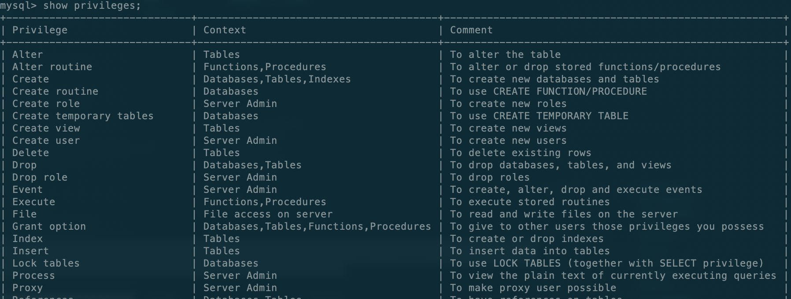
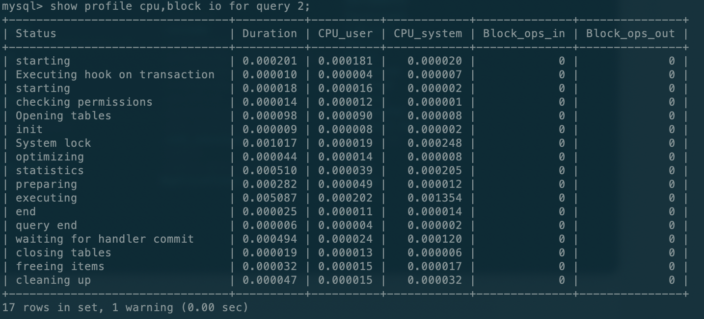
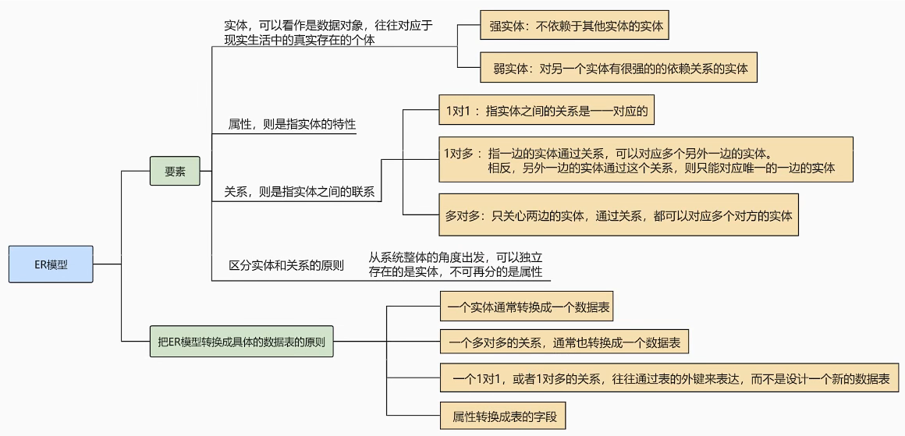

# 高级前篇

## 远程访问问题

在保证网络，端口，防火墙等允许访问后，还需要对需要登陆的用户进行配置；

首先查看用户配置，mysql库的user表：`use mysql`;

```mysql
mysql> select user,host from user;
+------------------+-----------+
| user             | host      |
+------------------+-----------+
| mysql.infoschema | localhost |
| mysql.session    | localhost |
| mysql.sys        | localhost |
| root             | localhost |
+------------------+-----------+
```

host表明了该用户允许被访问的IP；可以用%来进行模糊匹配，如果直接设置为%，则表示任意ip都可以访问。

执行

```mysql
update user set host='%' where user='root';
flush privileges; # Host修改完成后记得执行flush privileges使配置立即生效
```

这样才能保证远程访问是允许的。


## 字符集

MySQL有4个级别的字符集和比较规则，分别是：

- 服务器级别
- 数据库级别
- 表级别
- 列级别

查看字符集

```mysql
mysql> show variables like 'character%';
+--------------------------+-------------------------------------------------------+
| Variable_name            | Value                                                 |
+--------------------------+-------------------------------------------------------+
| character_set_client     | utf8mb3                                               |
| character_set_connection | utf8mb3                                               |
| character_set_database   | utf8mb4                                               |
| character_set_filesystem | binary                                                |
| character_set_results    | utf8mb3                                               |
| character_set_server     | utf8mb3                                               |
| character_set_system     | utf8mb3                                               |
| character_sets_dir       | /usr/local/mysql-8.0.40-macos14-arm64/share/charsets/ |
+--------------------------+-------------------------------------------------------+
```

- character_set_server：服务器级别的字符集
- character_set_database：当前数据库的字符集，从这也可以看到mysql8确实默认是使用utf8mb4存储数据了。
- character_set_client：服务器解码请求时使用的字符集
- character_set_connection：服务器处理请求时会把请求字符串从character_set_client转为character_set_connection
- character_set_results：服务器向客户端返回数据时使用的字符集


**服务器级别**

character_set_server ：服务器级别的字符集。

可以在启动服务器程序时通过启动选项或者在服务器程序运行过程中使用 SET 语句修改这两个变量

的值。比如可以在配置文件中这样写：

```cnf
[server]
character_set_server=gbk # 默认字符集
collation_server=gbk_chinese_ci #对应的默认的比较规则
```

**2.** **数据库级别**

character_set_database ：当前数据库的字符集

在创建和修改数据库的时候可以指定该数据库的字符集和比较规则，具体语法如下：

```mysql
CREATE DATABASE 数据库名
[[DEFAULT] CHARACTER SET 字符集名称]
[[DEFAULT] COLLATE 比较规则名称];
ALTER DATABASE 数据库名
[[DEFAULT] CHARACTER SET 字符集名称]
[[DEFAULT] COLLATE 比较规则名称];
```

**3.** **表级别**

也可以在创建和修改表的时候指定表的字符集和比较规则，语法如下：

```mysql
CREATE TABLE 表名 (列的信息)
[[DEFAULT] CHARACTER SET 字符集名称]
[COLLATE 比较规则名称]]
ALTER TABLE 表名
[[DEFAULT] CHARACTER SET 字符集名称]
[COLLATE 比较规则名称]
```

**4.** **列级别**

对于存储字符串的列，同一个表中的不同的列也可以有不同的字符集和比较规则。在创建和修改列定义的时候可以指定该列的字符集和比较规则，语法如下：

```mysql
CREATE TABLE 表名(
列名 字符串类型 [CHARACTER SET 字符集名称] [COLLATE 比较规则名称],
其他列...
);
ALTER TABLE 表名 MODIFY 列名 字符串类型 [CHARACTER SET 字符集名称] [COLLATE 比较规则名称];
```


**字符集与比较规则**

```mysql
mysql> show character set; # 共 41 个字符集
+----------+---------------------------------+---------------------+--------+
| Charset  | Description                     | Default collation   | Maxlen |
+----------+---------------------------------+---------------------+--------+
| ascii    | US ASCII                        | ascii_general_ci    |      1 |
| binary   | Binary pseudo charset           | binary              |      1 |
| gbk      | GBK Simplified Chinese          | gbk_chinese_ci      |      2 |
| latin1   | cp1252 West European            | latin1_swedish_ci   |      1 |
| utf8mb3  | UTF-8 Unicode                   | utf8mb3_general_ci  |      3 |
| utf8mb4  | UTF-8 Unicode                   | utf8mb4_0900_ai_ci  |      4 |
...
+----------+---------------------------------+---------------------+--------+

mysql> SHOW COLLATION LIKE 'utf8%'; # 117 行
+-----------------------------+---------+-----+---------+----------+---------+---------------+
| Collation                   | Charset | Id  | Default | Compiled | Sortlen | Pad_attribute |
+-----------------------------+---------+-----+---------+----------+---------+---------------+
| utf8mb3_general_ci          | utf8mb3 |  33 | Yes     | Yes      |       1 | PAD SPACE     |
| utf8mb4_0900_ai_ci          | utf8mb4 | 255 | Yes     | Yes      |       0 | NO PAD        |
| utf8mb4_0900_as_ci          | utf8mb4 | 305 |         | Yes      |       0 | NO PAD        |
| utf8mb4_0900_as_cs          | utf8mb4 | 278 |         | Yes      |       0 | NO PAD        |
| utf8mb4_0900_bin            | utf8mb4 | 309 |         | Yes      |       1 | NO PAD        |
| utf8mb4_general_ci          | utf8mb4 |  45 |         | Yes      |       1 | PAD SPACE     |
| utf8mb4_german2_ci          | utf8mb4 | 244 |         | Yes      |       8 | PAD SPACE     |
+-----------------------------+---------+-----+---------+----------+---------+---------------+
```

> utf8 与 utf8mb4

utf8 字符集表示一个字符需要使用1～4个字节，常用的一些字符使用1～3个字节就可以表示了,emoji则需要使用四个字节存储。而字符集表示一个字符所用的最大字节长度，在某些方面会影响系统的存储和性能，所以设计MySQL的设计者偷偷的定义了两个概念：

- utf8mb3 ：阉割过的 utf8 字符集，只使用1～3个字节表示字符。
- utf8mb4 ：正宗的 utf8 字符集，使用1～4个字节表示字符。

> **比较规则**

utf8_polish_ci 表示以波兰语的规则比较， utf8_spanish_ci 是以西班牙语的规则比较， utf8_general_ci 是一种通用的比较规则。

后缀表示该比较规则是否区分语言中的重音、大小写。具体如下：


## sql大小写规范

在 SQL 中，关键字和函数名是不用区分字母大小写的，比如 SELECT、WHERE、ORDER、GROUP BY 等关键字，以及 ABS、MOD、ROUND、MAX 等函数名。

不过在 SQL 中，还是要确定大小写的规范，因为在 Linux 和 Windows 环境下，会遇到不同的大小写问题。 windows系统默认大小写不敏感 ，但是 linux系统是大小写敏感的 。

```mysql
mysql> show variables like '%lower_case_table_names'; # 这是我的mac
+------------------------+-------+
| Variable_name          | Value |
+------------------------+-------+
| lower_case_table_names | 2     |
+------------------------+-------+
```

- 默认为0，大小写敏感 。
- 设置1，大小写不敏感。创建的表，数据库都是以小写形式存放在磁盘上，对于sql语句都是转换为小写对表和数据库进行查找。
- 设置2，创建的表和数据库依据语句上格式存放，凡是查找都是转换为小写进行。

> MySQL在Linux下数据库名、表名、列名、别名大小写规则是这样的：
>
> - 数据库名、表名、表的别名、变量名是严格区分大小写的；
> - 关键字、函数名称在 SQL 中不区分大小写；
> - 列名（或字段名）与列的别名（或字段别名）在所有的情况下均是忽略大小写的；
>
> MySQL在Windows的环境下全部不区分大小写
>
> 建议采取的规范
>
> - 关键字和函数名称全部大写；
> - 数据库名、表名、表别名、字段名、字段别名等全部小写；
> - SQL 语句必须以分号结尾。


## sql_mode

**宽松模式：**

如果设置的是宽松模式，那么我们在插入数据的时候，即便是给了一个错误的数据，也可能会被接受，并且不报错。

举例 ：表中有一个字段为name，给name设置的字段类型时 char(10) ，在插入数据的时候，其中name这个字段,如'1234567890abc'，超过了设定的字段长度10，不会报错，并且取前10个字符存上，也就是说被存为'1234567890'，而'abc'就没有了。

应用场景 ：通过设置sql mode为宽松模式，来保证大多数sql符合标准的sql语法，这样应用在不同数据库之间进行 迁移 时，则不需要对业务sql 进行较大的修改。

**严格模式：**

出现上面宽松模式的错误，应该报错才对，所以MySQL5.7版本就将sql_mode默认值改为了严格模式。

改为严格模式后可能会存在的问题：若设置模式中包含了 NO_ZERO_DATE ，那么MySQL数据库不允许插入零日期，插入零日期会抛出错误而不是警告。例如，表中含字段TIMESTAMP列（如果未声明为NULL或显示DEFAULT子句）将自动分配DEFAULT '0000-00-00 00:00:00'（零时间戳），这会不满足sql_mode中的NO_ZERO_DATE而报错。

查看

```mysql
mysql> select @@session.sql_mode;
| @@session.sql_mode
|ONLY_FULL_GROUP_BY,STRICT_TRANS_TABLES,NO_ZERO_IN_DATE,NO_ZERO_DATE,ERROR_FOR_DIVISION_BY_ZERO,NO_ENGINE_SUBSTITUTION 

mysql> select @@global.sql_mode;
| @@global.sql_mode
|ONLY_FULL_GROUP_BY,STRICT_TRANS_TABLES,NO_ZERO_IN_DATE,NO_ZERO_DATE,ERROR_FOR_DIVISION_BY_ZERO,NO_ENGINE_SUBSTITUTION

mysql> show variables like 'sql_mode';
| Variable_name | Value  |
| sql_mode      | ONLY_FULL_GROUP_BY,STRICT_TRANS_TABLES,NO_ZERO_IN_DATE,NO_ZERO_DATE,ERROR_FOR_DIVISION_BY_ZERO,NO_ENGINE_SUBSTITUTION |
```


## MySQL的数据目录

查看mysql数据存放目录，进而可以查看mysql的安装目录。

```mysql
mysql> show variables like 'datadir';
+---------------+------------------------+
| Variable_name | Value                  |
+---------------+------------------------+
| datadir       | /usr/local/mysql/data/ |
+---------------+------------------------+
```


bin目录放了mysqladmin, mysqlbinlog等命令工具。data存放的是各个表格的具体数据。

查看配置文件所在目录：可以在mysql的help打印信息中找到：

```sh
Default options are read from the following files in the given order:
/etc/my.cnf /etc/mysql/my.cnf /usr/local/mysql/etc/my.cnf ~/.my.cnf 
在mac上，默认只有/etc/my.cnf这个文件。里面的数据也很少：
➜  ~ cat /etc/my.cnf
[mysqld]
character-set-server=utf8
[client]
default-character-set=utf8
```


### 系统数据库

有4个数据库是属于MySQL自带的系统数据库。

`mysql`：MySQL 系统自带的核心数据库，它存储了MySQL的用户账户和权限信息，一些存储过程、事件的定义信息，一些运行过程中产生的日志信息，一些帮助信息以及时区信息等。

`information_schema`：MySQL 系统自带的数据库，这个数据库保存着MySQL服务器维护的所有其他数据库的信息 ，比如有哪些表、哪些视图、哪些触发器、哪些列、哪些索引。这些信息并不是真实的用户数据，而是一些描述性信息，有时候也称之为`元数据`。在系统数据库 information_schema 中提供了一些以innodb_sys 开头的表，用于表示内部系统表。

`performance_schema`：MySQL 系统自带的数据库，这个数据库里主要保存MySQL服务器运行过程中的一些状态信息，可以用来 监控 MySQL 服务的各类性能指标 。包括统计最近执行了哪些语句，在执行过程的每个阶段都花费了多长时间，内存的使用情况等信息。

`sys`：MySQL 系统自带的数据库，这个数据库主要是通过 视图 的形式把 information_schema 和 performance_schema 结合起来，帮助系统管理员和开发人员监控 MySQL 的技术性能。里面有一些metrics用于展示。


### 数据

```sh
 ✘ liushun@ls  /usr/local/mysql  sudo ls data          
#ib_16384_0.dblwr		ca.pem				mysqld.my
#ib_16384_1.dblwr		client-cert.pem			performance_schema
#innodb_redo			client-key.pem			private_key.pem
#innodb_temp			component_keyring_file.cnf	public_key.pem
atguigudb			ib_buffer_pool			server-cert.pem
auto.cnf			ibdata1				server-key.pem
binlog.000001			ibtmp1				sys
binlog.000002			mysql				undo_001
binlog.000003			mysql.ibd			undo_002
binlog.index			mysqld.local.err
ca-key.pem			mysqld.local.pid
```

数据目录下的文件和子目录比较多，除了 information_schema 这个系统数据库外，其他的数据库在 数据目录 下都有对应的子目录。然后每个库文件夹下都会为每个表创建一个ibd文件。

```sh
 liushun@ls  /usr/local/mysql  sudo ls data/atguigudb         
b.ibd		countries.ibd	departments.ibd	goods.ibd	job_history.ibd	locations.ibd	regions.ibd
c.ibd		d.ibd		employees.ibd	job_grades.ibd	jobs.ibd	order.ibd
```

> [!IMPORTANT]
>
> 举例： 数据库a ， 表b 。
>
> 1、如果表b采用 InnoDB ，data\a中会产生1个或者2个文件：
>
> - `b.frm` ：描述表结构文件，字段长度等
> - 如果采用 系统表空间 模式的，数据信息和索引信息都存储在 ibdata1 中
> - 如果采用 独立表空间 存储模式，data\a中还会产生 `b.ibd` 文件（存储数据信息和索引信息）
>
> 此外：
>
> - MySQL5.7 中会在data/a的目录下生成 db.opt 文件用于保存数据库的相关配置。比如：字符集、比较规则。而MySQL8.0不再提供db.opt文件。
> - **MySQL8.0中不再单独提供`b.frm`，而是合并在`b.ibd`文件中。**
>
> 2、如果表b采用 MyISAM ，data\a中会产生3个文件：
>
> - MySQL5.7 中： `b.frm` ：描述表结构文件，字段长度等。MySQL8.0 中 `b.xxx.sdi` ：描述表结构文件，字段长度等
> - `b.MYD`(MYData)：数据信息文件，存储数据信息(如果采用独立表存储模式)
> - `b.MYI` (MYIndex)：存放索引信息文件


### 表在文件系统表示

> 系统表空间（system table space）

默认情况下，InnoDB会在数据目录下创建一个名为 ibdata1 、大小为 12M 的文件，这个文件就是对应的`系统表空间`在文件系统上的表示。怎么才12M？注意这个文件是自扩展文件 ，当不够用的时候它会自己增加文件大小。

当然，如果想让系统表空间对应文件系统上多个实际文件，或者仅仅觉得原来的 ibdata1 这个文件名难听，那可以在MySQL启动时配置对应的文件路径以及它们的大小，比如修改一下my.cnf 配置文件：

```cnf
[server]
innodb_data_file_path=data1:512M;data2:512M:autoextend
```

> 独立表空间

在MySQL5.6.6以及之后的版本中，InnoDB并不会默认的把各个表的数据存储到系统表空间中，而是为每一个表建立一个独立表空间 ，也就是说创建了多少个表，就有多少个独立表空间。使用`独立表空间`来存储表数据的话，会在该表所属数据库对应的子目录下创建一个表示该独立表空间的文件，文件名和表名相同，只不过添加了一个 .ibd 的扩展名而已，所以完整的文件名称长这样：`table.ibd`。

> 系统表空间与独立表空间的设置

可以自己指定使用 系统表空间 还是 独立表空间 来存储数据，这个功能由启动参数`innodb_file_per_table`控制。

```cnf
[server]
innodb_file_per_table=0 # 0：代表使用系统表空间； 1：代表使用独立表空间
```

默认是1，也就是开启的。

```mysql
mysql> show variables like 'innodb_file_per_table';
+-----------------------+-------+
| Variable_name         | Value |
+-----------------------+-------+
| innodb_file_per_table | ON    |
+-----------------------+-------+
```


## 用户与权限管理

### 权限操作

查看有哪些权限



查看用户权限

```mysql
SHOW GRANTS; # 或
SHOW GRANTS FOR CURRENT_USER; # 或
SHOW GRANTS FOR CURRENT_USER();
SHOW GRANTS FOR 'user'@'主机地址' ;
```

收回权限

```mysql
REVOKE 权限1,权限2,…权限n ON 数据库名称.表名称 FROM 用户名@用户地址;
REVOKE ALL PRIVILEGES ON *.* FROM joe@'%';
REVOKE SELECT,INSERT,UPDATE,DELETE ON mysql.* FROM joe@localhost;
```


授予权限，两种方式，通过角色赋予和直接赋予

直接赋予：该权限如果发现没有该用户，则会直接新建一个用户。

```mysql
GRANT 权限1,权限2,…权限n ON 数据库名称.表名称 TO 用户名@用户地址 [IDENTIFIED BY ‘密码口令’];
GRANT SELECT,INSERT,DELETE,UPDATE ON atguigudb.* TO li4@localhost ;
GRANT ALL PRIVILEGES ON *.* TO joe@'%' IDENTIFIED BY '123'; # 所有权限，但是不包括grant权限。
```

通过角色赋予：先创建角色，为角色赋予权限，然后将角色分配给用户。

引入角色的目的是方便管理拥有相同权限的用户。

```mysql
# 创建角色
CREATE ROLE 'role_name'[@'host_name'] [,'role_name'[@'host_name']]...
# 赋予角色权限
GRANT privileges ON table_name TO 'role_name'[@'host_name'];
# 分配角色
GRANT role [,role2,...] TO user [,user2,...];
# 激活角色，如果不激活，那么为用户分配的角色时不会生效的
SET DEFAULT ROLE ALL TO 'kangshifu'@'localhost';
# 或者开启activate_all_roles_on_login，等用户登陆的时候，会自动激活他所拥有的角色。
SET GLOBAL activate_all_roles_on_login=ON;
```


### 权限表分析

**user表**


这些字段可以分成4类，分别是范围列（或用户列）、权限列、安全列和资源控制列。

> 范围列（或用户列）

host ： 表示连接类型；user ： 表示用户名；password ： 密码。mysql 5.7 及之后版本的密码保存到 authentication_string 字段中不再使用password 字段。

> 权限列

- Grant_priv字段：表示是否拥有GRANT权限。Shutdown_priv字段：表示是否拥有停止MySQL服务的权限
- Super_priv字段：表示是否拥有超级权限
- Execute_priv字段：表示是否拥有EXECUTE权限。拥有EXECUTE权限，可以执行存储过程和函数。
- 等等等等等

> 安全列

安全列只有6个字段，其中两个是ssl相关的（ssl_type、ssl_cipher），用于加密；两个是x509相关的（x509_issuer、x509_subject），用于 标识用户 ；另外两个Plugin字段用于 验证用户身份 的插件，该字段不能为空。如果该字段为空，服务器就使用内建授权验证机制验证用户身份。

> 资源控制列

资源控制列的字段用来 限制用户使用的资源 ，包含4个字段，分别为：

①max_questions，用户每小时允许执行的查询操作次数； ②max_updates，用户每小时允许执行的更新操作次数； ③max_connections，用户每小时允许执行的连接操作次数； ④max_user_connections，用户允许同时建立的连接次数。


**db表**


**用户列** db表用户列有3个字段，分别是Host、User、Db。这3个字段分别表示主机名、用户名和数据库名。表示从某个主机连接某个用户对某个数据库的操作权限，这3个字段的组合构成了db表的主键。

**权限列**

Create_routine_priv和Alter_routine_priv这两个字段决定用户是否具有创建和修改存储过程的权限等等。


**tables_priv表和columns_priv表**

tables_priv表用来对表设置操作权限 ，columns_priv表用来对表的某一列设置权限 。

tables_priv表有8个字段，分别是Host、Db、User、Table_name、Grantor、Timestamp、Table_priv和Column_priv，各个字段说明如下：

- Host 、 Db 、 User 和 Table_name 四个字段分别表示主机名、数据库名、用户名和表名。
- Grantor表示修改该记录的用户。
- Timestamp表示修改该记录的时间。
- Table_priv 表示对象的操作权限。包括Select、Insert、Update、Delete、Create、Drop、Grant、References、Index和Alter。
- Column_priv字段表示对表中的列的操作权限，包括Select、Insert、Update和References。

而columns_priv的结构更加简单，如下所示，更加细化了一下。


### 访问控制

> 连接核实阶段

当用户试图连接MySQL服务器时，服务器基于用户的身份以及用户是否能提供正确的密码验证身份来确定接受或者拒绝连接。即客户端用户会在连接请求中提供用户名、主机地址、用户密码，MySQL服务器接收到用户请求后，会使用user表中的host、user和authentication_string这3个字段匹配客户端提供信息。

服务器只有在user表记录的Host和User字段匹配客户端主机名和用户名，并且提供正确的密码时才接受连接。如果连接核实没有通过，服务器就完全拒绝访问；否则，服务器接受连接，然后进入阶段2等待用户请求。

> 请求核实阶段

一旦建立了连接，服务器就进入了访问控制的阶段2，也就是请求核实阶段。对此连接上进来的每个请求，服务器检查该请求要执行什么操作、是否有足够的权限来执行它，这正是需要授权表中的权限列发挥作用的地方。这些权限可以来自user、db、table_priv和column_priv表。确认权限时，MySQL首先检查user表 ，如果指定的权限没有在user表中被授予，那么MySQL就会继续检查db表 ，db表是下一安全层级，其中的权限限定于数据库层级，在该层级的SELECT权限允许用户查看指定数据库的所有表中的数据；如果在该层级没有找到限定的权限，则MySQL继续 检查tables_priv表以及 columns_priv表 ，如果所有权限表都检查完毕，但还是没有找到允许的权限操作，MySQL将返回错误信息，用户请求的操作不能执行，操作失败。


## 逻辑架构

说明简图：


详细架构：


- 连接层：主要是指数据库连接池，会负责处理所有客户端接入的工作。
- 服务层：主要包含`SQL`接口、解析器、优化器以及缓存缓冲区（mysql8已经废弃这个模块了）四块区域。
- 存储引擎层：这里是指`MySQL`支持的各大存储引擎，如`InnoDB、MyISAM`等。
- 文件系统层：涵盖了所有的日志，以及数据、索引文件，位于系统硬盘上。


### 连接层

系统（客户端）访问 MySQL 服务器前，做的第一件事就是建立 TCP 连接。

经过三次握手建立连接成功后， MySQL 服务器对 TCP 传输过来的账号密码做身份认证、权限获取。

- **用户名或密码不对，会收到一个Access denied for user错误，客户端程序结束执行**
- **用户名密码认证通过，会从权限表查出账号拥有的权限与连接关联，之后的权限判断逻辑，都将依赖于此时读到的权限**

TCP 连接收到请求后，必须要分配给一个线程专门与这个客户端的交互。所以还会有个线程池，去走后面的流程。每一个连接从线程池中获取线程，省去了创建和销毁线程的开销。


### 服务层

- **SQL Interface: SQL接口**

  - 接收用户的SQL命令，并且返回用户需要查询的结果。比如SELECT ... FROM就是调用SQL Interface

  - MySQL支持DML（数据操作语言）、DDL（数据定义语言）、存储过程、视图、触发器、自定义函数等多种SQL语言接口

- **Parser: 解析器**

  - 在解析器中对 SQL 语句进行语法分析、语义分析。将SQL语句分解成数据结构，并将这个结构传递到后续步骤，以后SQL语句的传递和处理就是基于这个结构的。如果在分解构成中遇到错误，那么就说明这个SQL语句是不合理的。

  - 在SQL命令传递到解析器的时候会被解析器验证和解析，并为其创建 语法树 ，并根据数据字典丰富查询语法树，会验证该客户端是否具有执行该查询的权限 。创建好语法树后，MySQL还会对SQl查询进行语法上的优化，进行查询重写。

- **Optimizer: 查询优化器**

  - SQL语句在语法解析之后、查询之前会使用查询优化器确定 SQL 语句的执行路径，生成一个执行计划 。这个执行计划表明应该 使用哪些索引进行查询（全表检索还是使用索引检索），表之间的连接顺序如何，最后会按照执行计划中的步骤调用存储引擎提供的方法来真正的执行查询，并将查询结果返回给用户。

  - 它使用`选取-投影-连接`策略进行查询。例如：`SELECT id,name FROM student WHERE gender = '女';`

  - 这个SELECT查询先根据WHERE语句进行选取 ，而不是将表全部查询出来以后再进行gender过滤。 这个SELECT查询先根据id和name进行属性投影，而不是将属性全部取出以后再进行过滤，将这两个查询条件连接起来生成最终查询结果。

- **Caches & Buffers：查询缓存组件**

  - MySQL内部维持着一些Cache和Buffer，比如Query Cache用来缓存一条SELECT语句的执行结果，如果能够在其中找到对应的查询结果，那么就不必再进行查询解析、优化和执行的整个过程了，直接将结果反馈给客户端。

  - 这个缓存机制是由一系列小缓存组成的。比如表缓存，记录缓存，key缓存，权限缓存等 。这个查询缓存可以在不同客户端之间共享。

  - 从MySQL 5.7.20开始，不推荐使用查询缓存，并在 MySQL 8.0中删除 。

> **大多数情况查询缓存就是个鸡肋，为什么呢？**
>
> 1. 查询缓存是提前把查询结果缓存起来，这样下次不需要执行就可以直接拿到结果。需要说明的是，在MySQL 中的查询缓存，不是缓存查询计划，而是查询对应的结果。这就意味着查询匹配的鲁棒性大大降低 ，只有相同的查询操作才会命中查询缓存 。两个查询请求在任何字符上的不同（例如：空格、注释、大小写），都会导致缓存不会命中。因此 MySQL 的 查询缓存命中率不高 。
> 2. 同时，如果查询请求中包含某些系统函数、用户自定义变量和函数、一些系统表，如 mysql 、information_schema、 performance_schema 数据库中的表，那这个请求就不会被缓存。以某些系统函数举例，可能同样的函数的两次调用会产生不一样的结果，比如函数 NOW ，每次调用都会产生最新的当前时间，如果在一个查询请求中调用了这个函数，那即使查询请求的文本信息都一样，那不同时间的两次查询也应该得到不同的结果，如果在第一次查询时就缓存了，那第二次查询的时候直接使用第一次查询的结果就是错误的！
> 3. 此外，既然是缓存，那就有它缓存失效的时候 。MySQL的缓存系统会监测涉及到的每张表，只要该表的结构或者数据被修改，如对该表使用了 INSERT 、 UPDATE 、 DELETE 、 TRUNCATE TABLE 、 ALTER TABLE 、 DROP TABLE 或 DROP DATABASE 语句，那使用该表的所有高速缓存查询都将变为无效并从高速缓存中删除！对于更新压力大的数据库来说，查询缓存的命中率会非常低。


### 存储引擎层

插件式存储引擎层（ Storage Engines），**真正的负责了MySQL中数据的存储和提取，对物理服务器级别维护的底层数据执行操作，服务器通过API与存储引擎进行通信**。不同的存储引擎具有的功能不同，这样可以根据自己的实际需要进行选取。

mysql8支持的存储引擎如下：


### sql执行流程


**`SQL语句→查询缓存→解析器→优化器→执行器`**


**执行流程查看**

首先需要开启profiling，开启后才会记录每条语句的执行情况

```mysql
mysql> select @@profiling;
+-------------+
| @@profiling |
+-------------+
|           0 |
+-------------+
1 row in set, 1 warning (0.00 sec)

mysql> set profiling = 1;
Query OK, 0 rows affected, 1 warning (0.00 sec)
```

比如执行一个`select * from user;`，然后查看执行情况

```mysql
mysql> show profile;
+--------------------------------+----------+
| Status                         | Duration |
+--------------------------------+----------+
| starting                       | 0.000192 |
| Executing hook on transaction  | 0.000013 |
| starting                       | 0.000019 |
| checking permissions           | 0.000035 | # 权限检查
| Opening tables                 | 0.001515 | # 打开表
| init                           | 0.000032 | # 初始化
| System lock                    | 0.000021 | # 锁系统
| optimizing                     | 0.000014 | # 优化查询
| statistics                     | 0.000038 | 
| preparing                      | 0.000049 | # 准备
| executing                      | 0.001435 | # 执行
| end                            | 0.000020 |
| query end                      | 0.000009 |
| waiting for handler commit     | 0.000030 |
| closing tables                 | 0.000025 |
| freeing items                  | 0.000057 |
| cleaning up                    | 0.000063 |
+--------------------------------+----------+
```

可以查看更多详细信息：`show profile cpu,block io for query 2(query id 也就是你打开profiling后执行的第几条语句);`




### 数据库缓冲池

`InnoDB`存储引擎是以页为单位来管理存储空间的，增删改查操作其实本质上都是在访问页面（包括读页面、写页面、创建新页面等操作）。而磁盘 I/O 需要消耗的时间很多，而在内存中进行操作，效率则会高很多，为了能让数据表或者索引中的数据随时被我们所用，DBMS 会申请占用内存来作为数据缓冲池 ，在真正访问页面之前，需要把在磁盘上的页缓存到内存中的 Buffer Pool 之后才可以访问。

这样做的好处是可以让磁盘活动最小化，从而 减少与磁盘直接进行 I/O 的时间 。要知道，这种策略对提升 SQL 语句的查询性能来说至关重要。如果索引的数据在缓冲池里，那么访问的成本就会降低很多。

注意：他和查询缓存根本不是一回事


InnoDB 缓冲池包括了数据页、索引页、插入缓冲、锁信息、自适应 Hash 和数据字典信息等。缓冲池会优先对使用频次高的热数据进行加载。

缓冲池管理器会尽量将经常使用的数据保存起来，在数据库进行页面读操作的时候，首先会判断该页面是否在缓冲池中，如果存在就直接读取，如果不存在，就会通过内存或磁盘将页面存放到缓冲池中再进行读取。


缓冲池里的数据会定期刷新写回磁盘，如果崩溃导致缓冲池里的数据丢失，那么再次重启时，会有`Redo Log & Undo Log`来帮助恢复数据。

查看缓冲池大小和缓冲池实例个数：

```mysql
mysql> show variables like 'innodb_buffer_pool_size';
+-------------------------+-----------+
| Variable_name           | Value     |
+-------------------------+-----------+
| innodb_buffer_pool_size | 134217728 | # 128M
+-------------------------+-----------+
1 row in set (0.01 sec)
mysql> show variables like 'innodb_buffer_pool_instances';
+------------------------------+-------+
| Variable_name                | Value |
+------------------------------+-------+
| innodb_buffer_pool_instances | 1     |
+------------------------------+-------+
1 row in set (0.00 sec)
```

每个缓冲池实例大小为`innodb_buffer_pool_size/innodb_buffer_pool_instances`。


## 存储引擎

mysql8.0.40中的存储引擎列表


查看默认引擎：

```mysql
mysql> SELECT @@default_storage_engine;
+--------------------------+
| @@default_storage_engine |
+--------------------------+
| InnoDB                   |
+--------------------------+
1 row in set (0.00 sec)

mysql> show variables like '%storage_engine%';
+---------------------------------+-----------+
| Variable_name                   | Value     |
+---------------------------------+-----------+
| default_storage_engine          | InnoDB    |
| default_tmp_storage_engine      | InnoDB    |
| disabled_storage_engines        |           |
| internal_tmp_mem_storage_engine | TempTable |
+---------------------------------+-----------+
4 rows in set (0.00 sec)
```


### Innodb

**InnoDB** **引擎：具备外键支持功能的事务存储引擎**

MySQL从3.23.34a开始就包含InnoDB存储引擎。 大于等于5.5之后，默认采用InnoDB引擎 。

InnoDB是MySQL的 默认事务型引擎 ，它被设计用来处理大量的短期(short-lived)事务。可以确保事务的完整提交(Commit)和回滚(Rollback)。InnoDB是 为处理巨大数据量的最大性能设计 。

对比MyISAM的存储引擎， InnoDB写的处理效率差一些 ，并且会占用更多的磁盘空间以保存数据和索引。

MyISAM只缓存索引，不缓存真实数据；InnoDB不仅缓存索引还要缓存真实数据， 对内存要求较高 ，而且内存大小对性能有决定性的影响。

### MyISAM

**MyISAM 引擎：主要的非事务处理存储引擎**

MyISAM提供了大量的特性，包括全文索引、压缩、空间函数(GIS)等，但MyISAM 不支持事务、行级锁、外键 ，有一个毫无疑问的缺陷就是崩溃后无法安全恢复 。

5.5之前默认的存储引擎，优势是访问的 速度快 ，适用于对事务完整性没有要求或者以SELECT、INSERT为主的应用

针对数据统计有额外的常数存储。故而 count(*) 的查询效率很高

数据文件结构：

- 表名.frm 存储表结构
- 表名.MYD 存储数据 (MYData)
- 表名.MYI 存储索引 (MYIndex)

### CSV

**CSV 引擎：以csv文件格式存储数据**

创建CSV表还会创建相应的 元文件 ，用于 存储表的状态 和 表中存在的行数 。此文件的名称与表的名称相同，后缀为 CSM 。然后数据存储的文件为表名.csv。csv文件就是以逗号分隔每个数据的文件，然后一条数据占一行。

### Memory

**Memory 引擎：置于内存的表**

Memory采用的逻辑介质是内存， 响应速度很快 ，但是当mysqld守护进程崩溃的时候数据会丢失 。另外，要求存储的数据是数据长度不变的格式，比如，Blob和Text类型的数据不可用(长度不固定的)。

**主要特征：**

Memory同时支持哈希（HASH）索引 和 B+树索引，数据文件与索引文件分开存储。

Memory表至少比MyISAM表要快一个数量级 。

MEMORY 表的大小是受到限制的。表的大小主要取决于两个参数，分别是 max_rows 和 max_heap_table_size 。其中，max_rows可以在创建表时指定；max_heap_table_size的大小默认为16MB，可以按需要进行扩大。

缺点：其数据易丢失，生命周期短。基于这个缺陷，选择MEMORY存储引擎时需要特别小心。


## 数据库设计规范

### 键和属性

范式的定义会使用到主键和候选键，数据库中的键由一个或多个属性组成。数据表中常用的几种键和属性的定义如下：

- `超键`：能唯一标识元组的属性集叫做超键
- `候选键`：如果超键不包括多余的属性，那么这个超键就是候选键
- `主键`：用户可以从候选键中选择一个作为主键
- `外键`：如果数据表R1中的某属性集不是R1的主键，而是另一个数据表R2的主键，那么这个属性集就是数据表R1的外键。
- `主属性`：包含在任一候选键中的属性称为主属性
- `非主属性`：与主属性相对，指的是不包含在任何一个候选键中的属性。

通常，也称候选键为码，把主键称为主码。


### 范式

目前关系型数据库有六种常见范式，按照范式级别，从低到高分别是：第一范式（1NF）、第二范式 （2NF）、第三范式（3NF）、巴斯-科德范式（BCNF）、第四范式(4NF）和第五范式（5NF，又称完美范式）。

数据库的范式设计越高阶，夯余度就越低，同时高阶的范式一定符合低阶范式的要求，满足最低要求的范式是第一范式（1NF）。在第一范式的基础上进一步满足更多规范的要求称为第二范式（2NF），其余范式以此类推。

一般来说，在关系型数据库设计中，最高也就遵循到`BCNF`, 普遍还是`3NF`。但也不绝对，有时候为了提高某些查询性能，我们还需要破坏范式规则，也就是`反规范化`。

- **第一范式 1NF**

第一范式主要确保数据库中每个字段的值必须具有`原子性`，也就是说数据表中每个字段的值为`不可再次拆分`的最小数据单元。

- **第二范式 2NF**

第二范式要求，在满足第一范式的基础上，还要**满足数据库里的每一条数据记录，都是可唯一标识的。而且所有非主键字段，都必须完全依赖主键，不能只依赖主键的一部分**。如果知道主键的所有属性的值，就可以检索到任何元组（行）的任何属性的任何值。（要求中的主键，其实可以扩展替换为候选键）。

比如：`成绩表` （学号，课程号，成绩）关系中，（学号，课程号）可以决定成绩，但是学号不能决定成绩，课 程号也不能决定成绩，所以“（学号，课程号）→成绩”就是 `完全依赖关系` 。

- **第三范式 3NF**

第三范式是在第二范式的基础上，确保数据表中的每一个非主键字段都和主键字段直接相关，也就是说，**要求数据表中的所有非主键字段不能依赖于其他非主键字段**。（即，不能存在非主属性A依赖于非主属性B，非主属性B依赖于主键C的情况，即存在“A->B->C"的决定关系）通俗地讲，该规则的意思是所有`非主键属性`之间不能由依赖关系，必须`相互独立`。这里的主键可以扩展为候选键。

- BCNF

**在 3NF 的基础上消除了主属性对候选键的部分依赖或者传递依赖关系**。


**总结**

关于数据表的设计，有三个范式要遵循：

第一范式：确保每列保持`原子性`，数据库的每一列都是不可分割的原子数据项，不可再分的最小数据单元，而不能是集合、数组、记录等非原子数据项。

第二范式：确保每列都和主键`完全依赖`。尤其是在复合主键的情况下，非主键部分不应该依赖于部分主键。

第三范式：确保每列都是主键列`直接相关`，而不是间接相关。


**范式优缺点**

优点：数据的标准化有助于消除数据库中的数据冗余，第三范式通常被认为在性能、扩展性和数据完整性方面达到了最好的平衡。

缺点：范式的使用，可能降低查询的效率。因为范式等级越高，设计出来的数据表就越多、越精细，数据的冗余度就越低，进行数据查询的时候就可能需要关联多张表，代价昂贵，也可能是一些索引策略失效。


**反范式化**

然而，有时候有的数据虽然冗余，但是对业务来说十分重要，这时候就需要遵循业务优先的原则，需要反范式化。

比如：数据库中数据量比较大，系统的UV和PV访问频次比较高的情况下，如果严格按照三大范式设计，读数据时会产生大量的关联查询，这时候可以通过在数据表中`增加冗余字段`来提高数据库的读性能。


### ER模型




### 数据库对象编写建议

**关于库**

1. 【强制】库的名称必须控制在32个字符以内，只能使用英文字母、数字和下划线，建议以英文字 母开头。
2. 【强制】库名中英文 一律小写 ，不同单词采用 下划线 分割。须见名知意。
3. 【强制】库的名称格式：业务系统名称_子系统名。
4. 【强制】库名禁止使用关键字（如type,order等）。
5. 【强制】创建数据库时必须 显式指定字符集 ，并且字符集只能是utf8或者utf8mb4。 创建数据库SQL举例：CREATE DATABASE crm_fund DEFAULT CHARACTER SET 'utf8' ;
6. 【建议】对于程序连接数据库账号，遵循 权限最小原则 使用数据库账号只能在一个DB下使用，不准跨库。程序使用的账号 原则上不准有drop权限 。
7. 【建议】临时库以 tmp_ 为前缀，并以日期为后缀； 备份库以 bak_ 为前缀，并以日期为后缀。

**关于表、列**

1. 【强制】表和列的名称必须控制在32个字符以内，表名只能使用英文字母、数字和下划线，建议 以 英文字母开头 。

2. 【强制】 表名、列名一律小写 ，不同单词采用下划线分割。须见名知意。

3. 【强制】表名要求有模块名强相关，同一模块的表名尽量使用 统一前缀 。比如：crm_fund_item

4. 【强制】创建表时必须 显式指定字符集 为utf8或utf8mb4。

5. 【强制】表名、列名禁止使用关键字（如type,order等）。

6. 【强制】创建表时必须 显式指定表存储引擎 类型。如无特殊需求，一律为InnoDB。

7. 【强制】建表必须有comment。

8. 【强制】字段命名应尽可能使用表达实际含义的英文单词或 缩写 。如：公司 ID，不要使用 corporation_id, 而用corp_id 即可。

9. 【强制】布尔值类型的字段命名为 is_描述 。如member表上表示是否为enabled的会员的字段命 名为 is_enabled。

10. 【强制】禁止在数据库中存储图片、文件等大的二进制数据 通常文件很大，短时间内造成数据量快速增长，数据库进行数据库读取时，通常会进行大量的随 机IO操作，文件很大时，IO操作很耗时。通常存储于文件服务器，数据库只存储文件地址信息。

11. 【建议】建表时关于主键： 表必须有主键

    (1)强制要求主键为id，类型为int或bigint，且为 auto_increment 建议使用unsigned无符号型。

    (2)标识表里每一行主体的字段不要设为主键，建议 设为其他字段如user_id，order_id等，并建立unique key索引。因为如果设为主键且主键值为随机 插入，则会导致innodb内部页分裂和大量随机I/O，性能下降。

12. 【建议】核心表（如用户表）必须有行数据的 创建时间字段 （create_time）和 最后更新时间字段 （update_time），便于查问题。

13. 【建议】表中所有字段尽量都是 NOT NULL 属性，业务可以根据需要定义 DEFAULT值 。 因为使用 NULL值会存在每一行都会占用额外存储空间、数据迁移容易出错、聚合函数计算结果偏差等问 题。

14. 【建议】所有存储相同数据的 列名和列类型必须一致 （一般作为关联列，如果查询时关联列类型 不一致会自动进行数据类型隐式转换，会造成列上的索引失效，导致查询效率降低）。

15. 【建议】中间表（或临时表）用于保留中间结果集，名称以 tmp_ 开头。 备份表用于备份或抓取源表快照，名称以 bak_ 开头。中间表和备份表定期清理。 

16. 【建议】创建表时，可以使用可视化工具。这样可以确保表、字段相关的约定都能设置上。

**关于索引**

1. 【强制】InnoDB表必须主键为id int/bigint auto_increment，且主键值 禁止被更新 。
2. 【强制】InnoDB和MyISAM存储引擎表，索引类型必须为 BTREE 。
3. 【建议】主键的名称以 pk_ 开头，唯一键以 uni_ 或 uk_ 开头，普通索引以 idx_ 开头，一律使用小写格式，以字段的名称或缩写作为后缀。
4. 【建议】多单词组成的columnname，取前几个单词首字母，加末单词组成column_name。如: sample 表 member_id 上的索引：idx_sample_mid。
5. 【建议】单个表上的索引个数 不能超过6个 。
6. 【建议】在建立索引时，多考虑建立 联合索引 ，并把区分度最高的字段放在最前面。
7. 【建议】在多表 JOIN 的SQL里，保证被驱动表的连接列上有索引，这样JOIN 执行效率最高。
8. 【建议】建表或加索引时，保证表里互相不存在 冗余索引 。 比如：如果表里已经存在key(a,b)， 则key(a)为冗余索引，需要删除。

**SQL编写**

1. 【强制】程序端SELECT语句必须指定具体字段名称，禁止写成 *。
2. 【建议】程序端insert语句指定具体字段名称，不要写成INSERT INTO t1 VALUES(…)。
3. 【建议】除静态表或小表（100行以内），DML语句必须有WHERE条件，且使用索引查找。
4. 【建议】INSERT INTO…VALUES(XX),(XX),(XX).. 这里XX的值不要超过5000个。 值过多虽然上线很 快，但会引起主从同步延迟。
5. 【建议】SELECT语句不要使用UNION，推荐使用UNION ALL，并且UNION子句个数限制在5个以 内。
6. 【建议】线上环境，多表 JOIN 不要超过5个表。
7. 【建议】减少使用ORDER BY，和业务沟通能不排序就不排序，或将排序放到程序端去做。ORDER BY、GROUP BY、DISTINCT 这些语句较为耗费CPU，数据库的CPU资源是极其宝贵的。
8. 【建议】包含了ORDER BY、GROUP BY、DISTINCT 这些查询的语句，WHERE 条件过滤出来的结果 集请保持在1000行以内，否则SQL会很慢。
9. 【建议】对单表的多次alter操作必须合并为一次 对于超过100W行的大表进行alter table，必须经过DBA审核，并在业务低峰期执行，多个alter需整 合在一起。 因为alter table会产生 表锁 ，期间阻塞对于该表的所有写入，对于业务可能会产生极 大影响。
10. 【建议】批量操作数据时，需要控制事务处理间隔时间，进行必要的sleep。
11. 【建议】事务里包含SQL不超过5个。 因为过长的事务会导致锁数据较久，MySQL内部缓存、连接消耗过多等问题。
12. 【建议】事务里更新语句尽量基于主键或UNIQUE KEY，如UPDATE… WHERE id=XX; 否则会产生间隙锁，内部扩大锁定范围，导致系统性能下降，产生死锁。


## 其他不想写的

### 日志篇

[看博客吧](https://www.cnblogs.com/chenguanqin/p/16366346.html)

### 主从复制

[主从复制](https://www.cnblogs.com/chenguanqin/p/16366347.html)

### 备份与恢复

[备份与恢复](https://www.cnblogs.com/chenguanqin/p/16366350.html)
