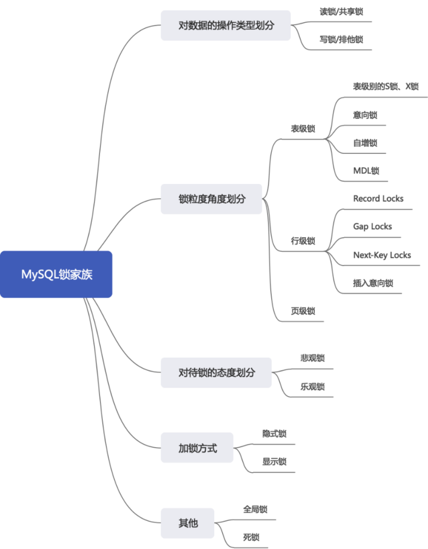
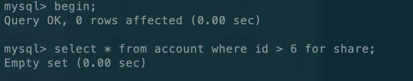
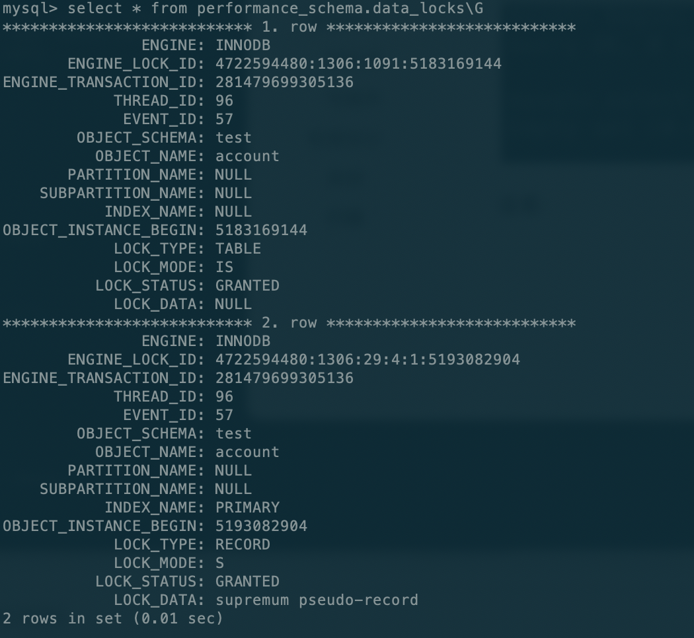
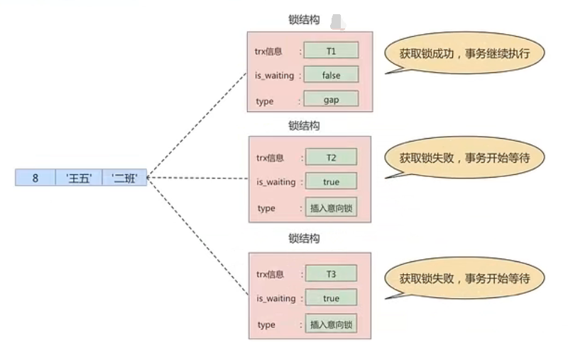

# 高级-锁

## 概述

`锁` 是计算机协调多个进程或线程 `并发访问某一资源` 的机制。

在数据库中，除传统的计算资源（如CPU、RAM、I/O等）的争用以外，数据也是一种供许多用户共享的资源。为保证数据的一致性，需要对`并发操作进行控制`，因此产生了`锁`。同时`锁机制`也为实现MySQL的各个`隔离级别`提供了保证。 `锁冲突` 也是影响数据库`并发访问性能`的一个重要因素。


### 并发事务访问分类

读-读：

即并发事务相继读取相同的记录，读取操作本身不会对记录有任何影响，并不会引起什么问题，所以允许这种情况的发生。


写-写：

即并发事务相继对相同的记录作出改动。在这种情况下会发生`脏写`的问题，任何一种隔离级别都不允许这种问题的发生。所以在多个未提交事务相继对一条记录做改动时，需要让它们`排队执行`，这个排队的过程其实是通过`锁`来实现的。

这个所谓的锁其实是一个 `内存中的结构` ，在事务执行前本来是没有锁的，也就是说一开始是没有 锁结构 和记录进行关联的，当一个事务想对这条记录做改动时，首先会看看内存中有没有与这条记录关联的 `锁结构` ，当没有的时候就会在内存中生成一个 `锁结构` 与之关联。


在 `锁结构` 里有很多信息，为了简化理解，只把两个比较重要的属性拿了出来：

- `trx信息`：代表这个锁结构是哪个事务生成的。
- `is_waiting` ：代表当前事务是否在等待。

当事务 `T1` 改动了这条记录后，就生成了一个`锁结构`与该记录关联，因为之前没有别的事务为这条记录加锁，所以 `is_waiting` 属性就是 `false` ，把这个场景就称之为 `获取锁成功`，或者 `加锁成功`，然后就可以继续执行操作了。

在事务 `T1` 提交之前，另一个事务 `T2` 也想对该记录做改动，那么先看看有没有锁结构与这条记录关联，发现有一个锁结构与之关联后，然后也生成了一个锁结构与这条记录关联，不过锁结构的 `is_waiting` 属性值为 `true` ，表示当前事务需要等待，这个场景就称之为 `获取锁失败`，或者 `加锁失败`。


读-写/写-读：

`读-写`或`写-读`，即一个事务进行读取操作，另一个进行改动操作。这种情况下可能发生`脏读`、`不可重复读`、`幻读`的问题。

各个数据库厂商对 `SQL标准` 的支持都可能不一样。比如MySQL在 `REPEATABLE READ` 隔离级别上就已经解决了 `幻读` 问题。


### 解决方案预览

怎么解决`脏读`、`不可重复读`、`幻读`这些问题呢？其实有两种可选的解决方案：

- 方案一：读操作利用多版本并发控制（`MVCC`），写操作进行`加锁`。

  所谓的`MVCC`，就是生成一个`ReadView`，通过ReadView找到符合条件的记录版本（历史版本由`undo日志`构建）。查询语句只能`读`到在生成ReadView之前`已提交事务所做的更改`，在生成ReadView之前未提交的事务或者之后才开启的事务所做的更改是看不到的。而`写操作`肯定针对的是`最新版本的记录`，读记录的历史版本和改动记录的最新版本本身并不冲突，也就是采用MVCC时，`读-写`操作并不冲突。

> 普通的SELECT语句在READ COMMITTED和REPEATABLE READ隔离级别下会使用到MVCC读取记录。
>
> - 在`READ COMMITTED`隔离级别下，一个事务在执行过程中每次执行SELECT操作时都会生成一个ReadView，ReadView的存在本身就保证了`事务不可以读取到未提交的事务所做的更改`，也就是避免了脏读现象；
> - 在`REPEATABLE READ`隔离级别下，一个事务在执行过程中只有`第一次执行SELECT操作`才会生成一个ReadView，之后的SELECT操作都`复用`这ReadView，这样也就避免了不可重复读和幻读的问题。

- 方案二：读、写操作都采用`加锁`的方式。

  `脏读` 的产生是因为当前事务读取了另一个未提交事务写的一条记录，如果另一个事务在写记录的时候就给这条记录加锁，那么当前事务就无法继续读取该记录了，所以也就不会有脏读问题的产生了。

  `不可重复读` 的产生是因为当前事务先读取一条记录，另外一个事务对该记录做了改动之后并提交之后，当前事务再次读取时会获得不同的值，如果在当前事务读取记录时就给该记录加锁，那么另一个事务就无法修改该记录，自然也不会发生不可重复读了。

  `幻读` 问题的产生是因为当前事务读取了一个范围的记录，然后另外的事务向该范围内插入了新记录，当前事务再次读取该范围的记录时发现了新插入的新记录。采用加锁的方式解决幻读问题就有一些麻烦，因为当前事务在第一次读取记录时幻影记录并不存在，所以读取的时候加锁就有点尴尬（因为并不知道给谁加锁)。

- 小结对比发现：

  - 采用`MVCC`方式的话，`读-写`操作彼此并不冲突，`性能更高`。
  - 采用`加锁`方式的话，`读-写`操作彼此需要`排队执行`，影响性能。

  一般情况下当然愿意采用`MVCC`来解决`读-写`操作并发执行的问题，但是业务在某些特殊情况下，要求必须采用`加锁`的方式执行。**默认是MVCC，加锁的方式需要在写sql的时候自己加锁，但是MVCC是存储引擎自主支持的。**


## 锁分类



### 类型划分

`共享锁`(Shared Lock，S Lock)和 `排他锁`（Exclusive Lock，X Lock)，也叫`读锁(readlock)`和`写锁(write lock)`。

- `读锁`：也称为`共享锁`、英文用`S`表示。针对同一份数据，多个事务的读操作可以同时进行而不会互相影响，相互不阻塞的。
- `写锁`：也称为`排他锁`、英文用`X`表示。当前写操作没有完成前，它会阻断其他写锁和读锁。这样就能确保在给定的时间里，只有一个事务能执行写入，并防止其他用户读取正在写入的同一资源。

只有读-读兼容，其他都不兼容。

#### 锁定读

在采用`加锁`方式解决`脏读`、`不可重复读`、`幻读`这些问题时，读取一条记录时需要获取该记录的`S锁`，其实是不严谨的，有时候需要在读取记录时就获取记录的`X锁`，来禁止别的事务读写该记录，为此MySQL提出了两种比较特殊的`SELECT`语句格式：

- 对读取的记录加`S锁`

  ```sql
  SELECT ... LOCK IN SHARE MODE;
  # 或
  SELECT ... FOR SHARE; #(8.0新增语法)
  ```

  在普通的SELECT语句后边加`LOCK IN SHARE NODE`，如果当前事务执行了该语句，那么它会为读取到的记录加s锁，这样允许别的事务继续获取这些记录的S锁(比方说别的事务也使用`SELECT ... LOCK IN SHAREMODE`语句来读取这些记录)，但是不能获取这些记录的X锁(比如使用`SELECT ... FOR UPDATE`语句来读取这些记录，或者直接修改这些记录)。如果别的事务想要获取这些记录的X锁，那么它们会阻塞，直到当前事务提交之后将这些记录上的`S锁` 释放掉。

- 对读取的记录加`X锁`：

  ```sql
  SELECT ... FOR UPDATE;
  ```

  在普通的SELECT语句后边加 `FOR UPDATE`，如果当前事务执行了该语句，那么它会为读取到的记录加X锁，这样既不允许别的事务获取这些记录的S锁(比方说别的事务使用`SELECT ... LOCK IN SHARE MODE`语句来读取这些记录)，也不允许获取这些记录的X锁(比如使用`SELECT ... FOR UPDATE`语句来读取这些记录，或者直接修改这些记录)。如果别的事务想要获取这些记录的S锁或者X锁，那么它们会阻塞，直到当前事务提交之后将这些记录上的`X锁`释放掉。

**MySQL8.0新特性：**

在5.7及之前的版本，SELECT ... FOR UPDATE，如果获取不到锁，会一直等待，直到`innodb_lock_wait_timeout`超时。在8.0版本中，SELECT ... FOR UPDATE, SELECT ... FOR SHARE 添加`NOWAIT`、`SKIP LOCKED`语法，跳过锁等待，或者跳过锁定。

- NOWAIT：如果查询的行已经加锁，会立即报错返回
- SKIP LOCKED：如果查询的行已经加锁，只返回结果中不包含被锁定的行

> [!WARNING]
>
> for update和for share只能对select语句作用，写在其他语句会报错。


#### 写操作

- `DELETE`：对一条记录做DELETE操作的过程其实是先在`B+`树中定位到这条记录的位置，然后获取这条记录的`X锁`，再执行`delete mark`操作。

- `UPDATE`：在对一条记录做UPDATE操作时分为三种情况：

  - 情况1：未修改该记录的键值，并且被更新的列占用的存储空间在修改前后未发生变化。则先在`B+`树中定位到这条记录的位置，然后再获取一下记录的`X锁`，最后在原记录的位置进行修改操作。
  - 情况2：未修改该记录的键值，并且至少有一个被更新的列占用的存储空间在修改前后发生变化。则先在`B+`树中定位到这条记录的位置，然后获取一下记录的`X锁`，将该记录彻底删除掉（就是把记录彻底移入垃圾链表），最后再插入一条新记录。新插入的记录由`INSERT`操作提供的`隐式锁`进行保护。
  - 情况3：修改该记录的键值，则相当于在原记录上做`DELECT`操作之后再来一次`INSERT`操作。加锁操作就需要按照DELETE和INSERT的规则进行了。

- `INSERT`：一般情况下，新插入一条记录的操作并不加锁，通过一种称之为`隐式锁`的结构来保护这条新插入的记录在本事务提交前不被别的事务访问。

  可以使用`select * from performance_schema.data_locks\G`查看

### 粒度划分

为了尽可能提高数据库的并发度，每次锁定的数据范围越小越好，理论上每次只锁定当前操作的数据的方案会得到最大的并发度，但是管理锁是很 `耗资源` 的事情（涉及获取、检查、释放锁等动作)。因此数据库系统需要在 `高并发响应` 和 `系统性能` 两方面进行平衡，这样就产生了“`锁粒度（Lock granularity)`"的概念。锁的粒度主要分为表级锁、页级锁和行锁。

#### 表锁

该锁会锁定整张表，它是MySQL中最基本的锁策略，并`不依赖于存储引擎`，并且表锁是`开销最少`的策略。由于表级锁一次会将整个表锁定，所以可以很好的`避免死锁`的问题。当然，锁的粒度大所带来最大的负面影响就是出现锁资源争用的概率也会最高，导致`并发率大打折扣`。

**① 表级别的S锁、X锁**

在对某个表执行SELECT、INSERT、DELETE、UPDATE语句时，InnoDB存储引擎是不会为这个表添加表级别的`S锁`或者`X锁`的。在对某个表执行一些诸如`ALTER TABLE`、`DROP TABLE`这类的`DDL`语句时，其他事务对这个表并发执行诸如SELECT、INSERT、DELETE、UPDATE的语句会发生阻塞。同理，某个事务中对某个表执行SELECT、INSERT、DELETE、UPDATE语句时，在其他会话中对这个表执行`DDL`语句也会发生阻塞。这个过程其实是通过在`server层`使用一种称之为`元数据锁`（英文名：`Metadata Locks`，简称`MDL`）结构来实现的。

一般情况下，不会使用InnoDB存储引擎提供的表级别的`S锁`和`X锁`。只会在一些特殊情况下，比方说`崩溃恢复`过程中用到。比如，在系统变量`autocommit=0，innodb_table_locks = 1`时，`手动`获取InnoDB存储引擎提供的表t 的`S锁`或者`X锁`可以这么写：

- `LOCK TABLES t READ`：InnoDB存储引擎会对表`t`加表级别的`S锁`。
- `LOCK TABLES t WRITE`：InnoDB存储引擎会对表`t`加表级别的`X锁`。
- `UNLOCK tables;`：释放加锁的表

不过尽量避免在使用InnoDB存储引擎的表上使用 `LOCK TABLES` 这样的手动锁表语句，它们并不会提供什么额外的保护，只是会降低并发能力而已。


**② 意向锁 （intention lock）**

InnoDB 支持`多粒度锁（multiple granularity locking）`，它允许`行级锁`与`表级锁`共存，而**意向锁**就是其中的一种`表锁`。

1、意向锁的存在是为了协调行锁和表锁的关系，支持多粒度（表锁与行锁）的锁并存。

2、意向锁是一种`不与行级锁冲突的表级锁`，这一点非常重要。

3、表明"某个事务正在某些行持有了锁或该事务准备去持有锁"

意向锁分为两种：

- **意向共享锁**（intention shared lock, IS）：事务有意向对表中的某些行加**`共享锁`**（S锁）

  ```sql
  -- 事务要获取某些行的 S 锁，必须先获得表的 IS 锁。 
  SELECT column FROM table ... LOCK IN SHARE MODE;
  ```

- **意向排他锁**（intention exclusive lock, IX）：事务有意向对表中的某些行加**`排他锁`**（X锁）

  ```sql
  -- 事务要获取某些行的 X 锁，必须先获得表的 IX 锁。 
  SELECT column FROM table ... FOR UPDATE;
  ```

即：意向锁是由存储引擎`自己维护的`，用户无法手动操作意向锁，在为数据行加共享 / 排他锁之前，InooDB 会先获取该数据行`所在数据表的对应意向锁`。

详细分析：

现在有两个事务，分别是T1和T2，其中T2试图在该表级别上应用共享或排它锁，如果没有意向锁存在，那么T2就需要去检查各个页或行是否存在锁；如果存在意向锁，那么此时就会受到由T1控制的`表级别意向锁的阻塞`。T2在锁定该表前不必检查各个页或行锁，而只需检查表上的意向锁。简单来说就是给更大一级级别的空间示意里面是否已经上过锁。

在数据表的场景中，**如果我们给某一行数据加上了排它锁，数据库会自动给更大一级的空间，比如数据页或数据表加上意向锁，告诉其他人这个数据页或数据表已经有人上过排它锁了**，这样当其他人想要获取数据表排它锁的时候，只需要了解是否有人已经获取了这个数据表的意向排它锁即可。

- 如果事务想要获取数据表中某些记录的共享锁，存储引擎会自动在数据表上`添加意向共享锁`
- 如果事务想要获取数据表中某些记录的排它锁，存储引擎会自动在在数据表上`添加意向排他锁`

这时，意向锁会告诉其他事务已经有人锁定了表中的某些记录。


可以看到意向锁之间是互相兼容的，但是意向锁和普通的表的排他/共享锁互斥。

> 简单来说：如果事务1对某条记录加了写锁，存储引擎会自动给表加一个意向排他锁，如果事务2想通过lock tables来获取表的写锁，发现表的意向排他锁已经被别的事务占有了，他就会获取锁失败。但是如果事务2想获取其他记录的行级锁，他是可以获取的。IX和IS是表级锁，不和行级的X，S锁冲突。


**③ 自增锁（AUTO-INC锁）**

对于某些表设置了自增主键，那么插入时可以不写主键，他能自动赋值。他有三种模式：

1. “Simple inserts” （简单插入）

可以`预先确定要插入的行数`（当语句被初始处理时）的语句。包括没有嵌套子查询的单行和多行`INSERT...VALUES()`和`REPLACE`语句。

2. “Bulk inserts” （批量插入）

`事先不知道要插入的行数`（和所需自动递增值的数量）的语句。比如`INSERT ... SELECT`，`REPLACE ... SELECT`和`LOAD DATA`语句，但不包括纯INSERT。 InnoDB在每处理一行，为AUTO_INCREMENT列分配一个新值。

3. “Mixed-mode inserts” （混合模式插入）

这些是“Simple inserts”语句但是指定部分新行的自动递增值。例如`INSERT INTO teacher (id,name) VALUES (1,'a'), (NULL,'b'), (5,'c'), (NULL,'d');`只是指定了部分id的值。另一种类型的“混合模式插入”是`INSERT ... ON DUPLICATE KEY UPDATE`。

**AUTO-INT锁是当向使用含有AUTO_INCREMENT列的表中插入数据时需要获取的一种特殊的表级锁**，在执行插入语句时就在表级别加一个AUTO-INT锁，然后为每条待插入记录的AUTO_INCREMENT修饰的列分配递增的值，在该语句执行结束后，再把AUTO-INT锁释放掉。**一个事务在持有AUTO-INC锁的过程中，其他事务的插入语句都要被阻塞**，可以保证一个语句中分配的递增值是连续的。也正因为此，其并发性显然并不高，**当向一个有AUTO_INCREMENT关键字的主键插入值的时候，每条语句都要对这个表锁进行竞争**，这样的并发潜力其实是很低下的，innodb通过`innodb_autoinc_lock_mode`的不同取值来提供不同的锁定机制，来显著提高SQL语句的可伸缩性和性能。


**④ 元数据锁（MDL锁）**

MySQL5.5引入了meta data lock，简称MDL锁，属于表锁范畴。MDL 的作用是，保证读写的正确性。比如，如果一个查询正在遍历一个表中的数据，而执行期间另一个线程对这个`表结构做变更`，增加了一列，那么查询线程拿到的结果跟表结构对不上，肯定是不行的。

因此，**当对一个表做增删改查操作的时候，加`MDL读锁`；当要对表做结构变更操作的时候，加`MDL写锁`。**

读锁之间不互斥，因此可以有多个线程同时对一张表增删改查。读写锁之间、写锁之间是互斥的，用来保证变更表结构操作的安全性，解决了DML和DDL操作之间的一致性问题。不需要显式使用，在访问一个表的时候会被自动加上。

两个事务一个执行DML，一个执行DDL，使用`show processlist`可以查看MDL锁。


#### 行锁

行锁（Row Lock）也称为记录锁，顾名思义，就是锁住某一行（某条记录row）。需要注意的是，MySQL服务器层并没有实现行锁机制，**行级锁只在存储引擎层实现。**

**优点：**锁定力度小，发生`锁冲突概率低`，可以实现的`并发度高`

**缺点：**对于`锁的开销比较大`，加锁会比较慢，容易出现`死锁`情况

InnoDB与MyISAM的最大不同有两点：一是支持事务；二是采用了行级锁。


**① 记录锁（Record Locks）**

记录锁也就是仅仅把一条记录锁上，官方的类型名称为：`LOCK_REC_NOT_GAP`。

- 事务1修改记录a，成功，事务2修改记录a，事务2将会阻塞；
- 事务1修改记录a，成功，事务2修改记录b，成功。

记录锁是有S锁和X锁之分的，称之为`S型记录锁`和`X型记录锁`。

- 当一个事务获取了一条记录的S型记录锁后，其他事务也可以继续获取该记录的S型记录锁，但不可以继续获取X型记录锁；
- 当一个事务获取了一条记录的X型记录锁后，其他事务既不可以继续获取该记录的S型记录锁，也不可以继续获取X型记录锁。


**② 间隙锁（Gap Locks）**

`MySQL`在`REPEATABLE READ`隔离级别下是可以解决幻读问题的，解决方案有两种，可以使用`MVCC`方案解决，也可以采用`加锁`方案解决。但是在使用加锁方案解决时有个大问题，就是事务在第一次执行读取操作时，那些幻影记录尚不存在，无法给这些`幻影记录`加上`记录锁`。InnoDB提出了一种称之为`Gap Locks`的锁，官方的类型名称为：`LOCK_GAP`，可以简称为`gap锁`。

比如有记录a，和记录b，两条记录在聚簇索引中相邻。事务1现在对记录a和记录b中间的某条不存在的记录加锁，即查询或修改它（查询需要手动加锁，修改是自动加锁的），这样就会添加一条（记录a，记录b）的间隙锁，事务2就无法往这个区间insert记录了。

**`gap锁的提出仅仅是为了防止插入幻影记录而提出的`**。虽然有`共享gap锁`和`独占gap锁`这样的说法，但是它们起到的作用是相同的。而且如果对一条记录加了gap锁（不论是共享gap锁还是独占gap锁），并不会限制其他事务对这条记录加记录锁或者继续加gap锁。

> [!CAUTION]
>
> 由于事务1加了gap锁，并不会影响事务2继续加gap，这就很容易造成死锁。
>
> 比如事务1:update account set name ='aaa' where id=5;
>
> 然后事务2:也执行update account set name ='aaa' where id=5;
>
> 然后事务1:insert into account values (5, 10000, '1'); 会阻塞
>
> 然后事务2:insert into account values (5, 10000, '1'); 这就死锁了
>
> 但是innodb有死锁解决方案，最终可以看到事务1执行成功了，
>
> 事务2:ERROR 1213 (40001): Deadlock found when trying to get lock; try restarting transaction 回滚了。


注意，给一条记录加了gap锁只是不允许其他事务往这条记录前边的间隙插入新记录，那对于最后一条记录之后的间隙呢？也就是说给哪条记录加gap锁才能阻止其他事务插入（最后一条记录，+∞)这个区间的新记录呢?这时候数据页时介绍的两条伪记录派上用场了:

- `Infimum记录`，表示该页面中最小的记录。
- `Supremum记录`，表示该页面中最大的记录。

为了实现阻止其他事务插入id值在(最后一条记录, +∞)这个区间的新记录，可以给索引中的最后一条记录所在页面的Supremum记录加上一个gap锁。

事务1（最大记录为6）:



查看：select * from performance_schema.data_locks\G



可以看到第二个锁中的LOCK_DATA为`supremum pseudo-record`。


**③ 临键锁（Next-Key Locks）**

有时候既想`锁住某条记录`，又想`阻止`其他事务在该记录前边的`间隙插入新记录`，所以InnoDB就提出了一种称之为`Next-Key Locks`的锁，官方的类型名称为：`LOCK_ORDINARY`，也可以简称为`next-key锁`。Next-Key Locks是在存储引擎`innodb`、事务级别在`可重复读`的情况下使用的数据库锁，innodb默认的锁就是Next-Key locks。 

`next-key锁` 的本质就是一个`记录锁`和一个`gap锁`的合体，它既能保护该条记录，又能阻止别的事务将新记录插入被保护记录前边的 `间隙`。

```sql
begin; 
select * from account where id <=8 and id > 3 for update;
```


**④ 插入意向锁（Insert Intention Locks）**

一个事务在`插入`一条记录时需要判断一下插入位置是不是被别的事务加了`gap锁`（`next-key锁`也包含`gap锁`），如果有的话，插入操作需要等待，直到拥有`gap锁`的那个事务提交。但是**InnoDB规定事务在等待的时候也需要在内存中生成一个锁结构**，表明有事务想在某个`间隙`中`插入`新记录，但是现在在等待。

InnoDB就把这种类型的锁命名为`Insert Intention Locks`，官方的类型名称为：`LOCK_INSERT_INTENTION`，称为`插入意向锁`。插入意向锁是一种`Gap锁`，不是意向锁，在insert操作时产生。

插入意向锁是在插入一条记录行前，由 `INSERT 操作产生的一种间隙锁`。该锁用以表示插入意向，当多个事务在同一区间(gap）插入位置不同的多条数据时，事务之间不需要互相等待。假设存在两条值分别为4和7的记录，两个不同的事务分别试图插入值为5和6的两条记录，每个事务在获取插入行上独占的(排他）锁前，都会获取（(4，7)之间的间隙锁，但是因为数据行之间并不冲突，所以两个事务之间并不会产生冲突（阻塞等待)。如下图所示，一旦事务1提交，释放了锁，事务2和事务3都会执行成功。事实上`插入意向锁并不会阻止别的事务继续获取该记录上任何类型的锁`。



总结来说，插入意向锁的特性可以分成两部分:

(1）插入意向锁是一 种`特殊的间隙锁` ——间隙锁可以锁定开区间内的部分记录。

(2）插入意向锁之间互不排斥，所以即使多个事务在同一区间插入多条记录，只要记录本身（主键、唯一索引)不冲突，那么事务之间就不会出现冲突等待。

注意，虽然插入意向锁中含有意向锁三个字，但是它并不属于意向锁而属于间隙锁，因为意向锁是表锁而插入意向锁是行锁。


#### 页锁

页锁就是在`页的粒度`上进行锁定，锁定的数据资源比行锁要多，因为一个页中可以有多个行记录。当使用页锁的时候，会出现数据浪费的现象，但这样的浪费最多也就是一个页上的数据行。**页锁的开销介于表锁和行锁之间，会出现死锁。锁定粒度介于表锁和行锁之间，并发度一般。**

每个层级的锁数量是有限制的，因为锁会占用内存空间，`锁空间的大小是有限的`。当某个层级的锁数量超过了这个层级的阈值时，就会进行`锁升级`。锁升级就是用更大粒度的锁替代多个更小粒度的锁，比如InnoDB 中行锁升级为表锁，这样做的好处是占用的锁空间降低了，但同时数据的并发度也下降了。

这个页锁基本没啥可操作演示的，这个要存储引擎去做了。


### 态度划分

#### 悲观锁

**Pessimistic Locking 悲观锁总是假设最坏的情况，每次去拿数据的时候都认为别人会修改，所以每次在拿数据的时候都会上锁，这样别人就会`阻塞`**。比如行锁，表锁等，读锁，写锁等，都是在做操作之前先上锁，当其他线程想要访问数据时，都需要阻塞挂起。

`select .... for update`是MySQL中悲观锁。

注意：**`select ... for update 语句执行过程中所有扫描的行都会被锁上，因此在MySQL中用悲观锁必须确定使用了索引，而不是全表扫描，否则将会把整个表锁住`。**

悲观锁不适用的场景较多，它存在一些不足，因为悲观锁大多数情况下依靠数据库的锁机制来实现，以保证程序的并发访问性，同时这样对数据库性能开销影响也很大，特别是 `长事务` 而言，这样的 `开销往往无法承受` ，这时就需要乐观锁。


#### 乐观锁

乐观锁认为对同一数据的并发操作不会总发生，属于小概率事件，不用每次都对数据上锁，但是在更新的时候会判断一下在此期间别人有没有去更新这个数据，也就是**不采用数据库自身的锁机制，而是通过程序来实现**。在程序上，可以采用`版本号机制`或者`CAS机制`实现。**乐观锁适用于多读的应用类型，这样可以提高吞吐量**。

版本号机制

在表中设计一个`版本字段 version`，第一次读的时候，会获取 version 字段的取值。然后对数据进行更新或删除操作时，会执行`UPDATE ... SET version=version+1 WHERE version=version`。此时如果已经有事务对这条数据进行了更改，修改就不会成功。

时间戳机制

时间戳和版本号机制一样，也是在更新提交的时候，将当前数据的时间戳和更新之前取得的时间戳进行比较，如果两者一致则更新成功，否则就是版本冲突。

总结：乐观锁就是程序员自己控制数据并发操作的权限，基本是通过给数据行增加一个戳（版本号或者时间戳），从而证明当前拿到的数据是否最新。

1. `乐观锁`适合`读操作多`的场景，相对来说写的操作比较少。它的优点在于`程序实现`，`不存在死锁`问题，不过适用场景也会相对乐观，因为它阻止不了除了程序以外的数据库操作。
2. `悲观锁`适合`写操作多`的场景，因为写的操作具有`排它性`。采用悲观锁的方式，可以在数据库层面阻止其他事务对该数据的操作权限，防止`读 - 写`和`写 - 写`的冲突。

### 加锁方式划分

#### 隐式锁

一个事务对新插入的记录可以不显示的加锁（生成一个锁结构），但是由于`事务id`的存在，相当于加了一个`隐式锁`。别的事务在对这条记录加`S锁`或者`X锁`时，由于`隐式锁`的存在，会先帮助当前事务生成一个锁结构，然后自己再生成一个锁结构后进入等待状态。隐式锁是一种`延迟加锁`的机制，从而来减少加锁的数量。

隐式锁在实际内存对象中并不含有这个锁信息。只有当产生锁等待时，隐式锁转化为显式锁。

#### 显式锁

通过特定的语句进行加锁，我们一般称之为显示加锁。例如：

显示加共享锁：

```sql
select ....  lock in share mode // select ... for share
```

显示加排它锁：

```sql
select ....  for update
```

### 全局锁

全局锁就是对`整个数据库实例`加锁。当需要让整个库处于`只读状态`的时候，可以使用这个命令，之后其他线程的以下语句会被阻塞：数据更新语句（数据的增删改）、数据定义语句（包括建表、修改表结构等）和更新类事务的提交语句。全局锁的典型使用`场景`是：做`全库逻辑备份`。

全局锁的命令：

```sql
Flush tables with read lock
```


### 死锁

死锁是指两个或多个事务在同一资源上相互占用，并请求锁定对方占用的资源，从而导致恶性循环。

如何处理：

1、等待，直到超时

即当两个事务互相等待时，当一个事务等待时间超过设置的阈值时，就将其 `回滚`，另外事务继续进行。这种方法简单有效，在innodb中，参数`innodb_lock_wait_timeout` 用来设置超时时间。默认为50秒。

2、使用死锁检测进行死锁恢复

方式1检测死锁太过被动，innodb还提供了 `wait-for graph` 算法来主动进行死锁检测，每当加锁请求无法立即满足需要并进入等待时，wait-for graph算法都会被触发。

这是一种较为 `主动的死锁检测机制` ，要求数据库保存 `锁的信息链表` 和 `事务等待链表` 两部分信息，基于这两个信息可以得到一个等待图。检测这个等待图里有没有环，即可知道有没有死锁。

一旦检测到回路，这时候Innodb存储引擎就会选择`回滚undo量最小`的事务，让其他事务继续执行。

缺点：每个新来的被阻塞的线程，都需要判断是不是自己的加入导致了死锁，太消耗资源了。通过关闭死锁检测或者控制并发量可以缓解这个问题。


## 锁内存结构


懒得写了，反正也记不住。


## 锁监控

```mysql
mysql> show status like 'innodb_row_lock%';
+-------------------------------+-------+
| Variable_name                 | Value |
+-------------------------------+-------+
| Innodb_row_lock_current_waits | 0     |
| Innodb_row_lock_time          | 62970 |
| Innodb_row_lock_time_avg      | 12594 |
| Innodb_row_lock_time_max      | 50137 |
| Innodb_row_lock_waits         | 5     |
+-------------------------------+-------+
5 rows in set (0.00 sec)
```

- Innodb_row_lock_current_waits：当前正在等待锁定的数量；
- `Innodb_row_lock_time`：从系统启动到现在锁定总时间长度；（等待总时长）
- `Innodb_row_lock_time_avg`：每次等待所花平均时间；（等待平均时长）
- Innodb_row_lock_time_max：从系统启动到现在等待最长的一次所花的时间；
- `Innodb_row_lock_waits`：系统启动后到现在总共等待的次数；（等待总次数）

（1）查询正在被锁阻塞的sql语句。

`SELECT * FROM information_schema.INNODB_TRX\G`

（2）查询锁等待情况

`SELECT * FROM performance_schema.data_locks.data_lock_waits\G`

（3）查询锁的情况

`SELECT * from performance_schema.data_locks\G`


