# Redis实战

- `短信登录`
  - 这部分会使用Redis共享session来实现
  - 但其实我在之前的瑞吉外卖的项目优化部分就做过了，用Redis替换session来存储邮箱验证码
- `商户查询缓存`
  - 这部分要理解缓存击穿，缓存穿透，缓存雪崩等问题，对于这些概念的理解不仅仅是停留在概念上，更是能在代码中看到对应的内容
- `优惠券秒杀`
  - 这部分我们可以学会Redis的计数器功能，结合Lua完成高性能的Redis操作，同时学会Redis分布式锁的原理，包括Redis的三种消息队列
- `附近的商户`
  - 利用Redis的GEOHash(新数据结构)来完成对于地理坐标的操作
- `UV统计`
  - 主要是使用Redis来完成统计功能
- `用户签到`
  - 使用Redis的BitMap数据统计功能
- `好友关注`
  - 基于Set集合的关注、取消关注，共同关注等等功能
- `达人探店`
  - 基于List来完成点赞列表的操作，同时基于SortedSet来完成点赞的排行榜功能

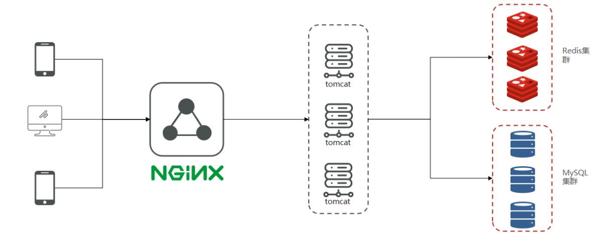

## 0短信登陆

### 基于Session实现登录流程

1. 发送验证码
   用户在提交手机号后，会校验手机号是否合法，如果不合法，则要求用户重新输入手机号
   如果手机号合法，后台此时生成对应的验证码，同时将验证码进行保存，然后再通过短信的方式将验证码发送给用户
2. 短信验证码登录、注册
   用户将验证码和手机号进行输入，后台从session中拿到当前验证码，然后和用户输入的验证码进行校验，如果不一致，则无法通过校验，如果一致，则后台根据手机号查询用户，如果用户不存在，则为用户创建账号信息，保存到数据库，无论是否存在，都会将用户信息保存到session中，方便后续获得当前登录信息
3. 校验登录状态
   用户在请求的时候，会从cookie中携带JsessionId到后台，后台通过JsessionId从session中拿到用户信息，如果没有session信息，则进行拦截，如果有session信息，则将用户信息保存到threadLocal中，并放行

#### 发送验证码

```java
@PostMapping("/code")
public Result sendCode(@RequestParam("phone") String phone, HttpSession session) throws MessagingException {
    // TODO 发送短信验证码并保存验证码
    if (RegexUtils.isEmailInvalid(phone)) {
        return Result.fail("邮箱格式不正确");
    }
    String code = MailUtils.achieveCode();
    session.setAttribute(phone, code);
    MailUtils.sendTestMail(phone, code);
    return Result.ok();
}
```

#### 登录

```java
@PostMapping("/login")
public Result login(@RequestBody LoginFormDTO loginForm, HttpSession session) {
    // TODO 实现登录功能
    //获取登录账号
    String phone = loginForm.getPhone();
    //获取登录验证码
    String code = loginForm.getCode();
    //获取session中的验证码
    Object cacheCode = session.getAttribute(phone);

    //1. 校验邮箱
    if (RegexUtils.isEmailInvalid(phone)) {
        //2. 不符合格式则报错
        return Result.fail("邮箱格式不正确！！");
    }
    //3. 校验验证码
    log.info("code:{},cacheCode{}", code, cacheCode);
    if (code == null || !cacheCode.toString().equals(code)) {
        //4. 不一致则报错
        return Result.fail("验证码不一致！！");
    }
    //5. 根据账号查询用户是否存在
    LambdaQueryWrapper<User> queryWrapper = new LambdaQueryWrapper<>();
    queryWrapper.eq(User::getPhone, phone);
    User user = userService.getOne(queryWrapper);
    //6. 如果不存在则创建
    if (user == null) {
        // 创建的逻辑封装成了一个方法
        user = createUserWithPhone(phone);
    }
    //7. 保存用户信息到session中
    session.setAttribute("user", user);
    return Result.ok();
}
```

#### 登录拦截

创建拦截器

- 创建一个LoginInterceptor类，实现HandlerInterceptor接口，重写其中的两个方法，前置拦截器和完成处理方法，前置拦截器主要用于我们登陆之前的权限校验，完成处理方法是用于处理登录后的信息，避免内存泄露

```java
public class LoginInterceptor implements HandlerInterceptor {
    @Override
    public boolean preHandle(HttpServletRequest request, HttpServletResponse response, Object handler) throws Exception {
        //1. 获取session
        HttpSession session = request.getSession();
        //2. 获取session中的用户信息
        User user = (User) session.getAttribute("user");
        //3. 判断用户是否存在
        if (user == null) {
            //4. 不存在，则拦截
            response.setStatus(401);
            return false;
        }
        //5. 存在，保存用户信息到ThreadLocal，UserHolder是提供好了的工具类
        UserHolder.saveUser(user);
        //6. 放行
        return true;
    }

    @Override
    public void afterCompletion(HttpServletRequest request, HttpServletResponse response, Object handler, Exception ex) throws Exception {
        UserHolder.removeUser();
    }
}
```

UserHolder工具类，使用ThreadLocal来为每个线程生成互不干扰的用户信息

```java
public class UserHolder {
    private static final ThreadLocal<User> tl = new ThreadLocal<>();

    public static void saveUser(User user){
        tl.set(user);
    }

    public static User getUser(){
        return tl.get();
    }

    public static void removeUser(){
        tl.remove();
    }
}
```

注册拦截器

```java
@Configuration
public class MvcConfig implements WebMvcConfigurer {
    @Override
    public void addInterceptors(InterceptorRegistry registry) {
        registry.addInterceptor(new LoginInterceptor())
                .excludePathPatterns(
                        "/user/code",
                        "/user/login",
                        "/blog/hot",
                        "/shop/**",
                        "/shop-type/**",
                        "/upload/**",
                        "/voucher/**"
                );
    }
}
```

#### 隐藏敏感信息

应当在返回用户信息之前，将用户的敏感信息进行隐藏，采用的核心思路就是书写一个UserDto对象，在返回前，将有用户敏感信息的User对象转化成没有敏感信息的UserDto对象

```java
@Data
public class UserDTO {
    private Long id;
    private String nickName;
    private String icon;
}
```

需要将所有的保存和返回的User对象换成UserDTO，一下为示例

```java
// session.setAttribute("user", user);
UserDTO userDTO = BeanUtil.copyProperties(user, UserDTO.class);
session.setAttribute("user", userDTO);
```

#### session共享

- 每个tomcat中都有一份属于自己的session,假设用户第一次访问第一台tomcat，并且把自己的信息存放到第一台服务器的session中，但是第二次这个用户访问到了第二台tomcat，那么在第二台服务器上，肯定没有第一台服务器存放的session，所以此时 整个登录拦截功能就会出现问题。早期的方案是session拷贝，虽然每个tomcat上都有不同的session，但是每当任意一台服务器的session修改时，都会同步给其他的Tomcat服务器的session，这样的话，就可以实现session的共享了
- 问题
  1. 每台服务器中都有完整的一份session数据，服务器压力过大。
  2. session拷贝数据时，可能会出现延迟
- 后面都是基于Redis来完成，把session换成Redis，Redis数据是共享的，就可以避免session共享的问题

### 基于Redis实现短信登录

#### 注入redis

```java
@Autowired
private StringRedisTemplate stringRedisTemplate;
```

#### 发送验证码

```java
@PostMapping("/code")
public Result sendCode(@RequestParam("phone") String phone, HttpSession session) throws MessagingException {
    if (RegexUtils.isEmailInvalid(phone)) {
        return Result.fail("邮箱格式不正确");
    }
    String code = MailUtils.achieveCode();
		stringRedisTemplate.opsForValue().set(LOGIN_CODE_KEY + phone, code, LOGIN_CODE_TTL, TimeUnit.MINUTES);
    MailUtils.sendTestMail(phone, code);
    return Result.ok();
}
```

#### 登录

```java
@PostMapping("/login")
public Result login(@RequestBody LoginFormDTO loginForm, HttpSession session) {
  // TODO 实现登录功能
  //获取登录账号
  String phone = loginForm.getPhone();
  //获取登录验证码
  String code = loginForm.getCode();
  //获取redis中的验证码
  String cacheCode = stringRedisTemplate.opsForValue().get(LOGIN_CODE_KEY + phone);

  //1. 校验邮箱
  if (RegexUtils.isEmailInvalid(phone)) {
    //2. 不符合格式则报错
    return Result.fail("邮箱格式不正确！！");
  }
  //3. 校验验证码
  log.info("code:{},cacheCode{}", code, cacheCode);
  if (cacheCode == null || !cacheCode.equals(code)) {
    // 不一致，报错
    return Result.fail("验证码错误");
  }
  //5. 根据账号查询用户是否存在
  LambdaQueryWrapper<User> queryWrapper = new LambdaQueryWrapper<>();
  queryWrapper.eq(User::getPhone, phone);
  User user = userService.getOne(queryWrapper);
  //6. 如果不存在则创建
  if (user == null) {
    user = createUserWithPhone(phone);
  }
  //7. 保存用户信息到session中
  //7. 保存用户信息到Redis中
  //7.1 随机生成token，作为登录令牌
  String token = UUID.randomUUID().toString();
  //7.2 将UserDto对象转为HashMap存储
  UserDTO userDTO = BeanUtil.copyProperties(user, UserDTO.class);
  HashMap<String, String > userMap = new HashMap<>();
  userMap.put("icon", userDTO.getIcon());
  userMap.put("id", String.valueOf(userDTO.getId()));
  userMap.put("nickName", userDTO.getNickName());
  //高端写法，现在我还学不来，工具类还不太了解，只能自己手动转换类型然后put了
  //        Map<String, Object> userMap = BeanUtil.beanToMap(userDTO, new HashMap<>(),
  //                CopyOptions.create()
  //                        .setIgnoreNullValue(true)
  //                        .setFieldValueEditor((fieldName, fieldValue) -> fieldValue.toString()));
  //7.3 存储
  String tokenKey = LOGIN_USER_KEY + token;
  stringRedisTemplate.opsForHash().putAll(tokenKey, userMap);
  //7.4 设置token有效期为30分钟
  stringRedisTemplate.expire(tokenKey, 30, TimeUnit.MINUTES);
  //7.5 登陆成功则删除验证码信息
  stringRedisTemplate.delete(LOGIN_CODE_KEY + phone);
  //8. 返回token
  return Result.ok(token);
}
```


### 解决状态登录刷新问题

#### 初始方案

- 通过拦截器拦截到的请求，来证明用户是否在操作，如果用户没有任何操作30分钟，则token会消失，用户需要重新登录

- 修改登陆拦截器`LoginInterceptor`类

```java
@Override
public boolean preHandle(HttpServletRequest request, HttpServletResponse response, Object handler) throws Exception {
    //1. 获取请求头中的token
    String token = request.getHeader("authorization");
    //2. 如果token是空，则未登录，拦截
    if (StrUtil.isBlank(token)) {
        response.setStatus(401);
        return false;
    }
    String key = RedisConstants.LOGIN_USER_KEY + token;
    //3. 基于token获取Redis中的用户数据
    Map<Object, Object> userMap = stringRedisTemplate.opsForHash().entries(key);
    //4. 判断用户是否存在，不存在，则拦截
    if (userMap.isEmpty()) {
        response.setStatus(401);
        return false;
    }
    //5. 将查询到的Hash数据转化为UserDto对象
    UserDTO userDTO = BeanUtil.fillBeanWithMap(userMap, new UserDTO(), false);
    //6. 将用户信息保存到ThreadLocal
    UserHolder.saveUser(userDTO);
    //7. 刷新tokenTTL，这里的存活时间根据需要自己设置，这里的常量值我改为了30分钟
    stringRedisTemplate.expire(key, RedisConstants.LOGIN_USER_TTL, TimeUnit.MINUTES);
    return true;
}
```

- 在这个方案中，确实可以使用对应路径的拦截，同时刷新登录token令牌的存活时间，但是现在这个拦截器他只是拦截需要被拦截的路径，假设当前用户访问了一些不需要拦截的路径，那么这个拦截器就不会生效，所以此时令牌刷新的动作实际上就不会执行

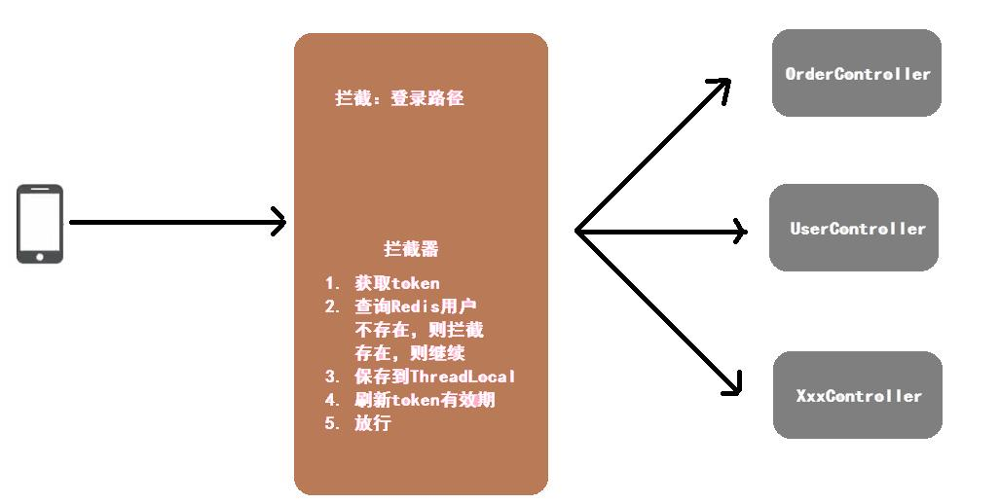

#### 优化方案

- 添加第二层拦截器，在第一个拦截器中拦截所有的路径，刷新令牌，第二个拦截器只需要判断拦截器中的user对象是否存在即可，完成整体刷新功能。

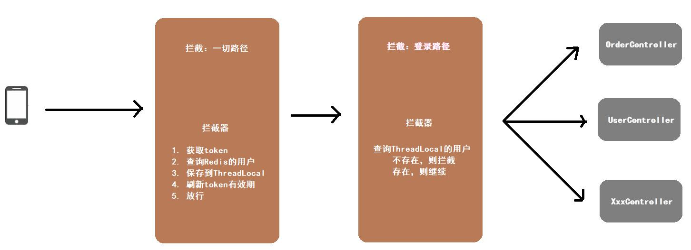

- 新建一个`RefreshTokenInterceptor`类，其业务逻辑与之前的`LoginInterceptor`类似，就算遇到用户未登录，也继续放行，交给`LoginInterceptor`处理
  由于这个对象是我们手动在WebConfig里创建的，所以这里不能用@AutoWired自动装配，只能声明一个私有的，只能在WebConfig生成对象时，通过构造函数传入`stringRedisTemplate`

```java
public class RefreshTokenInterceptor implements HandlerInterceptor {
  //这里并不是自动装配，因为RefreshTokenInterceptor是我们手动在WebConfig里new出来的
  private StringRedisTemplate stringRedisTemplate;

  public RefreshTokenInterceptor(StringRedisTemplate stringRedisTemplate) {
    this.stringRedisTemplate = stringRedisTemplate;
  }

  @Override
  public boolean preHandle(HttpServletRequest request, HttpServletResponse response, Object handler) throws Exception {
    //1. 获取请求头中的token
    String token = request.getHeader("authorization");
    //2. 如果token是空，直接放行，交给LoginInterceptor处理
    if (StrUtil.isBlank(token)) {
      return true;
    }
    String key = RedisConstants.LOGIN_USER_KEY + token;
    //3. 基于token获取Redis中的用户数据
    Map<Object, Object> userMap = stringRedisTemplate.opsForHash().entries(key);
    //4. 判断用户是否存在，不存在，也放行，交给LoginInterceptor
    if (userMap.isEmpty()) {
      return true;
    }
    //5. 将查询到的Hash数据转化为UserDto对象
    UserDTO userDTO = BeanUtil.fillBeanWithMap(userMap, new UserDTO(), false);
    //6. 将用户信息保存到ThreadLocal
    UserHolder.saveUser(userDTO);
    //7. 刷新tokenTTL，这里的存活时间根据需要自己设置，这里的常量值我改为了30分钟
    stringRedisTemplate.expire(key, RedisConstants.LOGIN_USER_TTL, TimeUnit.MINUTES);
    return true;
  }

  @Override
  public void afterCompletion(HttpServletRequest request, HttpServletResponse response, Object handler, Exception ex) throws Exception {
    UserHolder.removeUser();
  }
}
```

- 修改我们之前的`LoginInterceptor`类，只需要判断用户是否存在，不存在，则拦截，存在则放行

```java
public class LoginInterceptor implements HandlerInterceptor {

  @Override
  public boolean preHandle(HttpServletRequest request, HttpServletResponse response, Object handler) throws Exception {
    //判断用户是否存在
    if (UserHolder.getUser()==null){
      //不存在则拦截
      response.setStatus(401);
      return false;
    }
    //存在则放行
    return true;
  }
}
```

- 修改`WebConfig`配置类，拦截器的执行顺序可以由order来指定，如果未设置拦截路径，则默认是拦截所有路径

```java
@Configuration
public class MvcConfig implements WebMvcConfigurer {
  //到了这里才能自动装配
  @Autowired
  private StringRedisTemplate stringRedisTemplate;

  @Override
  public void addInterceptors(InterceptorRegistry registry) {
    registry.addInterceptor(new LoginInterceptor())
      .excludePathPatterns(
      "/user/code",
      "/user/login",
      "/blog/hot",
      "/shop/**",
      "/shop-type/**",
      "/upload/**",
      "/voucher/**"
    ).order(1);
    //RefreshTokenInterceptor是我们手动new出来的
    registry.addInterceptor(new RefreshTokenInterceptor(stringRedisTemplate)).order(0);
  }
}
```


## 1商户查询缓存

### 概念

- 在实际开发中，系统也需要`避震器`，防止过高的数据量猛冲系统，导致其操作线程无法及时处理信息而瘫痪
- `缓存`(Cache)就是数据交换的`缓冲区`，俗称的缓存就是缓冲区内的数据，一般从数据库中获取，存储于本地，例如

#### 为什么要使用缓存

- 言简意赅：速度快，好用
- 缓存数据存储于代码中，而代码运行在内存中，内存的读写性能远高于磁盘，缓存可以大大降低用户访问并发量带来的服务器读写压力
- 实际开发中，企业的数据量，少则几十万，多则几千万，这么大的数据量，如果没有缓存来作为`避震器`，系统是几乎撑不住的，所以企业会大量运用缓存技术
- 但是缓存也会增加代码复杂度和运营成本
- 缓存的作用
  1. 降低后端负载
  2. 提高读写效率，降低响应时间
- 缓存的成本
  1. 数据一致性成本
  2. 代码维护成本
  3. 运维成本（一般采用服务器集群，需要多加机器，机器就是钱）

#### 如何使用缓存

- 实际开发中，会构筑多级缓存来时系统运行速度进一步提升，例如：本地缓存与Redis中的缓存并发使用
- `浏览器缓存：`主要是存在于浏览器端的缓存
- `应用层缓存：`可以分为toncat本地缓存，例如map或者是使用Redis作为缓存
- `数据库缓存：`在数据库中有一片空间是buffer pool，增改查数据都会先加载到mysql的缓存中
- `CPU缓存：`当代计算机最大的问题就是CPU性能提升了，但是内存读写速度没有跟上，所以为了适应当下的情况，增加了CPU的L1，L2，L3级的缓存

### 查询缓存实现

在客户端与数据库之间加上一个Redis缓存，先从Redis中查询，如果没有查到，再去MySQL中查询，同时查询完毕之后，将查询到的数据也存入Redis，这样当下一个用户来进行查询的时候，就可以直接从Redis中获取到数据

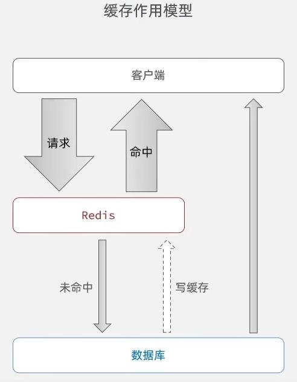

思路

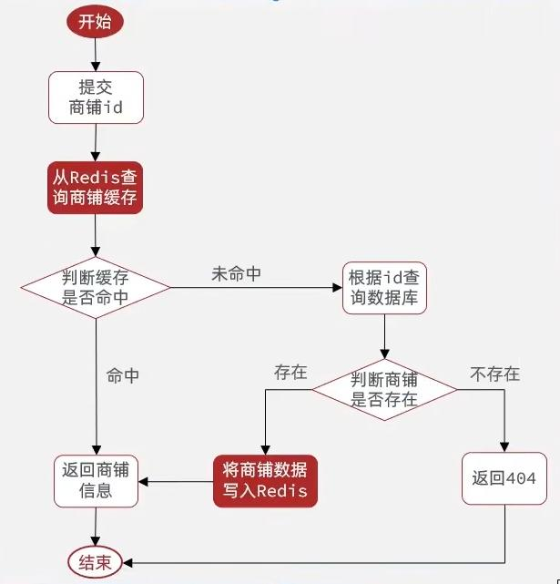

```java
@Override
public Result queryById(Long id) {
    //先从Redis中查，这里的常量值是固定的前缀 + 店铺id
    String shopJson = stringRedisTemplate.opsForValue().get(CACHE_SHOP_KEY + id);
    //如果不为空（查询到了），则转为Shop类型直接返回
    if (StrUtil.isNotBlank(shopJson)) {
        Shop shop = JSONUtil.toBean(shopJson, Shop.class);
        return Result.ok(shop);
    }
    //否则去数据库中查
    Shop shop = getById(id);
    //查不到返回一个错误信息或者返回空都可以
    if (shop == null){
        return Result.fail("店铺不存在！！");
    }
    //查到了则转为json字符串
    String jsonStr = JSONUtil.toJsonStr(shop);
    //并存入redis
    stringRedisTemplate.opsForValue().set(CACHE_SHOP_KEY + id, jsonStr);
    //最终把查询到的商户信息返回给前端
    return Result.ok(shop);
}
```


### 缓存更新策略

缓存更新是Redis为了节约内存而设计出来的一个东西，主要是因为内存数据宝贵，当我们想Redis插入太多数据，此时就可能会导致缓存中数据过多，所以Redis会对部分数据进行更新，或者把它成为淘汰更合适

- `内存淘汰`：Redis自动进行，当Redis内存达到我们设定的`max-memery`时，会自动触发淘汰机制，淘汰掉一些不重要的数据（可以自己设置策略方式）
- `超时剔除`：给Redis设置了过期时间TTL之后，Redis会将超时的数据进行删除
- `主动更新`：手动调用方法把缓存删除掉，通常用于解决缓存和数据库不一致问题

|          |                           内存淘汰                           |                           超时剔除                           |                    主动更新                    |
| :--------------: | :----------------------------------------------------------: | :----------------------------------------------------------: | :--------------------------------------------: |
|   说明   | 不用自己维护， 利用Redis的内存淘汰机制， 当内存不足时自动淘汰部分数据。 下次查询时更新缓存。 | 给缓存数据添加TTL时间， 到期后自动删除缓存。 下次查询时更新缓存。 | 编写业务逻辑， 在修改数据库的同时， 更新缓存。 |
|  一致性  |                              差                              |                             一般                             |                       好                       |
| 维护成本 |                              无                              |                              低                              |                       高                       |

- 业务场景
  - 低一致性需求：使用内存淘汰机制，例如店铺类型的查询缓存（因为这个很长一段时间都不需要更新）
  - 高一致性需求：主动更新，并以超时剔除作为兜底方案，例如店铺详情查询的缓存

#### 数据库和缓存不一致解决方案

- 缓存数据源来自数据库，当数据库中数据发生变化，缓存没有同步，就会有一致性问题，其后果是
  - 用户使用缓存中的过时数据，就会产生类似多线程数据安全问题，从而影响业务，产品口碑等
- 三种解决方式
  1. Cache Aside Pattern 人工编码方式：缓存调用者在更新完数据库之后再去更新缓存，也称之为双写方案
  2. Read/Write Through Pattern：缓存与数据库整合为一个服务，由服务来维护一致性。调用者调用该服务，无需关心缓存一致性问题。但是维护这样一个服务很复杂，市面上也不容易找到这样的一个现成的服务，开发成本高
  3. Write Behind Caching Pattern：调用者只操作缓存，其他线程去异步处理数据库，最终实现一致性。但是维护这样的一个异步的任务很复杂，需要实时监控缓存中的数据更新，其他线程去异步更新数据库也可能不太及时，而且缓存服务器如果宕机，那么缓存的数据也就丢失了

> 数据库和缓存不一致采用什么方案
>
> 方案一最可靠
>
> 操作完数据库后，有两种策略：更新缓存，和删除缓存，选择删除缓存

- 对比删除缓存与更新缓存
  - `更新缓存`：每次更新数据库都需要更新缓存，无效写操作较多
  - `删除缓存`：更新数据库时让缓存失效，再次查询时更新缓存
- 如何保证缓存与数据库的操作同时成功/同时失败
  - `单体系统：`将缓存与数据库操作放在同一个事务
  - `分布式系统：`利用TCC等分布式事务方案

> 先操作缓存还是先操作数据库？先分析两种方式的线程安全问题

- 先删除缓存，再操作数据库
  删除缓存的操作很快，但是更新数据库的操作相对较慢，如果此时有一个线程2刚好进来查询缓存，由于我们刚刚才删除缓存，所以线程2需要查询数据库，并写入缓存，但是我们更新数据库的操作还未完成，所以线程2查询到的数据是脏数据，出现线程安全问题
  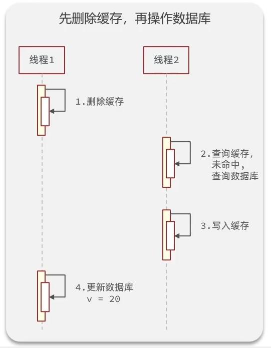
- 先操作数据库，再删除缓存
  线程1在查询缓存的时候，缓存TTL刚好失效，需要查询数据库并写入缓存，这个操作耗时相对较短（相比较于上图来说），但是就在这么短的时间内，线程2进来了，更新数据库，删除缓存，但是线程1虽然查询完了数据（更新前的旧数据），但是还没来得及写入缓存，所以线程2的更新数据库与删除缓存，并没有影响到线程1的查询旧数据，写入缓存，造成线程安全问题
  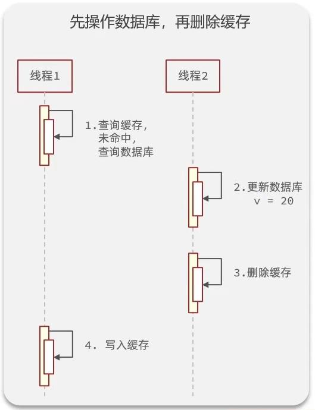
- 虽然这二者都存在线程安全问题，但是相对来说，后者出现线程安全问题的概率相对较低，所以我们最终采用后者`先操作数据库，再删除缓存`的方案

```java
@Override
public Result queryById(Long id) {
    //先从Redis中查，这里的常量值是固定的前缀 + 店铺id
    String shopJson = stringRedisTemplate.opsForValue().get(CACHE_SHOP_KEY + id);
    //如果不为空（查询到了），则转为Shop类型直接返回
    if (StrUtil.isNotBlank(shopJson)) {
        Shop shop = JSONUtil.toBean(shopJson, Shop.class);
        return Result.ok(shop);
    }
    //否则去数据库中查
    Shop shop = getById(id);
    //查不到返回一个错误信息或者返回空都可以，根据自己的需求来
    if (shop == null){
        return Result.fail("店铺不存在！！");
    }
    //查到了则转为json字符串
    String jsonStr = JSONUtil.toJsonStr(shop);
    //并存入redis，设置TTL
    stringRedisTemplate.opsForValue().set(CACHE_SHOP_KEY + id, jsonStr,CACHE_SHOP_TTL, TimeUnit.MINUTES);
    //最终把查询到的商户信息返回给前端
    return Result.ok(shop);
}
```

```java
@Override
public Result update(Shop shop) {
    //首先先判一下空
    if (shop.getId() == null){
        return Result.fail("店铺id不能为空！！");
    }
    //先修改数据库
    updateById(shop);
    //再删除缓存
    stringRedisTemplate.delete(CACHE_SHOP_KEY + shop.getId());
    return Result.ok();
}
```


### 缓存穿透问题

`缓存穿透`：缓存穿透是指客户端请求的数据在缓存中和数据库中都不存在，这样缓存永远都不会生效，会频繁的去访问数据库。

- 常见的结局方案有两种
  1. 缓存空对象
     - 优点：实现简单，维护方便
     - 缺点：额外的内存消耗，可能造成短期的不一致
  2. 布隆过滤
     - 优点：内存占用少，没有多余的key
     - 缺点：实现复杂，可能存在误判
- `缓存空对象`：可能造成的`短期不一致`是指在空对象的存活期间，我们更新了数据库，把这个空对象变成了正常的可以访问的数据，但由于空对象的TTL还没过，所以当用户来查询的时候，查询到的还是空对象，等TTL过了之后，才能访问到正确的数据。
- `布隆过滤`：布隆过滤器其实采用的是哈希思想来解决这个问题，通过一个庞大的二进制数组，根据哈希思想去判断当前这个要查询的数据是否存在，如果布隆过滤器判断存在，则放行，这个请求会去访问redis，哪怕此时redis中的数据过期了，但是数据库里一定会存在这个数据，从数据库中查询到数据之后，再将其放到redis中。如果布隆过滤器判断这个数据不存在，则直接返回。这种思想的优点在于节约内存空间，但存在误判，误判的原因在于：布隆过滤器使用的是哈希思想，只要是哈希思想，都可能存在哈希冲突

#### 缓存空值编码

```java
@Override
public Result queryById(Long id) {
    //先从Redis中查，这里的常量值是固定的前缀 + 店铺id
    String shopJson = stringRedisTemplate.opsForValue().get(CACHE_SHOP_KEY + id);
    //如果不为空（查询到了），则转为Shop类型直接返回
    if (StrUtil.isNotBlank(shopJson)) {
        Shop shop = JSONUtil.toBean(shopJson, Shop.class);
        return Result.ok(shop);
    }
    //如果查询到的是空字符串，则说明是我们缓存的空数据
    if (shopjson != null) {
        return Result.fail("店铺不存在！！");
    }
    //否则去数据库中查
    Shop shop = getById(id);
    //查不到，则将空字符串写入Redis
    if (shop == null) {
        //这里的常量值是2分钟
        stringRedisTemplate.opsForValue().set(CACHE_SHOP_KEY + id, "", CACHE_NULL_TTL, TimeUnit.MINUTES);
        return Result.fail("店铺不存在！！");
    }
    //查到了则转为json字符串
    String jsonStr = JSONUtil.toJsonStr(shop);
    //并存入redis，设置TTL
    stringRedisTemplate.opsForValue().set(CACHE_SHOP_KEY + id, jsonStr, CACHE_SHOP_TTL, TimeUnit.MINUTES);
    //最终把查询到的商户信息返回给前端
    return Result.ok(shop);
}
```


### 缓存雪崩问题

缓存雪崩是指在同一时间段，大量缓存的key同时失效，或者Redis服务宕机，导致大量请求到达数据库，带来巨大压力

- 解决方案
  - 给不同的Key的TTL添加随机值，让其在不同时间段分批失效
  - 利用Redis集群提高服务的可用性（使用一个或者多个哨兵(`Sentinel`)实例组成的系统，对redis节点进行监控，在主节点出现故障的情况下，能将从节点中的一个升级为主节点，进行故障转义，保证系统的可用性。 ）
  - 给缓存业务添加降级限流策略
  - 给业务添加多级缓存（浏览器访问静态资源时，优先读取浏览器本地缓存；访问非静态资源（ajax查询数据）时，访问服务端；请求到达Nginx后，优先读取Nginx本地缓存；如果Nginx本地缓存未命中，则去直接查询Redis（不经过Tomcat）；如果Redis查询未命中，则查询Tomcat；请求进入Tomcat后，优先查询JVM进程缓存；如果JVM进程缓存未命中，则查询数据库）


### 缓存击穿问题

缓存击穿也叫热点Key问题，就是一个被`高并发访问`并且`缓存重建业务较复杂`的key突然失效了，那么无数请求访问就会在瞬间给数据库带来巨大的冲击

- 常见的解决方案有两种
  1. 互斥锁
  2. 逻辑过期

> `解决方案一`：互斥锁

- 利用锁的互斥性，假设线程过来，只能一个人一个人的访问数据库，从而避免对数据库频繁访问产生过大压力，但这也会影响查询的性能，将查询的性能从并行变成了串行

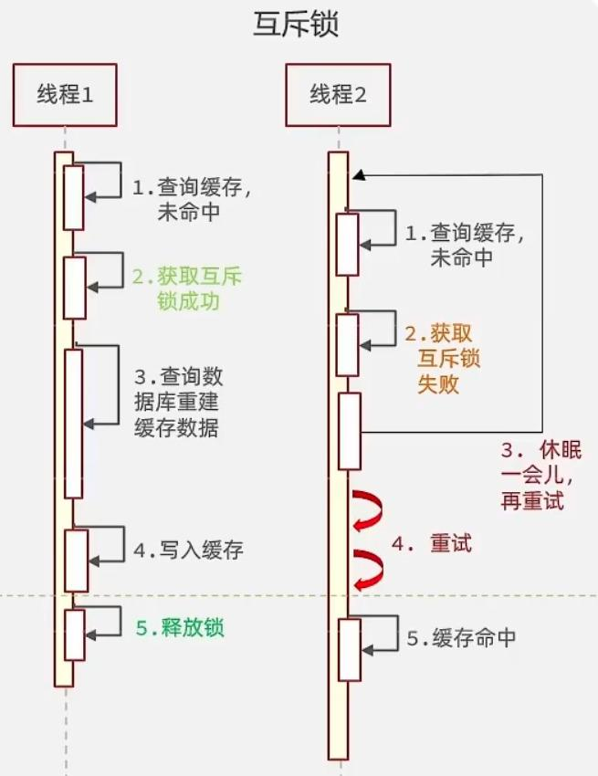

> `解决方案二`：逻辑过期方案

- 假设线程1去查询缓存，当前数据已经过期，此时线程1去获得互斥锁，开启一个新线程去进行之前的重建缓存数据的逻辑，直到新开的线程完成者逻辑之后，才会释放锁，线程1直接进行返回，无法获得锁，直接返回旧数据（牺牲了数据一致性，换取性能上的提高），只有等待线程1重建缓存数据之后，其他线程才能返回正确的数据
- 这种方案巧妙在于，异步构建缓存数据，缺点是在重建完缓存数据之前，返回的都是脏数据


> 对比互斥锁与逻辑删除

- `互斥锁方案`：由于保证了互斥性，所以数据一致，且实现简单，只是加了一把锁而已，也没有其他的事情需要操心，所以没有额外的内存消耗，缺点在于有锁的情况，就可能死锁，所以只能串行执行，性能会受到影响
- `逻辑过期方案`：线程读取过程中不需要等待，性能好，有一个额外的线程持有锁去进行重构缓存数据，但是在重构数据完成之前，其他线程只能返回脏数据，且实现起来比较麻烦

| 解决方案 |                  优点                  |                  缺点                   |
| :------: | :------------------------------------: | :-------------------------------------: |
|  互斥锁  | 没有额外的内存消耗 保证一致性 实现简单 | 线程需要等待，性能受影响 可能有死锁风险 |
| 逻辑过期 |         线程无需等待，性能较好         |  不保证一致性 有额外内存消耗 实现复杂   |


#### 互斥锁编码

- `核心思路`：相较于原来从缓存中查询不到数据后直接查询数据库而言，现在的方案是，进行查询之后，如果没有从缓存中查询到数据，则进行互斥锁的获取，获取互斥锁之后，判断是否获取到了锁，如果没获取到，则休眠一段时间，过一会儿再去尝试，知道获取到锁为止，才能进行查询
- 如果获取到了锁的线程，则进行查询，将查询到的数据写入Redis，再释放锁，返回数据，利用互斥锁就能保证只有一个线程去执行数据库的逻辑，防止缓存击穿
- 锁实现利用redis的setnx方法，如果redis没有这个key，则插入成功，返回1，如果已经存在这个key，则插入失败，返回0。在StringRedisTemplate中返回true/false，我们可以根据返回值来判断是否有线程成功获取到了锁

```java
private boolean tryLock(String key) {
    Boolean flag = stringRedisTemplate.opsForValue().setIfAbsent(key, "1", 10, TimeUnit.SECONDS);
    //避免返回值为null，我们这里使用了BooleanUtil工具类
    return BooleanUtil.isTrue(flag);
}
private void unlock(String key) {
    stringRedisTemplate.delete(key);
}
```

```java
@Override
public Shop queryWithMutex(Long id) {
    //先从Redis中查，这里的常量值是固定的前缀 + 店铺id
    String shopJson = stringRedisTemplate.opsForValue().get(CACHE_SHOP_KEY + id);
    //如果不为空（查询到了），则转为Shop类型直接返回
    if (StrUtil.isNotBlank(shopJson)) {
        Shop shop = JSONUtil.toBean(shopJson, Shop.class);
        return shop;
    }
    if (shopJson != null) {
        return null;
    }
    Shop shop = null;
    try {
        //否则去数据库中查
        boolean flag = tryLock(LOCK_SHOP_KEY + id);
        if (!flag) {
            Thread.sleep(50);
            return queryWithMutex(id);
        }
        //查不到，则将空值写入Redis
        shop = getById(id);
        if (shop == null) {
            stringRedisTemplate.opsForValue().set(CACHE_SHOP_KEY + id, "", CACHE_NULL_TTL, TimeUnit.MINUTES);
            return null;
        }
        //查到了则转为json字符串
        String jsonStr = JSONUtil.toJsonStr(shop);
        //并存入redis，设置TTL
        stringRedisTemplate.opsForValue().set(CACHE_SHOP_KEY + id, jsonStr, CACHE_SHOP_TTL, TimeUnit.MINUTES);
        //最终把查询到的商户信息返回给前端
    } catch (InterruptedException e) {
        throw new RuntimeException(e);
    } finally {
        unlock(LOCK_SHOP_KEY + id);
    }
    return shop;
}
```


#### 逻辑过期编码

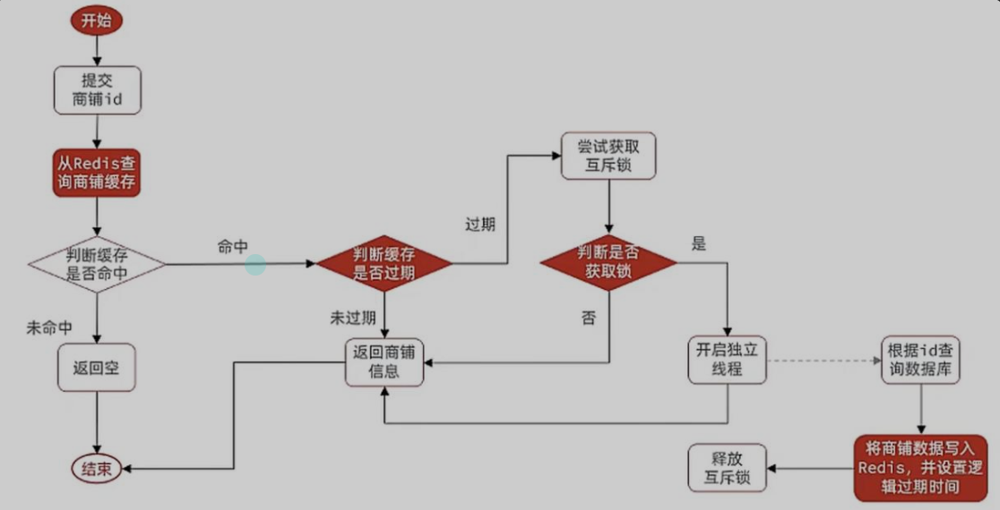

新建实体类，封装数据（缓存时需要添加过期时间）

```java
@Data
public class RedisData<T> {
    private LocalDateTime expireTime;
    private T data;
}
```

```java
//这里需要声明一个线程池，因为下面我们需要新建一个现成来完成重构缓存
private static final ExecutorService CACHE_REBUILD_EXECUTOR = Executors.newFixedThreadPool(10);

@Override
public Shop queryWithLogicalExpire(Long id) {
    //1. 从redis中查询商铺缓存
    String json = stringRedisTemplate.opsForValue().get(CACHE_SHOP_KEY + id);
    //2. 如果未命中，则返回空
    if (StrUtil.isBlank(json)) {
        return null;
    }
    //3. 命中，将json反序列化为对象
    RedisData redisData = JSONUtil.toBean(json, RedisData.class);
    //3.1 将data转为Shop对象
    JSONObject shopJson = (JSONObject) redisData.getData();
    Shop shop = JSONUtil.toBean(shopJson, Shop.class);
    //3.2 获取过期时间
    LocalDateTime expireTime = redisData.getExpireTime();
    //4. 判断是否过期
    if (LocalDateTime.now().isBefore(time)) {
        //5. 未过期，直接返回商铺信息
        return shop;
    }
    //6. 过期，尝试获取互斥锁
    boolean flag = tryLock(LOCK_SHOP_KEY + id);
    //7. 获取到了锁
    if (flag) {
        //8. 开启独立线程
        CACHE_REBUILD_EXECUTOR.submit(() -> {
            try {
                this.saveShop2Redis(id, LOCK_SHOP_TTL);
            } catch (Exception e) {
                throw new RuntimeException(e);
            } finally {
                unlock(LOCK_SHOP_KEY + id);
            }
        });
        //9. 直接返回商铺信息
        return shop;
    }
    //10. 未获取到锁，直接返回商铺信息
    return shop;
}
```

#### 封装Redis工具类

只能说牛逼，使用泛型，将之前的代码全部进行封装

```java
import cn.hutool.core.util.BooleanUtil;
import cn.hutool.core.util.StrUtil;
import cn.hutool.json.JSONObject;
import cn.hutool.json.JSONUtil;
import com.hmdp.entity.RedisData;
import lombok.extern.slf4j.Slf4j;
import org.springframework.data.redis.core.StringRedisTemplate;
import org.springframework.stereotype.Component;

import java.time.LocalDateTime;
import java.util.concurrent.ExecutorService;
import java.util.concurrent.Executors;
import java.util.concurrent.TimeUnit;
import java.util.function.Function;

import static com.hmdp.utils.RedisConstants.*;

@Slf4j
@Component
public class CacheClient {

    private final StringRedisTemplate stringRedisTemplate;
    private static final ExecutorService CACHE_REBUILD_EXECUTOR = Executors.newFixedThreadPool(10);

    public CacheClient(StringRedisTemplate stringRedisTemplate) {
        this.stringRedisTemplate = stringRedisTemplate;
    }

    public void set(String key, Object value, Long time, TimeUnit timeUnit) {
        stringRedisTemplate.opsForValue().set(key, JSONUtil.toJsonStr(value), time, timeUnit);
    }

    public void setWithLogicExpire(String key, Object value, Long time, TimeUnit timeUnit) {
        RedisData<Object> redisData = new RedisData<>();
        redisData.setData(value);
        redisData.setExpireTime(LocalDateTime.now().plusSeconds(timeUnit.toSeconds(time)));
        stringRedisTemplate.opsForValue().set(key, JSONUtil.toJsonStr(redisData));
    }

  	// 空值解决缓存穿透
    public <R, ID> R queryWithPassThrough(String keyPrefix, ID id, Class<R> type, Function<ID, R> dbFallback, Long time, TimeUnit timeUnit) {
        //先从Redis中查，这里的常量值是固定的前缀 + 店铺id
        String key = keyPrefix + id;
        String json = stringRedisTemplate.opsForValue().get(key);
        //如果不为空（查询到了），则转为R类型直接返回
        if (StrUtil.isNotBlank(json)) {
            return JSONUtil.toBean(json, type);
        }
        if (json != null) {
            return null;
        }
        //否则去数据库中查，查询逻辑用我们参数中注入的函数
        R r = dbFallback.apply(id);
        //查不到，则将空值写入Redis
        if (r == null) {
            stringRedisTemplate.opsForValue().set(key, "", CACHE_NULL_TTL, TimeUnit.MINUTES);
            return null;
        }
        //查到了则转为json字符串
        String jsonStr = JSONUtil.toJsonStr(r);
        //并存入redis，设置TTL
        this.set(key, jsonStr, time, timeUnit);
        //最终把查询到的商户信息返回给前端
        return r;
    }

  	// 逻辑过期解决缓存击穿
    public <R, ID> R queryWithLogicalExpire(String keyPrefix, ID id, Class<R> type, Function<ID, R> dbFallback, Long time, TimeUnit timeUnit) {
        //1. 从redis中查询商铺缓存
        String key = keyPrefix + id;
        String json = stringRedisTemplate.opsForValue().get(key);
        //2. 如果未命中，则返回空
        if (StrUtil.isBlank(json)) {
            return null;
        }
        //3. 命中，将json反序列化为对象
        RedisData redisData = JSONUtil.toBean(json, RedisData.class);
        R r = JSONUtil.toBean((JSONObject) redisData.getData(), type);
        LocalDateTime expireTime = redisData.getExpireTime();
        //4. 判断是否过期
        if (expireTime.isAfter(LocalDateTime.now())) {
            //5. 未过期，直接返回商铺信息
            return r;
        }
        //6. 过期，尝试获取互斥锁
        String lockKey = LOCK_SHOP_KEY + id;
        boolean flag = tryLock(lockKey);
        //7. 获取到了锁
        if (flag) {
            //8. 开启独立线程
            CACHE_REBUILD_EXECUTOR.submit(() -> {
                try {
                    R tmp = dbFallback.apply(id);
                    this.setWithLogicExpire(key, tmp, time, timeUnit);
                } catch (Exception e) {
                    throw new RuntimeException(e);
                } finally {
                    unlock(lockKey);
                }
            });
            //9. 直接返回商铺信息
            return r;
        }
        //10. 未获取到锁，直接返回商铺信息
        return r;
    }

  	// 互斥锁解决缓存击穿
    public <R, ID> R queryWithMutex(String keyPrefix, ID id, Class<R> type, Function<ID, R> dbFallback, Long time, TimeUnit timeUnit) {
        //先从Redis中查，这里的常量值是固定的前缀 + 店铺id
        String key = keyPrefix + id;
        String json = stringRedisTemplate.opsForValue().get(key);
        //如果不为空（查询到了），则转为Shop类型直接返回
        if (StrUtil.isNotBlank(json)) {
            return JSONUtil.toBean(json, type);
        }
        if (json != null) {
            return null;
        }
        R r = null;
        String lockKey = LOCK_SHOP_KEY + id;
        try {
            //否则去数据库中查
            boolean flag = tryLock(lockKey);
            if (!flag) {
                Thread.sleep(50);
                return queryWithMutex(keyPrefix, id, type, dbFallback, time, timeUnit);
            }
            r = dbFallback.apply(id);
            //查不到，则将空值写入Redis
            if (r == null) {
                stringRedisTemplate.opsForValue().set(key, "", CACHE_NULL_TTL, TimeUnit.MINUTES);
                return null;
            }
            //并存入redis，设置TTL
            this.set(key, r, time, timeUnit);
        } catch (InterruptedException e) {
            throw new RuntimeException(e);
        } finally {
            unlock(lockKey);
        }
        return r;
    }

    private boolean tryLock(String key) {
        Boolean flag = stringRedisTemplate.opsForValue().setIfAbsent(key, "1", 10, TimeUnit.SECONDS);
        return BooleanUtil.isTrue(flag);
    }

    private void unlock(String key) {
        stringRedisTemplate.delete(key);
    }
}
```

使用：

直接调用方法即可

```java
public Result queryById(Long id) {
    Shop shop = cacheClient.
            queryWithPassThrough(CACHE_SHOP_KEY, id, Shop.class, this::getById, CACHE_SHOP_TTL, TimeUnit.MINUTES);
    if (shop == null) {
        return Result.fail("店铺不存在！！");
    }
    return Result.ok(shop);
}
```


## 2优惠卷秒杀

### redis实现全局唯一id

- 订单表如果使用数据库自增ID就会存在一些问题
  1. id规律性太明显
  2. 受单表数据量的限制
- 如果我们的订单id有太明显的规律，那么对于用户或者竞争对手，就很容易猜测出我们的一些敏感信息，例如商城一天之内能卖出多少单，这明显不合适
- 随着我们商城的规模越来越大，MySQL的单表容量不宜超过500W，数据量过大之后，我们就要进行拆库拆表，拆分表了之后，他们从逻辑上讲，是同一张表，所以他们的id不能重复，于是乎我们就要保证id的唯一性
- 全局ID生成器是一种在分布式系统下用来生成全局唯一ID的工具，一般要满足一下特性
  - 唯一性
  - 高可用
  - 高性能
  - 递增性
  - 安全性
- 为了增加ID的安全性，我们可以不直接使用Redis自增的数值，而是拼接一些其他信息
- ID组成部分
  - 符号位：1bit，永远为0
  - 时间戳：31bit，以秒为单位，可以使用69年（2^31秒约等于69年）
  - 序列号：32bit，秒内的计数器，支持每秒传输2^32个不同ID

```java
@Component
public class RedisIdWorker {
    @Autowired
    private StringRedisTemplate stringRedisTemplate;
    //设置起始时间，这里设定的是2022.01.01 00:00:00
    public static final Long BEGIN_TIMESTAMP = 1640995200L;
    //序列号长度
    public static final Long COUNT_BIT = 32L;

    public long nextId(String keyPrefix){
        //1. 生成时间戳
        LocalDateTime now = LocalDateTime.now();
        long currentSecond = now.toEpochSecond(ZoneOffset.UTC);
        long timeStamp = currentSecond - BEGIN_TIMESTAMP;
        //2. 生成序列号
        String date = now.format(DateTimeFormatter.ofPattern("yyyy:MM:dd"));
        long count = stringRedisTemplate.opsForValue().increment("inc:"+keyPrefix+":"+date); // 相当于每天创建一个redis缓存count,很难溢出
        //3. 拼接并返回，简单位运算
        return timeStamp << COUNT_BIT | count;
    }
}
```

### 下单实现

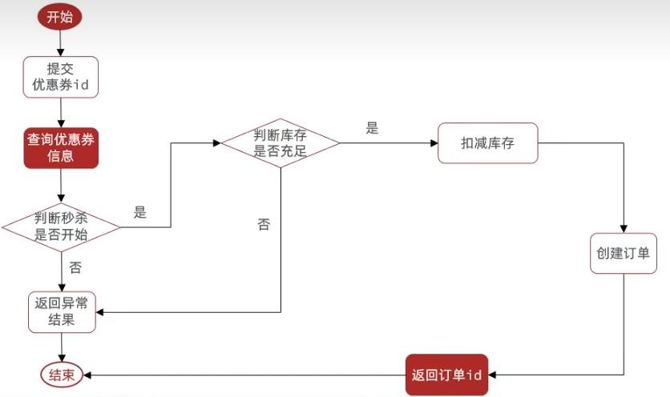

```java
@Autowired
private ISeckillVoucherService seckillVoucherService;

@Autowired
private RedisIdWorker redisIdWorker;
@Override
public Result seckillVoucher(Long voucherId) {
    LambdaQueryWrapper<SeckillVoucher> queryWrapper = new LambdaQueryWrapper<>();
    //1. 查询优惠券
    queryWrapper.eq(SeckillVoucher::getVoucherId, voucherId);
    SeckillVoucher seckillVoucher = seckillVoucherService.getOne(queryWrapper);
    //2. 判断秒杀时间是否开始
    if (LocalDateTime.now().isBefore(seckillVoucher.getBeginTime())) {
        return Result.fail("秒杀还未开始，请耐心等待");
    }
    //3. 判断秒杀时间是否结束
    if (LocalDateTime.now().isAfter(seckillVoucher.getEndTime())) {
        return Result.fail("秒杀已经结束！");
    }
    //4. 判断库存是否充足
    if (seckillVoucher.getStock() < 1) {
        return Result.fail("优惠券已被抢光了哦，下次记得手速快点");
    }
    //5. 扣减库存
    boolean success = seckillVoucherService.update()
        .setSql("stock = stock - 1")
        .eq("voucher_id",voucherId)
        .update();
    if (!success) {
        return Result.fail("库存不足");
    }
    //6. 创建订单
    VoucherOrder voucherOrder = new VoucherOrder();
    //6.1 设置订单id
    long orderId = redisIdWorker.nextId("order");
    //6.2 设置用户id
    Long id = UserHolder.getUser().getId();
    //6.3 设置代金券id
    voucherOrder.setVoucherId(voucherId);
    voucherOrder.setId(orderId);
    voucherOrder.setUserId(id);
    //7. 将订单数据保存到表中
    save(voucherOrder);
    //8. 返回订单id
    return Result.ok(orderId);
}
```

### 超卖问题

假设现在只剩下一张优惠券，线程1过来查询库存，判断库存数大于1，但还没来得及去扣减库存，此时线程2也过来查询库存，发现库存数也大于1，那么这两个线程都会进行扣减库存操作，最终相当于是多个线程都进行了扣减库存，那么此时就会出现超卖问题

超卖问题是典型的多线程安全问题，针对这一问题的常见解决方案就是加锁：而对于加锁，我们通常有两种解决方案

1. 悲观锁
   - 悲观锁认为线程安全问题一定会发生，因此在操作数据之前先获取锁，确保线程串行执行
   - 例如Synchronized、Lock等，都是悲观锁
   - 悲观锁性能不高
2. 乐观锁
   - 乐观锁认为线程安全问题不一定会发生，因此不加锁，只是在更新数据的时候再去判断有没有其他线程对数据进行了修改
     - 如果没有修改，则认为自己是安全的，自己才可以更新数据
     - 如果已经被其他线程修改，则说明发生了安全问题，此时可以重试或者异常

- 悲观锁：悲观锁可以实现对于数据的串行化执行，比如syn，和lock都是悲观锁的代表，同时，悲观锁中又可以再细分为公平锁，非公平锁，可重入锁，等等
- 乐观锁：乐观锁会有一个版本号，每次操作数据会对版本号+1，再提交回数据时，会以操作数据前查询到的版本号作为条件；当然乐观锁还有一些变种的处理方式比如CAS(Compare-And-Swap)，利用CAS进行无锁化机制加锁，操作前读取的内存值==预估值=>则代表中间没有被人修改过，此时就将新值去替换内存值，然后加入自旋机制，可以在失败后重试

#### 乐观锁实现

这里可以使用库存作为版本号，因此可以不用额外地版本号（也可以使用redis保存一个版本号），只需要在扣减库存时设置库存条件即可

```java
//5. 扣减库存
boolean success = seckillVoucherService.update()
  .setSql("stock = stock - 1")
  .eq("voucher_id", voucherId)
  .eq("stock",seckillVoucher.getStock())
  .update();
```

进一步的，只需要在扣减库存时仍然有库存，即可支持扣减

```java
//5. 扣减库存
boolean success = seckillVoucherService.update()
  .setSql("stock = stock - 1")
  .eq("voucher_id", voucherId)
  .gt("stock", 0)
  .update();
```


### 一人一单

需求：修改秒杀业务，要求同一个优惠券，一个用户只能抢一张

具体操作逻辑如下：在判断库存是否充足之后，判断用户相关的订单是否已存在

- 如果已存在，则不能下单，返回错误信息
- 如果不存在，则继续下单，获取优惠券

```java
@Override
public Result seckillVoucher(Long voucherId) {
  LambdaQueryWrapper<SeckillVoucher> queryWrapper = new LambdaQueryWrapper<>();
  //4. 判断库存是否充足
  //...
  // 一人一单逻辑
  Long userId = UserHolder.getUser().getId();
  int count = query().eq("voucher_id", voucherId).eq("user_id", userId).count();
  if (count > 0){
    return Result.fail("你已经抢过优惠券了哦");
  }
  //5. 扣减库存
  boolean success = seckillVoucherService.update()
    .setSql("stock = stock - 1")
    .eq("voucher_id", voucherId)
    .gt("stock", 0)
    .update();
  if (!success) {
    return Result.fail("库存不足");
  }
  //...
}
```

#### 悲观锁实现

`存在问题`：同样存在线程同步问题，使用悲观锁解决，把一人一单逻辑之后的代码都提取到一个`createVoucherOrder`方法中，然后给这个方法加锁

```java
public Result seckillVoucher(Long voucherId) {
  Long userId = UserHolder.getUser().getId();
  // 只能在方法外加锁，否则可能所释放了，事务还未提交
  // 需要调用intern方法，保证所有用户拿到的是同一个锁，toString返回的是一个new String()
  synchronized (userId.toString().intern()) {
    // 由于是自己调用事务方法是不会起作用的，所以需要使用代理对象交给spring调用，才会有事务效果
    IVoucherOrderService proxy = (IVoucherOrderService) AopContext.currentProxy();
    return proxy.createVoucherOrder(voucherId);
  }
}
// 需要开启事务
@Transactional
private Result createVoucherOrder(Long voucherId) {
    // 一人一单逻辑
    Long userId = UserHolder.getUser().getId();
    int count = query().eq("voucher_id", voucherId).eq("user_id", userId).count();
    if (count > 0) {
        return Result.fail("你已经抢过优惠券了哦");
    }
    //5. 扣减库存
    //...
}
```

AopContext需要引入依赖

```xml
<dependency>
    <groupId>org.aspectj</groupId>
    <artifactId>aspectjweaver</artifactId>
</dependency>
```

启动类需要加注解`@EnableAspectJAutoProxy`

```java
@MapperScan("com.hmdp.mapper")
@SpringBootApplication
@EnableAspectJAutoProxy(exposeProxy = true)
public class HmDianPingApplication {
    public static void main(String[] args) {
        SpringApplication.run(HmDianPingApplication.class, args);
    }

}
```


#### 存在问题

集群服务时，不同的jvm锁监视器不一样，所以创建的用户id锁也是不一致的，同样有并发安全问题

这就是集群环境下，syn锁失效的原因，需要使用分布式锁来解决这个问题，让锁不存在于每个jvm的内部，而是让所有jvm公用外部的一把锁（Redis）


### 分布式锁

分布式锁：满足分布式系统或集群模式下多线程可见并且可以互斥的锁

分布式锁条件：

1. 可见性：多个线程都能看到相同的结果。
2. 互斥：互斥是分布式锁的最基本条件，使得程序串行执行
3. 高可用：程序不易崩溃，时时刻刻都保证较高的可用性
4. 高性能：由于加锁本身就让性能降低，所以对于分布式锁需要较高的加锁性能和释放锁性能
5. 安全性：安全也是程序中必不可少的一环

常见的分布式锁有三种：

1. MySQL：MySQL本身就带有锁机制，但是由于MySQL的性能一般，所以采用分布式锁的情况下，使用MySQL作为分布式锁比较少见
2. Redis：Redis作为分布式锁是非常常见的一种使用方式，现在企业级开发中基本都是用Redis或者Zookeeper作为分布式锁，利用`SETNX`这个方法，如果插入Key成功，则表示获得到了锁，如果有人插入成功，那么其他人就回插入失败，无法获取到锁，利用这套逻辑完成`互斥`，从而实现分布式锁
3. Zookeeper：Zookeeper也是企业级开发中较好的一种实现分布式锁的方案

|        |           MySQL           |          Redis           |            Zookeeper             |
| :----: | :-----------------------: | :----------------------: | :------------------------------: |
|  互斥  | 利用mysql本身的互斥锁机制 | 利用setnx这样的互斥命令  | 利用节点的唯一性和有序性实现互斥 |
| 高可用 |            好             |            好            |                好                |
| 高性能 |           一般            |            好            |               一般               |
| 安全性 |   断开连接，自动释放锁    | 利用锁超时时间，到期释放 |    临时节点，断开连接自动释放    |

### Redis分布式锁实现

实现分布式锁时需要实现两个基本方法

1. 获取锁

   - 互斥：确保只能有一个线程获取锁
   - 非阻塞：尝试一次，成功返回true，失败返回false

   ```bash
   SET lock thread01 NX EX 10
   ```

2. 释放锁

   - 手动释放
   - 超时释放：获取锁的时候添加一个超时时间

   ```bash
   DEL lock
   ```

锁接口

```java
public interface ILock {
  /**
     * 尝试获取锁
     *
     * @param timeoutSec 锁持有的超时时间，过期自动释放
     * @return true表示获取锁成功，false表示获取锁失败
     */
  boolean tryLock(long timeoutSec);

  /**
     * 释放锁
     */
  void unlock();
}
```

锁实现类

```java
public class SimpleRedisLock implements ILock {
  //锁的前缀
  private static final String KEY_PREFIX = "lock:";
  //具体业务名称，将前缀和业务名拼接之后当做Key
  private String name;
  //需要使用锁时自行创建实例，所以采用手动注入
  private StringRedisTemplate stringRedisTemplate;

  public SimpleRedisLock(String name, StringRedisTemplate stringRedisTemplate) {
    this.name = name;
    this.stringRedisTemplate = stringRedisTemplate;
  }

  @Override
  public boolean tryLock(long timeoutSec) {
    //获取线程标识
    long threadId = Thread.currentThread().getId();
    //获取锁，使用SETNX方法进行加锁，同时设置过期时间，防止死锁
    Boolean success = stringRedisTemplate.opsForValue().setIfAbsent(KEY_PREFIX + name, threadId + "", timeoutSec, TimeUnit.SECONDS);
    //自动拆箱可能会出现null
    return Boolean.TRUE.equals(success);
  }

  @Override
  public void unlock() {
    //通过DEL来删除锁
    stringRedisTemplate.delete(KEY_PREFIX + name);
  }
}
```

业务，只需要将之前的jvm的锁替换为分布式锁即可

```java
Long userId = UserHolder.getUser().getId();
// 创建锁对象
SimpleRedisLock redisLock = new SimpleRedisLock("order:" + userId, stringRedisTemplate);
// 获取锁对象
boolean isLock = redisLock.tryLock(120);
// 加锁失败，说明当前用户开了多个线程抢优惠券，但是由于key是SETNX的，所以不能创建key，得等key的TTL到期或释放锁（删除key）
if (!isLock) {
  return Result.fail("不允许抢多张优惠券");
}
try {
  // 获取代理对象
  IVoucherOrderService proxy = (IVoucherOrderService) AopContext.currentProxy();
  return proxy.createVoucherOrder(voucherId);
} finally {
  // 释放锁
  redisLock.unlock();
}
```


### Redis分布式锁误删问题

- 持有锁的线程1在锁的内部出现了阻塞，导致他的锁TTL到期，自动释放
- 此时线程2也来尝试获取锁，由于线程1已经释放了锁，所以线程2可以拿到
- 但是现在线程1阻塞完了，继续往下执行，要开始释放锁了
- 那么此时就会将属于线程2的锁释放，这就是误删别人锁的情况

因此，在释放锁时，需要判断锁是不是自己的

- 在获取锁的时候存入线程标识（用UUID标识，在一个JVM中，ThreadId一般不会重复，但是我们现在是集群模式，有多个JVM，多个JVM之间可能会出现ThreadId重复的情况），在释放锁的时候先获取锁的线程标识，判断是否与当前线程标识一致
  - 如果一致则释放锁
  - 如果不一致则不释放锁

```java
private static final String ID_PREFIX = UUID.randomUUID().toString(true) + "-";
@Override
public boolean tryLock(long timeoutSec) {
    // 获取线程标识
    String threadId = ID_PREFIX + Thread.currentThread().getId();
    // 获取锁
    Boolean success = stringRedisTemplate.opsForValue().setIfAbsent(KEY_PREFIX + name, threadId, timeoutSec, TimeUnit.SECONDS);
    return Boolean.TRUE.equals(success);
}

@Override
public void unlock() {
    // 获取当前线程的标识
    String threadId = ID_PREFIX + Thread.currentThread().getId();
    // 获取锁中的标识
    String id = stringRedisTemplate.opsForValue().get(KEY_PREFIX + name);
    // 判断标识是否一致
    if (threadId.equals(id)) {
        // 释放锁
        stringRedisTemplate.delete(KEY_PREFIX + name);
    }
}
```


### 分布式锁原子性问题

- 更为极端的误删逻辑说明
- 假设线程1已经获取了锁，在判断标识一致之后，准备释放锁的时候，又出现了阻塞（例如JVM垃圾回收机制），于是锁的TTL到期了，自动释放了
- 那么现在线程2趁虚而入，拿到了一把锁
- 但是线程1的逻辑还没执行完，那么线程1就会执行删除锁的逻辑
- 但是在阻塞前线程1已经判断了标识一致，所以现在线程1把线程2的锁给删了
- 那么就相当于判断标识那行代码没有起到作用
- 这就是删锁时的原子性问题

因此要保证，判断和删锁的redis命令是原子性的

#### Lua脚本

Redis提供了Lua脚本功能，在一个脚本中编写多条Redis命令，确保多条命令执行时的原子性。

Lua是一种编程语言，它的基本语法可以上菜鸟教程看看，[链接](https://www.runoob.com/lua/lua-tutorial.html)

使用Lua去操作Redis，而且还能保证它的原子性，这样就可以实现`拿锁`，`判断标识`，`删锁`是一个原子性动作

Redis提供的调用函数语法如下

```bash
redis.call('命令名称','key','其他参数', ...)
```

redis调用脚本

```bash
EVAL script numkeys key [key ...] arg [arg ...]
```

如果脚本中的key和value不想写死，可以作为参数传递，key类型参数会放入KEYS数组，其他参数会放入ARGV数组，在脚本中可以从KEYS和ARGV数组中获取这些参数

注意：在Lua中，数组下标从1开始

#### 实现

```lua
-- 这里的KEYS[1]就是传入锁的key
-- 这里的ARGV[1]就是线程标识
-- 比较锁中的线程标识与线程标识是否一致
if (redis.call('get', KEYS[1]) == ARGV[1]) then
    -- 一致则释放锁
    return redis.call('del', KEYS[1])
end
return 0
```

- 在RedisTemplate中，可以利用execute方法去执行lua脚本

```java
public <T> T execute(RedisScript<T> script, List<K> keys, Object... args) {
    return this.scriptExecutor.execute(script, keys, args);
}
```

- 对应的Java代码如下

```java
private static final DefaultRedisScript<Long> UNLOCK_SCRIPT;

// 初始化时就加载这个脚本
static {
    UNLOCK_SCRIPT = new DefaultRedisScript();
    UNLOCK_SCRIPT.setLocation(new ClassPathResource("unlock.lua"));
    UNLOCK_SCRIPT.setResultType(Long.class);
}

@Override
public void unlock() {
    stringRedisTemplate.execute(UNLOCK_SCRIPT,
            Collections.singletonList(KEY_PREFIX + name),
            ID_PREFIX + Thread.currentThread().getId());
}
```

### Redis分布式锁问题和小结

但是现在的分布式锁还存在一个问题：如果锁的TTL快到期的时候，无法自动续期，导致如果有些逻辑执行时间很长的时候，TTL提前过期了，别的线程就可能提前拿到锁。(引入Redisson解决)

小结：基于Redis分布式锁的实现思路

- 利用SET NX EX获取锁，并设置过期时间，保存线程标识
- 释放锁时先判断线程标识是否与自己一致，一致则删除锁
  - 特性
    - 利用SET NX满足互斥性
    - 利用SET EX保证故障时依然能释放锁，避免死锁，提高安全性
    - 利用Redis集群保证高可用和高并发特性


### 分布式锁-Redisson

基于SETNX实现的分布式锁存在以下问题

1. 重入问题
   - 重入问题是指获取锁的线程，可以再次进入到相同的锁的代码块中，可重入锁的意义在于防止死锁，例如在HashTable这样的代码中，它的方法都是使用synchronized修饰的，加入它在一个方法内调用另一个方法，如果此时是不可重入的，那就死锁了。所以可重入锁的主要意义是防止死锁，synchronized和Lock锁都是可重入的
2. 不可重试
   - 当线程获取锁失败后，应该能再次尝试获取锁
3. 超时释放
   - 我们在加锁的时候增加了TTL，这样我们可以防止死锁，但是如果卡顿(阻塞)时间太长，也会导致锁的释放。虽然我们采用Lua脚本来防止删锁的时候，误删别人的锁，但仍然有安全隐患
4. 主从一致性
   - 如果Redis提供了主从集群，那么当我们向集群写数据时，主机需要异步的将数据同步给从机，万一在同步之前，主机宕机了，那么又会出现死锁问题

Redisson是一个在Redis的基础上实现的Java驻内存数据网格(In-Memory Data Grid)。它不仅提供了一系列的分布式Java常用对象，还提供了许多分布式服务，其中就包含了各种分布式锁的实现

Redisson提供了分布式锁的多种多样功能

- 可重入锁(Reentrant Lock)
- 公平锁(Fair Lock)
- 联锁(MultiLock)
- 红锁(RedLock)
- 读写锁(ReadWriteLock)
- 信号量(Semaphore)
- 可过期性信号量(PermitExpirableSemaphore)
- 闭锁(CountDownLatch)

#### Redisson入门

导入依赖

```xml
<dependency>
    <groupId>org.redisson</groupId>
    <artifactId>redisson</artifactId>
    <version>3.13.6</version>
</dependency>
```

配置Redisson客户端，在config包下新建`RedissonConfig`类

```java
import org.redisson.Redisson;
import org.redisson.api.RedissonClient;
import org.redisson.config.Config;
import org.springframework.context.annotation.Bean;
import org.springframework.context.annotation.Configuration;

@Configuration
public class RedissonConfig {
    @Bean
    public RedissonClient redissonClient() {
        Config config = new Config();
        config.useSingleServer()
            .setAddress("redis://101.XXX.XXX.160:6379")
            .setPassword("root");
        return Redisson.create(config);
    }
}
```

使用Redisson的分布式锁

```java
@Resource
private RedissonClient redissonClient;

@Test
void testRedisson() throws InterruptedException {
    //获取可重入锁
    RLock lock = redissonClient.getLock("anyLock");
    //尝试获取锁，三个参数分别是：获取锁的最大等待时间(期间会重试)，锁的自动释放时间，时间单位
    boolean success = lock.tryLock(1, 10, TimeUnit.SECONDS);
    //判断获取锁成功
    if (success) {
        try {
            System.out.println("执行业务");
        } finally {
            //释放锁
            lock.unlock();
        }
    }
}
```

业务，替换之前自己写的锁即可

```java
Long userId = UserHolder.getUser().getId();
// 使用分布式锁
RLock redisLock = redissonClient.getLock("order:" + userId);
boolean isLock = redisLock.tryLock();
if (!isLock) {
  return Result.fail("不允许抢多张优惠券");
}
try {
  IVoucherOrderService proxy = (IVoucherOrderService) AopContext.currentProxy();
  return proxy.createVoucherOrder(voucherId);
} finally {
  redisLock.unlock();
}
```


#### Redisson可重入锁原理

- 在Lock锁中，他是借助于一个state变量来记录重入的状态的
  - 如果当前没有人持有这把锁，那么`state = 0`
  - 如果有人持有这把锁，那么`state = 1`，如果持有者把锁的人再次持有这把锁，那么state会`+1`
- 对于`synchronize`而言，他在c语言代码中会有一个count
  - 原理与`state`类似，也是重入一次就`+1`，释放一次就`-1`，直至减到0，表示这把锁没有被人持有
- 在redisson中，也支持可重入锁
  - 在分布式锁中，它采用hash结构来存储锁，其中外层key表示这把锁是否存在，内层key则记录当前这把锁被哪个线程持有

```java
@Resource
private RedissonClient redissonClient;

private RLock lock;

@BeforeEach
void setUp() {
    lock = redissonClient.getLock("lock");
}

@Test
void method1() {
    boolean success = lock.tryLock();
    if (!success) {
        log.error("获取锁失败，1");
        return;
    }
    try {
        log.info("获取锁成功");
        method2();
    } finally {
        log.info("释放锁，1");
        lock.unlock();
    }
}

void method2() {
    RLock lock = redissonClient.getLock("lock");
    boolean success = lock.tryLock();
    if (!success) {
        log.error("获取锁失败，2");
        return;
    }
    try {
        log.info("获取锁成功，2");
    } finally {
        log.info("释放锁，2");
        lock.unlock();
    }
}
```

method1在方法内部调用method2，method1和method2出于同一个线程，那么method1已经拿到一把锁了，想进入method2中拿另外一把锁，必然是拿不到的，于是就出现了死锁。需要额外判断，method1和method2是否处于同一线程，如果是同一个线程，则可以拿到锁，但是state会`+1`，之后执行method2中的方法，释放锁，释放锁的时候也只是将state进行`-1`，只有减至0，才会真正释放锁

##### 手搓

由于我们需要额外存储一个state，所以用字符串型`SET NX EX`是不行的，需要用到`Hash`结构，但是`Hash`结构又没有`NX`这种方法，所以我们需要将原有的逻辑拆开，进行手动判断

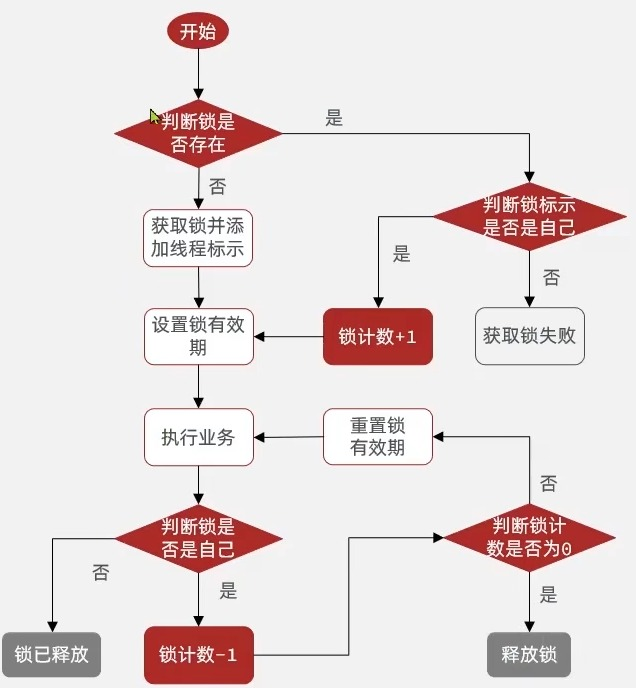

```lua
local key = KEYS[1]; -- 锁的key
local threadId = ARGV[1]; -- 线程唯一标识
local releaseTime = ARGV[2]; -- 锁的自动释放时间
-- 锁不存在
if (redis.call('exists', key) == 0) then
    -- 获取锁并添加线程标识，state设为1
    redis.call('hset', key, threadId, '1');
    -- 设置锁有效期
    redis.call('expire', key, releaseTime);
    return 1; -- 返回结果
end;
-- 锁存在，判断threadId是否为自己
if (redis.call('hexists', key, threadId) == 1) then
    -- 锁存在，重入次数 +1，这里用的是hash结构的incrby增长
    redis.call('hincrby', key, thread, 1);
    -- 设置锁的有效期
    redis.call('expire', key, releaseTime);
    return 1; -- 返回结果
end;
return 0; -- 代码走到这里，说明获取锁的不是自己，获取锁失败
```

- 释放锁的逻辑

```lua
local key = KEYS[1];
local threadId = ARGV[1];
local releaseTime = ARGV[2];
-- 如果锁不是自己的
if (redis.call('HEXISTS', key, threadId) == 0) then
    return nil; -- 直接返回
end;
-- 锁是自己的，锁计数-1，还是用hincrby，不过自增长的值为-1
local count = redis.call('hincrby', key, threadId, -1);
-- 判断重入次数为多少
if (count > 0) then
    -- 大于0，重置有效期
    redis.call('expire', key, releaseTime);
    return nil;
else
    -- 否则直接释放锁
    redis.call('del', key);
    return nil;
end;
```

##### 源码分析

获取锁源码
查看源码，跟我们的实现方式几乎一致

```java
<T> RFuture<T> tryLockInnerAsync(long waitTime, long leaseTime, TimeUnit unit, long threadId, RedisStrictCommand<T> command) {
    this.internalLockLeaseTime = unit.toMillis(leaseTime);
    return this.evalWriteAsync(this.getName(), LongCodec.INSTANCE, command, "if (redis.call('exists', KEYS[1]) == 0) then redis.call('hincrby', KEYS[1], ARGV[2], 1); redis.call('pexpire', KEYS[1], ARGV[1]); return nil; end; if (redis.call('hexists', KEYS[1], ARGV[2]) == 1) then redis.call('hincrby', KEYS[1], ARGV[2], 1); redis.call('pexpire', KEYS[1], ARGV[1]); return nil; end; return redis.call('pttl', KEYS[1]);", Collections.singletonList(this.getName()), this.internalLockLeaseTime, this.getLockName(threadId));
}
```

- 释放锁源码

```java
protected RFuture<Boolean> unlockInnerAsync(long threadId) {
    return this.evalWriteAsync(this.getName(), LongCodec.INSTANCE, RedisCommands.EVAL_BOOLEAN, "if (redis.call('hexists', KEYS[1], ARGV[3]) == 0) then return nil;end; local counter = redis.call('hincrby', KEYS[1], ARGV[3], -1); if (counter > 0) then redis.call('pexpire', KEYS[1], ARGV[2]); return 0; else redis.call('del', KEYS[1]); redis.call('publish', KEYS[2], ARGV[1]); return 1; end; return nil;", Arrays.asList(this.getName(), this.getChannelName()), LockPubSub.UNLOCK_MESSAGE, this.internalLockLeaseTime, this.getLockName(threadId));
}
```

#### Redisson锁重试和WatchDog机制

##### 源码分析

- tryAcquireAsync

```java
private <T> RFuture<Long> tryAcquireAsync(long waitTime, long leaseTime, TimeUnit unit, long threadId) {

  if (leaseTime != -1L) {
    return this.tryLockInnerAsync(waitTime, leaseTime, unit, threadId, RedisCommands.EVAL_LONG);
  } else {
    // 如果没有指定释放时间时间，则指定默认释放时间为getLockWatchdogTimeout，底层源码显示是30*1000ms，也就是30秒
    RFuture<Long> ttlRemainingFuture = this.tryLockInnerAsync(waitTime, this.commandExecutor.getConnectionManager().getCfg().getLockWatchdogTimeout(), TimeUnit.MILLISECONDS, threadId, RedisCommands.EVAL_LONG);
    // 拿到锁之后开启过期时间刷新任务
    ttlRemainingFuture.onComplete((ttlRemaining, e) -> {
      if (e == null) {
        if (ttlRemaining == null) {
          this.scheduleExpirationRenewal(threadId);
        }

      }
    });
    return ttlRemainingFuture;
  }
}
```

- tryLock

并不是一味的重复，是在有效时间内，订阅别人释放锁的信号，才去重复尝试获取锁

```java
public boolean tryLock(long waitTime, long leaseTime, TimeUnit unit) throws InterruptedException {
  long time = unit.toMillis(waitTime);
  long current = System.currentTimeMillis();
  long threadId = Thread.currentThread().getId();
  Long ttl = this.tryAcquire(waitTime, leaseTime, unit, threadId);
  //判断ttl是否为null
  if (ttl == null) {
    return true;
  } else {
    //计算当前时间与获取锁时间的差值，让等待时间减去这个值
    time -= System.currentTimeMillis() - current;
    //如果消耗时间太长了，直接返回false，获取锁失败
    if (time <= 0L) {
      this.acquireFailed(waitTime, unit, threadId);
      return false;
    } else {
      //等待时间还有剩余，再次获取当前时间
      current = System.currentTimeMillis();
      //订阅别人释放锁的信号
      RFuture<RedissonLockEntry> subscribeFuture = this.subscribe(threadId);
      //在剩余时间内，等待这个信号
      if (!subscribeFuture.await(time, TimeUnit.MILLISECONDS)) {
        if (!subscribeFuture.cancel(false)) {
          subscribeFuture.onComplete((res, e) -> {
            if (e == null) {
              //取消订阅
              this.unsubscribe(subscribeFuture, threadId);
            }

          });
        }
        //剩余时间内没等到，返回false
        this.acquireFailed(waitTime, unit, threadId);
        return false;
      } else {
        try {
          //如果剩余时间内等到了别人释放锁的信号，再次计算当前剩余最大等待时间
          time -= System.currentTimeMillis() - current;
          if (time <= 0L) {
            //如果剩余时间为负数，则直接返回false
            this.acquireFailed(waitTime, unit, threadId);
            boolean var20 = false;
            return var20;
          } else {
            boolean var16;
            do {
              //如果剩余时间等到了，dowhile循环重试获取锁
              long currentTime = System.currentTimeMillis();
              ttl = this.tryAcquire(waitTime, leaseTime, unit, threadId);
              //...
            } while(time > 0L);

            this.acquireFailed(waitTime, unit, threadId);
            var16 = false;
            return var16;
          }
        } finally {
          this.unsubscribe(subscribeFuture, threadId);
        }
      }
    }
  }
}
```

- scheduleExpirationRenewal

```java
private void scheduleExpirationRenewal(long threadId) {
  ExpirationEntry entry = new ExpirationEntry();  
  //不存在，才put，表明是第一次进入，不是重入
  ExpirationEntry oldEntry = (ExpirationEntry)EXPIRATION_RENEWAL_MAP.putIfAbsent(this.getEntryName(), entry);
  if (oldEntry != null) {
    oldEntry.addThreadId(threadId);
  } else {
    //如果是第一次进入，则跟新有效期
    entry.addThreadId(threadId);
    this.renewExpiration();
  }
}
```

- renewExpiration

```java
private void renewExpiration() {
  ExpirationEntry ee = (ExpirationEntry)EXPIRATION_RENEWAL_MAP.get(this.getEntryName());
  if (ee != null) {
    //Timeout是一个定时任务
    Timeout task = this.commandExecutor.getConnectionManager().newTimeout(new TimerTask() {
      public void run(Timeout timeout) throws Exception {
        ExpirationEntry ent = (ExpirationEntry)RedissonLock.EXPIRATION_RENEWAL_MAP.get(RedissonLock.this.getEntryName());
        if (ent != null) {
          Long threadId = ent.getFirstThreadId();
          if (threadId != null) {
            //重置有效期
            RFuture<Boolean> future = RedissonLock.this.renewExpirationAsync(threadId);
            future.onComplete((res, e) -> {
              if (e != null) {
                RedissonLock.log.error("Can't update lock " + RedissonLock.this.getName() + " expiration", e);
              } else {
                if (res) {
                  //然后调用自己，递归重置有效期
                  RedissonLock.this.renewExpiration();
                }
              }
            });
          }
        }
      }
      //internalLockLeaseTime是之前WatchDog默认有效期30秒，10秒之后，才会执行
    }, this.internalLockLeaseTime / 3L, TimeUnit.MILLISECONDS);
    ee.setTimeout(task);
  }
}
```

- renewExpirationAsync
  重点看lua脚本，先判断锁是不是自己的，然后更新有效时间

```java
protected RFuture<Boolean> renewExpirationAsync(long threadId) {
  return this.evalWriteAsync(this.getName(), LongCodec.INSTANCE, RedisCommands.EVAL_BOOLEAN, "if (redis.call('hexists', KEYS[1], ARGV[2]) == 1) then redis.call('pexpire', KEYS[1], ARGV[1]); return 1; end; return 0;", Collections.singletonList(this.getName()), this.internalLockLeaseTime, this.getLockName(threadId));
}
```

- 释放锁的时候会终止过期时间刷新任务
- cancelExpirationRenewal

```java
void cancelExpirationRenewal(Long threadId) {
  //将之前的线程终止掉
  ExpirationEntry task = (ExpirationEntry)EXPIRATION_RENEWAL_MAP.get(this.getEntryName());
  if (task != null) {
    if (threadId != null) {
      task.removeThreadId(threadId);
    }
    if (threadId == null || task.hasNoThreads()) {
      //获取之前的定时任务
      Timeout timeout = task.getTimeout();
      if (timeout != null) {
        //取消
        timeout.cancel();
      }
      EXPIRATION_RENEWAL_MAP.remove(this.getEntryName());
    }
  }
}
```

#### Redisson锁的MutiLock原理

为了提高Redis的可用性，会搭建集群或者主从，以主从为例

写命令在主机上，主机会将数据同步给从机，假设主机还没来得及把数据写入到从机，主机宕机了，哨兵会发现主机宕机了，于是选举一个slave(从机)变成master(主机)，而此时新的master(主机)上并没有锁的信息，那么其他线程就可以获取锁，又会引发安全问题

为了解决这个问题，Redisson提出来了MutiLock锁，每个节点的地位都是一样的，都可以当做是主机，加锁的逻辑需要写入到每一个节点上，只有所有的服务器都写入成功，此时才是加锁成功

##### 使用联锁

我们首先要注入三个RedissonClient对象

```java
@Resource
private RedissonClient redissonClient;
@Resource
private RedissonClient redissonClient2;
@Resource
private RedissonClient redissonClient3;

private RLock lock;

@BeforeEach
void setUp() {
    RLock lock1 = redissonClient.getLock("lock");
    RLock lock2 = redissonClient2.getLock("lock");
    RLock lock3 = redissonClient3.getLock("lock");
    lock = redissonClient.getMultiLock(lock1, lock2, lock3);
}

@Test
void method1() {
    boolean success = lock.tryLock();
    redissonClient.getMultiLock();
    if (!success) {
        log.error("获取锁失败，1");
        return;
    }
    try {
        log.info("获取锁成功");
        method2();
    } finally {
        log.info("释放锁，1");
        lock.unlock();
    }
}

void method2() {
    RLock lock = redissonClient.getLock("lock");
    boolean success = lock.tryLock();
    if (!success) {
        log.error("获取锁失败，2");
        return;
    }
    try {
        log.info("获取锁成功，2");
    } finally {
        log.info("释放锁，2");
        lock.unlock();
    }
}
```

##### 源码分析

- 当我们没有传入锁对象来创建联锁的时候，则会抛出一个异常，反之则将我们传入的可变参数锁对象封装成一个集合

```java
public RedissonMultiLock(RLock... locks) {
  if (locks.length == 0) {
    throw new IllegalArgumentException("Lock objects are not defined");
  } else {
    this.locks.addAll(Arrays.asLisAt(locks));
  }
}
```

- 联锁的tryLock

实际就是一个列表，依次去尝试获取锁，一旦获取失败，需要将之前获取的全部释放，获取成功后，需要遍历依次更新过期时间。

```java
public boolean tryLock(long waitTime, long leaseTime, TimeUnit unit) throws InterruptedException {
  //...
  //锁失败的限制，源码返回是的0
  int failedLocksLimit = this.failedLocksLimit();
  //已经获取成功的锁
  List<RLock> acquiredLocks = new ArrayList(this.locks.size());
  //迭代器，用于遍历
  ListIterator<RLock> iterator = this.locks.listIterator();

  while(iterator.hasNext()) {
    RLock lock = (RLock)iterator.next();

    boolean lockAcquired;
    try {
      //没有等待时间和释放时间，调用空参的tryLock
      if (waitTime == -1L && leaseTime == -1L) {
        lockAcquired = lock.tryLock();
      } else {
        //否则调用带参的tryLock
        long awaitTime = Math.min(lockWaitTime, remainTime);
        lockAcquired = lock.tryLock(awaitTime, newLeaseTime, TimeUnit.MILLISECONDS);
      }
    }//...
    //判断获取锁是否成功
    if (lockAcquired) {
      //成功则将锁放入成功锁的集合
      acquiredLocks.add(lock);
    } else {
      //如果获取锁失败
      //判断当前锁的数量，减去成功获取锁的数量，如果为0，则所有锁都成功获取，跳出循环
      if (this.locks.size() - acquiredLocks.size() == this.failedLocksLimit()) {
        break;
      }
      //否则将拿到的锁都释放掉
      if (failedLocksLimit == 0) {
        this.unlockInner(acquiredLocks);
        //如果等待时间为-1，则不想重试，直接返回false
        if (waitTime == -1L) {
          return false;
        }

        failedLocksLimit = this.failedLocksLimit();
        //将已经拿到的锁都清空
        acquiredLocks.clear();
        //将迭代器往前迭代，相当于重置指针，放到第一个然后重试获取锁
        while(iterator.hasPrevious()) {
          iterator.previous();
        }
      } else {
        --failedLocksLimit;
      }
    }
    //...
  }
  //如果设置了锁的有效期
  if (leaseTime != -1L) {
    List<RFuture<Boolean>> futures = new ArrayList(acquiredLocks.size());
    //迭代器用于遍历已经获取成功的锁
    Iterator var24 = acquiredLocks.iterator();

    while(var24.hasNext()) {
      RLock rLock = (RLock)var24.next();
      //设置每一把锁的有效期
      RFuture<Boolean> future = ((RedissonLock)rLock).expireAsync(unit.toMillis(leaseTime), TimeUnit.MILLISECONDS);
      futures.add(future);
    }
    //...
  }
  //但如果没设置有效期，则会触发WatchDog机制，自动帮我们设置有效期，所以大多数情况下，我们不需要自己设置有效期
  return true;
}
```

### 小结

1. 不可重入Redis分布式锁
   - 原理：利用SETNX的互斥性；利用EX避免死锁；释放锁时判断线程标识
   - 缺陷：不可重入、无法重试、锁超时失效
2. 可重入Redis分布式锁
   - 原理：利用Hash结构，记录线程标识与重入次数；利用WatchDog延续锁时间；利用信号量控制锁重试等待
   - 缺陷：Redis宕机引起锁失效问题
3. Redisson的multiLock
   - 原理：多个独立的Redis节点，必须在所有节点都获取重入锁，才算获取锁成功


### 秒杀优化

#### 思想

当用户发起请求，此时会先请求Nginx，Nginx反向代理到Tomcat，而Tomcat中的程序，会进行串行操作，分为如下几个步骤：查询优惠券，判断秒杀库存是否足够，查询订单，校验是否一人一单，扣减库存，创建订单。在这六个步骤中，有很多操作都是要去操作数据库的，而且还是一个线程串行执行，这样就会导致我们的程序执行很慢，所以我们需要异步程序执行。

`优化方案：`我们将耗时较短的逻辑判断放到Redis中，例如：库存是否充足，是否一人一单这样的操作，然后直接返回。后台线程去执行队列里的下单任务。

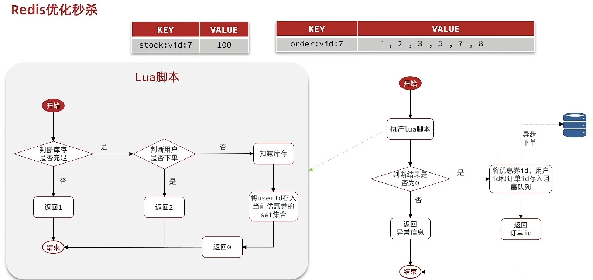

#### 实现

在添加秒杀券时，将其信息存到redis

```java
// 保存秒杀优惠券信息到Reids，Key名中包含优惠券ID，Value为优惠券的剩余数量
stringRedisTemplate.opsForValue().set(SECKILL_STOCK_KEY + voucher.getId(), voucher.getStock().toString()); 
```

编写lua脚本

```lua
-- 订单id
local voucherId = ARGV[1]
-- 用户id
local userId = ARGV[2]
-- 优惠券key
local stockKey = 'seckill:stock:' .. voucherId
-- 订单key
local orderKey = 'seckill:order:' .. voucherId
-- 判断库存是否充足
if (tonumber(redis.call('get', stockKey)) <= 0) then
    return 1
end
-- 判断用户是否下单
if (redis.call('sismember', orderKey, userId) == 1) then
    return 2
end
-- 扣减库存
redis.call('incrby', stockKey, -1)
-- 将userId存入当前优惠券的set集合
redis.call('sadd', orderKey, userId)
return 0
```

使用阻塞队列保存异步下单消息

```java
private final BlockingQueue<VoucherOrder> orderTasks = new ArrayBlockingQueue<>(1024 * 1024);
@Override
public Result seckillVoucher(Long voucherId) {
  Long result = stringRedisTemplate.execute(SECKILL_SCRIPT,
                                            Collections.emptyList(), voucherId.toString(),
                                            UserHolder.getUser().getId().toString());
  if (result.intValue() != 0) {
    return Result.fail(result.intValue() == 1 ? "库存不足" : "不能重复下单");
  }
  long orderId = redisIdWorker.nextId("order");
  //封装到voucherOrder中
  VoucherOrder voucherOrder = new VoucherOrder();
  voucherOrder.setVoucherId(voucherId);
  voucherOrder.setUserId(UserHolder.getUser().getId());
  voucherOrder.setId(orderId);
  //加入到阻塞队列
  orderTasks.add(voucherOrder);
  return Result.ok(orderId);
}
```

使用线程池完成异步下单

```java
private static final ExecutorService SECKILL_ORDER_EXECUTOR = Executors.newSingleThreadExecutor();

@PostConstruct
private void init() {
  SECKILL_ORDER_EXECUTOR.submit(new VoucherOrderHandler());
}

private class VoucherOrderHandler implements Runnable {
  @Override
  public void run() {
    while (true) {
      try {
        //1. 获取队列中的订单信息，这个take会阻塞等待
        VoucherOrder voucherOrder = orderTasks.take();
        //2. 创建订单
        handleVoucherOrder(voucherOrder);
      } catch (Exception e) {
        log.error("订单处理异常", e);
      }
    }
  }
}
```

注意：在`handleVoucherOrder`中，需要用到proxy上下文，然后这是由另外的线程执行，AopContext源码获取代理对象是通过ThreadLocal进行获取的，所以只能将该对象变成主线程的静态变量，才可能获取到。

```java
private static final ThreadLocal<Object> currentProxy = new NamedThreadLocal("Current AOP proxy");
```

然后再seckillVoucher中完成初始化

```java
//主线程获取代理对象
proxy = (IVoucherOrderService) AopContext.currentProxy();
```

#### 分析

秒杀业务的优化思路是什么？

1. 先利用Redis完成库存容量、一人一单的判断，完成抢单业务
2. 再将下单业务放入阻塞队列，利用独立线程异步下单

基于阻塞队列的异步秒杀存在哪些问题？

1. 内存限制问题：
   - 我们现在使用的是JDK里的阻塞队列，它使用的是JVM的内存，如果在高并发的条件下，无数的订单都会放在阻塞队列里，可能就会造成内存溢出，所以我们在创建阻塞队列时，设置了一个长度，但是如果真的存满了，再有新的订单来往里塞，那就塞不进去了，存在内存限制问题
2. 数据安全问题：
   - 经典服务器宕机了，用户明明下单了，但是数据库里没看到


### Redis消息队列

什么是消息队列？包括3个角色

1. 消息队列：存储和管理消息，也被称为消息代理（Message Broker）
2. 生产者：发送消息到消息队列
3. 消费者：从消息队列获取消息并处理消息

#### 基于List实现消息队列

Redis的list数据结构是一个双向链表，可以利用：LPUSH结合RPOP或者RPUSH结合LPOP来实现消息队列。

不过需要注意的是，当队列中没有消息时，RPOP和LPOP操作会返回NULL，应该使用BRPOP或者BLPOP来实现阻塞效果

- 优点
  1. 利用Redis存储，不受限于JVM内存上限
  2. 基于Redis的持久化机制，数据安全性有保障
  3. 可以满足消息有序性
- 缺点
  1. 无法避免消息丢失(经典服务器宕机)
  2. 只支持单消费者(一个消费者把消息拿走了，其他消费者就看不到这条消息了)

#### 基于PubSub的消息队列

PubSub(发布订阅)是Redis2.0版本引入的消息传递模型。顾名思义，消费和可以订阅一个或多个channel，生产者向对应channel发送消息后，所有订阅者都能收到相关消息

- `SUBSCRIBE channel [channel]`：订阅一个或多个频道
- `PUBLISH channel msg`：向一个频道发送消息
- `PSUBSCRIBE pattern [pattern]`：订阅与pattern格式匹配的所有频道

- 优点：
  1. 采用发布订阅模型，支持多生产，多消费
- 缺点：
  1. 不支持数据持久化
  2. 无法避免消息丢失（如果向频道发送了消息，却没有人订阅该频道，那发送的这条消息就丢失了）
  3. 消息堆积有上限，超出时数据丢失（消费者拿到数据的时候处理的太慢，而发送消息发的太快）

#### 基于Stream的消息队列

Stream是Redis 5.0引入的一种新数据类型，一个功能非常完善的消息队列

发送消息的命令

```bash
## 创建名为users的队列，并向其中发送一个消息，内容是{name=jack, age=21}，并且使用Redis自动生成ID
XADD users * name jack age 21
```

读取消息的方式之一：XREAD

```bash
云服务器:0>XREAD COUNT 1 STREAMS users 0
1) 1) "users"
   2) 1) 1) "1667119621804-0"
         2) 1) "name"
            2) "jack"
            3) "age"
            4) "21"
```

在业务开发中，我们可以使用循环调用的XREAD阻塞方式来查询最新消息，从而实现持续监听队列的效果

```java
while (true){
    //尝试读取队列中的消息，最多阻塞2秒
    Object msg = redis.execute("XREAD COUNT 1 BLOCK 2000 STREAMS users $");
    //没读取到，跳过下面的逻辑
    if(msg == null){
        continue;
    }
    //处理消息
    handleMessage(msg);
}
```

注意：当我们指定其实ID为$时，代表只能读取到最新消息，如果在处理一条消息的过程中，又有超过1条以上的消息到达队列，那么下次获取的时候，也只能获取到最新的一条，会出现`漏读消息`的问题

STREAM类型消息队列的XREAD命令特点

1. 消息可回溯
2. 一个消息可以被多个消费者读取
3. 可以阻塞读取
4. 有漏读消息的风险

#### 基于Stream的消息队列–消费者组

消费者组(Consumer Group)：将多个消费者划分到一个组中，监听同一个队列，具备以下特点

1. 消息分流
   - 队列中的消息会分留给组内的不同消费者，而不是重复消费者，从而加快消息处理的速度
2. 消息标识
   - 消费者会维护一个标识，记录最后一个被处理的消息，哪怕消费者宕机重启，还会从标识之后读取消息，确保每一个消息都会被消费
3. 消息确认
   - 消费者获取消息后，消息处于pending状态，并存入一个pending-list，当处理完成后，需要通过XACK来确认消息，标记消息为已处理，才会从pending-list中移除

消费者监听消息的基本思路

```java
while(true){
  // 尝试监听队列，使用阻塞模式，最大等待时长为2000ms
  // `>`：从下一个未消费的消息开始
  Object msg = redis.call("XREADGROUP GROUP g1 c1 COUNT 1 BLOCK 2000 STREAMS s1 >")
    if(msg == null){
      // 没监听到消息，重试
      continue;
    }
  try{
    //处理消息，完成后要手动确认ACK，ACK代码在handleMessage中编写
    handleMessage(msg);
  } catch(Exception e){
    while(true){
      //0表示从pending-list中的第一个消息开始，如果前面都ACK了，那么这里就不会监听到消息
      Object msg = redis.call("XREADGROUP GROUP g1 c1 COUNT 1 STREAMS s1 0");
      if(msg == null){
        //null表示没有异常消息，所有消息均已确认，结束循环
        break;
      }
      try{
        //说明有异常消息，再次处理
        handleMessage(msg);
      } catch(Exception e){
        //再次出现异常，记录日志，继续循环
        log.error("..");
        continue;
      }
    }
  }
}
```

STREAM类型消息队列的XREADGROUP命令的特点

1. 消息可回溯
2. 可以多消费者争抢消息，加快消费速度
3. 可以阻塞读取
4. 没有消息漏读风险
5. 有消息确认机制，保证消息至少被消费一次

|              |                   List                    |       PubSub       |                         Stream                          |
| :----------: | :---------------------------------------: | :----------------: | :-----------------------------------------------------: |
|  消息持久化  |                   支持                    |       不支持       |                          支持                           |
|   阻塞读取   |                   支持                    |        支持        |                          支持                           |
| 消息堆积处理 | 受限于内存空间， 可以利用多消费者加快处理 | 受限于消费者缓冲区 | 受限于队列长度， 可以利用消费者组提高消费速度，减少堆积 |
| 消息确认机制 |                  不支持                   |       不支持       |                          支持                           |
|   消息回溯   |                  不支持                   |       不支持       |                          支持                           |


### stream实现秒杀

创建消息队列

```bash
XGROUP CREATE stream.orders g1 0 MKSTREAM
```

修改lua脚本

```lua
-- 订单id
local voucherId = ARGV[1]
-- 用户id
local userId = ARGV[2]
-- 新增orderId，但是变量名用id就好，因为VoucherOrder实体类中的orderId就是用id表示的
local id = ARGV[3]
-- 优惠券key
local stockKey = 'seckill:stock:' .. voucherId
-- 订单key
local orderKey = 'seckill:order:' .. voucherId
-- 判断库存是否充足
if (tonumber(redis.call('get', stockKey)) <= 0) then
    return 1
end
-- 判断用户是否下单
if (redis.call('sismember', orderKey, userId) == 1) then
    return 2
end
-- 扣减库存
redis.call('incrby', stockKey, -1)
-- 将userId存入当前优惠券的set集合
redis.call('sadd', orderKey, userId)
-- 将下单数据保存到消息队列中
redis.call("sadd", 'stream.orders', '*', 'userId', userId, 'voucherId', voucherId, 'id', id)
return 0
```

消费消息处理逻辑

```java
String queueName = "stream.orders";

private class VoucherOrderHandler implements Runnable {
  @Override
  public void run() {
    while (true) {
      try {
        //1. 获取队列中的订单信息 XREADGROUP GROUP g1 c1 COUNT 1 BLOCK 2000 STREAMS stream.orders >
        List<MapRecord<String, Object, Object>> records = stringRedisTemplate.opsForStream().read(Consumer.from("g1", "c1"),
                                                                                                  StreamReadOptions.empty().count(1).block(Duration.ofSeconds(2)),
                                                                                                  //ReadOffset.lastConsumed()底层就是 '>'
                                                                                                  StreamOffset.create(queueName, ReadOffset.lastConsumed()));
        //2. 判断消息是否获取成功
        if (records == null || records.isEmpty()) {
          continue;
        }
        //3. 消息获取成功之后，我们需要将其转为对象
        MapRecord<String, Object, Object> record = records.get(0);
        Map<Object, Object> values = record.getValue();
        VoucherOrder voucherOrder = BeanUtil.fillBeanWithMap(values, new VoucherOrder(), true);
        //4. 获取成功，执行下单逻辑，将数据保存到数据库中
        handleVoucherOrder(voucherOrder);
        //5. 手动ACK，SACK stream.orders g1 id
        stringRedisTemplate.opsForStream().acknowledge(queueName, "g1", record.getId());
      } catch (Exception e) {
        log.error("订单处理异常", e);
        //订单异常的处理方式我们封装成一个函数，避免代码太臃肿
        handlePendingList();
      }
    }
  }
}

private void handlePendingList() {
  while (true) {
    try {
      //1. 获取pending-list中的订单信息 XREADGROUP GROUP g1 c1 COUNT 1 BLOCK 2000 STREAMS stream.orders 0
      List<MapRecord<String, Object, Object>> records = stringRedisTemplate.opsForStream().read(
        Consumer.from("g1", "c1"),
        StreamReadOptions.empty().count(1),
        StreamOffset.create(queueName, ReadOffset.from("0")));
      //2. 判断pending-list中是否有未处理消息
      if (records == null || records.isEmpty()) {
        //如果没有就说明没有异常消息，直接结束循环
        break;
      }
      //3. 消息获取成功之后，我们需要将其转为对象
      MapRecord<String, Object, Object> record = records.get(0);
      Map<Object, Object> values = record.getValue();
      VoucherOrder voucherOrder = BeanUtil.fillBeanWithMap(values, new VoucherOrder(), true);
      //4. 获取成功，执行下单逻辑，将数据保存到数据库中
      handleVoucherOrder(voucherOrder);
      //5. 手动ACK，SACK stream.orders g1 id
      stringRedisTemplate.opsForStream().acknowledge(queueName, "g1", record.getId());
    } catch (Exception e) {
      log.info("处理pending-list异常");
      //如果怕异常多次出现，可以在这里休眠一会儿
      try {
        Thread.sleep(50);
      } catch (InterruptedException ex) {
        throw new RuntimeException(ex);
      }
    }
  }
}
```


## 2达人探店

点赞信息由redis存储，而不是mysql

按点赞顺序展示点赞用户，比如显示最早点赞的TOP5，形成点赞排行榜，类似朋友圈，用SortedSet(Zset)

|          |         List         |     Set      |    SortedSet    |
| :------: | :------------------: | :----------: | :-------------: |
| 排序方式 |    按添加顺序排序    |   无法排序   | 根据score值排序 |
|  唯一性  |        不唯一        |     唯一     |      唯一       |
| 查找方式 | 按索引查找或首尾查找 | 根据元素查找 |  根据元素查找   |

点赞业务

```java
@Override
public Result likeBlog(Long id) {
  //1. 获取当前用户信息
  Long userId = UserHolder.getUser().getId();
  //2. 如果当前用户未点赞，则点赞数 +1，同时将用户加入set集合
  String key = BLOG_LIKED_KEY + id;
  //尝试获取score
  Double score = stringRedisTemplate.opsForZSet().score(key, userId.toString());
  //为null，则表示集合中没有该用户
  if (score == null) {
    //点赞数 +1
    boolean success = update().setSql("liked = liked + 1").eq("id", id).update();
    //将用户加入set集合
    if (success) {
      stringRedisTemplate.opsForZSet().add(key, userId.toString(), System.currentTimeMillis());
    }
    //3. 如果当前用户已点赞，则取消点赞，将用户从set集合中移除
  } else {
    //点赞数 -1
    boolean success = update().setSql("liked = liked - 1").eq("id", id).update();
    if (success) {
      //从set集合移除
      stringRedisTemplate.opsForZSet().remove(key, userId.toString());
    }
  }
  return Result.ok();
}
```

返回前五个点赞用户业务：**sql排序和流处理**

```java
@Override
public Result queryBlogLikes(Integer id) {
  String key = BLOG_LIKED_KEY + id;
  //zrange key 0 4  查询zset中前5个元素
  Set<String> top5 = stringRedisTemplate.opsForZSet().range(key, 0, 4);
  //如果是空的(可能没人点赞)，直接返回一个空集合
  if (top5 == null || top5.isEmpty()) {
    return Result.ok(Collections.emptyList());
  }
  List<Long> ids = top5.stream().map(Long::valueOf).collect(Collectors.toList());
  //将ids使用`,`拼接，SQL语句查询出来的结果并不是按照我们期望的方式进行排
  //所以我们需要用order by field来指定排序方式，期望的排序方式就是按照查询出来的id进行排序
  String idsStr = StrUtil.join(",", ids);
  //select * from tb_user where id in (ids[0], ids[1] ...) order by field(id, ids[0], ids[1] ...)
  // 流处理
  List<UserDTO> userDTOS = userService.query().in("id", ids)
    .last("order by field(id," + idsStr + ")")
    .list().stream()
    .map(user -> BeanUtil.copyProperties(user, UserDTO.class))
    .collect(Collectors.toList());
  return Result.ok(userDTOS);
}
```


## 3好友关注

### 共同关注

在关注博主的同时，需要将数据放到set集合中，当取消关注时，也需要将数据从set集合中删除。在set集合中，有交集并集补集的api，可以通过api查询两个set集合的交集

```java
@Override
public Result followCommons(Long id) {
  //获取当前用户id
  Long userId = UserHolder.getUser().getId();
  String key1 = "follows:" + id;
  String key2 = "follows:" + userId;
  //对当前用户和博主用户的关注列表取交集
  Set<String> intersect = stringRedisTemplate.opsForSet().intersect(key1, key2);
  if (intersect == null || intersect.isEmpty()) {
    //无交集就返回个空集合
    return Result.ok(Collections.emptyList());
  }
  //将结果转为list
  List<Long> ids = intersect.stream().map(Long::valueOf).collect(Collectors.toList());
  //之后根据ids去查询共同关注的用户，封装成UserDto再返回
  List<UserDTO> userDTOS = userService.listByIds(ids).stream().map(user ->
                                                                   BeanUtil.copyProperties(user, UserDTO.class)).collect(Collectors.toList());
  return Result.ok(userDTOS);
}
```

### Feed流

当我们关注了用户之后，这个用户发布了动态，那我们应该把这些数据推送给用户，这个需求，我们又称其为Feed流，关注推送也叫作Feed流，直译为投喂，为用户提供沉浸式体验，通过无限下拉刷新获取新的信息，

对于传统的模式内容检索：用户需要主动通过搜索引擎或者是其他方式去查找想看的内容

对于新型Feed流的效果：系统分析用户到底想看什么，然后直接把内容推送给用户，从而使用户能更加节约时间，不用去主动搜素

Feed流的实现有两种模式

1. Timeline：不做内容筛选，简单的按照内容发布时间排序，常用于好友或关注(B站关注的up，朋友圈等)
   - 优点：信息全面，不会有缺失，并且实现也相对简单
   - 缺点：信息噪音较多，用户不一定感兴趣，内容获取效率低
2. 智能排序：利用智能算法屏蔽掉违规的、用户不感兴趣的内容，推送用户感兴趣的信息来吸引用户
   - 优点：投喂用户感兴趣的信息，用户粘度很高，容易沉迷
   - 缺点：如果算法不精准，可能会起到反作用

采用Timeline模式，有三种具体的实现方案：拉模式，推模式，推拉结合

- 拉模式，也叫读扩散
  - 优点：比较节约空间，因为赵六在读取信息时，并没有重复读取，并且读取完之后，可以将他的收件箱清除
  - 缺点：有延迟，当用户读取数据时，才会去关注的人的时发件箱中拉取信息，假设该用户关注了海量用户，那么此时就会拉取很多信息，对服务器压力巨大
- 推模式，也叫写扩散
  - 推模式是没有写邮箱的，内容会主动发送到粉丝的收件箱中
  - 优点：时效快，不用临时拉取
  - 缺点：内存压力大，假设一个大V发了一个动态，很多人关注他，那么就会写很多份数据到粉丝那边去
- 推拉结合，读写混合，兼具推和拉两种模式的优点
  - 推拉模式是一个折中的方案，站在发件人这一边，如果是普通人，采用写扩散的方式。但如果是大V，那么将数据写一份到发件箱中去，然后在直接写一份到<活跃>粉丝的收件箱中。

使用redis的sortedSet数据结构（主要是可以排序，可以通过分数获取数据，而不是下标）充当收件箱，然后再获取信息时，需要使用滚动分页，也就是分页的时候要记录上一个分页的位置，否则有新的信息加入，会造成分页异常。


## 4附近商户

### GEO数据结构的基本用法

GEO就是Geolocation的简写形式，代表地理坐标。Redis在3.2版本中加入了对GEO的支持，允许存储地理坐标信息，帮助我们根据经纬度来检索数据，常见的命令有

- GEOADD：添加一个地理空间信息，包含：经度（longitude）、纬度（latitude）、值（member）

```
GEOADD china 13.361389 38.115556 "shanghai" 15.087269 37.502669 "beijing"
```

- GEODIST：计算指定的两个点之间的距离并返回

```
GEODIST china beijing shanghai km
```

- GEOHASH：将指定member的坐标转化为hash字符串形式并返回

```
GEOHASH china beijing shanghai
1) "sqdtr74hyu0"
2) "sqc8b49rny0"
```

- GEOPOS：返回指定member的坐标

```
geopos china beijing shanghai
1)  1) "15.08726745843887329"
    2) "37.50266842333162032"

2)  1) "13.36138933897018433"
    2) "38.11555639549629859"
```

- GEOSEARCH：在指定范围内搜索member，并按照与制定点之间的距离排序后返回，范围可以使圆形或矩形，6.2的新功能

```
geosearch china FROMLONLAT 15 37 BYRADIUS 200 km ASC WITHCOORD WITHDIST
1)  1) "beijing"
    2) "56.4413"
    3)  1) "15.08726745843887329"
        2) "37.50266842333162032"
2)  1) "shanghai"
    2) "190.4424"
    3)  1) "13.36138933897018433"
        2) "38.11555639549629859"

geosearch china FROMLONLAT 15 37 BYBOX 400 400 km DESC WITHCOORD WITHDIST
1)  1) "shanghai"
    2) "190.4424"
    3)  1) "13.36138933897018433"
        2) "38.11555639549629859"
2)  1) "beijing"
    2) "56.4413"
    3)  S1) "15.08726745843887329"
        2) "37.50266842333162032"
```

### 实现

加载商铺

```java
@Test
public void loadShopData() {
  List<Shop> shopList = shopService.list();
  Map<Long, List<Shop>> map = shopList.stream().collect(Collectors.groupingBy(Shop::getTypeId));
  for (Map.Entry<Long, List<Shop>> entry : map.entrySet()) {
    Long typeId = entry.getKey();
    List<Shop> shops = entry.getValue();
    String key = SHOP_GEO_KEY + typeId;
    List<RedisGeoCommands.GeoLocation<String>> locations = new ArrayList<>(shops.size());
    for (Shop shop : shops) {
      //将当前type的商铺都添加到locations集合中
      locations.add(new RedisGeoCommands.GeoLocation<>(shop.getId().toString(), new Point(shop.getX(), shop.getY())));
    }
    //批量写入
    stringRedisTemplate.opsForGeo().add(key, locations);
  }
}
```

查询附近商铺

```java
@Override
public Result queryShopByType(Integer typeId, Integer current, Double x, Double y) {
  //1. 判断是否需要根据距离查询
  if (x == null || y == null) {
    // 根据类型分页查询
    Page<Shop> page = query()
      .eq("type_id", typeId)
      .page(new Page<>(current, SystemConstants.DEFAULT_PAGE_SIZE));
    // 返回数据
    return Result.ok(page.getRecords());
  }
  //2. 计算分页查询参数
  int from = (current - 1) * SystemConstants.MAX_PAGE_SIZE;
  int end = current * SystemConstants.MAX_PAGE_SIZE;
  String key = SHOP_GEO_KEY + typeId;
  //3. 查询redis、按照距离排序、分页; 结果：shopId、distance
  //GEOSEARCH key FROMLONLAT x y BYRADIUS 5000 m WITHDIST
  GeoResults<RedisGeoCommands.GeoLocation<String>> results = stringRedisTemplate.opsForGeo().search(key,
                                                                                                    GeoReference.fromCoordinate(x, y),
                                                                                                    new Distance(5000),
                                                                                                    RedisGeoCommands.GeoSearchCommandArgs.newGeoSearchArgs().includeDistance().limit(end));
  if (results == null) {
    return Result.ok(Collections.emptyList());
  }
  //4. 解析出id
  List<GeoResult<RedisGeoCommands.GeoLocation<String>>> list = results.getContent();
  if (list.size() < from) {
    //起始查询位置大于数据总量，则说明没数据了，返回空集合
    return Result.ok(Collections.emptyList());
  }
  ArrayList<Long> ids = new ArrayList<>(list.size());
  HashMap<String, Distance> distanceMap = new HashMap<>(list.size());
  list.stream().skip(from).forEach(result -> {
    String shopIdStr = result.getContent().getName();
    ids.add(Long.valueOf(shopIdStr));
    Distance distance = result.getDistance();
    distanceMap.put(shopIdStr, distance);
  });
  //5. 根据id查询shop
  String idsStr = StrUtil.join(",", ids);
  List<Shop> shops = query().in("id", ids).last("ORDER BY FIELD( id," + idsStr + ")").list();
  for (Shop shop : shops) {
    //设置shop的举例属性，从distanceMap中根据shopId查询
    shop.setDistance(distanceMap.get(shop.getId().toString()).getValue());
  }
  //6. 返回
  return Result.ok(shops);
}
```


## 5用户签到

可以使用二进制位来记录每个月的签到情况，签到记录为1，未签到记录为0

把每一个bit位对应当月的每一天，形成映射关系，用0和1标识业务状态，这种思路就成为位图（BitMap）。这样我们就能用极小的空间，来实现大量数据的表示

Redis中是利用String类型数据结构实现BitMap，因此最大上限是512M，转换为bit则是2^32个bit位

BitMap的操作命令有

- SETBIT：向指定位置（offset）存入一个0或1
- GETBIT：获取指定位置（offset）的bit值
- BITCOUNT：统计BitMap中值为1的bit位的数量
- BITFIELD：操作（查询、修改、自增）BitMap中bit数组中的指定位置（offset）的值
- BITFIELD_RO：获取BitMap中bit数组，并以十进制形式返回
- BITOP：将多个BitMap的结果做位运算（与、或、异或）
- BITPOS：查找bit数组中指定范围内第一个0或1出现的位置

```java
@Override
public Result sign() {
  //1. 获取当前用户
  Long userId = UserHolder.getUser().getId();
  //2. 获取日期
  LocalDateTime now = LocalDateTime.now();
  //3. 拼接key
  String keySuffix = now.format(DateTimeFormatter.ofPattern(":yyyyMM"));
  String key = USER_SIGN_KEY + userId + keySuffix;
  //4. 获取今天是当月第几天(1~31)
  int dayOfMonth = now.getDayOfMonth();
  //5. 写入Redis  BITSET key offset 1
  stringRedisTemplate.opsForValue().setBit(key, dayOfMonth - 1, true);
  return Result.ok();
}
```

## 6UV统计

### HyperLogLog

UV：全称Unique Visitor，也叫独立访客量，是指通过互联网访问、浏览这个网页的自然人。1天内同一个用户多次访问该网站，只记录1次。

PV：全称Page View，也叫页面访问量或点击量，用户每访问网站的一个页面，记录1次PV，用户多次打开页面，则记录多次PV。往往用来衡量网站的流量。

UV统计在服务端做会很麻烦，因为要判断该用户是否已经统计过了，需要将统计过的信息保存，但是如果每个访问的用户都保存到Redis中，那么数据库会非常恐怖，那么该如何处理呢？

HyperLogLog(HLL)是从Loglog算法派生的概率算法，用户确定非常大的集合基数，而不需要存储其所有值，算法相关原理可以参考下面这篇文章：https://juejin.cn/post/6844903785744056333#heading-0

Redis中的HLL是基于string结构实现的，单个HLL的内存`永远小于16kb`，`内存占用低`的令人发指！作为代价，其测量结果是概率性的，`有小于0.81％的误差`。不过对于UV统计来说，这完全可以忽略。

常用的三个方法

```
PFADD key element [element...]
summary: Adds the specified elements to the specified HyperLogLog

PFCOUNT key [key ...]
Return the approximated cardinality of the set(s) observed by the HyperLogLog at key(s).

PFMERGE destkey sourcekey [sourcekey ...]
lnternal commands for debugging HyperLogLog values
```

### 测试百万数据的统计

- 使用单元测试，向HyperLogLog中添加100万条数据，看看内存占用是否真的那么低，以及统计误差如何

```java
@Test
public void testHyperLogLog() {
  String[] users = new String[1000];
  int j = 0;
  for (int i = 0; i < 1000000; i++) {
    j = i % 1000;
    users[j] = "user_" + i;
    if (j == 999) {
      stringRedisTemplate.opsForHyperLogLog().add("HLL", users);
    }
  }
  Long count = stringRedisTemplate.opsForHyperLogLog().size("HLL");
  System.out.println("count = " + count);
}
```

- 插入100W条数据，得到的count为997593，误差率为0.002407%
- 去Redis图形化界面中查看占用情况为：12.3K字节
