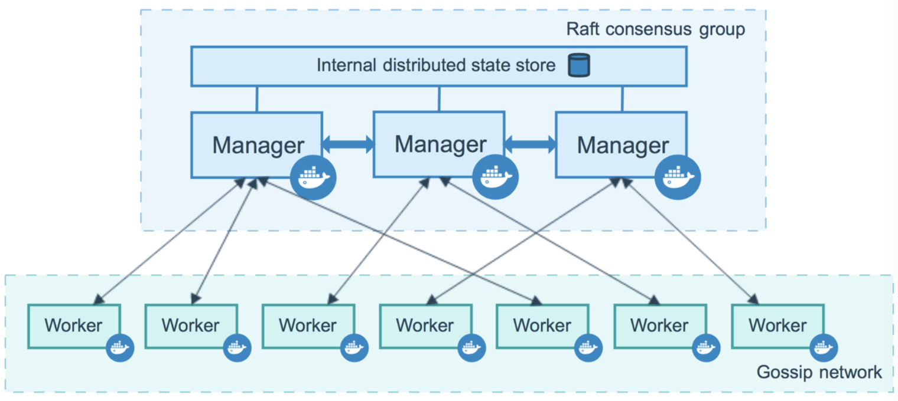
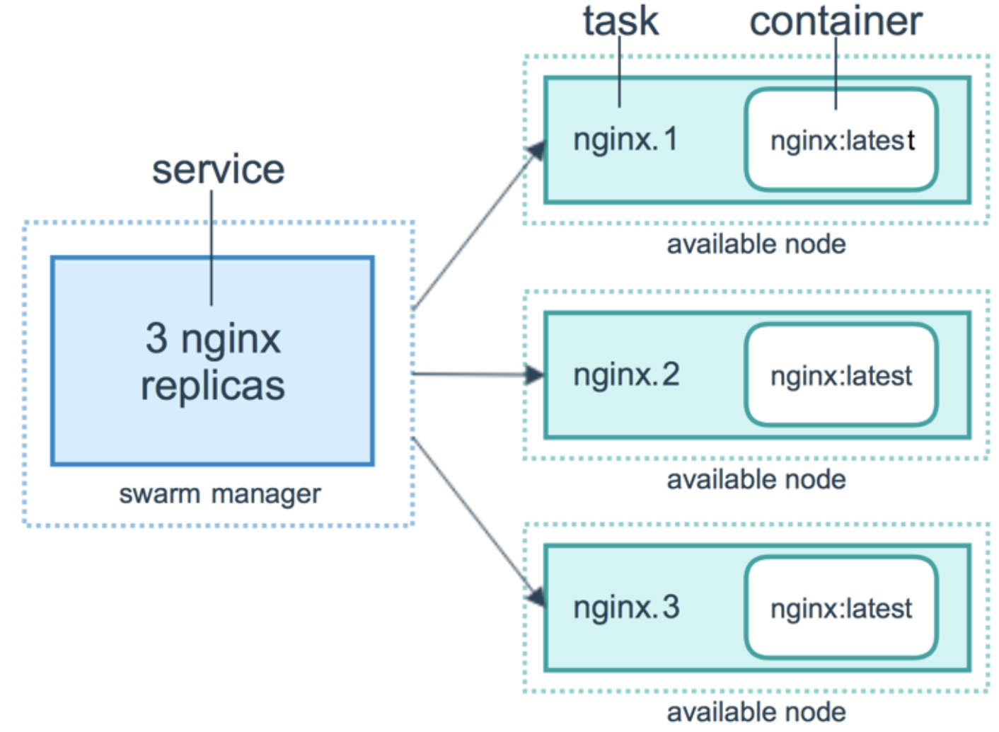

# Docker 三剑客

这里就只是大概介绍了解一下

Docker三大编排工具：

- `Docker Compose`：是用来组装多容器应用的工具，可以在 Swarm集群中部署分布式应用。
- `Docker Machine`：是支持多平台安装Docker的工具，使用 Docker Machine，可以很方便地在笔记本、云平台及数据中心里安装Docker。
- `Docker Swarm`：是Docker社区原生提供的容器集群管理工具。

## Docker Compose

### 介绍

`Docker Compose`是`Docker`官方编排（Orchestration）项目之一，负责快速的部署分布式应用。**Compose 定位是 「定义和运行多个 Docker 容器的应用**（Defining and running multi-container Docker applications）」，其前身是开源项目`Fig`。

使用一个`Dockerfile`模板文件，可以很方便的定义一个单独的应用容器。然而，在日常工作中，经常会碰到需要多个容器相互配合来完成某项任务的情况。例如要实现一个 Web 项目，除了 Web 服务容器本身，往往还需要再加上后端的数据库服务容器或者缓存服务容器，甚至还包括负载均衡容器等。Compose 恰好满足了这样的需求。它允许用户通过一个单独的 `docker-compose.yml`模板文件（YAML 格式）来定义一组相关联的应用容器为一个项目（project）。

Compose 中有两个重要的概念：

- 服务 (service)：一个应用的容器，实际上可以包括若干运行相同镜像的容器实例。
- 项目 (project)：由一组关联的应用容器组成的一个完整业务单元，在 docker-compose.yml 文件中定义。

**Compose 的默认管理对象是项目，通过子命令对项目中的一组容器进行便捷地生命周期管理**。Compose 项目由 Python 编写，实现上调用了 Docker 服务提供的 API 来对容器进行管理。所以只要所操作的平台支持 Docker API，就可以在其上利用 Compose 来进行编排管理。

### 安装

`Compose`支持 Linux、macOS、Windows 10 三大平台。Compose 可以通过 Python 的包管理工具`pip`进行安装，也可以直接下载编译好的二进制文件使用，甚至能够直接在 Docker 容器中运行。前两种方式是传统方式，适合本地环境下安装使用；最后一种方式则不破坏系统环境，更适合云计算场景。**Docker for Mac 、Docker for Windows 自带 docker-compose 二进制文件，安装 Docker 之后可以直接使用**。

```shell
$ liushun@liushun ~ % docker-compose version
Docker Compose version v2.28.1-desktop.1
```

### 简单示例

之前使用 docker build 构建过 nginx，现在也同样用他来做实验。

首先是 Dockerfile

```dockerfile
FROM nginx
RUN echo '<h1>Hello, Docker!</h1>' > /usr/share/nginx/html/index.html
```

然后是 docker-compose.yml，具体的[配置文件格式文档](https://github.com/compose-spec/compose-spec/blob/main/00-overview.md)

```yml
services:
  nginv2:
    build: .
    ports:
      - "80:80"
```

然后启动，访问 80 端口，即可看到结果

```sh
$ docker-compose up
```


可以看到他的执行情况，他会先试用 build 构建出镜像，然后创建 network 和 container，最终并启动容器


## Docker Machine

### 介绍

[`Docker Machine`](https://docs.docker.com/machine/overview/)是`Docker`官方编排（Orchestration）项目之一，负责在多种平台上快速安装 Docker 环境，`Docker Machine`项目基于`Go`语言实现。

`Docker Machine`是 Docker 官方提供的一个工具，它可以帮助我们在远程的机器上安装 Docker，或者在虚拟机 host 上直接安装虚拟机并在虚拟机中安装 Docker。此外还可以通过 `docker-machine`命令来管理这些虚拟机和 Docker。

这玩意真抽象，这玩意是使用驱动，在一台机器上安装 docker 的。


## Docker Swarm

### 基本概念

`Swarm`是使用[SwarmKit](https://github.com/docker/swarmkit/)构建的 **Docker 引擎内置（原生）的集群管理和编排工具**。`Docker Swarm`是 Docker 官方三剑客项目之一，提供 **Docker 容器集群服务**，是 Docker 官方对容器云生态进行支持的核心方案。

使用它，用户可以**将多个 Docker 主机封装为单个大型的虚拟 Docker 主机，快速打造一套容器云平台**。Swarm mode 内置 kv 存储功能，提供了众多的新特性，比如：具有容错能力的去中心化设计、内置服务发现、负载均衡、路由网格、动态伸缩、滚动更新、安全传输等。使得 Docker 原生的 Swarm 集群具备与`Mesos`、`Kubernetes`竞争的实力。使用 Swarm 集群之前需要了解以下几个概念。

### 节点

运行 Docker 的主机可以主动初始化一个 Swarm 集群或者加入一个已存在的 Swarm 集群，这样这个**运行 Docker 的主机就成为一个 Swarm 集群的节点 (node)** 。节点分为`管理 (manager) 节点和工作 (worker) 节点`。

管理节点用于`Swarm`集群的管理，`docker swarm`命令基本只能在管理节点执行（节点退出集群命令`docker swarm leave`可以在工作节点执行）。一个 Swarm 集群可以有多个管理节点，但只有一个管理节点可以成为`leader`，leader 通过`raft`协议实现。

工作节点是任务执行节点，管理节点将服务 (`service`) 下发至工作节点执行。管理节点默认也作为工作节点。你也可以通过配置让服务只运行在管理节点。他们的关系如图：



### 服务和任务

`任务（Task）`是 Swarm 中的最小的调度单位，目前来说就是一个单一的容器；`服务（Services）`是指一组任务的集合，服务定义了任务的属性。服务有两种模式：

- `replicated services`按照一定规则在各个工作节点上运行指定个数的任务。
- `global services`每个工作节点上运行一个任务

两种模式通过`docker service create`的`--mode`参数指定。下图展示了容器、任务、服务的关系。



docker swarm 依托于 docker machine 来搭建 docker 集群。