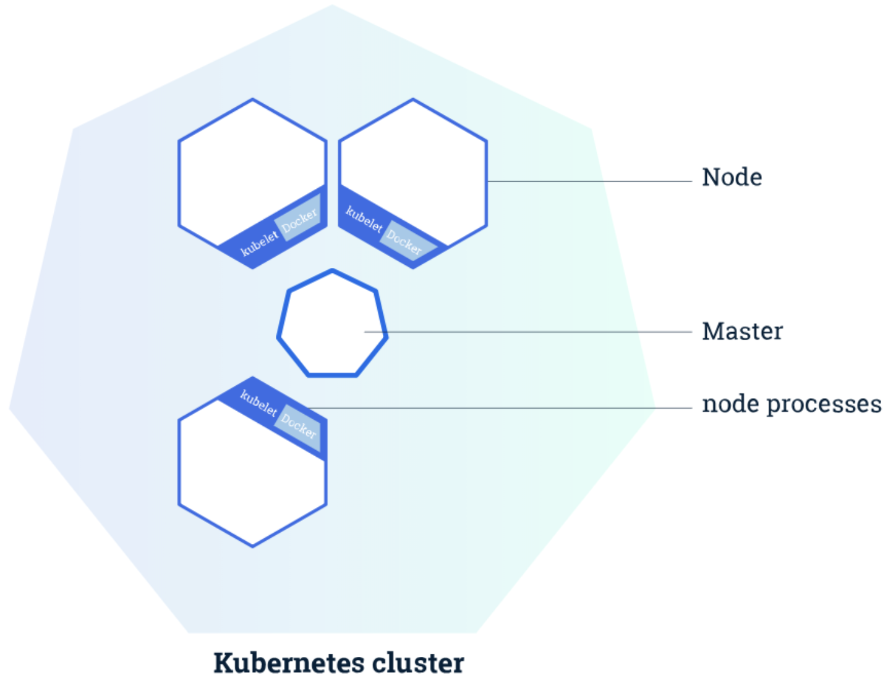
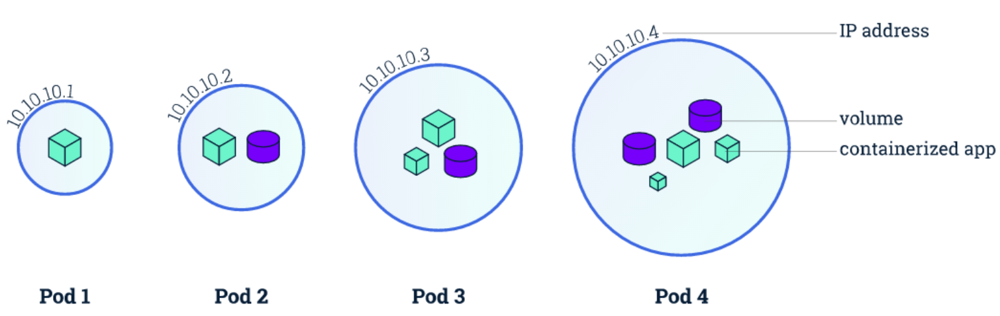
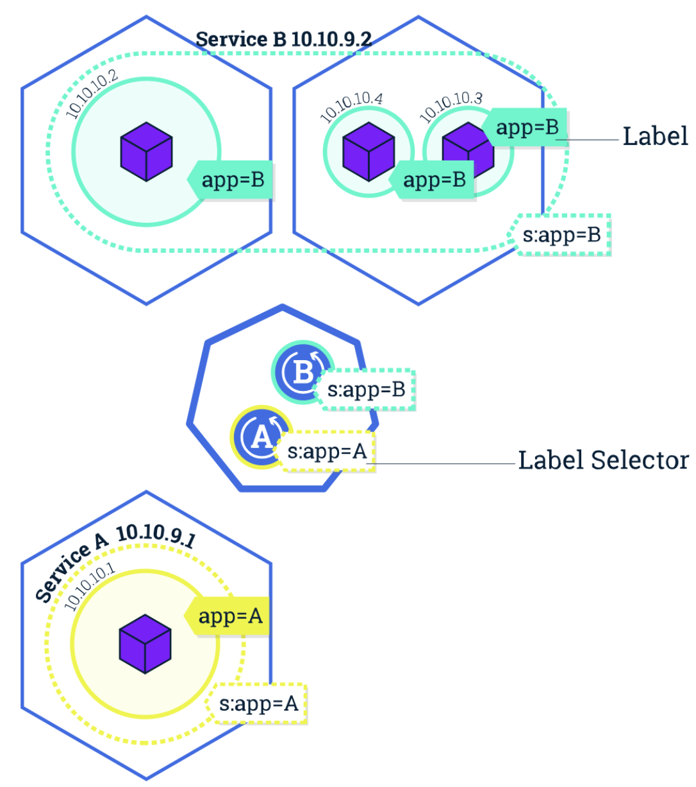
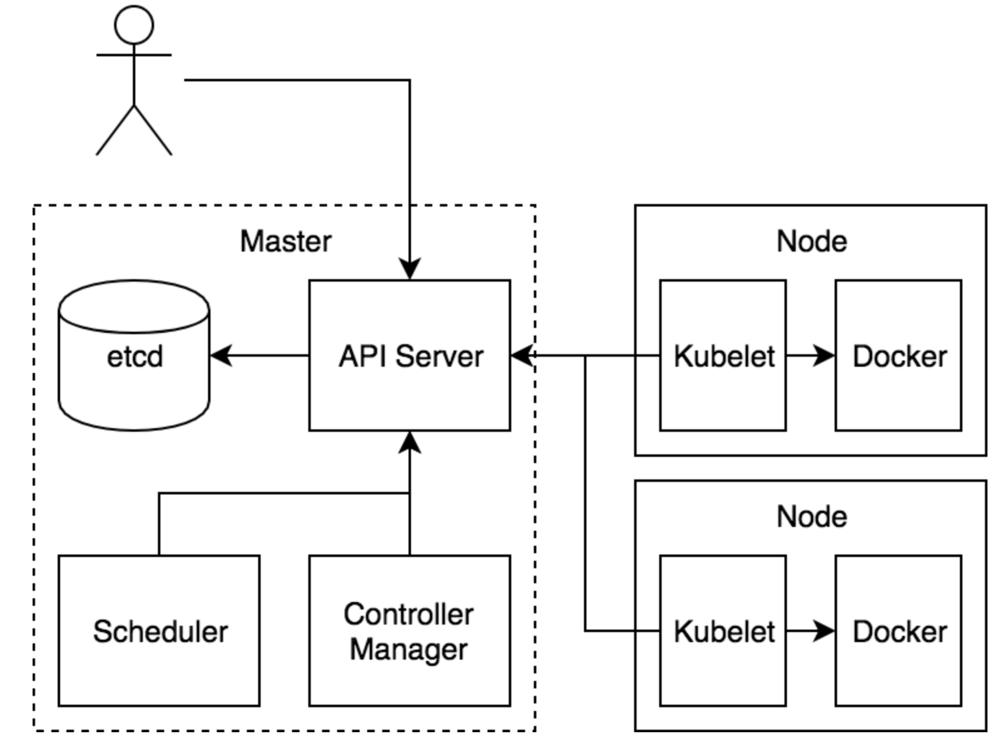

# k8s基础

Kubernetes 是 Google 团队发起的一个开源项目，它的目标是管理跨多个主机的容器，用于自动部署、扩展和管理容器化的应用程序，主要实现语言为 Go 语言。

## 简介-集群

集群是一组节点，这些节点可以是物理服务器或者虚拟机，在他上面安装了Kubernetes环境。



**Master 负责管理集群**, master 协调集群中的所有活动，例如调度应用程序、维护应用程序的所需状态、扩展应用程序和滚动更新。 **节点是 Kubernetes 集群中的工作机器，可以是物理机或虚拟机。**每个工作节点都有一个 kubelet，它是管理节点并与 Kubernetes Master 节点进行通信的代理。节点上还应具有处理容器操作的容器运行时，例如 [Docker](https://www.docker.com/) 或 [rkt](https://coreos.com/rkt/)。一个 Kubernetes 工作集群至少有三个节点。 Master 管理集群，而 节点 用于托管正在运行的应用程序。

当在 Kubernetes 上部署应用程序时，可以告诉 master 启动应用程序容器。Master 调度容器在集群的节点上运行。 节点使用 Master 公开的 Kubernetes API 与 Master 通信。用户也可以直接使用 Kubernetes 的 API 与集群交互。

### Pod

Pod 是一组紧密关联的容器集合，它们共享 PID、IPC、Network 和 UTS namespace，是Kubernetes 调度的基本单位。Pod 的设计理念是支持多个容器在一个 Pod 中共享网络和文件系统，可以通过进程间通信和文件共享这种简单高效的方式组合完成服务。



在 Kubernetes 中，所有对象都使用 manifest（yaml或json）来定义，比如一个简单的 nginx 服务可以定义为 nginx.yaml，它包含一个镜像为 nginx 的容器：

```yaml
apiVersion: v1
kind: Pod
metadata:  
  name: nginx  
  labels:    
    app: nginx
spec:  
  containers:  
    - name: nginx    
      image: nginx    
      ports:    
      	- containerPort: 80
```

### Label

Label 是识别 Kubernetes 对象的标签，以 key/value 的方式附加到对象上（key最长不能超过63字节，value 可以为空，也可以是不超过253字节的字符串）。 Label 不提供唯一性，并且实际上经常是很多对象（如Pods）都使用相同的 label 来标志具体的应用。 Label 定义好后其他对象可以使用 Label Selector 来选择一组相同 label 的对象（比如Service 用 label 来选择一组 Pod）。Label Selector支持以下几种方式：

- 等式，如app=nginx和env!=production
- 集合，如env in (production, qa)
- 多个label（它们之间是AND关系），如app=nginx,env=test

### Namespace

Namespace 是对一组资源和对象的抽象集合，比如可以用来将系统内部的对象划分为不同的项目组或用户组。常见的 pods, services,deployments 等都是属于某一个 namespace 的（默认是default），而 Node, PersistentVolumes 等则不属于任何 namespace。

### Deployment

是否需要手动创建 Pod，如果想要创建同一个容器的多份拷贝，需要一个个分别创建出来么，能否将Pods划到逻辑组里？

Deployment 确保任意时间都有指定数量的 Pod“副本”在运行。如果为某个 Pod 创建了Deployment 并且指定3个副本，它会创建3个 Pod，并且持续监控它们。如果某个 Pod 不响应，那么 Deployment 会替换它，保持总数为3.

如果之前不响应的 Pod 恢复了，现在就有4个 Pod 了，那么 Deployment 会将其中一个终止保持总数为3。如果在运行中将副本总数改为5，Deployment 会立刻启动2个新 Pod，保证总数为5。Deployment 还支持回滚和滚动升级。

当创建 Deployment 时，需要指定两个东西：

- Pod模板：用来创建 Pod 副本的模板
- Label标签：Deployment 需要监控的 Pod 的标签。

现在已经创建了 Pod 的一些副本，那么在这些副本上如何均衡负载呢？答 Service。

### Service

Service 是应用服务的抽象，通过 labels 为应用提供负载均衡和服务发现。匹配 labels 的Pod IP 和端口列表组成 endpoints，由 kube-proxy 负责将服务 IP 负载均衡到这些endpoints 上。

每个 Service 都会自动分配一个 cluster IP（仅在集群内部可访问的虚拟地址）和 DNS 名，其他容器可以通过该地址或 DNS 来访问服务，而不需要了解后端容器的运行。



## 基本概念

Kubernetes 中的绝大部分概念都抽象成 Kubernetes 管理的一种资源对象：

- Master：Master 节点是 **Kubernetes 集群的控制节点**，负责整个集群的管理和控制。Master 节点上包含以下组件：
  - kube-apiserver：集群控制的入口，提供 HTTP REST 服务
  - kube-controller-manager：Kubernetes 集群中所有资源对象的自动化控制中心
  - kube-scheduler：负责 Pod 的调度
- Node：Node 节点是 Kubernetes 集群中的工作节点，Node 上的工作负载由 Master 节点分配，工作负载主要是运行容器应用。Node 节点上包含以下组件：
  - kubelet：负责 Pod 的创建、启动、监控、重启、销毁等工作，同时与 Master 节点协作，实现集群管理的基本功能。
  - kube-proxy：实现 Kubernetes Service 的通信和负载均衡
  - 运行容器化(Pod)应用
- Pod: Pod 是 Kubernetes 最基本的部署调度单元。每个 Pod 可以由一个或多个业务容器和一个根容器(Pause 容器)组成。一个 Pod 表示某个应用的一个实例
- ReplicaSet：是 Pod 副本的抽象，用于解决 Pod 的扩容和伸缩
- Deployment：Deployment 表示部署，在内部使用ReplicaSet 来实现。可以通过 Deployment 来生成相应的 ReplicaSet 完成 Pod 副本的创建
- Service：Service 是 Kubernetes 最重要的资源对象。Kubernetes 中的 Service 对象可以对应微服务架构中的微服务。Service 定义了服务的访问入口，服务的调用者通过这个地址访问 Service 后端的 Pod 副本实例。Service 通过 Label Selector 同后端的 Pod 副本建立关系，Deployment 保证后端Pod 副本的数量，也就是保证服务的伸缩性。



## 核心组件

Kubernetes 主要由以下几个核心组件组成:

- etcd 是Kubernetes提供默认的存储系统，保存了整个集群的状态，就是一个 key-value 数据库；
- apiserver 提供了资源操作的唯一入口，并提供认证、授权、访问控制、API 注册和发现等机制；
- controller manager 负责维护集群的状态，比如故障检测、自动扩展、滚动更新等，运行管理控制器，它们是集群中处理常规任务的后台线程，逻辑上，每个控制器都是一个单独的进程。但为了降低复杂性，所有的控制器被编译到一个二进制文件里，并作为一个进程运行。；
- scheduler 负责资源的调度，按照预定的调度策略将 Pod 调度到相应的机器上，监视新创建没有分配到Node的Pod，为Pod选择一个Node；
- kubelet 是主要的节点代理，它会监视已分配给节点的pod，负责维护容器的生命周期，同时也负责 Volume（CSI）和网络（CNI）的管理；
- Container runtime 负责镜像管理以及 Pod 和容器的真正运行（CRI）；
- kube-proxy 负责为 Service 提供 cluster 内部的服务发现和负载均衡；

当然了除了上面的这些核心组件，还有一些推荐的插件：

- kube-dns 负责为整个集群提供 DNS 服务
- Ingress Controller 为服务提供外网入口
- Heapster 提供资源监控
- Dashboard 提供 GUI


## 组件通信

Kubernetes 多组件之间的通信原理：

- apiserver 负责 etcd 存储的所有操作，且**只有 apiserver 才直接操作 etcd 集群**
- apiserver 对内（集群中的其他组件）和对外（用户）提供统一的 REST API，其他组件均通过 apiserver 进行通信
  - controller manager、scheduler、kube-proxy 和 kubelet 等均通过 apiserver watch API 监测资源变化情况，并对资源作相应的操作
  - 所有需要更新资源状态的操作均通过 apiserver 的 REST API 进行
- apiserver 也会直接调用 kubelet API（如 logs, exec, attach 等），默认不校验 kubelet 证书，但可以通过 `--kubelet-certificate-authority` 开启（而 GKE 通过 SSH 隧道保护它们之间的通信）


- 用户通过 REST API 创建一个 Pod
- apiserver 将其写入 etcd
- scheduluer 检测到未绑定 Node 的 Pod，开始调度并更新 Pod 的 Node 绑定
- kubelet 检测到有新的 Pod 调度过来，通过 container runtime 运行该 Pod
- kubelet 通过 container runtime 取到 Pod 状态，并更新到 apiserver 中