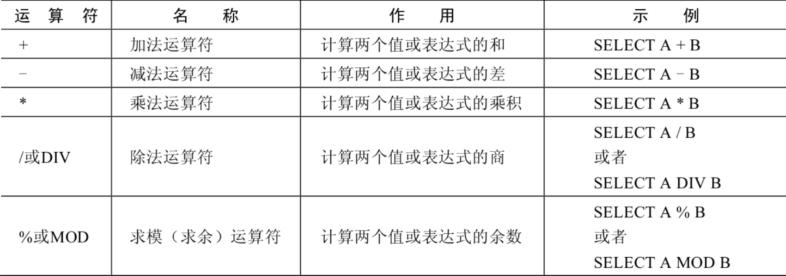
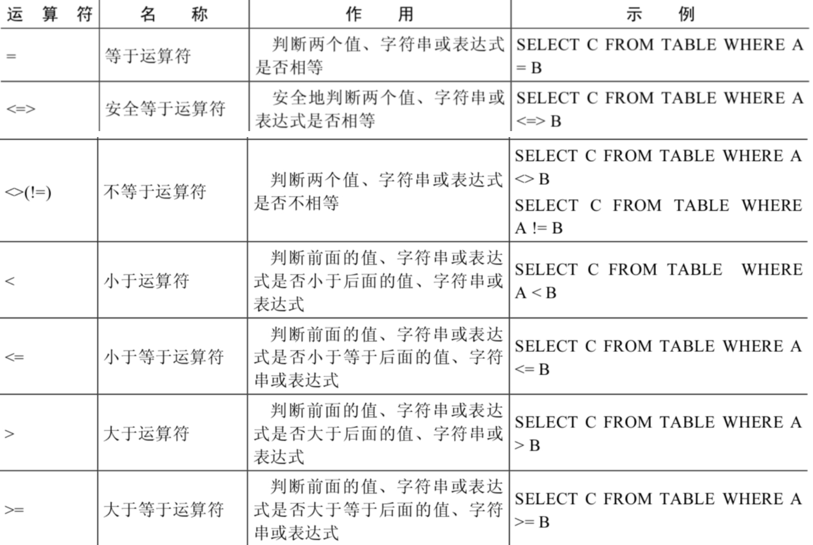
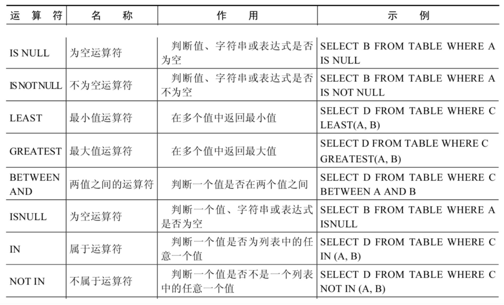
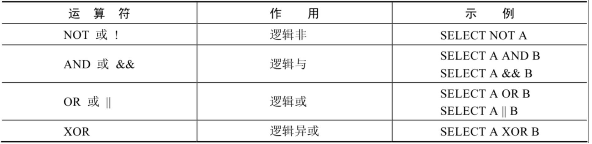
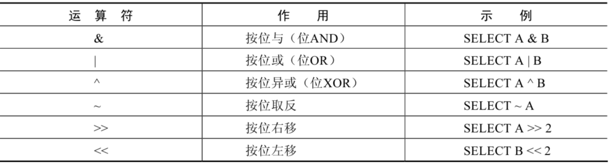
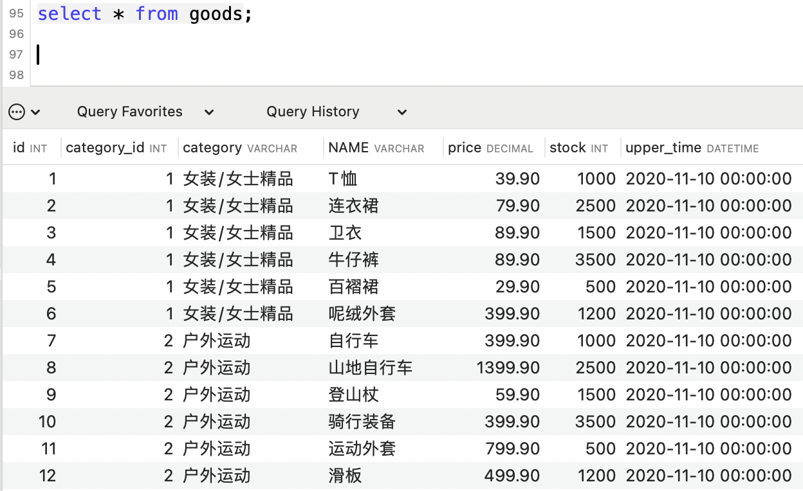
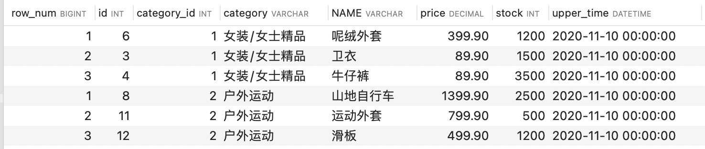
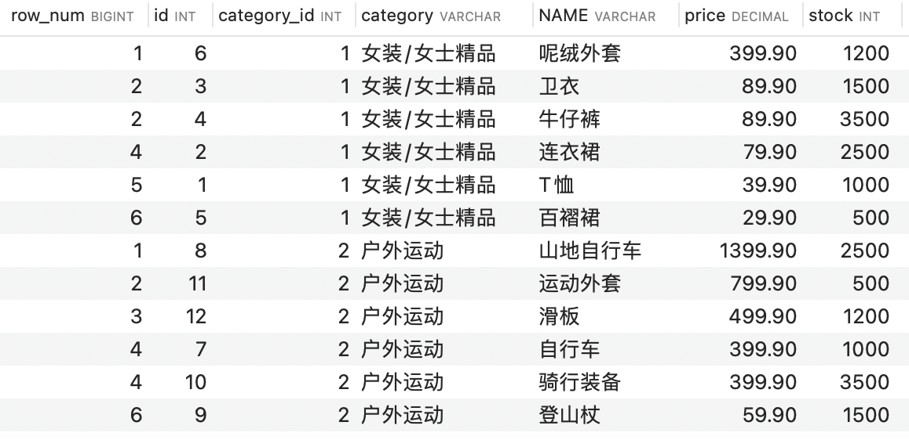
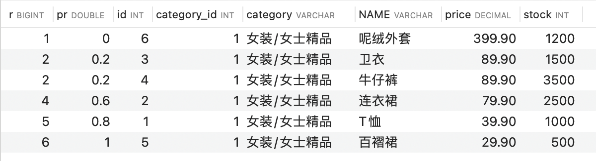
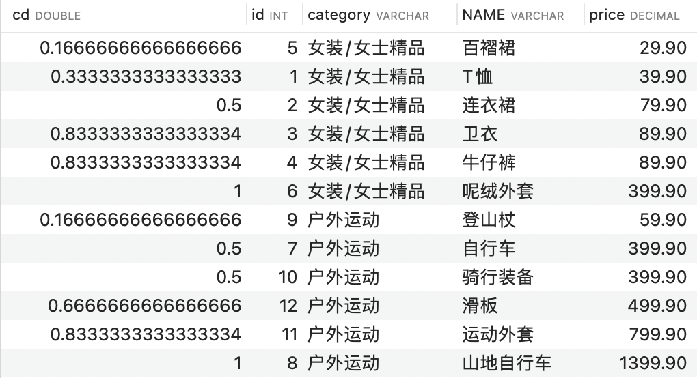

# 基础

## 前置

查看版本

```mysql
mysql> select version();
+-----------+
| version() |
+-----------+
| 8.0.36    |
+-----------+
1 row in set (0.00 sec)
```


查看所有的数据库

```
show databases;
```

> “information_schema”是 MySQL 系统自带的数据库，主要保存 MySQL 数据库服务器的系统信息，比如数据库的名称、数据表的名称、字段名称、存取权限、数据文件 所在的文件夹和系统使用的文件夹，等等
>
> “performance_schema”是 MySQL 系统自带的数据库，可以用来监控 MySQL 的各类性能指标。
>
> “sys”数据库是 MySQL 系统自带的数据库，主要作用是以一种更容易被理解的方式展示 MySQL 数据库服务器的各类性能指标，帮助系统管理员和开发人员监控 MySQL 的技术性能。
>
> “mysql”数据库保存了 MySQL 数据库服务器运行时需要的系统信息，比如数据文件夹、当前使用的字符集、约束检查信息，等等


查看数据库创建信息

```mysql
mysql> show create database MyBatis;
| Database | Create Database |
| MyBatis  | CREATE DATABASE `MyBatis` /*!40100 DEFAULT CHARACTER SET utf8mb4 COLLATE utf8mb4_general_ci */ /*!80016 DEFAULT ENCRYPTION='N' */ |
```


查看表的创建信息

```mysql
mysql> show create table users;
| Table | Create Table                                                                                   
| users | CREATE TABLE `users` (
  `id` int unsigned NOT NULL AUTO_INCREMENT,
  `username` varchar(20) CHARACTER SET utf8mb4 COLLATE utf8mb4_general_ci NOT NULL DEFAULT '',
  `password` varchar(20) COLLATE utf8mb4_general_ci NOT NULL DEFAULT '',
  `age` int NOT NULL,
  `sex` char(1) COLLATE utf8mb4_general_ci NOT NULL DEFAULT '',
  `email` varchar(20) CHARACTER SET utf8mb4 COLLATE utf8mb4_general_ci NOT NULL DEFAULT '',
  PRIMARY KEY (`id`)
) ENGINE=InnoDB AUTO_INCREMENT=3 DEFAULT CHARSET=utf8mb4 COLLATE=utf8mb4_general_ci |
1 row in set (0.00 sec)
```

加上`\G`结尾，则会将行列形式变成key-value形式

```mysql
mysql> show create table users\G;
*************************** 1. row ***************************
       Table: users
Create Table: CREATE TABLE `users` (
  `id` int unsigned NOT NULL AUTO_INCREMENT,
  `username` varchar(20) CHARACTER SET utf8mb4 COLLATE utf8mb4_general_ci NOT NULL DEFAULT '',
  `password` varchar(20) COLLATE utf8mb4_general_ci NOT NULL DEFAULT '',
  `age` int NOT NULL,
  `sex` char(1) COLLATE utf8mb4_general_ci NOT NULL DEFAULT '',
  `email` varchar(20) CHARACTER SET utf8mb4 COLLATE utf8mb4_general_ci NOT NULL DEFAULT '',
  PRIMARY KEY (`id`)
) ENGINE=InnoDB AUTO_INCREMENT=3 DEFAULT CHARSET=utf8mb4 COLLATE=utf8mb4_general_ci
1 row in set (0.00 sec)
```


显示表结构

使用DESCRIBE 或 DESC 命令，表示表结构。

```mysql
mysql> desc users;
+----------+--------------+------+-----+---------+----------------+
| Field    | Type         | Null | Key | Default | Extra          |
+----------+--------------+------+-----+---------+----------------+
| id       | int unsigned | NO   | PRI | NULL    | auto_increment |
| username | varchar(20)  | NO   |     |         |                |
| password | varchar(20)  | NO   |     |         |                |
| age      | int          | NO   |     | NULL    |                |
| sex      | char(1)      | NO   |     |         |                |
| email    | varchar(20)  | NO   |     |         |                |
+----------+--------------+------+-----+---------+----------------+
6 rows in set (0.01 sec)
```


字符集问题，如果字符集不对，会导致中文乱码

在MySQL 8.0版本之前，默认字符集为latin1。从MySQL 8.0开始，数据库的默认编码改为`utf8mb4`。

```sql
show variables like 'character_%';
show variables like 'collation_%';
```

查看当前版本的数据库字符集

```mysql
mysql> show variables like 'character_%';
+--------------------------+-------------------------------------------------------+
| Variable_name            | Value                                                 |
+--------------------------+-------------------------------------------------------+
| character_set_client     | utf8mb3                                               |
| character_set_connection | utf8mb3                                               |
| character_set_database   | utf8mb4                                               |
| character_set_filesystem | binary                                                |
| character_set_results    | utf8mb3                                               |
| character_set_server     | utf8mb3                                               |
| character_set_system     | utf8mb3                                               |
| character_sets_dir       | /usr/local/mysql-8.0.36-macos14-arm64/share/charsets/ |
+--------------------------+-------------------------------------------------------+
8 rows in set (0.00 sec)

mysql> show variables like 'collation_%';
+----------------------+--------------------+
| Variable_name        | Value              |
+----------------------+--------------------+
| collation_connection | utf8mb3_general_ci |
| collation_database   | utf8mb4_general_ci |
| collation_server     | utf8mb3_general_ci |
+----------------------+--------------------+
3 rows in set (0.00 sec)
```

可以看到`character_set_database`和`collation_database`都是`utf8mb4`了。


## SQL语言基础

**SQL 分类**

SQL语言在功能上主要分为如下3大类：

- **DDL（Data Definition Languages、数据定义语言）**，这些语句定义了不同的数据库、表、视图、索引等数据库对象，还可以用来创建、删除、修改数据库和数据表的结构。
  - 主要的语句关键字包括`CREATE`、`DROP`、`ALTER`等。
- **DML（Data Manipulation Language、数据操作语言）**，用于添加、删除、更新和查询数据库记录，并检查数据完整性。
  - 主要的语句关键字包括`INSERT`、`DELETE`、`UPDATE`、`SELECT`等。
- **DCL（Data Control Language、数据控制语言）**，用于定义数据库、表、字段、用户的访问权限和安全级别。
  - 主要的语句关键字包括`GRANT`、`REVOKE`、`COMMIT`、`ROLLBACK`、`SAVEPOINT`等。

> 因为查询语句使用的非常的频繁，所以很多人把查询语句单拎出来一类：DQL（数据查询语言）。
>
> 还有单独将`COMMIT`、`ROLLBACK` 取出来称为TCL （Transaction Control Language，事务控制语言）。


**SQL大小写规范** 

- MySQL 在 Windows 环境下是大小写不敏感的
- MySQL 在 Linux 环境下是大小写敏感的
  - 数据库名、表名、表的别名、变量名是严格区分大小写的
  - 关键字、函数名、列名(或字段名)、列的别名(字段的别名，如果需要请使用**双引号**扩起来) 是忽略大小写的。
- 推荐采用统一的书写规范：
  - 数据库名、表名、表别名、字段名、字段别名等都小写
  - SQL 关键字、函数名、绑定变量等都大写


**命名规则**

- 数据库、表名不得超过30个字符，变量名限制为29个
- 必须只能包含 A–Z, a–z, 0–9, _共63个字符
- 数据库名、表名、字段名等对象名中间不要包含空格
- 同一个MySQL软件中，数据库不能同名；同一个库中，表不能重名；同一个表中，字段不能重名
- 必须保证你的字段没有和保留字、数据库系统或常用方法冲突。如果坚持使用，请在SQL语句中使用`（着重号）引起来
- 保持字段名和类型的一致性，在命名字段并为其指定数据类型的时候一定要保证一致性。假如数据类型在一个表里是整数，那在另一个表里可就别变成字符型了


## 简单查询

**查询常数**

SELECT 查询还可以对常数进行查询。对的，就是在 SELECT 查询结果中增加一列固定的常数列。这列的取值是我指定的，而不是从数据表中动态取出的。

why do this？

SQL 中的 SELECT 语法的确提供了这个功能，一般来说只从一个表中查询数据，通常不需要增加一个固定的常数列，但如果想整合不同的数据源，用常数列作为这个表的标记，就需要查询常数。

比如说，想对 employees 数据表中的员工姓名进行查询，同时增加一列字段`corporation`，这个字段固定值为“浙大”，可以这样写：

```mysql
SELECT '浙大' as corporation, last_name FROM employees;
```


## 运算

### 算术运算符



加减：

- 一个整数类型的值对整数进行加法和减法操作，结果还是一个整数；
- 一个整数类型的值对浮点数进行加法和减法操作，结果是一个浮点数；
- 加法和减法的优先级相同，进行先加后减操作与进行先减后加操作的结果是一样的；
- 在Java中，+的左右两边如果有字符串，那么表示字符串的拼接。但是在MySQL中+只表示数值相加。如果遇到非数值类型，先尝试转成数值，如果转失败，就按0计算。（补充：MySQL中字符串拼接要使用字符串函数CONCAT()实现）

乘除：

- 一个数乘以整数1和除以整数1后仍得原数；
- 一个数乘以浮点数1和除以浮点数1后变成浮点数，数值与原数相等；
- 一个数除以整数后，不管是否能除尽，结果都为一个浮点数；
- 一个数除以另一个数，除不尽时，结果为一个浮点数，并保留到小数点后4位；
- 乘法和除法的优先级相同，进行先乘后除操作与先除后乘操作，得出的结果相同。
- 在数学运算中，0不能用作除数，在MySQL中，一个数除以0为NULL。


### 比较运算符



等号运算：

- 如果等号两边的值、字符串或表达式都为字符串，则MySQL会按照字符串进行比较，其比较的是每个字符串中字符的ANSI编码是否相等。
- 如果等号两边的值都是整数，则MySQL会按照整数来比较两个值的大小。
- 如果等号两边的值一个是整数，另一个是字符串，则MySQL会将字符串转化为数字进行比较。
- 如果等号两边的值、**字符串或表达式中有一个为NULL，则比较结果为NULL**。

安全等号；

安全等于运算符（<=>）与等于运算符（=）的作用是相似的，`唯一的区别`是‘<=>’可以用来对NULL进行判断。**在两个操作数均为NULL时，其返回值为1，而不为NULL；当一个操作数为NULL时，其返回值为0，而不为NULL。**


### 非符号运算符




**LIKE运算符**：

LIKE运算符主要用来匹配字符串，通常用于模糊匹配，如果满足条件则返回1，否则返回0。如果给定的值或者匹配条件为NULL，则返回结果为NULL。

LIKE运算符通常使用如下通配符：

```
“%”：匹配0个或多个字符。
“_”：只能匹配一个字符。
```

**ESCAPE：**

- 回避特殊符号的：**使用转义符**。

```mysql
SELECT job_id
FROM   jobs
WHERE  job_id LIKE 'IT\_%';
```

- 如果使用\表示转义，要省略ESCAPE。如果不是\，则要加上ESCAPE。

```mysql
SELECT job_id
FROM   jobs
WHERE  job_id LIKE 'IT$_%' escape ‘$‘;
```

**REGEXP运算符：**

REGEXP运算符用来匹配字符串，语法格式为：`expr REGEXP 匹配条件`。如果expr满足匹配条件，返回1；如果不满足，则返回0。若expr或匹配条件任意一个为NULL，则结果为NULL。

REGEXP运算符在进行匹配时，常用的有下面几种通配符：

```
（1）‘^’匹配以该字符后面的字符开头的字符串。
（2）‘$’匹配以该字符前面的字符结尾的字符串。
（3）‘.’匹配任何一个单字符。
（4）“[...]”匹配在方括号内的任何字符。例如，“[abc]”匹配“a”或“b”或“c”。为了命名字符的范围，使用一个‘-’。“[a-z]”匹配任何字母，而“[0-9]”匹配任何数字。
（5）‘*’匹配零个或多个在它前面的字符。例如，“x*”匹配任何数量的‘x’字符，“[0-9]*”匹配任何数量的数字，而“*”匹配任何数量的任何字符。
```


### 逻辑运算符



OR可以和AND一起使用，但是在使用时要注意两者的优先级，由于AND的优先级高于OR，因此先对AND两边的操作数进行操作，再与OR中的操作数结合。嗯...不如括号


### 位运算符



**按位右移运算符** 按位右移（>>）运算符将给定的值的二进制数的所有位右移指定的位数。右移指定的位数后，右边低位的数值被移出并丢弃，左边高位空出的位置用0补齐。

**按位左移运算符** 按位左移（<<）运算符将给定的值的二进制数的所有位左移指定的位数。左移指定的位数后，左边高位的数值被移出并丢弃，右边低位空出的位置用0补齐。


### 正则

MySQL 同样也支持其他正则表达式的匹配， MySQL 中使用 **REGEXP** 和 **RLIKE**操作符来进行正则表达式匹配。

| 模式       | 描述                                                         |
| :--------- | :----------------------------------------------------------- |
| ^          | 匹配输入字符串的开始位置。如果设置了 RegExp 对象的 Multiline 属性，^ 也匹配 '\n' 或 '\r' 之后的位置。 |
| $          | 匹配输入字符串的结束位置。如果设置了RegExp 对象的 Multiline 属性，$ 也匹配 '\n' 或 '\r' 之前的位置。 |
| .          | 匹配除 "\n" 之外的任何单个字符。要匹配包括 '\n' 在内的任何字符，请使用像 '[.\n]' 的模式。 |
| [...]      | 字符集合。匹配所包含的任意一个字符。例如， '[abc]' 可以匹配 "plain" 中的 'a'。 |
| [^...]     | 负值字符集合。匹配未包含的任意字符。例如， '[^abc]' 可以匹配 "plain" 中的'p'。 |
| p1\|p2\|p3 | 匹配 p1 或 p2 或 p3。例如，'z\|food' 能匹配 "z" 或 "food"。'(z\|f)ood' 则匹配 "zood" 或 "food"。 |
| *          | 匹配前面的子表达式零次或多次。例如，zo* 能匹配 "z" 以及 "zoo"。* 等价于{0,}。 |
| +          | 匹配前面的子表达式一次或多次。例如，'zo+' 能匹配 "zo" 以及 "zoo"，但不能匹配 "z"。+ 等价于 {1,}。 |
| {n}        | n 是一个非负整数。匹配确定的 n 次。例如，'o{2}' 不能匹配 "Bob" 中的 'o'，但是能匹配 "food" 中的两个 o。 |
| {n,m}      | m 和 n 均为非负整数，其中n <= m。最少匹配 n 次且最多匹配 m 次。 |

```mysql
SELECT column1, column2, ...
FROM table_name
WHERE column_name REGEXP 'pattern';
```


## 多表查询

多表查询，也称为关联查询，指两个或更多个表一起完成查询操作。

> 需要注意的是，如果使用了表的别名，在查询字段中、过滤条件中就只能使用别名进行代替，不能使用原有的表名，否则就会报错。

> `阿里开发规范`：
>
> 【`强制`】对于数据库中表记录的查询和变更，只要涉及多个表，都需要在列名前加表的别名（或 表名）进行限定。
>
> `说明`：对多表进行查询记录、更新记录、删除记录时，如果对操作列没有限定表的别名（或表名），并且操作列在多个表中存在时，就会抛异常。
>
> `正例`：select t1.name from table_first as t1 , table_second as t2 where t1.id=t2.id;
>
> `反例`：在某业务中，由于多表关联查询语句没有加表的别名（或表名）的限制，正常运行两年后，最近在 某个表中增加一个同名字段，在预发布环境做数据库变更后，线上查询语句出现出 1052 异常：Column 'name' in field list is ambiguous。

### 笛卡尔积错误

假设有两个集合 X 和 Y，那么 X 和 Y 的笛卡尔积就是 X 和 Y 的所有可能组合，也就是第一个对象来自于 X，第二个对象来自于 Y 的所有可能。组合的个数即为两个集合中元素个数的乘积数。

SQL92中，笛卡尔积也称为`交叉连接`，英文是 `CROSS JOIN`。在 SQL99 中也是使用 CROSS JOIN表示交叉连接。它的作用就是可以把任意表进行连接，即使这两张表不相关。在MySQL中如下情况会出现笛卡尔积：

```mysql
#查询员工姓名和所在部门名称
SELECT last_name,department_name FROM employees,departments;
SELECT last_name,department_name FROM employees CROSS JOIN departments;
SELECT last_name,department_name FROM employees INNER JOIN departments;
SELECT last_name,department_name FROM employees JOIN departments;
```

笛卡尔积的错误会在下面条件下产生:

- 省略多个表的连接条件（或关联条件）
- 连接条件（或关联条件）无效
- 所有表中的所有行互相连接


### 分类

分类1：等值连接 vs 非等值连接

> 指的是在多表查询时，连接条件的类型。

分类2：自连接 vs 非自连接

> 指的是多表查询时，连接的表是不同的表还是同一个表。

分类3：内连接 vs 外连接

> 内连接: 合并具有同一列的两个以上的表的行, **结果集中不包含一个表与另一个表不匹配的行**
>
> 外连接: 两个表在连接过程中除了返回满足连接条件的行以外**还返回左（或右）表中不满足条件的行** **，这种连接称为左（或右） 外连接**。没有匹配的行时, 结果表中相应的列为空(NULL)。
>
> 如果是左外连接，则连接条件中左边的表也称为`主表`，右边的表称为`从表`。
>
> 如果是右外连接，则连接条件中右边的表也称为`主表`，左边的表称为`从表`。


### SQL99语法实现

使用JOIN...ON子句创建连接的语法结构：

```sql
SELECT table1.column, table2.column,table3.column
FROM table1
    JOIN table2 ON table1 和 table2 的连接条件
        JOIN table3 ON table2 和 table3 的连接条件
```

**内连接**

关键字 JOIN、INNER JOIN、CROSS JOIN 的含义是一样的，都表示内连接

```sql
SELECT 字段列表
FROM A表 INNER JOIN B表
ON 关联条件
WHERE 等其他子句;
```

**左外链接**

```sql
SELECT 字段列表
FROM A表 LEFT [OUTER] JOIN B表
ON 关联条件
WHERE 等其他子句;
```

**右外链接**

```sql
SELECT 字段列表
FROM A表 RIGHT [OUTER] JOIN B表
ON 关联条件
WHERE 等其他子句;
```

**满外连接**

- 满外连接的结果 = 左右表匹配的数据 + 左表没有匹配到的数据 + 右表没有匹配到的数据。
- SQL99是支持满外连接的。使用FULL JOIN 或 FULL OUTER JOIN来实现。
- 需要注意的是，MySQL不支持FULL JOIN，但是可以用 LEFT JOIN **UNION** RIGHT JOIN代替。

**UNION**

**合并查询结果** 利用UNION关键字，可以给出多条SELECT语句，并将它们的结果组合成单个结果集。合并时，两个表对应的列数和数据类型必须相同，并且相互对应。各个SELECT语句之间使用UNION或UNION ALL关键字分隔。

语法格式：

```sql
SELECT column,... FROM table1
UNION [ALL]
SELECT column,... FROM table2
```

UNION 操作符返回两个查询的结果集的并集，去除重复记录。

UNION ALL操作符返回两个查询的结果集的并集。对于两个结果集的重复部分，不去重。

> 注意：执行UNION ALL语句时所需要的资源比UNION语句少。如果明确知道合并数据后的结果数据不存在重复数据，或者不需要去除重复的数据，则尽量使用UNION ALL语句，以提高数据查询的效率。

**总结**


在mysql中，满外链接就可以借助上图中的上面部分的查询使用UNION组合得到。


**自然连接**

 `NATURAL JOIN` 用来表示自然连接。可以把自然连接理解为 SQL92 中的等值连接。它会帮你自动查询两张连接表中`所有相同的字段`，然后进行`等值连接`。

在SQL92标准中：

```sql
SELECT employee_id,last_name,department_name
FROM employees e JOIN departments d
ON e.`department_id` = d.`department_id`
AND e.`manager_id` = d.`manager_id`;
```

在 SQL99 中可以写成：

```sql
SELECT employee_id,last_name,department_name
FROM employees e NATURAL JOIN departments d;
```


**注意：**

要`控制连接表的数量`。多表连接就相当于嵌套 for 循环一样，非常消耗资源，会让 SQL 查询性能下降得很严重，因此不要连接不必要的表。在许多 DBMS 中，也都会有最大连接表的限制。

> 【强制】**超过三个表禁止 join**。需要 join 的字段，数据类型保持绝对一致；多表关联查询时， 保证被关联的字段需要有索引。
>
> 说明：即使双表 join 也要注意表索引、SQL 性能。
>
> 来源：阿里巴巴《Java开发手册》


### sql标准

SQL 存在不同版本的标准规范，因为不同规范下的表连接操作是有区别的。

SQL 有两个主要的标准，分别是 `SQL92` 和 `SQL99`。92 和 99 代表了标准提出的时间，SQL92 就是 92 年提出的标准规范。当然除了 SQL92 和 SQL99 以外，还存在 SQL-86、SQL-89、SQL:2003、SQL:2008、SQL:2011 和 SQL:2016 等其他的标准。

**最重要的 SQL 标准就是 SQL92 和 SQL99**。一般来说 SQL92 的形式更简单，但是写的 SQL 语句会比较长，可读性较差。而 SQL99 相比于 SQL92 来说，语法更加复杂，但可读性更强。用得多的就是99版本。

**SQL92 和 SQL99 是经典的 SQL 标准，也分别叫做 SQL-2 和 SQL-3 标准。**也正是在这两个标准发布之后，SQL 影响力越来越大，甚至超越了数据库领域。现如今 SQL 已经不仅仅是数据库领域的主流语言，还是信息领域中信息处理的主流语言。在图形检索、图像检索以及语音检索中都能看到 SQL 语言的使用。


## 内置函数

MySQL提供的内置函数从`实现的功能角度`可以分为数值函数、字符串函数、日期和时间函数、流程控制函数、加密与解密函数、获取MySQL信息函数、聚合函数等。可以划分为两大类：`单行函数`、`聚合函数（或分组函数）`。

### 单行函数

- 操作数据对象
- 接受参数返回一个结果
- **只对一行进行变换**
- **每行返回一个结果**
- 可以嵌套
- 参数可以是一列或一个值

直接上[菜鸟教程](https://www.runoob.com/mysql/mysql-functions.html)吧

主要常用的还是字符串和日期相关的。下面列举一些常用的吧

**数值函数**

| 函数                | 用法                                                         |
| ------------------- | ------------------------------------------------------------ |
| ABS(x)              | 返回x的绝对值                                                |
| CEIL(x)，CEILING(x) | 返回大于或等于某个值的最小整数                               |
| FLOOR(x)            | 返回小于或等于某个值的最大整数                               |
| ROUND(x)            | 返回一个对x的值进行四舍五入后，最接近于X的整数               |
| ROUND(x,y)          | 返回一个对x的值进行四舍五入后最接近X的值，并保留到小数点后面Y位 |
| TRUNCATE(x,y)       | 返回数字x截断为y位小数的结果                                 |

**指数与对数**

```
mysql> SELECT POW(2,5),POWER(2,4),EXP(2),LN(10),LOG10(10),LOG2(4)
    -> FROM DUAL;
+----------+------------+------------------+-------------------+-----------+---------+
| POW(2,5) | POWER(2,4) | EXP(2)           | LN(10)            | LOG10(10) | LOG2(4) |
+----------+------------+------------------+-------------------+-----------+---------+
|       32 |         16 | 7.38905609893065 | 2.302585092994046 |         1 |       2 |
+----------+------------+------------------+-------------------+-----------+---------+
1 row in set (0.00 sec)
```

**进制间的转换**

| 函数          | 用法                     |
| ------------- | ------------------------ |
| BIN(x)        | 返回x的二进制编码        |
| HEX(x)        | 返回x的十六进制编码      |
| OCT(x)        | 返回x的八进制编码        |
| CONV(x,f1,f2) | 返回f1进制数变成f2进制数 |

**字符串函数**

| 函数                              | 用法                                                         |
| --------------------------------- | ------------------------------------------------------------ |
| ASCII(S)                          | 返回字符串S中的第一个字符的ASCII码值                         |
| CHAR_LENGTH(s)                    | 返回字符串s的字符数。作用与CHARACTER_LENGTH(s)相同           |
| LENGTH(s)                         | 返回字符串s的字节数，和字符集有关                            |
| CONCAT(s1,s2,......,sn)           | 连接s1,s2,......,sn为一个字符串                              |
| CONCAT_WS(x, s1,s2,......,sn)     | 同CONCAT(s1,s2,...)函数，但是每个字符串之间要加上x           |
| INSERT(str, idx, len, replacestr) | 将字符串str从第idx位置开始，len个字符长的子串替换为字符串replacestr |
| REPLACE(str, a, b)                | 用字符串b替换字符串str中所有出现的字符串a                    |
| UPPER(s) 或 UCASE(s)              | 将字符串s的所有字母转成大写字母                              |
| LOWER(s) 或LCASE(s)               | 将字符串s的所有字母转成小写字母                              |
| LEFT(str,n)                       | 返回字符串str最左边的n个字符                                 |
| RIGHT(str,n)                      | 返回字符串str最右边的n个字符                                 |
| LPAD(str, len, pad)               | 用字符串pad对str最左边进行填充，直到str的长度为len个字符     |
| RPAD(str ,len, pad)               | 用字符串pad对str最右边进行填充，直到str的长度为len个字符     |
| LTRIM(s)                          | 去掉字符串s左侧的空格                                        |
| RTRIM(s)                          | 去掉字符串s右侧的空格                                        |
| TRIM(s)                           | 去掉字符串s开始与结尾的空格                                  |
| TRIM(s1 FROM s)                   | 去掉字符串s开始与结尾的s1                                    |
| TRIM(LEADING s1 FROM s)           | 去掉字符串s开始处的s1                                        |
| TRIM(TRAILING s1 FROM s)          | 去掉字符串s结尾处的s1                                        |
| REPEAT(str, n)                    | 返回str重复n次的结果                                         |
| STRCMP(s1,s2)                     | 比较字符串s1,s2的ASCII码值的大小                             |
| SUBSTR(s,index,len)               | 返回从字符串s的index位置其len个字符，作用与SUBSTRING(s,n,len)、MID(s,n,len)相同 |
| LOCATE(substr,str)                | 返回字符串substr在字符串str中首次出现的位置，作用于POSITION(substr IN str)、INSTR(str,substr)相同。未找到，返回0 |
| REVERSE(s)                        | 返回s反转后的字符串                                          |
| NULLIF(value1,value2)             | 比较两个字符串，如果value1与value2相等，则返回NULL，否则返回value1 |

> 注意：MySQL中，字符串的位置是从1开始的。

**获取日期、时间**

| 函数                                                         | 用法                           |
| ------------------------------------------------------------ | ------------------------------ |
| **CURDATE()** ，CURRENT_DATE()                               | 返回当前日期，只包含年、月、日 |
| **CURTIME()** ， CURRENT_TIME()                              | 返回当前时间，只包含时、分、秒 |
| **NOW()** / SYSDATE() / CURRENT_TIMESTAMP() / LOCALTIME() / LOCALTIMESTAMP() | 返回当前系统日期和时间         |
| UTC_DATE()                                                   | 返回UTC（世界标准时间）日期    |
| UTC_TIME()                                                   | 返回UTC（世界标准时间）时间    |

**日期与时间戳的转换**

| 函数                     | 用法                                                         |
| ------------------------ | ------------------------------------------------------------ |
| UNIX_TIMESTAMP()         | 以UNIX时间戳的形式返回当前时间。SELECT UNIX_TIMESTAMP() ->1634348884 |
| UNIX_TIMESTAMP(date)     | 将时间date以UNIX时间戳的形式返回。                           |
| FROM_UNIXTIME(timestamp) | 将UNIX时间戳的时间转换为普通格式的时间                       |

**获取月份、星期、星期数、天数等函数**

| 函数                                     | 用法             |
| ---------------------------------------- | ---------------- |
| YEAR(date) / MONTH(date) / DAY(date)     | 返回具体的日期值 |
| HOUR(time) / MINUTE(time) / SECOND(time) | 返回具体的时间值 |

**时间和秒钟转换的函数**

| 函数                 | 用法                                                         |
| -------------------- | ------------------------------------------------------------ |
| TIME_TO_SEC(time)    | 将 time 转化为秒并返回结果值。转化的公式为：`小时*3600+分钟*60+秒` |
| SEC_TO_TIME(seconds) | 将 seconds 描述转化为包含小时、分钟和秒的时间                |

**计算日期和时间的函数**

| 函数                                                         | 用法                                           |
| ------------------------------------------------------------ | ---------------------------------------------- |
| DATE_ADD(datetime, INTERVAL expr type)，ADDDATE(date,INTERVAL expr type) | 返回与给定日期时间相差INTERVAL时间段的日期时间 |
| DATE_SUB(date,INTERVAL expr type)，SUBDATE(date,INTERVAL expr type) | 返回与date相差INTERVAL时间间隔的日期           |

上述函数中type的取值：


| 函数                   | 用法                                                         |
| ---------------------- | ------------------------------------------------------------ |
| ADDTIME(time1,time2)   | 返回time1加上time2的时间。当time2为一个数字时，代表的是`秒`，可以为负数 |
| SUBTIME(time1,time2)   | 返回time1减去time2后的时间。当time2为一个数字时，代表的是`秒`，可以为负数 |
| DATEDIFF(date1,date2)  | 返回date1 - date2的日期间隔天数                              |
| TIMEDIFF(time1, time2) | 返回time1 - time2的时间间隔                                  |
| FROM_DAYS(N)           | 返回从0000年1月1日起，N天以后的日期                          |
| TO_DAYS(date)          | 返回日期date距离0000年1月1日的天数                           |

举例：查询 7 天内的新增用户数有多少？

```
SELECT COUNT(*) as num FROM new_user WHERE TO_DAYS(NOW())-TO_DAYS(regist_time)<=7
```

**日期的格式化与解析**

| 函数                              | 用法                                       |
| --------------------------------- | ------------------------------------------ |
| DATE_FORMAT(date,fmt)             | 按照字符串fmt格式化日期date值              |
| TIME_FORMAT(time,fmt)             | 按照字符串fmt格式化时间time值              |
| GET_FORMAT(date_type,format_type) | 返回日期字符串的显示格式                   |
| STR_TO_DATE(str, fmt)             | 按照字符串fmt对str进行解析，解析为一个日期 |

上述`非GET_FORMAT`函数中fmt参数常用的格式符：

| 格式符 | 说明                                  | 格式符 | 说明                               |
| ------ | ------------------------------------- | ------ | ---------------------------------- |
| %Y     | 4位数字表示年份                       | %y     | 表示两位数字表示年份               |
| %H     | 两位数字表示小数，24小时制（01,02..） | %m     | 两位数字表示月份（01,02,03。。。） |
| %h和%I | 两位数字表示小时，12小时制（01,02..） | %d     | 两位数字表示月中的天数(01,02...)   |
| %i     | 两位数字表示分钟（00,01,02）          | %S和%s | 两位数字表示秒(00,01,02...)        |


GET_FORMAT函数中date_type和format_type参数取值如下：


**流程控制函数**

流程处理函数可以根据不同的条件，执行不同的处理流程，可以在SQL语句中实现不同的条件选择。MySQL中的流程处理函数主要包括IF()、IFNULL()和CASE()函数。

| 函数                                                         | 用法                                            |
| ------------------------------------------------------------ | ----------------------------------------------- |
| IF(value,value1,value2)                                      | 如果value的值为TRUE，返回value1，否则返回value2 |
| IFNULL(value1, value2)                                       | 如果value1不为NULL，返回value1，否则返回value2  |
| CASE WHEN 条件1 THEN 结果1 WHEN 条件2 THEN 结果2 .... [ELSE resultn] END | 相当于Java的if...else if...else...              |
| CASE expr WHEN 常量值1 THEN 值1 WHEN 常量值1 THEN 值1 .... [ELSE 值n] END | 相当于Java的switch...case...                    |

**加密与解密函数**

加密与解密函数主要用于对数据库中的数据进行加密和解密处理，以防止数据被他人窃取。这些函数在保证数据库安全时非常有用。

| 函数     | 用法                                                         |
| -------- | ------------------------------------------------------------ |
| MD5(str) | 返回字符串str的md5加密后的值，也是一种加密方式。若参数为NULL，则会返回NULL |
| SHA(str) | 从原明文密码str计算并返回加密后的密码字符串，当参数为NULL时，返回NULL。`SHA加密算法比MD5更加安全`。 |

```
SELECT md5('123')
->202cb962ac59075b964b07152d234b70
SELECT SHA('Tom123')
->c7c506980abc31cc390a2438c90861d0f1216d50
```

**MySQL信息函数**

MySQL中内置了一些可以查询MySQL信息的函数，这些函数主要用于帮助数据库开发或运维人员更好地对数据库进行维护工作。

| 函数                                                  | 用法                                                     |
| ----------------------------------------------------- | -------------------------------------------------------- |
| VERSION()                                             | 返回当前MySQL的版本号                                    |
| CONNECTION_ID()                                       | 返回当前MySQL服务器的连接数                              |
| DATABASE()，SCHEMA()                                  | 返回MySQL命令行当前所在的数据库                          |
| USER()，CURRENT_USER()、SYSTEM_USER()，SESSION_USER() | 返回当前连接MySQL的用户名，返回结果格式为“主机名@用户名” |
| CHARSET(value)                                        | 返回字符串value自变量的字符集                            |
| COLLATION(value)                                      | 返回字符串value的比较规则                                |


### 聚合函数

聚合（或聚集、分组）函数，它是对一组数据进行汇总的函数，输入的是一组数据的集合，输出的是单个值。

可以对**数值型数据**使用AVG 和 SUM 函数。

```sql
SELECT AVG(salary), MAX(salary),MIN(salary), SUM(salary)
FROM   employees
WHERE  job_id LIKE '%REP%';
```

可以对**任意数据类型**的数据使用 MIN 和 MAX 函数。

```sql
SELECT MIN(hire_date), MAX(hire_date)
FROM	  employees;
```

COUNT(*)返回表中记录总数，适用于**任意数据类型**。COUNT(expr) 返回**expr不为空**的记录总数。

- **问题：用count(\*)，count(1)，count(列名)谁好呢?**

  其实，对于MyISAM引擎的表是没有区别的。这种引擎内部有一计数器在维护着行数。

  Innodb引擎的表用count(*),count(1)直接读行数，复杂度是O(n)，因为innodb真的要去数一遍。但好于具体的count(列名)。

- **问题：能不能使用count(列名)替换count(\*)?**

  不要使用 count(列名)来替代 `count(*)`，`count(*)`是 SQL92 定义的标准统计行数的语法，跟数据库无关，跟 NULL 和非 NULL 无关。count(*)会统计值为 NULL 的行，而 count(列名)不会统计此列为 NULL 值的行。


> GROUP BY

**可以使用GROUP BY子句将表中的数据分成若干组**

```sql
SELECT column, group_function(column)
FROM table
[WHERE	condition]
[GROUP BY	group_by_expression] # column都应该在GROUP BY中，可以包含多个
[ORDER BY	column];
```

> **明确：WHERE一定放在FROM后面**
>
> **在SELECT列表中所有未包含在组函数中的列都应该包含在 GROUP BY子句中**
>
> **包含在 GROUP BY 子句中的列不必包含在SELECT 列表中**

**WITH ROLLUP**

使用`WITH ROLLUP`关键字之后，在所有查询出的分组记录之后增加一条记录，该记录计算查询出的所有记录的总和，即统计记录数量。

```sql
select sex, avg(age) a
from users
group by sex with rollup
order by a;
/*
sex a
女	23.0000
NULL	26.6667
男	28.5000
*/
```

5.7版本中不能order by和with rollup一起使用，但是在8可以了，他会把自动添加的那条记录也一起排序


**HAVING子句：过滤分组**

1. 行已经被分组。
2. 使用了聚合函数。
3. 满足HAVING 子句中条件的分组将被显示。
4. HAVING 不能单独使用，必须要跟 GROUP BY 一起使用。（建议）
5. 不能在 WHERE 子句中使用聚合函数，只能在HAVING中使用


> **WHERE和HAVING区别**

**区别1：WHERE 可以直接使用表中的字段作为筛选条件，但不能使用分组中的计算函数作为筛选条件；HAVING 必须要与 GROUP BY 配合使用，可以把分组计算的函数和分组字段作为筛选条件。**

这决定了，在需要对数据进行分组统计的时候，HAVING 可以完成 WHERE 不能完成的任务。在查询语法结构中，WHERE 在 GROUP BY 之前，所以无法对分组结果进行筛选。HAVING 在 GROUP BY 之后，可以使用分组字段和分组中的计算函数，对分组的结果集进行筛选，WHERE排除的记录不再包括在分组中。

**区别2：如果需要通过连接从关联表中获取需要的数据，WHERE 是先筛选后连接，而 HAVING 是先连接后筛选。** 这一点，就决定了在关联查询中，WHERE 比 HAVING 更高效。因为 WHERE 可以先筛选，用一个筛选后的较小数据集和关联表进行连接，这样占用的资源比较少，执行效率也比较高。HAVING 则需要先把结果集准备好，也就是用未被筛选的数据集进行关联，然后对这个大的数据集进行筛选，这样占用的资源就比较多，执行效率也较低。

**开发中的选择：**

WHERE 和 HAVING 也不是互相排斥的，可以在一个查询里面同时使用 WHERE 和 HAVING。包含分组统计函数的条件用 HAVING，普通条件用 WHERE。这样，就既利用了 WHERE 条件的高效快速，又发挥了 HAVING 可以使用包含分组统计函数的查询条件的优点。当数据量特别大的时候，运行效率会有很大的差别。


## select执行过程

sql语句结构

```sql
#方式1：
SELECT ...,....,...
FROM ...,...,....
WHERE 多表的连接条件
AND 不包含组函数的过滤条件
GROUP BY ...,...
HAVING 包含组函数的过滤条件
ORDER BY ... ASC/DESC
LIMIT ...,...

#方式2：尽量用这种
SELECT ...,....,...
FROM ... JOIN ... 
ON 多表的连接条件
JOIN ...
ON ...
WHERE 不包含组函数的过滤条件
AND/OR 不包含组函数的过滤条件
GROUP BY ...,...
HAVING 包含组函数的过滤条件
ORDER BY ... ASC/DESC
LIMIT ...,...
```

sql执行顺序


在 SELECT 语句执行这些步骤的时候，每个步骤都会产生一个`虚拟表`，然后将这个虚拟表传入下一个步骤中作为输入。需要注意的是，这些步骤隐含在 SQL 的执行过程中，对于我们来说是不可见的。


执行原理

SELECT 是先执行 FROM 这一步的。在这个阶段，如果是多张表联查，还会经历下面的几个步骤：

1. 首先先通过 CROSS JOIN 求笛卡尔积，相当于得到虚拟表 vt（virtual table）1-1；
2. 通过 ON 进行筛选，在虚拟表 vt1-1 的基础上进行筛选，得到虚拟表 vt1-2；
3. 添加外部行。如果使用的是左连接、右链接或者全连接，就会涉及到外部行，也就是在虚拟表 vt1-2 的基础上增加外部行，得到虚拟表 vt1-3。

如果操作的是两张以上的表，还会重复上面的步骤，直到所有表都被处理完为止。这个过程得到是原始数据。

当拿到了查询数据表的原始数据，也就是最终的虚拟表 `vt1`，就可以在此基础上再进行 `WHERE 阶段`。在这个阶段中，会根据 vt1 表的结果进行筛选过滤，得到虚拟表 `vt2`。

然后进入第三步和第四步，也就是 `GROUP 和 HAVING 阶段`。在这个阶段中，实际上是在虚拟表 vt2 的基础上进行分组和分组过滤，得到中间的虚拟表 `vt3` 和 `vt4`。

当完成了条件筛选部分之后，就可以筛选表中提取的字段，也就是进入到 `SELECT 和 DISTINCT 阶段`。

首先在 SELECT 阶段会提取想要的字段，然后在 DISTINCT 阶段过滤掉重复的行，分别得到中间的虚拟表 `vt5-1` 和 `vt5-2`。

当提取了想要的字段数据之后，就可以按照指定的字段进行排序，也就是 `ORDER BY 阶段`，得到虚拟表 `vt6`。

最后在 vt6 的基础上，取出指定行的记录，也就是 `LIMIT 阶段`，得到最终的结果，对应的是虚拟表 `vt7`。


## 子查询

子查询指一个查询语句嵌套在另一个查询语句内部的查询，这个特性从MySQL 4.1开始引入。

### 分类

按内查询的结果返回一条还是多条记录，将子查询分为`单行子查询`、`多行子查询`。

按内查询是否被执行多次，将子查询划分为`相关(或关联)子查询`和`不相关(或非关联)子查询`。


**多字段同时比较**

```sql
SELECT	employee_id, manager_id, department_id
FROM	employees
WHERE  (manager_id, department_id) IN
                      (SELECT manager_id, department_id
                       FROM   employees
                       WHERE  employee_id IN (141,174))
AND	employee_id NOT IN (141,174);
```

使用括号，可以同时进行多个字段的同时比较


**子查询放在HAVING中**

```sql
SELECT   department_id, MIN(salary)
FROM     employees
GROUP BY department_id
HAVING   MIN(salary) >
                       (SELECT MIN(salary)
                        FROM   employees
                        WHERE  department_id = 50);
```


**子查询放在CASE中**

```sql
SELECT employee_id, last_name,
       (CASE department_id
        WHEN
             (SELECT department_id FROM departments
	      			WHERE location_id = 1800)           
        THEN 'Canada' ELSE 'USA' END) location
FROM   employees;
```


### 多行子查询

| 操作符 | 含义                                                         |
| ------ | ------------------------------------------------------------ |
| IN     | 等于列表中的**任意一个**                                     |
| ANY    | 需要和单行比较操作符一起使用，和子查询返回的**某一个**值比较 |
| ALL    | 需要和单行比较操作符一起使用，和子查询返回的**所有**值比较   |
| SOME   | 实际上是ANY的别名，作用相同，一般常使用ANY                   |

```sql
SELECT department_id
FROM employees
GROUP BY department_id
HAVING AVG(salary) <= ALL (
				SELECT AVG(salary) avg_sal
				FROM employees
				GROUP BY department_id
) # 查询平均工资最低的部门，== 小于等于所有的部门的就是最小的
```

或者另一种方法，将子查询的结果看作是一张中间表

```sql
SELECT department_id
FROM employees
GROUP BY department_id
HAVING AVG(salary) = (
			SELECT MIN(avg_sal)
			FROM (
				SELECT AVG(salary) avg_sal
				FROM employees
				GROUP BY department_id
				) dept_avg_sal # 必须要有一个别名
			)
```

空值问题

```sql
SELECT last_name
FROM employees
WHERE employee_id NOT IN (
			SELECT manager_id
			FROM employees
			);
SELECT last_name
FROM employees
WHERE employee_id NOT IN (
			SELECT manager_id
			FROM employees
			  WHERE manager_id IS NOT NULL
			);
```

上面这个子查询中会有NULL，导致NOT IN的结果都过NULL，会查不出任何数据。

下面的写法中，去掉NULL数据，他就能查出来了。

这个问题是NOT IN不支持NULL，但是IN是支持的，如果上面这个查询，换成IN，他能查出来。

这个想想也能理解，如果是IN的话，有一个成功他就会查出来，但是如果是NOT IN的话，他需要全部都算一次。


### 相关子查询

如果子查询的执行依赖于外部查询，通常情况下都是因为子查询中的表用到了外部的表，并进行了条件关联，因此每执行一次外部查询，子查询都要重新计算一次，这样的子查询就称之为`关联子查询`。

相关子查询按照一行接一行的顺序执行，主查询的每一行都执行一次子查询。

**EXISTS 与 NOT EXISTS关键字**

- 关联子查询通常也会和 EXISTS操作符一起来使用，用来检查在子查询中是否存在满足条件的行。
- 如果在子查询中不存在满足条件的行：
  - 条件返回 FALSE
  - 继续在子查询中查找
- 如果在子查询中存在满足条件的行：
  - 不在子查询中继续查找
  - 条件返回 TRUE
- NOT EXISTS关键字表示如果不存在某种条件，则返回TRUE，否则返回FALSE。

```sql
SELECT employee_id, last_name, job_id, department_id
FROM   employees e1
WHERE  EXISTS ( SELECT *
                 FROM   employees e2
                 WHERE  e2.manager_id = 
                        e1.employee_id); # 查询管理者信息
```

这种其实是可以通过自连接来解决的，

```sql
SELECT DISTINCT e1.employee_id, e1.last_name, e1.job_id, e1.department_id
FROM   employees e1 JOIN employees e2
WHERE e1.employee_id = e2.manager_id;
```


**问题：**谁的工资比Abel的高？

**解答：**

```sql
#方式1：自连接
SELECT e2.last_name,e2.salary
FROM employees e1,employees e2
WHERE e1.last_name = 'Abel'
AND e1.`salary` < e2.`salary`
#方式2：子查询
SELECT last_name,salary
FROM employees
WHERE salary > (
		SELECT salary
		FROM employees
		WHERE last_name = 'Abel'
		);
```

**问题：**以上两种方式有好坏之分吗？

**解答：**自连接方式好！

题目中可以使用子查询，也可以使用自连接。一般情况建议使用自连接，因为在许多 DBMS 的处理过程中，对于自连接的处理速度要比子查询快得多，大部分 DBMS 中都对自连接处理进行了优化。


## 表的创建和管理

标识符命名规则

- 数据库名、表名不得超过30个字符，变量名限制为29个
- 必须只能包含 A–Z, a–z, 0–9, _共63个字符
- 数据库名、表名、字段名等对象名中间不要包含空格
- 同一个MySQL软件中，数据库不能同名；同一个库中，表不能重名；同一个表中，字段不能重名
- 必须保证你的字段没有和保留字、数据库系统或常用方法冲突。如果坚持使用，请在SQL语句中使用`（着重号）引起来
- 保持字段名和类型的一致性：在命名字段并为其指定数据类型的时候一定要保证一致性，假如数据类型在一个表里是整数，那在另一个表里可就别变成字符型了

> 阿里巴巴《Java开发手册》之MySQL字段命名
>
> - 【`强制`】表名、字段名必须使用小写字母或数字，禁止出现数字开头，禁止两个下划线中间只出现数字。数据库字段名的修改代价很大，因为无法进行预发布，所以字段名称需要慎重考虑。
>   - 正例：aliyun_admin，rdc_config，level3_name
>   - 反例：AliyunAdmin，rdcConfig，level_3_name
> - 【`强制`】禁用保留字，如 desc、range、match、delayed 等，请参考 MySQL 官方保留字。
> - 【`强制`】表必备三字段：id, gmt_create, gmt_modified。
>   - 说明：其中 id 必为主键，类型为BIGINT UNSIGNED、单表时自增、步长为 1。gmt_create, gmt_modified 的类型均为 DATETIME 类型，前者现在时表示主动式创建，后者过去分词表示被动式更新
> - 【`推荐`】表的命名最好是遵循 “业务名称_表的作用”。
>   - 正例：alipay_task 、 force_project、 trade_config
> - 【`推荐`】库名与应用名称尽量一致。
> - 【参考】合适的字符存储长度，不但节约数据库表空间、节约索引存储，更重要的是提升检索速度。

**创建数据库**

```sql
CREATE DATABASE 数据库名; 
CREATE DATABASE 数据库名 CHARACTER SET 字符集;
CREATE DATABASE IF NOT EXISTS 数据库名;
```

如果MySQL中已经存在相关的数据库，则忽略创建语句，不再创建数据库。

> 注意：DATABASE 不能改名。一些可视化工具可以改名，它是建新库，把所有表复制到新库，再删旧库完成的。

**使用数据库**

```sql
SHOW DATABASES; # 查看当前所有的数据库
SELECT DATABASE();  # 使用的一个 mysql 中的全局函数，查看当前正在使用的数据库
SHOW TABLES FROM 数据库名; # 查看指定库下所有的表
# 查看数据库的创建信息
SHOW CREATE DATABASE 数据库名;
# 或者：
SHOW CREATE DATABASE 数据库名\G
USE 数据库名; # 使用/切换数据库
```

> 注意：要操作表格和数据之前必须先说明是对哪个数据库进行操作，否则就要**对所有对象加上“数据库名.”。**

**修改数据库**

```sql
ALTER DATABASE 数据库名 CHARACTER SET 字符集;  #比如：gbk、utf8等 更改数据库字符集
```

**删除数据库**

在MySQL中，当一张数据表`没有与其他任何数据表形成关联关系`时，可以将当前数据表直接删除。

- 数据和结构都被删除
- 所有正在运行的相关事务被提交
- 所有相关索引被删除

```sql
DROP DATABASE 数据库名;
DROP DATABASE IF EXISTS 数据库名;
```


### 创建语法

```sql
CREATE TABLE [IF NOT EXISTS] 表名 (
	字段1 数据类型 [约束条件] [默认值],
	字段2 数据类型 [约束条件] [默认值],
	字段3 数据类型 [约束条件] [默认值],
	……
	[表约束条件]
);
```

方式2：使用 AS subquery 选项

这样是完全复制现有的表的内容

```sql
CREATE TABLE emp1 AS SELECT * FROM employees;
CREATE TABLE emp2 AS SELECT * FROM employees WHERE 1=2; -- 创建的emp2是空表
```

### 修改表结构

**追加列**

```sql
ALTER TABLE 表名 ADD [COLUMN] 字段名 字段类型 [FIRST|AFTER 字段名];
```

**修改列**

- 可以修改列的数据类型，长度、默认值和位置，一定得要带上字段类型，不然会修改失败
- 修改字段数据类型、长度、默认值、位置的语法格式如下：

```sql
ALTER TABLE 表名 MODIFY [COLUMN] 字段名1 字段类型 [DEFAULT 默认值] [FIRST|AFTER 字段名2];
```

**重命名列**

使用 CHANGE old_column new_column dataType子句重命名列。语法格式如下：

```sql
ALTER TABLE 表名 CHANGE [column] 列名 新列名 新数据类型;
```

**删除列**

```sql
ALTER TABLE 表名 DROP [COLUMN] 字段名
```

**重命名表**

```sql
RENAME TABLE emp TO myemp;
ALTER table dept RENAME [TO] detail_dept; 
```


### 清空表

TRUNCATE TABLE语句：

- 删除表中所有的数据
- 释放表的存储空间

```sql
SET autocommit = FALSE;
DELETE FROM emp2; 
#TRUNCATE TABLE emp2;
SELECT * FROM emp2;
ROLLBACK;
SELECT * FROM emp2;
```

注意：TRUNCATE语句**不能回滚**，而使用 DELETE 语句删除数据，可以回滚，并且TRUNCATE会重置主键的自增，而DELETE不会。

> 阿里开发规范：
>
> 【参考】TRUNCATE TABLE 比 DELETE 速度快，且使用的系统和事务日志资源少，但 TRUNCATE 无事务且不触发 TRIGGER，有可能造成事故，故不建议在开发代码中使用此语句。
>
> 说明：TRUNCATE TABLE 在功能上与不带 WHERE 子句的 DELETE 语句相同。


## 数据类型

mysql中数据类型

| 类型             | 类型举例                                                     |
| ---------------- | ------------------------------------------------------------ |
| 整数类型         | TINYINT、SMALLINT、MEDIUMINT、INT(或INTEGER)、BIGINT         |
| 浮点类型         | FLOAT、DOUBLE                                                |
| 定点数类型       | DECIMAL                                                      |
| 位类型           | BIT                                                          |
| 日期时间类型     | YEAR、TIME、DATE、DATETIME、TIMESTAMP                        |
| 文本字符串类型   | CHAR、VARCHAR、TINYTEXT、TEXT、MEDIUMTEXT、LONGTEXT          |
| 枚举类型         | ENUM                                                         |
| 集合类型         | SET                                                          |
| 二进制字符串类型 | BINARY、VARBINARY、TINYBLOB、BLOB、MEDIUMBLOB、LONGBLOB      |
| JSON类型         | JSON对象、JSON数组                                           |
| 空间数据类型     | 单值类型：GEOMETRY、POINT、LINESTRING、POLYGON； 集合类型：MULTIPOINT、MULTILINESTRING、MULTIPOLYGON、GEOMETRYCOLLECTION |

常见数据类型的属性，如下：

| MySQL关键字        | 含义                     |
| ------------------ | ------------------------ |
| NULL               | 数据列可包含NULL值       |
| NOT NULL           | 数据列不允许包含NULL值   |
| DEFAULT            | 默认值                   |
| PRIMARY KEY        | 主键                     |
| AUTO_INCREMENT     | 自动递增，适用于整数类型 |
| UNSIGNED           | 无符号                   |
| CHARACTER SET name | 指定一个字符集           |


### 整数

| **整数类型** | **字节** | 有符号数取值范围                         | 无符号数取值范围       |
| ------------ | -------- | ---------------------------------------- | ---------------------- |
| TINYINT      | 1        | -128~127                                 | 0~255                  |
| SMALLINT     | 2        | -32768~32767                             | 0~65535                |
| MEDIUMINT    | 3        | -8388608~8388607                         | 0~16777215             |
| INT、INTEGER | 4        | -2147483648~2147483647                   | 0~4294967295           |
| BIGINT       | 8        | -9223372036854775808~9223372036854775807 | 0~18446744073709551615 |

可选属性：

`M`: 表示显示宽度，M的取值范围是(0, 255)。例如，int(5)：当数据宽度小于5位的时候在数字前面需要用字符填满宽度。该项功能需要配合“`ZEROFILL`”使用，表示用“0”填满宽度，否则指定显示宽度无效。

如果设置了显示宽度，那么插入的数据宽度超过显示宽度限制，会不会截断或插入失败？

答案：不会对插入的数据有任何影响，还是按照类型的实际宽度进行保存，即`显示宽度与类型可以存储的值范围无关`。**从MySQL 8.0.17开始，整数数据类型不推荐使用显示宽度属性。**整型数据类型可以在定义表结构时指定所需要的显示宽度，如果不指定，则系统为每一种类型指定默认的宽度值。

`UNSIGNED`: 无符号类型（非负），所有的整数类型都有一个可选的属性UNSIGNED（无符号属性），无符号整数类型的最小取值为0。所以，如果需要在MySQL数据库中保存非负整数值时，可以将整数类型设置为无符号类型。int类型默认显示宽度为int(11)，无符号int类型默认显示宽度为int(10)。

`ZEROFILL`: 0填充,（如果某列是ZEROFILL，那么MySQL会自动为当前列添加UNSIGNED属性），如果指定了ZEROFILL只是表示不够M位时，用0在左边填充，如果超过M位，只要不超过数据存储范围即可。在 int(M) 中，M 的值跟 int(M) 所占多少存储空间并无任何关系。 int(3)、int(4)、int(8) 在磁盘上都是占用 4 bytes 的存储空间。也就是说，**int(M)，必须和UNSIGNED ZEROFILL一起使用才有意义。**如果整数值超过M位，就按照实际位数存储。只是无须再用字符 0 进行填充。

### 定点数

MySQL中的定点数类型只有 DECIMAL 一种类型。

| 数据类型                 | 字节数  | 含义               |
| ------------------------ | ------- | ------------------ |
| DECIMAL(M,D),DEC,NUMERIC | M+2字节 | 有效范围由M和D决定 |

使用 DECIMAL(M,D) 的方式表示高精度小数。其中，M被称为精度，D被称为标度。0<=M<=65，0<=D<=30，D<M。例如，定义DECIMAL（5,2）的类型，表示该列取值范围是-999.99~999.99。

**DECIMAL(M,D)的最大取值范围与DOUBLE类型一样**，但是有效的数据范围是由M和D决定的。DECIMAL 的存储空间并不是固定的，由精度值M决定，总共占用的存储空间为M+2个字节。也就是说，在一些对精度要求不高的场景下，比起占用同样字节长度的定点数，浮点数表达的数值范围可以更大一些。

定点数在MySQL内部是以`字符串`的形式进行存储，这就决定了它一定是精准的。

当DECIMAL类型不指定精度和标度时，其**默认为DECIMAL(10,0)**。当数据的精度超出了定点数类型的精度范围时，则MySQL同样会进行四舍五入处理。

**浮点数 vs 定点数**

- 浮点数相对于定点数的优点是在长度一定的情况下，浮点类型取值范围大，但是不精准，适用于需要取值范围大，又可以容忍微小误差的科学计算场景（比如计算化学、分子建模、流体动力学等）
- 定点数类型取值范围相对小，但是精准，没有误差，适合于对精度要求极高的场景 （比如涉及金额计算的场景）
- 总之，一般就用定点数就行了


### 日期和时间类型

| 类型      | 名称     | 字节 | 日期格式            | 最小值                  | 最大值                 |
| --------- | -------- | ---- | ------------------- | ----------------------- | ---------------------- |
| YEAR      | 年       | 1    | YYYY或YY            | 1901                    | 2155                   |
| TIME      | 时间     | 3    | HH:MM:SS            | -838:59:59              | 838:59:59              |
| DATE      | 日期     | 3    | YYYY-MM-DD          | 1000-01-01              | 9999-12-03             |
| DATETIME  | 日期时间 | 8    | YYYY-MM-DD HH:MM:SS | 1000-01-01 00:00:00     | 9999-12-31 23:59:59    |
| TIMESTAMP | 日期时间 | 4    | YYYY-MM-DD HH:MM:SS | 1970-01-01 00:00:00 UTC | 2038-01-19 03:14:07UTC |

TIMESTAMP类型也可以表示日期时间，其显示格式与DATETIME类型相同，都是`YYYY-MM-DD HH:MM:SS`，需要4个字节的存储空间，底层存储的是秒数的一个int值。但是TIMESTAMP存储的时间范围比DATETIME要小很多，只能存储“1970-01-01 00:00:01 UTC”到“2038-01-19 03:14:07 UTC”之间的时间。其中，UTC表示世界统一时间，也叫作世界标准时间。

- **存储数据的时候需要对当前时间所在的时区进行转换，查询数据的时候再将时间转换回当前的时区。因此，使用TIMESTAMP存储的同一个时间值，在不同的时区查询时会显示不同的时间。**

如果向TIMESTAMP类型的字段插入的时间超出了TIMESTAMP类型的范围，则MySQL会抛出错误信息。

> 无脑用`datetime`就行


### 文本字符串类型


**哪些情况使用 CHAR 或 VARCHAR 更好**

| 类型       | 特点     | 空间上       | 时间上 | 适用场景             |
| ---------- | -------- | ------------ | ------ | -------------------- |
| CHAR(M)    | 固定长度 | 浪费存储空间 | 效率高 | 存储不大，速度要求高 |
| VARCHAR(M) | 可变长度 | 节省存储空间 | 效率低 | 非CHAR的情况         |

情况1：存储很短的信息。比如门牌号码101，201……这样很短的信息应该用char，因为varchar还要占个byte用于存储信息长度，本来打算节约存储的，结果得不偿失。

情况2：固定长度的。比如使用uuid作为主键，那用char应该更合适。因为他固定长度，varchar动态根据长度的特性就消失了，而且还要占个长度信息。

情况3：十分频繁改变的column。因为varchar每次存储都要有额外的计算，得到长度等工作，如果一个非常频繁改变的，那就要有很多的精力用于计算，而这些对于char来说是不需要的。

情况4：具体存储引擎中的情况：

- `MyISAM` 数据存储引擎和数据列：MyISAM数据表，最好使用固定长度(CHAR)的数据列代替可变长度(VARCHAR)的数据列。这样使得整个表静态化，从而使`数据检索更快`，用空间换时间。
- `MEMORY` 存储引擎和数据列：MEMORY数据表目前都使用固定长度的数据行存储，因此无论使用CHAR或VARCHAR列都没有关系，两者都是作为CHAR类型处理的。
- `InnoDB`存储引擎，建议使用VARCHAR类型。因为对于InnoDB数据表，内部的行存储格式并没有区分固定长度和可变长度列（所有数据行都使用指向数据列值的头指针），而且**主要影响性能的因素是数据行使用的存储总量**，由于char平均占用的空间多于varchar，所以除了简短并且固定长度的，其他考虑varchar。这样节省空间，对磁盘I/O和数据存储总量比较好。


**开发中经验：**

TEXT文本类型，可以存比较大的文本段，搜索速度稍慢，因此如果不是特别大的内容，建议使用CHAR，VARCHAR来代替。还有TEXT类型不用加默认值，加了也没用。而且text和blob类型的数据删除后容易导致“空洞”，使得文件碎片比较多，所以频繁使用的表不建议包含TEXT类型字段，建议单独分出去，单独用一个表。


**阿里巴巴《Java开发手册》之MySQL数据库：**

- 任何字段如果为非负数，必须是 UNSIGNED
- 【`强制`】小数类型为 DECIMAL，禁止使用 FLOAT 和 DOUBLE。
  - 说明：在存储的时候，FLOAT 和 DOUBLE 都存在精度损失的问题，很可能在比较值的时候，得到不正确的结果。如果存储的数据范围超过 DECIMAL 的范围，建议将数据拆成整数和小数并分开存储。
- 【`强制`】如果存储的字符串长度几乎相等，使用 CHAR 定长字符串类型。
- 【`强制`】VARCHAR 是可变长字符串，不预先分配存储空间，长度不要超过 5000。如果存储长度大于此值，定义字段类型为 TEXT，独立出来一张表，用主键来对应，避免影响其它字段索引效率。


## 约束constraint

数据完整性（Data Integrity）是指数据的精确性（Accuracy）和可靠性（Reliability）。它是防止数据库中存在不符合语义规定的数据和防止因错误信息的输入输出造成无效操作或错误信息而提出的。

为了保证数据的完整性，SQL规范以约束的方式对**表数据进行额外的条件限制**。从以下四个方面考虑：

- `实体完整性（Entity Integrity）`：例如，同一个表中，不能存在两条完全相同无法区分的记录
- `域完整性（Domain Integrity）`：例如：年龄范围0-120，性别范围“男/女”
- `引用完整性（Referential Integrity）`：例如：员工所在部门，在部门表中要能找到这个部门
- `用户自定义完整性（User-defined Integrity）`：例如：用户名唯一、密码不能为空等，本部门经理的工资不得高于本部门职工的平均工资的5倍。

主要约束：

- NOT NULL 非空约束，规定某个字段不能为空
- UNIQUE 唯一约束，规定某个字段在整个表中是唯一的
- PRIMARY KEY 主键(非空且唯一)约束
- FOREIGN KEY 外键约束
- CHECK 检查约束
- DEFAULT 默认值约束


### 唯一约束：UNIQUE

- 唯一性约束允许列值为空。可以是多个字段组成复合唯一约束。
- **MySQL会给唯一约束的列上默认创建一个唯一索引。**

- 删除唯一约束只能通过删除唯一索引的方式删除。
- 删除时需要指定唯一索引名，唯一索引名就和唯一约束名一样。
- 如果创建唯一约束时未指定名称，如果是单列，就默认和列名相同；如果是组合列，那么默认和()中排在第一个的列名相同。也可以自定义唯一性约束名。

```sql
ALTER TABLE USER 
DROP INDEX uk_name_pwd;
```

> 注意：可以通过 `show index from 表名称; `查看表的索引


**主键约束：PRIMARY KEY**

- 主键约束相当于**唯一约束+非空约束的组合**，主键约束列不允许重复，也不允许出现空值。
- 一个表最多只能有一个主键约束，建立主键约束可以在列级别创建，也可以在表级别上创建。
- 主键约束对应着表中的一列或者多列（复合主键）
- 如果是多列组合的复合主键约束，那么这些列都不允许为空值，并且组合的值不允许重复。
- **MySQL的主键名总是PRIMARY**，就算自己命名了主键约束名也没用。
- 当创建主键约束时，系统默认会在所在的列或列组合上建立对应的**主键索引**（能够根据主键查询的，就根据主键查询，效率更高）。如果删除主键约束了，主键约束对应的索引就自动删除了。
- 需要注意的一点是，不要修改主键字段的值。因为主键是数据记录的唯一标识，如果修改了主键的值，就有可能会破坏数据的完整性。

```sql
# 删除主键约束
alter table 表名称 drop primary key;
```


### 自增约束：AUTO_INCREMENT

- 一个表最多只能有一个自增长列
- 当需要产生唯一标识符或顺序值时，可设置自增长
- 自增长列约束的列必须是键列（主键列，唯一键列）
- 自增约束的列的数据类型必须是整数类型
- 如果自增列指定了 0 和 null，会在当前最大值的基础上自增；如果自增列手动指定了具体值，直接赋值为具体值，接下来从该值开始自增。

在MySQL 8.0之前，自增主键AUTO_INCREMENT的值如果大于max(primary key)+1（如删除了某些最新的记录），在MySQL重启后，会重置AUTO_INCREMENT=max(primary key)+1，这种现象在某些情况下会导致业务主键冲突或者其他难以发现的问题。 而8会将该值持久化。

在MySQL 5.7系统中，对于自增主键的分配规则，是由InnoDB数据字典内部一个`计数器`来决定的，而该计数器只在`内存中维护`，并不会持久化到磁盘中。当数据库重启时，该计数器会被初始化。MySQL 8.0将自增主键的计数器持久化到`重做日志`中。每次计数器发生改变，都会将其写入重做日志中。如果数据库重启，InnoDB会根据重做日志中的信息来初始化计数器的内存值。


### 外键约束：FOREIGN KEY

- 从表的外键列，必须引用/参考主表的主键或唯一约束的列
- 在创建外键约束时，如果不给外键约束命名，默认名不是列名，而是自动产生一个外键名。
- 创建(CREATE)表时就指定外键约束的话，先创建主表，再创建从表。删表时，先删从表（或先删除外键约束），再删除主表
- 当主表的记录被从表参照时，主表的记录将不允许删除，如果要删除数据，需要先删除从表中依赖该记录的数据，然后才可以删除主表的数据
- 在“从表”中指定外键约束，并且一个表可以建立多个外键约束
- 从表的外键列与主表被参照的列名字可以不相同，但是数据类型必须一样，逻辑意义一致。
- 当创建外键约束时，系统默认会在所在的列上建立对应的普通索引。但是索引名是外键的约束名。（根据外键查询效率很高）
- 删除外键约束后，必须`手动`删除对应的索引

```sql
create table 主表名称(
	字段1  数据类型  primary key,
    字段2  数据类型
);

create table 从表名称(
	字段1  数据类型  primary key,
    字段2  数据类型,
    [CONSTRAINT <外键约束名称>] FOREIGN KEY（从表的某个字段) references 主表名(被参考字段)
);
```

**约束等级**

- `Cascade方式`：在父表上update/delete记录时，同步update/delete掉子表的匹配记录
- `Set null方式`：在父表上update/delete记录时，将子表上匹配记录的列设为null，但是要注意子表的外键列不能为not null
- `No action方式`：如果子表中有匹配的记录，则不允许对父表对应候选键进行update/delete操作
- `Restrict方式`：同no action， 都是立即检查外键约束
- `Set default方式`（在可视化工具SQLyog中可能显示空白）：父表有变更时，子表将外键列设置成一个默认的值，但Innodb不能识别

如果没有指定等级，就相当于Restrict方式。

对于外键约束，最好是采用: `ON UPDATE CASCADE ON DELETE RESTRICT` 的方式。

**删除外键约束**

```sql
(1)第一步先查看约束名和删除外键约束
SELECT * FROM information_schema.table_constraints WHERE table_name = '表名称';#查看某个表的约束名

ALTER TABLE 从表名 DROP FOREIGN KEY 外键约束名;

（2）第二步查看索引名和删除索引。（注意，只能手动删除）
SHOW INDEX FROM 表名称; #查看某个表的索引名

ALTER TABLE 从表名 DROP INDEX 索引名;
```

> 阿里开发规范
>
> 【`强制`】不得使用外键与级联，一切外键概念必须在应用层解决。
>
> 说明：（概念解释）学生表中的 student_id 是主键，那么成绩表中的 student_id 则为外键。如果更新学生表中的 student_id，同时触发成绩表中的 student_id 更新，即为级联更新。外键与级联更新适用于`单机低并发`，不适合`分布式`、`高并发集群`；级联更新是强阻塞，存在数据库`更新风暴`的风险；外键影响数据库的`插入速度`。


### check约束

MySQL5.7 可以使用check约束，但check约束对数据验证没有任何作用。添加数据时，没有任何错误或警告

但是**MySQL 8.0中可以使用check约束了**。

```sql
create table employee(
	eid int primary key,
    ename varchar(5),
    gender char check ('男' or '女')
);
```


### DEFAULT约束

给某个字段/某列指定默认值，一旦设置默认值，在插入数据时，如果此字段没有显式赋值，则赋值为默认值。

```sql
create table 表名称(
	字段名  数据类型  primary key,
    字段名  数据类型  unique key not null,  
    字段名  数据类型  unique key,
    字段名  数据类型  not null default 默认值, 
);

# 说明：默认值约束一般不在唯一键和主键列上加
```


**面试题**

面试1、为什么建表时，加 not null default '' 或 default 0

不想让表中出现null值。

面试2、为什么不想要 null 的值

（1）不好比较。null是一种特殊值，比较时只能用专门的is null 和 is not null来比较。碰到运算符，通常返回null。

（2）效率不高。影响提高索引效果。因此，往往在建表时 not null default '' 或 default 0

面试3、带AUTO_INCREMENT约束的字段值是从1开始的吗？ 

在MySQL中，默认AUTO_INCREMENT的初始值是1，每新增一条记录，字段值自动加1。设置自增属性（AUTO_INCREMENT）的时候，还可以指定第一条插入记录的自增字段的值，这样新插入的记录的自增字段值从初始值开始递增，如在表中插入第一条记录，同时指定id值为5，则以后插入的记录的id值就会从6开始往上增加。添加主键约束时，往往需要设置字段自动增加属性。

面试4、并不是每个表都可以任意选择存储引擎？ 外键约束（FOREIGN KEY）不能跨引擎使用。

MySQL支持多种存储引擎，每一个表都可以指定一个不同的存储引擎，需要注意的是：外键约束是用来保证数据的参照完整性的，如果表之间需要关联外键，却指定了不同的存储引擎，那么这些表之间是不能创建外键约束的。所以说，存储引擎的选择也不完全是随意的。


## 视图


- 视图是一种`虚拟表`，本身是`不具有数据`的，占用很少的内存空间，它是 SQL 中的一个重要概念。
- **视图建立在已有表的基础上**, 视图赖以建立的这些表称为**基表**。
- 视图的创建和删除只影响视图本身，不影响对应的基表。视图不会保存数据，数据真正保存在数据表中。但是当对视图中的数据进行增加、删除和修改操作时，数据表中的数据会相应地发生变化，反之亦然。注意这些改变是有前提的，不一定能成功。
  - 比如
  - 在定义视图的时候指定了“ALGORITHM = TEMPTABLE”，视图将不支持INSERT和DELETE操作；
  - 视图中不包含基表中所有被定义为非空又未指定默认值的列，视图将不支持INSERT操作；
- 可以在视图的基础上再次创建视图，形成多层嵌套


创建视图

```sql
CREATE [OR REPLACE] 
[ALGORITHM = {UNDEFINED | MERGE | TEMPTABLE}] 
VIEW 视图名称 [(字段列表)]
AS 查询语句
[WITH [CASCADED|LOCAL] CHECK OPTION]
```

查看视图

```sql
SHOW TABLES; # 视图会和表一起展示
DESC / DESCRIBE 视图名称;
SHOW CREATE VIEW 视图名称;
```

修改和删除和别的一样，alter view或者drop view。


**视图优点**

1. 操作简单

将经常使用的查询操作定义为视图，可以使开发人员不需要关心视图对应的数据表的结构、表与表之间的关联关系，也不需要关心数据表之间的业务逻辑和查询条件，而只需要简单地操作视图即可，极大简化了开发人员对数据库的操作。

2. 减少数据冗余

视图跟实际数据表不一样，它存储的是查询语句。所以，在使用的时候，要通过定义视图的查询语句来获取结果集。而视图本身不存储数据，不占用数据存储的资源，减少了数据冗余。

3. 数据安全

MySQL将用户对数据的`访问限制`在某些数据的结果集上，而这些数据的结果集可以使用视图来实现。用户不必直接查询或操作数据表。这也可以理解为视图具有`隔离性`。视图相当于在用户和实际的数据表之间加了一层虚拟表。


同时，MySQL可以根据权限将用户对数据的访问限制在某些视图上，**用户不需要查询数据表，可以直接通过视图获取数据表中的信息**。这在一定程度上保障了数据表中数据的安全性。

4. 适应灵活多变的需求

当业务系统的需求发生变化后，如果需要改动数据表的结构，则工作量相对较大，可以使用视图来减少改动的工作量。这种方式在实际工作中使用得比较多。

5. 能够分解复杂的查询逻辑

数据库中如果存在复杂的查询逻辑，则可以将问题进行分解，创建多个视图获取数据，再将创建的多个视图结合起来，完成复杂的查询逻辑。

**视图不足**

如果实际数据表的结构变更，需要及时对相关的视图进行相应的维护。特别是嵌套的视图，维护会变得比较复杂，`可读性不好`，容易变成系统的潜在隐患。因为创建视图的 SQL 查询可能会对字段重命名，也可能包含复杂的逻辑，这些都会增加维护的成本。

实际项目中，如果视图过多，会导致数据库维护成本的问题。


## 存储过程和函数

MySQL从5.0版本开始支持存储过程和函数。存储过程和函数能够将复杂的SQL逻辑封装在一起，应用程序无须关注存储过程和函数内部复杂的SQL逻辑，而只需要简单地调用存储过程和函数即可。


### 存储过程

创建

```sql
DELIMITER $
CREATE PROCEDURE 存储过程名(IN|OUT|INOUT 参数名 参数类型,...)
[characteristics ...]
BEGIN
	存储过程体

END$
DELIMITER ;
```

参数：

- `IN`：当前参数为输入参数，也就是表示入参；

  存储过程只是读取这个参数的值。如果没有定义参数种类，`默认就是 IN`，表示输入参数。

- `OUT`：当前参数为输出参数，也就是表示出参；

  执行完成之后，调用这个存储过程的客户端或者应用程序就可以读取这个参数返回的值了。

- `INOUT`：当前参数既可以为输入参数，也可以为输出参数。

`characteristics` 表示创建存储过程时指定的对存储过程的约束条件，其取值信息如下：

```sql
LANGUAGE SQL
| [NOT] DETERMINISTIC
| { CONTAINS SQL | NO SQL | READS SQL DATA | MODIFIES SQL DATA }
| SQL SECURITY { DEFINER | INVOKER }
| COMMENT 'string'
```

- `LANGUAGE SQL`：说明存储过程执行体是由SQL语句组成的，当前系统支持的语言为SQL。
- `[NOT] DETERMINISTIC`：指明存储过程执行的结果是否确定。DETERMINISTIC表示结果是确定的。每次执行存储过程时，相同的输入会得到相同的输出。NOT DETERMINISTIC表示结果是不确定的，相同的输入可能得到不同的输出。如果没有指定任意一个值，默认为NOT DETERMINISTIC。
- `{ CONTAINS SQL | NO SQL | READS SQL DATA | MODIFIES SQL DATA }`：指明子程序使用SQL语句的限制。
  - CONTAINS SQL表示当前存储过程的子程序包含SQL语句，但是并不包含读写数据的SQL语句；
  - NO SQL表示当前存储过程的子程序中不包含任何SQL语句；
  - READS SQL DATA表示当前存储过程的子程序中包含读数据的SQL语句；
  - MODIFIES SQL DATA表示当前存储过程的子程序中包含写数据的SQL语句。
  - 默认情况下，系统会指定为CONTAINS SQL。
- `SQL SECURITY { DEFINER | INVOKER }`：执行当前存储过程的权限，即指明哪些用户能够执行当前存储过程。
  - `DEFINER`表示只有当前存储过程的创建者或者定义者才能执行当前存储过程；
  - `INVOKER`表示拥有当前存储过程的访问权限的用户能够执行当前存储过程。
  - 如果没有设置相关的值，则MySQL默认指定值为DEFINER。
- `COMMENT 'string'`：注释信息，可以用来描述存储过程。

```sql
1. BEGIN…END：BEGIN…END 中间包含了多个语句，每个语句都以（;）号为结束符。
2. DECLARE：DECLARE 用来声明变量，使用的位置在于 BEGIN…END 语句中间，而且需要在其他语句使用之前进行变量的声明。
3. SET：赋值语句，用于对变量进行赋值。
4. SELECT… INTO：把从数据表中查询的结果存放到变量中，也就是为变量赋值。
```

举例：

```sql
DELIMITER //

CREATE PROCEDURE show_someone_salary(IN empname VARCHAR(20),OUT empsalary DOUBLE)
	BEGIN
		SELECT salary INTO empsalary FROM emps WHERE ename = empname;
	END //

DELIMITER ;
```

调用

```sql
CALL 存储过程名(实参列表)
比如上面的：
SET @empname="aa"
CALL show_someone_salary(aa, @empsalary);
SELECT @empsalary;
```


### 存储函数

MySQL支持自定义函数，定义好之后，调用方式与调用MySQL预定义的系统函数一样，使用select。

```sql
CREATE FUNCTION 函数名(参数名 参数类型,...) 
RETURNS 返回值类型
[characteristics ...]
BEGIN
	函数体   #函数体中肯定有 RETURN 语句

END
```

characteristic 创建函数时指定的对函数的约束。取值与创建存储过程时相同。

举例：

```sql
DELIMITER //

CREATE FUNCTION email_by_id(emp_id INT)
RETURNS VARCHAR(25)
DETERMINISTIC
CONTAINS SQL
BEGIN
	RETURN (SELECT email FROM employees WHERE employee_id = emp_id);
END //

DELIMITER ;
```

若在创建存储函数中报错“`you might want to use the less safe log_bin_trust_function_creators variable`”，有两种处理方法：

- 方式1：加上必要的函数特性“[NOT] DETERMINISTIC”和“{CONTAINS SQL | NO SQL | READS SQL DATA | MODIFIES SQL DATA}”
- 方式2：`SET GLOBAL log_bin_trust_function_creators = 1;`


### 查看

```sql
SHOW CREATE {PROCEDURE | FUNCTION} 存储过程名或函数名
```

```sql
SHOW {PROCEDURE | FUNCTION} STATUS [LIKE 'pattern']
```

```sql
SELECT * FROM information_schema.Routines
WHERE ROUTINE_NAME='存储过程或函数的名' [AND ROUTINE_TYPE = {'PROCEDURE|FUNCTION'}];
```

### 争议

**1、存储过程可以一次编译多次使用。**存储过程只在创建时进行编译，之后的使用都不需要重新编译，这就提升了 SQL 的执行效率。

**2、可以减少开发工作量。**将代码`封装`成模块，实际上是编程的核心思想之一，这样可以把复杂的问题拆解成不同的模块，然后模块之间可以`重复使用`，在减少开发工作量的同时，还能保证代码的结构清晰。

**3、可以减少网络传输量。**因为代码封装到存储过程中，每次使用只需要调用存储过程即可，这样就减少了网络传输量。

基于上面这些优点，不少大公司都要求大型项目使用存储过程，比如微软、IBM 等公司。但是国内的阿里并不推荐开发人员使用存储过程

> 阿里开发规范
>
> 【强制】禁止使用存储过程，存储过程难以调试和扩展，更没有移植性。


## 变量

在 MySQL 数据库中，变量分为`系统变量`以及`用户自定义变量`。

### 系统变量

变量由系统定义，不是用户定义，属于`服务器`层面。启动MySQL服务，生成MySQL服务实例期间，MySQL将为MySQL服务器内存中的系统变量赋值，这些系统变量定义了当前MySQL服务实例的属性、特征。这些系统变量的值要么是`编译MySQL时参数`的默认值，要么是`配置文件`（例如my.ini等）中的参数值。

系统变量分为全局系统变量（需要添加`global` 关键字）以及会话系统变量（需要添加 `session` 关键字），有时也把全局系统变量简称为全局变量，有时也把会话系统变量称为local变量。

每一个MySQL客户机成功连接MySQL服务器后，都会产生与之对应的会话。会话期间，MySQL服务实例会在MySQL服务器内存中生成与该会话对应的会话系统变量，这些会话系统变量的初始值是全局系统变量值的复制。

- 全局系统变量针对于所有会话（连接）有效，但`不能跨重启`
- 会话系统变量仅针对于当前会话（连接）有效。会话期间，当前会话对某个会话系统变量值的修改，不会影响其他会话同一个会话系统变量的值。
- 会话1对某个全局系统变量值的修改会导致会话2中同一个全局系统变量值的修改。

在MySQL中有些系统变量只能是全局的，例如 max_connections 用于限制服务器的最大连接数；有些系统变量作用域既可以是全局又可以是会话，例如 character_set_client 用于设置客户端的字符集；有些系统变量的作用域只能是当前会话，例如 pseudo_thread_id 用于标记当前会话的 MySQL 连接 ID。


**查看**

```sql
#查看所有全局变量
SHOW GLOBAL VARIABLES;
#查看所有会话变量
SHOW SESSION VARIABLES;
或
SHOW VARIABLES;

#查看满足条件的部分系统变量。
SHOW GLOBAL VARIABLES LIKE '%标识符%';
#查看满足条件的部分会话变量
SHOW SESSION VARIABLES LIKE '%标识符%';
```

**查看指定系统变量**

作为 MySQL 编码规范，MySQL 中的系统变量以`两个“@”`开头，其中“@@global”仅用于标记全局系统变量，“@@session”仅用于标记会话系统变量。“@@”首先标记会话系统变量，如果会话系统变量不存在，则标记全局系统变量。

```sql
#查看指定的系统变量的值
SELECT @@global.变量名;
#查看指定的会话变量的值
SELECT @@session.变量名;
#或者
SELECT @@变量名;
```

**修改**

```sql
#为某个系统变量赋值
#方式1：
SET @@global.变量名=变量值;
#方式2：
SET GLOBAL 变量名=变量值;


#为某个会话变量赋值
#方式1：
SET @@session.变量名=变量值;
#方式2：
SET SESSION 变量名=变量值;
```


### 用户变量

用户变量是用户自己定义的，作为 MySQL 编码规范，MySQL 中的用户变量以`一个“@”`开头。根据作用范围不同，又分为`会话用户变量`和`局部变量`。

- 会话用户变量：作用域和会话变量一样，只对`当前连接`会话有效。
- 局部变量：只在 BEGIN 和 END 语句块中有效。局部变量只能在`存储过程和函数`中使用。

**会话变量**

```sql
#方式1：“=”或“:=”
SET @用户变量 = 值;
SET @用户变量 := 值;

#方式2：“:=” 或 INTO关键字
SELECT @用户变量 := 表达式 [FROM 等子句];
SELECT 表达式 INTO @用户变量  [FROM 等子句];
```

**局部变量**

定义：可以使用`DECLARE`语句定义一个局部变量

作用域：仅仅在定义它的 BEGIN ... END 中有效

位置：只能放在 BEGIN ... END 中，而且只能放在第一句

```sql
BEGIN
	#声明局部变量
	DECLARE 变量名1 变量数据类型 [DEFAULT 变量默认值];
	DECLARE 变量名2,变量名3,... 变量数据类型 [DEFAULT 变量默认值];

	#为局部变量赋值
	SET 变量名1 = 值;
	SELECT 值 INTO 变量名2 [FROM 子句];

	#查看局部变量的值
	SELECT 变量1,变量2,变量3;
END
```


## 定义条件和处理程序

`定义条件`是事先定义程序执行过程中可能遇到的问题，`处理程序`定义了在遇到问题时应当采取的处理方式，并且保证存储过程或函数在遇到警告或错误时能继续执行。这样可以增强存储程序处理问题的能力，避免程序异常停止运行。

**定义条件**

定义条件就是给MySQL中的错误码命名，这有助于存储的程序代码更清晰。它将一个`错误名字`和`指定的错误条件`关联起来。这个名字可以随后被用在定义处理程序的`DECLARE HANDLER`语句中。

```sql
DECLARE 错误名称 CONDITION FOR 错误码（或错误条件）
```

错误码的说明：

- `MySQL_error_code`和`sqlstate_value`

  都可以表示MySQL的错误。

  - MySQL_error_code是数值类型错误代码。
  - sqlstate_value是长度为5的字符串类型错误代码。

- 例如，在ERROR 1418 (HY000)中，1418是MySQL_error_code，'HY000'是sqlstate_value。

- 例如，在ERROR 1142（42000）中，1142是MySQL_error_code，'42000'是sqlstate_value。

```sql
DECLARE command_not_allowed CONDITION FOR 1148;
DECLARE command_not_allowed CONDITION FOR SQLSTATE '42000';
```

**定义处理程序**

可以为SQL执行过程中发生的某种类型的错误定义特殊的处理程序。定义处理程序时，使用DECLARE语句的语法如下：

```sql
DECLARE 处理方式 HANDLER FOR 错误类型 处理语句
```

- 处理方式

  ：处理方式有3个取值：CONTINUE、EXIT、UNDO。

  - `CONTINUE`：表示遇到错误不处理，继续执行。
  - `EXIT`：表示遇到错误马上退出。
  - `UNDO`：表示遇到错误后撤回之前的操作。MySQL中暂时不支持这样的操作。

- 错误类型

  （即条件）可以有如下取值：

  - `SQLSTATE '字符串错误码'`：表示长度为5的sqlstate_value类型的错误代码；
  - `MySQL_error_code`：匹配数值类型错误代码；
  - `错误名称`：表示DECLARE ... CONDITION定义的错误条件名称。
  - `SQLWARNING`：匹配所有以01开头的SQLSTATE错误代码；
  - `NOT FOUND`：匹配所有以02开头的SQLSTATE错误代码；
  - `SQLEXCEPTION`：匹配所有没有被SQLWARNING或NOT FOUND捕获的SQLSTATE错误代码；

- **处理语句**：如果出现上述条件之一，则采用对应的处理方式，并执行指定的处理语句。语句可以是像“`SET 变量 = 值`”这样的简单语句，也可以是使用`BEGIN ... END`编写的复合语句。

```sql
DECLARE CONTINUE HANDLER FOR SQLSTATE '42S02' SET @info = 'NO_SUCH_TABLE';
DECLARE CONTINUE HANDLER FOR 1146 SET @info = 'NO_SUCH_TABLE';
```


## 流程控制

解决复杂问题不可能通过一个 SQL 语句完成，需要执行多个 SQL 操作。流程控制语句的作用就是控制存储过程中 SQL 语句的执行顺序，是完成复杂操作必不可少的一部分。只要是执行的程序，流程就分为三大类：

- `顺序结构`：程序从上往下依次执行
- `分支结构`：程序按条件进行选择执行，从两条或多条路径中选择一条执行
- `循环结构`：程序满足一定条件下，重复执行一组语句

针对于MySQL 的流程控制语句主要有 3 类。注意：只能用于存储程序。

- `条件判断语句`：IF 语句和 CASE 语句
- `循环语句`：LOOP、WHILE 和 REPEAT 语句
- `跳转语句`：ITERATE 和 LEAVE 语句

**IF**

```sql
IF 表达式1 THEN 操作1
[ELSEIF 表达式2 THEN 操作2]……
[ELSE 操作N]
END IF
```

**CASE**

```sql
#情况一：类似于switch
CASE 表达式
WHEN 值1 THEN 结果1或语句1(如果是语句，需要加分号) 
WHEN 值2 THEN 结果2或语句2(如果是语句，需要加分号)
...
ELSE 结果n或语句n(如果是语句，需要加分号)
END [case]（如果是放在begin end中需要加上case，如果放在select后面不需要）
#情况二：类似于多重if
CASE 
WHEN 条件1 THEN 结果1或语句1(如果是语句，需要加分号) 
WHEN 条件2 THEN 结果2或语句2(如果是语句，需要加分号)
...
ELSE 结果n或语句n(如果是语句，需要加分号)
END [case]（如果是放在begin end中需要加上case，如果放在select后面不需要）
```

**LOOP**

LOOP循环语句用来重复执行某些语句。LOOP内的语句一直重复执行直到循环被退出（使用LEAVE子句），跳出循环过程。

```sql
[loop_label:] LOOP
	循环执行的语句
END LOOP [loop_label]
```

```sql
DECLARE id INT DEFAULT 0;
add_loop:LOOP
	SET id = id +1;
	IF id >= 10 THEN LEAVE add_loop;
	END IF;
END LOOP add_loop;
```

**WHILE**

```sql
[while_label:] WHILE 循环条件  DO
	循环体
END WHILE [while_label];
```

```sql
DELIMITER //

CREATE PROCEDURE test_while()
BEGIN	
	DECLARE i INT DEFAULT 0;
	
	WHILE i < 10 DO
		SET i = i + 1;
	END WHILE;
	
	SELECT i;	
END //

DELIMITER ;
#调用
CALL test_while();
```

**REPEAT**

REPEAT语句创建一个带条件判断的循环过程。

```sql
[repeat_label:] REPEAT
　　　　循环体的语句
UNTIL 结束循环的条件表达式
END REPEAT [repeat_label]
```

**LEAVE**

LEAVE语句：可以用在循环语句内，或者以 BEGIN 和 END 包裹起来的程序体内，表示跳出循环或者跳出程序体的操作。可以把 LEAVE 理解为 break。

```sql
LEAVE 标记名
```

其中，label参数表示循环的标志。LEAVE和BEGIN ... END或循环一起被使用。

**ITERATE**

ITERATE语句：只能用在循环语句（LOOP、REPEAT和WHILE语句）内，表示重新开始循环，将执行顺序转到语句段开头处。可以把 ITERATE 理解为 continue

```sql
ITERATE label
```

label参数表示循环的标志。ITERATE语句必须跟在循环标志前面。

```sql
DELIMITER //
CREATE PROCEDURE test_iterate()
BEGIN
	DECLARE num INT DEFAULT 0;
	my_loop:LOOP
		SET num = num + 1;
		IF num < 10 
			THEN ITERATE my_loop;
		ELSEIF num > 15 
			THEN LEAVE my_loop;
		END IF;
		SELECT '66666';
	END LOOP my_loop;
END //
DELIMITER ;
```


## 游标

虽然可以通过筛选条件 WHERE 和 HAVING，或者是限定返回记录的关键字 LIMIT 返回一条记录，但是，却无法在结果集中像指针一样，向前定位一条记录、向后定位一条记录，或者是`随意定位到某一条记录`，并对记录的数据进行处理。

这个时候，就可以用到游标。游标，提供了一种灵活的操作方式，能够对结果集中的每一条记录进行定位，并对指向的记录中的数据进行操作的数据结构。**游标让 SQL 这种面向集合的语言有了面向过程开发的能力。**

在 SQL 中，游标是一种临时的数据库对象，可以指向存储在数据库表中的数据行指针。这里游标`充当了指针的作用`，可以通过操作游标来对数据行进行操作。

MySQL中游标可以在存储过程和函数中使用。

**使用游标步骤**

游标必须在声明处理程序之前被声明，并且变量和条件还必须在声明游标或处理程序之前被声明。

如果想要使用游标，一般需要经历四个步骤。不同的 DBMS 中，使用游标的语法可能略有不同。

**第一步，声明游标**

在MySQL中，使用DECLARE关键字来声明游标，其语法的基本形式如下：

```sql
DECLARE cursor_name CURSOR FOR select_statement; 
```

这个语法适用于 MySQL，SQL Server，DB2 和 MariaDB。如果是用 Oracle 或者 PostgreSQL，需要写成：

```sql
DECLARE cursor_name CURSOR IS select_statement;
```

要使用 SELECT 语句来获取数据结果集，而此时还没有开始遍历数据，这里 select_statement 代表的是 SELECT 语句，返回一个用于创建游标的结果集。

**第二步，打开游标**

打开游标的语法如下：

```
OPEN cursor_name
```

当我们定义好游标之后，如果想要使用游标，必须先打开游标。打开游标的时候 SELECT 语句的查询结果集就会送到游标工作区，为后面游标的`逐条读取`结果集中的记录做准备。

**第三步，使用游标（从游标中取得数据）**

语法如下：

```sql
FETCH cursor_name INTO var_name [, var_name] ...
```

这句的作用是使用 cursor_name 这个游标来读取当前行，并且将数据保存到 var_name 这个变量中，游标指针指到下一行。如果游标读取的数据行有多个列名，则在 INTO 关键字后面赋值给多个变量名即可。

注意：var_name必须在声明游标之前就定义好。

注意：**游标的查询结果集中的字段数，必须跟 INTO 后面的变量数一致**，否则，在存储过程执行的时候，MySQL 会提示错误。

**第四步，关闭游标**

```
CLOSE cursor_name
```

有 OPEN 就会有 CLOSE，也就是打开和关闭游标。当使用完游标后需要关闭掉该游标。因为游标会`占用系统资源`，如果不及时关闭，**游标会一直保持到存储过程结束**，影响系统运行的效率。而关闭游标的操作，会释放游标占用的系统资源。

实例：

```sql
DELIMITER $

create procedure test(in limit_salary double, out total_count int)
begin
    declare salary_sum double default 0;
    declare id_count int default 0;
    declare curr_salary double default 0;
    declare emp_cursor cursor for select salary from `employees` order by salary desc;
    open emp_cursor;
    while salary_sum < limit_salary do
    	fetch emp_cursor into curr_salary;
    	set salary_sum = salary_sum + curr_salary;
    	set id_count = id_count + 1;
    end while;
    set total_count = id_count;
    close emp_cursor;
end$

delimiter ;

call test(100000, @total_count);
select @total_count; # 7
```

游标是 MySQL 的一个重要的功能，为`逐条读取`结果集中的数据，提供了完美的解决方案。跟在应用层面实现相同的功能相比，游标可以在存储程序中使用，效率高，程序也更加简洁。

但同时也会带来一些性能问题，比如在使用游标的过程中，**会对数据行进行`加锁`**，这样在业务并发量大的时候，不仅会影响业务之间的效率，还会`消耗系统资源`，造成内存不足，这是因为游标是在内存中进行的处理。


## 触发器

MySQL从`5.0.2`版本开始支持触发器。MySQL的触发器和存储过程一样，都是嵌入到MySQL服务器的一段程序。

触发器是由`事件来触发`某个操作，这些事件包括`INSERT`、`UPDATE`、`DELETE`事件。所谓事件就是指用户的动作或者触发某项行为。如果定义了触发程序，当数据库执行这些语句时候，就相当于事件发生了，就会`自动`激发触发器执行相应的操作。

当对数据表中的数据执行插入、更新和删除操作，需要自动执行一些数据库逻辑时，可以使用触发器来实现。

**创建**

```sql
CREATE TRIGGER 触发器名称 
{BEFORE|AFTER} {INSERT|UPDATE|DELETE} ON 表名 
FOR EACH ROW 
触发器执行的语句块;
```

说明：

- `表名`：表示触发器监控的对象。
- `BEFORE|AFTER`：表示触发的时间。BEFORE 表示在事件之前触发；AFTER 表示在事件之后触发。
- `INSERT|UPDATE|DELETE`：表示触发的事件。
  - INSERT 表示插入记录时触发；
  - UPDATE 表示更新记录时触发；
  - DELETE 表示删除记录时触发。
- `触发器执行的语句块`：可以是单条SQL语句，也可以是由BEGIN…END结构组成的复合语句块。

如：==NEW表示新纪录，OLD表示旧记录==

```sql
DELIMITER //

CREATE TRIGGER salary_check_trigger
BEFORE INSERT ON employees FOR EACH ROW
BEGIN
	DECLARE mgrsalary DOUBLE;
	SELECT salary INTO mgrsalary FROM employees WHERE employee_id = NEW.manager_id;

	IF NEW.salary > mgrsalary THEN
		SIGNAL SQLSTATE 'HY000' SET MESSAGE_TEXT = '薪资高于领导薪资错误'; # 抛出错误
	END IF;
END //

DELIMITER ;
```

**查看&删除**

查看触发器是查看数据库中已经存在的触发器的定义、状态和语法信息等。

方式1：查看当前数据库的所有触发器的定义

```sql
SHOW TRIGGERS;
```

方式2：查看当前数据库中某个触发器的定义

```sql
SHOW CREATE TRIGGER 触发器名
```

方式3：从系统库information_schema的TRIGGERS表中查询“salary_check_trigger”触发器的信息。

```sql
SELECT * FROM information_schema.TRIGGERS;
```

触发器也是数据库对象，删除触发器也用DROP语句，语法格式如下：

```sql
DROP TRIGGER  IF EXISTS 触发器名称;
```

**总结**

触发器虽然可以做很多事情，比如日志记录，数据校验等等，但是他也具有可读性差，难以纠错等缺点。

此外，需要注意：如果在子表中定义了外键约束，并且外键指定了ON UPDATE/DELETE CASCADE/SET NULL子句，此时修改父表被引用的键值或删除父表被引用的记录行时，也会引起子表的修改和删除操作，此时基于子表的UPDATE和DELETE语句定义的触发器并不会被激活。


## MySQL 8.0其他新特性

### 全局变量的持久化

在MySQL数据库中，全局变量可以通过SET GLOBAL语句来设置。例如，设置服务器语句超时的限制，可以通过设置系统变量max_execution_time来实现：

```sql
SET GLOBAL MAX_EXECUTION_TIME=2000;
```

使用SET GLOBAL语句设置的变量值只会`临时生效`。`数据库重启`后，服务器又会从MySQL配置文件中读取变量的默认值。 MySQL 8.0版本新增了`SET PERSIST`命令。例如，设置服务器的最大连接数为1000：

```sql
SET PERSIST global max_connections = 1000;
```

MySQL会将该命令的配置保存到数据目录下的`mysqld-auto.cnf`文件中，下次启动时会读取该文件，用其中的配置来覆盖默认的配置文件。以达到持久化的目的。


### 窗口函数

MySQL从8.0版本开始支持窗口函数。窗口函数的作用类似于在查询中对数据进行分组，不同的是，分组操作会把分组的结果聚合成一条记录，而**窗口函数是将结果置于每一条数据记录中**。

窗口函数可以分为`静态窗口函数`和`动态窗口函数`。

- 静态窗口函数的窗口大小是固定的，不会因为记录的不同而不同；
- 动态窗口函数的窗口大小会随着记录的不同而变化。


窗口函数的语法结构是：

```sql
函数 OVER（[PARTITION BY 字段名 ORDER BY 字段名 ASC|DESC]）
```

或者是：

```sql
函数 OVER 窗口名 … WINDOW 窗口名 AS （[PARTITION BY 字段名 ORDER BY 字段名 ASC|DESC]）
```

- OVER 关键字指定函数窗口的范围。
  - 如果省略后面括号中的内容，则窗口会包含满足WHERE条件的所有记录，窗口函数会基于所有满足WHERE条件的记录进行计算。
  - 如果OVER关键字后面的括号不为空，则可以使用如下语法设置窗口。
- 窗口名：为窗口设置一个别名，用来标识窗口。
- PARTITION BY子句：指定窗口函数按照哪些字段进行分组。分组后，窗口函数可以在每个分组中分别执行。
- ORDER BY子句：指定窗口函数按照哪些字段进行排序。执行排序操作使窗口函数按照排序后的数据记录的顺序进行编号。
- FRAME子句：为分区中的某个子集定义规则，可以用来作为滑动窗口使用。



实例：

**ROW_NUMBER()函数**

ROW_NUMBER()函数能够对数据中的序号进行顺序显示。

```sql
select * from (
		select ROW_NUMBER() over(partition by category_id order by price desc) as row_num,
			id, category_id, category, NAME, price, stock, upper_time
		from goods
		) t
where row_num <= 3;
```



**RANK()**

使用RANK()函数能够对序号进行并列排序，并且会跳过重复的序号，比如序号为1、1、3。

```sql
SELECT RANK() OVER(PARTITION BY category_id ORDER BY price DESC) AS row_num,
id, category_id, category, NAME, price, stock
FROM goods;
```



**DENSE_RANK()函数**

DENSE_RANK()函数对序号进行并列排序，并且不会跳过重复的序号，比如序号为1、1、2。


**PERCENT_RANK()函数**

PERCENT_RANK()函数是等级值百分比函数。按照如下方式进行计算。

```
 (rank - 1) / (rows - 1)
```

其中，rank的值为使用RANK()函数产生的序号，rows的值为当前窗口的总记录数。

```sql
SELECT RANK() OVER w AS r,
PERCENT_RANK() OVER w AS pr,
id, category_id, category, NAME, price, stock
FROM goods
WHERE category_id = 1 WINDOW w AS (PARTITION BY category_id ORDER BY price DESC);
```



**CUME_DIST()函数**

CUME_DIST()函数主要用于查询小于或等于某个值的比例。

```sql
SELECT CUME_DIST() OVER(PARTITION BY category_id ORDER BY price ASC) AS cd, id, category, NAME, price
FROM goods;
```



其他函数的使用方法都类似，这里不记录了，以后有需要再看吧。


### 共用表表达式

公用表表达式（或通用表表达式）简称为CTE（Common Table Expressions）。CTE是一个命名的临时结果集，作用范围是当前语句。CTE可以理解成一个可以复用的子查询，当然跟子查询还是有点区别的，CTE可以引用其他CTE，但子查询不能引用其他子查询。所以，可以考虑代替子查询。他是和普通操作语句一起使用的。

依据语法结构和执行方式的不同，公用表表达式分为`普通公用表表达式`和`递归公用表表达式` 2 种。

**普通共用表表达式**

```sql
WITH CTE名称 
AS （子查询）
SELECT|DELETE|UPDATE 语句;
```

举例：

```sql
SELECT * FROM departments
WHERE department_id IN (
	SELECT DISTINCT department_id
	FROM employees
);
# 可以改写为
with dep_emp_id
as (select distinct department_id from employees)
select * from departments d
join dep_emp_id de
on d.department_id = de.department_id;
```


**递归公用表表达式**

递归公用表表达式也是一种公用表表达式，只不过，除了普通公用表表达式的特点以外，它还有自己的特点，就是**可以调用自己**。它的语法结构是：

```sql
WITH RECURSIVE
CTE名称 AS （子查询）
SELECT|DELETE|UPDATE 语句;
```

递归公用表表达式由 2 部分组成，分别是种子查询和递归查询，中间通过关键字 UNION [ALL]进行连接。这里的**种子查询，意思就是获得递归的初始值**。这个查询只会运行一次，以创建初始数据集，之后递归查询会一直执行，直到没有任何新的查询数据产生，递归返回。

**案例：**针对于employees表，包含employee_id，last_name和manager_id三个字段。如果a是b的管理者，那么，可以把b叫做a的下属，如果同时b又是c的管理者，那么c就是b的下属，是a的下下属。

下面尝试用查询语句列出所有具有下下属身份的人员信息。

如果用之前学过的知识来解决，会比较复杂，至少要进行 4 次查询才能搞定：

- 第一步，先找出初代管理者，就是不以任何别人为管理者的人，把结果存入临时表；
- 第二步，找出所有以初代管理者为管理者的人，得到一个下属集，把结果存入临时表；
- 第三步，找出所有以下属为管理者的人，得到一个下下属集，把结果存入临时表。
- 第四步，找出所有以下下属为管理者的人，得到一个结果集。

如果第四步的结果集为空，则计算结束，第三步的结果集就是需要的下下属集了，否则就必须继续进行第四步，一直到结果集为空为止。比如上面的这个数据表，就需要到第五步，才能得到空结果集。而且，最后还要进行第六步：把第三步和第四步的结果集合并，这样才能最终获得需要的结果集。

如果用递归公用表表达式，就非常简单了：

- 用递归公用表表达式中的种子查询，找出初代管理者。字段 n 表示代次，初始值为 1，表示是第一代管理者。
- 用递归公用表表达式中的递归查询，查出以这个递归公用表表达式中的人为管理者的人，并且代次的值加 1。直到没有人以这个递归公用表表达式中的人为管理者了，递归返回。
- 在最后的查询中，选出所有代次大于等于 3 的人，他们肯定是第三代及以上代次的下属了，也就是下下属了。

```sql
with recursive cte
as (
select `employee_id`, `last_name`, `manager_id`, 1 as n from employees where employee_id = 100
union all
select em.`employee_id`, em.`last_name`, em.`manager_id`, cte.`n`+1
from employees em
join cte
on em.`manager_id` = cte.`employee_id`
)
select employee_id, last_name, manager_id from cte where n >= 3;
```

> 牛逼！！！：**总之，递归公用表表达式对于查询一个有共同的根节点的树形结构数据，非常有用。它可以不受层级的限制，轻松查出所有节点的数据。如果用其他的查询方式，就比较复杂了。**


