# 高级-索引

## 索引数据结构

MySQL官方对索引的定义为：**索引（Index）是帮助MySQL高效获取数据的数据结构**。

**索引的本质**：索引是数据结构。可以简单理解为“排好序的快速查找数据结构”，满足特定查找算法。 这些数据结构以某种方式指向数据， 这样就可以在这些数据结构的基础上实现 `高级查找算法` 。

`索引是在存储引擎中实现的`，因此每种存储引擎的索引不一定完全相同，并且每种存储引擎不一定支持所有索引类型。同时，存储引擎可以定义每个表的 `最大索引数`和 `最大索引长度`。所有存储引擎支持每个表至少16个索引，总索引长度至少为256字节。有些存储引擎支持更多的索引数和更大的索引长度。

**优点**

（1）类似大学图书馆建书目索引，提高数据检索的效率，降低 **数据库的IO成本** ，这也是创建索引最主要的原因。

（2）通过创建唯一索引，可以保证数据库表中每一行**数据的唯一性** 。

（3）在实现数据的参考完整性方面，可以**加速表和表之间的连接**。换句话说，对于有依赖关系的子表和父表联合查询时，可以提高查询速度。

（4）在使用分组和排序子句进行数据查询时，可以显著**减少查询中分组和排序的时间**，降低了CPU的消耗。

**缺点**

（1）创建索引和维护索引要**耗费时间**，并且随着数据量的增加，所耗费的时间也会增加。

（2）索引需要占**磁盘空间**，除了数据表占数据空间之外，每一个索引还要占一定的物理空间，存储在磁盘上，如果有大量的索引，索引文件就可能比数据文件更快达到最大文件尺寸。

（3）虽然索引大大提高了查询速度，同时却会**降低更新表的速度** 。当对表中的数据进行增加、删除和修改的时候，索引也要动态地维护，这样就降低了数据的维护速度。因此，选择使用索引时，需要综合考虑索引的优点和缺点。

> 提示：索引可以提高查询的速度，但是会影响插入记录的速度。这种情况下，最好的办法是先删除表中的索引，然后插入数据，插入完成后再创建索引。


## 数据结构

B+树：数据存储在叶子结点中，非叶子结点作为目录页。

一个B+树的节点其实可以分成好多层，规定最下边的那层，也就是存放用户记录的那层为第 0 层，假设所有存放用户记录的叶子节点代表的数据页可以存放100条用户记录 ，所有存放目录项记录的内节点代表的数据页可以存放1000条目录项记录 ，那么：

- 如果B+树只有1层，也就是只有1个用于存放用户记录的节点，最多能存放 100 条记录。
- 如果B+树有2层，最多能存放 1000×100=10,0000 条记录。
- 如果B+树有3层，最多能存放 1000×1000×100=1,0000,0000 条记录。
- 如果B+树有4层，最多能存放 1000×1000×1000×100=1000,0000,0000 条记录。

一般情况下，**B+树都不会超过4层**，那通过主键值去查找某条记录最多只需要做4个页面内的查找（查找3个目录项页和一个用户记录页），又因为在每个页面内有所谓的 **Page Directory** （页目录），所以在页面内也可以通过 **二分法** 实现快速定位记录。

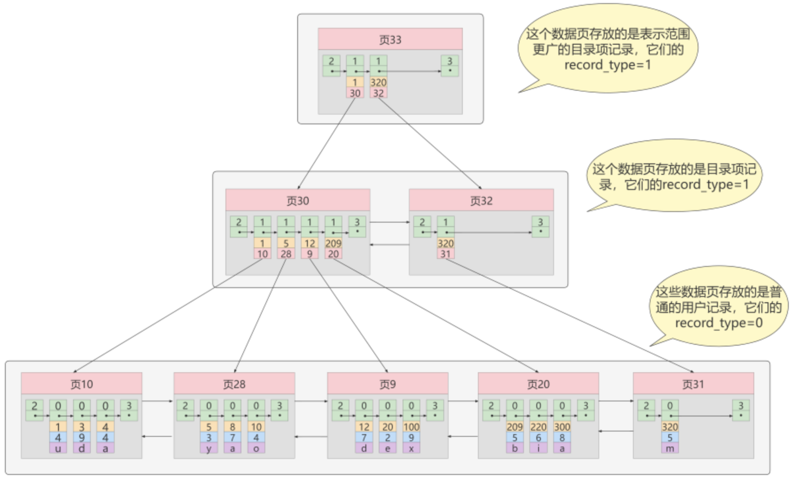


## 常见索引

索引按照物理实现方式，索引可以分为 2 种：**聚簇（聚集）和非聚簇（非聚集）索引**，也把**非聚集索引称为二级索引或者辅助索引**。

### 聚簇索引

聚簇索引并不是一种单独的索引类型，而是**一种数据存储方式**（所有的用户记录都存储在了叶子结点），也就是所谓的 `索引即数据，数据即索引`。

> 术语"聚簇"表示当前数据行和相邻的键值聚簇的存储在一起

**特点：**

- 使用记录主键值的大小进行记录和页的排序，这包括三个方面的含义：
  - `页内` 的记录是按照主键的大小顺序排成一个 `单向链表` 。
  - 各个存放 `用户记录的页` 也是根据页中用户记录的主键大小顺序排成一个 `双向链表` 。
  - 存放 `目录项记录的页` 分为不同的层次，在同一层次中的页也是根据页中目录项记录的主键大小顺序排成一个 `双向链表` 。
- **B+树的叶子节点存储的是完整的用户记录**。
  - 所谓完整的用户记录，就是指这个记录中存储了所有列的值（包括隐藏列）。

把具有这两种特性的B+树称为聚簇索引，所有完整的用户记录都存放在这个`聚簇索引`的叶子节点处。这种聚簇索引并不需要在MySQL语句中显式的使用INDEX 语句去创建， `InnDB` 存储引擎会 `自动` 的创建聚簇索引（先看存不存主键，不存在看有没有唯一约束字段，没有就自己创建一个隐藏的主键）。

**优点：**

- `数据访问更快` ，因为聚簇索引将索引和数据保存在同一个B+树中，因此从聚簇索引中获取数据比非聚簇索引更快
- 聚簇索引对于主键的 `排序查找` 和 `范围查找` 速度非常快
- 按照聚簇索引排列顺序，查询显示一定范围数据的时候，由于数据都是紧密相连，数据库不用从多 个数据块中提取数据，所以节省了大量的io操作。

**缺点：**

- `插入速度严重依赖于插入顺序` ，按照主键的顺序插入是最快的方式，否则将会出现页分裂，严重影响性能。因此，对于InnoDB表，一般都会定义一个`自增的ID列为主键`
- `更新主键的代价很高` ，因为将会导致被更新的行移动。因此，对于InnoDB表，一般定义**主键为不可更新**
- `二级索引访问需要两次索引查找` ，第一次找到主键值，第二次根据主键值找到行数据


### 二级索引

如果想以别的列作为搜索条件，可以多建几颗B+树，不同的B+树中的数据采用不同的排列规则。比方说用`c2`列的大小作为数据页、页中记录的排序规则，再建一课B+树，效果如下图所示：


- 使用记录C2列的大小进行记录和页的排序，这包括三个方面的含义：
  - 页内的记录是按照C2列的大小顺序排成一个单向链表
  - 各个存放用户记录的页也是根据页中记录的C2列大小顺序排成一个双向链表
  - 存放目录项记录的页分为不同的层次，在同一层次中的页也是根据页中目录项记录的C2列大小顺序排成一个双向链表
- B+树的叶子结点存储的并不是完整的用户记录，而只是C2列+主键这两个列的值
- 目录项记录中不再是主键+页号的搭配，而变成了C2列+页号的搭配。

所以如果想通过C2列的值查找某些记录，就可以使用这个B+树，只不过需要有一个**回表**的操作，在这个B+树中只能查到主键，还需要根据这个主键去聚簇索引的B+树中查找真正的数据记录。


**概念：回表 **

根据二级索引的B+树查找记录的主键值，然后再到聚簇索引的B+树中再查一遍，这个过程称为回表。

**问题**：为什么还需要一次回表操作呢？直接把完整的用户记录放到叶子节点不OK吗？

**回答**：如果把完整的用户记录放到叶子结点是可以不用回表。这样相当于每建立一课B+树都需要把所有的用户记录再都拷贝一遍，浪费存储空间，数据冗余。


非聚簇索引的存在不影响数据在聚簇索引中的组织，所以一张表可以有多个非聚簇索引。


小结：聚簇索引与非聚簇索引的原理不同，在使用上也有一些区别：

1. 聚簇索引的`叶子节点`存储的是`数据记录`, 非聚簇索引的叶子节点存储的是`数据位置（一般为主键）`。非聚簇索引不会影响数据表的物理存储顺序。
2. 一个表`只能有一个聚簇索引`，因为只能有一种排序存储的方式，但可以有`多个非聚簇索引`，也就是多个索引目录提供数据检索。
3. 使用聚簇索引的时候，数据的`查询效率高`，但如果对数据进行插入，删除，更新等操作，效率会比非聚簇索引低（这里的插入等操作应该指的是只针对索引字段进行修改，不然需要回表，消耗更高了）。


### 联合索引

也可以同时以多个列的大小作为排序规则，也就是同时为多个列建立索引，比方说想让B+树按照c2和c3列的大小进行排序，这个包含两层含义：

- 先把各个记录和页按照c2列进行排序。
- 在记录的c2列相同的情况下，采用c3列进行排序

示意图如下：

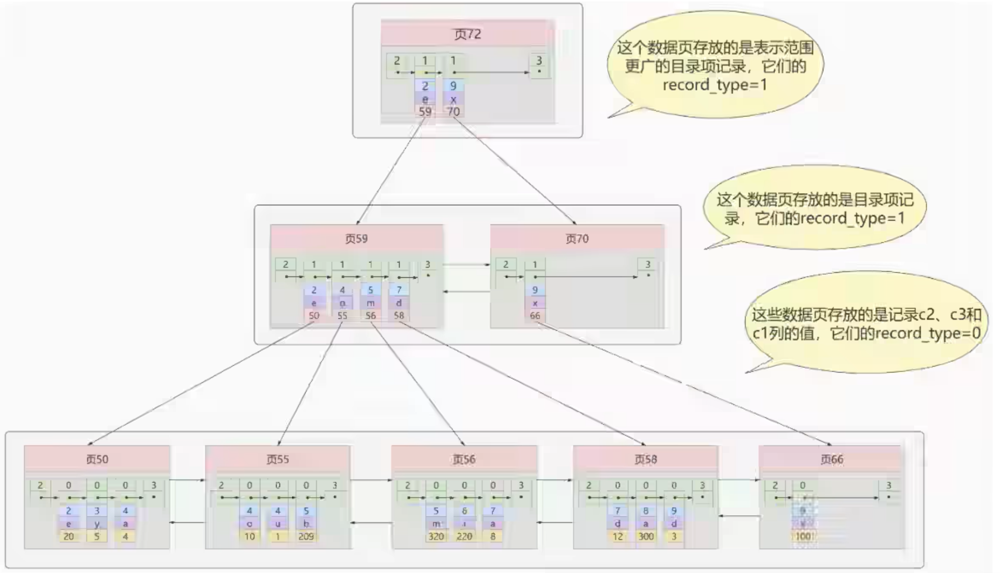

解释：

- 每条目录项都有c2、c3、页号这三个部分组成，各条记录先按照c2列的值进行排序，如果记录的c2列相同，则按照c3列的值进行排序
- B+树叶子节点处的用户记录由c2、c3和主键c1列组成

注意一点，以c2和c3列的大小为排序规则建立的B+树称为联合索引 ，本质上也是一个二级索引。


## 注意点

**1、根页面位置万年不动**

实际上B+树的形成过程是这样的：

- 每当为某个表创建一个B+树索引（聚簇索引不是人为创建的，默认就有）的时候，都会为这个索引创建一个 `根结点` 页面。最开始表中没有数据的时候，每个B+树索引对应的 `根结点` 中即没有用户记录，也没有目录项记录。
- 随后向表中插入用户记录时，先把用户记录存储到这个`根节点` 中。
- 当根节点中的可用 `空间用完时` 继续插入记录，此时会将根节点中的所有记录复制到一个新分配的页，比如 `页a` 中，然后对这个新页进行 `页分裂` 的操作，得到另一个新页，比如`页b` 。这时新插入的记录根据键值（也就是聚簇索引中的主键值，二级索引中对应的索引列的值）的大小就会被分配到 `页a` 或者 `页b` 中，而 `根节点` 便升级为存储目录项记录的页。

这个过程特别注意的是：一个B+树索引的根节点自诞生之日起，便不会再移动。这样只要对某个表建议一个索引，那么它的根节点的页号便会被记录到某个地方。然后凡是 `InnoDB` 存储引擎需要用到这个索引的时候，都会从哪个固定的地方取出根节点的页号，从而来访问这个索引。

**2、二级索引内节点中目录项记录的唯一性**

对于二级索引而言，叶子结点中不仅要存储该索引字段的值，也需要存储对应的主键值，这样才能支持回表操作，查询到完整的数据。其实，对于目录项而言，存储索引字段和页号是不够的，仍然需要存储主键值。这样才能保证唯一性。

比如如下B+树，如果要插入一条索引字段为1，主键为9的记录，他在查询目录页时，是不能确定该数据需要写到哪个页面中，所以还需要将主键也存储到目录项中，如第二幅图，有了主键之后，就知道他应该插入到页5中。这也是为什么二级索引中目录页的目录项记录需要保证唯一的原因。

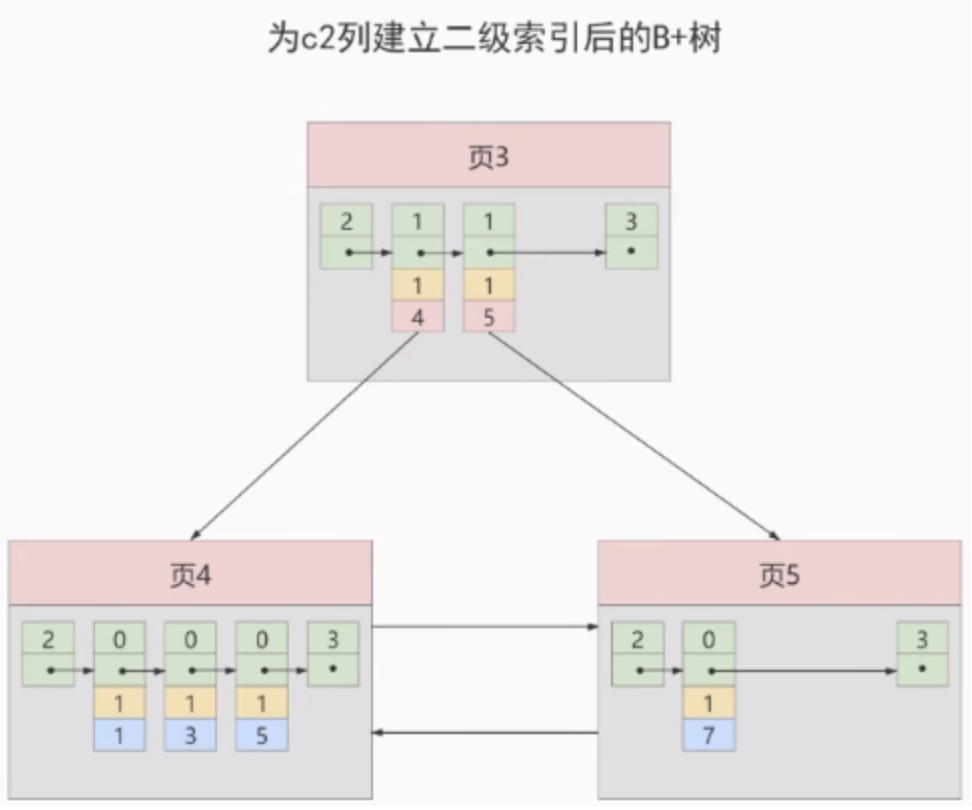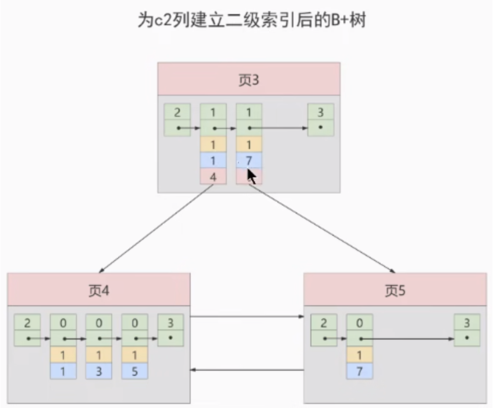

**3、一个页面最少存储 2 条记录**

一个B+树只需要很少的层级就可以轻松存储数亿条记录，查询速度相当不错！这是因为B+树本质上就是一个大的多层级目录，每经过一个目录时都会过滤掉许多无效的子目录，直到最后访问到存储真实数据的目录。如果页面中存储的数据很少，那么树的层级就会变高，甚至会退化到二叉树，单链表，这样性能就会极差。


## MyISAM索引方案

MyISAM引擎使用 B+Tree 作为索引结构，叶子节点的data域存放的是数据记录的地址。

上面可知

Innodb中索引即数据，也就是聚簇索引的那颗B+树的叶子结点中已经把所有完整的用户记录都包含了，而MyISAM的索引方案虽然也适用树形结构，但是却将索引和数据分开存储：

- 将表中的记录按照记录的插入顺序单独存储在一个文件中，称之为数据文件。这个文件并不划分为若干个数据页，有多少记录就往这个文件中塞多少记录，由于在插入数据的时候并没有刻意按照主键大小排序，所以不能再这些数据上是用二分法查找。
- 使用MyISAM存储引擎的表会把索引信息存储在一个称为索引文件的另一个文件中，MyISAM会单独为表的主键创建一个索引，只不过在索引的叶子结点中存储的不是完整的用户记录，而是`主键 + 数据记录地址`的组合。

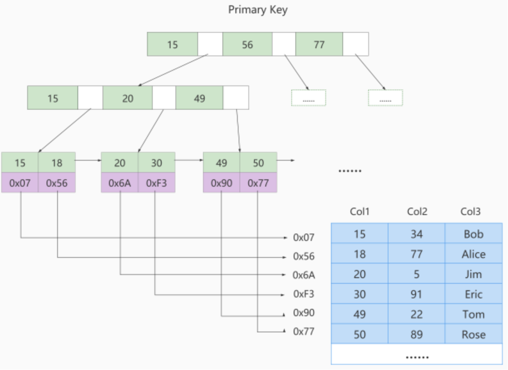

所以可以知道：在MyISAM中主键索引和二级索引其实没有存储差异，结构都一样，只不过主键索引要求key唯一性，但是二级索引的key是可以重复的。


### 对比

MyISAM的索引方式都是“非聚簇”的，与InnoDB包含1个聚簇索引是不同的。

① 在InnoDB存储引擎中，只需要根据主键值对聚簇索引进行一次查找就能找到对应的记录，而在MyISAM 中却需要进行一次回表操作，意味着MyISAM中建立的索引相当于全部都是二级索引。

② InnoDB的数据文件本身就是索引文件，而MyISAM索引文件和数据文件是分离的 ，索引文件仅保存数据记录的地址。

③ InnoDB的非聚簇索引data域存储相应记录主键的值 ，而MyISAM索引记录的是地址 。换句话说，InnoDB的所有非聚簇索引都引用主键作为data域。

④ MyISAM的回表操作是十分快速的，因为是拿着地址偏移量直接到文件中取数据的，反观InnoDB是通过获取主键之后再去聚簇索引里找记录，虽然说也不慢，但还是比不上直接用地址去访问。

⑤ InnoDB要求表必须有主键（MyISAM可以没有）。如果没有显式指定，则**MySQL系统会自动选择一个非空且唯一标识数据记录的列作为主键。如果不存在这种列，则MySQL自动为InnoDB表生成一个隐含字段作为主键，这个字段长度为6个字节，类型为长整型。**

知道Innodb的索引实现原理后，可以知道如下：

1、不建议使用过长的字段作为主键：这是由于二级索引中都引用主键索引，过长的主键会导致二级索引过大。

2、不建议使用非单调字段作为主键：因为Innodb数据文件本身是一颗B+树，非单调的主键或造成在插入数据时，数据文件为了维持B+树的特性而频繁的分裂调整，十分低效，因此使用自增字段作为主键是个好方案。


## 索引代价

索引是个好东西，可不能乱建，它在空间和时间上都会有消耗：

- 空间上的代价

  每建立一个索引都要为它建立一棵B+树，每一棵B+树的每一个节点都是一个数据页，一个页默认会 占用 16KB 的存储空间，一棵很大的B+树由许多数据页组成，那就是很大的一片存储空间。

- 时间上的代价

  每次对表中的数据进行 增、删、改 操作时，都需要去修改各个B+树索引。而且B+树每层节点都是按照索引列的值从小到大的顺序排序而组成了双向链表。不论是叶子节点中的记录，还是内节点中的记录（也就是不论是用户记录还是目录项记录）都是按照索引列的值从小到大的顺序而形成了一个单向链表。而增、删、改操作可能会对节点和记录的排序造成破坏，所以存储引擎需要额外的时间进行一些记录移位，页面分裂、页面回收等操作来维护好节点和记录的排序。如果建了许多索引，每个索引对应的B+树都要进行相关的维护操作，会给性能拖后腿。

> 一个表上索引建的越多，就会占用越多的存储空间，在增删改记录的时候性能就越差。


## 合理性分析

从MySQL的角度讲，一个现实问题是磁盘IO。因为数据都是存储在文件，也就是磁盘上的，如果能让索引的数据结构尽量减少硬盘的IO操作，所消耗的时间就越小。也就是说，磁盘的IO操作次数对索引的使用效率至关重要。

查找都是索引操作，一般来说索引非常大，尤其是关系型数据库，当数据量比较大的时候，索引的大小有可能几个G甚至更多，为了减少索引在内存的占用，数据库索引是存储在外部磁盘上的，当利用索引查询的时候，不可能把整个索引全部加载到内存，所以MySQl衡量查询效率的标准就是磁盘IO次数。


### Hash结构

优点：

- Hash的查找复杂度一般都为O(1)级别，这比B+树是要快很多的。

缺点：

- Hash索引仅能满足(=, <>, IN)查询，对于范围查询，Hash型的索引时间复杂度会退化为O(n)；而树形的有序特性，依然能保持O(log~2~N)的高效率。
- Hash索引还有一个缺陷，数据的存储是没有顺序的，在ORDER BY的情况下，使用Hash索引需要对数据重新排序。
- 对于联合索引的情况，Hash值是将联合索引键值合并后一起计算的（比如字符的ASCII码相加），无法单独对一个键或者几个索引键进行查询。
- 对于等值查询来说，通常Hash索引的效率更高，不过如果索引列的重复值很多，效率就会降低，这些重复值会使用在桶中使用单链表存储，查找需要遍历，非常耗时。

Hash适用性：

虽然InnoDB本身不支持Hash索引，但是提供自适应Hash索引（Adaptive Hash Index）。如果某个数据经常被访问，当满足一定条件时，就会讲这个数据页的地址存放到Hash表中，下次查询的时候，就可以直接找到这个页面的所在位置。这样B+树也具备了Hash索引的优点。

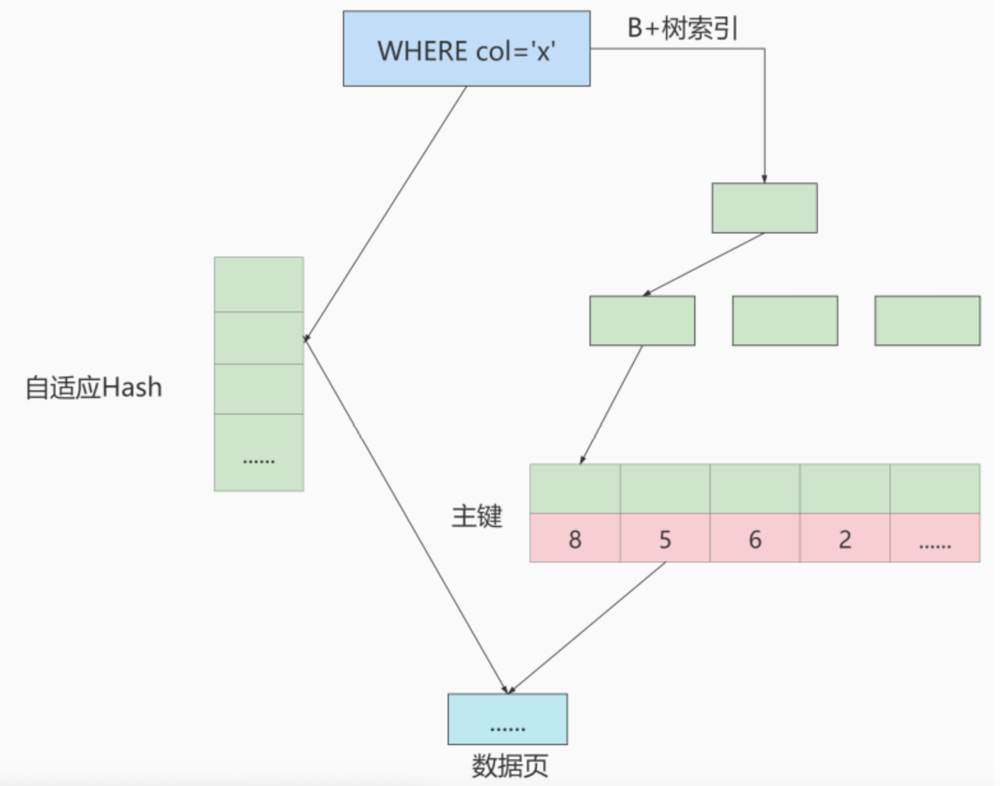

```mysql
mysql> show variables like '%adaptive_hash_index';
+----------------------------+-------+
| Variable_name              | Value |
+----------------------------+-------+
| innodb_adaptive_hash_index | ON    |
+----------------------------+-------+
1 row in set (0.05 sec)
```


### 二叉树

对于二叉搜索树BST，树的高度是个问题，此外某种情况下树可能会退化为单链表；

对于AVL，平衡二叉搜索树，数据的高度同样是个问题，因为🌲的高度直接决定了磁盘的读写次数。

因此为了降低树的高度，需要将树变得“矮胖”，也就是要变成多叉树。


### B-Tree

B 树的英文是 Balance Tree，也就是 `多路平衡查找树`。简写为 B-Tree。它的高度远小于平衡二叉树的高度。

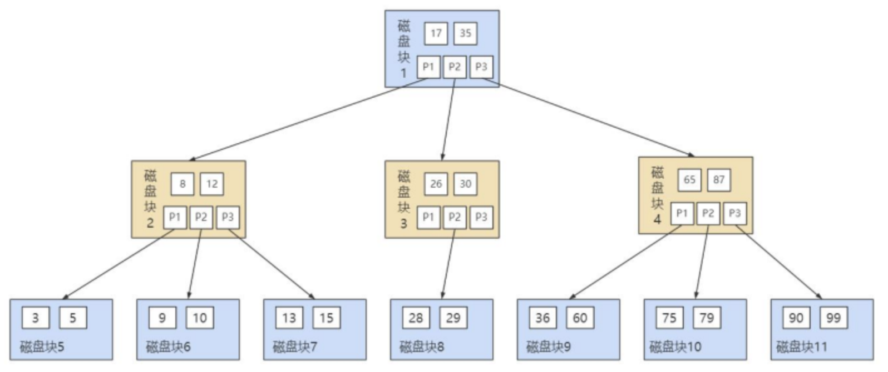

B-Tree作为多路平衡二叉树，他的每一个节点最多可以包括M个子节点，`M称为B-Tree的阶`。每个磁盘块中包括`关键字`和`子节点的指针`。如果一个磁盘块中包括了X个关键字，那么指针数就是X+1。对于一个100阶的B-Tree来说，如果有三层的话最多可以存储约100万索引数据。对于大量的索引数据来说，采用B-Tree的结构是非常适合的，因为树的高度远小于二叉树的高度。

一个 M 阶的 B 树（M>2）有以下的特性：

1. 根节点的儿子数的范围是 [2,M]。
2. 每个中间节点包含 k-1 个关键字和 k 个孩子，孩子的数量 = 关键字的数量 +1，k 的取值范围为 [ceil(M/2), M]。
3. 叶子节点包括 k-1 个关键字（叶子节点没有孩子），k 的取值范围为 [ceil(M/2), M]。
4. 假设中间节点节点的关键字为：Key[1], Key[2], …, Key[k-1]，且关键字按照升序排序，即 Key[i]<Key[i+1]。此时 k-1 个关键字相当于划分了 k 个范围，也就是对应着 k 个指针，即为：P[1], P[2], …, P[k]，其中 P[1] 指向关键字小于 Key[1] 的子树，P[i] 指向关键字属于 (Key[i-1], Key[i]) 的子树，P[k] 指向关键字大于 Key[k-1] 的子树。
5. 所有叶子节点位于同一层。

更直观的例子：

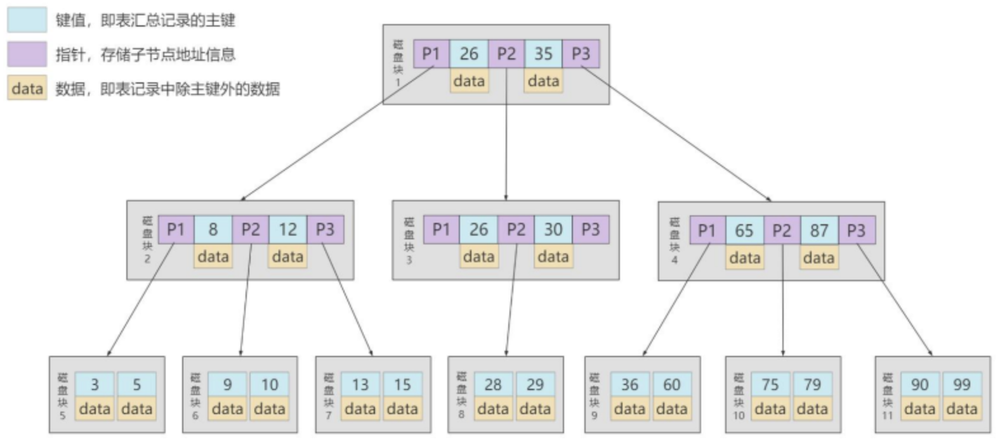

小结：

- B-Tree在插入和删除节点的时候如果导致树不平衡，就通过自动调节节点的位置来保持树的自平衡。
- 关键字集合分布在整棵树中，即叶子结点和非叶子结点都存放数据，搜索有可能在非叶子节点结束
- 其搜索性能等价于在关键字全集内做一次二分查找


### B+Tree

B+Tree也是一种多路搜索树，基于B-Tree做了改进。主流的DBMS都支持B+Tree的索引方式，如MYSQL，相比于B-Tree，B+Tree更适合文件索引系统。

**B+ 树和 B 树的差异在于以下几点：**

1. 有 k 个孩子的节点就有 k 个关键字。也就是孩子数量 = 关键字数，而 B 树中，孩子数量 = 关键字数 +1。
2. 非叶子节点的关键字也会同时存在在子节点中，并且是在子节点中所有关键字的最大（或最小）。
3. 非叶子节点仅用于索引，不保存数据记录，跟记录有关的信息都放在叶子节点中。而 B 树中，非叶子节点既保存索引，也保存数据记录 。
4. 所有关键字都在叶子节点出现，叶子节点构成一个有序链表，而且叶子节点本身按照关键字的大小从小到大顺序链接。

**B+Tree优点：**

1、查询效率更稳定。B+Tree的数据都存储在叶子节点中，意味着不同的查询所需要的访问B+Tree的次数是一致的。

2、B+Tree的查询效率更高。通常B+Tree比+B-Tree更矮胖（阶数更大，深度更低），查询所需要的磁盘IO也会更少，同样的磁盘页大小，B+Tree可以存储更多的节点关键字。

3、在查询范围上，B+Tree的效率也比B-Tree高。因为B+Tree的所有关键字都存储在叶子节点上，叶子节点之间都有指针，数据是递增的，这使得范围查询可以通过指针很方便进行。而B-Tree中则需要通过中序遍历才能完成范围查找，效率要低很多。


### 思考题

**为了减少IO，索引树会一次性加载吗？**

> [!IMPORTANT]
>
> 1、数据库索引是存储在磁盘上的，如果数据量很大，必然导致索引的大小也很大，超过几个G。
>
> 2、当我们利用索引查询时，是不可能将全部几个G的索引都加载进内存的，只能逐一加载每一个磁盘页，磁盘页即对应着索引数的节点。

**B+树的存储能力如何？为何说一般查找行记录，最多只需1~3次磁盘IO**

> [!IMPORTANT]
>
> InnoDB存储引擎中页的大小为16KB，一般表的主键类型为INT或BIGINT，指针类型也一般为4个或8个字节，也就是说一个页中大概存储16KB/（8+8B）=1K个键值，对于深度为3的B+Tree索引可以维护约10 ^ 3 ^ 3=10亿条记录。
>
> 实际情况中每个节点可能也没有填满，因此在数据库中，B+Tree的高度一般在2～4层。由于MySQL的InnoDB存储引擎在设计时是将跟节点常驻内存的，也就说查找某一键值的行记录最多只需要1～3次磁盘IO操作。

**为什么说B+树比B-树更适合实际应用中操作系统的文件索引和数据库索引？**

> [!IMPORTANT]
>
> 1、B+Tree的磁盘读写代价更低
>
> B+Tree的内部节点并没有指向关键字具体信息的指针。因此其内部节点相对于B-Tree更小。如果把所有同一内部节点的关键字存放在同一盘块中，那么盘块所能容纳的关键字数量也越多，一次性读入内存的关键字也就越多。相对来说IO读写次数就降低了。
>
> 2、B+Tree的查询效率更加稳定
>
> 所有关键字的查询路径相同，查询效率相当。

**Hash 索引与 B+ 树索引的区别**

> [!IMPORTANT]
>
> 1、Hash索引不能进行范围查询，而B+Tree可以。这是因为Hash索引指向的数据是无序的，而B+Tree的叶子节点是个有序的链表。
>
> 2、Hash索引不支持联合索引的最左侧原则，而B+Tree可以。对于联合索引，Hash索引在计算Hash值的时候是将索引键合并后再一起计算Hash值，所以不会针对每个索引单独计算Hash值，因此如果用到联合索引的一个或几个索引时，联合索引无法被利用

**Hash 索引与 B+ 树索引是在建索引的时候手动指定的吗？**

> [!IMPORTANT]
>
> 针对InnoDB和MyISAM存储引擎，都会默认采用B+Tree索引，无法使用Hash索引。InnoDB提供自适应Hash是不需要手动指定的，如果是Memory/Heap和NDB存储引擎，是可以选择hash索引的。


## InnoDB数据存储结构

### 页

**1、基本单位**

InnoDB将数据划分为若干个页，InnoDB中页的大小默认为**16KB**。

**InnoDB以页作为磁盘和内存之间交互的基本单位，也就是一次最少从磁盘中读取16KB的内容到内存中，一次最少把内存中的16KB内容刷新到磁盘中**。也就是说，在数据库中，不论读一行，还是读多行，都是将这些行所在的页进行加载，也就是说，数据库管理存储空间的基本单位是页，数据局IO操作的最小单位是页，一个页中可以存储多个行记录。


**2、结构概述**

页可以**不在物理结构上相连**，只要**通过双向链表相关联**即可。每个数据页中的记录会按照主键值**从小到大的顺序组成一个单项链表**，**每个数据页都会为存储在他里面的记录生成一个页目录**，再通过主键查找某条记录时，可以在**页目录**中使用**二分法**快速定位到对应的槽，然后再遍历该槽对应分组中的记录即可快速找到指定的记录。


**3、页大小**

不同的数据库管理系统（简称DBMS）的页大小不同。比如在 MySQL 的 InnoDB 存储引擎中，默认页的大小是 `16KB`。

```mysql
mysql> show variables like '%innodb_page_size%';
+------------------+-------+
| Variable_name    | Value |
+------------------+-------+
| innodb_page_size | 16384 | # 1024 * 16
+------------------+-------+
1 row in set (0.04 sec)
```


**4、页的上层结构**

在数据库中，还存在着区（Extent）、段（Segment）和表空间（Tablespace）的概念。行、页、区、段、表空间的关系如下图所示：

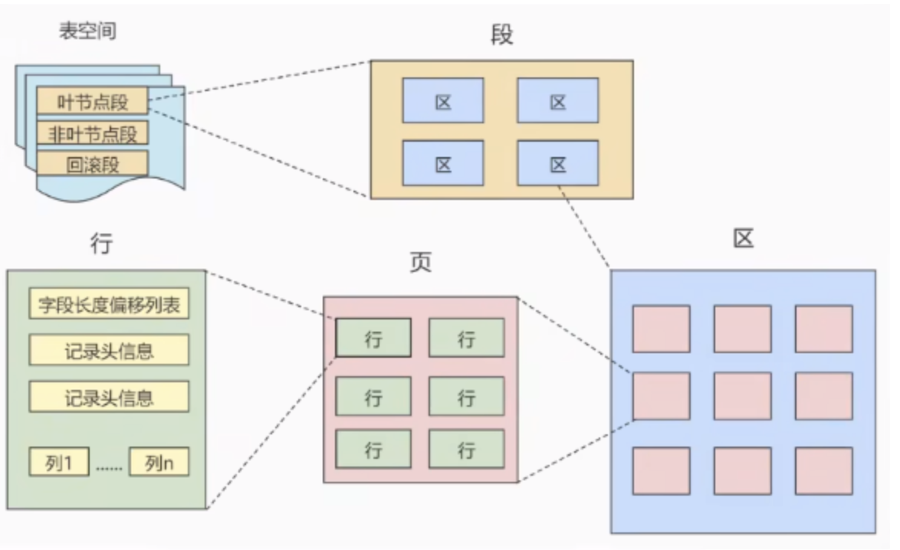

- 区（Extent）是比页大一级的存储结构，在InnoDB存储引擎中，**一个区会分配64个连续的页**。因为InnoDB中的页大小默认是16KB，所以一个区的大小是**64*16KB=1MB**。
- 段（Segment）由一个或多个区组成，区在文件系统是一个连续分配的空间，不过**在段中不要求区与区之间是相邻的**。**段是数据库中的分配单位**，**不同类型的数据库对象以不同的段形式存在**。当创建数据表、索引的时候，就会相应的创建对应的段，比如创建一张表时会创建一个表段，创建一个索引时会创建一个索引段。
- 表空间（Tablespace）是一个逻辑容器，表空间存储的对象时段，**在一个表空间中可以有一个或多个段，但是一个段只能属于一个表空间**。数据库由一个或多个表空间组成，表空间从管理上可以划分为`系统表空间`、`用户表空间`、`撤销表空间`、`临时表空间`等。


**5、页的内部结构**

页如果按类型划分的话，常见的有 `数据页（保存B+树节点）、系统表、Undo 页 和 事务数据页` 等。数据页是最常使用的页。

数据页的 `16KB` 大小的存储空间被划分为七个部分，分别是文件头（File Header）、页头（Page Header）、最大最小记录（Infimum + supremum）、用户记录（User Records）、空闲空间（Free Space）、页目录（Page Directory）和文件尾（File Tailer）。

页结构的示意图如下所示：

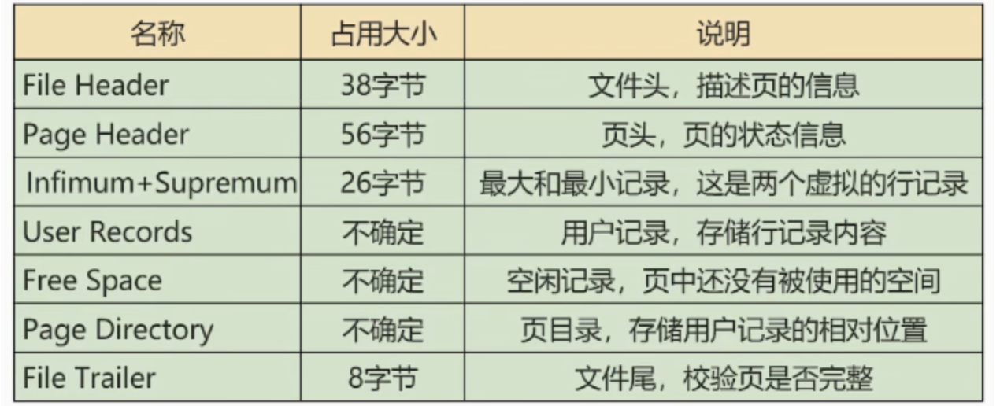

具体的解释可以这篇[文章](https://mofan212.github.io/posts/MySQL-Advanced-Seventh-Data-Storage-Structure-Of-InnoDB/index.html)，写的很牛，很全。


**6、问题：**

B+Tree如何检索记录？

- 如果通过B+Tree的索引查询行记录，首先是从B+Tree的跟开始，逐层检索，直到找到叶子节点，也就是找到对应的数据页为止，将数据页加载到内存中，页目录的槽采用二分查找的方式找到一个粗略的分组，然后在分组中在通过链表遍历的方式进行查找。

普通索引和唯一所以查询效率有何不同？

- 唯一索引就是在普通索引上增加了约束性，也就是关键字唯一，找到了关键字就停止检索。而对于普通索引，可能会存在用户记录中关键字相同的情况，根据页结构的原理，当读取一条记录时，并不是单独的将这条记录从磁盘中读出去，而是将这个记录所在的页加载到内存中进行读取。一个页中可能存储着上千条记录，因此在普通索引字段上的查找可能在内存中多了几次“判断下一条记录”的操作，但对于CPU来说，这些操作消耗的时间可以忽略不计。但如果重复数据很多，需要跨页，性能就会有明显的差别，因为多出了磁盘IO操作。


## InnoDB行格式

向表中插入记录时，都是以行为单位的，这些记录在磁盘上的存放方式也被称为**行格式或记录格式**。InnoDB 存储引擎设计了 4 种不同类型的行格式：

- Compact
- Redundant
- Dynamic 和 Compressed

```mysql
mysql> SELECT @@innodb_default_row_format;
+-----------------------------+
| @@innodb_default_row_format |
+-----------------------------+
| dynamic                     |
+-----------------------------+
1 row in set (0.01 sec)
```


### Compact

一条完整的记录其实可以被分为记录的额外信息和记录的真实数据两大部分。

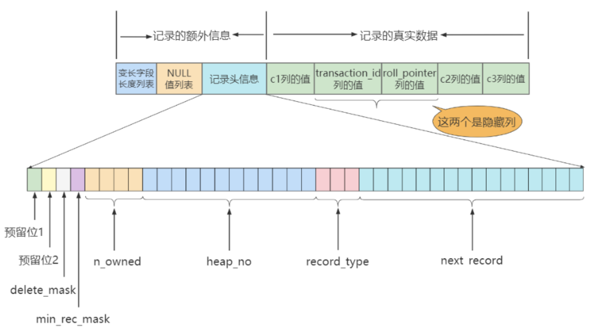

由上图可知，Compact 行格式分为四个部分：

- 变长字段长度列表
- NULL 值列表
- 记录头信息
- 真实记录数据

**记录头信息**

名称			大小（单位 bit）	描述
预留位 1		1				未使用
预留位 2		1				未使用
delete_mask	1				标记当前记录是否被删除
min_rec_mask     1				B+Tree 的每层非叶子节点中的最小记录都会添加该标记
n_owned	      4				当前记录拥有的记录数（指代的是该记录所在槽的记录数，只有该槽的最后一条记录才有值）
heap_no	       13			      当前记录在记录堆的位置信息
record_type	 3				当前记录的类型
next_record	 16			      下一条记录的相对位置（可以看作是和这条记录的偏移量）

**变长字段长度列表**

MySQL 支持一些变长的数据类型，比如 VARCHAR(M)、VARBINARY(M)、TEXT、BLOB 等类型，这些数据类型修饰列被称为变长字段，变长字段存储的字节数是不固定的，所以**在存储真实数据时需要顺便把这些数据占用的字节数也存起来**。在 Compact 行格式中，把所有变长字段的真实数据占用的字节长度都存放在记录的开头部位，从而形成一个变长字段长度列表。

注意： 存储的变长长度和字段顺序是反过来的。比如两个 CARCHAR 字段在表结构的顺序是 a(10) 和 b(15)，那么在变长字段长度列表中存储的顺序是 15 和 10。都是用十六进制表示，也就是0x0F, 0x0A。最终该记录的变长字段长度列表存储的就是0F0A。

**NULL 值列表**

Compact 行格式会把可以为 NULL 的列统一管理起来，并存放在 NULL值列表 中。如果表中的列都要求 NOT NULL，那么 NULL 值列表 也不存在了。

为什么要定义 NULL 值列表？

因为数据都需要对齐，如果没有标注出 NULL 值的位置，就有可能在查询数据时出现混乱。如果使用一个特定的符号放到相应的数据位表示 NULL，虽能达到效果，但会浪费空间。所以不如开辟出一块空间专门用来记录该行的哪些列是NULL；

- 二进制位值为 1 时，代表该列为 NULL
- 二进制位值为 0 时，代表该列不为 NULL

假设有字段 a、b、c，其中 a 是主键，在某一行中存储的数依次是 (1, null, 2)。Compact 行格式中的 NULL 值列表中将会存放 01，第一个 0 表示列 c 不为 NULL，第二个 1 表示列 b 的值为 NULL。因为列 a 是主键，肯定是非 NULL 且唯一的，因此 NULL 值列表会自动跳过主键。这也说明NULL值记录只会针对非NOT NULL的字段进行统计。

**记录的真实数据**

记录的真实数据除了用户定义的数据以外，还会有三个隐藏列：

列名			是否必须	占用空间	 描述
DB_ROW_ID		否		6 字节	   行 ID，唯一标识
DB_TRX_ID		  是		6 字节	   事务 ID
DB_ROLL_PTR	    是	        7 字节	    回滚指针

如果一个表没有手动定义主键列，会选取一个唯一列作为主键列；如果没有唯一列，则会为表默认添加一个名为 DB_ROW_ID 的隐藏列作为主键列。也就是说，DB_ROW_ID 隐藏列是在既没有主键列也唯一列时才会存在的。DB_TRX_ID 和 DB_ROLL_PTR 与 MySQL 的事务日志有关。


### 行溢出

InnoDB 存储引擎可以将一条记录中的某些数据存储在真正的数据页面之外。

VARCHAR(M) 类型最多可以存放 65535 个字节，那可以创建仅包含一个 VARCHAR(65535) 列的表吗？比如：

```mysql
CREATE  TABLE  varchar_size_demo(
    c  VARCHAR(65535)
)  CHARSET=ascii  ROW_FORMAT=Compact;

# ERROR 1118 (42000): Row size too large. The maximum row size for the used table type, not counting BLOBs, is 65535. This includes storage overhead, check the manual. You have to change some columns to TEXT or BLOBs
# 创建失败了，这是因为：MySQL 对一条记录占用的最大存储空间是有限制的，除 BLOB 或 TEXT 类型的列外， 其他所有列（不包括隐藏列和记录头信息）占用的字节长度加起来不能超过 65535 个字节。
CREATE  TABLE  varchar_size_demo(
    c  VARCHAR(65532)
)  CHARSET=ascii  ROW_FORMAT=Compact;
```

变长字段长度列表要占用 2 个字节，且 c 列未被标记为 NOT NULL，因此 NULL 值列表还会占用 1 个字节，最终自能创建出 65532 字节

注意： 此处的 65532 还和表使用的字符集有关，创建的表使用的字符集是 ascii，在这种字符集下，一个字符恰好占用 1 个字节，如果换用其他字符集，比如 utf8mf4，在这种字符集下，一个字符不再只占用 1 个字节，此时需要额外的计算才能求出 VARCHAR(M) 中 M 的最大值。

**一个页的大小一般是 16KB，即 16384 字节，而一个 VARCHAR(M) 类型的列可以存储远超这个值的字节数，这导致一个页可能都存放不了一条记录，这种现象被称为 行溢出。**

使用 Compact 或 Reduntant 行格式时，对于占用存储空间非常大的列，在记录的真实数据处只会存储该列的一部分数据，而把剩余数据分散存储到其他的几个页中，并在记录的真实数据处用 20 个字节指向这些页的地址（这 20 个字节中还包括这些分散在其他页面中的数据所占用的字节数），以便找到剩余数据所在的页，这被称为页的拓展。

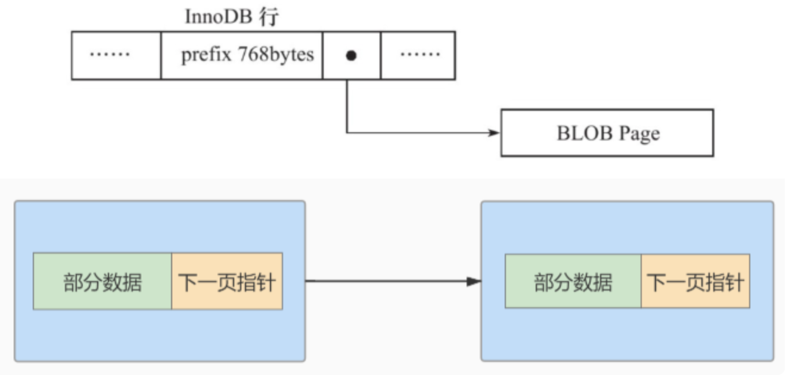

### Dynamic 和 Compressed

在 MySQL 8.0 中，默认行格式是 Dynamic。Dynamic、Compressed 行格式和 Compact 行格式很类似，只不过在处理行溢出数据时有差别：

Compressed 和 Dynamic 两种行格式对于存放在 BLOB 中的数据采用了完全的行溢出。在数据页中只存放 20 个字节的指针（溢出页的地址），实际的数据都存放在 Off Page（溢出页）中。


而 Compact 和 Redundant 两种格式会在记录的真实数据处存储一部分数据（存放 768 个前缀字节）。

对于 Compressed 行格式来说，存储在其中的行数据会以 zlib 的算法进行压缩，因此对于 BLOB、TEXT、VARCHAR 这类大长度类型的数据能够进行非常有效的存储。

### Redundant

Redundant 是 MySQL 5.0 之前 InnoDB 的行记录存储方式，MySQL 8.0 也支持这种行格式。

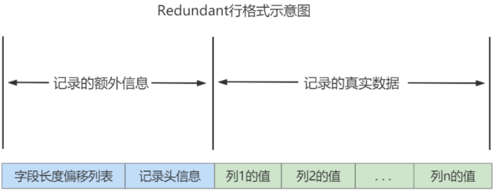

不同于 Compact 行记录格式，Redundant 行格式的首部存在一个 字段长度偏移列表，它同样是按照列的顺序 逆序 摆放的。

**字段长度偏移列表**

Compact 行格式开头是 变长字段长度列表，而 Redundant 行格式的开头是 字段长度偏移列表，它们相比有以下差异：

- 少了“变长”两个字。Redundant 行格式会把该条记录中所有列（包括隐藏列）的长度信息 都 逆序存储到字段长度偏移列表。
- 多了“偏移”两个字。这意味着计算列值长度的方式不像 Compact 行格式那么直观，它采用两个相邻数值的差值来计算出各个列值的长度。

> 比如某条记录的字段长度偏移列表是：2B 25 1F 1B 13 0C 06
>
> 由于采用逆序摆放，因此 字段长度偏移列表 中的值是：06 0C 13 17 1A 24 25
>
> 而按照两个相邻数值的差值来计算各个列值的长度的意思是：
>
> - 第一列 DB_ROW_ID 的长度是 0x06 个字节，也就是 6 个字节。
> - 第二列 DB_TRX_ID 的长度是 0x0c-0x06=0x06 个字节，也就是 6 个字节。

**记录头信息**

不同于 Compact 行格式，Redundant 行格式中的记录头信息固定占用 6 个字节（即 48 位）：

名称			大小（bit）	          描述
()				1			预留位，未使用
()				1			预留位，未使用
deleted_mask	 1			该行是否被删除
min_rec_mask	1			B+Tree 的每层非叶子节点中的最小记录会添加此标记
n_owned		 4			当前记录拥有的记录数
heap_no		13			索引堆中该记录的位置信息
n_fileds	           10			记录中列的数量
1byte_offs_flag	1			字段长度偏移列表中每个列对应的偏移量
next_record	    16			页中下一条记录的绝对位置

与 Compact 行格式的记录头信息相比，有两处不同：

- Redundant 行格式多了 `n_field` 和 `1byte_offs_flag` 两个属性
- Redundant 行格式中没有 `record_type` 属性


## 区，段，碎片区

### 区分类

区大体上可以分为4种类型：

- 空闲的区 (FREE) : 现在还没有用到这个区中的任何页面。
- 有剩余空间的碎片区 (FREE_FRAG)：表示碎片区中还有可用的页面。
- 没有剩余空间的碎片区 (FULL_FRAG)：表示碎片区中的所有页面都被使用，没有空闲页面。
- 附属于某个段的区 (FSEG)：每一个索引都可以分为叶子节点段和非叶子节点段。

处于FREE、FREE_FRAG 以及 FULL_FRAG 这三种状态的区都是独立的，直属于表空间。而处于 FSEG 状态的区是附属于某个段的。


### 表空间

表空间可以看作是InnoDB存储引擎逻辑结构的最高层，所有的数据都存放在空间表。

表空间是一个`逻辑容器`，表空间存储的对象时段，在一个表空间中可以有一个或多个段，但是一个段只能属于一个表空间。表空间数据库由一个或多个表空间组成，表空间从管理上可以划分为`系统表空间`（System Tablespace）、`独立表空间`（File-per-table Tablespace）、`撤销表空间`（Undo Tablespace）和`临时表空间`（Temporary Tablesapce）等。


**独立表空间**

独立表空间，即每张表有一个独立的表空间，也就是数据和索引信息都会保存在自己的表空间中。独立的表空间 (即：单表) 可以在不同的数据库之间进行 `迁移`。

空间可以回收 (DROP TABLE 操作可自动回收表空间；其他情况，表空间不能自己回收) 。如果对于统计分析或是日志表，删除大量数据后可以通过：`alter table TableName engine=innodb;`回收不用的空间。对于使用独立表空间的表，不管怎么删除，表空间的碎片不会太严重的影响性能，而且还有机会处理。

```mysql
mysql> show variables like 'innodb_file_per_table';
+-----------------------+-------+
| Variable_name         | Value |
+-----------------------+-------+
| innodb_file_per_table | ON    |
+-----------------------+-------+
1 row in set (0.01 sec)
```

看到 innodb_file_per_table=ON, 这就意味着每张表都会单词保存一个 .ibd 文件。


**系统表空间**

系统表空间的结构和独立表空间基本类似，只不过由于整个MySQL进程只有一个系统表空间，在系统表空间中会额外记录一些有关整个系统信息的页面，这部分是独立表空间中没有的。

InnoDB数据字典

实际上是为了更好的管理用户数据而不得以引入的一些额外数据(比如某个表属于哪个表空间，表内有多少个列，表中的每个列是什么类型，某个表空间的文件路径等等)，这些数据页称为`元数据`。InnoDB 存储引擎特意定义了一些列的内部系统表 (internal system table) 来记录这些元数据：

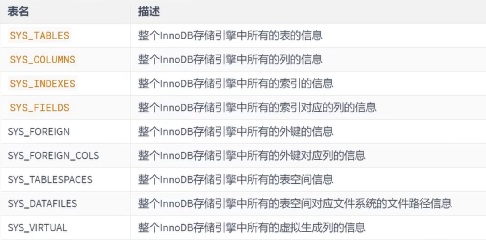

这些系统表也称为 `数据字典`，它们都是以 B+ 树的形式保存在系统表空间的某个页面中。其中 `SYS_TABLES、SYS_COLUMNS、SYS_INDEXES、SYS_FIELDS` 这四个表尤其重要，称之为基本系统表 (basic system tables) 。

注意：用户不能直接访问 InnoDB 的这些内部系统表，除非你直接去解析系统表空间对应文件系统上的文件。不过考虑到查看这些表的内容可能有助于大家分析问题，所以在系统数据库 `information_schema` 中提供了一些以 `innodb` 开头的表：`INNODB_TABLES`、`INNODB_INDEXES`、`INNODB_COLUMNS`、`INNODB_FIELDS`等.

在 `information_scheme` 数据库中的这些以 `INNODB` 开头的表并不是真正的内部系统表，而是在存储引警启动时读取这些以 SYS 开头的系统表后填充到这些表中的。它们中的字段并不完全一样，但供日常参考已经足矣。


### 为啥有区

B+Tree的每一层中的页都会形成一个双向链表，如果是以页为单位来分配存储空间的话，双向链表相邻的两个页之间的物理位置可能离得非常远。B+Tree索引在进行范围查询时只需要定位到最左边记录和最右边记录，然后沿着双向链表一直扫描即可，而如果链表中相邻的两个页物理位置离得非常远，就需要随机IO，在读取一次磁盘。而磁盘速度和内存速度差了好几个数量级，所以应该尽量让链表中相邻的页的物理位置也相邻，这样进行**范围查询的时候才可以使用所谓的顺序IO**（也就是一次读取多个连续的页到内存中）。

引入区的概念，一个区就是在物理位置上连续的64个页，因为InnoDB的页的大小默认是16KB，所以一个区的大小是64*16KB=1MB。在表数据量大的时候，为某个索引分配空间的时候就不再按照页为单位分配了，而是按照区为单位分配，甚至在表中的数据特别多的时候，可以一次性分配多个连续的区。虽然可能造成部分空间的浪费（数据不足以填满整个区），但**从性能角度看，可以消除很多随机IO**。


### 为啥有段

对于范围查询，其实是对B+Tree树叶子节点中的记录进行顺序扫描，而如果不区分叶子节点和非叶子节点，统统把节点代表的页面放到申请到的区中的话，进行范围扫描的效果就大打折扣了。所以InnoDB对B+Tree的叶子节点和非叶子节点进行了区别对待，也就是说叶子节点有自己独有的区，非叶子节点也有自己独有的区。存放叶子节点的区的集合就算是一个段，存放非叶子节点的区的集合也算是一个段。**也就是说一个索引会生成两个段，一个叶子节点段，一个非叶子节点段。**

除了索引的叶子节点段和非叶子节点段之外，InnoDB中**还有为存储一些特殊的数据而定义的段，比如回滚段**。所以，常见的段有：数据段、索引段、回滚段。数据段即为B+Tree的叶子节点，索引段即为B+Tree的非叶子节点。

在InnoDB存储引擎中，对段的管理都是有引擎自身所完成，DBA不能也没有必要对其控制，这从一定程度上简化了DBA对段的管理。

**段其实不对应表空间中某一个连续的物理区域，而是一个逻辑上的概念，由若干个零散的页面以及一些完整的区组成**。


### 为啥有碎片区

默认情况下，一个使用InnoDB存储引擎的表只有一个聚簇索引，一个索引会生成两个段，而段是以区为单位申请存储空间的，一个区默认占用1M存储空间，所以默认情况下一个只存了几条记录的小表也需要2M的存储空间吗？以后每添加一个索引也需要多申请2M的存储空间吗？这对于存储记录比较少的表简直是浪费。这是因为前面介绍的区都是非常纯粹的，也就是一个区被整个分配给某个段，即使数据填不满区中所有的页面，那余下的页面也不能挪作他用。

针对这种情况，InnoDB提出了一个**碎片区（fragment extent）**的概念。在一个碎片区中，并不是所有的页都是为了存储同一个段的数据而存在的，而是碎片区中的页可以用于不同的目的，比如有些页可以用于段A，有些可以用于段B，有些不属于任何一个段。**碎片化区直属于表空间，并不属于任何一个段**。

所以此后为某个段分配存储空间的策略如下：

- 在刚开始向表中插入数据时，段是从碎片区以单个页面为单位来分配存储空间的。
- 当某个段已经占用了**32个碎片区页面**后，就会申请以完整的区为单位来分配存储空间。

对于段的更精确定义：若干个零散的页面以及一些完整的区组成。


## 索引创建与设计原则

！！！可以使用EXPLAIN关键字来查看一条语句的执行情况

```mysql
explain select * from dept where dept_id=1;
```

### 索引分类

MySQL的索引包括普通索引、唯一性索引、全文索引、单列索引、多列索引和空间索引等。

- 从 功能逻辑 上说，索引主要有 4 种，分别是普通索引、唯一索引、主键索引、全文索引。
- 按照物理实现方式 ，索引可以分为 2 种：聚簇索引和非聚簇索引（二级索引）。
- 按照作用字段个数进行划分，分成单列索引和联合索引。

普通索引：

在创建普通索引是，不附加任何限制条件，只是用于提高查询效率。这类索引可以创建在任何数据类型中，其值是否唯一和非空，要由字段本身的完整性约束条件决定。建立索引之后，可以通过索引进行查询。

唯一性索引：

使用UNIQUE参数可以设置索引为唯一性索引，在创建唯一性索引时，限制该索引的值必须是唯一的，但是允许有空值。在一张数据表里可以有多个唯一索引。

主键索引：

主键索引是一种特殊的唯一的性索引，在唯一索引的基础上增加了不为空的约束，也就是NOT NULL + UNIQUE，一张表里最多只有一个主键索引。这是由主键索引的物理实现方式决定的，因为数据存储在文件中只能按照一种顺序进行存储。

单列索引：

在表中的单个字段上创建索引。单列索引值根据该字段进行索引，单列索引可以是普通索引，也可以是唯一性索引，还可以是全文索引，只要保证该索引只对应一个字段即可，一个表可以有多个单列索引。

多列（组合、联合）索引：

多列索引是在表的多个字段组合上创建一个索引，该索引指向创建时对应的多个字段，可以通过这几个字段进行查询，是按照顺序来进行匹配的，遵循最左前缀匹配。


### 创建索引

三种方案：

- 在创建表的定义语句 CREATE TABLE 中指定索引列，

  - ```mysql
    CREATE TABLE table_name [col_name data_type]
    [UNIQUE | FULLTEXT | SPATIAL] [INDEX | KEY] [index_name] (col_name [length]) [ASC |
    DESC]
    ```

- 使用 ALTER TABLE 语句在存在的表上创建索引

  - ```mysql
    ALTER TABLE table_name ADD [UNIQUE | FULLTEXT | SPATIAL] [INDEX | KEY]
    [index_name] (col_name[length],...) [ASC | DESC]
    ```

- 或者使用 CREATE INDEX 语句在已存在的表上添加索引。

  - ```mysql
    CREATE [UNIQUE | FULLTEXT | SPATIAL] INDEX index_name
    ON table_name (col_name[length],...) [ASC | DESC]
    ```

- UNIQUE 、 FULLTEXT 和 SPATIAL 为可选参数，分别表示唯一索引、全文索引和空间索引；

- INDEX 与 KEY 为同义词，两者的作用相同，用来指定创建索引；

- index_name 指定索引的名称，为可选参数，如果不指定，那么MySQL默认col_name为索引名；

- col_name 为需要创建索引的字段列，该列必须从数据表中定义的多个列中选择；

- length 为可选参数，表示索引的长度，只有字符串类型的字段才能指定索引长度；

- ASC 或 DESC 指定升序或者降序的索引值存储。

> [!CAUTION]
>
> 定义的主键约束、外键约束、唯一性约束，InnoDB会自动在这些字段上创建索引。
>
> 可以通过`show index from table;`查看

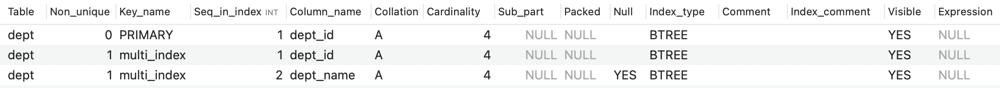

**删除索引**

 使用ALTER TABLE删除索引 ALTER TABLE删除索引的基本语法格式如下：

```mysql
ALTER TABLE table_name DROP INDEX index_name;
```

使用DROP INDEX语句删除索引 DROP INDEX删除索引的基本语法格式如下：

```mysql
DROP INDEX index_name ON table_name;
```

> 提示: 删除表中的列时，如果要删除的列为索引的组成部分，则该列也会从索引中删除，会自动调整。如果组成索引的所有列都被删除，则整个索引将被删除。


### MySQL8.0索引新特性

#### 支持降序索引

降序索引以降序存储键值。虽然在语法上，从MySQL 4版本开始就已经支持降序索引的语法了，但实际上DESC定义是被忽略的，直到MySQL 8.x版本才开始真正支持降序索引 (仅限于InnoDB存储引擎)。

MySQL在8.0版本之前创建的仍然是升序索引，使用时进行反向扫描，这大大降低了数据库的效率。在某些场景下，降序索引意义重大。例如，如果一个查询，需要对多个列进行排序，且顺序要求不一致，那么使用降序索引将会避免数据库使用额外的文件排序操作，从而提高性能。

举例：分别在MySQL 5.7版本（不会生效）和MySQL 8.0版本（会生效）中创建数据表ts1，结果如下：

```mysql
CREATE TABLE ts1(a int,b int,index idx_a_b(a,b desc));
```


#### 隐藏索引

在MySQL 5.7版本及之前，只能通过显式的方式删除索引。此时，如果删除索引后出现错误，又只能通过显式创建索引的方式将删除的索引创建回来。如果数据表中的数据量非常大，或者数据表本身比较 大，这种操作就会消耗系统过多的资源，操作成本非常高。

从MySQL 8.x开始支持 隐藏索引（invisible indexes） ，只需要将待删除的索引设置为隐藏索引，使 查询优化器不再使用这个索引（即使使用force index（强制使用索引），优化器也不会使用该索引）， 确认将索引设置为隐藏索引后系统不受任何响应，就可以彻底删除索引。 **这种通过先将索引设置为隐藏索 引，再删除索引的方式就是软删除。**

同时，如果想验证某个索引删除之后的 `查询性能影响`，就可以暂时先隐藏该索引。

> 注意：主键不能被设置为隐藏索引。当表中没有显式主键时，表中第一个唯一非空索引会成为隐式主键，也不能设置为隐藏索引。

索引默认是可见的，在使用CREATE TABLE, CREATE INDEX 或者 ALTER TABLE 等语句时可以通过 `VISIBLE` 或者 `INVISIBLE` 关键词设置索引的可见性。

```mysql
ALTER TABLE tablename ALTER INDEX index_name INVISIBLE; #切换成隐藏索引
ALTER TABLE tablename ALTER INDEX index_name VISIBLE; #切换成非隐藏索引
```

> 注意 当索引被隐藏时，它的内容仍然是和正常索引一样实时更新的。如果一个索引需要长期被隐藏，那么可以将其删除，因为索引的存在会影响插入、更新和删除的性能。


### 索引设计原则

#### 适合场景

**1、字段的数值有唯一性约束**

索引本身可以起到约束的作用，比如唯一索引、主键索引都是可以起到唯一性约束的，因此在数据表中，如果某个字段时唯一性的，可以直接创建唯一性索引或者主键索引，这样可以更快速的通过该索引来确定某条记录。

> **业务上具有唯一特性的字段，即使是组合字段，也必须建成唯一索引。（来源：Alibaba）** 说明：不要以为唯一索引影响了 insert 速度，这个速度损耗可以忽略，但提高查找速度是明显的。

**2、频繁作为 WHERE 查询条件的字段**

某个字段在SELECT语句的 WHERE 条件中经常被使用到，那么就需要给这个字段创建索引了。尤其是在数据量大的情况下，创建普通索引就可以大幅提升数据查询的效率。

**3、经常 GROUP BY 和 ORDER BY 的列**

索引就是让数据按照某种顺序进行存储或检索，因此当使用 GROUP BY 对数据进行分组查询，或者使用 ORDER BY 对数据进行排序的时候，就需要对分组或者排序的字段进行索引 。如果待排序的列有多个，那么可以在这些列上建立组合索引 。

**4、UPDATE、DELETE 的 WHERE 条件列**

对数据按照某个条件进行查询后再进行 UPDATE 或 DELETE 的操作，如果对 WHERE 字段创建了索引，就能大幅提升效率。如果进行更新的时候，更新的字段是非索引字段，提升的效率会更明显，这是因为非索引字段更新不需要对索引进行维护。

**5、DISTINCT 字段需要创建索引**

有时候需要对某个字段进行去重，使用 DISTINCT，那么对这个字段创建索引，也会提升查询效率。

**6、多表 JOIN 连接操作时，创建索引注意事项**

- 首先， `连接表的数量尽量不要超过 3 张` ，因为每增加一张表就相当于增加了一次嵌套的循环，数量级增长会非常快，严重影响查询的效率。
- 其次， `对 WHERE 条件创建索引` ，因为 WHERE 才是对数据条件的过滤。如果在数据量非常大的情况下， 没有 WHERE 条件过滤是非常可怕的。
- 最后， `对用于连接的字段创建索引` ，并且该字段在多张表中的类型必须一致 。如果类型不一致，需要隐式转换，那么索引会立马失效。

**7、使用列的类型小的创建索引**

以整数类型为例，有TINYINT、MEDIUMINT、INT、BIGINT等，他们占用的存储空间依次递增。如果需要对某个整数列建立索引的话，在表示的整数范围允许的情况下，尽量让索引列使用较小的类型：

- 数据类型越小，在查询时进行的比较操作越快
- 数据类型越小，索引占用的存储空间越少，在一个数据页内就可以放下更多的记录，从而减少磁盘IO带来的性能损耗，更多的数据页换存在内存中，读写速率越快。

这个建议对于表的主键来说更加适用，因为不仅是聚簇索引会存储主键值，其他所有的二级索引的节点处都会存储一份记录的主键值，主键数据类型越小，节省的存储空间越多，IO更高效。

**8、使用字符串前缀创建索引**

假设字符串很长，那存储一个字符串就需要占用很大的存储空间。在为其建立索引时，将有两个问题：

- B+Tree索引中的记录需要把该列的完整字符串存储起来，费时也费空间。
- 如果B+Tree索引中索引列存储的字符串越长，字符串比较会占用更多的时间。

可以通过截取字段的前面一部分内容建立索引，这个就叫前缀索引。这样在查找记录时虽然不能够精确定位到记录的位置，但是能定位到前缀所在位置，再回表查询完整字符串。这样既节约了空间，又减少了字符串的比较时间，还大体能解决排序的问题（只要有截取，必定影响到排序）。

问题是，截取多少呢？截取得多了，达不到节省索引存储空间的目的；截取得少了，重复内容太多，字 段的散列度(选择性)会降低。怎么计算不同的长度的选择性呢？

先看一下字段在全部数据中的选择度：

```
select count(distinct address) / count(*) from shop
```

通过不同长度去计算，与全表的选择性对比：

```
select count(distinct left(address,10)) / count(*) as sub10, -- 截取前10个字符的选择度
count(distinct left(address,15)) / count(*) as sub11, -- 截取前15个字符的选择度
count(distinct left(address,20)) / count(*) as sub12, -- 截取前20个字符的选择度
count(distinct left(address,25)) / count(*) as sub13 -- 截取前25个字符的选择度
from shop;
```

> 越接近于1越好，说明越有区分度
>
> **拓展：Alibaba《Java开发手册》**
>
> 【 强制 】在 varchar 字段上建立索引时，必须指定索引长度，没必要对全字段建立索引，根据实际文本 区分度决定索引长度。
>
> 说明：索引的长度与区分度是一对矛盾体，一般对字符串类型数据，长度为 20 的索引，区分度会高达 90% 以上 ，可以使用 count(distinct left(列名, 索引长度))/count(*)的区分度来确定。

**9、区分度高(散列性高)的列适合作为索引**

`列的基数` 指的是某一列中不重复数据的个数。也就是说**在记录行数一定的情况下，列的基数越大，该列中的值越分散；列的基数越小，该列中的值越集中。**这个列的基数指标非常重要，直接影响是否能有效的利用索引。最好为列的基数大的列简历索引，为基数太小的列的简历索引效果可能不好。

可以使用公式`select count(distinct a) / count(*) from t1` 计算区分度，越接近1越好，一般超过33%就算比较高效的索引了。

**10、使用最频繁的列放到联合索引的左侧**

这样也可以较少的建立一些索引。同时，由于"最左前缀原则"，可以增加联合索引的使用率。

**11、在多个字段都要创建索引的情况下，联合索引优于单值索引**


#### 限制索引的数目

索引数目并不是越多越好，需要限制每张表的索引数量，建议单张表索引数量不超过6个，原因如下：

- 每个索引都需要占用磁盘空间
- 索引会影响INSERT、DELETE、UPDATE等语句的性能，因为表中的数据更改的同时，索引也会进行调整和更新，造成负担
- 优化器在选择如何优化查询时，会根据统一信息，对每一个可能用到的索引来进行评估，以生成出一个最好的执行计划，如果索引数量过多，会增加MySQL优化器生成执行计划时间，降低查询性能。


#### 不适合场景

**1、在where中使用不到的字段，不要设置索引**

WHERE条件 (包括 GROUP BY、ORDER BY) 里用不到的字段不需要创建索引，索引的价值是快速定位，如果起不到定位的字段通常是不需要创建索引的。

**2、数据量小的表最好不要使用索引**

如果表记录太少，比如少于1000个，那么是不需要创建索引的。表记录太少，是否创建索引 `对查询效率的影响并不大`。甚至说，查询花费的时间可能比遍历索引的时间还要短，索引可能不会产生优化效果。

**3、避免对经常更新的表创建过多的索引**

- 第一层含义：频繁更新的字段不一定要创建索引。因为更新数据的时候，也需要更新索引，如果索引太多，在更新索引的时候也会造成负担，从而影响效率。
- 第二层含义：避免对经常更新的表创建过多的索引，并且索引中的列尽可能少。此时，虽然提高了查询速度，同时却降低更新表的速度。

**4、不建议用无序的值作为索引**

例如身份证、UUID(在索引比较时需要转为ASCII，并且插入时可能造成页分裂)、MD5、HASH、无序长字符串等。

**5、删除不再使用或者很少使用的索引**

表中的数据被大量更新，或者数据的使用方式被改变后，原有的一些索引可能不再需要。数据库管理员应当定期找出这些索引，将它们删除，从而减少索引对更新操作的影响。

**6、不要定义冗余或重复的索引**

冗余的一个例子：建立了a个b的联合索引，就不要建立a的单列索引了


## 性能分析工具使用

### 查看系统性能参数

在MySQL中，可以使用 `SHOW STATUS` 语句查询一些MySQL数据库服务器的`性能参数、执行频率`。

SHOW STATUS语句语法如下：

```mysql
SHOW [GLOBAL|SESSION] STATUS LIKE '参数';
```

- Connections：连接MySQL服务器的次数。
- Uptime：MySQL服务器的上线时间。
- Slow_queries：慢查询的次数。
- Innodb_rows_read：Select查询返回的行数
- Innodb_rows_inserted：执行INSERT操作插入的行数
- Innodb_rows_updated：执行UPDATE操作更新的 行数
- Innodb_rows_deleted：执行DELETE操作删除的行数
- Com_select：查询操作的次数。
- Com_insert：插入操作的次数。对于批量插入的 INSERT 操作，只累加一次。
- Com_update：更新操作 的次数。
- Com_delete：删除操作的次数。


### SQL查询成本last_query_cost

一条SQL查询语句在执行前需要查询执行计划，如果存在多种执行计划的话，MySQL会计算每个执行计划所需要的成本，从中选择`成本最小`的一个作为最终执行的执行计划。

如果想要查看某条SQL语句的查询成本，可以在执行完这条SQL语句之后，通过查看当前会话中的`last_query_cost`变量值来得到当前查询的成本。它通常也是`评价一个查询的执行效率`的一个常用指标。这个查询成本对应的是`SQL 语句所需要读取的读页的数量`(这个不敢苟同)。

```mysql
mysql> show status like 'last_query_cost';
+-----------------+-----------+
| Variable_name   | Value     |
+-----------------+-----------+
| Last_query_cost | 10.249000 |
+-----------------+-----------+
```


### 慢查询日志

MySQL的慢查询日志，用来记录在MySQL中响应时间超过阈值的语句，具体指运行时间超过long_query_time值的SQL会被记录到慢查询日志中。long_query_time默认值是10秒。这个默认是不开启的，如果不是调优需要，一般不建议启动该参数，开启该功能会代码性能影响。

```mysql
mysql> show variables like '%slow_query_log';
+----------------+-------+
| Variable_name  | Value |
+----------------+-------+
| slow_query_log | OFF   |
+----------------+-------+
1 row in set (0.01 sec)

mysql> set global slow_query_log='ON';
Query OK, 0 rows affected (0.01 sec)

mysql> show variables like '%slow_query_log%';
+---------------------+-----------------------------------+
| Variable_name       | Value                             |
+---------------------+-----------------------------------+
| slow_query_log      | ON                                |
| slow_query_log_file | /usr/local/mysql/data/ls-slow.log |
+---------------------+-----------------------------------+
2 rows in set (0.01 sec)
```

开启之后，还可以查看他将慢查询日志保存的文件位置。


**查看慢查询sql**

MySQL提供了日志分析工具 `mysqldumpslow` 

mysqldumpslow 命令的具体参数如下：

- -a: 不将数字抽象成N，字符串抽象成S
- -s: 是表示按照何种方式排序：
  - c: 访问次数
  - l: 锁定时间
  - r: 返回记录
  - t: 查询时间
  - al:平均锁定时间
  - ar:平均返回记录数
  - at:平均查询时间 （默认方式）
  - ac:平均查询次数
- -t: 即为返回前面多少条的数据；
- -g: 后边搭配一个正则匹配模式，大小写不敏感的；

```shell
➜  ~ sudo  mysqldumpslow -s t -t 5 /usr/local/mysql/data/ls-slow.log                  
Password:

Reading mysql slow query log from /usr/local/mysql/data/ls-slow.log
Count: 1  Time=14.01s (10s)  Lock=0.00s (0s)  Rows=100000.0 (100000), 0users@0hosts
SELECT * FROM student

Died at /usr/local/mysql/bin/mysqldumpslow line 163, <> chunk 1.
```

下面是一些常用的：

```shell
# 得到返回记录集最多的10个SQL
mysqldumpslow -s r -t 10 /var/lib/mysql/atguigu-slow.log
# 得到访问次数最多的10个SQL
mysqldumpslow -s c -t 10 /var/lib/mysql/atguigu-slow.log
# 得到按照时间排序的前10条里面含有左连接的查询语句
mysqldumpslow -s t -t 10 -g "left join" /var/lib/mysql/atguigu-slow.log
# 另外建议在使用这些命令时结合 | 和 more 使用 ，否则有可能出现爆屏情况
mysqldumpslow -s r -t 10 /var/lib/mysql/atguigu-slow.log | more
```

使用命令 `mysqladmin flush-logs` 来重新生成查询日志文件，具体命令如下，执行完毕会在数据目录下重新生成慢查询日志文件。

```
mysqladmin -uroot -p flush-logs slow
```

> 提示：慢查询日志都是使用mysqladmin flush-logs命令来删除重建的。使用时一定要注意，一旦执行了这个命令，慢查询日志都只存在新的日志文件中，如果需要旧的查询日志，就必须事先备份。

### SQL执行成本SHOW PROFILE

这个好像之前写过了，就是需要开启profiling参数，然后使用show profiles即可查询过去的sql的执行成本

```mysql
show profile cpu,block io for query 2
```

**show profile的常用查询参数： **

- ① ALL：显示所有的开销信息。
- ② BLOCK IO：显示块IO开销。
- ③ CONTEXT SWITCHES：上下文切换开销。
- ④ CPU：显示CPU开销信息。
- ⑤ IPC：显示发送和接收开销信息。
- ⑥ MEMORY：显示内存开销信 息。
- ⑦ PAGE FAULTS：显示页面错误开销信息。
- ⑧ SOURCE：显示和Source_function，Source_file， Source_line相关的开销信息。
- ⑨ SWAPS：显示交换次数开销信息。

**日常开发需注意的结论：**

- ① `converting HEAP to MyISAM`: 查询结果太大，内存不够，数据往磁盘上搬了。
- ② `Creating tmp table`：创建临时表。先拷贝数据到临时表，用完后再删除临时表。
- ③ `Copying to tmp table on disk`：把内存中临时表复制到磁盘上，警惕！
- ④ `locked`。

如果在show profile诊断结果中出现了以上4条结果中的任何一条，则sql语句需要优化。

**注意：**

不过SHOW PROFILE命令将被弃用，可以从 information_schema 中的 profiling 数据表进行查看。


### 分析查询语句EXPLAIN

定位了慢查询的SQL之后，可以使用explain或者describe工具针对性的分析查询语句。explain语句可以帮助查看某个查询语句的具体执行计划。


这个内容有点多的，搜个[blog](https://developer.aliyun.com/article/1323940)吧，有个概念就行。

有个比较重要的概念：[索引条件下推](https://juejin.cn/post/7005794550862053412)

注意：

- EXPLAIN不考虑各种Cache
- EXPLAIN不能显示MySQL在执行查询时所作的优化工作
- EXPLAIN不会告诉你关于触发器、存储过程的信息或用户自定义函数对查询的影响情况
- 部分统计信息是估算的，并非精确值


**进一步使用：**

EXPLAIN可以输出四种格式： `传统格式` ，`JSON格式` ， `TREE格式` 以及 `可视化输出(MySQL Workbench)` 。

```mysql
explain format=json SELECT DISTINCT(student_id) FROM `student_info`;
{
  "query_block": {
    "select_id": 1,
    "cost_info": {
      "query_cost": "60439.62"
    },
    "duplicates_removal": {
      "using_filesort": false,
      "table": {
        "table_name": "student_info",
        "access_type": "range",
        "possible_keys": [
          "student_id"
        ],
        "key": "student_id",
        "used_key_parts": [
          "student_id"
        ],
        "key_length": "4",
        "rows_examined_per_scan": 198225,
        "rows_produced_per_join": 198225,
        "filtered": "100.00",
        "using_index_for_group_by": true,
        "cost_info": {
          "read_cost": "40617.12",
          "eval_cost": "19822.50",
          "prefix_cost": "60439.62",
          "data_read_per_join": "16M"
        },
        "used_columns": [
          "id",
          "student_id"
        ]
      }
    }
  }
}
```


### SHOW WARNINGS

在使用`EXPLAIN`语句查看了某个查询的执行计划后，紧接着还可以使用`SHOW WARNINGS`语句查看与这个查询的执行计划有关的一些扩展信息，比如这样：

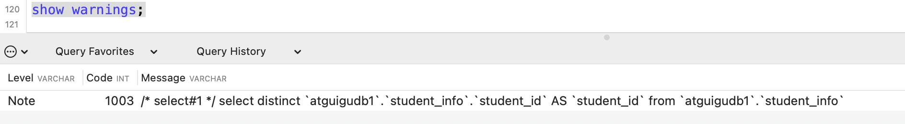

最常见的就是Code为1003的信息，当Code值为1003时，`Message`字段展示的信息类似于查询优化器将查询语句重写后的语句，但并不是真实的语句，仅供参考。


### 监控分析视图-sys schema

关于MySQL的性能监控和问题诊断，一般从performance_schema中去获取数据，在MySQL5.7.7中新增sys schema，他将performace_schema和information_schema中的数据以更容易理解的方式总结归纳为“视图”，其目的是为了降低查询performance_schema的复杂度。

**Sys schema视图摘要**

1. **主机相关**：以host_summary开头，主要汇总了IO延迟的信息。
2. **Innodb相关**：以innodb开头，汇总了innodb buffer信息和事务等待innodb锁的信息。
3. **I/o相关**：以io开头，汇总了等待I/O、I/O使用量情况。
4. **内存使用情况**：以memory开头，从主机、线程、事件等角度展示内存的使用情况
5. **连接与会话信息**：processlist和session相关视图，总结了会话相关信息。
6. **表相关**：以schema_table开头的视图，展示了表的统计信息。
7. **索引信息**：统计了索引的使用情况，包含冗余索引和未使用的索引情况。
8. **语句相关**：以statement开头，包含执行全表扫描、使用临时表、排序等的语句信息。
9. **用户相关**：以user开头的视图，统计了用户使用的文件I/O、执行语句统计信息。
10. **等待事件相关信息**：以wait开头，展示等待事件的延迟情况。

索引情况

```mysql
#1. 查询冗余索引
select * from sys.schema_redundant_indexes;
#2. 查询未使用过的索引
select * from sys.schema_unused_indexes;
#3. 查询索引的使用情况
select index_name,rows_selected,rows_inserted,rows_updated,rows_deleted
from sys.schema_index_statistics where table_schema='dbname';
```

表相关

```mysql
# 1. 查询表的访问量
select table_schema,table_name,sum(io_read_requests+io_write_requests) as io from
sys.schema_table_statistics group by table_schema,table_name order by io desc;
# 2. 查询占用bufferpool较多的表
select object_schema,object_name,allocated,data
from sys.innodb_buffer_stats_by_table order by allocated limit 10;
# 3. 查看表的全表扫描情况
select * from sys.statements_with_full_table_scans where db='dbname';
```

语句相关

```mysql
#1. 监控SQL执行的频率
select db,exec_count,query from sys.statement_analysis
order by exec_count desc;
#2. 监控使用了排序的SQL
select db,exec_count,first_seen,last_seen,query
from sys.statements_with_sorting limit 1;
#3. 监控使用了临时表或者磁盘临时表的SQL
select db,exec_count,tmp_tables,tmp_disk_tables,query
from sys.statement_analysis where tmp_tables>0 or tmp_disk_tables >0
order by (tmp_tables+tmp_disk_tables) desc;
```

IO相关

```mysql
#1. 查看消耗磁盘IO的文件
select file,avg_read,avg_write,avg_read+avg_write as avg_io
from sys.io_global_by_file_by_bytes order by avg_read limit 10;
```

Innodb 相关

```mysql
#1. 行锁阻塞情况
select * from sys.innodb_lock_waits;
```

> 通过sys库去查询时，MySQL会消耗大量资源去收集相关信息，严重的可能会导致业务请求被阻塞，从而引去故障。建议生产不要频繁查询。


## 索引优化与查询优化

调优纬度：

- 索引失效、没有充分利用到索引——建立索引
- 关联查询太多JOIN（设计缺陷或不得已的需求）——SQL优化
- 服务器调优及各个参数设置（缓冲、线程数等）——调整my.cnf
- 数据过多——分库分表


### 索引失效

MySQL中提高性能的一个最有效的方式就是对数据表设计合理的索引。大多数情况下都默认采用B+Tree来构建索引，只是空间列类型的索引使用R-Tree，memery支持Hash索引。

其实，用不用索引，最终都是优化器说了算，优化器是基于cost开销CostBaseOptimizer，他不是基于规则RuleBaseOptimizer，也不是基于语义。此外，SQL语句是否使用索引跟数据库版本、数据量、数据选择度都有关系。


**1、不符合最左匹配原则**

MySQL可以为多个字段创建索引，一个索引可以包含16个字段。对于多列索引，**过滤条件要使用索引必须按照索引建立时的顺序，依次满足，一旦跳过某个字段，索引后面的字段都无法被使用**。如果查询条件中没有用这些字段中第一个字段时，多列（或联合）索引不会被使用。

> 拓展：Alibaba《Java开发手册》
>
> 索引文件具有 B-Tree 的最左前缀匹配特性，如果左边的值未确定，那么无法使用此索引。


**2、计算、函数、类型转换(自动或手动)导致索引失效**

以下查询都会使得索引失效：

```mysql
SELECT SQL_NO_CACHE * FROM student WHERE LEFT(student.name,3) = 'abc'; # 函数
SELECT SQL_NO_CACHE id, stuno, NAME FROM student WHERE stuno+1 = 900001; # 计算
SELECT id, stuno, name FROM student WHERE SUBSTRING(name, 1,3) = 'abc'; # 函数
SELECT SQL_NO_CACHE * FROM student WHERE name=123; # 隐式类型转换
```


**3、范围条件右边的列索引失效**

```mysql
create index idx_age_classId_name on student(age,classId,name);
EXPLAIN SELECT SQL_NO_CACHE * FROM student
WHERE student.age=30 AND student.classId > 20 AND student.name = 'abc' ;
```

以上这种情况，由于classId是范围查询，导致name这个字段的索引将不会生效。

应该建立如下索引：

```mysql
create index idx_age_name_classId on student(age,name,classId);
```

范围查询包含：(<) (<=) (>) (>=) 和 between 等


**4、不等于(!= 或者<>)索引失效**

```mysql
EXPLAIN SELECT SQL_NO_CACHE * FROM student WHERE student.name <> 'abc';
EXPLAIN SELECT SQL_NO_CACHE * FROM student WHERE student.name != 'abc';
```

这两种情况都会失效，他只能遍历查询，无法使用索引的B+Tree进行检索


**5、is null可以使用索引，is not null无法使用索引**

- IS NULL: 可以触发索引

```mysql
EXPLAIN SELECT SQL_NO_CACHE * FROM student WHERE age IS NULL;
```

- IS NOT NULL: 无法触发索引

```mysql
EXPLAIN SELECT SQL_NO_CACHE * FROM student WHERE age IS NOT NULL;
```

结论：最好在设计数据库的时候就将`字段设置为 NOT NULL 约束`，比如可以将 INT 类型的字段，默认值设置为0。将字符类型的默认值设置为空字符串('')。

扩展：同理，在查询中使用`not like`也无法使用索引，导致全表扫描。


**6、like以通配符%开头索引失效**

在使用LIKE关键字进行查询的查询语句中，如果匹配字符串的第一个字符为'%'，索引就不会起作用。只有'%'不在第一个位置，索引才会起作用。

```mysql
EXPLAIN SELECT SQL_NO_CACHE * FROM student WHERE name LIKE '%ab%'; # 失效
EXPLAIN SELECT SQL_NO_CACHE * FROM student WHERE name LIKE 'ab%'; # 生效
```

>拓展：Alibaba《Java开发手册》
>
>【强制】页面搜索严禁左模糊或者全模糊，如果需要请走搜索引擎来解决。


**7、OR 前后存在非索引的列，索引失效**

在WHERE子句中，如果在OR前的条件列进行了索引，而在OR后的条件列没有进行索引，那么索引会失效。也就是说，**OR前后的两个条件中的列都是索引时，查询中才使用索引。会进行索引merge**

因为OR的含义就是两个只要满足一个即可，因此`只有一个条件列进行了索引是没有意义的`，只要有条件列没有进行索引，就会进行`全表扫描`，因此所以的条件列也会失效。

查询语句使用OR关键字的情况：

```mysql
# 未使用到索引
EXPLAIN SELECT SQL_NO_CACHE * FROM student WHERE age = 10 OR classid = 100;
```


**8、字符集不统一导致失效**

统一使用utf8mb4( 5.5.3版本以上支持)兼容性更好，统一字符集可以避免由于字符集转换产生的乱码。不同的 `字符集` 进行比较前需要进行 `转换` 会造成索引失效。


### 关联查询和子查询优化

这个看[博客](https://developer.aliyun.com/article/1397093)吧，好整理个笔记太麻烦了。


### 排序优化

在MySQL中，支持两种排序方式，分别是 `FileSort` 和 `Index` 排序。

- Index 排序中，索引可以保证数据的有序性，不需要再进行排序，`效率更高`。
- FileSort 排序则一般在 `内存中` 进行排序，占用`CPU较多`。如果待排结果较大，会产生临时文件 I/O 到磁盘进行排序的情况，效率较低。

**优化建议：**

1. SQL 中，可以在 WHERE 子句和 ORDER BY 子句中使用索引，目的是在 WHERE 子句中 `避免全表扫描` ，在 ORDER BY 子句 `避免使用 FileSort 排序` 。当然，某些情况下全表扫描，或者 FileSort 排序不一定比索引慢。但总的来说，还是要避免，以提高查询效率。
2. 尽量使用 Index 完成 ORDER BY 排序。如果 WHERE 和 ORDER BY 后面是相同的列就使用单索引列； 如果不同就使用联合索引。
3. 无法使用 Index 时，需要对 FileSort 方式进行调优。

注意点：

order by时如果不使用limit限制个数，index可能会失效，优化器可能会直接选择`FileSort`.

order by时使用的索引顺序错误，或者排序规则不一致，都会导致索引失效

反正就是要注意吧，以后写sql需要多考虑一下。


> **filesort算法：双路排序和单路排序**

排序的字段若不在索引列上，则filesort会有两种算法：双路排序和单路排序

**双路排序 （慢）**

- MySQL 4.1之前是使用双路排序 ，字面意思就是两次扫描磁盘，最终得到数据， 读取行指针和 order by 列 ，对他们进行排序，然后扫描已经排序好的列表，按照列表中的值重新从列表中读取对应的数据输出
- 从磁盘取排序字段，在buffer进行排序，再从磁盘取其他字段 。

取一批数据，要对磁盘进行两次扫描，所以在mysql4.1之后，出现了第二种改进的算法，就是单路排序。

**单路排序 （快）**

从磁盘读取查询需要的所有列 ，按照order by列在buffer对它们进行排序，然后扫描排序后的列表进行输出， 它的效率更快一些，避免了第二次读取数据。并且把随机IO变成了顺序IO，但是它会使用更多的空间， 因为它把每一行都保存在内存中了。

查看排序大小

```mysql
mysql> show variables like '%sort_buffer_size%';'
+-------------------------+---------+
| Variable_name           | Value   |
+-------------------------+---------+
| innodb_sort_buffer_size | 1048576 |
| myisam_sort_buffer_size | 8388608 |
| sort_buffer_size        | 262144  |
+-------------------------+---------+
mysql> show variables like '%max_length_for_sort_data%';
+--------------------------+-------+
| Variable_name            | Value |
+--------------------------+-------+
| max_length_for_sort_data | 4096  |
+--------------------------+-------+
```

排序时，如果需要返回的列的长度大于`max_length_for_sort_data`，就会选择双路算法，否则选择单路算法。

如果排序的数据规模大于`innodb_sort_buffer_size`，就需要多次读取，创建临时文件，最后再合并，也会有多次IO。

所以order by时最好不要`select *`；


### 覆盖索引

覆盖索引即非聚簇索引的一种形式，它包括在查询里的SELECT、JOIN和WHERE子句用到的所有列 （即建索引的字段正好是覆盖查询条件中所涉及的字段）。

好处：

避免了InnoDB进行索引的回表。在覆盖索引中，二级索引的键值中可以获取到所要的数据，避免了对主键的二次查询，减少了IO操作。

可以把随机IO变成顺序IO，加快查询效率。由于覆盖索引是按照键值的顺序存储的，对于IO密集型的范围查找来说，对比随机从磁盘读取每一行的数据IO要少得多，因此利用覆盖索引在访问时可以把磁盘的随机读取IO转变为索引查找的顺序IO。

弊端：

索引字段维护需要代价，不能为了覆盖索引建立一些冗余的，不需要的索引，以及索引中包含一些没必要的字段。


### 索引下推

Index Condition Pushdown(ICP)是MySQL 5.6中新特性，是一种在存储引擎层使用索引过滤数据的一种优化方式。

- 如果没有ICP，存储引擎会遍历索引以定位基表中的行，并将他们返回给MySQL服务器，由MySQL服务器评估WHERE后面的条件是否保留行。

- 启动ICP后，如果部分WHERE条件可以仅使用索引中的列进行筛选，则MySQL服务器会把这部分WHERE条件放到存储引擎筛选。然后，**存储引擎通过使用索引条目来筛选数据，并且只有在满足这一条件时才从表中读取行**。（索引虽然不一定生效，但是他仍然可以进行数据的筛选）

  - 好处：ICP可以减少存储引擎必须访问基表的次数和MySQL服务器必须访问存储引擎的次数

  - 但是，ICP的加速效果取决于在存储引擎内通过ICP筛选的数据的比例。

- 默认情况下启动索引条件下推。可以通过设置系统变量`optimizer_switch`控制：`index_condition_pushdown`

```mysql
# 打开索引下推
SET optimizer_switch = 'index_condition_pushdown=on';
# 关闭索引下推
SET optimizer_switch = 'index_condition_pushdown=off';
```

- 当使用索引条件下推时，`EXPLAIN`语句输出结果中`Extra`列内容显示为`Using index condition`。


### 主键设计

自增ID分析：

1. **可靠性不高**：存在自增ID回溯的问题，这个问题直到最新版本的MySQL 8.0才修复。
2. **安全性不高 **：对外暴露的接口可以非常容易猜测对应的信息。比如：/User/1/这样的接口，可以非常容易猜测用户ID的 值为多少，总用户数量有多少，也可以非常容易地通过接口进行数据的爬取。
3. **性能差**：自增ID的性能较差，需要在数据库服务器端生成。
4. **局部唯一性 **：最重要的一点，自增ID是局部唯一，只在当前数据库实例中唯一，而不是全局唯一，在任意服务器间都是唯一的。对于目前分布式系统来说，这简直就是噩梦。

建议：

**非核心业务** ：对应表的主键自增ID，如告警、日志、监控等信息。

**核心业务** ：`主键设计至少应该是全局唯一且是单调递增`。全局唯一保证在各系统之间都是唯一的，单调 递增是希望插入时不影响数据库性能。

这里推荐最简单的一种主键设计：UUID。

```
UUID = 时间 + UUID版本（16字节）- 时钟序列（4字节） - MAC地址（12字节）
```

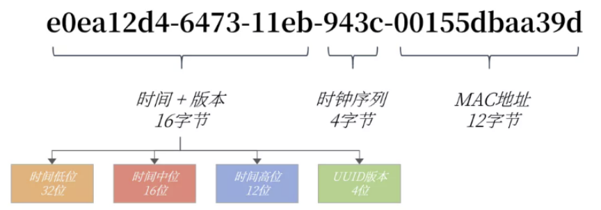

因为UUID的设计中，将时间低位放在最前面，而这部分的数据是一直在变化的，并且是无序。所以建议使用改进的UUID。

**改造UUID**

若将时间高低位互换，则时间就是单调递增的了，也就变得单调递增了。MySQL 8.0可以更换时间低位和时间高位的存储方式，这样UUID就是有序的UUID了。

MySQL 8.0还解决了UUID存在的空间占用的问题，除去了UUID字符串中无意义的"-"字符串，并且将字符串用二进制类型保存，这样存储空间降低为了16字节。

可以通过MySQL8.0提供的uuid_to_bin函数实现上述功能，同样的，MySQL也提供了bin_to_uuid函数进行转化：

```
SET @uuid = UUID();
SELECT @uuid,uuid_to_bin(@uuid),uuid_to_bin(@uuid,TRUE);
```

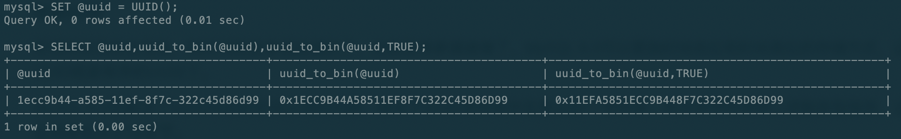


