# 高级-事务

## 基础知识

目前的存储引擎中，只有innodb才支持事物。

### 概念

**事务：**一组逻辑操作单元，使数据从一种状态变换到另一种状态。

**事务处理的原则：**保证所有事务都作为`一个工作单元`来执行，即使出现了故障，都不能改变这种执行方式。当在一个事务中执行多个操作时，要么事务中所有操作都被提交(`commit`)，那么这些修改就`永久`地保存下来；要么数据库管理系统将`放弃`所作的所有`修改`，整个事务回滚(`rollback`)到最初状态。


### 特性

- 原子性 atomicity：

原子性是指事务是一个不可分割的工作单位，要么全部提交，要么全部失败回滚。

- 一致性 consistency：

一致性是指事务执行前后，数据从一个`合法状态`便换到另外一个`合法状态`。也就是数据状态变化前后的数据是保持一致的。

- 隔离性 isolation：

隔离性是指一个事务的执行不被其他事务干扰，即一个事务内部的操作及使用的数据对并发的其他事务是隔离的。

- 持久性 durablity：

持久性是指一个事务一旦被提交，他对数据库中数据的改变就是永久的。

持久性是通过事务日志来保证的，日志包括重做日志和回滚日志。当通过事务对数据进行修改的时候，首先会将数据库的变化信息记录到重做日志中，然后在对数据库中对应的进行修改。即使数据库系统奔溃，数据库重启之后也能根据重做日志重新执行，从而使事务具有持久性。

> 原子性是基础，隔离性是手段，一致性是约束条件，持久性是目的。


### 状态

MySQL根据操作所执行的不同阶段把事务分为几个状态：

- **活动的（active）**

事务对应的数据库操作正在执行过程中。

- **部分提交的（partially committed）**

当事务中的最后一个操作执行完成，但由于操作都在内存中执行，所造成的影响并没有刷新到磁盘时，就说事务处在部分提交状态。

- **失败的（failed）**

当事务处在活动的或者部分提交的状态时，可能遇到了某些错误（数据库自身的错误、操作系统错误或者断电等等）而无法继续执行，或者人为的停止当前事务的执行，就说该事务处在失败状态。

- **中止的（aborted）**

如果事务执行了一部分而变成失败的状态，那么需要将已经修改的事务中的操作还原到事务执行前状态。也就是要撤销失败事务对当前数据库造成的影响，这个撤销的过程叫做回滚，当回滚完毕后，说该事物处在中止状态。

- **提交的（committed）**

当一个处在部分提交状态的事务将修改过的数据都同步到磁盘之后，说该事务处在提交状态。

基本的状态转换图如下：

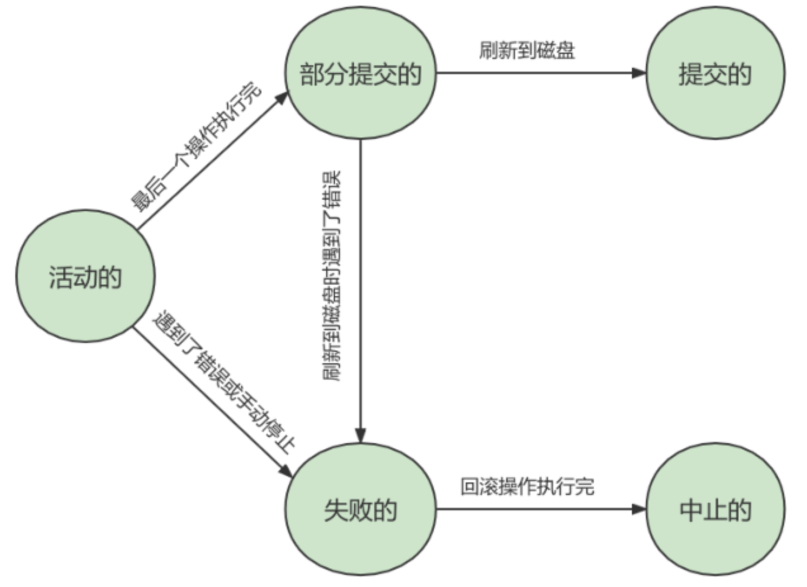


## 使用事务

使用事务分为两种方式：显示事务和隐式事务。

### 显式事务

**步骤1：开启事务**

```mysql
BEGIN; // or
START TRANSACTION;
```

`START TRANSACTION;`相较于`BEGIN`特别之处在于，后面可以跟几个修饰符。

read only：标识当前事务是个只读事务，也就是该事务中的操作只能读取数据，不能修改数据。

> 只读事务只是不允许修改那些其他事务也能访问到的数据，对于临时表来说（create temporary table），只能在当前会话中可见，只读事务其实是可以对临时表进行增删改操作的。

read write（默认）：标识当前事务是一个读写事务，

with consistent snapshot：启动一致性读

比如：

```mysql
START TRANSACTION READ ONLY; #开启一个只读事务
START TRANSACTION READ ONLY,WITH CONSISTENT SNAPSHOT; #开启只读事务和一致性读
START TRANSACTION READ WRITE，WITH CONSISTENT SNAPSHOT #开启读写事务和一致性读
```

**步骤2：一系列操作**

一般是DML，不可能是DDL，因为DDL语句会自动把之前的语句作为一个transaction直接提交。

**步骤3：提交事务或者回滚事务**

```mysql
commit; # or
rollback; # or
# 或者回滚到某个保存点
rollback to [savepoint];
# 创建保存点
savepoint xxx;
# 删除保存点
release savepoint xxx;
```


### 隐式事务

```mysql
mysql> show variables like 'autocommit';
+---------------+-------+
| Variable_name | Value |
+---------------+-------+
| autocommit    | ON    |
+---------------+-------+
```

aotucommit默认是开启状态，在此状态下的每条DML语句都是一个独立的事务。

> 注意：显示的使用begin等开启一个事务，那么在commit之前，autocommit是不会生效的。


### 隐式提交数据

- 数据定义语言DDL
  - 当使用create、alter、drop等语句去修改数据库对象（数据库，表，视图，存储过程）时，就会隐式提交前面语句所属于的事务。

- 隐式使用或修改mysql数据库中的表
  - 当使用alter user、create user、drop user、grant、rename user、revoke、set password等语句时也会隐式的提交前面语句所属的事务。

- 事务控制或关于锁定的语句

  - 当在一个事务还没提交或者回滚时就又使用start transaction或者begin语句开启另一个事务，会隐式的提交上一个事务。

  - 当前的autocommit变量为off，手动调为on时，也会隐式的提交前面语句所属的事务

  - 使用lock tables、unlock tables等关于锁定的语句也会隐式的提交前面语句所属的事务。

- 加载数据的语句
  - 使用load data语句来批量往数据库中导入数据时，也会隐式提交前面语句所属的事务。

还有一些其他的语句也会涉及隐式提交。


### completion.type

completion.type参数会影响事务的行为。

1. `completion.type=0`，这是 `默认情况`。当执行COMMIT的时候会提交事务，在执行下一个事务时，还需要使用 `START TRANSACTION` 或者 `BEGIN` 来开启。
2. `completion.type=1`，这种情况下，当提交事务后，相当于执行了COMMIT AND CHAIN，也就是开启一个链式事务，即当提交事务之后会开启一个相同隔离级别的事务。所以之后执行的语句需要再一次commit才会提交。然后又开启一个事务，套娃了。
3. `completion.type=2`，这种情况下 `CONMIT=COMMIT AND RELEASE`，也就是当我们提交后，会自动与服务器断开连接。


## 事务隔离级别

mysql是一个客户端/服务端架构的软件，对于同一个服务器来说，可以有若干客户端与之连接，没个客户端与服务器连接上之后，就可以称为一个会话session，没个客户端都可以在自己的会话中向服务器发出请求语句，一个请求语句可能是某个事物的一部分，也就是说对于服务器而言可能同时处理多个事务。因此事务的隔离性和同时处理多事务的性能需要权衡。


### 数据并发问题

#### 脏写（修改丢失）

对于两个事务 Session A、Session B，如果事务Session A`修改了`另一个`未提交`事务Session B`修改过`的数据，那就意味着发生了`脏写`，也就是session B的修改丢失了。

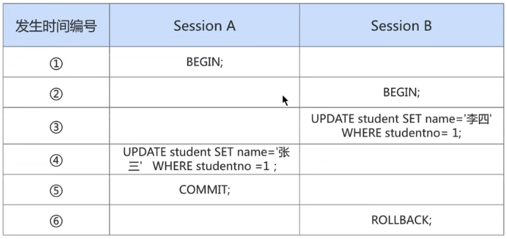


#### 脏读

对于两个事务 Session A、Session B，Session A`读取`了已经被 Session B`更新`但还`没有被提交`的字段。之后若 Session B`回滚`，Session A`读取`的内容就是`临时且无效`的。

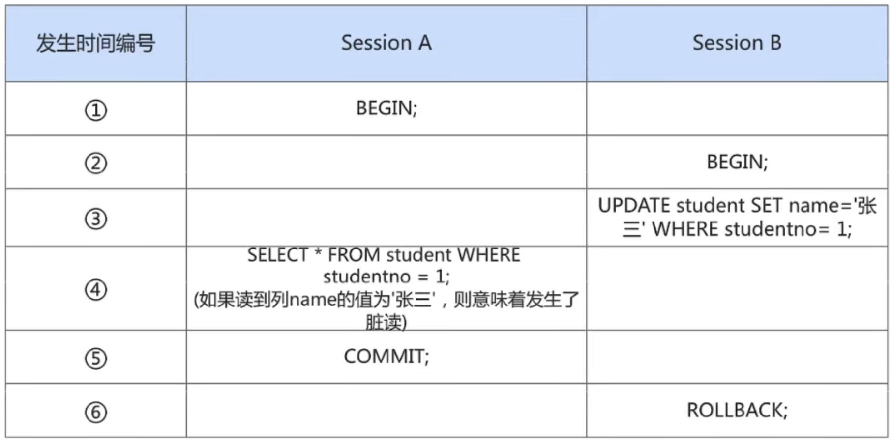


#### 不可重复读

对于两个事务Session A、Session B，Session A`读取`了一个字段，然后 Session B`更新`了该字段`且commit`。 之后Session A`再次读取`同一个字段，`值就不同`了。那就意味着发生了不可重复读。

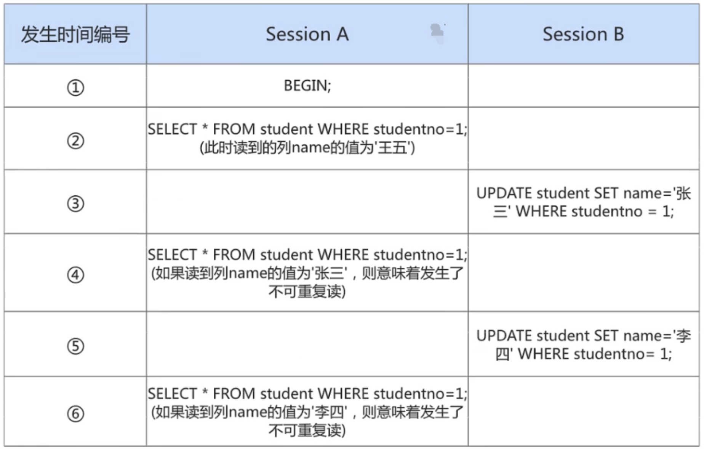


#### 幻读phantom

对于两个事务Session A、Session B, Session A 从一个表中`读取`了一个字段, 然后 Session B 在该表中`插入`了一些新的行。 之后, 如果 Session A`再次读取`同一个表, 就会多出几行。那就意味着发生了幻读。

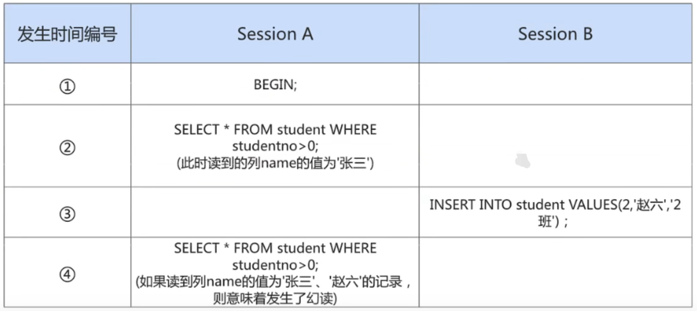

> 注意:
>
> 如果Session B中`剔除了`一些符合`studentno > 0`的记录而不是插入新记录，那么Session A之后再根据`studentno > 0`的条件读取的`记录变少了`，这种现象算不算`幻读`呢？这种现象`不属于幻读`，幻读强调的是一个事物按照某个`相同条件多次读取`记录时，后读取时读到了之前`没有读到的记录`。那对于先前已经读到的记录，之后又读取不到这种情况，算啥呢？这相当于对每一条记录都发生了`不可重复读`的现象。


### 隔离级别

任何隔离级别都可以杜绝脏写。

- 读未提交
  - read uncommited：在该隔离级别，允许事务读取未被其他事务提交的变更。脏读，不可重复读，幻读都会出现。

- 读已提交
  - read commited：只允许事务读取已被其他事务提交的变更，可以避免脏读，不可重复读和幻读会出现。

- 可重复读
  - repeatable read：确保事务可以多次从一个字段读取相同的值，在这个事务持续期间，禁止其他事务对这个字段进行更新。可以避免脏读和不可重复读，幻读仍然存在。

- 串行化
  - serializable：确保事务可以从一个表中读取相同的行，在这个事务持续期间，禁止其他事务对该表执行插入、更新和删除操作，所有并发问题都能避免，但性能十分低下。


```mysql
# mysql8默认级别：
mysql> show variables like 'transaction_isolation';
+-----------------------+-----------------+
| Variable_name         | Value           |
+-----------------------+-----------------+
| transaction_isolation | REPEATABLE-READ |
+-----------------------+-----------------+
```


## 常见事务分类

从事务理论的角度来看，可以把事务分为以下几种类型：

- 扁平事务（Flat Transactions）
- 带有保存点的扁平事务（Flat Transactions with Savepoints）
- 链事务（Chained Transactions）
- 嵌套事务（Nested Transactions）
- 分布式事务（Distributed Transactions）


**1、扁平事务：**

事务类型中最简单的一种，也是在实际生产环境中使用最频繁的一种，在扁平事务中，所有操作都处于同一层次，其由BEGIN开始，COMMIT或ROLLBACK结束，其间的操作是原子的，要么都执行，要么都回滚，因此，扁平事务是应用程序成为原子操作的基本组成模块。

**2、带有保存点的扁平事务：**

除了支持扁平事务支持的操作外，还允许在事务执行过程中回滚到同一事务中较早的一个状态。

**3、链事务：**

是指一个事务由多个子事务链式组成，他可以被视为保存点模式的一种变种。带有保存点的扁平事务，当发生系统崩溃时，所有的保存点都将消失，这意味着当进行恢复，事务需要从开始处重新执行，而不能从最近的一个保存点继续执行。链事务的思想是：提交一个事务时，释放不需要的数据对象，将必须要的处理上下文隐式的传给下一个要开始的事务，前一个子事务的提交操作和下一个子事务的开始操作合并成为一个原子操作，这意味着下一个事务将看到上一个事务的结果，就好像在一个事务中进行一样。这样，在提交子事务时就可以释放不需要的数据对象，而不必等到整个事务完成后才释放。

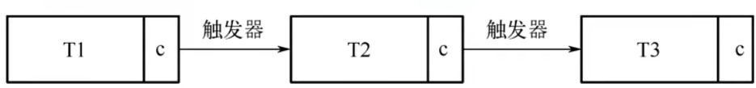

链事务与带有保存点的扁平事务的不同之处体现在：

带有保存点的扁平事务能回滚到任意准确的保存点，而链事务中的回滚仅限于当前事务，即只能恢复到最近的一个保存点；对于锁的处理，链事务在执行commit后即释放了当前所持有的锁，而带有保存点的扁平事务不影响迄今为止所持有的锁。

**4、嵌套事务：**

是一个层次结构框架，有一个顶层事务控制着各个层次的事务，顶层事务之下嵌套的事务被称为子事务，其控制着每一个局部的变换，子事务本身也可以是嵌套事务。

**5、分布式事务：**

通常是在一个分布式环境下运行的扁平事务，因此，需要根据数据所在位置访问网络中不同节点的数据库资源。例如不同银行之间的转账，就需要用到分布式事务，不能仅调用一家银行的数据库就完成任务。


## 事务日志

事务的四种特性如何实现的？

- 事务的隔离性由锁机制实现。
- 事务的原子性、一致性和持久性由事务的redo日志和undo日志来保证。
  - redo log称为重做日志，提供再写入操作，恢复提交事务修改的页操作，用来保证事务的持久性。
  - undo log称为回滚日志，回滚记录行到某个特定版本，用来保证事务的原子性和一致性。

有的DBA或许会认为UNDO是REDO的逆过程，其实不然。REDO和UNDO都可以视为是一种 `恢复操作`，但是：

- redo log：是存储引擎层(innodb)生成的日志，记录的是"`物理级别`"上的页修改操作，比如页号xx、偏移量yyy写入了'zzz'数据。主要为了保证数据的可靠性;
- undo log：是存储引擎层(innodb)生成的日志，记录的是 `逻辑操作` 日志，比如对某一行数据进行了INSERT语句操作，那么undo log就记录一条与之相反的DELETE操作。主要用于 `事务的回滚`(undo log记录的是每个修改操作的 `逆操作` )和 `一致性非锁定读`(undo log回滚行记录到某种特定的版本---MVCC，即多版本并发控制)。


### redo日志

#### 为啥需要

InnoDB存储引擎是以 `页为单位` 来管理存储空间的。在真正访问页面之前，需要把在 `磁盘` 上的页缓存到内存中的 `Buffer Pool` 之后才可以访问。所有的变更都必须先更新缓冲池中的数据，然后缓冲池中的 `脏页` 会以一定的频率被刷入磁盘（`checkPoint机制`），通过缓冲池来优化CPU和磁盘之间的鸿沟，这样就可以保证整体的性能不会下降太快。

然而由于checkpoint并不是每次变更的时候就触发的，而是master线程隔一段时间去处理的，就有可能造成数据丢失。而如果采取立马刷盘策略，也就是每个事务提交后，立马将他改变的数据刷盘，这样效率太低了。因此就有了日志记录。每次把数据的改动存起来，计算崩溃了，能恢复过来也可以。

**InnoDB引擎的事务采用了WAL技术(`Write-Ahead Logging` )，这种技术的思想就是 `先写日志，再写磁盘`，只有日志写入成功，才算事务提交成功，这里的日志就是redo log。当发生宕机且数据未刷到磁盘的时候，可以通过redo log来恢复，保证ACID中的D，这就是redo log的作用。**


#### 好处/特点

好处：

- redo日志降低了刷盘频率
- redo日志占用的空间非常小：存储表空间ID、页号、偏移量以及需要更新的值，所需的存储空间是很小的，刷盘快。

特点：

- redo日志是顺序写入磁盘的
  - 在执行事务的过程中，每执行一条语句，都可能产生若干条redo日志，这些日志是按照产生的顺序写入磁盘的，也就是顺序IO，效率比随机IO快。
- 事务执行过程中，redo log不断记录
  - redo log跟bin log的区别，redo log是存储引擎层产生的。而bin log是数据库层产生的。


#### 组成

redo log可以简单分为两个部分：重做日志的缓冲、重做日志文件。

> 重做日志缓冲：

redo log buffer保存在内存中，是易失的。

在服务器启动时就向操作系统申请了一大片称之为redo log buffer的连续内存空间，这片内存空间被划分为若干连续的redo log block。一个block占用512字节大小。

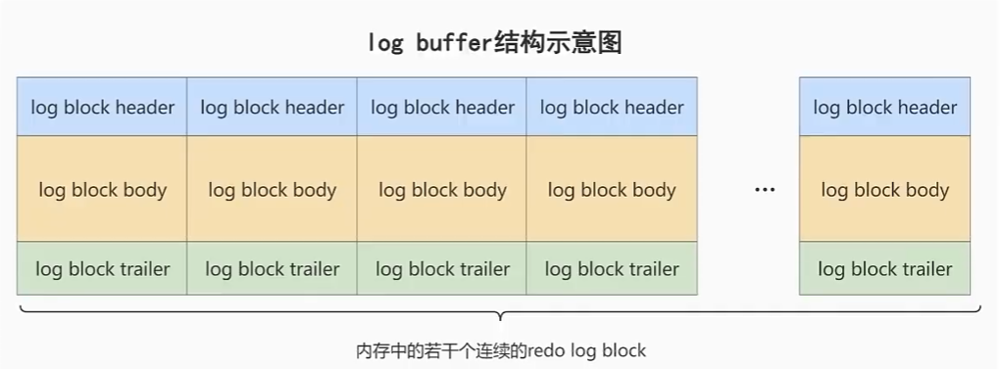

```mysql
mysql> show variables like '%innodb_log_buffer_size%';
+------------------------+----------+
| Variable_name          | Value    |
+------------------------+----------+
| innodb_log_buffer_size | 16777216 |
+------------------------+----------+
```

buffer大小默认是16M，最大4096M，最小1M。


> 重做日志文件

redo log file保存在硬盘中，是持久的。


#### 流程


第1步：先将原始数据从磁盘中读入内存中来，修改数据的内存拷贝

第2步：生成一条重做日志并写入redo log buffer，记录的是数据被修改后的值

第3步：当事务commit时，将redo log buffer中的内容刷新到 redo log file，对 redo log file采用追加写的方式

第4步：定期将内存中修改的数据刷新到磁盘中


#### 刷盘策略

redo log的写入并不是直接写入磁盘的，InnoDB引擎会在写redo log的时候先写redo log buffer，之后以 `一定的频率` 刷入到真正的redo log file 中。


> 注意：redo log buffer刷盘到redo log file的过程并不是真正的刷到磁盘中去，只是刷入到`文件系统缓存`（page cache）中去（这是现代操作系统为了提高文件写入效率做的一个优化），真正的写入会交给系统自己来决定（比如page cache足够大了）。那么对于InnoDB来说就存在一个问题，如果交给系统来同步，同样如果系统宕机，那么数据也丢失了（虽然整个系统宕机的概率还是比较小的）。

针对这种情况，InnoDB给出`innodb_flush_log_at_trx_commit`参数，该参数控制 commit提交事务时，如何将 redo log buffer 中的日志刷新到 redo log file 中。它支持三种策略：

- `设置为0`：表示每次事务提交时不进行刷盘操作。（系统默认master thread每隔1s进行一次重做日志的同步）
- `设置为1`：表示每次事务提交时都将进行同步，刷盘操作（`默认值`）
- `设置为2`：表示每次事务提交时都只把 redo log buffer 内容写入 page cache，不进行同步。由os自己决定什么时候同步到磁盘文件。

```mysql
mysql> show variables like 'innodb_flush_log_at_trx_commit';
+--------------------------------+-------+
| Variable_name                  | Value |
+--------------------------------+-------+
| innodb_flush_log_at_trx_commit | 1     |
+--------------------------------+-------+
```

另外，InnoDB存储引擎有一个后台线程，每隔1s，就会把redo log buffer中的内容写到文件系统缓存（page cache）中，然后调用刷盘操作。

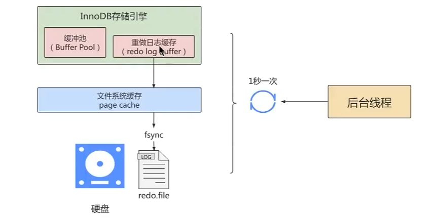

也就是说，一个没有提交事务的redo log记录们也可能会刷盘，因为在事务执行过程中redo log记录是会被写入redo log buffer中，这些redo log记录会被后台线程刷盘。


除了后台线程每秒1次的轮询操作，还有一种情况，当redo log buffer占用的空间即将达到innodb_log_buffer_size的一半时，后台线程也会主动刷盘。

```mysql
mysql> show variables like 'innodb_log_buffer_size';
+------------------------+----------+
| Variable_name          | Value    |
+------------------------+----------+
| innodb_log_buffer_size | 16777216 | # 16M
+------------------------+----------+
```


#### 刷盘策略演示


> 小结:
>
> innodb_flush_log_at_trx_commit=1
>
> 为1时，只要事务提交成功,`redo log`记录就一定在硬盘里，不会有任何数据丢失。
>
> 如果事务执行期间`MySQL`挂了或宕机，这部分日志丢了，但是事务并没有提交，所以日志丢了也不会有损失。可以保证ACID的D，数据绝对不会丢失，但是 `效率最差`的。
>
> 建议使用默认值，虽然操作系统宕机的概率理论小于数据库宕机的概率，但是一般既然使用了事务，那么数据的安全相对来说更重要些。


> 小结innodb_flush_log_at_trx_commit=2
>
> 为2时，只要事务提交成功,redo log buffer中的内容只写入文件系统缓存（ page cache )。
>
> 如果仅仅只是MySQL挂了不会有任何数据丢失，但是操作系统宕机可能会有1秒数据的丢失，这种情况下无法满足ACID中的D。但是数值2肯定是效率最高的。


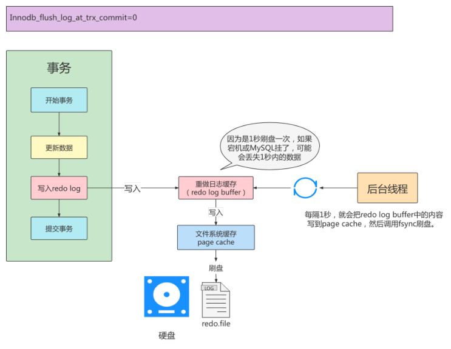

> 小结: innodb_flush_log_at_trx_commit=0
>
> 为0时,master thread中每1秒进行一次重做日志的fsync操作，因此实例crash最多丢失1秒钟内的事务。(master thread是负责将缓冲池中的数据异步刷新到磁盘，保证数据的一致性)
>
> innodb_flush_log_at_trx_commit=0的话，是一种折中的做法，它的IO效率理论是高于1的，低于2的，这种策略也有丢失数据的风险，也无法保证D。


#### 写入buffer过程

Mini-Transaction：MySQL把对底层页面中的一次原子访问的过程称之为一个`Mini-Transaction`，简称`mtr`，比如像某个索引对应的B+Tree中插入一条记录的过程就是一个mtr，一个所谓的mtr可以包含一组redo日志（修改一次B+Tree可能修改多个物理位置），在进行奔溃恢复时，这一组redo日志作为一个不可分割的整体。

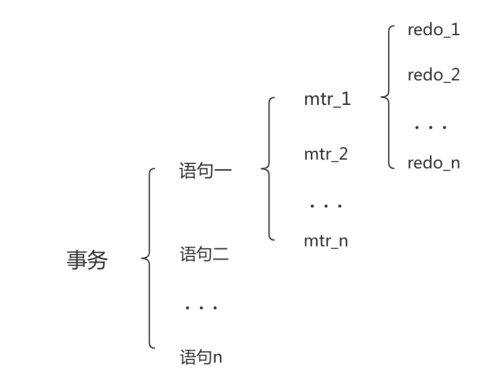


**redo日志写入log buffer**

向`log buffer`中写入redo日志的过程是顺序的，也就是先往前边的block中写，当该block的空闲空间用完之后再往下一个blcok中写。有一个`buf_free`来记录当前偏移量。


一个mtr过程可能产生若干条redo日志，这些redo日志是一个不可分割的组，所以其实并不是每生成一条redo日志，就将其插入到log buffer中，而是每个mtr运行过程中产生的日志先暂时存放到一个地方，当该mtr结束的时候，将该过程中产生的一组redo日志再全部复制到log buffer中。比如有如下例子：


那么最终他可能写入的结果如下：

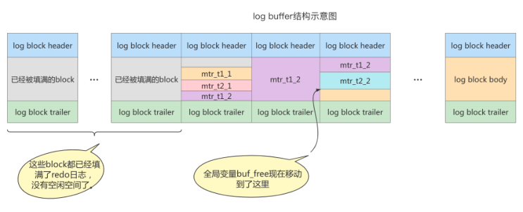


**redo log block结构图**

一个redo log block是由 `日志头`、`日志体`、`日志尾组成`。日志头占用12字节，日志尾占用8字节，所以一个block真正能存储的数据就是512-12-4=496字节。

> `为什么一个block设计成512字节?`
> 这个和磁盘的扇区有关，机械磁盘默认的扇区就是512字节，如果要写入的数据大于512字节，那么要写入的扇区肯定不止一个，这时就要涉及到盘片的转动，找到下一个扇区，假设现在需要写入两个扇区A和B，如果扇区A写入成功，而扇区B写入失败，那么就会出现 `非原子性`的写入，而如果每次只写入和扇区的大小一样的512字节，那么每次的写入都是原子性的。


#### log file

网上一些教程的逻辑已经不是最新的方案了

从 MySQL 8.0.30 开始，redo log 文件被组织在一个专用的子目录 `#innodb_redo` 下。

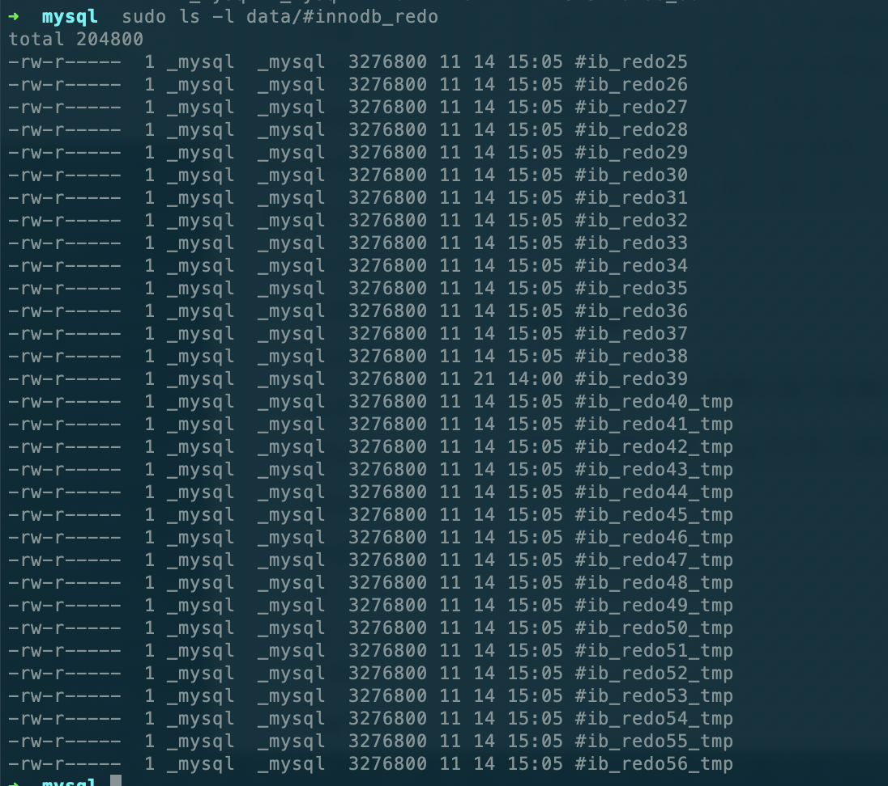

**多文件存储**：从 MySQL 8.0.30 开始，redo log 默认存储在 #innodb_redo 子目录中，文件被分片存储，而不是原先单一或双文件（ib_logfile0, ib_logfile1）。

**循环写入**：redo log 文件以循环方式写入。当一个文件写满时，切换到下一个文件，依次循环。

很奇怪查innodb_log_files_in_group这个又是2，按道理不应该啊。算了。


### Undo日志

**redo log是事务持久性的保证，undo log是事务原子性的保证**。在事务中更新数据的前置操作其实是要先写入一个undo log。


#### 理解

事务需要保证`原子性`，也就是事务中的操作要么全部完成，要么什么也不做。但有时候事务执行到一半会出现一些情况，比如：

- 情况一：事务执行过程中可能遇到各种错误，比如`服务器本身的错误`，`操作系统错误`，甚至是突然`断电`导致的错误。
- 情况二：程序员可以在事务执行过程中手动输入`ROLLBACK`语句结束当前事务的执行。

以上情况出现，需要把数据改回原先的样子，这个过程称之为`回滚`，这样就可以造成一个假象：这个事务看起来什么都没做，所以符合`原子性`要求。

每当要对一条记录做改动时(这里的 `改动` 可以指`INSERT`、`DELETE`、`UPDATE` )，都需要"留一手"——把回滚时所需的东西记下来。比如：

- `插入一条记录时`，至少要把这条记录的主键值记下来，之后回滚的时候只需要把这个主键值对应的记录删掉就好了。(对于每个INSERT，InnoDB存储引擎会完成一个DELETE)
- `删除了一条记录`，至少要把这条记录中的内容都记下来，这样之后回滚时再把由这些内容组成的记录插入到表中就好了。(对于每个DELETE，InnoDB存储引擎会执行一个INSERT)
- `修改了一条记录`，至少要把修改这条记录前的旧值都记录下来，这样之后回滚时再把这条记录更新为旧值就好了。(对于每个UPDATE，InnoDB存储引擎会执行一个相反的UPDATE，将修改前的行放回去)

MySQL把这些为了回滚而记录的这些内容称之为 `撤销日志` 或者 `回滚日志`(即undo log )。注意，由于查询操作( `SELECT`）并不会修改任何用户记录，所以在查询操作执行时，`并不需要记录` 相应的undo日志。

此外，undo log `会产生redo log`，也就是undo log的产生会伴随着redo log的产生，这是因为undo log也需要持久性的保护。


#### 作用

- **作用1：回滚数据**

  用户对undo日志可能 `有误解`：undo用于将数据库物理地恢复到执行语句或事务之前的样子。但事实并非如此。undo是 `逻辑日志`，因此只是将数据库逻辑地恢复到原来的样子。所有修改都被逻辑地取消了，但是数据结构和页本身在回滚之后可能大不相同。

  这是因为在多用户并发系统中，可能会有数十、数百甚至数千个并发事务。数据库的主要任务就是协调对数据记录的并发访问。比如，一个事务在修改当前一个页中某几条记录，同时还有别的事务在对同一个页中另几条记录进行修改。因此，不能将一个页回滚到事务开始的样子，因为这样会影响其他事务正在进行的工作。

- **作用2：MVCC（后面再说）**

  undo的另一个作用是MVCC，即在InnoDB存储引擎中MVCC的实现是通过undo来完成。当用户读取一行记录时，若该记录已经被其他事务占用，当前事务可以通过undo读取之前的行版本信息，以此实现非锁定读取。


#### 存储结构

**回滚段与undo页**

InnoDB对undo log的管理采用段的方式，也就是`回滚段（rollback segment）`。每个回滚段记录了`1024`个`undo log segment`，而在每个undo log segment段中进行`undo页`的申请。

- `innodb_undo_direclory`：设置rollback segment文件所在的路径。这意味着rollback segment可以存放在共享表空间以外的位置，即可以设置为独立表空间。该参数的默认值为"./"，表示当前InnoDB存储引擎的目录。
- `innodb_undo_tablespaces` :设置构成rollback segment文件的数量，默认为2，这样rollback segment可以较为平均地分布在多个文件中。设置该参数后，会在路径innodb_undo_directory看到undo为前缀的文件，该文件就代表rollback segment文件。

```shell
-rw-r-----    1 _mysql  _mysql   33554432 11 21 13:57 undo_001
-rw-r-----    1 _mysql  _mysql   16777216 11 21 13:54 undo_002
```

这里还有一些如何记录的东西，什么undo页的重用，purge线程清理undo页等，这些教程没写清楚，后面再说吧


#### undo的类型

在InnoDB存储引擎中，undo log分为：

- insert undo log

  insert undo log是指在insert操作中产生的undo log。因为insert操作的记录，只对事务本身可见，对其他事务不可见(这是事务隔离性的要求)，故**该undo log可以在事务提交后直接删除**。不需要进行purge操作。

- update undo log

  update undo log记录的是对delete和update操作产生的undo log。该undo log可能需要提供MVCC机制，因此不能在事务提交时就进行删除。**提交时放入undo log链表，等待purge线程进行最后的删除**。

> 补充: purge线程两个主要作用是: `清理undo页` 和 `清除page里面带有Delete_Bit标识的数据行`。在InnoDB中，事务中的Delete操作实际上并不是真正的删除掉数据行，而是一种Delete Mark操作，在记录上标识Delete_Bit，而不删除记录。是一种"假删除";只是做了个标记，真正的删除工作需要后台purge线程去完成。


#### 详细举例

对于InnoDB引擎来说，每个行记录除了记录本身的数据之外，还有几个隐藏的列:

- `DB_ROW_ID`：如果没有为表显式的定义主键，并且表中也没有定义唯一索引，那么InnoDB会自动为表添加一个row_id的隐藏列作为主键。
- `DB_TRX_ID`：每个事务都会分配一个事务ID，当对某条记录发生变更时，就会将这个事务的事务ID写入trx_id中。
- `DB_ROLL_PTR`：回滚指针，本质上就是指向undo log的指针。


**1、执行INSERT时：**

```sql
begin; 
INSERT INTO user (name) VALUES ("tom");
```

插入的数据都会生成一条insert undo log，并且数据的回滚指针会指向它。undo log会记录undo log的序号、插入主键的列和值...，那么在进行rollback的时候，通过主键直接把对应的数据删除即可。

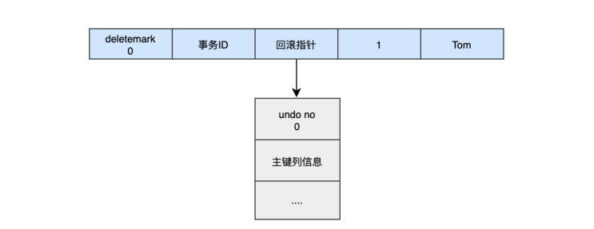

**2、再执行update**

对于更新的操作会产生update undo log，并且会分更新主键的和不更新主键的，假设现在执行:

```sql
UPDATE user SET name="sun" WHERE id=1;
```

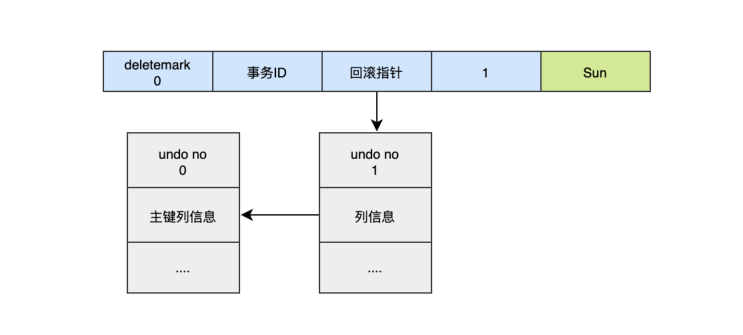

这时会把老的记录写入新的undo log，让回滚指针指向新的undo log，它的undo no是1，并且新的undo log会指向老的undo log (undo no=0)。


**3、再执行update id**

```sql
UPDATE user SET id=2 WHERE id=1;
```


对于更新主键的操作，会先把原来的数据deletemark标识打开，这时并没有真正的删除数据，真正的删除会交给清理线程去判断，然后在后面插入一条新的数据，新的数据也会产生undo log，并且undo log的序号会递增。可以发现每次对数据的变更都会产生一个undo log，当一条记录被变更多次时，那么就会产生多条undo log，undo log记录的是变更前的日志，并且每个undo log的序号是递增的，那么当要回滚的时候，按照序号 `依次向前推`，就可以找到我们的原始数据了。


**4、执行回滚：**

以上面的例子来说，假设执行rollback，那么对应的流程应该是这样：

1. 通过undo no=3的日志把id=2的数据删除
2. 通过undo no=2的日志把id=1的数据的deletemark还原成0
3. 通过undo no=1的日志把id=1的数据的name还原成Tom
4. 通过undo no=0的日志把id=1的数据删除


### 执行流程

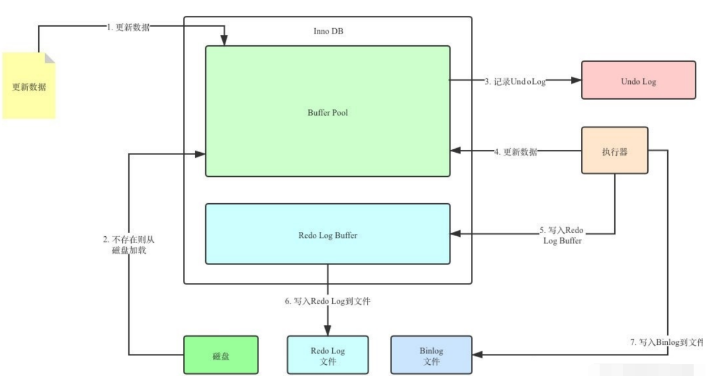

