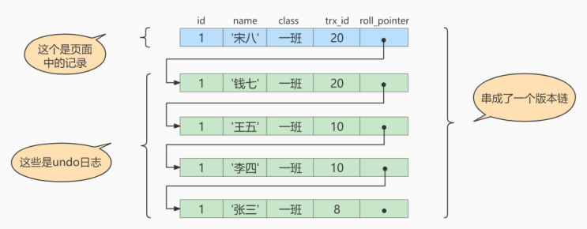
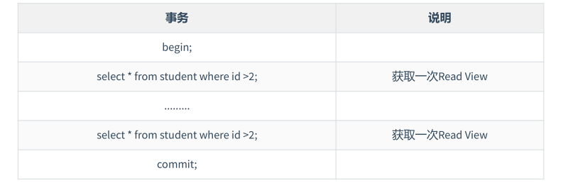

# MVCC

MVCC （Multiversion Concurrency Control），多版本并发控制。顾名思义，MVCC 是通过数据行的多个版本管理来实现数据库的`并发控制`。这项技术使得在InnoDB的事务隔离级别下执行`一致性读`操作有了保证。换言之，就是为了查询一些正在被另一个事务更新的行，可以看到它们被更新之前的值，这样在做查询的时候就不用等待另一个事务释放锁。

MVCC 没有正式的标准，在不同的DBMS中MCC的实现方式可能是不同的，也不是普遍使用的。

在`MySQL` 中，默认的隔离级别是 `可重复读`，可以解决`脏读`和`不可重复读`的问题，如果仅从定义的角度来看，它并不能解决幻读问题。但是！`MVCC`可以不采用锁机制，而是通过乐观锁的方式来解决不可重复读和`幻读`问题。

MVCC 的实现依赖于：**`隐藏字段(trx_id、roll_pointer)`、`Undo Log`、`ReadView`** 。


## 快照读和当前读

MVCC在MySQL InnoDB中的实现主要是为了提高数据库并发性能，用更好的方式去处理`读-写冲突`，做到即使有读写冲突时，也能做到`不加锁，非阻塞并发读`，而这个读指的就是`快照读`, 而非`当前读`。当前读实际上是一种加锁的操作，是悲观锁的实现。而MVCC本质是采用乐观锁思想的一种方式。

### 快照读

快照读又叫一致性读，读取的是快照数据。不加锁的简单的select都属于快照读，即不加锁的非阻塞读。

之所以出现快照读，是基于提高并发性能的考虑，基于MVCC实现，在很多情况下避免了加锁操作，降低了开销。

既然是基于多版本，那么快照读可能读到的不一定是数据的最新版本，而是之前的历史版本。快照读的前提是隔离级别不是串行化，否则会退化为当前读。

### 当前读

当前读读取的是记录的最新版本，读取时，还要保证其他并发事务不能修改当前记录，会对读取的记录进行加锁。如：

```mysql
SELECT * FROM student LOCK IN SHARE MODE;  # 共享锁
SELECT * FROM student FOR UPDATE; # 排他锁
INSERT INTO student values ...  # 排他锁
DELETE FROM student WHERE ...  # 排他锁
UPDATE student SET ...  # 排他锁
```


## 隐藏字段

对于使用`InnoDB`存储引擎的表来说，它的聚簇索引记录中都包含两个必要的隐藏列。

- `trx_id`：每次一个事务对某条聚簇索引记录进行改动时，都会把该事务的`事务id`赋值给 `trx_id` 隐藏列。
- `roll_pointer`：每次对某条聚簇索引记录进行改动时，都会把旧的版本写入到 `undo日志`中，然后这个隐藏列就相当于一个指针，可以通过它来找到该记录修改前的信息。

> undo只在事务回滚时起作用，当事务提交后，该类型的undo日志就没用了，它占用的Undo Log Segment也会被系统回收（也就是该undo日志占用的Undo页面链表要么被重用，要么被释放）。


## Undo版本链

对记录每次更新后，都会将旧值放到一条 `undo日志` 中，就算是记录的一个旧版本，随着更新次数的增多，所有的版本都会被`roll_pointer` 属性连接成一个链表，把这个链表称之为 `版本链` ，版本链的头节点就是当前记录最新的值。如图：




## ReadView

在MVCC机制中，多个事务对同一个行记录进行更新会产生多个历史快照，这些历史快照保存在Undo Log里。如果一个事务想要查询这个行记录，需要读取哪个版本的行记录呢?这时就需要用到ReadView了，它帮我们解决了行的可见性问题。

ReadView就是事务在使用MVCC机制进行快照读操作时产生的读视图。


### 设计思路

使用`READ UNCOMMITTED`隔离级别的事务，由于可以读到未提交事务修改过的记录，所以直接读取记录的最新版本就好了。

使用`SERIALIZABLE`隔离级别的事务，InnoDB规定使用加锁的方式来访问记录。

使用`READ COMMITTED`和`REPEATABLE READ`隔离级别的事务，都必须保证读到`已经提交了的`事务修改过的记录。假如另一个事务已经修改了记录但是尚未提交，是不能直接读取最新版本的记录的，核心问题就是需要判断一下版本链中的哪个版本是当前事务可见的，这是ReadView要解决的主要问题。

这个ReadView中主要包含4个比较重要的内容，分别如下：

1. `creator_trx_id`，创建这个 Read View 的事务 ID。

> 说明：只有在对表中的记录做改动时（执行INSERT、DELETE、UPDATE这些语句时）才会为事务分配事务id，否则在一个只读事务中的事务id值都默认为0。

2. `trx_ids`，表示在生成ReadView时当前系统中活跃的读写事务的`事务id列表`。
3. `up_limit_id`，活跃的事务中最小的事务 ID。
4. `low_limit_id`，表示生成ReadView时系统中应该分配给下一个事务的`id`值。low_limit_id 是系统最大的事务id值，这里要注意是系统中的事务id，需要区别于正在活跃的事务ID。

> 注意：low_limit_id并不是trx_ids中的最大值，事务id是递增分配的。比如，现在有id为1， 2，3这三个事务，之后id为3的事务提交了。那么一个新的读事务在生成ReadView时，trx_ids就包括1和2，up_limit_id的值就是1，low_limit_id的值就是4。


### 规则

有了这个ReadView，这样在访问某条记录时，只需要按照下边的步骤判断记录的某个版本是否可见。

- 如果被访问版本的trx_id属性值与ReadView中的`creator_trx_id`值相同，意味着当前事务在访问它自己修改过的记录，所以该版本可以被当前事务访问。
- 如果被访问版本的trx_id属性值小于ReadView中的`up_limit_id`值，表明生成该版本的事务在当前事务生成ReadView前已经提交，所以该版本可以被当前事务访问。
- 如果被访问版本的trx_id属性值大于或等于ReadView中的`low_limit_id`值，表明生成该版本的事务在当前事务生成ReadView后才开启，所以该版本不可以被当前事务访问。
- 如果被访问版本的trx_id属性值在ReadView的`up_limit_id`和`low_limit_id`之间，那就需要判断一下trx_id属性值是不是在 trx_ids 列表中。
  - 如果在，说明创建ReadView时生成该版本的事务还是活跃的，该版本不可以被访问。
  - 如果不在，说明创建ReadView时生成该版本的事务已经被提交，该版本可以被访问。


### 操作流程

当查询一条记录的时候，系统如何通过MVCC找到它：

1. 首先获取事务自己的版本号，也就是事务 ID；
2. 获取 ReadView；
3. 查询数据，然后与 ReadView 中的事务版本号进行比较；
4. 如果不符合 ReadView 规则，就需要从 Undo Log 中获取历史快照；
5. 最后返回符合规则的数据。

如果某个版本的数据对当前事务不可见的话，那就顺着版本链找到下一个版本的数据，继续按照上边的步骤判断可见性，依此类推，直到版本链中的最后一个版本。如果最后一个版本也不可见的话，那么就意味着该条记录对该事务完全不可见，查询结果就不包含该记录。


> InnoDB中，MVCC是通过Undo Log + Read View进行数据读取，Undo Log保存了历史快照，而Read View规则帮助判断当前版本的数据是否可见。

在隔离级别为`读已提交（Read Committed）时`，一个事务中的`每一次 SELECT 查询都会重新获取一次Read View`。

如表所示：



> 注意，此时同样的查询语句都会重新获取一次 Read View，这时如果 Read View 不同，就可能产生不可重复读或者幻读的情况。

当隔离级别为`可重复读`的时候，就避免了不可重复读，这是因为一个事务只在`第一次 SELECT 的时候会获取一次 Read View`，而后面所有的 SELECT 都会复用这个 Read View，如下表所示：


> [!IMPORTANT]
>
> 注意这个时候也可以解决幻读中的读问题，就是别人新增了数据，你select是读不到的，这是由事务的id版本决定的。但是去update去写的话，这是通过锁来保证的。insert新增的数据是有一个锁的，这个事务没提交，其他事务是无法更新的。并且还有间隙锁来保证不能在间隙锁内插入数据。
>
> 举例，事务id保证幻读的读：
>
> 

### 总结

`MVCC`在`READ COMMITTD`、`REPEATABLE READ`这两种隔离级别的事务在执行快照读操作时访问记录的版本链的过程其实是一致的，都是寻着版本链查找。这样使不同事务的`读-写`、`写-读`操作并发执行，从而提升系统性能。

核心点在于 ReadView 的原理，`READ COMMITTD`、`REPEATABLE READ`这两个隔离级别的一个很大不同就是生成ReadView的时机不同：

- `READ COMMITTD`在每一次进行普通SELECT操作前都会生成一个ReadView
- `REPEATABLE READ`只在第一次进行普通SELECT操作前生成一个ReadView，之后的查询操作都重复使用这个ReadView就好了。

> 说明:之前说执行DELETE语句或者更新主键的UPDATE语句并不会立即把对应的记录完全从页面中删除,而是执行一个所谓的delete mark操作，相当于只是对记录打上了一个删除标志位，这主要就是为MVCC服务的。

通过MVCC 可以解决:

1. `读写之间阻塞的问题`。通过MVCC可以让读写互相不阻塞，即读不阻塞写，写不阻塞读，这样就可以提升事务并发处理能力。
2. `降低了死锁的概率`。这是因为MVCC采用了乐观锁的方式，读取数据时并不需要加锁，对于写操作，也只锁定必要的行。
3. `解决快照读的问题`。当查询数据库在某个时间点的快照时，只能看到这个时间点之前事务提交更新的结果，而不能看到这个时间点之后事务提交的更新结果。


> [!IMPORTANT]
>
> 虽然说MySQL解决并发问题的两种方式是锁机制和MVCC，但其实两者是合作起来工作的，并不冲突。MVCC主要保证一致性读，锁机制保证了写和隔离性等。

