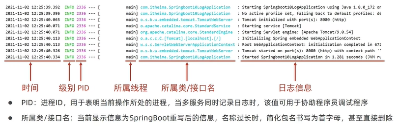
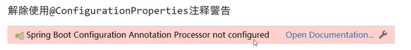
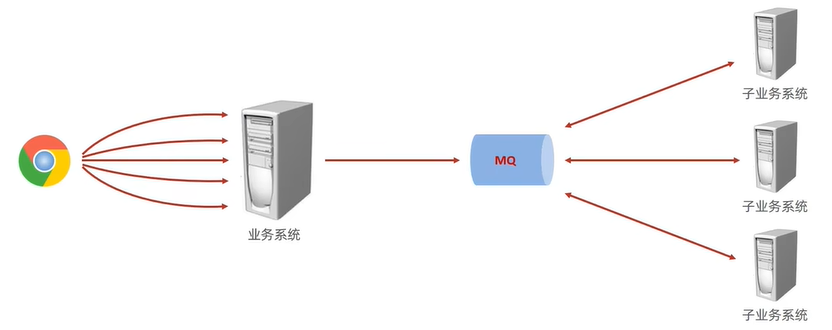
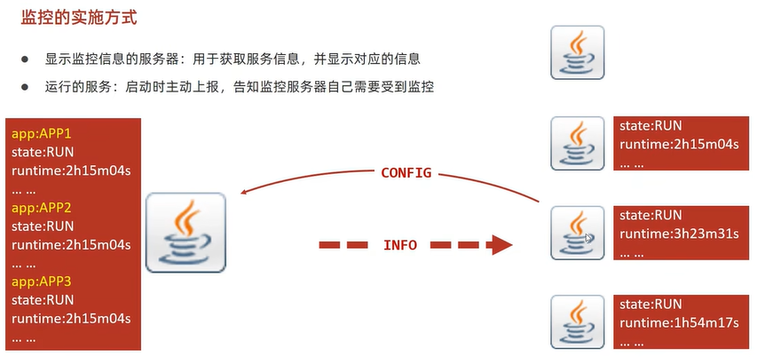
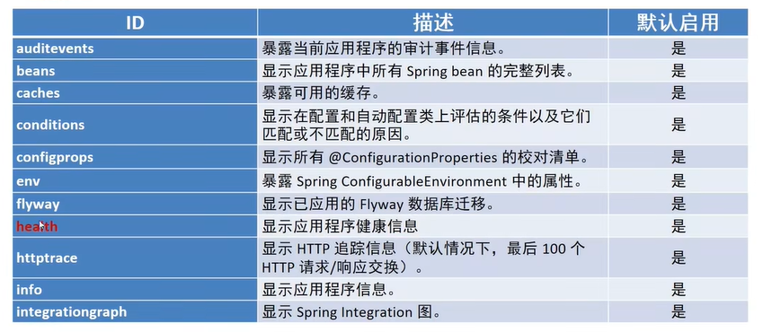
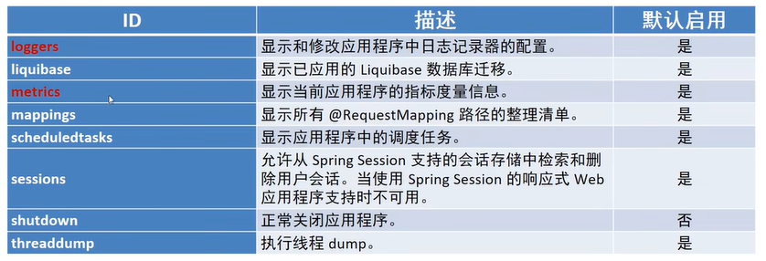
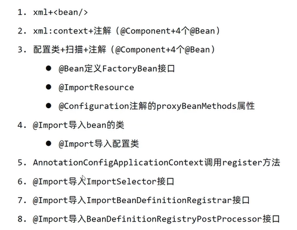
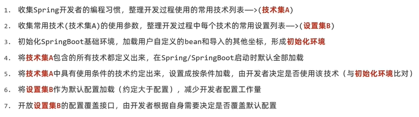
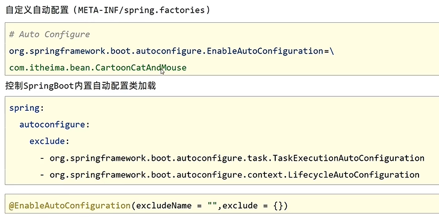

# SpringBoot


## 整合Mabatis-Plus

### 导入依赖

需要导入对应的starter

```xml
<dependency>
  <groupId>com.baomidou</groupId>
  <artifactId>mybatis-plus-boot-starter</artifactId>
  <version>3.4.2</version>
</dependency>
```

### 分页配置

在config包下，新建配置文件

```java
package xx.xx.config;

import com.baomidou.mybatisplus.extension.plugins.MybatisPlusInterceptor;
import com.baomidou.mybatisplus.extension.plugins.inner.PaginationInnerInterceptor;
import org.springframework.context.annotation.Bean;
import org.springframework.context.annotation.Configuration;

@Configuration // 记得加注解
public class MPConfig {
    @Bean // 自定义Bean
    public MybatisPlusInterceptor mybatisPlusInterceptor() {
        // 1、定义MP拦截器
        MybatisPlusInterceptor interceptor = new MybatisPlusInterceptor();
        // 2、添加具体的拦截器
        interceptor.addInnerInterceptor(new PaginationInnerInterceptor());
      	// 可以往下添加多个
        return interceptor;
    }
}
```

### 自定义配置

```yml
# 配置MP
mybatis-plus:
  global-config:
    db-config:
      table-prefix: tbl_ # 表的统一前缀
      id-type: auto # 表主键生成策略
  configuration:
    log-impl: org.apache.ibatis.logging.stdout.StdOutImpl # 日志
```


## Controller异常处理器

可以配置在controller的utils包下

```java
package xxx.xx.controller.utils;

import org.springframework.stereotype.Controller;
import org.springframework.web.bind.annotation.ControllerAdvice;
import org.springframework.web.bind.annotation.ExceptionHandler;
import org.springframework.web.bind.annotation.RestController;
import org.springframework.web.bind.annotation.RestControllerAdvice;

//@ControllerAdvice
@RestControllerAdvice
public class ProjectExceptionAdvice {
    // 拦截所有的异常信息,可以在注解里配置特定的异常，从而不同的处理逻辑
    @ExceptionHandler
    public R doException(Exception ex) {
        // 记录日志
        // 通知运维
        // 通知开发
        ex.printStackTrace();
        return new R("服务器故障，请稍后再试");
    }
}
```


## 配置文件优先级

SpringBoot中4级配置文件

- 1级: 打包后jar包目录 :config/application.yml【最高】
- 2级: 打包后jar包目录 :application.yml
- 3级: 项目目录 classpath:config/application.yml
- 4级: 项目目录 classpath:application.yml【最低】

作用

1级与2级留做系统打包后设置通用属性，1级常用于运维经理进行线上整体项目部署方案调控

3级与4级用于系统开发阶段设置通用属性，3级常用于项目经理进行整体项目属性调控

配置文件分为4种

- 项目类路径配置文件:服务于开发人员本机开发与测试
- 项目类路径config目录中配置文件:服务于项目经理整体调控
- 工程路径配置文件:服务于运维人员配置涉密线上环境
- 工程路径config目录中配置文件:服务于运维经理整体调控

> 多层级配置文件间的属性采用叠加并覆盖的形式作用于程序


## 多环境

### 单文件

yaml格式中设置多环境使用`---`区分环境设置边界

```yml
# 应用环境
# 公共配置
spring:
  profiles:
    active: dev
---
# 生产环境
spring:
  config:
    activate:
      on-profile: pro
server:
  port: 80
---
# 开发环境
spring:
  config:
    activate:
      on-profile: dev
server:
  port: 8080
---
# 测试环境
spring:
  config:
    activate:
      on-profile: test
server:
  port: 8888
```


### 多文件

`-` 后面就是环境名

```yml
# application.yml
# 公共配置
spring:
  profiles:
    active: dev
# application-pro.yml
server:
  port: 80
# application-dev.yml
server:
  port: 8080
# application-test.yml
server:
  port: 8888
```


### 独立功能配置

根据功能对配置文件中的信息进行拆分，并制作成独立的配置文件，命名规则如下

- application-devDB.yml
- application-devRedis.yml
- application-devMvc.yml

使用include属性在激活指定环境的情况下，同时对多个环境进行加载使其生效，多个环境间使用逗号分隔

```yml
#spring:
#  profiles:
#    active: dev
#    include: devDB, devMVC
# or
spring:
  profiles:
    active: dev
    group:
      "dev": devDB, devMVC
      "pro": proDB, proMVC
      "test": testDB, testMVC

# application-dev.yml
#server:
#  port: 80
# application-decMVC.yml
#server:
#  servlet:
#    context-path: /ebank
#  port: 82
```

### 多环境开发控制

可以使用maven来控制开发环境，在pom.xml中进行配置

```xml
<!--设置多环境-->
<profiles>
  <profile>
    <id>env_dev</id>
    <properties>
      <profile.active>dev</profile.active>
    </properties>
    <activation>
      <activeByDefault>true</activeByDefault>
    </activation>
  </profile>
  <profile>
    <id>env_pro</id>
    <properties>
      <profile.active>pro</profile.active>
    </properties>
  </profile>
  <profile>
    <id>env_test</id>
    <properties>
      <profile.active>test</profile.active>
    </properties>
  </profile>
</profiles>
```

```yml
spring:
  profiles:
    active: @profile.active@ # 打包后，将变成dev
    group:
      "dev": devDB, devMVC
      "pro": proDB, proMVC
      "test": testDB, TestMVC
```


## 日志

### 作用

编程期调试代码

运营期记录信息

- 记录日常运营重要信息(峰值流量、平均响应时长……)
- 记录应用报错信息(错误堆栈)
- 记录运维过程数据(扩容、宕机、报警……)

### 日志输出格式



### 使用默认日志

打印日志

```java
@RestController
@RequestMapping("/books")
public class BookController {
  private static final Logger log = LoggerFactory.getLogger(BookController.class);
  
  @GetMapping
  public string getById(){
    System.out.println("springboot is running...");
    Log.debug("debug ...");
    log.info("info ...");
    Log.warn("warn ...");
    Log.error("error ...");
    return "springboot is running...";
  }
}
```

设置日志输出级别

```yml
# 开启debug模式，输出调试信息，常用于检查系统运行状况,不推荐
# debug: true
#设置日志级别，root表示根节点，即整体应用日志级别
logging:
	level:
		root: debug
# 更多使用
logging:
  # 设置分组
  group:
    ebank: top.jacktgq.controller, top.jacktgq.service, top.jacktgq.mapper
    iservice: com.alibaba
  level:
    root: info
    # 设置某个包的日志级别
    # top.jacktgq.controller: debug
    # 设置分组，对组设置级别
    ebank: warn
  # 设置日志输出的模板格式
  pattern:
    # console: "%d - %m %n"
    # %d：日期时间
    # %p：日志级别
    # %5p：日志级别占5个字符
    # %clr：颜色
    # %16t：线程名占16个字符
    # %c：程序包名
    # %40c：程序包名占40位，默认居中
    # %-40c：程序报名占40位并且左对齐
    # %-40.40c：程序报名占40位并且左对齐，超过40的截掉
    # %clr(%-40.40c){cyan}：程序报名占40位并且左对齐，超过40的截掉，指定颜色为青色
    # %m：消息
    # %n：换行
    # console: "%d %clr(%5p) --- [%16t] %clr(%-40.40c){cyan} : %m %n"
  file:
    name: server.log
  logback:
    rollingpolicy:
      max-file-size: 4KB
      file-name-pattern: server.%d{yyyy-MM-dd}.%i.log
```

### 优化

可以使用lombok帮我们生成log对象，生成的对象名就叫`log`

```java
@slf4j
@RestController
@RequestMapping("/books")
public class BookController {
  @GetMapping
  public string getById(){
    System.out.println("springboot is running...");
    Log.debug("debug ...");
    log.info("info ...");
    Log.warn("warn ...");
    Log.error("error ...");
    return "springboot is running...";
  }
}
```


## 热部署

关于热部署

重启(Restart):自定义开发代码，包含类、页面、配置文件等，加载位置restart类加载器

重载(ReLoad):jar包，加载位置base类加载器

热部署仅仅加载当前开发者自定义开发的资源，不加载jar资源，也就是只执行重启，不执行重载

基本使用

1. 开启开发者工具后启用热部署，导入依赖

   ```xml
   <dependency>
     <groupId>org.springframework.boot</groupId>
     <artifactId>spring-boot-devtools</artifactId>
     <optional>true</optional>
   </dependency>
   ```

2. 使用构建项目操作启动热部署(Ctr1+F9)，重新build,不是重新run

如何启动自动热部署，[参考](https://blog.csdn.net/weixin_51351637/article/details/124596494)

自定义

```yml
spring:
  # 热部署范围配置
  devtools:
    restart:
      # 设置不参与热部署的文件和文件夹（即修改后不重启）
      exclude: static/**,public/**,config/application.yml
      #是否可用
      # enabled: false
```

关闭热部署

```java
@SpringBootApplication
public class SSMPApplication {

    public static void main(String[] args) {
        // 这里设置关闭热部署，优先级比配置文件高，防止配置文件多的时候找不到对应的热部署配置
        // System.setProperty("spring.devtools.restart.enabled", "false");
        SpringApplication.run(SSMPApplication.class, args);
    }
}
```


## Bean绑定

### 第三方bean属性绑定

#### 自定义bean

```yml
servers:
  ip-address: 192.168.0.1
  port: 8888
```

```java
package xx.xx.config; // 一般自定义配置和bean卸载config目录

@Component 
// 如果在启动类的EnabledConfigurationProperties注解添加了改类，就不要写了，两者都会注册bean,从而冲突报错
@ConfigurationProperties(prefix = "servers")
@Data
public class ServerConfig {
    private String ipAddress;
    private int port;
}

```


#### 第三方druid

首先需要引入druid依赖

```java
import com.alibaba.druid.pool.DruidDataSource;
import org.springframework.boot.SpringApplication;
import org.springframework.boot.autoconfigure.SpringBootApplication;
import org.springframework.boot.context.properties.ConfigurationProperties;
import org.springframework.boot.context.properties.EnableConfigurationProperties;
import org.springframework.context.ConfigurableApplicationContext;
import org.springframework.context.annotation.Bean;
import top.jacktgq.config.ServerConfig;

@SpringBootApplication
// 统一配置要管理的类，让配置不乱
// 在这个注解里面指定了对应类，就不用在具体配置类上面加@Component一类的注解了，会导致冲突
@EnableConfigurationProperties(ServerConfig.class)
public class ConfigurationApplication {
    @Bean
    @ConfigurationProperties(prefix = "datasource") // 指明需要加载配置文件中的哪个属性
    public DruidDataSource dataSource() {
        DruidDataSource ds = new DruidDataSource();
        //ds.setDriverClassName("com.mysql.cj.jdbc.Driver"); 也可以自己设置，也可以在配置文件写
        return ds;
    }

    public static void main(String[] args) {
        ConfigurableApplicationContext ctx = SpringApplication.run(ConfigurationApplication.class, args);
        System.out.println("ctx.getBean(ServerConfig.class) = " + ctx.getBean(ServerConfig.class));
        DruidDataSource ds = ctx.getBean(DruidDataSource.class);
        // System.out.println("ds = " + ds);
        System.out.println("ds.getDriverClassName() = " + ds.getDriverClassName());
    }

}

```

```yml
datasource:
  driverClassName: com.mysql.cj.jdbc.Driver123
  password: "0127"
# 这些配置会加载到ds中
```

如果报错如下，添加依赖即可：



```xml
<dependency>
  <groupId>org.springframework.boot</groupId>
  <artifactId>spring-boot-configuration-processor</artifactId>
</dependency>
```

### 松散（宽松）绑定

`@ConfigurationProperties`绑定属性支持属性名松散绑定（配置文件中支持多种格式）

宽松绑定不支持注解`@Value`引用单个属性的方式

```yml
servers:
  # ipAddress: 192.168.0.1 # 推荐
  # ipaddress: 192.168.0.1
  # IPADDRESS: 192.168.0.1
  ip-address: 192.168.0.1 # 推荐
  # ip_address: 192.168.0.1 # 推荐
  # IP_ADDRESS: 192.168.0.1 # 推荐
  # ip_Add_rEss: 192.168.0.1
  # ipaddress: 192.168.0.1
  port: 8888
  timeout: 270
  dataSize: 10
```

**绑定前缀名命名规范**:仅能使用纯小写字母、数字、下划线作为合法的字符

```java
@ConfigurationProperties(prefix = "datasource") // 不能是dataSource 可以是data-source
```

### 计量单位和校验

```java
import lombok.Data;
import org.hibernate.validator.constraints.NotEmpty;
import org.springframework.boot.context.properties.ConfigurationProperties;
import org.springframework.boot.convert.DataSizeUnit;
import org.springframework.boot.convert.DurationUnit;
import org.springframework.util.unit.DataSize;
import org.springframework.util.unit.DataUnit;
import org.springframework.validation.annotation.Validated;

import javax.validation.Valid;
import javax.validation.constraints.Max;
import javax.validation.constraints.Min;
import java.time.Duration;
import java.time.temporal.ChronoUnit;

//@Component
@ConfigurationProperties(prefix = "server-config")
@Data
// 2.开启对当前bean的属性注入校验
@Validated
public class ServerConfig {
    private String ipAddress;
    // 设置具体的规则
    @Max(value = 8888, message = "最大值不能超过8888")
    @Min(value = 1000, message = "最小值不能低于1000")
    private int port;
    @DurationUnit(ChronoUnit.MINUTES)
    private Duration timeout;
    @DataSizeUnit(DataUnit.MEGABYTES)
    private DataSize dataSize;
}
```

校验需要导包

```xml
<!--1. 导入JSR303规范：接口-->
<dependency>
  <groupId>javax.validation</groupId>
  <artifactId>validation-api</artifactId>
</dependency>
<!--使用hibernate框架提供的校验器:实现类-->
<dependency>
  <groupId>org.hibernate.validator</groupId>
  <artifactId>hibernate-validator</artifactId>
</dependency>
```


## 数据层解决方案

### 内置数据源

SpringBoot提供了3种内嵌的数据源对象供开发者选择

- HikariCP：**默认**内置数据源对象
- Tomcat提供DataSource：HikariCP不可用的情况下，且在web环境中，将使用tomcat服务器配置的数据源对象
- Commons DBCP：Hikari不可用，tomcat数据源也不可用，将使用dbcp数据源

通用配置无法设置具体的数据源配置信息，仅提供基本的连接相关配置，如需配置，在下一级配置中设置具体设定

```yml
# Hikari数据源详细配置
spring:
  datasource:
    url: jdbc:mysql://localhost:3306/springboot_db?serverTimezone=UTC
    hikari:
      driver-class-name: com.mysql.cj.jdbc.Driver
      username: root
      password: root
      maximum-pool-size: 50
      minimum-idle: 30
      idle-timeout: 30000
```

> 此外也内置了jdbcTemplate持久化解决方案，手写sql
>
> 还内置了三种数据库：H2、HSQL、Derby


## 缓存

缓存是一种介于数据永久存储介质与数据应用之间的数据临时存储介质

使用缓存可以有效的减少低速数据读取过程的次数(例如磁盘I/O)，提高系统性能

缓存不仅可以用于提高永久性存储介质的数据读取效率，还可以提供临时的数据存储空间

SpringBoot提供了缓存的统一整合接口，方便缓存技术的开发与管理：Generic，JCache，**Ehcache**，Hazelcast
Infinispan，Couchbase，**Redis**，Caffenine，Simple(默认)

此外还有常用的还有另外一个没有整合的：memcached

### springboot内置缓存

导入依赖

```xml
<dependency>
	<groupId>org.springframework.boot</groupId>
  <artifactId>spring-boot-starter-cache</artifactId>
</dependency>
```

启用缓存

```java
@SpringBootApplication
@EnableCaching // 加这个注解
public class CacheApplication {

    public static void main(String[] args) {
        SpringApplication.run(CacheApplication.class, args);
    }

}
```

使用缓存@Cacheable（serviceImpl，调用dao查询数据库时）

```java
@Override
// @Cacheable(value = "smsCode", key = "#phone")
// 这里@Cacheable注解不适用，因为@Cacheable注解的功能是：如果缓存中没有值就去执行一次方法，然后将值存到缓存中，如果有值就直接从缓存中取值并返回，并不会执行方法，因而缓存中值不会发生改变。
// 而用户点击界面发送一次验证码就调用了一次该方法，需要获取到新的验证码。
// 使用新的缓存注解@CachePut可以解决这个问题，每次调用都会执行方法，向缓存中存新的值并返回
@CachePut(value = "smsCode", key = "#phone")
public String sendCodeToSMS(String phone) {
  return codeUtils.generateCode(phone);
}

// 不能直接在这里拿定义方法，然后再checkCode中调用
// 因为这样他是普通方法调用，并没有经过spring bean处理，会拿不到缓存，所以需要写个util，注册为bean，然后通过util这个bean调用，也就是codeUtils.getCodeByPhoneFromCache
//@Cacheable(value = "smsCode", key = "#phone")
//public String get() {
//  return null;
//}

@Override
public boolean checkCode(SMSCode smsCode) {
  if (smsCode == null) {
    return false;
  }
  // 取出缓存中的验证码并与传递过来的验证码比对，如果相同，返回true，否则，返回false
  // 用户填写的验证码
  String code = smsCode.getCode();
  // 缓存中存的验证码
  String cacheCode = codeUtils.getCodeByPhoneFromCache(smsCode.getPhone());
  return code.equals(cacheCode);
}
```

### Ehcache

依赖

```xml
<!--ehcache-->
<dependency>
  <groupId>net.sf.ehcache</groupId>
  <artifactId>ehcache</artifactId>
</dependency>
```

配置

```yml
spring:
  cache:
    type: ehcache
    # 如果配置文件改名了，可以打开下面的配置指定配置文件路径
    # ehcache:
      # config: ehcache-xxx.xml
```

添加特定的配置文件

```xml
<?xml version="1.0" encoding="UTF-8"?>
<ehcache xmlns:xsi="http://www.w3.org/2001/XMLSchema-instance"
         xsi:noNamespaceSchemaLocation="https://www.ehcache.org/ehcache.xsd"
         updateCheck="false">
    <diskStore path="D:\ehcache" />

    <!--默认缓存策略 -->
    <!-- external：是否永久存在，设置为true则不会被清除，此时与timeout冲突，通常设置为false-->
    <!-- diskPersistent：是否启用磁盘持久化-->
    <!-- maxElementsInMemory：最大缓存数量-->
    <!-- overflowToDisk：超过最大缓存数量是否持久化到磁盘-->
    <!-- timeToIdleSeconds：最大不活动间隔，设置过长缓存容易溢出，设置过短无效果，可用于记录时效性数据，例如验证码-->
    <!-- timeToLiveSeconds：最大存活时间-->
    <!-- memoryStoreEvictionPolicy：缓存清除策略-->
    <defaultCache
        eternal="false"
        diskPersistent="false"
        maxElementsInMemory="1000"
        overflowToDisk="false"
        timeToIdleSeconds="60"
        timeToLiveSeconds="60"
        memoryStoreEvictionPolicy="LRU" />

   <!--name对应注解中的value,类似于一个命名空间-->
    <cache
        name="smsCode" 
        eternal="false"
        diskPersistent="false"
        maxElementsInMemory="1000"
        overflowToDisk="false"
        timeToIdleSeconds="10"
        timeToLiveSeconds="10"
        memoryStoreEvictionPolicy="LRU" />

</ehcache>
```

### Redis

依赖

```xml
<!--redis-->
<dependency>
  <groupId>org.springframework.boot</groupId>
  <artifactId>spring-boot-starter-data-redis</artifactId>
</dependency>
```

配置

```yml
spring:
  cache:
    type: redis
    redis:
      # 是否使用缓存命名空间作为前缀，如：smsCode::18866668888，默认为true
      use-key-prefix: true
      cache-null-values: true # 是否缓存空值
      key-prefix: aa # use-key-prefix为false的时候该项不生效
      time-to-live: 10s # 缓存失效时间
  redis:
    host: 192.168.0.110
    port: 6379
    password: 123456
```

### memcache

依赖，选择最新的客户端xmemcached

```xml
<!-- xmemcached -->
<dependency>
  <groupId>com.googlecode.xmemcached</groupId>
  <artifactId>xmemcached</artifactId>
  <version>2.4.7</version>
</dependency>
```

配置，需要自定义配置，然后自己注册bean

```yml
memcached:
  address-list: 192.168.0.102:11211
  poolSize: 10
  opTimeout: 3000
```

配置bean

```java
package xx.xx.config;

import lombok.Data;
import org.springframework.boot.context.properties.ConfigurationProperties;
import org.springframework.stereotype.Component;

@Component
@ConfigurationProperties(prefix = "memcached")
@Data
public class XMemcachedProperties {
    private String addressList;
    private int poolSize;
    private long opTimeout;
}
```

读取bean，注册配置

```java
package xx.xx.config;

import net.rubyeye.xmemcached.MemcachedClient;
import net.rubyeye.xmemcached.MemcachedClientBuilder;
import net.rubyeye.xmemcached.XMemcachedClientBuilder;
import org.springframework.beans.factory.annotation.Autowired;
import org.springframework.context.annotation.Bean;
import org.springframework.stereotype.Component;

import java.io.IOException;

@Component
public class XMemcachedConfig {
    @Autowired
    private XMemcachedProperties xMemcachedProperties;

    @Bean
    public MemcachedClient getMemcachedClient() throws IOException {
        MemcachedClientBuilder memcachedClientBuilder = new XMemcachedClientBuilder(xMemcachedProperties.getAddressList());
        memcachedClientBuilder.setConnectionPoolSize(xMemcachedProperties.getPoolSize());
        memcachedClientBuilder.setOpTimeout(xMemcachedProperties.getOpTimeout());
        MemcachedClient memcachedClient = memcachedClientBuilder.build();
        return memcachedClient;
    }
}

```

使用，注册bean，添加和拿去

```java
package xx.xx.service.impl;

import net.rubyeye.xmemcached.MemcachedClient;
import org.springframework.beans.factory.annotation.Autowired;
import org.springframework.stereotype.Service;
import xx.xx.controller.utils.CodeUtils;
import xx.xx.pojo.SMSCode;
import xx.xx.service.SMSCodeService;

@Service
public class SMSCodeServiceImpl implements SMSCodeService {
    @Autowired
    private CodeUtils codeUtils;

    @Autowired
    private MemcachedClient memcachedClient;

    @Override
    public String sendCodeToSMS(String phone) {
        String code = codeUtils.generateCode(phone);
        try {
            memcachedClient.set(phone, 10, code);
        } catch (Exception e) {
            e.printStackTrace();
        }
        return code;
    }

    @Override
    public boolean checkCode(SMSCode smsCode) {
        String code = null;
        try {
            code = memcachedClient.get(smsCode.getPhone()).toString();
        } catch (Exception e) {
            e.printStackTrace();
        }
        return smsCode.getCode().equals(code);
    }
}
```

### jetcache(阿里)

jetcache对SpringCache进行了封装，在原有功能基础上实现了多级缓存、缓存统计、自动刷新、异步调用、数据报表等功能

jetcache设定了本地缓存与远程缓存的多级缓存解决方案

本地缓存(local)
LinkedHashMap
Caffeine

远程缓存(remote)
Redis
Tair

不想总结了，上[链接](https://juejin.cn/post/7247151913437937701)


## 任务

定时任务是企业级应用中的常见操作：

- 年度报表
- 缓存统计报告

市面上流行的定时任务技术：

- Quartz
- Spring Task

### SpringBoot整合Quartz

相关概念

- 工作(Job):用于定义具体执行的工作
- 工作明细(JobDetail):用于描述定时工作相关的信息
- 触发器(Trigger):用于描述触发工作的规则，通常使用cron表达式定义调度规则
- 调度器(Scheduler):描述了工作明细与触发器的对应关系

依赖

```xml
<!--quartz-->
<dependency>
  <groupId>org.springframework.boot</groupId>
  <artifactId>spring-boot-starter-quartz</artifactId>
</dependency>
```

编写工作任务

```java
import org.quartz.JobExecutionContext;
import org.quartz.JobExecutionException;
import org.springframework.scheduling.quartz.QuartzJobBean;

// 需要继承类QuartzJobBean
public class MyQuartz extends QuartzJobBean {
    @Override
    protected void executeInternal(JobExecutionContext context) throws JobExecutionException {
        System.out.println("Quartz task run...");
    }
}

```

配置工作细节

```java
package xx.xx.config;

import org.quartz.*;
import org.springframework.context.annotation.Bean;
import org.springframework.context.annotation.Configuration;
import xx.xx.quartz.MyQuartz;

@Configuration
public class QuartzConfig {
    @Bean
    public JobDetail printJobDetail() {
        //绑定具体的工作
        return JobBuilder.newJob(MyQuartz.class).storeDurably().build();
    }

    @Bean
    public Trigger printJobTrigger() {
        ScheduleBuilder scheduleBuilder = CronScheduleBuilder.cronSchedule("0/5 * * * * ?");
        // 绑定具体的工作明细
        return TriggerBuilder.newTrigger()
          .forJob(printJobDetail())
          .withSchedule(scheduleBuilder).build();
    }
}

```

### sprintboot整合task

开启定时任务开关

```java
import org.springframework.boot.SpringApplication;
import org.springframework.boot.autoconfigure.SpringBootApplication;
import org.springframework.scheduling.annotation.EnableScheduling;

@SpringBootApplication
//开启定时任务功能
@EnableScheduling
public class TaskApplication {

	public static void main(String[] args) {
		SpringApplication.run(TaskApplication.class, args);
	}

}
```

设置定时任务和执行时机

```java
import org.springframework.scheduling.annotation.Scheduled;
import org.springframework.stereotype.Component;

@Component
public class MyTask {
    @Scheduled(cron = "0/3 * * * * ?")
    public void print() {
        System.out.println(Thread.currentThread().getName() + ": spring task run...");
    }
}

```

配置

```yml
spring:
  task:
    scheduling:
      # 任务调度的线程池的大小
      pool:
        size: 1
      # 调度线程名称前缀 默认 scheduling-，方便调试时使用
      thread-name-prefix: spring_task_
      shutdown:
        # 线程池关闭时等待所有任务完成
        await-termination: false
        # 调度线程关闭前最大等待时间，确保最后一定关闭
        await-termination-period: 10s
```

## 邮件

依赖

```xml
<!--mail-->
<dependency>
  <groupId>org.springframework.boot</groupId>
  <artifactId>spring-boot-starter-mail</artifactId>
</dependency>
```

配置

```yml
spring:
  mail:
    host: smtp.qq.com # 邮件服务供应商
    username: xxxxxxxxx@qq.com # 邮箱账号
    password: alhieulljpilecdd # 授权码
```

发邮件

```java
import org.springframework.beans.factory.annotation.Autowired;
import org.springframework.mail.SimpleMailMessage;
import org.springframework.mail.javamail.JavaMailSender;
import org.springframework.mail.javamail.MimeMessageHelper;
import org.springframework.stereotype.Service;
import xx.xx.service.MailService;

import javax.mail.MessagingException;
import javax.mail.internet.MimeMessage;
import java.io.File;

@Service
public class MailServiceImpl implements MailService {
    @Autowired
    private JavaMailSender javaMailSender;

    // 发送人
    private String from = "xxxxxxxx@qq.com";
    // 接收人
    private String to = "xxxxxxxxx@163.com";

    @Override
    public void sendMail() {
        SimpleMailMessage msg = new SimpleMailMessage();
        msg.setFrom(from + "(章北海)");
        msg.setTo(to);
        // 主题
        String subject = "测试发邮件";
        // 正文
        String context = "测试邮件的正文内容";
        msg.setSubject(subject);
        msg.setText(context);
        javaMailSender.send(msg);
    }

    @Override
    // 发送带链接和附件的消息
    public void sendMailWithLinkAttachment() throws MessagingException {
        MimeMessage msg = javaMailSender.createMimeMessage();
        // 要想发送附件，需要指定第二个参数为true
        MimeMessageHelper msgHelper = new MimeMessageHelper(msg, true);
        msgHelper.setFrom(from + "(章北海)");
        msgHelper.setTo(to);
        // 主题
        String subject = "测试发送带链接和附件的消息";
        // 正文
        String context = "<a href='https://www.baidu.com'>百度一下</a><br>";
        msgHelper.setSubject(subject);
        // 要想正文以html格式解析，需要指定第二个参数为true
        msgHelper.setText(context, true);

        // 添加附件
        File file1 = new File("D:\\test.jpg");
        File file2 = new File("D:\\SNAPSHOT.jar");
        msgHelper.addAttachment(file1.getName(), file1);
        msgHelper.addAttachment(file2.getName(), file2);

        javaMailSender.send(msg);
    }
}

```


## 消息

MQ消息队列：处理同步消息和异步消息



企业级应用中广泛使用的三种异步消息传递技术

- JMS
- AMQP
- MQTT

### JMS

JMS(Java Message Service):一个规范，等同于JDBC规范，提供了与消息服务相关的API接口

JMS消息模型

- peer-2-peer:点对点模型，消息发送到一个队列中，队列保存消息。队列的消息只能被一个消费者消费，或超时
- publish-subscribe:发布订阅模型，消息可以被多个消费者消费，生产者和消费者完全独立，不需要感知对方的存在

JMS消息种类

- TextMessage
- MapMessage
- **BytesMessage**
- StreamMessage
- ObjectMessage
- Message(只有消息头和属性)

JMS实现:ActiveMQ、Redis、HornetMQ、RabbitMQ、RocketMQ(没有完全遵守JMS规范)

### AMQP

AMQP(advanced message queuing protocol):一种协议(高级消息队列协议，也是消息代理规范)，规范了网络交换的数据格式，兼容JMS

优点:具有跨平台性，服务器供应商，生产者，消费者可以使用不同的语言来实现

AMOP消息模型

- **direct exchange**
- fanout exchange
- **topic exchange**
- headers exchange
- system exchange

AMQP消息种类:byte[]

AMOP实现:RabbitMo、StormMO、RocketMo

### MQTT

MQTT(Message Queueing TelemetryTransport)消息队列遥测传输，专为小设备设计，是物联网(I0T)生态系统中主要成分之一

### Kafka

Kafka，一种高吞吐量的分布式发布订阅消息系统，提供实时消息功能


### Springboot整合ActiveMQ

依赖

```xml
<!--ActiveMQ-->
<dependency>
  <groupId>org.springframework.boot</groupId>
  <artifactId>spring-boot-starter-activemq</artifactId>
</dependency>
```

配置

```yml
spring:
  activemq:
    broker-url: tcp://192.168.0.102:61616
  jms:
    # 是否使用发布订阅模型，默认为false，点对点模型
    pub-sub-domain: true
    template:
      # 指定消息队列的名字
      default-destination: jacktgq
```

使用（手动发送和处理消息）

```java
package xx.xx.service.impl.activemq;

import org.springframework.beans.factory.annotation.Autowired;
import org.springframework.jms.core.JmsMessagingTemplate;
import org.springframework.stereotype.Service;
import xx.xx.service.MessageService;

import java.util.ArrayList;

@Service
public class MessageServiceActivemqImpl implements MessageService {
    @Autowired
    private JmsMessagingTemplate messagingTemplate;

    @Override
    public void sendMessage(String orderId) {
        System.out.println("待发送短信的订单已纳入处理队列，id：" + orderId);
        // 将消息存到消息队列的时候如果不指定destination，也就是队列名，就会存到默认的队列中， 如果application.yml中没有配置默认的队列名， 就会报错
        // messagingTemplate.convertAndSend(orderId);
        // 也可以手动指定队列名
        messagingTemplate.convertAndSend("order.queue.id", orderId);
    }

    @Override
    public String doMessage() {
        // 从默认队列中获取消息
        // String orderId = messagingTemplate.receiveAndConvert(String.class);
        // 从指定队列中获取消息
        String orderId = messagingTemplate.receiveAndConvert("order.queue.id", String.class);
        System.out.println("已发送短信发送业务，id：" + orderId);
        return orderId;
    }
}

```

自动处理，使用监听器处理消息队列，一旦消息队列有消息加入，就会触发监听器处理消息，这样就只需要发送消息，然后交给监听器自动处理消息

```java
package xx.xx.service.impl.activemq.listener;

import org.springframework.jms.annotation.JmsListener;
import org.springframework.messaging.handler.annotation.SendTo;
import org.springframework.stereotype.Component;

@Component
public class MessageListener {
    @JmsListener(destination = "order.queue.id")
    // 还可以将当前方法的返回值再发送到其他队列
    @SendTo("order.other.queue.id")
    public String receive(String orderId) {
        System.out.println("已完成短信发送业务，id：" + orderId);
        return "done::id::" + orderId;
    }
}
```

### Springboot整合RabbitMQ

#### 直连交换机

依赖

```xml
<!--RabbitMQ-->
<dependency>
  <groupId>org.springframework.boot</groupId>
  <artifactId>spring-boot-starter-amqp</artifactId>
</dependency>
```

配置

```java
spring:
  rabbitmq:
    host: localhost
    port: 5672
```

配置类，需要指定对队列和交换机，并进行绑定

```java
package xx.xx.service.impl.rabbitmq.direct.config;

import org.springframework.amqp.core.Binding;
import org.springframework.amqp.core.BindingBuilder;
import org.springframework.amqp.core.DirectExchange;
import org.springframework.amqp.core.Queue;
import org.springframework.context.annotation.Bean;
import org.springframework.context.annotation.Configuration;

@Configuration
public class RabbitDirectConfig {
    @Bean
    // Direct模式的队列
    public Queue directQueue() {
        // durable:是否持久化，默认false
        // exclusive:是否当前连接专用，默认False，连接关闭后队列即被删除
        // autoDelete:是否自动删除，当生产者或消费者不再使用此队列，自动删除
        // 一个参数的构造方法内部默认调用了4个参数的构造方法，后三个参数依次为true,false,false
        return new Queue("direct_queue");
    }

    @Bean
    // Direct模式的交换机
    public DirectExchange directExchange() {
        return new DirectExchange("directExchange");
    }

    @Bean
    public Binding bindingDirect() {
        return BindingBuilder.bind(directQueue())
          .to(directExchange()).with("direct");
    }
}
```


使用

发送

```java
package xx.xx.service.impl.rabbitmq.direct;

import org.springframework.amqp.core.AmqpTemplate;
import org.springframework.beans.factory.annotation.Autowired;
import org.springframework.stereotype.Service;
import xx.xx.service.MessageService;

@Service
public class MessageServiceRabbitmqDirectImpl implements MessageService {
    @Autowired
    private AmqpTemplate amqpTemplate;
    @Override
    public void sendMessage(String orderId) {
        System.out.println("待发送短信的订单已纳入处理队列，id：" + orderId);
        // 指定RabbitDirectConfig中的内容
        amqpTemplate.convertAndSend("directExchange", "direct", orderId);
    }

//    @Override
//    public String doMessage() {
//        String orderId = (String) amqpTemplate.receiveAndConvert("directExchange");
//        System.out.println("已发送短信发送业务，id：" + orderId);
//        return orderId;
    }
}
```

监听器自动处理，也可以指定多个监听器监听同一个队列，他们会轮询处理

```java
package xx.xx.service.impl.rabbitmq.direct.listener;

import org.springframework.amqp.rabbit.annotation.RabbitListener;
import org.springframework.stereotype.Component;

@Component
public class MessageListener {
    @RabbitListener(queues = "direct_queue")
    public void receive(String orderId) {
        System.out.println("已完成短信发送业务(RabbitMQ Direct one)，id：" + orderId);
    }
}
```

#### 主题交换机

就是配置的时候会有一些改变，可以进行分组

```java
package xx.xx.service.impl.rabbitmq.topic.config;

import org.springframework.amqp.core.Binding;
import org.springframework.amqp.core.BindingBuilder;
import org.springframework.amqp.core.TopicExchange;
import org.springframework.amqp.core.Queue;
import org.springframework.context.annotation.Bean;
import org.springframework.context.annotation.Configuration;

@Configuration
public class RabbitTopicConfig {
    @Bean
    // Topic模式的队列
    public Queue topicQueue1() {
        // durable:是否持久化，默认false
        // exclusive:是否当前连接专用，默认False，连接关闭后队列即被删除
        // autoDelete:是否自动删除，当生产者或消费者不再使用此队列，自动删除
        // 一个参数的构造方法内部默认调用了4个参数的构造方法，后三个参数依次为true,false,false
        return new Queue("topic_queue1");
    }

    @Bean
    // Topic模式的队列
    public Queue topicQueue2() {
        // durable:是否持久化，默认false
        // exclusive:是否当前连接专用，默认False，连接关闭后队列即被删除
        // autoDelete:是否自动删除，当生产者或消费者不再使用此队列，自动删除
        // 一个参数的构造方法内部默认调用了4个参数的构造方法，后三个参数依次为true,false,false
        return new Queue("topic_queue2");
    }

    @Bean
    // Topic模式的交换机
    public TopicExchange topicExchange() {
        return new TopicExchange("topicExchange");
    }

    @Bean
    public Binding bindingTopic1() {
        return BindingBuilder.bind(topicQueue1()).to(topicExchange()).with("topic.*.id");
    }

    @Bean
    public Binding bindingTopic2() {
        return BindingBuilder.bind(topicQueue2()).to(topicExchange()).with("topic.order.*");
    }
}

```

### Kafka

依赖

```xml
<dependency>
  <groupId>org.springframework.kafka</groupId>
  <artifactId>spring-kafka</artifactId>
</dependency>
```

配置

```yml
spring:
  kafka:
    bootstrap-servers: localhost:9092
    consumer:
      group-id: order
```

发送

```java
package xx.xx.service.impl.kafka;

import org.springframework.beans.factory.annotation.Autowired;
import org.springframework.kafka.core.KafkaTemplate;
import org.springframework.stereotype.Service;
import xx.xx.service.MessageService;

@Service
public class MessageServiceKafkaImpl implements MessageService {
    @Autowired
    private KafkaTemplate<String, String> kafkaTemplate;
    @Override
    public void sendMessage(String orderId) {
        System.out.println("待发送短信的订单已纳入处理队列（kafka），id：" + orderId);
        kafkaTemplate.send("candywall", orderId);
    }
}
```

监听器

```java
package xx.xx.service.impl.kafka.listener;

import org.apache.kafka.clients.consumer.ConsumerRecord;
import org.springframework.kafka.annotation.KafkaListener;
import org.springframework.stereotype.Component;

@Component
public class MessageListener {
    @KafkaListener(topics = "candywall")
    public void onMessage(ConsumerRecord<String, String> record) {
        System.out.println("已完成短信发送业务(Kafka)，id：" + record.value());
    }
}
```


## 监控

意义

- 监控服务状态是否宕机
- 监控服务运行指标(内存、虚拟机、线程、请求等)
- 监控日志
- 管理服务(服务下线)




### Spring Boot Admin

Spring Boot Admin，开源社区项目，用于管理和监控SpringBoot应用程序。客户端注册到服务端后，通过HTTP请求方式，服务端定期从客户端获取对应的信息，并通过U界面展示对应信息。

#### 服务端

**服务端必须要配置成web项目**

依赖

```xml
<!--SpringbootAdminServer-->
<dependency>
  <groupId>de.codecentric</groupId>
  <artifactId>spring-boot-admin-starter-server</artifactId>
  <version>2.6.2</version> <!--版本要和springboot对应-->
</dependency>
```

配置好端口，然后添加注解`@EnableAdminServer`

```java
import de.codecentric.boot.admin.server.config.EnableAdminServer;
import org.springframework.boot.SpringApplication;
import org.springframework.boot.autoconfigure.SpringBootApplication;

@SpringBootApplication
@EnableAdminServer
public class SpringBootAdminServerApplication {
    public static void main(String[] args) {
        SpringApplication.run(SpringBootAdminServerApplication.class, args);
    }
}
```

#### 客户端

依赖

```xml
<!--SpringbootAdminClient-->
<dependency>
  <groupId>de.codecentric</groupId>
  <artifactId>spring-boot-admin-starter-client</artifactId>
  <version>2.6.2</version>
</dependency>
```

配置，只需要做好配置即可，不需要其他改变

项目启动的时候会打印一行日志，表示暴露给监控系统的端点数：

```
2022-03-01 13:54:43.124  INFO 8500 --- [           main] o.s.b.a.e.web.EndpointLinksResolver      : Exposing 13 endpoint(s) beneath base path '/actuator'
```

- 可以通过配置`application.yml`的`management.endpoints.web.exposure.include`属性来指定开放给web监控系统的端点，比如给的值为`"*"`,表示开发所有端点，值为`health`，`info`，表示仅开放当前项目运行时的健康信息和的项目描述信息。
- 不过最终决定这个端点是否开放的源头是在`management.endpoint.info.enabled`属性，默认为`true`，如果指定为`false`，那么`management.endpoints.web.exposure.include`属性指定了`info`，也不会开放了。
- 还有一个属性`management.endpoints.enabled-by-default`表示开放所有的端点，默认值为`true`，这个所有指的不仅仅是`web`端点，还包括`jmx`等其他访问方式的端点，

```yml
# 当前SpringBootAdminClient客户端端口号
server:
  port: 8081

spring:
  boot:
    admin:
      client:
        # SpringbootAdminServer Web服务url地址
        url: http://localhost:8080
# 配置开放给服务器端监控信息
management:
  endpoint:
    health:
      # 健康状况的详细信息是否上传到服务器，默认为never
      show-details: always
    info:
      enabled: true
  endpoints:
    web: # 暴露，通过http能访问，前提是开放了信息
      exposure:
        # 开放所有的指标信息，默认为health
        include: "*"
    enabled-by-default: true
# 可以单独配置节点的信息，也可以写config配置
info:
  appName: @project.artifactId@
  version: @project.version@
  company: 糖果编程之家
  author: 123
```

```java
package xx.xx.config.actuator;

import org.springframework.boot.actuate.info.Info;
import org.springframework.boot.actuate.info.InfoContributor;
import org.springframework.stereotype.Component;

import java.util.HashMap;
import java.util.Map;

@Component
public class InfoConfig implements InfoContributor {
    @Override
    public void contribute(Info.Builder builder) {
        builder.withDetail("runTime", System.currentTimeMillis());
        Map infoMap = new HashMap();
        infoMap.put("buildTime", "2006");
        builder.withDetails(infoMap);
    }
}
```

#### 监控原理

Actuator提供了SpringBoot生产就绪功能，通过端点的配置与访问，获取端点信息端点描述了一组监控信息，

SprinqBoot提供了多个内置端点，也可以根据需要自定义端点信息

访问当前应用所有端点信息:/actuator

访问端点详细信息:/actuator/端点名称





## 原理篇

### bean加载方式



#### 加载bean-1

通过xml文件配置bean

```xml
<!--xml声明自己定义的bean-->
<bean id="cat" class="com.itheima.bean.Cat" scope="singleton"/>
<bean class="com.itheima.bean.Dog"/>
<--xml方式声明第三方bean-->
<bean id="dataSource" class="com.alibaba.druid.pool.DruidDataSource"/>
<bean class="com.alibaba.druid.pool.DruidDataSource"/>
<bean class="com.alibaba.druid.pool.DruidDataSource"/>
```

加载配置文件，获取bean

```java
public static void main(string[] args){
  Applicationcontext ctx = new classPathxmlApplicationcontext("applicationcontext.xml");
  Object cat = ctx.getBean("cat");
  System.out.println(cat):
  Dog dog = ctx.getBean(Dog.class);
  System.out.println(dog):
  String[]names = ctx.getBeanDefinitionNames();
  for(String name :names){
    System.out.println(name)
  }
}
```

#### 加载bean-2

- @Component：带该注释的类是一个“组件（Component）”。当使用基于注释的配置和类路径扫描时，这些类被认为是自动检测的候选类。
- @Service：表示一个带注释的类是一个“服务（Service）”，最初由域驱动设计(Evans，2003)定义为“一个作为接口提供的操作，它独立于模型之外，没有封装的状态。”
- @Controller：表示一个带注释的类是一个“控制器（Controller）”(如一个web控制器)。
- @Repository：表示一个带注释的类是一个“存储库（Repository）”，最初由领域驱动设计(Evans，2003)定义为“一种封装存储、检索和搜索行为的机制，它模拟一组对象”。

注意：在 Spring 源码中，除了 Component 外的三个注解都在开始部分引入了 @Component 注解，本质上这四个注解的源码内容没有任何区别，因此后面的这三个注解与 Component 的作用是一样的。之所以要额外的引出这三个注解，是为了更好的与 Web 开发中常用的三层结构相对应。

- @Component是基础注解，表示一个 JavaBean 可以被注入到 Spring 容器中。
- @Controller 用在表现层，对来自前端的请求进行转发处理与重定向。

- @Repository 用在持久层，标注 DAO 类，表示这个类可以对数据库进行数据的读取或者写入。

- @Service 用在业务层，用来处理业务逻辑。


注意：传统的JavaEE三层架构分别是：表现层、业务层和持久层。

1、导入约束:context

2、配置注解的支持:component-scan

```xml
<?xml version="1.0" encoding="UTF-8"?>
<beans xmlns="http://www.springframework.org/schema/beans"
       xmlns:xsi="http://www.w3.org/2001/XMLSchema-instance"
       xmlns:context="http://www.springframework.org/schema/context"
       xsi:schemaLocation="http://www.springframework.org/schema/beans
       http://www.springframework.org/schema/beans/spring-beans.xsd
       http://www.springframework.org/schema/context
       http://www.springframework.org/schema/context/spring-context.xsd">
<!--注解支持, 添加包扫描范围-->
<context:component-scan base-package="com.itheima.bean,com.itheima.config"/>
```

第三方bean，使用@bean注解，需要将他的类也配置为组件，推荐用@Configuration

```java
@Component
public class Dbconfig {
  @Bean
  public DruidDataSource getDataSource(){
    DruidDataSource ds=new DruidDataSource();
    return ds;
  }
}
```

#### 加载bean-3

配置xml文件太复杂，内容固定，改为直接配置类，而不是配置文件

```java
package xx.xx.config;
import org.springframework.context.annotation.componentScan;
import org.springframework.context.annotation.Configuration;

// 并且这个地方可以不用加@Component或者@Configuration，但是其他配置类一定要加
@ComponentScan({"com.itheima.bean","com.itheima.config"})
public class springconfig{
}
```

然后不是加载配置文件，而是加载类，(注意上下文加载类改变了)

AnnotationConfigApplicationContext使用这个加载配置类，这个配置类本身也会配置为bean

```java
public static void main(String! args) {
  ApplicationContext ctx= new AnnotationConfigApplicationContext(SpringConfig.class);
  String[] names = ctx.getBeanDefinitionNames();
  for(string name : names){
		System.out.println(name);
  }
}
```

#### 加载bean-扩展FactoryBean

初始化实现FactoryBean接口的类实现对bean加载到容器之前的批处理操作

```java
public class BookFactoryBean implements FactoryBean<Book> {
  public Book getObject() throws Exception {
    Book book =new Book();//进行book对象相关的初始化工作
    return book;
  }
	public class<?> getobjectType() {
    return Book.class;
  }
  @Override
  public boolean isSingleton(){
    return true;
  }
}
  
@Component
public class springconfig8 {
  @Bean
  public BookFactoryBean book(){
    return new BookFactoryBean();
  }
  // 注意这里不会为BookFactoryBean创建bean,他实际是为Book创建bean
}
```

此外，配置类和配置文件加载bean可以同时使用

再配置类加注解即可`@ImportResource("applicationContext1.xm1")`

#### 加载bean-扩展proxyBeanMethods

@Configuration和@component的区别也就在这一个地方，有没有proxyBeanMethods

使用proxyBeanMethods=true，这也是默认值，可以保证对象单例，可以保障调用此方法得到的对象是从容器中获取的而不是重新创建的

```java
@Configuration(proxyBeanMethods=false)
public class springconfig3{
    @Bean
    public Book book(){
      System.out.println("book init ...");
      return new Book();
    }
}
public class Appobject {
  public static void main(String[] args){
    ApplicationContext ctx = new AnnotationConfigApplicationContext(Config.class);
    SpringConfig3 config = ctx.getBean("Config", Config.class);
    config.book();
    config.book(); // 如果proxyBeanMethods=false，那么每次都创建新对象
  }
}
```

#### 加载bean-4

使用@Import注解导入要注入的bean对应的字节码

```java
@Import(Dog.class)
public class springconfig5{
}
```

被导入的bean无需使用注解声明为bean

```java
public class Dog{}
```

此形式可以有效的降低源代码与Spring技术的耦合度，在spring技术底层及诸多框架的整合中大量使用

使用该注解生成的bean的名字是**全路径类名**

还可以使用该注解加载配置类，他也会级联的加载配置类中定义的bean

#### 加载bean-5

使用上下文对象在容器初始化完毕后注入bean

```java
public class AppImport{
	public static void main(string[] args){
    AnnotationConfigApplicationContext ctx
new AnnotationConfigApplicationContext(SpringConfig5.class);
    ctx.register(Cat.class);
		String[] names = ctx.getBeanDefinitionNames();
    for(String name :names){
      System.out.println(name);
    }
  }
}
```

#### 加载bean-6

导入实现了Importselector接口的类，实现对导入源的编程式处理

可以根据条件产生不同的bean

```java
@Import(MyImportSelector.class)
public class Springconfig6 {}
```

```java
public class MyImportSelector implements ImportSelector {
  public string[] selectImports(AnnotationMetadata metadata){
    // 这个metadata可以拿到Springconfig6的信息
    boolean flag = metadata.hasAnnotation("org.springframework.context.annotation.Import");
    if(flag){
      return new String[]{"com.itheima.domain.Dog"};
    } else {
      return new String[]{"com.itheima.domain.Cat"};
    }
  }
}
```

#### 加载bean-7

比上面用全类名生成bean更高级，导入实现了ImportBeanDefinitionRegistrar接口的类，通过BeanDefinition的注册器注册实名bean，实现对容器中bean的裁定，例如对现有bean的覆盖，进而达成不修改源代码的情况下更换实现的效果

```java
public class MyIBDRegistrar implements ImportBeanDefinitionRegistrar {
  public void registerBeanDefinitions(AnnotationMetadata importingclassMetadata,
                                      BeanDefinitionRegistry registry){
    BeanDefinition beanDefinition = BeanDefinitionBuilder
      .rootBeanDefinition(BookServiceImp12.class)
      .getBeanDefinition();
    registry.registerBeanDefinition("bookService",beanDefinition);
  }
}
```

#### 加载bean-8

导入实现了BeanDefinitionRegistryPostProcessor接口的类，通过BeanDefinition的注册器注册实名bean，实现对容器中bean的最终裁定

```java
public class MyPostProcessor implements BeanDefinitionRegistryPostProcessor {
  public void postProcessBeanDefinitionRegistry(BeanDefinitionRegistry registry){
    BeanDefinition beanDefinition = BeanDefinitionBuilder
      .rootBeanDefinition(BookServiceImp14.class)
      .getBeanDefinition();
    registry.registerBeanDefinition("bookService",beanDefinition);
  }
}
//@Import({BookServiceImp11.class,MyPostProcessor.class,MyRegistrar2.class,MyRegistrar.class})
//最终会以后处理器的为准
```


### bean加载控制

bean的加载控制指根据特定情况对bean进行选择性加载以达到适用于项目的目标。

可以使用注解进行控制，也可以直接放在类上，和@Component一起使用

不过这些注解是springboot提供，需要导入spring-boot-start依赖

```java
@Bean
@ConditionalOnClass(name="com.itheima.bean.Wolf")
@ConditionalOnMissingClass("com.itheima.bean.Mouse")
//©ConditionalOnBean(name="jerry")
//@ConditionalonMissingclass("com.itheima.bean.Dog”)
//@ConditionalOnNotWebApplication
//@ConditionalOnWebApplication
//......
public Cat tom(){
	return new Cat();
}
```


### bean依赖属性配置

1. 业务bean的属性可以为其设定默认值
2. 当需要设置时通过配置文件传递属性
3. 业务bean应尽量避免设置强制加载，而是根据需要导入后加载，降低spring容器管理bean的强度

实体类

```java
@Data
public class Cat {
    private String name;
    private Integer age;
}
@Data
public class Mouse {
    private String name;
    private Integer age;
}
```

配置文件注入数据

```yml
cartoon:
  cat:
    name: "图多盖洛"
    age: 5
  mouse:
    name: "泰菲"
    age: 6
```

业务类定义业务功能bean，在引导类通常使用@Import导入，解耦强制加载bean

使用@EnableConfigurationProperties注解设定使用属性类时加载bean

```java
@Data
//当加载CartoonCatAndMouse类时将CartoonProperties类加载成bean，不用不加载，解耦合
@EnableConfigurationProperties(CartoonProperties.class)
public class CartoonCatAndMouse {
    private Cat cat;
    private Mouse mouse;
 
    private CartoonProperties cartoonProperties;
 
    public CartoonCatAndMouse(CartoonProperties cartoonProperties){
        this.cartoonProperties = cartoonProperties;
        cat = new Cat();
        cat.setName(cartoonProperties.getCat()!=null && StringUtils.hasText(cartoonProperties.getCat().getName()) ? cartoonProperties.getCat().getName() : "tom");
        cat.setAge(cartoonProperties.getCat()!=null && cartoonProperties.getCat().getAge()!=null ? cartoonProperties.getCat().getAge() : 3);
        mouse = new Mouse();
        mouse.setName(cartoonProperties.getMouse()!=null && StringUtils.hasText(cartoonProperties.getMouse().getName()) ? cartoonProperties.getMouse().getName() : "jerry");
        mouse.setAge(cartoonProperties.getMouse()!=null && cartoonProperties.getMouse().getAge()!=null ? cartoonProperties.getMouse().getAge() : 4);
 
    }
 
    public void play(){
        System.out.println(cat.getAge()+"岁的"+cat.getName()+"和"+ mouse.getAge()+"岁的"+mouse.getName()+"打起来了");
    }
}
```

将业务功能bean运行需要的资源抽取成独立的**属性类**，设置读取配置文件的信息

```java
@Data
//类与配置文件绑定
@ConfigurationProperties(prefix = "cartoon")
public class CartoonProperties {
    private Cat cat;
    private Mouse mouse;
}
```

加载类

```java
@SpringBootApplication
//当运行时将CartoonCatAndMouse类加载成bean，不用可以选择不加载
@Import(CartoonCatAndMouse.class)
public class Demo15SpringbootBeanpropertiesApplication {
 
    public static void main(String[] args) {
        ConfigurableApplicationContext ctx = SpringApplication.run(Demo15SpringbootBeanpropertiesApplication.class, args);
        CartoonCatAndMouse bean = ctx.getBean(CartoonCatAndMouse.class);
        bean.play();
    }
}
```

通过以上操作，CartoonProperties和CartoonCatAndMouse都不用显式的注册为bean，用到了就使用@Import加载，并且也实现了和配置文件的解耦合，配置文件不配置属性，他也有默认值。

**这实际就是SpringBoot实现的bean属性配置的源码缩影**


### 自动配置原理



变更自动配置



### SpringBoot启动流程

1. 初始化各种属性，加载成对象
   - 读取环境属性(Environment)
   - 系统配置(spring.factories)
   - 参数(Arguments、application.properties)
2. 创建Spring容器对象ApplicationContext，加载各种配置
3. 在容器创建前，通过监听器机制，应对不同阶段加载数据、更新数据的需求
4. 容器初始化过程中追加各种功能，例如统计时间、输出日志等

监听器类型

- 在应用运行但未进行任何处理时，将发送ApplicationstartingEvent。
- 当Environment被使用，且上下文创建之前，将发送 ApplicationEnvironmentPreparedEvent。
- 在开始刷新之前，bean定义被加载之后发送 ApplicationPreparedEvent。
- 在上下文刷新之后且所有的应用和命令行运行器被调用之前发送 ApplicationstartedEvent。
- 在应用程序和命令行运行器被调用之后，将发出 ApplicationReadyEvent，用于通知应用已经准备处理请求。
  启动时发生异常，将发送ApplicationFailedEvent。
