# 集群与高可用

这里就不自己实验了，就看看好了

Prometheus内置了一个基于本地存储的时间序列数据库。在Prometheus设计上，使用本地存储可以降低Prometheus部署和管理的复杂度同时减少高可用（HA）带来的复杂性。 在默认情况下，用户只需要部署多套Prometheus，采集相同的Targets即可实现基本的HA。同时由于Promethus高效的数据处理能力，单个Prometheus Server基本上能够应对大部分用户监控规模的需求。

当然本地存储也带来了一些不好的地方，首先就是数据持久化的问题，特别是在像Kubernetes这样的动态集群环境下，如果Promthues的实例被重新调度，那所有历史监控数据都会丢失。 其次本地存储也意味着Prometheus不适合保存大量历史数据(一般Prometheus推荐只保留几周或者几个月的数据)。最后本地存储也导致Prometheus无法进行弹性扩展。为了适应这方面的需求，Prometheus提供了remote_write和remote_read的特性，支持将数据存储到远端和从远端读取数据。通过将监控与数据分离，Prometheus能够更好地进行弹性扩展。

除了本地存储方面的问题，由于Prometheus基于Pull模型，当有大量的Target需要采样本时，单一Prometheus实例在数据抓取时可能会出现一些性能问题，联邦集群的特性可以让Prometheus将样本采集任务划分到不同的Prometheus实例中，并且通过一个统一的中心节点进行聚合，从而可以使Prometheuse可以根据规模进行扩展。

当然除了Prometheus自身的高可用，Alertmanager作为Promthues体系中的告警处理中心，也有Alertmanager的高可用部署。


## 本地存储

Prometheus 2.x 采用自定义的存储格式将样本数据保存在本地磁盘当中。如下所示，按照两个小时为一个时间窗口，将两小时内产生的数据存储在一个块(Block)中，**每一个块中包含该时间窗口内的所有样本数据(chunks)，元数据文件(meta.json)以及索引文件(index)。**

```
t0            t1             t2             now
 ┌───────────┐  ┌───────────┐  ┌───────────┐
 │           │  │           │  │           │                 ┌────────────┐
 │           │  │           │  │  mutable  │ <─── write ──── ┤ Prometheus │
 │           │  │           │  │           │                 └────────────┘
 └───────────┘  └───────────┘  └───────────┘                        ^
       └──────────────┴───────┬──────┘                              │
                              │                                   query
                              │                                     │
                            merge ──────────────────────────────────┘
```

当前时间窗口内正在收集的样本数据，Prometheus则会直接将数据保存在**内存**当中。为了确保此期间如果Prometheus发生崩溃或者重启时能够恢复数据，Prometheus启动时**会从写入日志(WAL)进行重播**，从而恢复数据。此期间如果通过API删除时间序列，**删除记录也会保存在单独的逻辑文件当中(tombstone)**。

在文件系统中这些块保存在单独的目录当中，Prometheus保存块数据的目录结构如下所示：

```
./data 
   |- 01BKGV7JBM69T2G1BGBGM6KB12 # 块
      |- meta.json  # 元数据
      |- wal        # 写入日志
        |- 000002
        |- 000001
   |- 01BKGTZQ1SYQJTR4PB43C8PD98  # 块
      |- meta.json  #元数据
      |- index   # 索引文件
      |- chunks  # 样本数据
        |- 000001
      |- tombstones # 逻辑数据
   |- 01BKGTZQ1HHWHV8FBJXW1Y3W0K
      |- meta.json
      |- wal
        |-000001
```

通过时间窗口的形式保存所有的样本数据，可以明显提高Prometheus的查询效率，当查询一段时间范围内的所有样本数据时，只需要简单的从落在该范围内的块中查询数据即可。

同时该存储方式可以简化历史数据的删除逻辑。只要一个块的时间范围落在了配置的保留范围之外，直接丢弃该块即可。

```
                      |
 ┌────────────┐  ┌────┼─────┐  ┌───────────┐  ┌───────────┐  
 │ 1          │  │ 2  |     │  │ 3         │  │ 4         │ . . .
 └────────────┘  └────┼─────┘  └───────────┘  └───────────┘  
                      |
                      |
             retention boundary
```

用户可以通过命令行启动参数的方式修改本地存储的配置。

| 启动参数                          | 默认值 | 含义                                                         |
| --------------------------------- | ------ | ------------------------------------------------------------ |
| --storage.tsdb.path               | data/  | Base path for metrics storage                                |
| --storage.tsdb.retention          | 15d    | How long to retain samples in the storage                    |
| --storage.tsdb.min-block-duration | 2h     | The timestamp range of head blocks after which they get persisted |
| --storage.tsdb.max-block-duration | 36h    | The maximum timestamp range of compacted blocks,It's the minimum duration of any persisted block. |
| --storage.tsdb.no-lockfile        | false  | Do not create lockfile in data directory                     |

在一般情况下，Prometheus中存储的每一个样本大概占用1-2字节大小。

如果本地存储由于某些原因出现了错误，最直接的方式就是停止Prometheus并且删除data目录中的所有记录。当然也可以尝试删除那些发生错误的块目录，不过相应的用户会丢失该块中保存的大概两个小时的监控记录。


## 远程存储

Prometheus的本地存储设计可以减少其自身运维和管理的复杂度，同时能够满足大部分用户监控规模的需求。但是本地存储也意味着Prometheus无法持久化数据，无法存储大量历史数据，同时也无法灵活扩展和迁移。

为了保持Prometheus的简单性，Prometheus并没有尝试在自身中解决以上问题，而是通过**定义两个标准接口(remote_write/remote_read)**，让用户可以基于这两个接口对接将数据**保存到任意第三方的存储服务**中，这种方式在Promthues中称为Remote Storage。

### Remote Write

用户可以在Prometheus配置文件中指定Remote Write(远程写)的URL地址，一旦设置了该配置项，**Prometheus将采集到的样本数据通过HTTP的形式发送给适配器(Adaptor)**。而用户则可以在适配器中对接外部任意的服务。外部服务可以是真正的存储系统，公有云的存储服务，也可以是消息队列等任意形式。

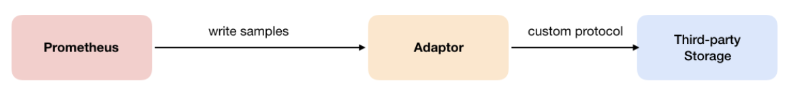

### Remote Read

如下图所示，Promthues的Remote Read(远程读)也通过了一个适配器实现。在远程读的流程当中，当用户发起查询请求后，Promthues将向remote_read中配置的URL发起查询请求(matchers,ranges)，Adaptor根据请求条件从第三方存储服务中获取响应的数据。同时将数据转换为Promthues的原始样本数据返回给Prometheus Server。

当获取到样本数据后，Promthues在本地使用PromQL对样本数据进行二次处理。

> 注意：启用远程读设置后，只在数据查询时有效，对于规则文件的处理，以及Metadata API的处理都只基于Prometheus本地存储完成。


### 配置文件

Prometheus配置文件中添加remote_write和remote_read配置，其中url用于指定远程读/写的HTTP服务地址。如果该URL启动了认证则可以通过basic_auth进行安全认证配置。对于https的支持需要设定tls_concig。proxy_url主要用于Prometheus无法直接访问适配器服务的情况下。

remote_write和remote_write具体配置如下所示：

```yml
remote_write:
    url: <string>
    [ remote_timeout: <duration> | default = 30s ]
    write_relabel_configs:
    [ - <relabel_config> ... ]
    basic_auth:
    [ username: <string> ]
    [ password: <string> ]
    [ bearer_token: <string> ]
    [ bearer_token_file: /path/to/bearer/token/file ]
    tls_config:
    [ <tls_config> ]
    [ proxy_url: <string> ]

remote_read:
    url: <string>
    required_matchers:
    [ <labelname>: <labelvalue> ... ]
    [ remote_timeout: <duration> | default = 30s ]
    [ read_recent: <boolean> | default = false ]
    basic_auth:
    [ username: <string> ]
    [ password: <string> ]
    [ bearer_token: <string> ]
    [ bearer_token_file: /path/to/bearer/token/file ]
    [ <tls_config> ]
    [ proxy_url: <string> ]
```

当然，prometheus 提供了规定，可以让用户自定义 adapter，自己进行处理，这里不写了。


## 联邦集群

通过Remote Storage可以分离监控样本采集和数据存储，解决Prometheus的持久化问题。联邦集群特性可以对Promthues进行扩展，以适应不同监控规模的变化。


对于大部分监控规模而言，只需要在每一个数据中心(例如：EC2可用区，Kubernetes集群)安装一个Prometheus Server实例，就可以在各个数据中心处理上千规模的集群。同时将Prometheus Server部署到不同的数据中心可以避免网络配置的复杂性。

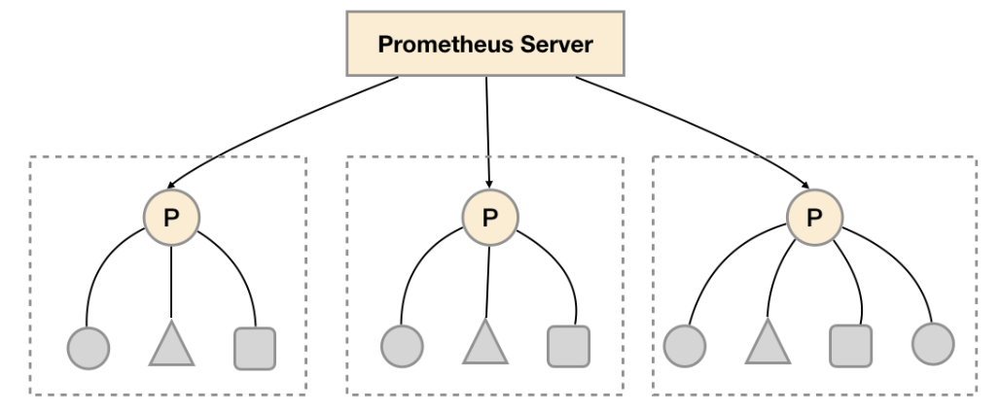

**如上图所示，在每个数据中心部署单独的Prometheus Server，用于采集当前数据中心监控数据。并由一个中心的Prometheus Server负责聚合多个数据中心的监控数据。这一特性在Promthues中称为联邦集群。**

联邦集群的核心在于每一个Prometheus Server都包含一个用于获取当前实例中监控样本的接口/federate。对于中心Prometheus Server而言，无论是从其他的Prometheus实例还是Exporter实例中获取数据实际上并没有任何差异。

```yml
scrape_configs:
  - job_name: 'federate'
    scrape_interval: 15s
    honor_labels: true
    metrics_path: '/federate'
    params:
      'match[]':
        - '{job="prometheus"}'
        - '{__name__=~"job:.*"}'
        - '{__name__=~"node.*"}'
    static_configs:
      - targets:
        - '192.168.77.11:9090'
        - '192.168.77.12:9090'
```

为了有效的减少不必要的时间序列，通过params参数可以用于指定只获取某些时间序列的样本数据，例如

```
"http://192.168.77.11:9090/federate?match[]={job%3D"prometheus"}&match[]={__name__%3D~"job%3A.*"}&match[]={__name__%3D~"node.*"}"
```

通过URL中的match[]参数指定可以指定需要获取的时间序列。match[]参数必须是一个瞬时向量选择器，例如up或者{job="api-server"}。配置多个match[]参数，用于获取多组时间序列的监控数据。

**horbor_labels**配置true可以确保当采集到的监控指标冲突时，能够自动忽略冲突的监控数据。如果为false时，prometheus会自动将冲突的标签替换为”exported_“的形式。

> 功能分区

联邦集群的特性可以帮助用户根据不同的监控规模对Promthues部署架构进行调整。例如如下所示，可以在各个数据中心中部署多个Prometheus Server实例。每一个Prometheus Server实例只负责采集当前数据中心中的一部分任务(Job)，例如可以将不同的监控任务分离到不同的Prometheus实例当中，再有中心Prometheus实例进行聚合。哎，无非就是再多分一层罢了

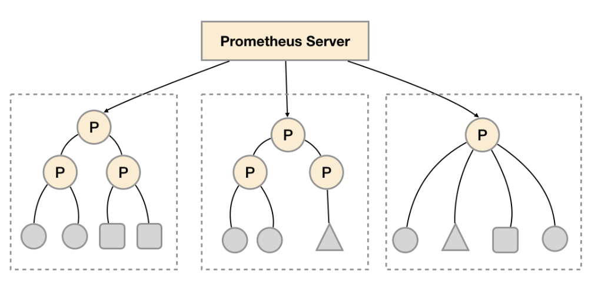

功能分区，即通过联邦集群的特性在任务级别对Prometheus采集任务进行划分，以支持规模的扩展。


## Prometheus高可用部署

Prometheus的本地存储给Prometheus带来了简单高效的使用体验，可以让Promthues在单节点的情况下满足大部分用户的监控需求。但是本地存储也同时限制了Prometheus的可扩展性，带来了数据持久化等一系列的问题。通过Prometheus的Remote Storage特性可以解决这一系列问题，包括Promthues的动态扩展，以及历史数据的存储。

而除了数据持久化问题以外，影响Promthues性能表现的另外一个重要因素就是数据采集任务量，以及单台Promthues能够处理的时间序列数。因此当监控规模大到Promthues单台无法有效处理的情况下，可以选择利用Promthues的联邦集群的特性，将Promthues的监控任务划分到不同的实例当中。

下面讨论Prometheus的高可用架构，并且根据不同的使用场景介绍了一种常见的高可用方案。


### 基本HA：服务可用性

由于Promthues的Pull机制的设计，为了确保Promthues服务的可用性，用户只需要部署多套Prometheus Server实例，并且采集相同的Exporter目标即可。

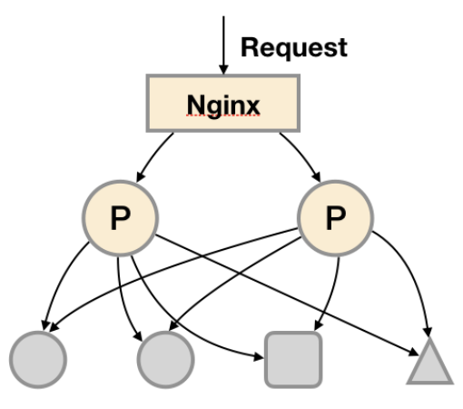

基本的HA模式只能确保Promthues服务的可用性问题，但是不解决Prometheus Server之间的数据一致性问题以及持久化问题(数据丢失后无法恢复)，也无法进行动态的扩展。因此这种部署方式适合监控规模不大，Promthues Server也不会频繁发生迁移的情况，并且只需要保存短周期监控数据的场景。


### 基本HA + 远程存储

在基本HA模式的基础上通过添加Remote Storage存储支持，将监控数据保存在第三方存储服务上

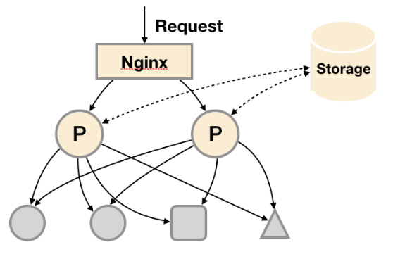

在解决了Promthues服务可用性的基础上，同时确保了数据的持久化，当Promthues Server发生宕机或者数据丢失的情况下，可以快速的恢复。 同时Promthues Server可能很好的进行迁移。因此，该方案适用于用户监控规模不大，但是希望能够将监控数据持久化，同时能够确保Promthues Server的可迁移性的场景。

### 基本HA + 远程存储 + 联邦集群

当单台Promthues Server无法处理大量的采集任务时，用户可以考虑基于Prometheus联邦集群的方式将监控采集任务划分到不同的Promthues实例当中即在任务级别功能分区。

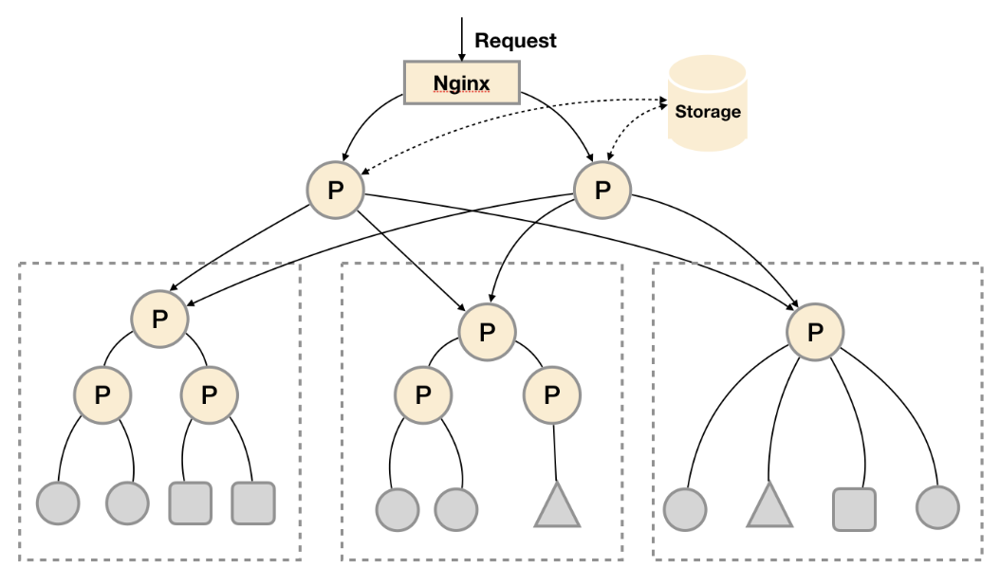

这种部署方式一般适用于两种场景：

场景一：单数据中心 + 大量的采集任务

这种场景下Promthues的性能瓶颈主要在于大量的采集任务，因此用户需要利用Prometheus联邦集群的特性，将不同类型的采集任务划分到不同的Promthues子服务中，从而实现功能分区。例如一个Promthues Server负责采集基础设施相关的监控指标，另外一个Prometheus Server负责采集应用监控指标。再有上层Prometheus Server实现对数据的汇聚。

场景二：多数据中心

这种模式也适合与多数据中心的情况，当Promthues Server无法直接与数据中心中的Exporter进行通讯时，在每一个数据中部署一个单独的Promthues Server负责当前数据中心的采集任务是一个不错的方式。这样可以避免用户进行大量的网络配置，只需要确保主Promthues Server实例能够与当前数据中心的Prometheus Server通讯即可。 中心Promthues Server负责实现对多数据中心数据的聚合。


## Alertmanager高可用

为了提升Promthues的服务可用性，通常用户会部署两个或者两个以上的Promthus Server，它们具有完全相同的配置包括Job配置，以及告警配置等。当某一个Prometheus Server发生故障后可以确保Promthues持续可用。

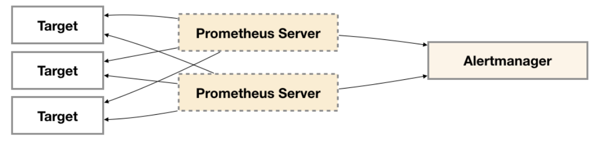

同时基于Alertmanager的告警分组机制即使不同的Prometheus Sever分别发送相同的告警给Alertmanager，Alertmanager也可以自动将这些告警合并为一个通知向receiver发送。

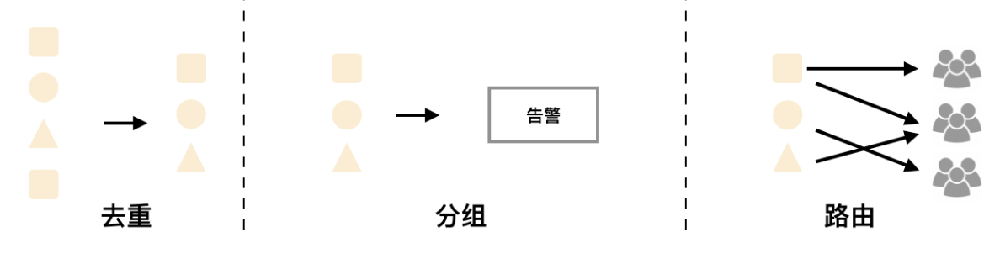

但不幸的是，虽然Alertmanager能够同时处理多个相同的Prometheus Server所产生的告警。但是由于单个Alertmanager的存在，当前的部署结构存在明显的单点故障风险，当Alertmanager单点失效后，告警的后续所有业务全部失效。

如下所示，最直接的方式，就是尝试部署多套Alertmanager。但是由于Alertmanager之间不存在并不了解彼此的存在，因此则会出现告警通知被不同的Alertmanager重复发送多次的问题。

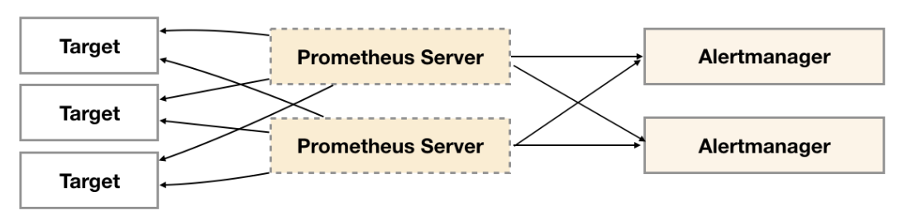

为了解决这一问题，如下所示。Alertmanager引入了Gossip机制。Gossip机制为多个Alertmanager之间提供了信息传递的机制。确保及时在多个Alertmanager分别接收到相同告警信息的情况下，也只有一个告警通知被发送给Receiver。

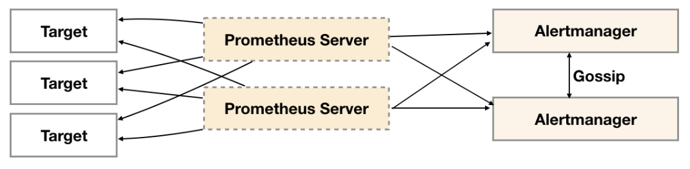

### Gossip协议

**Gossip是分布式系统中被广泛使用的协议，用于实现分布式节点之间的信息交换和状态同步**。Gossip协议同步状态类似于流言或者病毒的传播，如下所示：

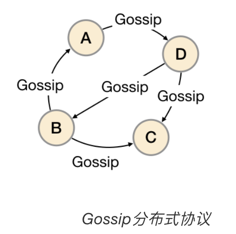

一般来说Gossip有两种实现方式分别为Push-based和Pull-based。在Push-based当集群中某一节点A完成一个工作后，随机的从其它节点B并向其发送相应的消息，节点B接收到消息后在重复完成相同的工作，直到传播到集群中的所有节点。而Pull-based的实现中节点A会随机的向节点B发起询问是否有新的状态需要同步，如果有则返回。

如下所示，基于Gossip协议实现集群高可用，当Alertmanager接收到来自Prometheus的告警消息后，会按照以下流程对告警进行处理：

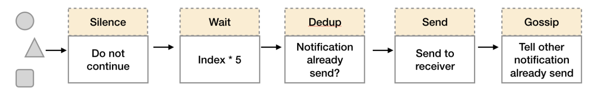

1. 在第一个阶段Silence中，Alertmanager会判断当前通知是否匹配到任何的静默规则，如果没有则进入下一个阶段，否则则中断流水线不发送通知。
2. 在第二个阶段Wait中，Alertmanager会根据当前Alertmanager在集群中所在的顺序(index)等待index * 5s的时间。
3. 当前Alertmanager等待阶段结束后，Dedup阶段则会判断当前Alertmanager数据库中该通知是否已经发送，如果已经发送则中断流水线，不发送告警，否则则进入下一阶段Send对外发送告警通知。
4. 告警发送完成后该Alertmanager进入最后一个阶段Gossip，Gossip会通知其他Alertmanager实例当前告警已经发送。其他实例接收到Gossip消息后，则会在自己的数据库中保存该通知已发送的记录。

因此如下所示，Gossip机制的关键在于两点：

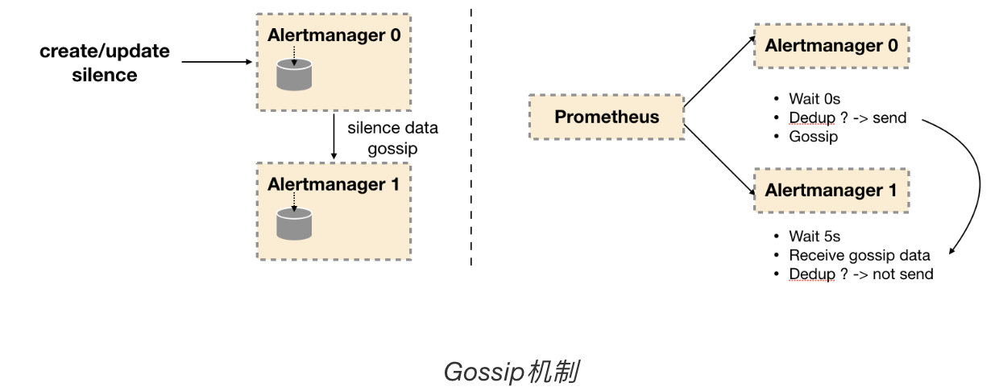

- Silence设置同步：Alertmanager启动阶段**基于Pull-based从集群其它节点同步Silence状态**，当有新的Silence产生时使用Push-based方式在集群中传播Gossip信息。
- 通知发送状态同步：**告警通知发送完成后，基于Push-based同步告警发送状态**。Wait阶段可以确保集群状态一致。

Alertmanager基于Gossip实现的集群机制虽然不能保证所有实例上的数据时刻保持一致，但是实现了CAP理论中的AP系统，即可用性和分区容错性。同时对于Prometheus Server而言保持了配置了简单性，Promthues Server之间不需要任何的状态同步。


### Prometheus配置Alertmanager集群

由于Gossip机制的实现，在Promthues和Alertmanager实例之间不要使用任何的负载均衡，需要确保Promthues将告警发送到所有的Alertmanager实例中：

```yml
alerting:
  alertmanagers:
  - static_configs:
    - targets:
      - 127.0.0.1:9093
      - 127.0.0.1:9094
      - 127.0.0.1:9095
```
