# Exporter

为了采集主机的监控样本数据，安装了一个Node Exporter程序，该程序对外暴露了一个用于获取当前监控样本数据的HTTP访问地址。这样的一个程序称为Exporter，Exporter的实例称为一个Target。Prometheus通过轮询的方式定时从这些Target中获取监控数据样本，并且存储在数据库当中。 

## exporter是啥

### exporter来源

从Exporter的来源上来讲，主要分为两类：

- 社区提供的

Prometheus社区提供了丰富的Exporter实现，涵盖了从基础设施，中间件以及网络等各个方面的监控功能。这些Exporter可以实现大部分通用的监控需求。下表列举一些社区中常用的Exporter：

| 范围     | 常用Exporter                                                 |
| -------- | ------------------------------------------------------------ |
| 数据库   | MySQL Exporter, Redis Exporter, MongoDB Exporter, MSSQL Exporter等 |
| 硬件     | Apcupsd Exporter，IoT Edison Exporter， IPMI Exporter, Node Exporter等 |
| 消息队列 | Beanstalkd Exporter, Kafka Exporter, NSQ Exporter, RabbitMQ Exporter等 |
| 存储     | Ceph Exporter, Gluster Exporter, HDFS Exporter, ScaleIO Exporter等 |
| HTTP服务 | Apache Exporter, HAProxy Exporter, Nginx Exporter等          |
| API服务  | AWS ECS Exporter， Docker Cloud Exporter, Docker Hub Exporter, GitHub Exporter等 |
| 日志     | Fluentd Exporter, Grok Exporter等                            |
| 监控系统 | Collectd Exporter, Graphite Exporter, InfluxDB Exporter, Nagios Exporter, SNMP Exporter等 |
| 其它     | Blockbox Exporter, JIRA Exporter, Jenkins Exporter， Confluence Exporter等 |

- 用户自定义的

除了直接使用社区提供的Exporter程序以外，用户还可以基于Prometheus提供的Client Library创建自己的Exporter程序，目前Promthues社区官方提供了对以下编程语言的支持：Go、Java/Scala、Python、Ruby。同时还有第三方实现的如：Bash、C++、Common Lisp、Erlang,、Haskeel、Lua、Node.js、PHP、Rust等。


### Exporter的运行方式

从Exporter的运行方式上来讲，又可以分为：

- 独立使用的

以已经使用过的Node Exporter为例，由于操作系统本身并不直接支持Prometheus，同时用户也无法通过直接从操作系统层面上提供对Prometheus的支持。因此，用户只能通过独立运行一个程序的方式，通过操作系统提供的相关接口，将系统的运行状态数据转换为可供Prometheus读取的监控数据。 除了Node Exporter以外，比如MySQL Exporter、Redis Exporter等都是通过这种方式实现的。 这些Exporter程序扮演了一个中间代理人的角色。

- 集成到应用中的

为了能够更好的监控系统的内部运行状态，有些开源项目如Kubernetes，ETCD等直接在代码中使用了Prometheus的Client Library，提供了对Prometheus的直接支持。这种方式打破的监控的界限，让应用程序可以直接将内部的运行状态暴露给Prometheus，适合于一些需要更多自定义监控指标需求的项目。


### Exporter规范

所有的Exporter程序都需要按照Prometheus的规范，返回监控的样本数据。以Node Exporter为例，当访问/metrics地址时会返回以下内容：

```text
# HELP node_cpu Seconds the cpus spent in each mode.
# TYPE node_cpu counter
node_cpu{cpu="cpu0",mode="idle"} 362812.7890625
# HELP node_load1 1m load average.
# TYPE node_load1 gauge
node_load1 3.0703125
```

Exporter返回的样本数据，主要由三个部分组成：**样本的一般注释信息（HELP），样本的类型注释信息（TYPE）和样本**。Prometheus会对Exporter响应的内容逐行解析：

如果当前行以# HELP开始，Prometheus将会按照以下规则对内容进行解析，得到当前的指标名称以及相应的说明信息：

```sh
# HELP <metrics_name> <doc_string>
```

如果当前行以# TYPE开始，Prometheus会按照以下规则对内容进行解析，得到当前的指标名称以及指标类型:

```sh
# TYPE <metrics_name> <metrics_type>
```

TYPE注释行必须出现在指标的第一个样本之前。如果没有明确的指标类型需要返回为untyped。 除了# 开头的所有行都会被视为是监控样本数据。 每一行样本需要满足以下格式规范:

```sh
metric_name [
  "{" label_name "=" `"` label_value `"` { "," label_name "=" `"` label_value `"` } [ "," ] "}"
] value [ timestamp ]
```

其中metric_name和label_name必须遵循PromQL的格式规范要求。value是一个float格式的数据，timestamp的类型为int64（从1970-01-01 00:00:00以来的毫秒数），timestamp为可选默认为当前时间。具有相同metric_name的样本必须按照一个组的形式排列，并且每一行必须是唯一的指标名称和标签键值对组合。

需要特别注意的是对于histogram和summary类型的样本。需要按照以下约定返回样本数据：

- 类型为summary或者histogram的指标x，该指标所有样本的值的总和需要使用一个单独的x_sum指标表示。
- 类型为summary或者histogram的指标x，该指标所有样本的总数需要使用一个单独的x_count指标表示。
- 对于类型为summary的指标x，其不同分位数quantile所代表的样本，需要使用单独的x{quantile="y"}表示。
- 对于类型histogram的指标x为了表示其样本的分布情况，每一个分布需要使用x_bucket{le="y"}表示，其中y为当前分布的上位数。同时必须包含一个样本x_bucket{le="+Inf"}，并且其样本值必须和x_count相同。
- 对于histogram和summary的样本，必须按照分位数quantile和分布le的值的递增顺序排序。

以下是类型为histogram和summary的样本输出示例：

```sh
# A histogram, which has a pretty complex representation in the text format:
# HELP http_request_duration_seconds A histogram of the request duration.
# TYPE http_request_duration_seconds histogram
http_request_duration_seconds_bucket{le="0.05"} 24054 # 表示小于等于0.05的有24054
http_request_duration_seconds_bucket{le="0.1"} 33444
http_request_duration_seconds_bucket{le="0.2"} 100392
http_request_duration_seconds_bucket{le="+Inf"} 144320
http_request_duration_seconds_sum 53423
http_request_duration_seconds_count 144320

# Finally a summary, which has a complex representation, too:
# HELP rpc_duration_seconds A summary of the RPC duration in seconds.
# TYPE rpc_duration_seconds summary
rpc_duration_seconds{quantile="0.01"} 3102
rpc_duration_seconds{quantile="0.05"} 3272
rpc_duration_seconds{quantile="0.5"} 4773
rpc_duration_seconds_sum 1.7560473e+07
rpc_duration_seconds_count 2693
```

对于某些Prometheus还没有提供支持的编程语言，用户只需要按照以上规范返回响应的文本数据即可。


### 指定样本格式的版本

在Exporter响应的HTTP头信息中，可以通过Content-Type指定特定的规范版本，例如：

```
HTTP/1.1 200 OK
Content-Encoding: gzip
Content-Length: 2906
Content-Type: text/plain; version=0.0.4
Date: Sat, 17 Mar 2018 08:47:06 GMT
```

**其中version用于指定Text-based的格式版本，当没有指定版本的时候，默认使用最新格式规范的版本。同时HTTP响应头还需要指定压缩格式为gzip。**


## 容器监控：cAdvisor

CAdvisor是Google开源的一款用于展示和分析容器运行状态的可视化工具。通过在主机上运行CAdvisor用户可以轻松的获取到当前主机上容器的运行统计信息，并以图表的形式向用户展示。

### 运行启动

```sh
docker run \
  --volume=/:/rootfs:ro \
  --volume=/var/run:/var/run:ro \
  --volume=/sys:/sys:ro \
  --volume=/var/lib/docker/:/var/lib/docker:ro \
  --volume=/dev/disk/:/dev/disk:ro \
  --publish=8080:8080 \
  --detach=true \
  --name=cadvisor \
  --privileged \
  --device=/dev/kmsg \
  gcr.io/cadvisor/cadvisor # 这个是最新的镜像
```

CAdvisor是一个简单易用的工具，相比于使用Docker命令行工具，用户不用再登录到服务器中即可以可视化图表的形式查看主机上所有容器的运行状态。可以从网页上看到一些当前正在运行的容器，如node_exporter, alertmanager, prometheus等

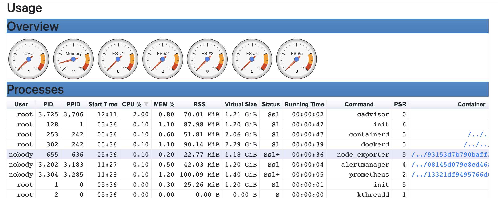

### 数据

而在多主机的情况下，在所有节点上运行一个CAdvisor再通过各自的UI查看监控信息显然不太方便，同时CAdvisor默认只保存2分钟的监控数据。好消息是CAdvisor已经内置了对Prometheus的支持。访问localhost:8080/metrics即可获取到标准的Prometheus监控样本输出

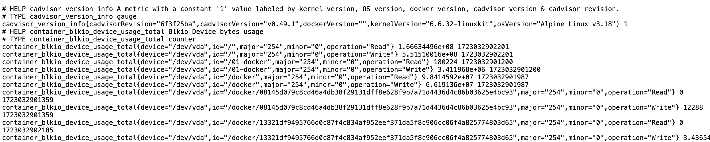

下面表格中列举了一些CAdvisor中获取到的典型监控指标：

| 指标名称                               | 类型    | 含义                                         |
| -------------------------------------- | ------- | -------------------------------------------- |
| container_cpu_load_average_10s         | gauge   | 过去10秒容器CPU的平均负载                    |
| container_cpu_usage_seconds_total      | counter | 容器在每个CPU内核上的累积占用时间 (单位：秒) |
| container_cpu_system_seconds_total     | counter | System CPU累积占用时间（单位：秒）           |
| container_cpu_user_seconds_total       | counter | User CPU累积占用时间（单位：秒）             |
| container_fs_usage_bytes               | gauge   | 容器中文件系统的使用量(单位：字节)           |
| container_fs_limit_bytes               | gauge   | 容器可以使用的文件系统总量(单位：字节)       |
| container_fs_reads_bytes_total         | counter | 容器累积读取数据的总量(单位：字节)           |
| container_fs_writes_bytes_total        | counter | 容器累积写入数据的总量(单位：字节)           |
| container_memory_max_usage_bytes       | gauge   | 容器的最大内存使用量（单位：字节）           |
| container_memory_usage_bytes           | gauge   | 容器当前的内存使用量（单位：字节             |
| container_spec_memory_limit_bytes      | gauge   | 容器的内存使用量限制                         |
| machine_memory_bytes                   | gauge   | 当前主机的内存总量                           |
| container_network_receive_bytes_total  | counter | 容器网络累积接收数据总量（单位：字节）       |
| container_network_transmit_bytes_total | counter | 容器网络累积传输数据总量（单位：字节）       |


### 与Prometheus集成

修改/etc/prometheus/prometheus.yml，将cAdvisor添加监控数据采集任务目标当中：

```yaml
- job_name: cadvisor
  static_configs:
  - targets:
    - host.docker.internal:8080
```

重启prometheus后，可以在Prometheus UI中查看到当前所有的Target状态：

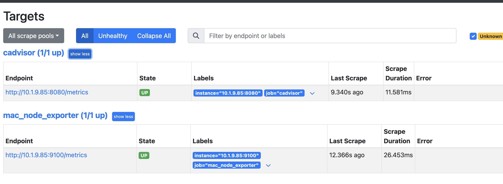

下面这些查询的时间过滤为1m，这是因为默认的配置文件中设置的数据采集间隔为1m，这个是需要看配置文件的。

通过以下表达式计算容器的CPU使用率：

```text
sum without (cpu) (irate(container_cpu_usage_seconds_total{id!=""}[1m]))
```

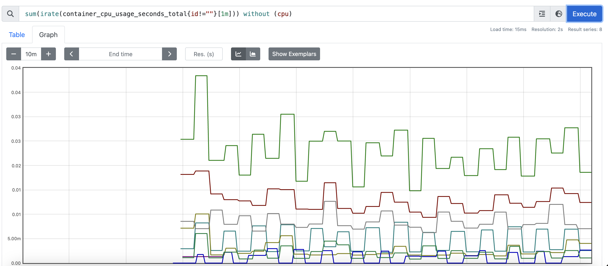

查询容器内存使用量（单位：字节）:

```text
container_memory_usage_bytes{id!=""}
```

查询容器网络接收量速率（单位：字节/秒）：

```text
sum(rate(container_network_receive_bytes_total{id!=""}[1m])) without (interface)
```

查询容器网络传输量速率（单位：字节/秒）：

```text
sum(rate(container_network_transmit_bytes_total{id!=""}[1m])) without (interface)
```

查询容器文件系统读取速率（单位：字节/秒）：

```text
sum(rate(container_fs_reads_bytes_total{id!=""}[1m])) without (device)
```

查询容器文件系统写入速率（单位：字节/秒）：

```text
sum(rate(container_fs_writes_bytes_total{id!=""}[1m])) without (device)
```


## mysqld-exporter

### 安装&启动

需要一个账号对数据库进行查询，所以必须去监控的数据库中授权

```sql
create user 'mysqld_exporter'@'%' identified by '12345678';
GRANT REPLICATION CLIENT, PROCESS ON *.* TO 'mysqld_exporter'@'%';
GRANT SELECT ON performance_schema.* TO 'mysqld_exporter'@'%';
flush privileges;
-- 这里建议直接%吧，而不是localhost，因为promethues填localhsot报错，需要填ip，但是这里填localhost会mysql这边通不过
```

然后编写配置文件mysql.cnf（不要把注释写进去），需要把这个文件拷贝到容器中，也可以选择挂载的方式，我这里选择的拷贝

```cnf
[client]
host=10.1.9.85 // 由于我是本机跑的mysql，然后容器跑的exporter，这里填localhsot不行，必须指定ip，不然连不上mysql，我也不知道为啥
user=mysqld_exporter
password=12345678
// 然后访问数据库的时候就是这种形式访问的，'mysqld_exporter'@'10.1.9.85'，这也解释了为啥上面创建账户的时候直接指定%得了
```

先启动容器，因为没有容器无法完成拷贝，当然这个时候启动容器会报错的，会报错找不到配置文件

```sh
docker run -d -p 9104:9104 --name=mysqld-exporter prom/mysqld-exporter
```

然后将文件拷贝过去

```sh
docker cp $PWD/Documents/docker/prometheus/mysql.cnf mysqld-exporter:/.my.cnf
```

然后重启容器即可，即可访问啦

然后修改prometheus配置文件，

```yml
- job_name: mysqld
  static_configs:
  - targets:
    - 10.1.9.85:9104
```

重启，即可看到监控了

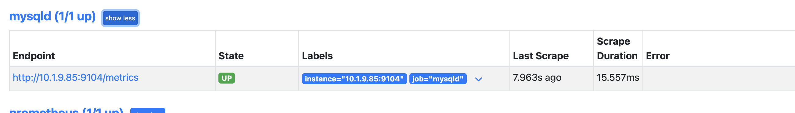

为了确保数据库的稳定运行，通常会关注一下四个与性能和资源利用率相关的指标：查询吞吐量、连接情况、缓冲池使用情况以及查询执行性能等。


### 监控数据库吞吐量

对于数据库而言，最重要的工作就是实现对数据的增、删、改、查。为了衡量数据库服务器当前的吞吐量变化情况。在MySQL内部通过一个名为Questions的计数器，当客户端发送一个查询语句后，其值就会+1。可以通过以下MySQL指令查询Questions等服务器状态变量的值：

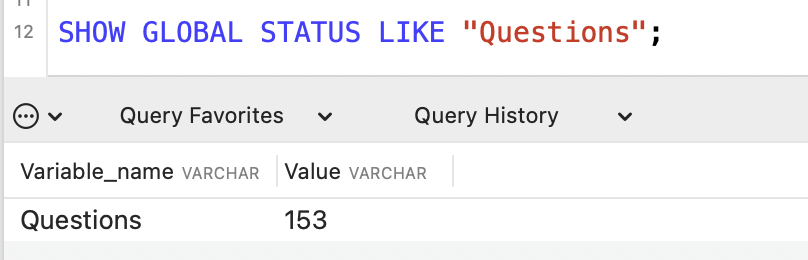

MySQLD Exporter中返回的样本数据中通过mysql_global_status_questions反映当前Questions计数器的大小：（这里应该是exporter本身也需要查询，所以这个数字才会有差）

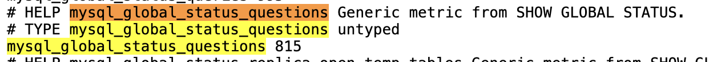

通过以下PromQL可以查看当前MySQL实例查询速率的变化情况，查询数量的突变往往暗示着可能发生了某些严重的问题，因此用于用户应该关注并且设置响应的告警规则，以及时获取该指标的变化情况：

```text
rate(mysql_global_status_questions[2m])
```

一般还可以从监控读操作和写操作的执行情况进行判断。通过MySQL全局状态中的Com_select可以查询到当前服务器执行查询语句的总次数：相应的，也可以通过Com_insert、Com_update以及Com_delete的总量衡量当前服务器写操作的总次数。

从MySQLD Exporter的/metrics返回的监控样本中，可以通过global_status_commands_total获取当前实例各类指令执行的次数：

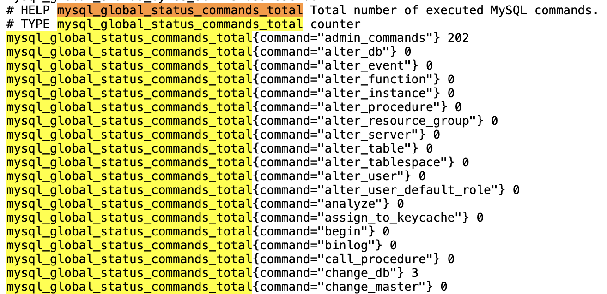

用户可以通过以下PromQL查看当前MySQL实例写操作速率的变化情况：

```text
sum(rate(mysql_global_status_commands_total{command=~"insert|update|delete"}[2m])) without (command)
```

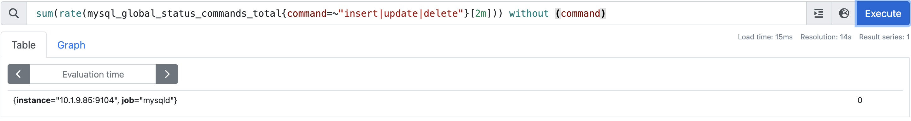


### 连接情况

在MySQL中通过全局设置max_connections限制了当前服务器允许的最大客户端连接数量。一旦可用连接数被用尽，新的客户端连接都会被直接拒绝。 因此当监控MySQL运行状态时，需要时刻关注MySQL服务器的连接情况。用户可以通过以下指令查看当前MySQL服务的max_connections配置：

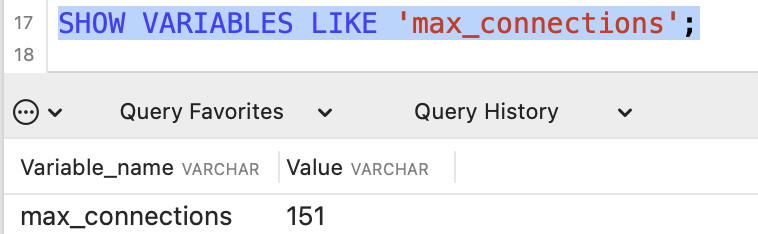

通过Global Status中的Threads_connected、Aborted_connects、Connection_errors_max_connections以及Threads_running可以查看当前MySQL实例的连接情况。通过以下指令可以直接当前MySQL实例的连接数：

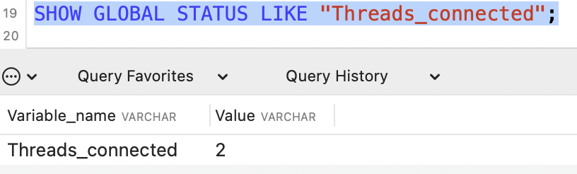

当所有可用连接都被占用时，如果一个客户端尝试连接至MySQL，会出现“Too many connections(连接数过多)”错误，同时Connection_errors_max_connections的值也会增加。为了防止出现此类情况，你应该监控可用连接的数量，并确保其值保持在max_connections限制以内。同时如果Aborted_connects的数量不断增加时，说明客户端尝试连接到MySQL都失败了。此时可以通过Connection_errors_max_connections以及Connection_errors_internal分析连接失败的问题原因。

下面列举了与MySQL连接相关的监控指标：

- mysql_global_variables_max_connections： 允许的最大连接数；
- mysql_global_status_threads_connected： 当前连接数；
- mysql_global_status_threads_running：当前运行的连接；
- mysql_global_status_aborted_connects：当前连接拒绝数；
- mysql_global_status_connection_errors_total{error="max_connections"}：由于超出最大连接数导致的错误；
- mysql_global_status_connection_errors_total{error="internal"}：由于系统内部导致的错误；

通过PromQL查询当前剩余的可用连接数：

```text
mysql_global_variables_max_connections - mysql_global_status_threads_connected
```

使用PromQL查询当前MySQL实例连接拒绝数：

```text
mysql_global_status_aborted_connects
```


### 监控缓冲池使用情况

MySQL默认的存储引擎InnoDB使用了一片称为缓冲池的内存区域，用于缓存数据表以及索引的数据。 当缓冲池的资源使用超出限制后，可能会导致数据库性能的下降，同时很多查询命令会直接在磁盘中执行，导致磁盘I/O不断攀升。 因此，应该关注MySQL缓冲池的资源使用情况，并且在合理的时间扩大缓冲池的大小可以优化数据库的性能。

Innodb_buffer_pool_pages_total反映了当前缓冲池中的内存页的总页数。可以通过以下指令查看：

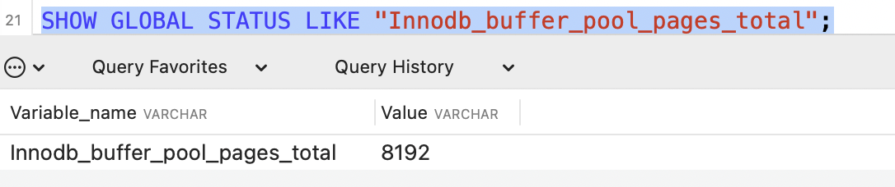

MySQLD Exporter通过以下指标返回缓冲池中各类内存页的数量：

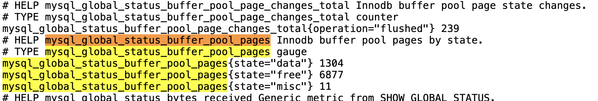

Innodb_buffer_pool_read_requests记录了正常从缓冲池读取数据的请求数量。可以通过以下指令查看：

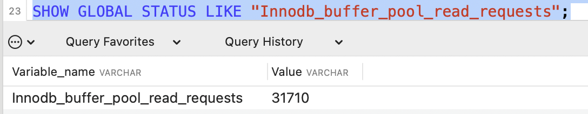

MySQLD Exporter通过以下指标返回缓冲池中Innodb_buffer_pool_read_requests的值：

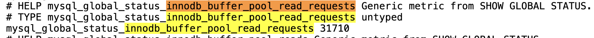

当缓冲池无法满足时，MySQL只能从磁盘中读取数据。Innodb_buffer_pool_reads即记录了从磁盘读取数据的请求数量。通常来说从内存中读取数据的速度要比从磁盘中读取快很多，因此，如果Innodb_buffer_pool_reads的值开始增加，可能意味着数据库的性能有问题。 查看Innodb_buffer_pool_reads的数量

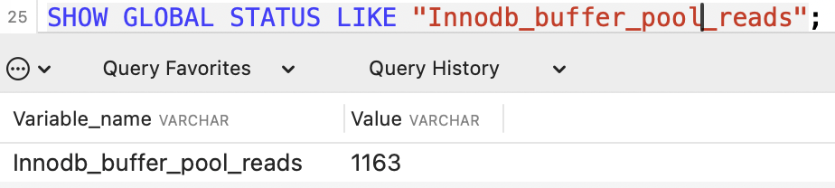

通过以上监控指标，以及实际监控的场景，可以利用PromQL快速建立多个监控项。

通过以下PromQL可以得到各个MySQL实例的缓冲池利用率。一般来说还需要结合Innodb_buffer_pool_reads的增长率情况来结合判断缓冲池大小是否合理：

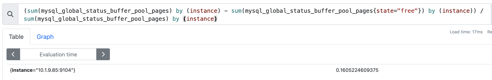

也可以通过以下PromQL计算2分钟内磁盘读取请求次数的增长率的变化情况：

```
rate(mysql_global_status_innodb_buffer_pool_reads[2m])
```


### 查询性能

MySQL还提供了一个Slow_queries的计数器，当查询的执行时间超过long_query_time的值后，计数器就会+1，其默认值为10秒，可以通过以下指令在MySQL中查询当前long_query_time的设置：

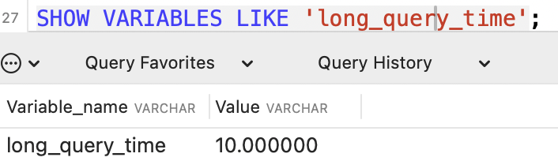

通过以下指令可以查看当前MySQL实例中Slow_queries的数量：

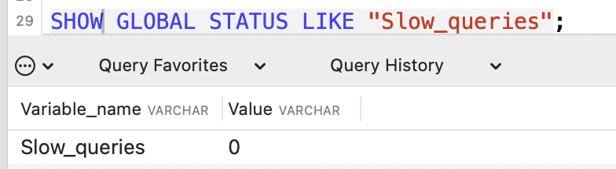

MySQLD Exporter返回的样本数据中，通过以下指标展示当前的Slow_queries的值：

```
# HELP mysql_global_status_slow_queries Generic metric from SHOW GLOBAL STATUS.
# TYPE mysql_global_status_slow_queries untyped
mysql_global_status_slow_queries 0
```

通过监控Slow_queries的增长率，可以反映出当前MySQL服务器的性能状态，可以通过以下PromQL查询Slow_queries的增长情况：

```
rate(mysql_global_status_slow_queries[2m])
```


## 网络探测：Blackbox Exporter

前几个小节主要介绍了Prometheus下如何进行白盒监控，监控主机的资源用量、容器的运行状态、数据库中间件的运行数据。 这些都是支持业务和服务的基础设施，通过白盒能够了解其内部的实际运行状态，通过对监控指标的观察能够预判可能出现的问题，从而对潜在的不确定因素进行优化。而从完整的监控逻辑的角度，除了大量的应用白盒监控以外，还应该添加适当的黑盒监控。黑盒监控即以用户的身份测试服务的外部可见性，常见的黑盒监控包括HTTP探针、TCP探针等用于检测站点或者服务的可访问性，以及访问效率等。

黑盒监控相较于白盒监控最大的不同在于黑盒监控是以故障为导向当故障发生时，黑盒监控能快速发现故障，而白盒监控则侧重于主动发现或者预测潜在的问题。一个完善的监控目标是要能够从白盒的角度发现潜在问题，能够在黑盒的角度快速发现已经发生的问题。


### 使用Blackbox Exporter

Blackbox Exporter是Prometheus社区提供的官方黑盒监控解决方案，其允许用户通过：HTTP、HTTPS、DNS、TCP以及ICMP的方式对网络进行探测。

```sh
docker pull quay.io/prometheus/blackbox-exporter
docker run -p 9115:9115/tcp -d --name blackbox-exporter quay.io/prometheus/blackbox-exporter
```

容器一般都有默认的配置文件：`/etc/blackbox_exporter/config.yml`，如果需要更改，可以将本地文件拷贝到这个文件

运行Blackbox Exporter时，需要用户提供探针的配置信息，这些配置信息可能是一些自定义的HTTP头信息，也可能是探测时需要的一些TSL配置，也可能是探针本身的验证行为。在Blackbox Exporter每一个探针配置称为一个module，并且以YAML配置文件的形式提供给Blackbox Exporter。 每一个module主要包含以下配置内容，包括探针类型（prober）、验证访问超时时间（timeout）、以及当前探针的具体配置项：

```yml
# 探针类型：http、 tcp、 dns、 icmp.
prober: <prober_string>

# 超时时间
[ timeout: <duration> ]

# 探针的详细配置，最多只能配置其中的一个
[ http: <http_probe> ]
[ tcp: <tcp_probe> ]
[ dns: <dns_probe> ]
[ icmp: <icmp_probe> ]
```

下面是一个简化的探针配置文件blockbox.yml，包含两个HTTP探针配置项：

```yml
modules:
  http_2xx:
    prober: http
    http:
      method: GET
  http_post_2xx:
    prober: http
    http:
      method: POST
```

通过运行以下命令，进行配置文件覆盖，然后重启

```
docker cp $PWD/Documents/docker/prometheus/block.yml blackbox-exporter:/etc/blackbox_exporter/config.yml
```

启动成功后，就可以通过访问http://127.0.0.1:9115/probe?module=http_2xx&target=baidu.com对baidu.com进行探测。这里通过在URL中提供module参数指定了当前使用的探针，target参数指定探测目标，探针的探测结果通过Metrics的形式返回：

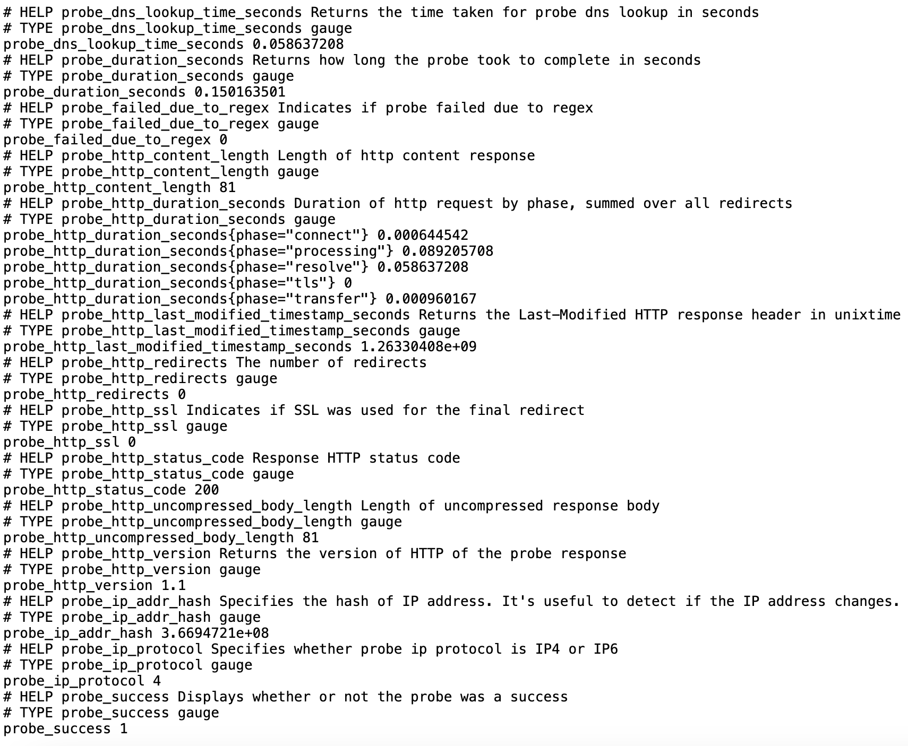

从返回的样本中，用户可以获取站点的DNS解析耗时、站点响应时间、HTTP响应状态码等等和站点访问质量相关的监控指标，从而帮助管理员主动的发现故障和问题。


### 与Prometheus集成

接下来，只需要在Prometheus下配置对Blockbox Exporter实例的采集任务即可。最直观的配置方式：

==这里出现了一个问题：填ip的话，blackbox exporter会连不上，填localhost的话，prometheus会报错，解决方法填host.docker.internal，之前的也都可以改过来：[可以看这里](https://stackoverflow.com/questions/54397463/getting-error-get-http-localhost9443-metrics-dial-tcp-127-0-0-19443-conne)==

```yml
- job_name: baidu_http2xx_probe
  params:
    module:
      - http_2xx
    target:
      - baidu.com
  metrics_path: /probe
  static_configs:
    - targets:
      - host.docker.internal:9115
- job_name: prometheus_http2xx_probe
  params:
    module:
      - http_2xx
    target:
      - prometheus.io
  metrics_path: /probe
  static_configs:
    - targets:
      - host.docker.internal:9115
```

这里分别配置了名为baidu_http2x_probe和prometheus_http2xx_probe的采集任务，并且通过params指定使用的探针（module）以及探测目标（target）。

那问题就来了，假如我们有N个目标站点且都需要M种探测方式，那么Prometheus中将包含N * M个采集任务，从配置管理的角度来说显然是不可接受的。这里可以采用 Prometheus的Relabeling能力对这些配置进行简化，配置方式如下：

```yml
scrape_configs:
  - job_name: 'blackbox'
    metrics_path: /probe
    params:
      module: [http_2xx]
    static_configs:
      - targets:
        - http://prometheus.io    # Target to probe with http.
        - https://prometheus.io   # Target to probe with https.
        - http://10.1.9.85:8080 	# Target to probe with http on port 8080.
    relabel_configs:
      - source_labels: [__address__]
        target_label: __param_target
      - source_labels: [__param_target]
        target_label: instance
      - target_label: __address__
        replacement: host.docker.internal:9115
```

这里针对每一个探针服务（如http_2xx）定义一个采集任务，并且直接将任务的采集目标定义为需要探测的站点。在采集样本数据之前通过relabel_configs对采集任务进行动态设置。

- 第1步，根据Target实例的地址，写入`__param_target`标签中。`__param_<name>`形式的标签表示，在采集任务时会在请求目标地址中添加`<name>`参数，等同于params的设置；
- 第2步，获取__param_target的值，并覆写到instance标签中；
- 第3步，覆写Target实例的`__address__`标签值为BlockBox Exporter实例的访问地址。

通过以上3个relabel步骤，即可大大简化Prometheus任务配置的复杂度:

可以看到现在是一个job包含了三个断点，之前是有两个job，每个job各一个端点

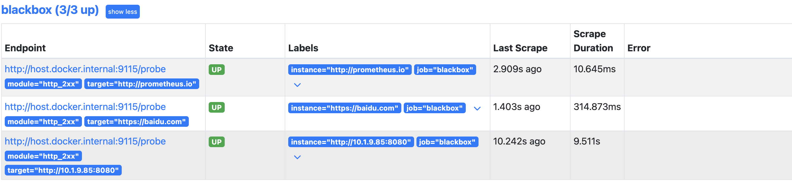

### HTTP探针

HTTP探针是进行黑盒监控时最常用的探针之一，通过HTTP探针能够网站或者HTTP服务建立有效的监控，包括其本身的可用性，以及用户体验相关的如响应时间等等。除了能够在服务出现异常的时候及时报警，还能帮助系统管理员分析和优化网站体验。

Blackbox Exporter中所有的探针均是以Module的信息进行配置。如下所示，配置了一个最简单的HTTP探针：

```
modules:
  http_2xx_example:
    prober: http
    http:
```

通过prober配置项指定探针类型。配置项http用于自定义探针的探测方式，这里有没对http配置项添加任何配置，表示完全使用HTTP探针的默认配置，该探针将使用HTTP GET的方式对目标服务进行探测，并且验证返回状态码是否为2XX，是则表示验证成功，否则失败。

#### 自定义HTTP请求

HTTP服务通常会以不同的形式对外展现，有些可能就是一些简单的网页，而有些则可能是一些基于REST的API服务。 对于不同类型的HTTP的探测需要管理员能够对HTTP探针的行为进行更多的自定义设置，包括：HTTP请求方法、HTTP头信息、请求参数等。对于某些启用了安全认证的服务还需要能够对HTTP探测设置相应的Auth支持。对于HTTPS类型的服务还需要能够对证书进行自定义设置。

如下所示，这里通过method定义了探测时使用的请求方法，对于一些需要请求参数的服务，还可以通过**headers定义相关的请求头**信息，使用**body定义请求内容**：

```yml
http_post_2xx:
    prober: http
    timeout: 5s
    http:
      method: POST
      headers:
        Content-Type: application/json
      body: '{}'
```

如果HTTP服务启用了安全认证，Blackbox Exporter内置了对basic_auth的支持，可以直接设置相关的认证信息即可：

```yml
http_basic_auth_example:
    prober: http
    timeout: 5s
    http:
      method: POST
      headers:
        Host: "login.example.com"
      basic_auth:
        username: "username"
        password: "mysecret"
```

对于使用了Bear Token的服务也可以通过**bearer_token配置项直接指定令牌字符串**，或者通过bearer_token_file指定令牌文件。

对于一些启用了HTTPS的服务，但是需要自定义证书的服务，可以通过**tls_config指定相关的证书信息**：

```yml
 http_custom_ca_example:
    prober: http
    http:
      method: GET
      tls_config:
        ca_file: "/certs/my_cert.crt"
```

#### 自定义探针行为

在默认情况下HTTP探针只会对HTTP返回状态码进行校验，如果状态码为**2XX（200 <= StatusCode < 300）则表示探测成功，并且探针返回的指标probe_success值为1。**

如果用户需要指定HTTP返回状态码，或者对HTTP版本有特殊要求，如下所示，可以使用**valid_http_versions和valid_status_codes**进行定义：

```yml
http_2xx_example:
  prober: http
  timeout: 5s
  http:
    valid_http_versions: ["HTTP/1.1", "HTTP/2"]
    valid_status_codes: []
```

默认情况下，Blockbox返回的样本数据中也会包含指标probe_http_ssl，用于表明当前探针是否使用了SSL：

```
# HELP probe_http_ssl Indicates if SSL was used for the final redirect
# TYPE probe_http_ssl gauge
probe_http_ssl 0
```

而如果用户对于HTTP服务是否启用SSL有强制的标准。则可以使用fail_if_ssl和fail_if_not_ssl进行配置。fail_if_ssl为true时，表示如果站点启用了SSL则探针失败，反之成功。fail_if_not_ssl刚好相反。

```yml
http_2xx_example:
  prober: http
  timeout: 5s
  http:
    valid_status_codes: []
    method: GET
    no_follow_redirects: false
    fail_if_ssl: false
    fail_if_not_ssl: false
```

除了基于HTTP状态码，HTTP协议版本以及是否启用SSL作为控制探针探测行为成功与否的标准以外，还可以**匹配HTTP服务的响应内容**。使用**fail_if_matches_regexp和fail_if_not_matches_regexp用户可以定义一组正则表达式，用于验证HTTP返回内容**是否符合或者不符合正则表达式的内容。

```yml
http_2xx_example:
  prober: http
  timeout: 5s
  http:
    method: GET
    fail_if_matches_regexp:
      - "Could not connect to database"
    fail_if_not_matches_regexp:
      - "Download the latest version here"
```

最后需要提醒的时，默认情况下HTTP探针会走IPV6的协议。 在大多数情况下，可以使用preferred_ip_protocol=ip4强制通过IPV4的方式进行探测。在Bloackbox响应的监控样本中，也会通过指标probe_ip_protocol，表明当前的协议使用情况：

```
# HELP probe_ip_protocol Specifies whether probe ip protocol is IP4 or IP6
# TYPE probe_ip_protocol gauge
probe_ip_protocol 6
```

除了支持对HTTP协议进行网络探测以外，Blackbox还支持对TCP、DNS、ICMP等其他网络协议。


