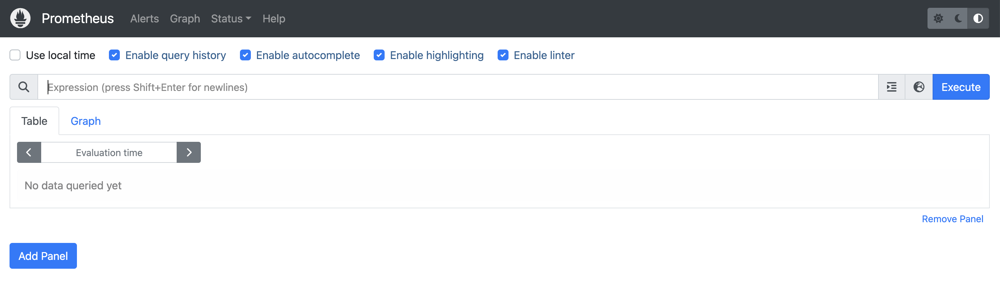
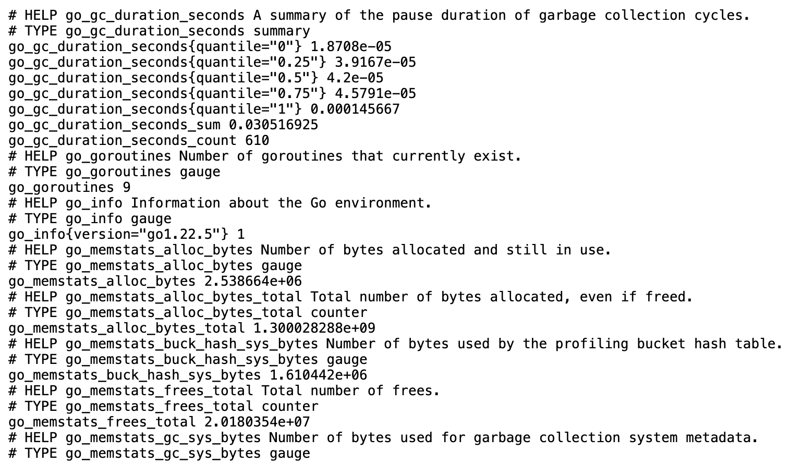
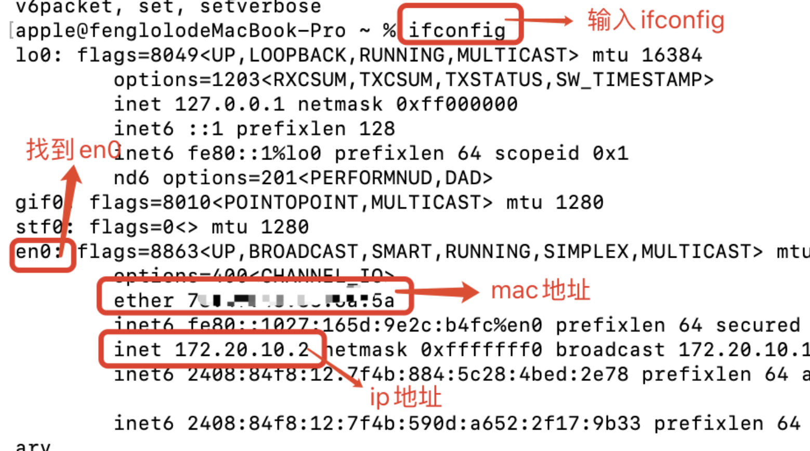
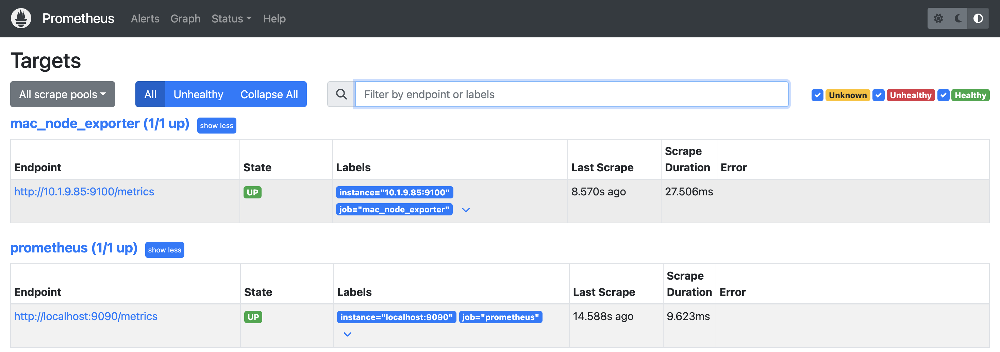
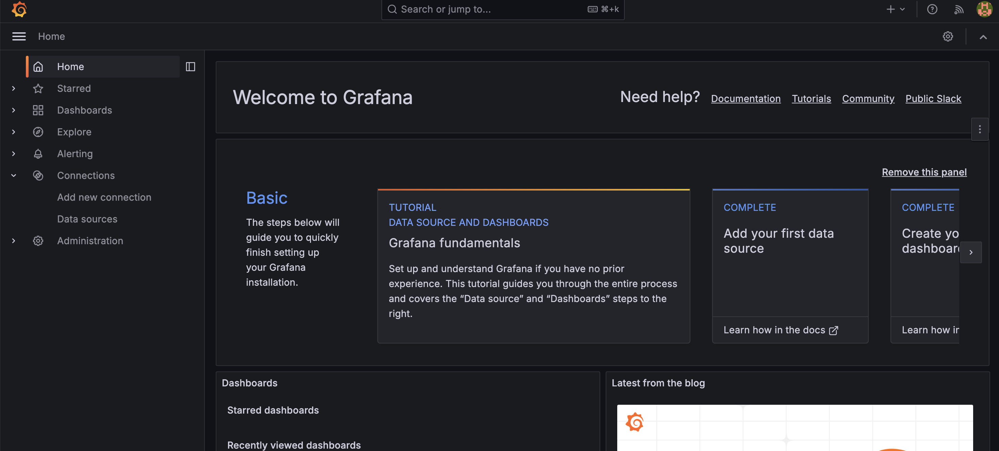
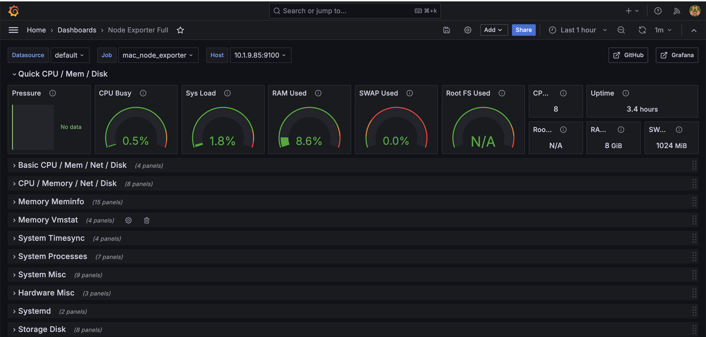
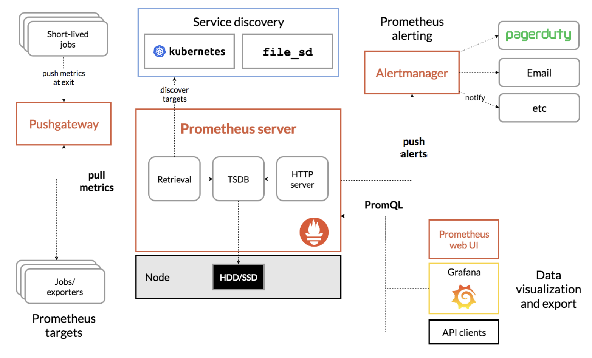

# Prometheus入门

## 监控概念

在《SRE: Google运维解密》一书中指出，监控系统需要能够有效的支持白盒监控和黑盒监控。通过白盒能够了解其内部的实际运行状态，通过对监控指标的观察能够预判可能出现的问题，从而对潜在的不确定因素进行优化。而黑盒监控，常见的如HTTP探针，TCP探针等，可以在系统或者服务在发生故障时能够快速通知相关的人员进行处理。通过建立完善的监控体系，从而达到以下目的：

- **长期趋势分析**：通过对监控样本数据的持续收集和统计，对监控指标进行长期趋势分析。例如，通过对磁盘空间增长率的判断，我们可以提前预测在未来什么时间节点上需要对资源进行扩容。
- **对照分析**：两个版本的系统运行资源使用情况的差异如何？在不同容量情况下系统的并发和负载变化如何？通过监控能够方便的对系统进行跟踪和比较。
- **告警**：当系统出现或者即将出现故障时，监控系统需要迅速反应并通知管理员，从而能够对问题进行快速的处理或者提前预防问题的发生，避免出现对业务的影响。
- **故障分析与定位**：当问题发生后，需要对问题进行调查和处理。通过对不同监控监控以及历史数据的分析，能够找到并解决根源问题。
- **数据可视化**：通过可视化仪表盘能够直接获取系统的运行状态、资源使用情况、以及服务运行状态等直观的信息。


## Prometheus

[Prometheus](https://prometheus.io/docs/introduction/overview/)是一个开源的完整监控解决方案，其对传统监控系统的测试和告警模型进行了彻底的颠覆，形成了基于中央化的规则计算、统一分析和告警的新模型。

> 易于管理

Prometheus核心部分只有一个单独的二进制文件，不存在任何的第三方依赖(数据库，缓存等等)。唯一需要的就是本地磁盘，因此不会有潜在级联故障的风险。

Prometheus基于Pull模型的架构方式，可以在任何地方（本地电脑，开发环境，测试环境）搭建监控系统。对于一些复杂的情况，还可以使用Prometheus服务发现(Service Discovery)的能力动态管理监控目标。

> 监控服务的内部运行状态

Pometheus鼓励用户监控服务的内部状态，基于Prometheus丰富的Client库，用户可以轻松的在应用程序中添加对Prometheus的支持，从而让用户可以获取服务和应用内部真正的运行状态。

> 强大的数据模型

所有采集的监控数据均以**指标(metric)的**形式保存在内置的**时间序列数据库当中(TSDB)**。所有的样本除了**基本的指标名称**以外，还包含一组**用于描述该样本特征的标签**。

如下所示：

```
http_request_status{code='200',content_path='/api/path', environment='produment'} => [value1@timestamp1,value2@timestamp2...]

http_request_status{code='200',content_path='/api/path2', environment='produment'} => [value1@timestamp1,value2@timestamp2...]
```

每一条时间序列由**指标名称(Metrics Name)以及一组标签(Labels)唯一标识**。每条时间序列按照时间的先后顺序存储一系列的样本值。

基于这些Labels可以方便地对监控数据进行聚合，过滤，裁剪。

> 强大的查询语言PromQL

Prometheus内置了一个强大的数据查询语言PromQL。 通过PromQL可以实现对监控数据的查询、聚合。同时PromQL也被应用于数据可视化(如Grafana)以及告警当中。

通过PromQL可以轻松回答类似于以下问题：

- 在过去一段时间中95%应用延迟时间的分布范围？
- 预测在4小时后，磁盘空间占用大致会是什么情况？
- CPU占用率前5位的服务有哪些？(过滤)

> 高效

对于监控系统而言，大量的监控任务必然导致有大量的数据产生。而Prometheus可以高效地处理这些数据，对于单一Prometheus Server实例而言它可以处理：

- 数以百万的监控指标
- 每秒处理数十万的数据点。

> 可扩展

Prometheus对于联邦集群的支持，可以让多个Prometheus实例产生一个逻辑集群，当单实例Prometheus Server处理的任务量过大时，通过使用功能分区(sharding)+联邦集群(federation)可以对其进行扩展。

> 易于集成

使用Prometheus可以快速搭建监控服务，并且可以非常方便地在应用程序中进行集成。目前支持： Java， JMX， Python， Go，Ruby， .Net， Node.js等等语言的客户端SDK，基于这些SDK可以快速让应用程序纳入到Prometheus的监控当中，或者开发自己的监控数据收集程序。

Prometheus社区还提供了大量第三方实现的监控数据采集支持：JMX， CloudWatch， EC2， MySQL， PostgresSQL， Haskell， Bash， SNMP， Consul， Haproxy， Mesos， Bind， CouchDB， Django， Memcached， RabbitMQ， Redis， RethinkDB， Rsyslog等等。

> 可视化

Prometheus Server中自带了一个Prometheus UI，通过这个UI可以方便地直接对数据进行查询，并且支持直接以图形化的形式展示数据。最新的Grafana可视化工具也已经提供了完整的Prometheus支持，基于Grafana可以创建更加精美的监控图标。基于Prometheus提供的API还可以实现自己的监控可视化UI。


## 简单使用

### 使用docker启动prometheus

直接运行该命令，就会自动下载镜像，并后台启动

```sh
docker run -d -p 9090:9090 prom/prometheus
```

如果需要进行配置文件的映射（也就是数据卷和挂载）可以使用-v参数

然后访问localhost:9090




### Node Exporter

在Prometheus的架构设计中，Prometheus Server并不直接服务监控特定的目标，其**主要任务负责数据的收集，存储并且对外提供数据查询支持**。因此为了能够能够监控到某些东西，如主机的CPU使用率，需要使用到Exporter。Prometheus周期性的从Exporter暴露的HTTP服务地址（通常是/metrics）拉取监控样本数据。

从上面的描述中可以看出Exporter可以是一个相对开放的概念，其可以是一个独立运行的程序独立于监控目标以外，也可以是直接内置在监控目标中。只要能够向Prometheus提供标准格式的监控样本数据即可。

这里为了能够采集到主机的运行指标如CPU, 内存，磁盘等信息。可以使用[Node Exporter](https://github.com/prometheus/node_exporter)。

同样使用docker来进行安装启动

```shell
docker pull prom/node-exporter
docker run -itd --name=node-exporter -p 9100:9100 -v "/proc:/host/proc:ro"  -v "/sys:/host/sys:ro" -v "/:/rootfs:ro" prom/node-exporter
```

**-v "/proc:/host/proc:ro"**: 将宿主机的 /proc 目录挂载到容器的 /host/proc 目录，并且以只读模式 (ro) 挂载。

**-v "/sys:/host/sys:ro"**: 将宿主机的 /sys 目录挂载到容器的 /host/sys 目录，并且以只读模式 (ro) 挂载。

**-v "/:/rootfs:ro"**: 将宿主机的根目录 / 挂载到容器的 /rootfs 目录，并且以只读模式 (ro) 挂载。

启动后可以通过访问localhost:9100访问



每一个监控指标之前都会有一段类似于如下形式的信息：

```
# HELP node_cpu Seconds the cpus spent in each mode.
# TYPE node_cpu counter
node_cpu{cpu="cpu0",mode="idle"} 362812.7890625
# HELP node_load1 1m load average.
# TYPE node_load1 gauge
node_load1 3.0703125
```

其中HELP用于解释当前指标的含义，TYPE则说明当前指标的数据类型。在上面的例子中node_cpu的注释表明当前指标是cpu0上idle进程占用CPU的总时间，CPU占用时间是一个只增不减的度量指标，从类型中也可以看出node_cpu的数据类型是计数器(counter)，与该指标的实际含义一致。又例如node_load1该指标反映了当前主机在最近一分钟以内的负载情况，系统的负载情况会随系统资源的使用而变化，因此node_load1反映的是当前状态，数据可能增加也可能减少，从注释中可以看出当前指标类型为仪表盘(gauge)，与指标反映的实际含义一致。

除了这些以外，在当前页面中根据物理主机系统的不同，还可能看到如下监控指标：

- node_boot_time：系统启动时间
- node_cpu_*：系统CPU使用量
- node_disk_*：磁盘IO
- node_filesystem_*：文件系统用量
- node_load1：系统负载
- node_memeory_*：内存使用量
- node_network_*：网络带宽
- node_time：当前系统时间
- go_*：node exporter中go相关指标
- process_*：node exporter自身进程相关运行指标


### 配置prometheus监控node exporter

targets的填法可以看[这里](https://stackoverflow.com/questions/54397463/getting-error-get-http-localhost9443-metrics-dial-tcp-127-0-0-19443-conne)

```yml
# A scrape configuration containing exactly one endpoint to scrape:
# Here it's Prometheus itself.
scrape_configs:
  # The job name is added as a label `job=<job_name>` to any timeseries scraped from this config.
  - job_name: "prometheus"

    # metrics_path defaults to '/metrics'
    # scheme defaults to 'http'.

    static_configs:
      - targets: ["localhost:9090"]

  # 必须要用 ip 地址，不能用 localhost，否则会连接失败，nonono，用host.docker.internal就好了
  - job_name: "mac_node_exporter"
    static_configs:
      - targets: ['10.1.9.85:9100']

```

需要修改Prometheus的配置文件。



具体执行命令如下：

```sh
docker cp prometheus:/etc/prometheus/prometheus.yml xxx
vim xxx # 修改
docker cp xxx prometheus:/etc/prometheus/prometheus.yml
# 然后重启
docker restart prometheus
```

然后访问Status的targets，就可以观察是否连接正常




### Grafana可视化

Prometheus UI提供了快速验证PromQL以及临时可视化支持的能力，而在大多数场景下引入监控系统通常还需要构建可以长期使用的监控数据可视化面板（Dashboard）。这时用户可以考虑使用第三方的可视化工具如Grafana，Grafana是一个开源的可视化平台，并且提供了对Prometheus的完整支持。

同样使用docker来运行

```sh
docker run -d -p 3000:3000 grafana/grafana
```

然后访问localhost:3000，使用admin/admin登陆，就可以进行主页面



然后选择添加自己的数据源，选中正在运行的prometheus即可。

接下来就可以创建自己可视化面板，这个面板可以进行分析。可以自己手动创建，选择数据源，然后配置需要查询的参数等等。但是node exporter有现成的面板[模版](https://grafana.com/grafana/dashboards/1860-node-exporter-full/)，可以去官方选择自己想要的模版，选择好后，根据id或者json文件导入即可。



就可以看到上面一个node节点的完整监控面板了。🐮


## 任务和实例

添加如下配置，可以让Prometheus可以从node exporter暴露的服务中获取监控指标数据。

```yaml
scrape_configs:
  - job_name: 'prometheus'
    static_configs:
      - targets: ['localhost:9090']
  - job_name: 'node'
    static_configs:
      - targets: ['ip:9100']
```

当需要采集不同的监控指标(例如：主机、MySQL、Nginx)时，只需要运行相应的监控采集程序，并且让Prometheus Server知道这些Exporter实例的访问地址。在Prometheus中，每一个暴露监控样本数据的HTTP服务称为一个实例。例如在当前主机上运行的node exporter可以被称为一个实例(Instance)。

而一组用于相同采集目的的实例，或者同一个采集进程的多个副本则通过一个一个任务(Job)进行管理。

```
* job: node
    * instance 2: 1.2.3.4:9100
    * instance 4: 5.6.7.8:9100
```

当前在每一个Job中主要使用了静态配置(static_configs)的方式定义监控目标。除了静态配置每一个Job的采集Instance地址以外，Prometheus还支持与DNS、Consul、E2C、Kubernetes等进行集成实现自动发现Instance实例，并从这些Instance上获取监控数据。

可以通过使用“up”表达式查询当前所有Instance的状态，也可以通过Prometheus UI中的Targets页面查看当前所有的监控采集任务，以及各个任务下所有实例的状态。


## prometheus组件



### Prometheus Server

Prometheus Server是Prometheus组件中的核心部分，**负责实现对监控数据的获取，存储以及查询**。 Prometheus Server可以通过静态配置管理监控目标，也可以配合使用Service Discovery的方式动态管理监控目标，并从这些监控目标中获取数据。其次Prometheus Server需要对采集到的监控数据进行存储，Prometheus Server本身就是一个时序数据库，将采集到的监控数据按照时间序列的方式存储在本地磁盘当中。最后Prometheus Server对外提供了自定义的PromQL语言，实现对数据的查询以及分析。

Prometheus Server内置的Express Browser UI，通过这个UI可以直接通过PromQL实现数据的查询以及可视化。

Prometheus Server的联邦集群能力可以使其从其他的Prometheus Server实例中获取数据，因此在大规模监控的情况下，可以通过联邦集群以及功能分区的方式对Prometheus Server进行扩展。


### Exporters

Exporter将监控数据采集的端点通过HTTP服务的形式暴露给Prometheus Server，Prometheus Server通过访问该Exporter提供的Endpoint端点，即可获取到需要采集的监控数据。

一般来说可以将Exporter分为2类：

- 直接采集：这一类Exporter直接内置了对Prometheus监控的支持，比如cAdvisor，Kubernetes，Etcd，Gokit等，都直接内置了用于向Prometheus暴露监控数据的端点。
- 间接采集：间接采集，原有监控目标并不直接支持Prometheus，因此需要通过Prometheus提供的Client Library编写该监控目标的监控采集程序。例如： Mysql Exporter，JMX Exporter，Consul Exporter等。


### AlertManager

在Prometheus Server中支持基于PromQL创建告警规则，如果满足PromQL定义的规则，则会产生一条告警，而告警的后续处理流程则由AlertManager进行管理。在AlertManager中可以与邮件，Slack等等内置的通知方式进行集成，也可以通过Webhook自定义告警处理方式。AlertManager即Prometheus体系中的告警处理中心。


### PushGateway

由于Prometheus数据采集基于Pull模型进行设计，因此在网络环境的配置上必须要让Prometheus Server能够直接与Exporter进行通信。 当这种网络需求无法直接满足时，就可以利用PushGateway来进行中转。可以通过PushGateway将内部网络的监控数据主动Push到Gateway当中。而Prometheus Server则可以采用同样Pull的方式从PushGateway中获取到监控数据。


## 最佳实践

在实现监控时，我们到底应该监控哪些对象以及哪些指标？

### 监控所有

介绍监控的基本目标，**首先是及时发现问题其次是要能够快速对问题进行定位**。对于传统监控解决方案而言，用户看到的依然是一个黑盒，用户无法真正了解系统的真正的运行状态。因此Prometheus鼓励用户监控所有的东西。下面列举一些常用的监控维度。

| 级别              | 监控什么                                                   | Exporter                        |
| ----------------- | ---------------------------------------------------------- | ------------------------------- |
| 网络              | 网络协议：http、dns、tcp、icmp；网络硬件：路由器，交换机等 | BlockBox Exporter;SNMP Exporter |
| 主机              | 资源用量                                                   | node exporter                   |
| 容器              | 资源用量                                                   | cAdvisor                        |
| 应用(包括Library) | 延迟，错误，QPS，内部状态等                                | 代码中集成Prmometheus Client    |
| 中间件状态        | 资源用量，以及服务状态                                     | 代码中集成Prmometheus Client    |
| 编排工具          | 集群资源用量，调度等                                       | Kubernetes Components           |

### 监控模式

除了上述介绍的不同监控级别以外。实际上根据不同的系统类型和目标，这里还有一些通用的套路和模式可以使用。

#### 4个黄金指标

Four Golden Signals是Google针对大量分布式监控的经验总结，4个黄金指标可以在服务级别帮助衡量终端用户体验、服务中断、业务影响等层面的问题。主要关注与以下四种类型的指标：**延迟，通讯量，错误以及饱和度**：

- 延迟：服务请求所需时间。

记录用户所有请求所需的时间，重点是要区分成功请求的延迟时间和失败请求的延迟时间。 例如在数据库或者其他关键祸端服务异常触发HTTP 500的情况下，用户也可能会很快得到请求失败的响应内容，如果不加区分计算这些请求的延迟，可能导致计算结果与实际结果产生巨大的差异。除此以外，在微服务中通常提倡“快速失败”，开发人员需要特别注意这些延迟较大的错误，因为这些缓慢的错误会明显影响系统的性能，因此追踪这些错误的延迟也是非常重要的。

- 通讯量：监控当前系统的流量，用于衡量服务的容量需求。

流量对于不同类型的系统而言可能代表不同的含义。例如，在HTTP REST API中, 流量通常是每秒HTTP请求数；

- 错误：监控当前系统所有发生的错误请求，衡量当前系统错误发生的速率。

对于失败而言有些是显式的(比如, HTTP 500错误)，而有些是隐式(比如，HTTP响应200，但实际业务流程依然是失败的)。

对于一些显式的错误如HTTP 500可以通过在负载均衡器(如Nginx)上进行捕获，而对于一些系统内部的异常，则可能需要直接从服务中添加钩子统计并进行获取。

- 饱和度：衡量当前服务的饱和度。

主要强调最能影响服务状态的受限制的资源。 例如，如果系统主要受内存影响，那就主要关注系统的内存状态，如果系统主要受限与磁盘I/O，那就主要观测磁盘I/O的状态。因为通常情况下，当这些资源达到饱和后，服务的性能会明显下降。同时还可以利用饱和度对系统做出预测，比如，“磁盘是否可能在4个小时候就满了”。

#### RED方法

RED方法是Weave Cloud在基于Google的“4个黄金指标”的原则下结合Prometheus以及Kubernetes容器实践，细化和总结的方法论，特别适合于云原生应用以及微服务架构应用的监控和度量。主要关注以下三种关键指标：

- (请求)速率rate：服务每秒接收的请求数。
- (请求)错误error：每秒失败的请求数。
- (请求)耗时duration：每个请求的耗时。

在“4大黄金信号”的原则下，RED方法可以有效的帮助用户衡量云原生以及微服务应用下的用户体验问题。

#### USE方法

USE方法全称"Utilization Saturation and Errors Method"，主要用于分析系统性能问题，可以指导用户快速识别资源瓶颈以及错误的方法。正如USE方法的名字所表示的含义，USE方法主要关注与资源的：使用率(Utilization)、饱和度(Saturation)以及错误(Errors)。

- 使用率：关注系统资源的使用情况。 这里的资源主要包括但不限于：CPU，内存，网络，磁盘等等。100%的使用率通常是系统性能瓶颈的标志。
- 饱和度：例如CPU的平均运行排队长度，这里主要是针对资源的饱和度(注意，不同于4大黄金信号)。任何资源在某种程度上的饱和都可能导致系统性能的下降。
- 错误：错误计数。例如：“网卡在数据包传输过程中检测到的以太网网络冲突了14次”。