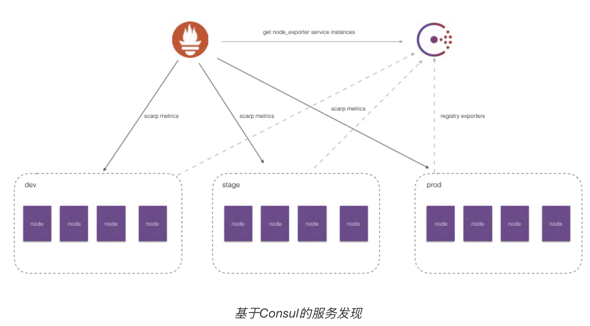

# Prometheus服务发现

作为下一代监控系统的首选解决方案，Prometheus对云以及容器环境下的监控场景提供了完善的支持。


## 云场景

在基于云(IaaS或者CaaS)的基础设施环境中用户可以像使用水、电一样按需使用各种资源（计算、网络、存储）。按需使用就意味着资源的动态性，这些资源可以随着需求规模的变化而变化。例如在AWS中就提供了专门的AutoScall服务，可以根据用户定义的规则动态地创建或者销毁EC2实例，从而使用户部署在AWS上的应用可以自动的适应访问规模的变化。

这种按需的资源使用方式对于监控系统而言就意味着没有了一个固定的监控目标，所有的监控对象(基础设施、应用、服务)都在动态的变化。对于Nagias这类基于Push模式传统监控软件就意味着必须在每一个节点上安装相应的Agent程序，并且通过配置指向中心的Nagias服务，受监控的资源与中心监控服务器之间是一个强耦合的关系，要么直接将Agent构建到基础设施镜像当中，要么使用一些自动化配置管理工具(如Ansible、Chef)动态的配置这些节点。当然实际场景下除了基础设施的监控需求以外，还需要监控在云上部署的应用，中间件等等各种各样的服务。要搭建起这样一套中心化的监控系统实施成本和难度是显而易见的。

而对于Prometheus这一类基于Pull模式的监控系统，显然也无法继续使用的static_configs的方式静态的定义监控目标。而对于Prometheus而言其解决方案就是引入一个中间的代理人（服务注册中心），这个代理人掌握着当前所有监控目标的访问信息，Prometheus只需要向这个代理人询问有哪些监控目标控即可， 这种模式被称为服务发现。


在不同的场景下，会有不同的东西扮演者代理人（服务发现与注册中心）这一角色。比如在AWS公有云平台或者OpenStack的私有云平台中，由于这些平台自身掌握着所有资源的信息，此时这些云平台自身就扮演了代理人的角色。Prometheus通过使用平台提供的API就可以找到所有需要监控的云主机。**在Kubernetes这类容器管理平台中，Kubernetes掌握并管理着所有的容器以及服务信息，那此时Prometheus只需要与Kubernetes打交道就可以找到所有需要监控的容器以及服务对象。**Prometheus还可以直接与一些开源的服务发现工具进行集成，例如在微服务架构的应用程序中，经常会使用到例如Consul这样的服务发现注册软件，Promethues也可以与其集成从而动态的发现需要监控的应用服务实例。除了与这些平台级的公有云、私有云、容器云以及专门的服务发现注册中心集成以外，Prometheus还支持基于DNS以及文件的方式动态发现监控目标，从而大大的减少了在云原生，微服务以及云模式下监控实施难度。

相较于Push模式，Pull模式的优点可以简单总结为以下几点：

- 只要Exporter在运行，可以在任何地方（比如在本地），搭建监控系统；
- 可以更容易的查看监控目标实例的健康状态，并且可以快速定位故障；
- 更利于构建DevOps文化的团队；
- 松耦合的架构模式更适合于云原生的部署环境。


## 基于文件的服务发现

**在Prometheus支持的众多服务发现的实现方式中，基于文件的服务发现是最通用的方式**。这种方式不需要依赖于任何的平台或者第三方服务。对于Prometheus而言也不可能支持所有的平台或者环境。通过基于文件的服务发现方式下，Prometheus会定时从文件中读取最新的Target信息，因此，可以通过任意的方式将监控Target的信息写入即可。

用户可以通过JSON或者YAML格式的文件，定义所有的监控目标。例如，在下面的JSON文件中分别定义了3个采集任务，以及每个任务对应的Target列表：

```json
[
  {
    "targets": [ "localhost:8080"],
    "labels": {
      "env": "localhost",
      "job": "cadvisor"
    }
  },
  {
    "targets": [ "localhost:9104" ],
    "labels": {
      "env": "prod",
      "job": "mysqld"
    }
  },
  {
    "targets": [ "localhost:9100"],
    "labels": {
      "env": "prod",
      "job": "node"
    }
  }
]
```

同时还可以通过为这些实例添加一些额外的标签信息，例如使用env标签标示当前节点所在的环境，这样从这些实例中采集到的样本信息将包含这些标签信息，从而可以通过该标签按照环境对数据进行统计。

Prometheus配置文件：

```yml
global:
  scrape_interval: 15s
  scrape_timeout: 10s
  evaluation_interval: 15s
scrape_configs:
- job_name: 'file_ds'
  file_sd_configs:
    - files:
      - target.json
```

这里定义了一个基于file_sd_configs的监控采集任务，其中模式的任务名称为file_ds。在JSON文件中可以使用job标签覆盖默认的job名称，此时启动Prometheus服务：

```sh
# 记得把 target 文件拷贝到相同的路径下
docker cp $PWD/Documents/docker/prometheus/target.json prometheus:/etc/prometheus/target.json
```

在Prometheus UI的Targets下就可以看到当前从targets.json文件中动态获取到的Target实例信息以及监控任务的采集状态，同时在Labels列下会包含用户添加的自定义标签:


Prometheus默认每5m重新读取一次文件内容，当需要修改时，可以通过refresh_interval进行设置，例如：

```yml
- job_name: 'file_ds'
  file_sd_configs:
    - refresh_interval: 1m
      files:
      	- target.json
```

通过这种方式，Prometheus会自动的周期性读取文件中的内容。当文件中定义的内容发生变化时，不需要对Prometheus进行任何的重启操作。

这种通用的方式可以衍生了很多不同的玩法，比如与自动化配置管理工具(Ansible)结合、与Cron Job结合等等。 对于一些Prometheus还不支持的云环境，比如国内的阿里云、腾讯云等也可以使用这种方式通过一些自定义程序与平台进行交互自动生成监控Target文件，从而实现对这些云环境中基础设施的自动化监控支持。

> 此外，可以基于一些服务注册与发现的软件来与 prometheus 集成，这里不尝试了


## 服务发现与Relabeling

通过服务发现的方式，管理员可以在不重启Prometheus服务的情况下动态的发现需要监控的Target实例信息。



如上图所示，对于线上环境可能会划分为:dev, stage, prod不同的集群。每一个集群运行多个主机节点，每个服务器节点上运行一个Node Exporter实例。Node Exporter实例会自动注册到Consul中，而Prometheus则根据Consul返回的Node Exporter实例信息动态的维护Target列表，从而向这些Target轮询监控数据。

然而，如果可能还需要：

- 按照不同的环境dev, stage, prod聚合监控数据？
- 对于研发团队而言，可能只关心dev环境的监控数据，如何处理？
- 如果为每一个团队单独搭建一个Prometheus Server。那么如何让不同团队的Prometheus Server采集不同的环境监控数据？

面对以上这些场景下的需求时，实际上是希望Prometheus Server能够按照某些规则（比如标签）从服务发现注册中心返回的Target实例中有选择性的采集某些Exporter实例的监控数据。

Prometheus强大的Relabel机制上场！！！


### Relabeling机制

在Prometheus所有的Target实例中，都包含一些默认的Metadata标签信息。可以通过Prometheus UI的Targets页面中查看这些实例的Metadata标签的内容：


默认情况下，当Prometheus加载Target实例完成后，这些Target时候都会包含一些默认的标签：

- `__address__`：当前Target实例的访问地址`<host>:<port>`
- `__scheme__`：采集目标服务访问地址的HTTP Scheme，HTTP或者HTTPS
- `__metrics_path__`：采集目标服务访问地址的访问路径
- `__param_<name>`：采集任务目标服务的中包含的请求参数

上面这些标签将会告诉Prometheus如何从该Target实例中获取监控数据。除了这些默认的标签以外，还可以为Target添加自定义的标签，例如，在“基于文件的服务发现”中，通过JSON配置文件，为Target实例添加了自定义标签env，如下所示该标签最终也会保存到从该实例采集的样本数据中：

```
node_cpu_seconds_total{cpu="0", env="prod", instance="host.docker.internal:9100", job="node", mode="idle"}
```

一般来说，Target以`__`作为前置的标签是在系统内部使用的，因此这些标签不会被写入到样本数据中。不过这里有一些例外，例如，所有通过Prometheus采集的样本数据中都会包含一个名为instance的标签，该标签的内容对应到Target实例的`__address__`。 这里实际上是发生了一次标签的重写处理。

这种发生在采集样本数据之前，对Target实例的标签进行重写的机制在Prometheus被称为Relabeling。


Prometheus允许用户在采集任务设置中通过relabel_configs来添加自定义的Relabeling过程。


### 使用replace/labelmap重写标签

Relabeling最基本的应用场景就是基于Target实例中包含的metadata标签，动态的添加或者覆盖标签。例如，通过Consul动态发现的服务实例还会包含以下Metadata标签信息：

- __meta_consul_address：consul地址
- __meta_consul_dc：consul中服务所在的数据中心
- __meta_consulmetadata：服务的metadata
- __meta_consul_node：服务所在consul节点的信息
- __meta_consul_service_address：服务访问地址
- __meta_consul_service_id：服务ID
- __meta_consul_service_port：服务端口
- __meta_consul_service：服务名称
- __meta_consul_tags：服务包含的标签信息

在默认情况下，从Node Exporter实例采集上来的样本数据如下所示：

```
node_cpu_seconds_total{cpu="cpu0",instance="localhost:9100",job="node",mode="idle"} 93970.8203125
```

我们希望能有一个额外的标签dc可以表示该样本所属的数据中心：

```
node_cpu_seconds_total{cpu="cpu0",instance="localhost:9100",job="node",mode="idle", dc="dc1"} 93970.8203125
```

在每一个采集任务的配置中可以添加多个relabel_config配置，一个最简单的relabel配置如下：

```yml
scrape_configs:
  - job_name: node_exporter
    consul_sd_configs:
      - server: localhost:8500
        services:
          - node_exporter
    relabel_configs:
      - source_labels:  ["__meta_consul_dc"]
        target_label: "dc"
```

完整的relabel_config配置如下所示：

```yml
# The source labels select values from existing labels. Their content is concatenated
# using the configured separator and matched against the configured regular expression
# for the replace, keep, and drop actions.
[ source_labels: '[' <labelname> [, ...] ']' ]

# Separator placed between concatenated source label values.
[ separator: <string> | default = ; ]

# Label to which the resulting value is written in a replace action.
# It is mandatory for replace actions. Regex capture groups are available.
[ target_label: <labelname> ]

# Regular expression against which the extracted value is matched.
[ regex: <regex> | default = (.*) ]

# Modulus to take of the hash of the source label values.
[ modulus: <uint64> ]

# Replacement value against which a regex replace is performed if the
# regular expression matches. Regex capture groups are available.
[ replacement: <string> | default = $1 ]

# Action to perform based on regex matching.
[ action: <relabel_action> | default = replace ]
```

其中action定义了当前relabel_config对Metadata标签的处理方式，**默认的action行为为replace。** replace行为会根据regex的配置匹配source_labels标签的值（多个source_label的值会按照separator进行拼接），并且将匹配到的值写入到target_label当中，如果有多个匹配组，则可以使用 `${1}`,  `${2}`确定写入的内容。如果没匹配到任何内容则不对target_label进行重新。

repalce操作允许用户根据Target的Metadata标签重写或者写入新的标签键值对，在多环境的场景下，可以帮助用户添加与环境相关的特征维度，从而可以更好的对数据进行聚合。

除了使用replace以外，还可以定义action的配置为labelmap。与replace不同的是，labelmap会根据regex的定义去匹配Target实例所有标签的名称，并且以匹配到的内容为新的标签名称，其值作为新标签的值。

例如，在监控Kubernetes下所有的主机节点时，为将这些节点上定义的标签写入到样本中时，可以使用如下relabel_config配置：

```yml
- job_name: 'kubernetes-nodes'
  kubernetes_sd_configs:
    - role: node
    relabel_configs:
      - action: labelmap
        regex: __meta_kubernetes_node_label_(.+)
```

而使用labelkeep或者labeldrop则可以对Target标签进行过滤，仅保留符合过滤条件的标签，例如：

```yml
relabel_configs:
  - regex: label_should_drop_(.+)
    action: labeldrop
```

该配置会使用regex匹配当前Target实例的所有标签，并将符合regex规则的标签从Target实例中移除。labelkeep正好相反，会移除那些不匹配regex定义的所有标签。

### 使用keep/drop过滤Target实例

现在看第二个问题，使用中心化的服务发现注册中心时，所有环境的Exporter实例都会注册到该服务发现注册中心中。而不同职能（开发、测试、运维）的人员可能只关心其中一部分的监控数据，他们可能各自部署的自己的Prometheus Server用于监控自己关心的指标数据，如果让这些Prometheus Server采集所有环境中的所有Exporter数据显然会存在大量的资源浪费。如何让这些不同的Prometheus Server采集各自关心的内容？答案还是Relabeling，relabel_config的action除了默认的replace以外，还支持keep/drop行为。例如，如果只希望采集数据中心dc1中的Node Exporter实例的样本数据，那么可以使用如下配置：

```yml
scrape_configs:
  - job_name: node_exporter
    consul_sd_configs:
      - server: localhost:8500
        services:
          - node_exporter
    relabel_configs:
      - source_labels:  ["__meta_consul_dc"]
        regex: "dc1"
        action: keep
```

当action设置为keep时，Prometheus会丢弃source_labels的值中没有匹配到regex正则表达式内容的Target实例，而当action设置为drop时，则会丢弃那些source_labels的值匹配到regex正则表达式内容的Target实例。可以简单理解为keep用于选择，而drop用于排除。


### 使用hashmod计算source_labels的Hash值

当relabel_config设置为hashmod时，Prometheus会根据modulus的值作为系数，计算source_labels值的hash值。例如：

```yml
scrape_configs
- job_name: 'file_ds'
  relabel_configs:
    - source_labels: [__address__]
      modulus:       4
      target_label:  tmp_hash
      action:        hashmod
  file_sd_configs:
    - files:
      - targets.json
```

根据当前Target实例`__address__`的值以4作为系数，这样每个Target实例都会包含一个新的标签tmp_hash，并且该值的范围在1~4之间，每一个Target实例都包含了一个新的tmp_hash值。

在“Prometheus高可用”小节中，正是利用了Hashmod的能力在Target实例级别实现对采集任务的功能分区的:

```yml
scrape_configs:
  - job_name: some_job
    relabel_configs:
    - source_labels: [__address__]
      modulus:       4
      target_label:  __tmp_hash
      action:        hashmod
    - source_labels: [__tmp_hash]
      regex:         ^1$
      action:        keep
```

这里需要注意的是，如果relabel的操作只是为了产生一个临时变量，以作为下一个relabel操作的输入，那么可以使用`__tmp`作为标签名的前缀，通过该前缀定义的标签就不会写入到Target或者采集到的样本的标签中。

