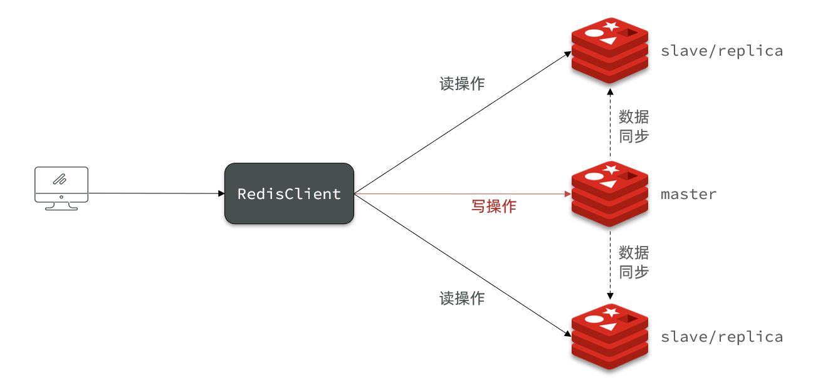
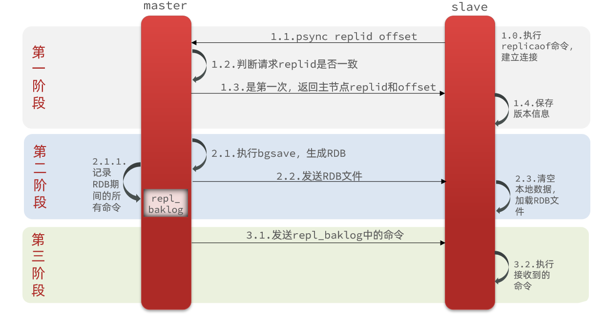
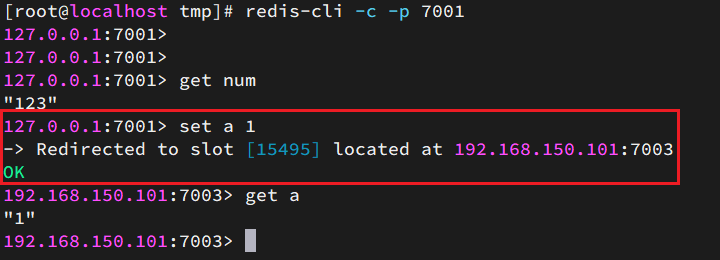

# Redis高级

## 0分布式缓存

单机的Redis存在四大问题：


### 0.1.Redis持久化

Redis有两种持久化方案：

- RDB持久化
- AOF持久化

#### RDB持久化

RDB全称Redis Database Backup file（Redis数据备份文件），也被叫做Redis数据快照。简单来说就是把内存中的所有数据都记录到磁盘中。当Redis实例故障重启后，从磁盘读取快照文件，恢复数据。快照文件称为RDB文件，默认是保存在当前运行目录。

##### 执行时机

RDB持久化在四种情况下会执行：

- 执行save命令
- 执行bgsave命令
- Redis停机时
- 触发RDB条件时

**1）save命令**

执行下面的命令，可以立即执行一次RDB：


save命令会导致主进程执行RDB，这个过程中其它所有命令都会被阻塞。只有在数据迁移时可能用到。

**2）bgsave命令**

下面的命令可以异步执行RDB：


这个命令执行后会开启独立进程完成RDB，主进程可以持续处理用户请求，不受影响。

**3）停机时**

Redis停机时会执行一次save命令，实现RDB持久化。

**4）触发RDB条件**

Redis内部有触发RDB的机制，可以在redis.conf文件中找到，格式如下：

```properties
# 900秒内，如果至少有1个key被修改，则执行bgsave ， 如果是save "" 则表示禁用RDB
save 900 1  
save 300 10  
save 60 10000 
```

RDB的其它配置也可以在redis.conf文件中设置：

```properties
# 是否压缩 ,建议不开启，压缩也会消耗cpu，磁盘的话不值钱
rdbcompression yes
# RDB文件名称
dbfilename dump.rdb  
# 文件保存的路径目录
dir ./ 
```


##### RDB原理

bgsave开始时会fork主进程得到子进程，子进程共享主进程的内存数据。完成fork后读取内存数据并写入 RDB 文件。

fork采用的是copy-on-write技术：

- 当主进程执行读操作时，访问共享内存；
- 当主进程执行写操作时，则会拷贝一份数据，执行写操作。


##### 小结

RDB方式bgsave的基本流程？

- fork主进程得到一个子进程，共享内存空间
- 子进程读取内存数据并写入新的RDB文件
- 用新RDB文件替换旧的RDB文件

RDB会在什么时候执行？save 60 1000代表什么含义？

- 默认是服务停止时
- 代表60秒内至少执行1000次修改则触发RDB

RDB的缺点？

- RDB执行间隔时间长，两次RDB之间写入数据有丢失的风险
- fork子进程、压缩、写出RDB文件都比较耗时


#### AOF持久化

##### AOF原理

AOF全称为Append Only File（追加文件）。Redis处理的每一个写命令都会记录在AOF文件，可以看做是命令日志文件。

##### AOF配置

AOF默认是关闭的，需要修改redis.conf配置文件来开启AOF：

```properties
# 是否开启AOF功能，默认是no
appendonly yes
# AOF文件的名称
appendfilename "appendonly.aof"
```

AOF的命令记录的频率也可以通过redis.conf文件来配：

```properties
# 表示每执行一次写命令，立即记录到AOF文件
appendfsync always 
# 写命令执行完先放入AOF缓冲区，然后表示每隔1秒将缓冲区数据写到AOF文件，是默认方案
appendfsync everysec 
# 写命令执行完先放入AOF缓冲区，由操作系统决定何时将缓冲区内容写回磁盘
appendfsync no
```

三种策略对比：


##### AOF文件重写

因为是记录命令，AOF文件会比RDB文件大的多。而且AOF会记录对同一个key的多次写操作，但只有最后一次写操作才有意义。通过执行bgrewriteaof命令，可以让AOF文件执行重写功能，用最少的命令达到相同效果。


Redis也会在触发阈值时自动去重写AOF文件。阈值也可以在redis.conf中配置：

```properties
# AOF文件比上次文件 增长超过多少百分比则触发重写
auto-aof-rewrite-percentage 100
# AOF文件体积最小多大以上才触发重写 
auto-aof-rewrite-min-size 64mb 
```

#### RDB与AOF对比

RDB和AOF各有自己的优缺点，如果对数据安全性要求较高，在实际开发中往往会**结合**两者来使用。


### 0.2.Redis主从

#### 搭建



新建三个文件夹，然后复制三份配置文件，修改配置文件的内容

修改每个文件夹内的配置文件，将端口分别修改为7001、7002、7003，将rdb文件保存位置都修改为自己所在目录；修改每个实例的声明IP，在redis.conf文件中指定每一个实例的绑定ip信息，格式如下：

```properties
# redis实例的声明 IP
replica-announce-ip 192.168.150.101
```

启动，打开3个ssh窗口，分别启动3个redis实例，启动命令：

```sh
# 第1个
redis-server 700x/redis.conf
```

开启主从关系

现在三个实例还没有任何关系，要配置主从可以使用replicaof 或者slaveof（5.0以前）命令。

有临时和永久两种模式：

- 修改配置文件（永久生效）

  - 在redis.conf中添加一行配置：```slaveof <masterip> <masterport>```

- 使用redis-cli客户端连接到redis服务，执行slaveof命令（重启后失效）：

  ```sh
  slaveof <masterip> <masterport>
  ```

<strong><font color='red'>注意</font></strong>：在5.0以后新增命令replicaof，与salveof效果一致。

通过redis-cli命令连接7002，执行下面命令：

```sh
# 连接 7002
redis-cli -p 7002
# 执行slaveof
slaveof 192.168.150.101 7001
```

然后连接 7001节点，查看集群状态：

```sh
# 连接 7001
redis-cli -p 7001
# 查看状态
info replication
```

结果：


#### 主从数据同步原理

##### 全量同步

主从第一次建立连接时，会执行**全量同步**，将master节点的所有数据都拷贝给slave节点，流程：


master得知salve第一次连接判断依据：

- **Replication Id**：简称replid，是数据集的标记，id一致则说明是同一数据集。每一个master都有唯一的replid，slave则会继承master节点的replid
- **offset**：偏移量，随着记录在repl_baklog中的数据增多而逐渐增大。slave完成同步时也会记录当前同步的offset。如果slave的offset小于master的offset，说明slave数据落后于master，需要更新。

因此slave做数据同步，必须向master声明自己的replication id 和offset，master才可以判断到底需要同步哪些数据。

因为slave原本也是一个master，有自己的replid和offset，当第一次变成slave，与master建立连接时，发送的replid和offset是自己的replid和offset。

master判断发现slave发送来的replid与自己的不一致，说明这是一个全新的slave，就知道要做全量同步了。

master会将自己的replid和offset都发送给这个slave，slave保存这些信息。以后slave的replid就与master一致了。

因此，**master判断一个节点是否是第一次同步的依据，就是看replid是否一致**。

如图：



##### 增量同步

全量同步需要先做RDB，然后将RDB文件通过网络传输个slave，成本太高。因此除了第一次做全量同步，其它大多数时候slave与master都是做**增量同步**。

什么是增量同步？就是只更新slave与master存在差异的部分数据。如图：


##### repl_backlog原理

这个文件是一个固定大小的数组，只不过数组是环形，也就是说**角标到达数组末尾后，会再次从0开始读写**，这样数组头部的数据就会被覆盖。

repl_baklog中会记录Redis处理过的命令日志及offset，包括master当前的offset，和slave已经拷贝到的offset：

 

slave与master的offset之间的差异，就是salve需要增量拷贝的数据。

但是，如果slave出现网络阻塞，导致master的offset远远超过了slave的offset，master继续写入新数据，其offset就会覆盖旧的数据，直到将slave现在的offset也覆盖：

 

此时如果slave恢复，需要同步，却发现自己的offset都没有了，无法完成增量同步了。只能做全量同步。


##### 主从同步优化

可以从以下几个方面来优化Redis主从就集群：

- 在master中配置repl-diskless-sync yes启用无磁盘复制，避免全量同步时的磁盘IO。
- Redis单节点上的内存占用不要太大，减少RDB导致的过多磁盘IO
- 适当提高repl_baklog的大小，发现slave宕机时尽快实现故障恢复，尽可能避免全量同步
- 限制一个master上的slave节点数量，如果实在是太多slave，则可以采用主-从-从链式结构，减少master压力

主从从架构图：


##### 小结

简述全量同步和增量同步区别？

- 全量同步：master将完整内存数据生成RDB，发送RDB到slave。后续命令则记录在repl_baklog，逐个发送给slave。
- 增量同步：slave提交自己的offset到master，master获取repl_baklog中从offset之后的命令给slave

什么时候执行全量同步？

- slave节点第一次连接master节点时
- slave节点断开时间太久，repl_baklog中的offset已经被覆盖时

什么时候执行增量同步？

- slave节点断开又恢复，并且在repl_baklog中能找到offset时


### 0.3.Redis哨兵

Redis提供了哨兵（Sentinel）机制来实现主从集群的自动故障恢复。

#### 哨兵原理

##### 集群结构和作用

哨兵的结构如图：


哨兵的作用如下：

- **监控**：Sentinel 会不断检查您的master和slave是否按预期工作
- **自动故障恢复**：如果master故障，Sentinel会将一个slave提升为master。当故障实例恢复后也以新的master为主
- **通知**：Sentinel充当Redis客户端的服务发现来源，当集群发生故障转移时，会将最新信息推送给Redis的客户端

##### 集群监控原理

Sentinel基于心跳机制监测服务状态，每隔1秒向集群的每个实例发送ping命令：

•主观下线：如果某sentinel节点发现某实例未在规定时间响应，则认为该实例**主观下线**。

•客观下线：若超过指定数量（quorum）的sentinel都认为该实例主观下线，则该实例**客观下线**。quorum值最好超过Sentinel实例数量的一半。

##### 集群故障恢复原理

一旦发现master故障，sentinel需要在salve中选择一个作为新的master，选择依据是这样的：

- 首先会判断slave节点与master节点断开时间长短，如果超过指定值（down-after-milliseconds * 10）则会排除该slave节点
- 然后判断slave节点的slave-priority值，越小优先级越高，如果是0则永不参与选举
- 如果slave-prority一样，则判断slave节点的offset值，越大说明数据越新，优先级越高
- 最后是判断slave节点的运行id大小，越小优先级越高。

当选出一个新的master后，该如何实现切换呢？

流程如下：

- sentinel给备选的slave1节点发送slaveof no one命令，让该节点成为master
- sentinel给所有其它slave发送slaveof 192.168.150.101 7002 命令，让这些slave成为新master的从节点，开始从新的master上同步数据。
- 最后，sentinel将故障节点标记为slave（直接修改配置文件），当故障节点恢复后会自动成为新的master的slave节点

##### 小结

Sentinel的三个作用是什么？

- 监控
- 故障转移
- 通知

Sentinel如何判断一个redis实例是否健康？

- 每隔1秒发送一次ping命令，如果超过一定时间没有相向则认为是主观下线
- 如果大多数sentinel都认为实例主观下线，则判定服务下线

故障转移步骤有哪些？

- 首先选定一个slave作为新的master，执行slaveof no one
- 然后让所有节点都执行slaveof 新master
- 修改故障节点配置，添加slaveof 新master

##### 搭建

创建三个文件夹，分别创建三个配置文件sentinel.conf，添加下面的内容（port和dir要对应修改）：

```ini
port 27001
sentinel announce-ip 192.168.150.101
sentinel monitor mymaster 192.168.150.101 7001 2
sentinel down-after-milliseconds mymaster 5000
sentinel failover-timeout mymaster 60000
dir "/tmp/s1"
```

- `port 27001`：是当前sentinel实例的端口
- `sentinel monitor mymaster 192.168.150.101 7001 2`：指定主节点信息
  - `mymaster`：主节点名称，自定义，任意写
  - `192.168.150.101 7001`：主节点的ip和端口
  - `2`：选举master时的quorum值

启动

```sh
# 第1个
redis-sentinel s1/sentinel.conf
```


### 0.4.Redis分片集群

#### 搭建分片集群

主从和哨兵可以解决高可用、高并发读的问题。但是依然有两个问题没有解决：

- 海量数据存储问题

- 高并发写的问题

使用分片集群可以解决上述问题，如图:


分片集群特征：

- 集群中有多个master，每个master保存不同数据

- 每个master都可以有多个slave节点

- master之间通过ping监测彼此健康状态

- 客户端请求可以访问集群任意节点，最终都会被转发到正确节点

> 创建

创建6个文件夹以及配置文件(实例不同，配置文件需要相应修改)

```properties
port 6379
# 开启集群功能
cluster-enabled yes
# 集群的配置文件名称，不需要我们创建，由redis自己维护
cluster-config-file /tmp/6379/nodes.conf
# 节点心跳失败的超时时间
cluster-node-timeout 5000
# 持久化文件存放目录
dir /tmp/6379
# 绑定地址
bind 0.0.0.0
# 让redis后台运行
daemonize yes
# 注册的实例ip
replica-announce-ip 192.168.150.101
# 保护模式
protected-mode no
# 数据库数量
databases 1
# 日志
logfile /tmp/6379/run.log
```

一键启动所有服务

```bash
# 一键启动所有服务
printf '%s\n' 7001 7002 7003 8001 8002 8003 | xargs -I{} -t redis-server {}/redis.conf
# 一键关闭
printf '%s\n' 7001 7002 7003 8001 8002 8003 | xargs -I{} -t redis-cli -p {} shutdown
```

Redis6.2.4版本，集群管理以及集成到了redis-cli中，格式如下：

```sh
redis-cli --cluster create --cluster-replicas 1 192.168.150.101:7001 192.168.150.101:7002 192.168.150.101:7003 192.168.150.101:8001 192.168.150.101:8002 192.168.150.101:8003
```

命令说明：

- `redis-cli --cluster`或者`./redis-trib.rb`：代表集群操作命令
- `create`：代表是创建集群
- `--replicas 1`或者`--cluster-replicas 1` ：指定集群中每个master的副本个数为1，此时`节点总数 ÷ (replicas + 1)` 得到的就是master的数量。因此节点列表中的前n个就是master，其它节点都是slave节点，随机分配到不同master

运行后的样子：


这里输入yes，则集群开始创建：


通过命令可以查看集群状态：

```sh
redis-cli -p 7001 cluster nodes
```


集群操作时，需要给`redis-cli`加上`-c`参数才可以：

```sh
redis-cli -c -p 7001
```



#### 散列插槽

##### 插槽原理

Redis会把每一个master节点映射到0~16383共16384个插槽（hash slot）上，查看集群信息时就能看到：


数据key不是与节点绑定，而是与插槽绑定。redis会根据key的有效部分计算插槽值，分两种情况：

- key中包含"{}"，且“{}”中至少包含1个字符，“{}”中的部分是有效部分
- key中不包含“{}”，整个key都是有效部分

例如：key是num，那么就根据num计算，如果是{itcast}num，则根据itcast计算。计算方式是利用CRC16算法得到一个hash值，然后对16384取余，得到的结果就是slot值。

 

如图，在7001这个节点执行set a 1时，对a做hash运算，对16384取余，得到的结果是15495，因此要存储到103节点。到了7003后，执行`get num`时，对num做hash运算，对16384取余，得到的结果是2765，因此需要切换到7001节点

##### 小结

Redis如何判断某个key应该在哪个实例？

- 将16384个插槽分配到不同的实例
- 根据key的有效部分计算哈希值，对16384取余
- 余数作为插槽，寻找插槽所在实例即可

如何将同一类数据固定的保存在同一个Redis实例？

- 这一类数据使用相同的有效部分，例如key都以{typeId}为前缀


#### 集群伸缩

redis-cli --cluster提供了很多操作集群的命令，可以通过下面方式查看：

```bash
redis-cli --cluster help
```

##### 需求分析

需求：向集群中添加一个新的master节点，并向其中存储 num = 10

- 启动一个新的redis实例，端口为7004
- 添加7004到之前的集群，并作为一个master节点
- 给7004节点分配插槽，使得num这个key可以存储到7004实例

这里需要两个新的功能：

- 添加一个节点到集群中
- 将部分插槽分配到新插槽

##### 实现

创建新的实例，并启动，然后添加新节点到redis集群


执行命令：

```sh
redis-cli --cluster add-node  192.168.150.101:7004 192.168.150.101:7001
```

通过命令查看集群状态：

```sh
redis-cli -p 7001 cluster nodes
```

可以观察到7004默认为master节点，并且没有插槽

接下来移动插槽

```bash
redis-cli --cluster reshard 192.168.150.101:7001
```

然后根据提示，填写需要移动的插槽个数和移动插槽的源节点和目标节点ID，即可完成

最后可以通过上面的命令查看集群，可以发现7004已经有插槽了。接下里就可以读数据和写数据了


#### 故障转移

##### 原理

Redis分片集群有自动故障转移处理，他会自动检测节点存活，并重新选举

利用cluster failover命令也可以手动让集群中的某个master宕机，切换到执行cluster failover命令的这个slave节点，实现无感知的数据迁移。其流程如下：


这种failover命令可以指定三种模式：

- 缺省：默认的流程，如图1~6歩
- force：省略了对offset的一致性校验
- takeover：直接执行第5歩，忽略数据一致性、忽略master状态和其它master的意见

如：对7002slave节点执行该命令，他之后会称为master节点，原来的master会变成slave


##### RedisTemplate访问分片集群

RedisTemplate底层同样基于lettuce实现了分片集群的支持，而使用的步骤与哨兵模式基本一致：

1）引入redis的starter依赖

2）配置分片集群地址

3）配置读写分离

与哨兵模式相比，其中只有分片集群的配置方式略有差异，如下：

```yaml
spring:
  redis:
    cluster:
      nodes:
        - 192.168.150.101:7001
        - 192.168.150.101:7002
        - 192.168.150.101:7003
        - 192.168.150.101:8001
        - 192.168.150.101:8002
        - 192.168.150.101:8003
```


## 1.多级缓存

传统的缓存策略一般是请求到达Tomcat后，先查询Redis，如果未命中则查询数据库，如图：


存在下面的问题：

- 请求要经过Tomcat处理，Tomcat的性能成为整个系统的瓶颈

- Redis缓存失效时，会对数据库产生冲击


多级缓存就是充分利用请求处理的每个环节，分别添加缓存，减轻Tomcat压力，提升服务性能：

- 浏览器访问静态资源时，优先读取浏览器本地缓存
- 访问非静态资源（ajax查询数据）时，访问服务端
- 请求到达Nginx后，优先读取Nginx本地缓存
- 如果Nginx本地缓存未命中，则去直接查询Redis（不经过Tomcat）
- 如果Redis查询未命中，则查询Tomcat
- 请求进入Tomcat后，优先查询JVM进程缓存
- 如果JVM进程缓存未命中，则查询数据库

可见，多级缓存的关键有两个：

- 一个是在nginx中编写业务，实现nginx本地缓存、Redis、Tomcat的查询

- 另一个就是在Tomcat中实现JVM进程缓存

在多级缓存架构中，Nginx内部需要编写本地缓存查询、Redis查询、Tomcat查询的业务逻辑，因此这样的nginx服务不再是一个**反向代理服务器**，而是一个编写**业务的Web服务器了**。Nginx编程则会用到OpenResty框架结合Lua这样的语言。


### 1.1.JVM进程缓存

#### Caffeine

缓存在日常开发中启动至关重要的作用，由于是存储在内存中，数据的读取速度是非常快的，能大量减少对数据库的访问，减少数据库的压力。缓存分为两类：

- 分布式缓存，例如Redis：
  - 优点：存储容量更大、可靠性更好、可以在集群间共享
  - 缺点：访问缓存有网络开销
  - 场景：缓存数据量较大、可靠性要求较高、需要在集群间共享
- 进程本地缓存，例如HashMap、GuavaCache：
  - 优点：读取本地内存，没有网络开销，速度更快
  - 缺点：存储容量有限、可靠性较低、无法共享
  - 场景：性能要求较高，缓存数据量较小

**Caffeine**是一个基于Java8开发的，提供了近乎最佳命中率的高性能的本地缓存库。目前Spring内部的缓存使用的就是Caffeine。GitHub地址：https://github.com/ben-manes/caffeine

Caffeine既然是缓存的一种，肯定需要有缓存的清除策略，不然的话内存总会有耗尽的时候。

Caffeine提供了三种缓存驱逐策略：

- **基于容量**：设置缓存的数量上限

  ```java
  // 创建缓存对象
  Cache<String, String> cache = Caffeine.newBuilder()
      .maximumSize(1) // 设置缓存大小上限为 1
      .build();
  ```

- **基于时间**：设置缓存的有效时间

  ```java
  // 创建缓存对象
  Cache<String, String> cache = Caffeine.newBuilder()
      // 设置缓存有效期为 10 秒，从最后一次写入开始计时 
      .expireAfterWrite(Duration.ofSeconds(10)) 
      .build();
  ```

- **基于引用**：设置缓存为软引用或弱引用，利用GC来回收缓存数据。性能较差，不建议使用。

> **注意**：在默认情况下，当一个缓存元素过期的时候，Caffeine不会自动立即将其清理和驱逐。而是在一次读或写操作后，或者在空闲时间完成对失效数据的驱逐。

基本API

```java
@Test
void testBasicOps() {
  // 构建cache对象
  Cache<String, String> cache = Caffeine.newBuilder().build();
  // 存数据
  cache.put("gf", "xx");
  // 取数据
  String gf = cache.getIfPresent("gf");
  // 取数据，包含两个参数：
  // 参数一：缓存的key
  // 参数二：Lambda表达式，表达式参数就是缓存的key，方法体是查询数据库的逻辑
  // 优先根据key查询JVM缓存，如果未命中，则执行参数二的Lambda表达式
  String defaultGF = cache.get("defaultGF", key -> {
    // 根据key去数据库查询数据
    return "xx";
  });
}
```


#### 实现

首先，我们需要定义两个Caffeine的缓存对象，分别保存商品、库存的缓存数据。

```java
@Configuration
public class CaffeineConfig {
  @Bean
  public Cache<Long, Item> itemCache(){
    return Caffeine.newBuilder()
      .initialCapacity(100)
      .maximumSize(10_000)
      .build();
  }
  @Bean
  public Cache<Long, ItemStock> stockCache(){
    return Caffeine.newBuilder()
      .initialCapacity(100)
      .maximumSize(10_000)
      .build();
  }
}
```

使用缓存

```java
@RestController
@RequestMapping("item")
public class ItemController {
  @Autowired
  private IItemService itemService;
  @Autowired
  private IItemStockService stockService;
  @Autowired
  private Cache<Long, Item> itemCache;
  @Autowired
  private Cache<Long, ItemStock> stockCache;

  @GetMapping("/{id}")
  public Item findById(@PathVariable("id") Long id) {
    return itemCache.get(id, key -> itemService.query()
                         .ne("status", 3).eq("id", key)
                         .one()
                        );
  }

  @GetMapping("/stock/{id}")
  public ItemStock findStockById(@PathVariable("id") Long id) {
    return stockCache.get(id, key -> stockService.getById(key));
  }
}
```


### 1.2.Lua入门

Lua 是一种轻量小巧的脚本语言，用标准C语言编写并以源代码形式开放， 其设计目的是为了嵌入应用程序中，从而为应用程序提供灵活的扩展和定制功能。官网：https://www.lua.org/

Lua经常嵌入到C语言开发的程序中，例如游戏开发、游戏插件等。

Nginx本身也是C语言开发，因此也允许基于Lua做拓展。

#### 数据类型

Lua中支持的常见数据类型包括：


另外，Lua提供了type()函数来判断一个变量的数据类型.


#### 声明变量

Lua声明变量的时候无需指定数据类型，而是用local来声明变量为局部变量：

```lua
-- 声明字符串，可以用单引号或双引号，
local str = 'hello'
-- 字符串拼接可以使用 ..
local str2 = 'hello' .. 'world'
-- 声明数字
local num = 21
-- 声明布尔类型
local flag = true
```

Lua中的table类型既可以作为数组，又可以作为Java中的map来使用。数组就是特殊的table，key是数组角标而已：

```lua
-- 声明数组 ，key为角标的 table
local arr = {'java', 'python', 'lua'}
-- 声明table，类似java的map
local map =  {name='Jack', age=21}
-- 访问数组，lua数组的角标从1开始
print(arr[1])
-- 访问table
print(map['name'])
print(map.name)
```

#### 循环

遍历数组：

```lua
-- 声明数组 key为索引的 table
local arr = {'java', 'python', 'lua'}
-- 遍历数组
for index,value in ipairs(arr) do
    print(index, value) 
end
```

遍历普通table

```lua
-- 声明map，也就是table
local map = {name='Jack', age=21}
-- 遍历table
for key,value in pairs(map) do
   print(key, value) 
end
```

#### 条件控制、函数

定义函数的语法：

```lua
function 函数名( argument1, argument2..., argumentn)
    -- 函数体
    return 返回值
end
```

条件控制，例如if、else语法：

```lua
if(布尔表达式)
then
   --[ 布尔表达式为 true 时执行该语句块 --]
else
   --[ 布尔表达式为 false 时执行该语句块 --]
end
```

与java不同，布尔表达式中的逻辑运算是基于英文单词：


### 1.3.实现多级缓存

多级缓存的实现离不开Nginx编程，而Nginx编程又离不开OpenResty。

OpenResty 是一个基于 Nginx的高性能 Web 平台，用于方便地搭建能够处理超高并发、扩展性极高的动态 Web 应用、Web 服务和动态网关。具备下列特点：

- 具备Nginx的完整功能
- 基于Lua语言进行扩展，集成了大量精良的 Lua 库、第三方模块
- 允许使用Lua**自定义业务逻辑**、**自定义库**

官方网站： https://openresty.org/cn/

#### 实现

里面有一些语法和设置啥的，不写了，直接给个文件吧

首先配置请求有lua脚本解析

```nginx
location ~ /api/item/(\d+) {
    # 默认的响应类型
    default_type application/json;
    # 响应结果由lua/item.lua文件来决定
    content_by_lua_file lua/item.lua;
}
```

完整common.lua，工具函数库

```lua
-- 导入redis
local redis = require('resty.redis')
-- 初始化redis
local red = redis:new()
red:set_timeouts(1000, 1000, 1000)

-- 关闭redis连接的工具方法，其实是放入连接池
local function close_redis(red)
    local pool_max_idle_time = 10000 -- 连接的空闲时间，单位是毫秒
    local pool_size = 100 --连接池大小
    local ok, err = red:set_keepalive(pool_max_idle_time, pool_size)
    if not ok then
        ngx.log(ngx.ERR, "放入redis连接池失败: ", err)
    end
end

-- 查询redis的方法 ip和port是redis地址，key是查询的key
local function read_redis(ip, port, key)
    -- 获取一个连接
    local ok, err = red:connect(ip, port)
    if not ok then
        ngx.log(ngx.ERR, "连接redis失败 : ", err)
        return nil
    end
    -- 查询redis
    local resp, err = red:get(key)
    -- 查询失败处理
    if not resp then
        ngx.log(ngx.ERR, "查询Redis失败: ", err, ", key = " , key)
    end
    --得到的数据为空处理
    if resp == ngx.null then
        resp = nil
        ngx.log(ngx.ERR, "查询Redis数据为空, key = ", key)
    end
    close_redis(red)
    return resp
end

-- 封装函数，发送http请求，并解析响应
local function read_http(path, params)
    local resp = ngx.location.capture(path,{
        method = ngx.HTTP_GET,
        args = params,
    })
    if not resp then
        -- 记录错误信息，返回404
        ngx.log(ngx.ERR, "http查询失败, path: ", path , ", args: ", args)
        ngx.exit(404)
    end
    return resp.body
end
-- 将方法导出
local _M = {  
    read_http = read_http,
    read_redis = read_redis
}  
return _M
```

业务文件lua/item.lua

```lua
-- 导入common函数库
local common = require('common')
local read_http = common.read_http
local read_redis = common.read_redis
-- 导入cjson库
local cjson = require('cjson')
-- 导入共享词典，本地缓存
local item_cache = ngx.shared.item_cache

-- 封装查询函数
function read_data(key, expire, path, params)
    -- 查询本地缓存
    local val = item_cache:get(key)
    if not val then
        ngx.log(ngx.ERR, "本地缓存查询失败，尝试查询Redis， key: ", key)
        -- 查询redis
        val = read_redis("127.0.0.1", 6379, key)
        -- 判断查询结果
        if not val then
            ngx.log(ngx.ERR, "redis查询失败，尝试查询http， key: ", key)
            -- redis查询失败，去查询http
            val = read_http(path, params)
        end
        -- 查询成功，把数据写入本地缓存
    		item_cache:set(key, val, expire)
    end
    -- 返回数据
    return val
end

-- 获取路径参数
local id = ngx.var[1]

-- 查询商品信息
local itemJSON = read_data("item:id:" .. id, 1800,  "/item/" .. id, nil)
-- 查询库存信息
local stockJSON = read_data("item:stock:id:" .. id, 60, "/item/stock/" .. id, nil)

-- JSON转化为lua的table
local item = cjson.decode(itemJSON)
local stock = cjson.decode(stockJSON)
-- 组合数据
item.stock = stock.stock
item.sold = stock.sold

-- 把item序列化为json 返回结果
ngx.say(cjson.encode(item))
```

这里面涉及的知识点：

- OpenResty使用lua操作redis
- OpenResty的共享缓存
- OpenResty的网络请求

#### hash负载均衡

然后有集群的话，需要考虑负载均衡，不能采取轮询的方式，否则会造成缓存重复等问题，需要使用hash进行映射，如下：

修改`/usr/local/openresty/nginx/conf/nginx.conf`文件，实现基于ID做负载均衡。

首先，定义tomcat集群，并设置基于路径做负载均衡：

```nginx 
upstream tomcat-cluster {
    hash $request_uri;
    server 192.168.150.1:8081;
    server 192.168.150.1:8082;
}
```

然后，修改对tomcat服务的反向代理，目标指向tomcat集群：

```nginx
location /item {
    proxy_pass http://tomcat-cluster;
}
```

重新加载OpenResty

```sh
nginx -s reload
```

#### OpenResty本地缓存

OpenResty为Nginx提供了**shard dict**的功能，可以在nginx的多个worker之间共享数据，实现缓存功能。

1）开启共享字典，在nginx.conf的http下添加配置：

```nginx
 # 共享字典，也就是本地缓存，名称叫做：item_cache，大小150m
 lua_shared_dict item_cache 150m; 
```

2）操作共享字典：

```lua
-- 获取本地缓存对象
local item_cache = ngx.shared.item_cache
-- 存储, 指定key、value、过期时间，单位s，默认为0代表永不过期
item_cache:set('key', 'value', 1000)
-- 读取
local val = item_cache:get('key')
```

#### nginx发送http

nginx提供了内部API用以发送http请求：

```lua
local resp = ngx.location.capture("/path",{
    method = ngx.HTTP_GET,   -- 请求方式
    args = {a=1,b=2},  -- get方式传参数
})
```

返回的响应内容包括：

- resp.status：响应状态码
- resp.header：响应头，是一个table
- resp.body：响应体，就是响应数据

注意：这里的path是路径，并不包含IP和端口。这个请求会被nginx内部的server监听并处理，也就是请求自己，然后需要写一个反向代理，去请求服务器。

```nginx
location /path {
  proxy_pass http://192.168.150.1:8081; 
}
```

#### OpenResty请求参数处理

OpenResty中提供了一些API用来获取不同类型的前端请求参数：


#### Redis缓存预热

Redis缓存会面临冷启动问题：

**冷启动**：服务刚刚启动时，Redis中并没有缓存，如果所有商品数据都在第一次查询时添加缓存，可能会给数据库带来较大压力。

**缓存预热**：在实际开发中，我们可以利用大数据统计用户访问的热点数据，在项目启动时将这些热点数据提前查询并保存到Redis中。

引入Redis依赖

```xml
<dependency>
    <groupId>org.springframework.boot</groupId>
    <artifactId>spring-boot-starter-data-redis</artifactId>
</dependency>
```

配置Redis地址

```yaml
spring:
  redis:
    host: 192.168.150.101
```

编写初始化类

缓存预热需要在项目启动时完成，并且必须是拿到RedisTemplate之后。这里利用InitializingBean接口来实现，InitializingBean在对象被Spring创建并且成员变量全部注入后执行。

```java
@Component
public class RedisHandler implements InitializingBean {
  @Autowired
  private StringRedisTemplate redisTemplate;
  @Autowired
  private IItemService itemService;
  @Autowired
  private IItemStockService stockService;
	// 处理json
  private static final ObjectMapper MAPPER = new ObjectMapper();

  // 这里查询热点数据即可
  @Override
  public void afterPropertiesSet() throws Exception {
    // 初始化缓存
    // 1.查询商品信息
    List<Item> itemList = itemService.list();
    // 2.放入缓存
    for (Item item : itemList) {
      // 2.1.item序列化为JSON
      String json = MAPPER.writeValueAsString(item);
      // 2.2.存入redis
      redisTemplate.opsForValue().set("item:id:" + item.getId(), json);
    }
  }
}
```

### 1.4.数据同步策略

缓存数据同步的常见方式有三种：

**设置有效期**：给缓存设置有效期，到期后自动删除。再次查询时更新

- 优势：简单、方便
- 缺点：时效性差，缓存过期之前可能不一致
- 场景：更新频率较低，时效性要求低的业务

**同步双写**：在修改数据库的同时，直接修改缓存

- 优势：时效性强，缓存与数据库强一致
- 缺点：有代码侵入，耦合度高；
- 场景：对一致性、时效性要求较高的缓存数据

**异步通知：**修改数据库时发送事件通知，相关服务监听到通知后修改缓存数据

- 优势：低耦合，可以同时通知多个缓存服务
- 缺点：时效性一般，可能存在中间不一致状态
- 场景：时效性要求一般，有多个服务需要同步


而异步实现又可以基于MQ或者Canal来实现：

1）基于MQ的异步通知：


解读：

- 商品服务完成对数据的修改后，只需要发送一条消息到MQ中。
- 缓存服务监听MQ消息，然后完成对缓存的更新

依然有少量的代码侵入。

2）基于Canal的通知


解读：

- 商品服务完成商品修改后，业务直接结束，没有任何代码侵入
- Canal监听MySQL变化，当发现变化后，立即通知缓存服务
- 缓存服务接收到canal通知，更新缓存

代码零侵入

**Canal [kə'næl]**，译意为水道/管道/沟渠，canal是阿里巴巴旗下的一款开源项目，基于Java开发。基于数据库增量日志解析，提供增量数据订阅&消费。GitHub的地址：https://github.com/alibaba/canal

Canal是基于mysql的主从同步来实现的，MySQL主从同步的原理如下：


- 1）MySQL master 将数据变更写入二进制日志( binary log），其中记录的数据叫做binary log events
- 2）MySQL slave 将 master 的 binary log events拷贝到它的中继日志(relay log)
- 3）MySQL slave 重放 relay log 中事件，将数据变更反映它自己的数据

而Canal就是把自己伪装成MySQL的一个slave节点，从而监听master的binary log变化。再把得到的变化信息通知给Canal的客户端（调用函数而已，用户只需要重写函数即可），进而完成对其它数据库的同步。

springboot有与canal结合的客户端，开箱即用。这不写了
