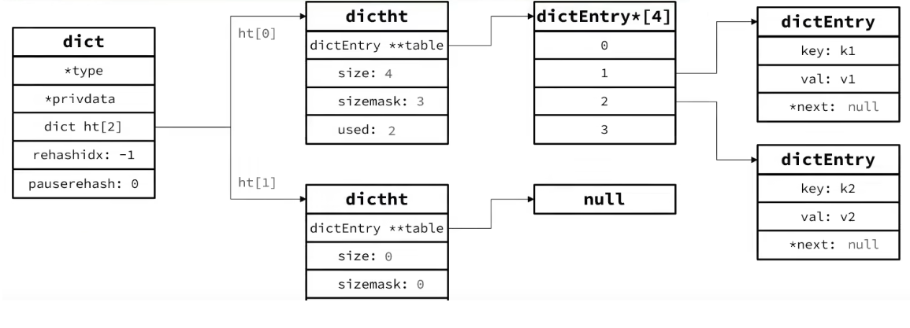
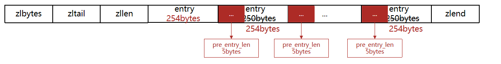
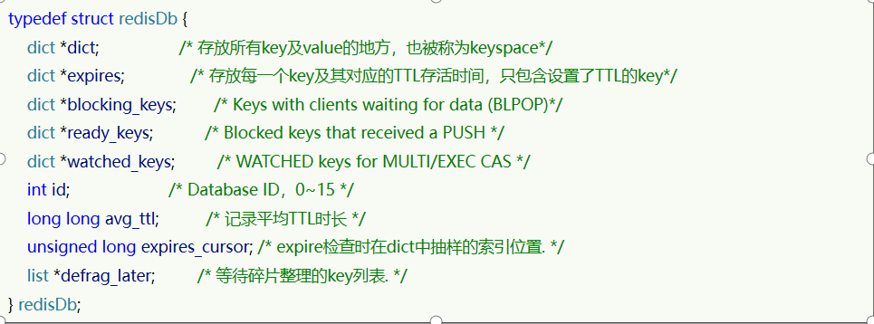
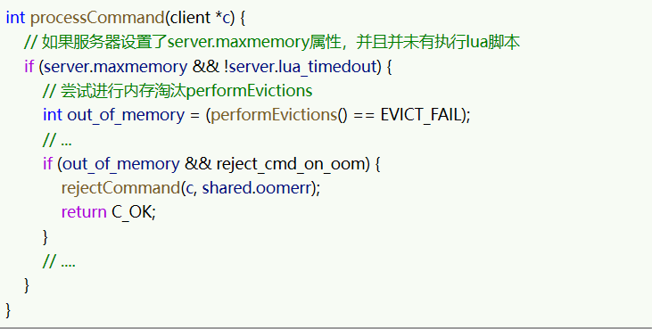

# Redis原理

## 1、Redis数据结构

### 1.1 Redis数据结构-动态字符串

Redis中保存的Key是字符串，value往往是字符串或者字符串的集合。

不过Redis没有直接使用C语言中的字符串，因为C语言字符串存在很多问题：
获取字符串长度的需要通过运算
非二进制安全
不可修改
Redis构建了一种新的字符串结构，称为简单动态字符串（Simple Dynamic String），简称SDS。
例如，我们执行命令：`set name mike`

那么Redis将在底层创建两个SDS，其中一个是包含“name”的SDS，另一个是包含“mike”的SDS。

Redis是C语言实现的，其中SDS是一个结构体，源码如下：

例如，一个包含字符串“name”的sds结构如下：

SDS之所以叫做动态字符串，是因为它具备动态扩容的能力，例如一个内容为“hi”的SDS：

假如我们要给SDS追加一段字符串“,Amy”，这里首先会申请新内存空间：

如果新字符串小于1M，则新空间为扩展后字符串长度的两倍+1；

如果新字符串大于1M，则新空间为扩展后字符串长度+1M+1。称为内存预分配。

### 1.2 Redis数据结构-intset

IntSet是Redis中set集合的一种实现方式，基于整数数组来实现，并且具备长度可变、有序等特征。
结构如下：

其中的encoding包含三种模式，表示存储的整数大小不同：

现在，数组中每个数字都在int16_t的范围内，因此采用的编码方式是INTSET_ENC_INT16，每部分占用的字节大小为：
encoding：4字节
length：4字节
contents：2字节 * 3  = 6字节

如果添加一个数字：50000，这个数字超出了int16_t的范围，intset会自动升级编码方式到合适的大小：

* 升级编码为INTSET_ENC_INT32, 每个整数占4字节，并按照新的编码方式及元素个数扩容数组
* 倒序依次将数组中的元素拷贝到扩容后的正确位置
* 将待添加的元素放入数组末尾
* 最后，将inset的encoding属性改为INTSET_ENC_INT32，将length属性改为4

小总结：

Intset可以看做是特殊的整数数组，具备一些特点：

* Redis会确保Intset中的元素唯一、有序
* 具备类型升级机制，可以节省内存空间
* 底层采用**二分查找**方式来查询

### 1.3 Redis数据结构-Dict

Redis是一个键值型（Key-Value Pair）的数据库，可以根据键实现快速的增删改查。键与值的映射关系通过Dict来实现的。

Dict由三部分组成，分别是：哈希表（DictHashTable）、哈希节点（DictEntry）、字典（Dict）

当我们向Dict添加键值对时，Redis首先根据key计算出hash值（h），然后利用 h & sizemask来计算元素应该存储到数组中的哪个索引位置。

**Dict的扩容**

Dict中的HashTable就是数组结合单向链表的实现，当集合中元素较多时，必然导致哈希冲突增多，链表过长，则查询效率会大大降低。
Dict在每次新增键值对时都会检查负载因子（LoadFactor = used/size） ，满足以下两种情况时会触发哈希表扩容：
哈希表的 LoadFactor >= 1，并且服务器没有执行 BGSAVE 或者 BGREWRITEAOF 等后台进程；
哈希表的 LoadFactor > 5 ；

**Dict的rehash**

不管是扩容还是收缩，必定会创建新的哈希表，导致哈希表的size和sizemask变化，而key的查询与sizemask有关。因此必须对哈希表中的每一个key重新计算索引，插入新的哈希表，这个过程称为rehash。过程是这样的：

* 计算新hash表的realSize，值取决于当前要做的是扩容还是收缩：
  * 如果是扩容，则新size为第一个大于等于dict.ht[0].used + 1的2^n
  * 如果是收缩，则新size为第一个大于等于dict.ht[0].used的2^n （不得小于4）

* 按照新的realSize申请内存空间，创建dictht，并赋值给dict.ht[1]
* 设置dict.rehashidx = 0，标示开始rehash
* 将dict.ht[0]中的每一个dictEntry都rehash到dict.ht[1]
* 将dict.ht[1]赋值给dict.ht[0]，给dict.ht[1]初始化为空哈希表，释放原来的dict.ht[0]的内存
* 将rehashidx赋值为-1，代表rehash结束
* （实际上不是一次性的，而是每次只转移与当前操作相关的dictEntry*中的一个，防止阻塞）在rehash过程中，新增操作，则直接写入ht[1]，查询、修改和删除则会在dict.ht[0]和dict.ht[1]依次查找并执行。这样可以确保ht[0]的数据只减不增，随着rehash最终为空

整个过程可以描述成：

小总结：

Dict的结构：

* 类似java的HashTable，底层是数组加链表来解决哈希冲突
* Dict包含两个哈希表，ht[0]平常用，ht[1]用来rehash

Dict的伸缩：

* 当LoadFactor大于5或者LoadFactor大于1并且没有子进程任务时，Dict扩容
* 当LoadFactor小于0.1时，Dict收缩
* 扩容大小为第一个大于等于used + 1的2^n
* 收缩大小为第一个大于等于used 的2^n
* Dict采用渐进式rehash，每次访问Dict时执行一次rehash
* rehash时ht[0]只减不增，新增操作只在ht[1]执行，其它操作在两个哈希表

### 1.4 Redis数据结构-ZipList

ZipList 是一种特殊的“双端链表” ，由一系列特殊编码的连续内存块组成。可以在任意一端进行压入/弹出操作, 并且该操作的时间复杂度为 O(1)。

| **属性** | **类型** | **长度** | **用途**                                                     |
| -------- | -------- | -------- | ------------------------------------------------------------ |
| zlbytes  | uint32_t | 4 字节   | 记录整个压缩列表占用的内存字节数                             |
| zltail   | uint32_t | 4 字节   | 记录压缩列表表尾节点距离压缩列表的起始地址有多少字节，通过这个偏移量，可以确定表尾节点的地址。 |
| zllen    | uint16_t | 2 字节   | 记录了压缩列表包含的节点数量。 最大值为UINT16_MAX （65534），如果超过这个值，此处会记录为65535，但节点的真实数量需要遍历整个压缩列表才能计算得出。 |
| entry    | 列表节点 | 不定     | 压缩列表包含的各个节点，节点的长度由节点保存的内容决定。     |
| zlend    | uint8_t  | 1 字节   | 特殊值 0xFF （十进制 255 ），用于标记压缩列表的末端。        |

**ZipListEntry**

ZipList 中的Entry并不像普通链表那样记录前后节点的指针，因为记录两个指针要占用16个字节，浪费内存。而是采用了下面的结构：

* previous_entry_length：前一节点的长度，占1个或5个字节。
  * 如果前一节点的长度小于254字节，则采用1个字节来保存这个长度值
  * 如果前一节点的长度大于254字节，则采用5个字节来保存这个长度值，第一个字节为0xfe，后四个字节才是真实长度数据

* encoding：编码属性，记录content的数据类型（字符串还是整数）以及长度，占用1个、2个或5个字节
* contents：负责保存节点的数据，可以是字符串或整数

ZipList中所有存储长度的数值均采用小端字节序，即低位字节在前，高位字节在后。例如：数值0x1234，采用小端字节序后实际存储值为：0x3412

**Encoding编码**

ZipListEntry中的encoding编码分为字符串和整数两种：
字符串：如果encoding是以“00”、“01”或者“10”开头，则证明content是字符串

| **编码**                                             | **编码长度** | **字符串大小**      |
| ---------------------------------------------------- | ------------ | ------------------- |
| \|00pppppp\|                                         | 1 bytes      | <= 63 bytes         |
| \|01pppppp\|qqqqqqqq\|                               | 2 bytes      | <= 16383 bytes      |
| \|10000000\|qqqqqqqq\|rrrrrrrr\|ssssssss\|tttttttt\| | 5 bytes      | <= 4294967295 bytes |

例如，我们要保存字符串：“ab”和 “bc”

* 整数：如果encoding是以“11”开始，则证明content是整数，且encoding固定只占用1个字节

| **编码** | **编码长度** | **整数类型**                                               |
| -------- | ------------ | ---------------------------------------------------------- |
| 11000000 | 1            | int16_t（2 bytes）                                         |
| 11010000 | 1            | int32_t（4 bytes）                                         |
| 11100000 | 1            | int64_t（8 bytes）                                         |
| 11110000 | 1            | 24位有符整数(3 bytes)                                      |
| 11111110 | 1            | 8位有符整数(1 bytes)                                       |
| 1111xxxx | 1            | 直接在xxxx位置保存数值，范围从0001~1101，减1后结果为实际值 |

### 1.5 Redis数据结构-ZipList的连锁更新问题

ZipList的每个Entry都包含previous_entry_length来记录上一个节点的大小，长度是1个或5个字节：
如果前一节点的长度小于254字节，则采用1个字节来保存这个长度值
如果前一节点的长度大于等于254字节，则采用5个字节来保存这个长度值，第一个字节为0xfe，后四个字节才是真实长度数据
现在，假设我们有N个连续的、长度为250~253字节之间的entry，因此entry的previous_entry_length属性用1个字节即可表示，如图所示：

ZipList这种特殊情况下产生的连续多次空间扩展操作称之为连锁更新（Cascade Update）。新增、删除都可能导致连锁更新的发生。

**小总结：**

**ZipList特性：**

* 压缩列表的可以看做一种连续内存空间的"双向链表"
* 列表的节点之间不是通过指针连接，而是记录上一节点和本节点长度来寻址，内存占用较低
* 如果列表数据过多，导致链表过长，可能影响查询性能
* 增或删较大数据时有可能发生连续更新问题

### 1.6 Redis数据结构-QuickList

问题1：ZipList虽然节省内存，但申请内存必须是连续空间，如果内存占用较多，申请内存效率很低。怎么办？

​	答：为了缓解这个问题，我们必须限制ZipList的长度和entry大小。

问题2：但是我们要存储大量数据，超出了ZipList最佳的上限该怎么办？

​	答：我们可以创建多个ZipList来分片存储数据。

问题3：数据拆分后比较分散，不方便管理和查找，这多个ZipList如何建立联系？

​	答：Redis在3.2版本引入了新的数据结构QuickList，它是一个双端链表，只不过链表中的每个节点都是一个ZipList。

为了避免QuickList中的每个ZipList中entry过多，Redis提供了一个配置项：list-max-ziplist-size来限制。
如果值为正，则代表ZipList的允许的entry个数的最大值
如果值为负，则代表ZipList的最大内存大小，分5种情况：

* -1：每个ZipList的内存占用不能超过4kb
* -2：每个ZipList的内存占用不能超过8kb，默认值
* -3：每个ZipList的内存占用不能超过16kb
* -4：每个ZipList的内存占用不能超过32kb
* -5：每个ZipList的内存占用不能超过64kb

以下是QuickList的和QuickListNode的结构源码：

总结：

QuickList的特点：

* 是一个节点为ZipList的双端链表
* 节点采用ZipList，解决了传统链表的内存占用问题
* 控制了ZipList大小，解决连续内存空间申请效率问题
* 中间节点可以压缩，进一步节省了内存

### 1.7 Redis数据结构-SkipList

SkipList（跳表）首先是链表，但与传统链表相比有几点差异：
元素按照升序排列存储
节点可能包含多个指针，指针跨度不同。

小总结：

SkipList的特点：

* 跳跃表是一个双向链表，每个节点都包含score和ele值
* 节点按照score值排序，score值一样则按照ele字典排序
* 每个节点都可以包含多层指针，层数是1到32之间的随机数
* 不同层指针到下一个节点的跨度不同，层级越高，跨度越大
* 增删改查效率与红黑树基本一致，实现却更简单

### 1.8 Redis数据结构-RedisObject

Redis中的任意数据类型的键和值都会被封装为一个RedisObject，也叫做Redis对象，源码如下：

1、什么是redisObject：
从Redis的使用者的角度来看，⼀个Redis节点包含多个database（非cluster模式下默认是16个，cluster模式下只能是1个），而一个database维护了从key space到object space的映射关系。这个映射关系的key是string类型，value可以是多种数据类型，比如：string, list, hash、set、sorted set等。
从Redis内部实现来看，database内的这个映射关系是用⼀个dict来维护的。dict的key固定用⼀种数据结构来表达，这就是动态字符串sds。而value则比较复杂，为了在同⼀个dict内能够存储不同类型的value，这就需要⼀个通用的数据结构，这个通用的数据结构就是robj，全名是redisObject。

Redis的编码方式

Redis中会根据存储的数据类型不同，选择不同的编码方式，共包含11种不同类型：

| **编号** | **编码方式**            | **说明**               |
| -------- | ----------------------- | ---------------------- |
| 0        | OBJ_ENCODING_RAW        | raw编码动态字符串      |
| 1        | OBJ_ENCODING_INT        | long类型的整数的字符串 |
| 2        | OBJ_ENCODING_HT         | hash表（字典dict）     |
| 3        | OBJ_ENCODING_ZIPMAP     | 已废弃                 |
| 4        | OBJ_ENCODING_LINKEDLIST | 双端链表               |
| 5        | OBJ_ENCODING_ZIPLIST    | 压缩列表               |
| 6        | OBJ_ENCODING_INTSET     | 整数集合               |
| 7        | OBJ_ENCODING_SKIPLIST   | 跳表                   |
| 8        | OBJ_ENCODING_EMBSTR     | embstr的动态字符串     |
| 9        | OBJ_ENCODING_QUICKLIST  | 快速列表               |
| 10       | OBJ_ENCODING_STREAM     | Stream流               |

五种数据结构

Redis中会根据存储的数据类型不同，选择不同的编码方式。每种数据类型的使用的编码方式如下：

| **数据类型** | **编码方式**                                       |
| ------------ | -------------------------------------------------- |
| OBJ_STRING   | int、embstr、raw                                   |
| OBJ_LIST     | LinkedList和ZipList(3.2以前)、QuickList（3.2以后） |
| OBJ_SET      | intset、HT                                         |
| OBJ_ZSET     | ZipList、HT、SkipList                              |
| OBJ_HASH     | ZipList、HT                                        |

### 1.9 Redis数据结构-String

String是Redis中最常见的数据存储类型：

其基本编码方式是RAW，基于简单动态字符串（SDS）实现，存储上限为512mb。

如果存储的SDS长度小于44字节，则会采用EMBSTR编码，此时object head与SDS是一段连续空间。申请内存时

只需要调用一次内存分配函数，效率更高。

（1）底层实现方式：动态字符串sds 或者 long
String的内部存储结构⼀般是sds（Simple Dynamic String，可以动态扩展内存），如果存储的字符串是整数值，并且大小在LONG_MAX范围内，则会采用INT编码：直接将数据保存在RedisObject的ptr指针位置（刚好8字节），不再需要SDS了。

确切地说，String在Redis中是⽤⼀个robj来表示的。用来表示String的robj可能编码成3种内部表⽰：OBJ_ENCODING_RAW，OBJ_ENCODING_EMBSTR，OBJ_ENCODING_INT。

其中前两种编码使用的是sds来存储，最后⼀种OBJ_ENCODING_INT编码直接把string存成了long型。
在对string进行incr, decr等操作的时候，如果它内部是OBJ_ENCODING_INT编码，那么可以直接行加减操作；如果它内部是OBJ_ENCODING_RAW或OBJ_ENCODING_EMBSTR编码，那么Redis会先试图把sds存储的字符串转成long型，如果能转成功，再进行加减操作。对⼀个内部表示成long型的string执行append, setbit, getrange这些命令，针对的仍然是string的值（即十进制表示的字符串），而不是针对内部表示的long型进行操作。

### 2.0 Redis数据结构-List

Redis的List类型可以从首、尾操作列表中的元素

哪一个数据结构能满足上述特征？

* LinkedList ：普通链表，可以从双端访问，内存占用较高，内存碎片较多
* ZipList ：压缩列表，可以从双端访问，内存占用低，存储上限低
* QuickList：LinkedList + ZipList，可以从双端访问，内存占用较低，包含多个ZipList，存储上限高

在3.2版本之前，Redis采用ZipList和LinkedList来实现List，当元素数量小于512并且元素大小小于64字节时采用ZipList编码，超过则采用LinkedList编码。

在3.2版本之后，Redis统一采用QuickList来实现List：

### 2.1 Redis数据结构-Set结构

Set是Redis中的单列集合，满足下列特点：

* 不保证有序性
* 保证元素唯一
* 求交集、并集、差集

可以看出，Set对查询元素的效率要求非常高，思考一下，什么样的数据结构可以满足？
HashTable，也就是Redis中的Dict，不过Dict是双列集合（可以存键、值对）

Set是Redis中的集合，不一定确保元素有序，可以满足元素唯一、查询效率要求极高。
为了查询效率和唯一性，set采用HT编码（Dict）。Dict中的key用来存储元素，value统一为null。
当存储的所有数据都是整数，并且元素数量不超过set-max-intset-entries时，Set会采用IntSet编码，以节省内存

结构如下：

​	

### 2.2 Redis数据结构-ZSET

ZSet也就是SortedSet，其中每一个元素都需要指定一个score值和member值：

* 可以根据score值排序后
* member必须唯一
* 可以根据member查询分数

因此，zset底层数据结构必须满足键值存储、键必须唯一、可排序这几个需求。哪种编码结构可以满足？

* SkipList：可以排序，并且可以同时存储score和ele值（member）
* HT（Dict）：可以键值存储，并且可以根据key找value

当元素数量不多时，HT和SkipList的优势不明显，而且更耗内存。因此zset还会采用ZipList结构来节省内存，不过需要同时满足两个条件：

* 元素数量小于zset_max_ziplist_entries，默认值128
* 每个元素都小于zset_max_ziplist_value字节，默认值64

ziplist本身没有排序功能，而且没有键值对的概念，因此需要有zset通过编码实现：

* ZipList是连续内存，因此score和element是紧挨在一起的两个entry， element在前，score在后
* score越小越接近队首，score越大越接近队尾，按照score值升序排列

### 2.3 Redis数据结构-Hash

Hash结构与Redis中的Zset非常类似：

* 都是键值存储
* 都需求根据键获取值
* 键必须唯一

区别如下：

* zset的键是member，值是score；hash的键和值都是任意值
* zset要根据score排序；hash则无需排序

（1）底层实现方式：压缩列表ziplist 或者 字典dict
当Hash中数据项比较少的情况下，Hash底层才用压缩列表ziplist进⾏存储数据，随着数据的增加，底层的ziplist就可能会转成dict，具体配置如下：

- hash-max-ziplist-entries 512

- hash-max-ziplist-value 64

当满足上面两个条件其中之⼀的时候，Redis就使用dict字典来实现hash。
Redis的hash之所以这样设计，是因为当ziplist变得很大的时候，它有如下几个缺点：

* 每次插入或修改引发的realloc操作会有更大的概率造成内存拷贝，从而降低性能。
* ⼀旦发生内存拷贝，内存拷贝的成本也相应增加，因为要拷贝更⼤的⼀块数据。
* 当ziplist数据项过多的时候，在它上面查找指定的数据项就会性能变得很低，因为ziplist上的查找需要进行遍历。

总之，ziplist本来就设计为各个数据项挨在⼀起组成连续的内存空间，这种结构并不擅长做修改操作。⼀旦数据发生改动，就会引发内存realloc，可能导致内存拷贝。

因此，Hash底层采用的编码与Zset也基本一致，只需要把排序有关的SkipList去掉即可：

Hash结构默认采用ZipList编码，用以节省内存。 ZipList中相邻的两个entry 分别保存field和value

当数据量较大时，Hash结构会转为HT编码，也就是Dict，触发条件有两个：

* ZipList中的元素数量超过了hash-max-ziplist-entries（默认512）
* ZipList中的任意entry大小超过了hash-max-ziplist-value（默认64字节）

## 2、Redis网络模型

### 2.1 用户空间和内核态空间

ubuntu和Centos 都是Linux的发行版，任何Linux发行版，其系统内核都是Linux。应用都需要通过Linux内核与硬件交互

计算机硬件包括，如cpu，内存，网卡等等，内核（通过寻址空间）可以操作硬件的，但是内核需要不同设备的驱动，有了这些驱动，内核就可以去对计算机硬件去进行 内存管理，文件系统的管理，进程的管理等等

进程的寻址空间划分成两部分：**内核空间、用户空间**

应用程序和内核空间，都没有办法直接访问物理内存，而是通过分配一些虚拟内存映射到物理内存中，内核和应用程序去访问虚拟内存时，需要一个虚拟地址，这个地址是一个无符号的整数，一个32位的操作系统，带宽是32，虚拟地址就是2的32次方，也就是说寻址的范围就是0~2的32次方， 这片寻址空间对应的就是2的32个字节，就是4GB，这个4GB，会有3个GB分给用户空间，会有1GB给内核系统

在linux中，他们权限分成两个等级，0和3，用户空间只能执行受限的命令（Ring3），而且不能直接调用系统资源，必须通过内核提供的接口来访问。内核空间可以执行特权命令（Ring0），调用一切系统资源。一般情况下，用户的操作运行在用户空间，而内核运行的数据在内核空间，如果一个应用程序需要去调用一些特权资源，去调用一些内核空间的操作，此时需要在用户态和内核态之间进行切换。

比如：

Linux系统为了提高IO效率，会在用户空间和内核空间都加入缓冲区：写数据时，要把用户缓冲数据拷贝到内核缓冲区，然后写入设备；读数据时，要从设备读取数据到内核缓冲区，然后拷贝到用户缓冲区

针对这个操作：用户在写读数据时，会去向内核态申请，想要读取内核的数据，而内核数据要等待驱动程序从硬件上读取数据，当从磁盘上加载到数据之后，内核会将数据写入到内核的缓冲区中，然后再拷贝到用户态的buffer中，然后再返回给应用程序，整体而言，速度慢，为了加速，希望read和wait for data最好不要等待，或者时间尽量的短。

### 2.2.网络模型-阻塞IO

在《UNIX网络编程》一书中，总结归纳了5种IO模型：

* 阻塞IO（Blocking IO）
* 非阻塞IO（Nonblocking IO）
* IO多路复用（IO Multiplexing）
* 信号驱动IO（Signal Driven IO）
* 异步IO（Asynchronous IO）

用户去读取数据时，会去先发起recvform一个命令，去尝试从内核上加载数据，如果内核没有数据，那么用户就会等待，此时内核会去从硬件上读取数据，内核读取数据之后，会把数据拷贝到用户态，并且返回ok，整个过程，都是阻塞等待的，这就是阻塞IO

阶段一：用户进程尝试读取数据（比如网卡数据），此时数据尚未到达，内核需要等待数据，此时用户进程也处于阻塞状态

阶段二：数据到达并拷贝到内核缓冲区，代表已就绪，将内核数据拷贝到用户缓冲区，拷贝过程中，用户进程依然阻塞等待，拷贝完成，用户进程解除阻塞，处理数据

可以看到，阻塞IO模型中，用户进程在两个阶段都是阻塞状态。

### 2.3 网络模型-非阻塞IO

顾名思义，非阻塞IO的recvfrom操作会立即返回结果而不是阻塞用户进程。

可以看到，非阻塞IO模型中，用户进程在第一个阶段是非阻塞，第二个阶段是阻塞状态。虽然是非阻塞，但性能并没有得到提高。而且忙等机制会导致CPU空转，CPU使用率暴增。

### 2.4 网络模型-IO多路复用

无论是阻塞IO还是非阻塞IO，用户应用在一阶段都需要调用recvfrom来获取数据，差别在于无数据时的处理方案：

- 如果调用recvfrom时，恰好没有数据，阻塞IO会使CPU阻塞，非阻塞IO使CPU空转，都不能充分发挥CPU的作用。
- 如果调用recvfrom时，恰好有数据，则用户进程可以直接进入第二阶段，读取并处理数据

而在单线程情况下，只能依次处理IO事件，如果正在处理的IO事件恰好未就绪（数据不可读或不可写），线程就会被阻塞，所有IO事件都必须等待，性能自然会很差。

问题：用户进程如何知道内核中数据是否就绪呢？

这个问题的解决依赖于文件描述符（File Descriptor）：简称FD，是一个从0 开始的无符号整数，用来关联Linux中的一个文件。在Linux中，一切皆文件，例如常规文件、视频、硬件设备等，也包括网络套接字（Socket）。

通过FD，网络模型可以利用一个线程监听多个FD，并在某个FD可读、可写时得到通知，从而避免无效的等待，充分利用CPU资源。

阶段一：用户进程调用select，指定要监听的FD集合，内核监听FD对应的多个socket，任意一个或多个socket数据就绪则返回readable，此过程中用户进程阻塞

阶段二：用户进程找到就绪的socket，依次调用recvfrom读取数据，内核将数据拷贝到用户空间，用户进程处理数据

用IO复用模式，可以确保去读数据的时候，数据是一定存在的，他的效率比原来的阻塞IO和非阻塞IO性能都要高

IO多路复用是利用单个线程来同时监听多个FD，并在某个FD可读、可写时得到通知，从而避免无效的等待，充分利用CPU资源。不过监听FD的方式、通知的方式又有多种实现，常见的有：

- select
- poll
- epoll

### 2.5 网络模型-IO多路复用-select方式

select是Linux最早是由的I/O多路复用技术：

比如要监听的数据，是1,2,5三个数据，此时会执行select函数，然后将整个fd发给内核态，内核态会去遍历用户态传递过来的数据，如果发现这里边数据都没有就绪，就休眠，直到有数据准备好时，就会被唤醒，唤醒之后，再次遍历一遍，看看谁准备好了，然后再处理掉没有准备好的数据，最后再将这个FD集合写回到用户态中去，此时用户态就知道有人准备好了，但是对于用户态而言，并不知道谁处理好了，所以用户态也需要去进行遍历，然后找到对应准备好数据的节点，再去发起读请求，我们会发现，这种模式下他虽然比阻塞IO和非阻塞IO好，但是依然有些麻烦的事情， 比如说频繁的传递fd集合，频繁的去遍历FD等问题

### 2.6 网络模型-IO多路复用模型-poll模式

poll模式对select模式做了简单改进，但性能提升不明显，部分关键代码如下：

IO流程：

* 创建pollfd数组，向其中添加关注的fd信息，数组大小自定义
* 调用poll函数，将pollfd数组拷贝到内核空间，转链表存储，无上限
* 内核遍历fd，判断是否就绪
* 数据就绪或超时后，拷贝pollfd数组到用户空间，返回就绪fd数量n
* 用户进程判断n是否大于0,大于0则遍历pollfd数组，找到就绪的fd

**与select对比：**

* select模式中的fd_set大小固定为1024，而pollfd在内核中采用链表，理论上无上限
* 监听FD越多，每次遍历消耗时间也越久，性能反而会下降

### 2.7 网络模型-IO多路复用模型-epoll函数

epoll模式是对select和poll的改进，它提供了三个函数：

1、eventpoll的函数，他内部包含两个东西

1. 红黑树-> 记录的事要监听的FD
2. 一个是链表->记录的是就绪的FD

2、紧接着调用epoll_ctl操作，将要监听的数据添加到红黑树上去，并且给每个fd设置一个监听函数，这个函数会在fd数据就绪时触发，把fd数据添加到list_head中去

3、调用epoll_wait函数就去等待，在用户态创建一个空的events数组，当就绪之后，回调函数会把数据添加到list_head中去，当调用这个函数的时候，会去检查list_head，这个过程可配置等待时间，可以等一定时间，也可以一直等， 如果在此过程中，检查到了list_head中有数据添加到链表中，此时将数据放入到events数组中，并且返回对应的操作的数量，用户态收到响应后，从events中拿到对应准备好的数据的节点，再去调用方法去拿数据。

小总结：

select模式存在的三个问题：

* 能监听的FD最大不超过1024
* 每次select都需要把所有要监听的FD都拷贝到内核空间
* 每次都要遍历所有FD来判断就绪状态

poll模式的问题：

* poll利用链表解决了select中监听FD上限的问题，但依然要遍历所有FD，如果监听较多，性能会下降

epoll模式中如何解决这些问题的？

* 基于epoll实例中的红黑树保存要监听的FD，理论上无上限，而且增删改查效率都非常高
* 每个FD只需要执行一次epoll_ctl添加到红黑树，以后每次epol_wait无需传递任何参数，无需重复拷贝FD到内核空间
* 利用ep_poll_callback机制来监听FD状态，无需遍历所有FD，因此性能不会随监听的FD数量增多而下降

### 2.8、网络模型-epoll中的ET和LT

当FD有数据可读时，我们调用epoll_wait（或者select、poll）可以得到通知。但是事件通知的模式有两种：

* LevelTriggered：简称LT，也叫做水平触发。只要某个FD中有数据可读，每次调用epoll_wait都会得到通知。
* EdgeTriggered：简称ET，也叫做边沿触发。只有在某个FD有状态变化时，调用epoll_wait才会被通知。

举个栗子：

* 假设一个客户端socket对应的FD已经注册到了epoll实例中
* 客户端socket发送了2kb的数据
* 服务端调用epoll_wait，得到通知说FD就绪
* 服务端从FD读取了1kb数据回到步骤3（再次调用epoll_wait，形成循环）

结论

如果我们采用LT模式，因为FD中仍有1kb数据，则第⑤步依然会返回结果，并且得到通知
如果我们采用ET模式，因为第③步已经消费了FD可读事件，第⑤步FD状态没有变化，因此epoll_wait不会返回，数据无法读取，客户端响应超时。

### 2.9 网络模型-基于epoll的服务器端流程

### 3.0 、网络模型-信号驱动

信号驱动IO是与内核建立SIGIO的信号关联并设置回调，当内核有FD就绪时，会发出SIGIO信号通知用户，期间用户应用可以执行其它业务，无需阻塞等待。

阶段一：用户进程调用sigaction，注册信号处理函数；内核返回成功，开始监听FD；用户进程不阻塞等待，可以执行其它业务；当内核数据就绪后，回调用户进程的SIGIO处理函数

阶段二：收到SIGIO回调信号；调用recvfrom，读取；内核将数据拷贝到用户空间；用户进程处理数据

当有大量IO操作时，信号较多，SIGIO处理函数不能及时处理可能导致信号队列溢出，而且内核空间与用户空间的频繁信号交互性能也较低。

#### 3.0.1 异步IO

这种方式，不仅仅是用户态在试图读取数据后，不阻塞，而且当内核的数据准备完成后，也不会阻塞

他会由内核将所有数据处理完成后，由内核将数据写入到用户态中，然后才算完成，所以性能极高，不会有任何阻塞，全部都由内核完成，可以看到，异步IO模型中，用户进程在两个阶段都是非阻塞状态。

#### 3.0.2 对比

最后用一幅图，来说明他们之间的区别

### 3.1 、网络模型-Redis是单线程的吗？为什么使用单线程

**Redis到底是单线程还是多线程？**

* 如果仅仅聊Redis的核心业务部分（命令处理），答案是单线程
* 如果是聊整个Redis，那么答案就是多线程

在Redis版本迭代过程中，在两个重要的时间节点上引入了多线程的支持：

* Redis v4.0：引入多线程异步处理一些耗时较旧的任务，例如异步删除命令unlink
* Redis v6.0：在核心网络模型中引入多线程，进一步提高对于多核CPU的利用率

因此，对于Redis的核心网络模型，在Redis 6.0之前确实都是单线程。是利用epoll（Linux系统）这样的IO多路复用技术在事件循环中不断处理客户端情况。

**为什么Redis要选择单线程？**

* 抛开持久化不谈，Redis是纯 内存操作，执行速度非常快，它的性能瓶颈是网络延迟而不是执行速度，因此多线程并不会带来巨大的性能提升。
* 多线程会导致过多的上下文切换，带来不必要的开销
* 引入多线程会面临线程安全问题，必然要引入线程锁这样的安全手段，实现复杂度增高，而且性能也会大打折扣

### 3.2 、Redis的单线程模型-Redis单线程和多线程网络模型变更

多线程主要用在连接应答和命令请求上，命令回复也就是处理命令仍然是单线程

## 3、Redis通信协议-RESP协议

Redis是一个CS架构的软件，通信一般分两步（不包括pipeline和PubSub）：

1. 客户端（client）向服务端（server）发送一条命令

2. 服务端解析并执行命令，返回响应结果给客户端

因此客户端发送命令的格式、服务端响应结果的格式必须有一个规范，这个规范就是通信协议。

而在Redis中采用的是RESP（Redis Serialization Protocol）协议：

- Redis 1.2版本引入了RESP协议

- Redis 2.0版本中成为与Redis服务端通信的标准，称为RESP2

- Redis 6.0版本中，从RESP2升级到了RESP3协议，增加了更多数据类型并且支持6.0的新特性--客户端缓存

但目前，默认使用的依然是RESP2协议（以下简称RESP）。

在RESP中，通过首字节的字符来区分不同数据类型，常用的数据类型包括5种：

- 单行字符串：首字节是 ‘+’ ，后面跟上单行字符串，以CRLF（ "\r\n" ）结尾。例如返回"OK"： "+OK\r\n"

- 错误（Errors）：首字节是 ‘-’ ，与单行字符串格式一样，只是字符串是异常信息，例如："-Error message\r\n"

- 数值：首字节是 ‘:’ ，后面跟上数字格式的字符串，以CRLF结尾。例如：":10\r\n"

- 多行字符串：首字节是 ‘$’ ，表示二进制安全的字符串，最大支持512MB：

  - 如果大小为0，则代表空字符串："$0\r\n\r\n"

  - 如果大小为-1，则代表不存在："$-1\r\n"

- 数组：首字节是 ‘*’，后面跟上数组元素个数，再跟上元素，元素数据类型不限:

## 4、Redis内存回收

### 4.1. 过期key处理

Redis之所以性能强，最主要的原因就是基于内存存储。然而单节点的Redis其内存大小不宜过大，会影响持久化或主从同步性能。
我可以通过修改配置文件来设置Redis的最大内存：

当内存使用达到上限时，Redis提供了一些策略实现内存回收：内存过期策略

Redis本身是一个典型的key-value内存存储数据库，因此所有的key、value都保存在之前学习过的Dict结构中。不过在其database结构体中，有两个Dict：一个用来记录key-value；另一个用来记录key-TTL。

这里有两个问题需要我们思考：
Redis是如何知道一个key是否过期呢？

利用两个Dict分别记录key-value对及key-ttl对，是不是TTL到期就立即删除了呢？

**惰性删除**

惰性删除：在访问一个key的时候，检查该key的存活时间，如果已经过期才执行删除。

**周期删除**

周期删除：通过一个定时任务，周期性的抽样部分过期的key，然后执行删除。执行周期有两种：

- Redis服务初始化函数initServer()中设置定时任务，按照server.hz的频率来执行过期key清理，模式为SLOW
- Redis的每个事件循环前会调用beforeSleep()函数，执行过期key清理，模式为FAST

SLOW模式规则：

* 执行频率受server.hz影响，默认为10，即每秒执行10次，每个执行周期100ms。
* 执行清理耗时不超过一次执行周期的25%.默认slow模式耗时不超过25ms
* 逐个遍历db，逐个遍历db中的bucket，抽取20个key判断是否过期
* 如果没达到时间上限（25ms）并且过期key比例大于10%，再进行一次抽样，否则结束

FAST模式规则（过期key比例小于10%不执行 ）：

* 执行频率受beforeSleep()调用频率影响，但两次FAST模式间隔不低于2ms
* 执行清理耗时不超过1ms
* 逐个遍历db，逐个遍历db中的bucket，抽取20个key判断是否过期
* 如果没达到时间上限（1ms）并且过期key比例大于10%，再进行一次抽样，否则结束

### 4.2. 内存淘汰策略

内存淘汰：就是当Redis内存使用达到设置的上限时，主动挑选部分key删除以释放更多内存的流程。Redis会在处理客户端命令的方法processCommand()中尝试做内存淘汰：

淘汰策略

Redis支持8种不同策略来选择要删除的key：

* noeviction： 不淘汰任何key，但是内存满时不允许写入新数据，默认就是这种策略。
* volatile-ttl： 对设置了TTL的key，比较key的剩余TTL值，TTL越小越先被淘汰
* allkeys-random：对全体key ，随机进行淘汰。也就是直接从db->dict中随机挑选
* volatile-random：对设置了TTL的key ，随机进行淘汰。也就是从db->expires中随机挑选。
* allkeys-lru： 对全体key，基于LRU算法进行淘汰
* volatile-lru： 对设置了TTL的key，基于LRU算法进行淘汰
* allkeys-lfu： 对全体key，基于LFU算法进行淘汰
* volatile-lfu： 对设置了TTL的key，基于LFI算法进行淘汰
  比较容易混淆的有两个：
  * LRU（Least Recently Used），最少最近使用。用当前时间减去最后一次访问时间，这个值越大则淘汰优先级越高。
  * LFU（Least Frequently Used），最少频率使用。会统计每个key的访问频率，值越小淘汰优先级越高。

Redis的数据都会被封装为RedisObject结构：

LFU的访问次数之所以叫做逻辑访问次数（随着访问次数增长，+1概率越来越小，以保证不会增长太快），是因为并不是每次key被访问都计数，而是通过运算：

* 生成0~1之间的随机数R
* 计算 (旧次数 * lfu_log_factor + 1)，记录为P
* 如果 R < P ，则计数器 + 1，且最大不超过255
* 访问次数会随时间衰减，距离上一次访问时间每隔 lfu_decay_time 分钟，计数器 -1

