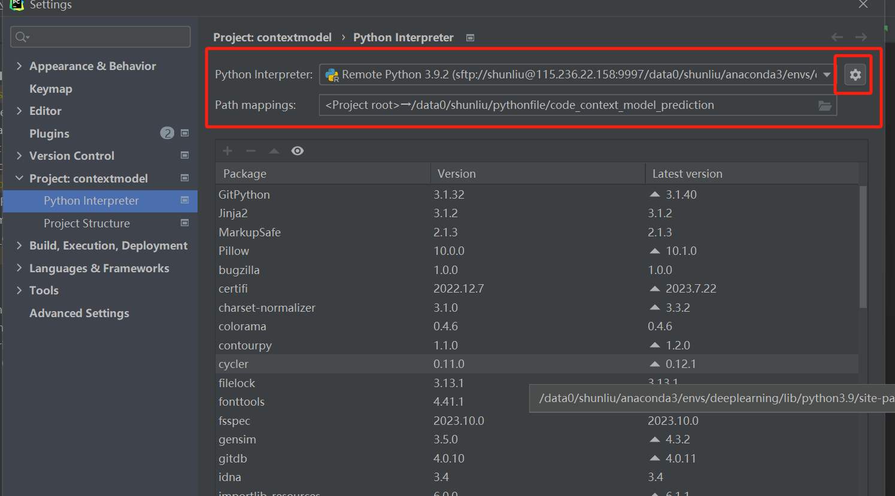
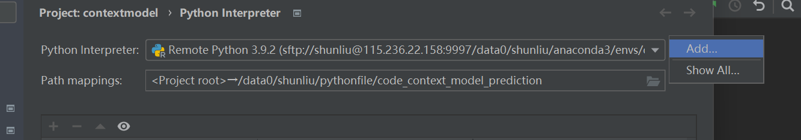
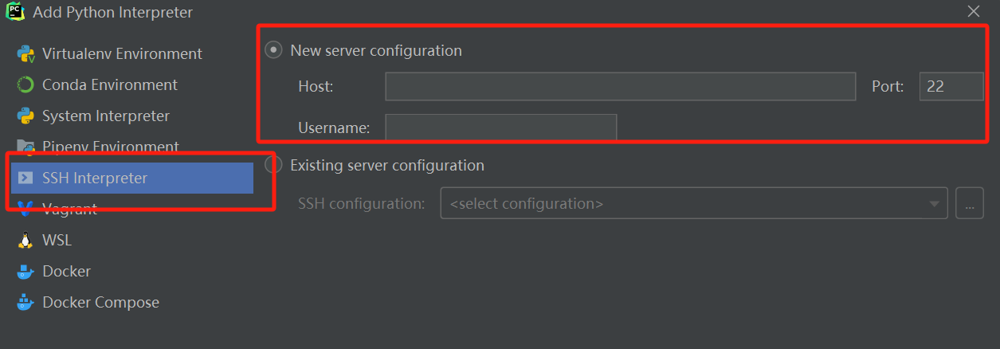
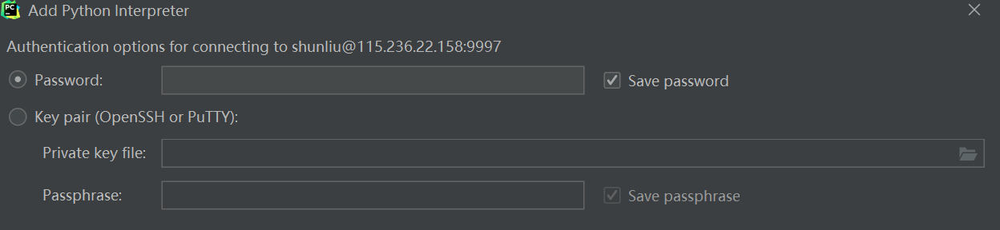
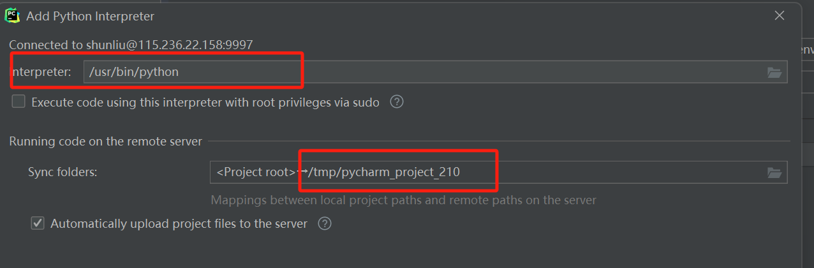
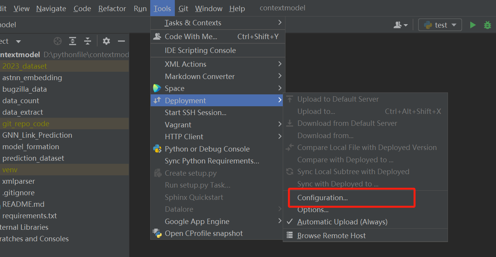

# Python Usage

记录ubuntu中如何运行python项目，非root用户最好使用anaconda管理python虚拟环境，而且anaconda很方便，推荐使用。


## anaconda基本操作

Conda 是一个强大的包管理器和环境管理器，用于管理和分发软件包、库和环境。以下是一些基本的 Conda 命令：

### python

在 Conda 中安装 Python 可以使用以下命令。请注意，如果您已经使用 Conda 安装了某个环境，通常无需单独安装 Python，因为创建环境时会自动包含 Python。

**安装最新版本的 Python（默认环境）：**

```bash
conda install python
```

这将安装最新版本的 Python。


**安装特定版本的 Python：**

```bash
conda install python=3.8
```

替换 `3.8` 为安装的特定 Python 版本。


**创建新的环境并安装 Python：**

在新的 Conda 环境中安装 Python，可以使用以下命令：

```bash
conda create --name myenv python=3.8
```

这将创建一个名为 `myenv` 的新环境，并安装 Python 3.8。


### 环境

**创建环境**

```bash
conda create --name myenv
```
这将创建一个名为 `myenv` 的新环境。您可以通过添加包名指定要在环境中安装的软件包，例如：
```bash
conda create --name myenv numpy pandas
```

**激活环境**

```bash
conda activate myenv
```
这将激活名为 `myenv` 的环境。请注意，Windows 用户可能需要使用 `activate` 命令：
```bash
activate myenv
```

**列出所有环境**

```bash
conda info --envs
```
或者
```bash
conda env list
```
这将显示所有已安装的 Conda 环境。

**复制环境**

```bash
conda create -n 新环境名 --clone 旧环境名
```

**导出环境配置**

```bash
conda env export > environment.yml
```

这将当前环境的配置导出到一个 YAML 文件中，以便将来可以通过该文件重新创建相同的环境。

**创建环境（从配置文件）**

```bash
conda env create -f environment.yml
```

这将使用之前导出的环境配置文件创建一个新环境。

**更新 Conda**

```bash
conda update conda
```

这将更新 Conda 到最新版本。


### 包

**安装软件包**

```bash
conda install package_name
```
这将在当前激活的环境中安装指定的软件包。您还可以指定软件包的版本号。

**列出已安装的软件包**

```bash
conda list
```
这将显示当前环境中安装的所有软件包和它们的版本。

**升级软件包**

```bash
conda update package_name
```
这将升级指定的软件包到最新版本。

**移除软件包**

```bash
conda remove package_name
```
这将从当前环境中移除指定的软件包。

**使用 `pip` 安装依赖项**

```bash
pip install -r requirements.txt
pip install -i https://pypi.tuna.tsinghua.edu.cn/simple/ requirements.txt
// 直接设置安装源
pip config set global.index-url https://pypi.tuna.tsinghua.edu.cn/simple
```

这将从 `requirements.txt` 文件中读取依赖项并使用 `pip` 安装它们。


### conda config

对于 Conda，可以使用 `conda config` 命令来设置配置项，而无需手动编辑配置文件。以下是一些示例：

**设置默认安装源：**

```bash
conda config --add channels https://mirrors.tuna.tsinghua.edu.cn/anaconda/pkgs/main
conda config --add channels https://mirrors.tuna.tsinghua.edu.cn/anaconda/pkgs/free
conda config --add channels https://mirrors.tuna.tsinghua.edu.cn/anaconda/cloud/conda-forge
conda config --add channels https://mirrors.tuna.tsinghua.edu.cn/anaconda/cloud/bioconda
conda config --add channels https://mirrors.tuna.tsinghua.edu.cn/anaconda/cloud/menpo
conda config --add channels https://mirrors.tuna.tsinghua.edu.cn/anaconda/cloud/pytorch
```

这里使用了清华大学的 Conda 镜像源，可以根据需要选择其他镜像。使用 `--add channels` 添加一个新的频道。

**设置默认环境：**

```bash
conda config --set env_prompt '({name}) '
```

这将设置 Conda 环境名称在命令提示符中显示。


## venv虚拟环境

为 Python 项目创建虚拟环境是一种良好的实践，它可以帮助隔离项目的依赖关系，使得不同项目可以使用不同版本的库和工具。以下是在项目中创建虚拟环境的步骤：

**使用 `venv` （Python 3.3及更高版本）**

1. 打开终端，并导航到你的项目目录。

2. 运行以下命令来创建虚拟环境：

   ```bash
   python3 -m venv venv
   ```

   这会在项目目录中创建一个名为 `venv` 的虚拟环境。

3. 激活虚拟环境：

   ```bash
   source venv/bin/activate
   ```

   当虚拟环境激活时，终端提示符应该会显示虚拟环境的名称。

4. 安装项目依赖：

   在虚拟环境激活状态下，使用 `pip` 安装项目所需的依赖项。

   ```bash
   pip install package_name
   ```

   或从 `requirements.txt` 安装：

   ```bash
   pip install -r requirements.txt
   ```

5. 当完成项目工作后，可以使用以下命令退出虚拟环境：

   ```bash
   deactivate
   ```


## requirements.txt

`requirements.txt` 是一个文本文件，用于列出项目的依赖项及其版本。这个文件通常用于与版本控制系统一起管理项目的依赖关系，以确保在不同环境中能够重现相同的依赖项。

以下是编写 `requirements.txt` 的一些建议：

1. **列出每个依赖项和版本号：**

   在 `requirements.txt` 中，每行包含一个依赖项和它的版本号。例如：

   ```txt
   Flask==2.0.1
   requests>=2.26.0,<3.0.0
   ```

   上述例子中，`Flask` 的版本被指定为 `2.0.1`，而 `requests` 的版本被指定为大于等于 `2.26.0` 且小于 `3.0.0`。

2. **使用适当的运算符：**

   - `==` 表示精确的版本匹配。
   - `>=` 和 `<` 表示版本的最小和最大范围。

   选择适当的运算符，以确保你的项目在不同环境中能够正常工作。

3. **包含必要的依赖项：**

   列出你的项目运行所需的所有依赖项。如果你的项目依赖于数据库、缓存系统等，也应该将它们包含在 `requirements.txt` 中。

   ```txt
   Flask==2.0.1
   SQLAlchemy==1.4.25
   ```

4. **注释依赖项：**

   可以在 `requirements.txt` 文件中添加注释，以提供更多信息或理由。

   ```txt
   # 项目依赖项
   Flask==2.0.1
   SQLAlchemy==1.4.25
   
   # 可选依赖项，仅在开发时需要
   pytest==7.4.0
   ```

5. **使用 `pip freeze` 自动生成：**

   你还可以使用 `pip freeze` 命令来生成当前环境的依赖项列表，并将其保存到 `requirements.txt` 文件中。这是一种更自动化的方法：

   ```bash
   pip freeze > requirements.txt
   ```

   这将创建一个包含当前环境所有依赖项及其精确版本的 `requirements.txt` 文件。


## Pycharm远程连接

进入设置，选择解释器选项



选择添加



选择ssh，并填好主机地址，端口，用户名



填写密码登录



选择服务器上的解释器，以及需要映射项目的地址



点击finish，由于勾选了自动上传，他就会自动传文件上去服务器了，也可以先不选，再如下界面做好配置后，再手动上传。之后运行代码，他就会自动连接远程服务器，再远程服务器上跑。



如果不想用了，可以切换解释器，回到本地运行。


## 执行bash命令

### 单个命令

`os.system`不常用了。

在Python中，可以使用`subprocess`模块来运行命令行命令。以下是一个简单的示例，展示如何在Ubuntu上通过Python运行命令行命令：

```python
import subprocess

# 通过subprocess.run运行命令行命令
result = subprocess.run(["ls", "-l"], stdout=subprocess.PIPE, text=True)

# 输出命令的结果
print(result.stdout)
```

在这个例子中，`subprocess.run`函数的第一个参数是包含命令及其参数的列表。`stdout=subprocess.PIPE`参数将命令的标准输出捕获到`result.stdout`中。`text=True`参数表示输出结果以文本形式返回，而不是字节形式。

可以替换`["ls", "-l"]`为你想要运行的实际命令及其参数。请注意，运行一些命令可能需要管理员权限，此时可能需要使用`sudo`命令，但请小心使用sudo以避免潜在的安全风险。

```python
import subprocess

# 使用sudo运行命令行命令（需要输入密码）
result = subprocess.run(["sudo", "your_command_here"], stdout=subprocess.PIPE, text=True, input="your_password\n", check=True)
print(result.stdout)
```

### 多个命令

当使用 `os.system` 或者 `subprocess.run` 运行命令时，可以使用 `&&` 来链接两个命令。在命令行中，`&&` 表示只有在前一个命令成功执行的情况下才执行下一个命令。

下面是一个示例，演示如何使用 `&&` 在 Python 中运行两个命令：

```python
import os

# 使用 os.system 运行两个命令
os.system("command1 && command2")
```

或者使用 `subprocess.run`：

```python
import subprocess

# 使用 subprocess.run 运行两个命令
subprocess.run("command1 && command2", shell=True)
```

在这里，`command1` 是第一个命令，`command2` 是第二个命令。`&&` 确保只有在 `command1` 成功执行的情况下才会执行 `command2`。请注意，`shell=True` 参数是必须的，因为 `&&` 是 shell 中的一个操作符，而不是一个单独的可执行程序。

### 设置环境变量

比如要运行doxygen程序，但是找不到命令，这是因为它默认的环境变量是root用户，这需要自己python运行的环境变量。

可以在 Python 脚本中通过以下方式查看当前环境变量：

```python
import os
print(os.environ['PATH'])
```

如果命令所在的路径没有包含在其中，可以在 Python 脚本中设置环境变量，例如：

```python
import os

# 将命令所在的路径添加到环境变量中
os.environ['PATH'] = '/path/to/your/command:' + os.environ['PATH']

# 然后执行命令
os.system("command1 && command2")
```

请将 `/path/to/your/command` 替换为实际命令所在的路径。这样可以确保 Python 在执行命令时能够找到它们。


## 排序sorted


