# Spring Annotation

## 注册组件

### xml

在工程的com.meimeixia.bean包下创建一个Person类，作为测试的JavaBean，代码如下所示。

```java
public class Person {
	
	private String name;
	private Integer age;
	
}
```

紧接着，在工程的src/main/resources目录下创建Spring的配置文件，例如beans.xml，通过该配置文件将Person类注入到Spring的IOC容器中，该配置文件中的内容如下所示。

```xml
<?xml version="1.0" encoding="UTF-8"?>
<beans xmlns="http://www.springframework.org/schema/beans"
	xmlns:context="http://www.springframework.org/schema/context" xmlns:p="http://www.springframework.org/schema/p"
	xmlns:aop="http://www.springframework.org/schema/aop" xmlns:tx="http://www.springframework.org/schema/tx"
	xmlns:xsi="http://www.w3.org/2001/XMLSchema-instance"
	xsi:schemaLocation="http://www.springframework.org/schema/beans 
                        http://www.springframework.org/schema/beans/spring-beans-4.2.xsd">
	
	<!-- 注册组件 -->
	<bean id="person" class="com.meimeixia.bean.Person">
		<property name="age" value="18"></property>
		<property name="name" value="liayun"></property>
	</bean>
	
</beans>

```

然后读取配置文件，即可成功注册bean

```java
public class MainTest {
	public static void main(String[] args) {
		ApplicationContext ac = new ClassPathXmlApplicationContext("beans.xml");
		Person person = (Person) ac.getBean("person");
		System.out.println(person);
	}
}
```


### @Comfiguration&@Bean

使用注解比使用XML配置文件要简单的多，我们在项目的config包下创建一个MainConfig类，并在该类上添加@Configuration注解来标注该类是一个Spring的配置类，也就是告诉Spring它是一个配置类，最后通过@Bean注解将Person类注入到Spring的IOC容器中。

```java
/**
 * 以前配置文件的方式被替换成了配置类，即配置类==配置文件
 */
// 这个配置类也是一个组件 
@Configuration // 告诉Spring这是一个配置类
public class MainConfig {

	// @Bean注解是给IOC容器中注册一个bean，类型自然就是返回值的类型，id默认是用方法名作为id
	@Bean
	public Person person() {
		return new Person("liayun", 20);
	}
}
```

通过上下文对象注册该配置类，即可获取bean

```java
public class MainTest {
	public static void main(String[] args) {
		ApplicationContext ac = new AnnotationConfigApplicationContext(MainConfig.class);
		Person person = ac.getBean(Person.class);
		System.out.println(person);
	}
}
```

使用注解注入JavaBean时，bean在IOC容器中的名称默认就是使用@Bean注解标注的**方法名称**。

也可以在@Bean注解中自定义名称：@Bean(“person”)


### @ComponentScan

在实际项目中，我们更多的是使用Spring的包扫描功能对项目中的包进行扫描，凡是在指定的包或其子包中的类上标注了@Repository、@Service、@Controller、@Component注解的类都会被扫描到，并将这个类注入到Spring容器中。

Spring包扫描功能可以使用XML配置文件进行配置，也可以直接使用@ComponentScan注解进行设置，使用@ComponentScan注解进行设置比使用XML配置文件来配置要简单的多。

使用xml

```xml
<?xml version="1.0" encoding="UTF-8"?>
<beans xmlns="http://www.springframework.org/schema/beans"
	xmlns:context="http://www.springframework.org/schema/context" xmlns:p="http://www.springframework.org/schema/p"
	xmlns:aop="http://www.springframework.org/schema/aop" xmlns:tx="http://www.springframework.org/schema/tx"
	xmlns:xsi="http://www.w3.org/2001/XMLSchema-instance"
	xsi:schemaLocation="http://www.springframework.org/schema/beans 
						http://www.springframework.org/schema/beans/spring-beans-4.2.xsd
						http://www.springframework.org/schema/context 
						http://www.springframework.org/schema/context/spring-context-4.2.xsd">
	
	<!-- 包扫描：只要是标注了我们熟悉的@Controller、@Service、@Repository、@Component这四个注解中的任何一个的组件，它就会被自动扫描，并加进容器中 -->
	<context:component-scan base-package="xx.xx"></context:component-scan>
	
	<!-- 注册组件 -->
	<bean id="person" class="xx.xx.bean.Person">
		<property name="age" value="18"></property>
		<property name="name" value="liayun"></property>
	</bean>
</beans>
```

使用扫描注解

```java
@ComponentScan(value="xx.xx") // value指定要扫描的包
@Configuration // 告诉Spring这是一个配置类
public class MainConfig {
	// @Bean注解是给IOC容器中注册一个bean，类型是返回值的类型，id默认是用方法名作为id
	@Bean("person")
	public Person person01() {
		return new Person("liayun", 20);
	}
}
```

@ComponentScan扫描时可以指定扫描的排除项等

includeFilters()方法指定Spring扫描的时候按照什么规则只需要包含哪些组件，而excludeFilters()方法指定Spring扫描的时候按照什么规则排除哪些组件。两个方法的返回值都是Filter[]数组，在ComponentScan注解类的内部存在Filter注解类。

#### excludeFilters

```java
@ComponentScan(value="xx.xx", excludeFilters={
		/*
		 * type：指定你要排除的规则，是按照注解进行排除，还是按照给定的类型进行排除，还是按照正则表达式进行排除，等等
		 * classes：除了@Controller和@Service标注的组件之外，IOC容器中剩下的组件我都要，即相当于是我要排除@Controller和@Service这俩注解标注的组件。
		 */
		@Filter(type=FilterType.ANNOTATION, classes={Controller.class, Service.class})
})
```

这样，我们就使得Spring在扫描包的时候排除了使用@Controller和@Service这俩注解标注的类。

#### includeFilters

也可以使用ComponentScan注解类中的includeFilters()方法来指定Spring在进行包扫描时，只包含哪些注解标注的类。

这里需要注意的是，当使用includeFilters()方法来指定只包含哪些注解标注的类时，需要禁用掉默认的过滤规则。 

在XML配置文件中先配置好use-default-filters="false"，也就是禁用掉默认的过滤规则，因为默认的过滤规则就是扫描所有的，只有我们禁用掉默认的过滤规则之后，只包含才能生效。

```xml
<context:component-scan base-package="com.meimeixia" use-default-filters="false"></context:component-scan>
```

在注解中，同样也需要指定这个属性

```java
@ComponentScan(value="xx.xx", includeFilters={
		/*
		 * type：指定你要排除的规则，是按照注解进行排除，还是按照给定的类型进行排除，还是按照正则表达式进行排除，等等
		 * classes：Spring在扫描时，只包含@Controller注解标注的类
		 */
		@Filter(type=FilterType.ANNOTATION, classes={Controller.class})
}, useDefaultFilters=false)
```

#### 重复注解

ComponentScan注解类上有一个如下注解：@Repeatable(ComponentScans.class)

在ComponentScans注解类的内部只声明了一个返回ComponentScan[]数组的value()方法，说明在Java 8中是一个重复注解，也就是说可以在一个类上重复使用这个注解。

```java
@ComponentScan(value="xx.xx", includeFilters={
		@Filter(type=FilterType.ANNOTATION, classes={Controller.class})
}, useDefaultFilters=false)
@ComponentScan(value="xx.xx", includeFilters={
		@Filter(type=FilterType.ANNOTATION, classes={Service.class})
}, useDefaultFilters=false)
```

也可以在类上使用@ComponentScans注解，同样也可以指定多个@ComponentScan

```java
@ComponentScans(value={
		@ComponentScan(value="com.meimeixia", includeFilters={
				@Filter(type=FilterType.ANNOTATION, classes={Controller.class})
		}, useDefaultFilters=false),
		@ComponentScan(value="com.meimeixia", includeFilters={
				@Filter(type=FilterType.ANNOTATION, classes={Service.class})
		}, useDefaultFilters=false)
})
```

#### TypeFilter

在使用@ComponentScan注解实现包扫描时，可以使用@Filter指定过滤规则，在@Filter中，通过type来指定过滤的类型。而@Filter注解中的type属性是一个FilterType枚举，

- FilterType.ANNOTATION：按照注解进行包含或者排除
- FilterType.ASSIGNABLE_TYPE：按照给定的类型进行包含或者排除
- FilterType.ASPECTJ：按照ASPECTJ表达式进行包含或者排除
- FilterType.REGEX：按照正则表达式进行包含或者排除
- FilterType.CUSTOM：按照自定义规则进行包含或者排除，如果实现自定义规则进行过滤时，自定义规则的类必须是`org.springframework.core.type.filter.TypeFilter接口`的实现类

```java
public class MyTypeFilter implements TypeFilter {

	/**
	 * 参数：
	 * metadataReader：读取到的当前正在扫描的类的信息
	 * metadataReaderFactory：可以获取到其他任何类的信息的（工厂）
	 */
	@Override
	public boolean match(MetadataReader metadataReader, MetadataReaderFactory metadataReaderFactory) throws IOException {
		// 获取当前类注解的信息
		AnnotationMetadata annotationMetadata = metadataReader.getAnnotationMetadata();
		// 获取当前正在扫描的类的类信息，比如说它的类型是什么啊，它实现了什么接口之类的
		ClassMetadata classMetadata = metadataReader.getClassMetadata();
		// 获取当前类的资源信息，比如说类的路径等信息
		Resource resource = metadataReader.getResource();
		// 获取当前正在扫描的类的类名
		String className = classMetadata.getClassName();
		// 指定一个规则
		if (className.contains("er")) {
			return true; // 匹配成功，就会被包含在容器中
		}
		return false; // 匹配不成功，所有的bean都会被排除

	}
}
```


### @Scope

Spring容器中的组件默认是单例的，在Spring启动时就会实例化并初始化这些对象，并将其放到Spring容器中，之后，每次获取对象时，直接从Spring容器中获取，而不再创建对象。如果每次从Spring容器中获取对象时，都要创建一个新的实例对象，那么该如何处理呢？此时就需要使用@Scope注解来设置组件的作用域了。

从@Scope注解类的源码中可以看出，在@Scope注解中可以设置如下值：

- ConfigurableBeanFactory#SCOPE_PROTOTYPE
- ConfigurableBeanFactory#SCOPE_SINGLETON
- org.springframework.web.context.WebApplicationContext#SCOPE_REQUEST
- org.springframework.web.context.WebApplicationContext#SCOPE_SESSION

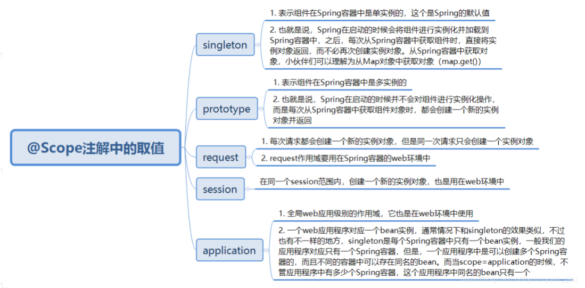

其中，request和session作用域是需要Web环境来支持的，这两个值基本上使用不到。当使用Web容器来运行Spring应用时，如果需要将组件的实例对象的作用域设置为request和session，那么通常会使用

`request.setAttribute("key", object);`和`session.setAttribute("key", object);`

这两种形式来将对象实例设置到request和session中，而不会使用@Scope注解来进行设置。

```java
@Configuration
public class MainConfig2 {
  // 指定单实例
	@Scope("prototype") // 通过@Scope注解来指定该bean的作用范围，也可以说成是调整作用域
	@Bean("person")
	public Person person() {
		return new Person("美美侠", 25);
	}
}
```

Spring容器在启动时，将单实例组件实例化之后，会即刻加载到Spring容器中，以后每次从容器中获取组件实例对象时，都是直接返回相应的对象，而不再创建新的对象

当对象是多实例时，容器初始化时不会创建，每次从Spring容器中获取对象时，都会创建新的实例对象，并且每个实例对象都不相等。


### @Lazy

```java
@Configuration
public class MainConfig2 {

	@Lazy
	@Bean("person")
	public Person person() {
		System.out.println("给容器中添加咱们这个Person对象...");
		return new Person("xxx", 25);
	}
}
```

使用@Lazy注解标注后，单实例bean对象只是在第一次从Spring容器中获取时被创建，以后每次获取bean对象时，直接返回创建好的对象，不会在容器初始化的时候就创建。


### @Conditional

@Conditional注解可以按照一定的条件进行判断，满足条件向容器中注册bean，不满足条件就不向容器中注册bean。

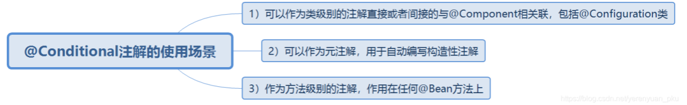

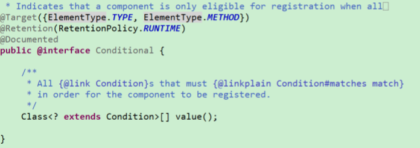

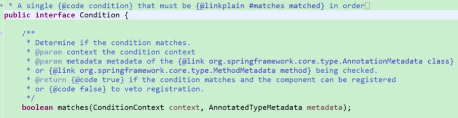

从@Conditional注解的源码来看，@Conditional注解不仅可以添加到类上，也可以添加到方法上。

使用@Conditional注解时，需要写一个类来实现Spring提供的Condition接口

```java
public class LinuxCondition implements Condition {
    /**
    * ConditionContext：判断条件能使用的上下文（环境）
    * AnnotatedTypeMetadata：当前标注了@Conditional注解的注释信息
    */
    @Override
    public boolean matches(ConditionContext context, AnnotatedTypeMetadata metadata) {
        // 判断操作系统是否是Linux系统
		Environment environment = context.getEnvironment();
        String property = environment.getProperty("os.name");
        if (property.contains("linux")) {
            return true;
        }
        return false;
    }
}
public class WindowsCondition implements Condition {

    @Override
    public boolean matches(ConditionContext context, AnnotatedTypeMetadata metadata) {
        Environment environment = context.getEnvironment();
        String property = environment.getProperty("os.name");
        if (property.contains("Windows")) {
            return true;
        }
        return false;
    }
}
```

使用该注解

```java
@Configuration
public class MainConfig2 {
	@Conditional({WindowsCondition.class})
	@Bean("bill")
	public Person person01() {
		return new Person("Bill Gates", 62);
	}
	
	@Conditional({LinuxCondition.class})
	@Bean("linus")
	public Person person02() {
		return new Person("linus", 48);
	}
}
```

此外，@Conditional注解也可以标注在类上，标注在类上的含义是：只有满足了当前条件，这个配置类中配置的所有bean注册才能生效，也就是对配置类中的组件进行统一设置。

Springboot中基于改注解封装了一系列的条件注解：

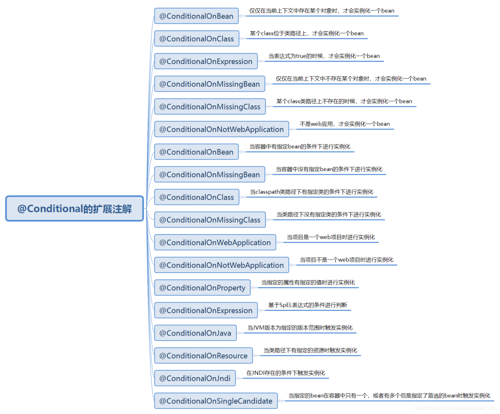

### @Import

Spring 3.0之前，创建bean可以通过XML配置文件与扫描特定包下面的类来将类注入到Spring IOC容器内。而在Spring 3.0之后提供了JavaConfig的方式，也就是将IOC容器里面bean的元信息以Java代码的方式进行描述，然后我们可以通过@Configuration与@Bean这两个注解配合使用来将原来配置在XML文件里面的bean通过Java代码的方式进行描述。

@Import注解提供了@Bean注解的功能，同时还有XML配置文件里面标签组织多个分散的XML文件的功能，当然在这里是组织多个分散的@Configuration，因为一个配置类就约等于一个XML配置文件。

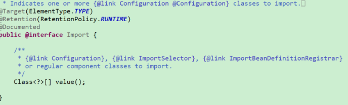

从源码里面可以看出@Import可以配合Configuration、ImportSelector 以及 ImportBeanDefinitionRegistrar来使用，下面的or表示也可以把Import当成普通的bean来使用。

> 注意：@Import注解只允许放到类上面，不允许放到方法上。

@Import注解的三种用法主要包括：

- 直接填写class数组的方式
- ImportSelector接口的方式，即批量导入，这是重点
- ImportBeanDefinitionRegistrar接口方式，即手工注册bean到容器中

#### class用法

```java
// 对配置类中的组件进行统一设置
@Configuration
@Import({Color.class, Red.class}) // @Import快速地导入组件，id默认是组件的全类名
public class MainConfig2 {	
	@Conditional({LinuxCondition.class})
	@Bean("linus")
	public Person person02() {
		return new Person("linus", 48);
	}
}
```

#### ImportSelector-用法

ImportSelector接口是Spring中导入外部配置的核心接口，在Spring Boot的自动化配置和@EnableXXX（功能性注解）都有它的存在。

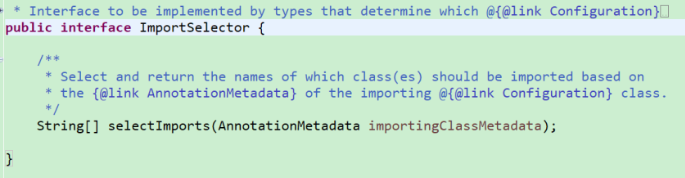

其主要作用是收集需要导入的配置类，selectImports()方法的返回值就是我们向Spring容器中导入的类的全类名。如果该接口的实现类同时实现EnvironmentAware，BeanFactoryAware，BeanClassLoaderAware或者ResourceLoaderAware，那么在调用其selectImports()方法之前先调用上述接口中对应的方法，如果需要在所有的@Configuration处理完再导入时，那么可以实现DeferredImportSelector接口。

在ImportSelector接口的selectImports()方法中，存在一个AnnotationMetadata类型的参数，这个参数能够获取到当前标注@Import注解的类的所有注解信息，也就是说不仅能获取到@Import注解里面的信息，还能获取到其他注解的信息。

```java
public class MyImportSelector implements ImportSelector {
	// 返回值：就是要导入到容器中的组件的全类名
	// AnnotationMetadata：当前标注@Import注解的类的所有注解信息，也就是说不仅能获取到@Import注解里面的信息，还能获取到其他注解的信息
	@Override
	public String[] selectImports(AnnotationMetadata importingClassMetadata) {
		// 方法不要返回null值，否则会报空指针异常
		// return new String[]{}; // 可以返回一个空数组
		return new String[]{"xx.xx.bean.Bule", "xx.xx.bean.Yellow"};
	}
}
```

使用

```java
// 对配置类中的组件进行统一设置
@Configuration
@Import({Color.class, Red.class, MyImportSelector.class}) // @Import快速地导入组件，id默认是组件的全类名
public class MainConfig2 {
	@Bean("bill")
	public Person person01() {
		return new Person("Bill Gates", 62);
	}
}
```

#### ImportBeanDefinitionRegistrar-用法

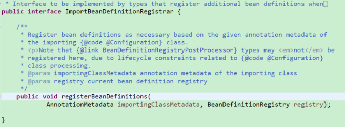

ImportBeanDefinitionRegistrar本质上是一个接口。在ImportBeanDefinitionRegistrar接口中，有一个registerBeanDefinitions()方法，通过该方法，我们可以向Spring容器中注册bean实例。

Spring官方在动态注册bean时，大部分套路其实是使用ImportBeanDefinitionRegistrar接口。

所有实现了该接口的类都会被ConfigurationClassPostProcessor处理，ConfigurationClassPostProcessor实现了BeanFactoryPostProcessor接口，所以ImportBeanDefinitionRegistrar中动态注册的bean是优先于依赖其的bean初始化的，也能被aop、validator等机制处理。

```java
public class MyImportBeanDefinitionRegistrar implements ImportBeanDefinitionRegistrar {
	/**
	 * AnnotationMetadata：当前类的注解信息
	 * BeanDefinitionRegistry：BeanDefinition注册类
	 * 我们可以通过调用BeanDefinitionRegistry接口中的registerBeanDefinition方法，手动注册所有需要添加到容器中的bean
	 */
	@Override
	public void registerBeanDefinitions(AnnotationMetadata importingClassMetadata, BeanDefinitionRegistry registry) {
		boolean definition = registry.containsBeanDefinition("xx.xx.bean.Red");
		boolean definition2 = registry.containsBeanDefinition("xx.xx.bean.Bule");
		if (definition && definition2) {
			// 指定bean的定义信息，包括bean的类型、作用域等等
			// RootBeanDefinition是BeanDefinition接口的一个实现类
			RootBeanDefinition beanDefinition = new RootBeanDefinition(RainBow.class); // bean的定义信息
			// 注册一个bean，并且指定bean的名称
			registry.registerBeanDefinition("rainBow", beanDefinition);
		}
	}
}
```

使用

```java
@Configuration
@Import({Color.class, Red.class, MyImportSelector.class, MyImportBeanDefinitionRegistrar.class}) // @Import快速地导入组件，id默认是组件的全类名
public class MainConfig2 {
	@Bean("bill")
	public Person person01() {
		return new Person("Bill Gates", 62);
	}
}
```

### FactoryBean接口

一般情况下，Spring是通过反射机制利用bean的class属性指定实现类来实例化bean的。在某些情况下，实例化bean过程比较复杂，如果按照传统的方式，那么则需要在标签中提供大量的配置信息，配置方式的灵活性是受限的，这时采用编码的方式可以得到一个更加简单的方案。Spring为此提供了一个`org.springframework.bean.factory.FactoryBean的工厂类接口`，用户可以通过实现该接口定制实例化bean的逻辑。

FactoryBean接口对于Spring框架来说占有非常重要的地位，Spring自身就提供了70多个FactoryBean接口的实现。它们隐藏了实例化一些复杂bean的细节，给上层应用带来了便利。从Spring 3.0开始，FactoryBean开始支持泛型，即接口声明改为FactoryBean< T >的形式。

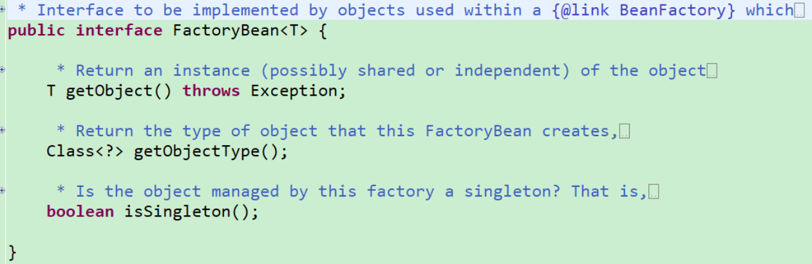

- T getObject()：返回由FactoryBean创建的bean实例，如果isSingleton()返回true，那么该实例会放到Spring容器中单实例缓存池中
- boolean isSingleton()：返回由FactoryBean创建的bean实例的作用域是singleton还是prototype
- Class getObjectType()：返回FactoryBean创建的bean实例的类型

这里，需要注意的是：当配置文件中标签的class属性配置的实现类是FactoryBean时，通过 getBean()方法返回的不是FactoryBean本身，而是FactoryBean#getObject()方法所返回的对象，相当于FactoryBean#getObject()代理了getBean()方法。

```java
/**
 * 创建一个Spring定义的FactoryBean
 * T（泛型）：指定我们要创建什么类型的对象
 */
public class ColorFactoryBean implements FactoryBean<Color> {
	// 返回一个Color对象，这个对象会添加到容器中
	@Override
	public Color getObject() throws Exception {
		return new Color();
	}

	@Override
	public Class<?> getObjectType() {
		return Color.class; // 返回这个对象的类型
	}

	// 如果返回true，那么代表这个bean是单实例，在容器中只会保存一份；
	// 如果返回false，那么代表这个bean是多实例，每次获取都会创建一个新的bean
	@Override
	public boolean isSingleton() {
		return false;
	}
}
```

使用

```java
@Configuration
@Import({Color.class, Red.class, MyImportSelector.class, MyImportBeanDefinitionRegistrar.class}) // @Import快速地导入组件，id默认是组件的全类名
public class MainConfig2 {
	@Bean("bill")
	public Person person01() {
		return new Person("Bill Gates", 62);
	}
}
```

如果需要获取工厂Bean本身时，在id前面加上&符号即可，例如&colorFactoryBean。

```java
public void testImport() {
    AnnotationConfigApplicationContext ac = new AnnotationConfigApplicationContext(MainConfig2.class);
    // 工厂bean获取的是调用getObject方法创建的对象
    Object bean2 = ac.getBean("colorFactoryBean");
    Object bean3 = ac.getBean("colorFactoryBean");
    System.out.println("bean的类型：" + bean2.getClass());
    System.out.println(bean2 == bean3);
    
    Object bean4 = ac.getBean("&colorFactoryBean");
    System.out.println(bean4.getClass());
}
```

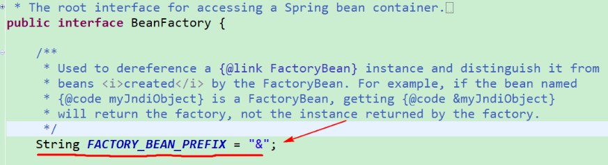


## bean生命周期

通常意义上讲的bean的生命周期，指的是bean从创建到初始化，经过一系列的流程，最终销毁的过程。在Spring中，bean的生命周期是由Spring容器来管理的。在Spring中，我们可以自己来指定bean的初始化和销毁的方法，当容器在bean进行到当前生命周期的阶段时，会自动调用我们自定义的初始化和销毁方法。


### init&destroy

使用XML配置文件的方式配置bean的话，那么可以在标签中指定bean的初始化和销毁方法，如下所示。

```xml
<bean id="person" class="xx.xx.bean.Person" init-method="init" destroy-method="destroy">
    <property name="age" value="18"></property>
    <property name="name" value="liayun"></property>
</bean>
```

需要注意的是，在我们自己写的Person类中，需要存在init()方法和destroy()方法。而且Spring中还规定，这里的init()方法和destroy()方法必须是无参方法，但可以抛出异常。

使用注解

```java
public class Car {

	public Car() {
		System.out.println("car constructor...");
	}
	
	public void init() {
		System.out.println("car ... init...");
	}
	
	public void destroy() {
		System.out.println("car ... destroy...");
	}
}
```

```java
@Configuration
public class MainConfigOfLifeCycle {
  // 配置两个方法
	@Bean(initMethod="init", destroyMethod="destroy")
	public Car car() {
		return new Car();
	}
}
```

最终会打印如下信息：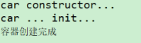

```java
public class IOCTest_LifeCycle {
	@Test
	public void test01() {
		// 1. 创建IOC容器
		AnnotationConfigApplicationContext applicationContext = new AnnotationConfigApplicationContext(MainConfigOfLifeCycle.class);
		System.out.println("容器创建完成");
		// 关闭容器
		applicationContext.close();
	}
}
```

打印如下：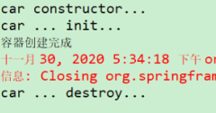

#### 使用场景

一个典型的使用场景就是对于数据源的管理。

例如，在配置数据源时，在初始化的时候，会对很多的数据源的属性进行赋值操作；在销毁的时候，对数据源的连接等信息进行关闭和清理。

#### 调用时机

bean对象的init方法调用的时机：对象创建完成，如果对象中存在一些属性，并且这些属性也都赋好值之后，就会调用bean的初始化方法。对于单实例bean来说，在Spring容器创建完成后，Spring容器会自动调用bean的初始化方法；对于多实例bean来说，在每次获取bean对象的时候，调用bean的初始化方法。

bean对象的destroy方法调用的时机：对于单实例bean来说，在容器关闭的时候，会调用bean的销毁方法；对于多实例bean来说，Spring容器不会管理这个bean，也就不会自动调用这个bean的销毁方法。


### InitializingBean和DisposableBean接口

Spring中提供了一个InitializingBean接口，该接口为bean提供了属性初始化后的处理方法，它只包括afterPropertiesSet方法，凡是继承该接口的类，在bean的属性初始化后都会执行该方法。

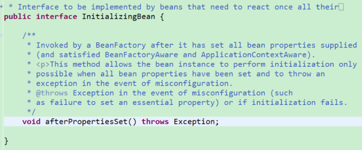

源码


- Spring为bean提供了两种初始化的方式，实现InitializingBean接口（也就是要实现该接口中的afterPropertiesSet方法），或者在配置文件或@Bean注解中通过init-method来指定，两种方式可以同时使用。
- 实现InitializingBean接口是直接调用afterPropertiesSet()方法，与通过反射调用init-method指定的方法相比，效率相对来说要高点。但是init-method方式消除了对Spring的依赖。
- 如果调用afterPropertiesSet方法时出错，那么就不会调用init-method指定的方法了。

也就是说Spring为bean提供了两种初始化的方式，第一种方式是实现InitializingBean接口（也就是要实现该接口中的afterPropertiesSet方法），第二种方式是在配置文件或@Bean注解中通过init-method来指定，这两种方式可以同时使用，同时使用先调用afterPropertiesSet方法，后执行init-method指定的方法。


实现org.springframework.beans.factory.DisposableBean接口的bean在销毁前，Spring将会调用DisposableBean接口的destroy()方法。

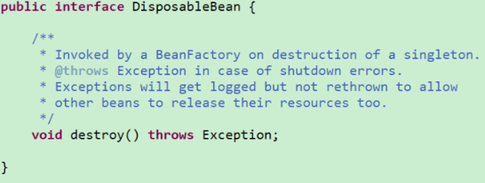

在bean生命周期结束前调用destroy()方法做一些收尾工作，亦可以使用destroy-method。前者与Spring耦合高，使用类型强转.方法名()，效率高；后者耦合低，使用反射，效率相对来说较低。

多实例bean的生命周期不归Spring容器来管理，这里的DisposableBean接口中的方法是由Spring容器来调用的，所以如果一个多实例bean实现了DisposableBean接口是没有啥意义的，因为相应的方法根本不会被调用，当然了，在XML配置文件中指定了destroy方法，也是没有任何意义的。所以，在多实例bean情况下，Spring是不会自动调用bean的销毁方法的。

使用

```java
@Component
public class Cat implements InitializingBean, DisposableBean {
	
	public Cat() {
		System.out.println("cat constructor...");
	}

	/**
	 * 会在容器关闭的时候进行调用
	 */
	@Override
	public void destroy() throws Exception {
		System.out.println("cat destroy...");
	}

	/**
	 * 会在bean创建完成，并且属性都赋好值以后进行调用
	 */
	@Override
	public void afterPropertiesSet() throws Exception {
		System.out.println("cat afterPropertiesSet...");
	}
}
```

```java
@ComponentScan("xx.xx.bean")// 包扫描注入
@Configuration
public class MainConfigOfLifeCycle {
}
```


### @PostConstruct&@PreDestroy

@PostConstruct注解是Java自己的注解，是JSR-250规范里面定义的一个注解。

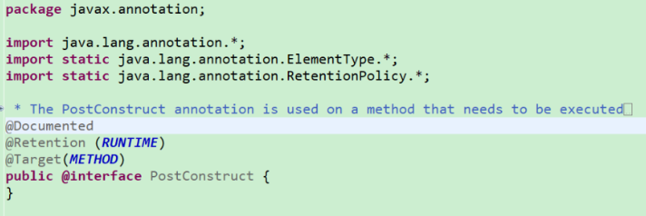

从源码可以看出，@PostConstruct注解是Java中的注解，并不是Spring提供的注解。

@PostConstruct注解被用来修饰一个非静态的void()方法。被@PostConstruct注解修饰的方法会在服务器加载Servlet的时候运行，并且只会被服务器执行一次。被@PostConstruct注解修饰的方法通常在构造函数之后，init()方法之前执行。

通常我们是会在Spring框架中使用到@PostConstruct注解的，该注解的方法在整个bean初始化中的执行顺序如下：`Constructor（构造方法）→@Autowired（依赖注入）→@PostConstruct（注释的方法）`

@PreDestroy注解同样是Java提供的，它也是JSR-250规范里面定义的一个注解。

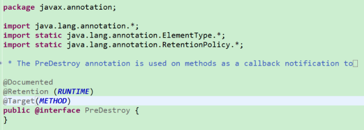

被@PreDestroy注解修饰的方法会在服务器卸载Servlet的时候运行，并且只会被服务器调用一次，类似于Servlet的destroy()方法。被@PreDestroy注解修饰的方法会在destroy()方法之后，Servlet被彻底卸载之前执行。执行顺序如下所示：`调用destroy()方法→@PreDestroy→destroy()方法→bean销毁`

使用

```java
@Component
public class Dog {

	public Dog() {
		System.out.println("dog constructor...");
	}
	
	// 在对象创建完成并且属性赋值完成之后调用
	@PostConstruct
	public void init() {
		System.out.println("dog...@PostConstruct...");
	}
	
	// 在容器销毁（移除）对象之前调用
	@PreDestroy
	public void destory() {
		System.out.println("dog...@PreDestroy...");
	}
}
```

打印如下：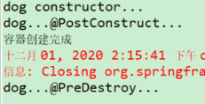


### BeanPostProcessor后置处理器

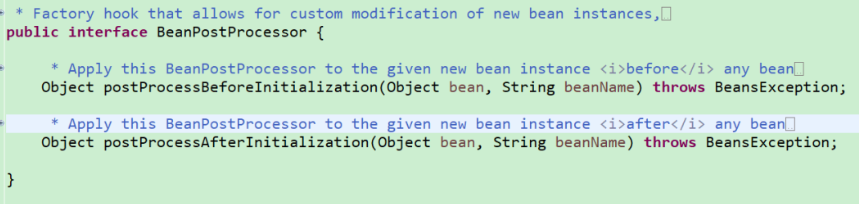

从源码可以看出，BeanPostProcessor是一个接口，其中有两个方法，即postProcessBeforeInitialization和postProcessAfterInitialization这两个方法，这两个方法分别是在Spring容器中的bean初始化前后执行，所以Spring容器中的每一个bean对象初始化前后，都会执行BeanPostProcessor接口的实现类中的这两个方法。

也就是说，postProcessBeforeInitialization方法会在bean实例化和属性设置之后，自定义初始化方法之前被调用，而postProcessAfterInitialization方法会在自定义初始化方法之后被调用。当容器中存在多个BeanPostProcessor的实现类时，会按照它们在容器中注册的顺序执行。对于自定义的BeanPostProcessor实现类，还可以让其实现Ordered接口自定义排序。

```java
/**
 * 后置处理器，在初始化前后进行处理工作
 */
@Component // 将后置处理器加入到容器中，这样的话，Spring就能让它工作了
public class MyBeanPostProcessor implements BeanPostProcessor {

	@Override
	public Object postProcessBeforeInitialization(Object bean, String beanName) throws BeansException {
		System.out.println("postProcessBeforeInitialization..." + beanName + "=>" + bean);
		return bean;
	}

	@Override
	public Object postProcessAfterInitialization(Object bean, String beanName) throws BeansException {
		System.out.println("postProcessAfterInitialization..." + beanName + "=>" + bean);
		return bean;
	}
}
```

将改类注册为组件后，他会在每一个bean的初始化前后均调用该方法。

#### 作用

后置处理器可用于bean对象初始化前后进行逻辑增强。Spring提供了BeanPostProcessor接口的很多实现类，例如AutowiredAnnotationBeanPostProcessor用于@Autowired注解的实现，AnnotationAwareAspectJAutoProxyCreator用于Spring AOP的动态代理等等。

除此之外，我们还可以自定义BeanPostProcessor接口的实现类，在其中写入需要的逻辑。

spring AOP的实现原理是动态代理，最终放入容器的是代理类的对象，而不是bean本身的对象，那么Spring是什么时候做到这一步的呢？就是在AnnotationAwareAspectJAutoProxyCreator后置处理器的postProcessAfterInitialization方法中，即bean对象初始化完成之后，后置处理器会判断该bean是否注册了切面，若是，则生成代理对象注入到容器中。定位到AbstractAutoProxyCreator抽象类中的postProcessAfterInitialization方法处的源码，如下所示。

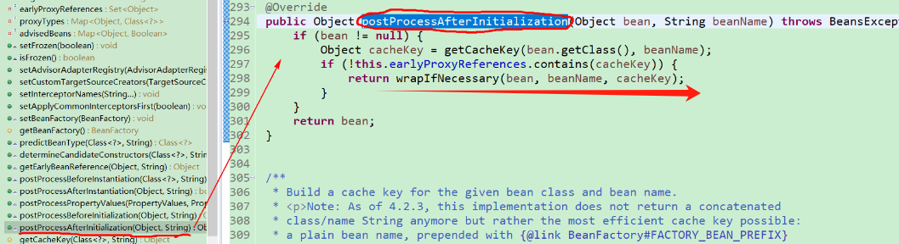

伪源代码

```java
populateBean(beanName, mbd, instanceWrapper); // 给bean进行属性赋值
initializeBean(beanName, exposedObject, mbd):
	applyBeanPostProcessorsBeforeInitialization(wrappedBean, beanName);
	invokeInitMethods(beanName, wrappedBean, mbd); // 执行自定义初始化
	applyBeanPostProcessorsAfterInitialization(wrappedBean, beanName);
```

在Spring中，调用initializeBean()方法之前，调用了populateBean()方法为bean的属性赋值，为bean的属性赋好值之后，再调用initializeBean()方法进行初始化。

在initializeBean()中，调用自定义的初始化方法（即invokeInitMethods()）之前，调用了applyBeanPostProcessorsBeforeInitialization()方法，而在调用自定义的初始化方法之后，又调用了applyBeanPostProcessorsAfterInitialization()方法。至此，整个bean的初始化过程就这样结束了。


## 自动装配

Spring组件的自动装配就是**Spring利用依赖注入，也就是我们通常所说的DI，完成对IOC容器中各个组件的依赖关系赋值。**

### @Value

Spring中的@Value注解可以为bean中的属性赋值。

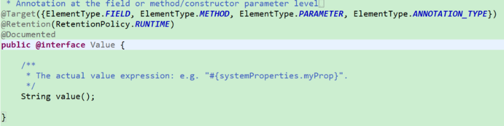

#### 注入普通值

```java
@Value("李阿昀")
private String name; // 注入普通字符串
@Value("#{systemProperties['os.name']}")
private String systemPropertiesName; // 注入操作系统属性
@Value("#{ T(java.lang.Math).random() * 100.0 }")
private double randomNumber; //注入SpEL表达式结果
@Value("#{person.name}")
private String username; // 注入其他bean中属性的值，即注入person对象的name属性中的值
@Value("classpath:/config.properties")
private Resource resourceFile; // 注入文件资源
@Value("http://www.baidu.com")
private Resource url; // 注入URL资源
```

#### 注入配置文件值

类似于springboot的`@ConfigurationProperties(prefix = "servers")`

在项目的src/main/resources目录下新建一个属性文件，例如person.properties，其内容如下：`person.nickName=xxx`

```java
@PropertySource(value={"classpath:/person.properties"})
@Configuration
public class MainConfigOfPropertyValues {
	@Bean
	public Person person() {
		return new Person();
	}
}
```

加载配置文件后，即可通过`${}`取值

```java
public class Person {
	
	@Value("李阿昀")
	private String name;
	@Value("#{20-2}")
	private Integer age;
	
	@Value("${person.nickName}")
	private String nickName; // 昵称
	
	public String getNickName() {
		return nickName;
	}
	public void setNickName(String nickName) {
		this.nickName = nickName;
	}
	public String getName() {
		return name;
	}
	public void setName(String name) {
		this.name = name;
	}
	public Integer getAge() {
		return age;
	}
	public void setAge(Integer age) {
		this.age = age;
	}
	public Person(String name, Integer age) {
		super();
		this.name = name;
		this.age = age;
	}
	public Person() {
		super();
	}
	@Override
	public String toString() {
		return "Person [name=" + name + ", age=" + age + ", nickName=" + nickName + "]";
	}
}
```

#### ${}

{}里面的内容必须符合SpEL表达式，通过@Value("${spelDefault.value}")我们可以获取属性文件中对应的值，但是如果属性文件中没有这个属性，那么就会报错。不过，我们可以通过赋予默认值。

```java
@Value("${author.name:defaultname}")
private String name;
```

#### #{}

{}里面的内容同样也是必须符合SpEL表达式。

```java
// SpEL：调用字符串Hello World的concat方法
@Value("#{'Hello World'.concat('!')}")
private String helloWorld;

// SpEL：调用字符串的getBytes方法，然后再调用其length属性
@Value("#{'Hello World'.bytes.length}")
private String helloWorldBytes;
```

#### 混合

// SpEL：传入一个字符串，根据","切分后插入列表中， #{}和$ {}配合使用时，注意不能反过来

不能${}在外面，而#{}在里面

```java
@Value("#{'${server.name}'.split(',')}")
private List<String> severs;
```

小结

- `#{···}`：用于执行SpEl表达式，并将内容赋值给属性
- `${···}`：主要用于加载外部属性文件中的值
- `${···}`和`# {···}`可以混合使用，但是必须 `#{}`在外面， `${}` 在里面


### @PropertySource

@PropertySource注解是Spring 3.1开始引入的配置类注解。通过@PropertySource注解可以将properties配置文件中的key/value存储到Spring的Environment中，Environment接口提供了方法去读取配置文件中的值，参数是properties配置文件中定义的key值。

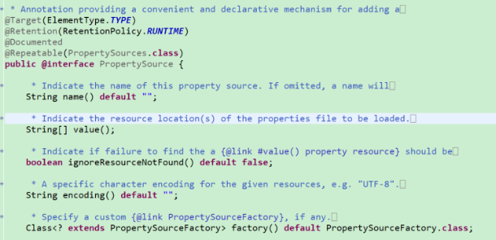

从@PropertySource的源码中可以看出，可以通过@PropertySource注解指定多个properties文件，使用的形式如下所示。`@PropertySource(value={"classpath:/person.properties", "classpath:/car.properties"})`

`@Repeatable(PropertySources.class`也说明可以使用@PropertySources注解来指定properties配置文件。

```java
@PropertySources(value={
    @PropertySource(value={"classpath:/person.properties"}),
    @PropertySource(value={"classpath:/car.properties"}),
})
```

`@PropertySource(value={"classpath:/person.properties"})`注解就相当于XML配置文件中使用的<context:property-placeholder location="classpath:person.properties" />。

除了使用@Value自动加载的值，也可以通过环境手动获取

```java
@Test
public void test01() {
    ConfigurableEnvironment environment = applicationContext.getEnvironment();
    String property = environment.getProperty("person.nickName");
    System.out.println(property);
}
```


### @Autowired

@Autowired注解可以对类成员变量、方法和构造函数进行标注，完成自动装配的工作。@Autowired注解可以放在类、接口以及方法上。

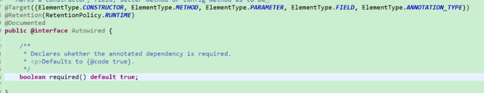

- @Autowired注解默认是优先按照类型去容器中找对应的组件，相当于是调用了如下这个方法`applicationContext.getBean(类名.class);`  若找到则就赋值。
- 如果找到多个相同类型的组件，那么是将属性名称作为组件的id，到IOC容器中进行查找，这时就相当于是调用了如下这个方法：`applicationContext.getBean("组件的id");`

```java
// 名字默认是类名首字母小写
@Repository
public class BookDao {  
}
```

```java
@Service
public class BookService {

    @Autowired
    private BookDao bookDao;
    
    public void print() {
        System.out.println(bookDao);
    }
}
```

> @Autowired(required=false)，找不到bean不会报错，装配的时候不抛异常，但是使用时他是null

当@Autowired注解标注在方法上时，Spring容器在创建当前对象的时候，就会调用相应的方法为对象赋值。如果标注的方法存在参数时，那么方法使用的参数和自定义类型的值，需要从IOC容器中获取。

```java
@Autowired 
public void setCar(Car car) {
    this.car = car;
}
```

Spring会默认将该类加载进IOC容器中，IOC容器启动的时候默认会调用bean的无参构造器创建对象，然后再进行初始化、赋值等操作。如果使用了@Autowired注解， 就会调用相应的有参构造方法创建对象，构造方法中的参数对象也是从IOC容器中获取的。

此外，使用@Autowired注解标注在构造方法上时，如果组件中只有一个有参构造方法，那么这个有参构造方法上的@Autowired注解可以省略，并且参数位置的组件还是可以自动从IOC容器中获取。

```java
@Component
public class Boss {
	
	private Car car;

  @Autowired
	public void setCar(Car car) {
		this.car = car;
	}
}

```

类似，如果Spring的bean中只有一个有参构造方法，并且这个有参构造方法只有一个参数，这个参数还是IOC容器中的对象，当@Autowired注解标注在这个构造方法的参数上时，那么我们可以将其省略掉

```java
public Boss(@Autowired Car car) {
    this.car = car;
    System.out.println("Boss...有参构造器");
}
```


### @Qualifier

@Autowired是根据类型进行自动装配的，如果需要按名称进行装配，那么就需要配合@Qualifier注解来使用了。

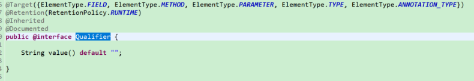

```java
@Service
public class BookService {

	@Qualifier("bookDao") // 通过@Qualifier指定装配哪个bean
	@Autowired
	private BookDao bookDao2;
	
	public void print() {
		System.out.println(bookDao2);
	}

	@Override
	public String toString() {
		return "BookService [bookDao2=" + bookDao2 + "]";
	}
}
```


### @Primary

在Spring中使用注解时，常常会使用到@Autowired这个注解，它默认是根据类型Type来自动注入的。但有些特殊情况，对同一个接口而言，可能会有几种不同的实现类，而在默认只会采取其中一种实现的情况下，就可以使用@Primary注解来标注优先使用哪一个实现类。

> @Qualifier注解为显示指定装配哪个组件，如果使用了@Qualifier注解，无论是否使用了@Primary注解，都会装配@Qualifier注解标注的对象。

```java
@Configuration
@ComponentScan({"xx.zz.service"})
public class MainConfigOfAutowired {
	
	@Primary
	@Bean("bookDao2")
	public BookDao bookDao() {
		BookDao bookDao = new BookDao();
		bookDao.setLable("2");
		return bookDao;
	}
}
```

如果其他包也有bookDao的bean，那么会优先选择装配这个bean


### @Resource&@Inject

@Resource注解是Java规范里面的，它是JSR250规范里面定义的一个注解。

该注解默认按照名称进行装配，名称可以通过name属性进行指定，如果没有指定name属性(`@Resource(name="bookDao2")`)，当注解写在字段上时，那么默认取字段名将其作为组件的名称在IOC容器中进行查找，如果注解写在setter方法上，那么默认取属性名进行装配。当找不到与名称匹配的bean时才按照类型进行装配。但是需要注意的一点是，如果name属性一旦指定，那么就只会按照名称进行装配。

@Resource注解和@Autowired注解的功能是一样的，都能实现自动装配，只不过@Resource注解默认是按照组件名称（即属性的名称）进行装配的。虽然@Resource注解具备自动装配这一功能，但是它是不支持@Primary注解优先注入的功能的，而且也不能像@Autowired注解一样能添加required=false属性。

@Inject注解也是Java规范里面的，是JSR330规范里面定义的一个注解。该注解默认是根据参数名去寻找bean注入，支持Spring的@Primary注解优先注入，@Inject注解还可以增加@Named注解指定要注入的bean。

> 要想使用@Inject注解，需要在项目的pom.xml文件中添加如下依赖，即导入javax.inject这个包。

```java
<dependency>
    <groupId>javax.inject</groupId>
    <artifactId>javax.inject</artifactId>
    <version>1</version>
</dependency>
```

区别

- @Autowired是Spring中的专有注解，而@Resource是Java中JSR250规范里面定义的一个注解，@Inject是Java中JSR330规范里面定义的一个注解
- @Autowired支持参数required=false，而@Resource和@Inject都不支持
- @Autowired和@Inject支持@Primary注解优先注入，而@Resource不支持
- @Autowired通过@Qualifier指定注入特定bean，@Resource可以通过参数name指定注入bean，而@Inject需要通过@Named注解指定注入bean


### 底层组件Aware

自定义的组件要想使用Spring容器底层的一些组件，比如ApplicationContext（IOC容器）、底层的BeanFactory等等，只需要让自定义组件实现XxxAware接口即可。此时，Spring在创建对象的时候，会调用XxxAware接口中定义的方法注入相关的组件。

获取IOC容器：

```java
@Component
public class Dog implements ApplicationContextAware {
	
	private ApplicationContext applicationContext;

	public Dog() {
		System.out.println("dog constructor...");
	}

	@Override
	public void setApplicationContext(ApplicationContext applicationContext) throws BeansException { 
		this.applicationContext = applicationContext;
	}
}
```

可以同时实现多个

```java
public class Red implements ApplicationContextAware, BeanNameAware, EmbeddedValueResolverAware {
	
	private ApplicationContext applicationContext;

	@Override
	public void setApplicationContext(ApplicationContext applicationContext) throws BeansException {
		System.out.println("传入的IOC：" + applicationContext);
		this.applicationContext = applicationContext;
	}

	/**
	 * 参数name：IOC容器创建当前对象时，为这个对象起的名字
	 */
	@Override
	public void setBeanName(String name) {
		System.out.println("当前bean的名字：" + name);
	}
	
	/**
	 * 参数resolver：IOC容器启动时会自动地将这个String值的解析器传递过来给我们
	 */
	@Override
	public void setEmbeddedValueResolver(StringValueResolver resolver) {
		String resolveStringValue = resolver.resolveStringValue("你好，${os.name}，我的年龄是#{20*18}");
		System.out.println("解析的字符串：" + resolveStringValue);
	}
}
```

原理

XxxAware接口的底层原理是由XxxAwareProcessor实现类实现的，每一个XxxAware接口都有它自己对应的XxxAwareProcessor实现类。 例如，以ApplicationContextAware接口为例，ApplicationContextAware接口的底层原理就是由ApplicationContextAwareProcessor类实现的。从ApplicationContextAwareProcessor类的源码可以看出，其实现了BeanPostProcessor接口，本质上是一个后置处理器。在postProcessBeforeInitialization()方法中调用set方法

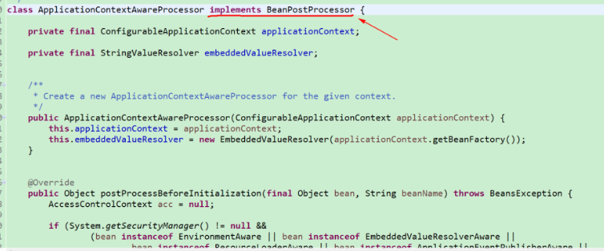


### @Profile

@Profile注解是Spring为我们提供的可以根据当前环境，动态地激活和切换一系列组件的功能。这个功能在不同的环境使用不同的变量的情景下特别有用，例如，开发环境、测试环境、生产环境使用不同的数据源，在不改变代码的情况下，可以使用这个注解来动态地切换要连接的数据库。

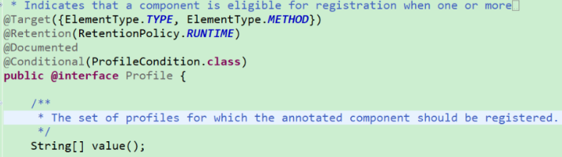

- @Profile注解不仅可以标注在方法上，也可以标注在配置类上。
- 如果@Profile注解标注在配置类上，那么只有是在指定的环境的时候，整个配置类里面的所有配置才会生效。
- 如果一个bean上没有使用@Profile注解进行标注，那么这个bean在任何环境下都会被注册到IOC容器中，当然了，前提是在整个配置类生效的情况下。

使用

配置文件

```properties
db.user=root
db.password=liayun
db.driverClass=com.mysql.jdbc.Driver
```

配置三种数据源

```java
@PropertySource("classpath:/dbconfig.properties") // 加载外部的配置文件
@Configuration
public class MainConfigOfProfile implements EmbeddedValueResolverAware {
	
	@Value("${db.user}")
	private String user;
	
	private StringValueResolver valueResolver;
	
	private String dirverClass;
	
	@Profile("test")
	@Bean("testDataSource")
	public DataSource dataSourceTest(@Value("${db.password}") String pwd) throws Exception {
		ComboPooledDataSource dataSource = new ComboPooledDataSource();
		dataSource.setUser(user);
		dataSource.setPassword(pwd);
		dataSource.setJdbcUrl("jdbc:mysql://localhost:3306/test");
		dataSource.setDriverClass(dirverClass);
		return dataSource;
	}
	 
	@Profile("dev") // 定义了一个环境标识，只有当dev环境被激活以后，我们这个bean才能被注册进来
	@Bean("devDataSource")
	public DataSource dataSourceDev(@Value("${db.password}") String pwd) throws Exception {
		ComboPooledDataSource dataSource = new ComboPooledDataSource();
		dataSource.setUser(user);
		dataSource.setPassword(pwd);
		dataSource.setJdbcUrl("jdbc:mysql://localhost:3306/ssm_crud");
		dataSource.setDriverClass(dirverClass);
		return dataSource;
	}
	
	@Profile("prod")
	@Bean("prodDataSource")
	public DataSource dataSourceProd(@Value("${db.password}") String pwd) throws Exception {
		ComboPooledDataSource dataSource = new ComboPooledDataSource();
		dataSource.setUser(user);
		dataSource.setPassword(pwd);
		dataSource.setJdbcUrl("jdbc:mysql://localhost:3306/scw_0515");
		dataSource.setDriverClass(dirverClass);
		return dataSource;
	}

	@Override
	public void setEmbeddedValueResolver(StringValueResolver resolver) {
		this.valueResolver = resolver;
		dirverClass = valueResolver.resolveStringValue("${db.driverClass}");
	}
}
```

使用@Profile("dev")注解来标识在开发环境下注册devDataSource；使用@Profile("test")注解来标识在测试环境下注册testDataSource；使用@Profile("prod")注解来标识在生产环境下注册prodDataDource。

可以通过@Profile("default")注解来标识一个默认的环境

```java
@Test
public void test02() {
	// 1. 使用无参构造器创建一个IOC容器
	AnnotationConfigApplicationContext applicationContext = new AnnotationConfigApplicationContext();
	// 2. 在我们容器还没启动创建其他bean之前，先设置需要激活的环境（可以设置激活多个环境哟）
	applicationContext.getEnvironment().setActiveProfiles("test");
	// 3. 注册主配置类
	applicationContext.register(MainConfigOfProfile.class);
	// 4. 启动刷新容器
	applicationContext.refresh();
}
```


## AOP

### usage

AOP（Aspect Orient Programming），直译过来就是面向切面编程。AOP是一种编程思想，是面向对象编程（OOP）的一种补充。面向对象编程将程序抽象成各个层次的对象，而面向切面编程是将程序抽象成各个切面。

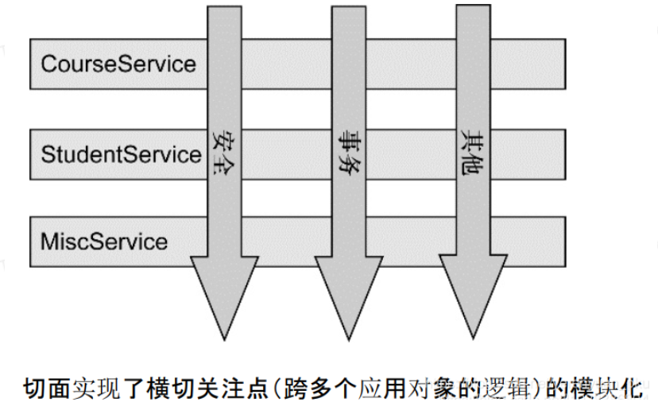

AOP是指在程序的运行期间动态地将某段代码切入到指定方法、指定位置进行运行的编程方式。AOP的底层是使用动态代理实现的。

AOP中的通知方法及其对应的注解与含义如下：

- 前置通知（对应的注解是@Before）：在目标方法运行之前运行
- 后置通知（对应的注解是@After）：在目标方法运行结束之后运行，无论目标方法是正常结束还是异常结束都会执行
- 返回通知（对应的注解是@AfterReturning）：在目标方法正常返回之后运行
- 异常通知（对应的注解是@AfterThrowing）：在目标方法运行出现异常之后运行
- 环绕通知（对应的注解是@Around）：动态代理，我们可以直接手动推进目标方法运行（joinPoint.procced()）

使用

导入依赖

```xml
<dependency>
    <groupId>org.springframework</groupId>
    <artifactId>spring-aspects</artifactId>
    <version>4.3.12.RELEASE</version>
</dependency>
```

编写通知方法

```java
/**
 * 切面类
 * @Aspect：告诉Spring当前类是一个切面类，而不是一些其他普通的类
 */
@Aspect
public class LogAspects {
	// 如果切入点表达式都一样的情况下，可以抽取出一个公共的切入点表达式
	// 1. 本类引用
	// 2. 如果是外部类，即其他的切面类引用，需要写方法的全名@Pointcut("...")
	@Pointcut("execution(public int xx.xx.aop.MathCalculator.*(..))")
	public void pointCut() {}
	
	// @Before：在目标方法（即div方法）运行之前切入，public int xx.xx.aop.MathCalculator.div(int, int)这一串就是切入点表达式，指定在哪个方法切入
	// @Before("public int xx.xx.aop.MathCalculator.*(..)")
	@Before("pointCut()")
	public void logStart(JoinPoint joinPoint) {
		Object[] args = joinPoint.getArgs(); // 拿到参数列表，即目标方法运行需要的参数列表
		System.out.println(joinPoint.getSignature().getName() + "运行......@Before，参数列表是：{" + Arrays.asList(args) + "}");
	}
	
	// 在目标方法（即div方法）结束时被调用
	// @After("pointCut()")
	@After("xx.xx.aop.LogAspects.pointCut()")
	public void logEnd(JoinPoint joinPoint) {
		System.out.println(joinPoint.getSignature().getName() + "结束......@After");
	}
	
	// 在目标方法（即div方法）正常返回了，有返回值，被调用
	// @AfterReturning("pointCut()")
	@AfterReturning(value="pointCut()", returning="result") // returning来指定我们这个方法的参数谁来封装返回值
	/*
	 * 如果方法正常返回，我们还想拿返回值，那么返回值又应该怎么拿呢？
	 */
	public void logReturn(JoinPoint joinPoint, Object result) { // 一定要注意：JoinPoint这个参数要写，一定不能写到后面，它必须出现在参数列表的第一位，否则Spring也是无法识别的，就会报错
		System.out.println(joinPoint.getSignature().getName() + "正常返回......@AfterReturning，运行结果是：{" + result + "}");
	}
	
  // 在目标方法（即div方法）出现异常，被调用
  // @AfterThrowing("pointCut()")
  @AfterThrowing(value="pointCut()", throwing="exception")
  public void logException(JoinPoint joinPoint, Exception exception) {
      System.out.println(joinPoint.getSignature().getName() + "出现异常......异常信息：{" + exception + "}");
}
}
// JoinPoint参数一定要放在参数列表的第一位，否则Spring是无法识别的
```

在配置类使用@EnableAspectJAutoProxy注解开启基于注解的AOP模式。在MainConfigOfAOP配置类中，使用@Bean注解将业务逻辑类（目标方法所在类）和切面类都加入到IOC容器中。

```java
/**
 * AOP：面向切面编程，其底层就是动态代理
 *      指在程序运行期间动态地将某段代码切入到指定方法指定位置进行运行的编程方式。
 */
@EnableAspectJAutoProxy
@Configuration
public class MainConfigOfAOP {
	
	// 将业务逻辑类（目标方法所在类）加入到容器中
	@Bean
	public MathCalculator calculator() {
		return new MathCalculator();
	}
	
	// 将切面类加入到容器中
	@Bean
	public LogAspects logAspects() {
		return new LogAspects();
	
}
```

使用改bean，必须要是容器的bean，自己创建的对象是无效的，因为AOP是spring提供的功能

```java
public class IOCTest_AOP {
	@Test
	public void test01() {
		AnnotationConfigApplicationContext ac = new AnnotationConfigApplicationContext(MainConfigOfAOP.class);
		// 不要自己创建这个对象
		// MathCalculator mathCalculator = new MathCalculator();
		// mathCalculator.div(1, 1);
		// 我们要使用Spring容器中的组件
		MathCalculator mathCalculator = ac.getBean(MathCalculator.class);
		mathCalculator.div(1, 0);
	}
}
```


### @EnableAspectJAutoProxy

在配置类上添加@EnableAspectJAutoProxy注解，便能够开启注解版的AOP功能。

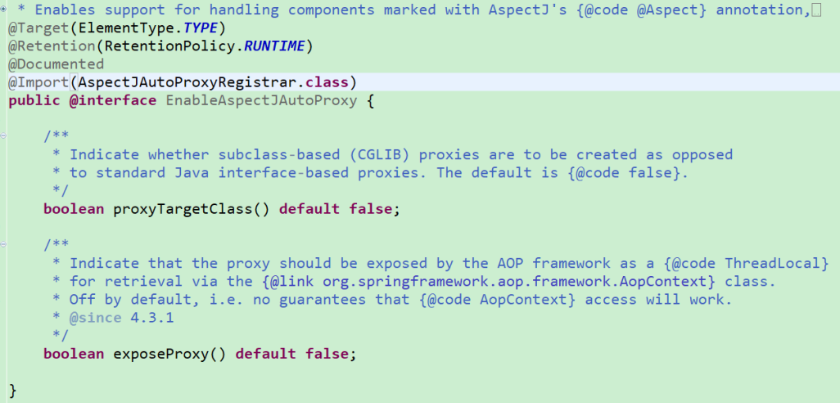

@EnableAspectJAutoProxy注解使用@Import注解给容器中引入了AspectJAutoProxyRegister组件

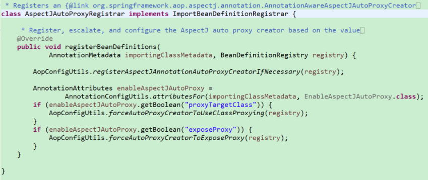

AspectJAutoProxyRegistrar类实现了ImportBeanDefinitionRegistrar接口。

通过ImportBeanDefinitionRegistrar接口实现将自定义的组件添加到IOC容器中。

也就是说，@EnableAspectJAutoProxy注解使用AspectJAutoProxyRegistrar对象自定义组件，并将相应的组件添加到了IOC容器中。

简单源码介绍：

> 第一步

向Spring的配置类上添加@EnableAspectJAutoProxy注解之后，会向IOC容器中注册AnnotationAwareAspectJAutoProxyCreator，翻译过来就叫注解装配模式的AspectJ切面自动代理创建器。此类实现了BeanFactoryAware与BeanPostProcessor接口，说明属于后处理器，实际就是创建方法的代理对象，然后通过代理对象按照顺序调用增强方法和方法本身

- BeanPostProcessor：后置处理器，即在bean初始化完成前后做些事情
- BeanFactoryAware：自动注入BeanFactory

> 第二步

注册完AnnotationAwareAspectJAutoProxyCreator后置处理器之后，接下来完成BeanFactory的初始化工作，主要是调用了AnnotationAwareAspectJAutoProxyCreator的postProcessBeforeInstantiation()方法。AnnotationAwareAspectJAutoProxyCreator虽然是一个BeanPostProcessor，但是它却是InstantiationAwareBeanPostProcessor这种类型的，而InstantiationAwareBeanPostProcessor接口中声明的方法就叫postProcessBeforeInstantiation（而不是postProcessbeforeInitialization）。

创建bean流程：

1. 首先创建bean的实例
2. 然后给bean的各种属性赋值
3. 接着初始化bean
   1. 先执行Aware接口的方法
   2. 应用后置处理器的postProcessBeforeInitialization()方法
   3. 执行自定义的初始化方法
   4. 应用后置处理器的postProcessAfterInitialization()方法

总结，这一步，AnnotationAwareAspectJAutoProxyCreator在所有bean创建之前，会有一个拦截，因为它是InstantiationAwareBeanPostProcessor这种类型的后置处理器，然后会调用它的postProcessBeforeInstantiation()方法。

> 第三步

1. 找到候选的所有增强器，也就是说是来找哪些通知方法是需要切入到当前bean的目标方法中的
2. 获取到能在当前bean中使用的增强器
3. 给增强器排序
4. 获取所有增强器，把这些增强器保存到代理工厂（即proxyFactory）中。
5. 为当前组件创建代理对象

- 一种是JdkDynamicAopProxy这种形式的，即jdk的动态代理
- 一种是ObjenesisCglibAopProxy这种形式的，即cglib的动态代理
- 如果当前类是有实现接口的，那么就使用jdk来创建动态代理，如果当前类没有实现接口，例如MathCalculator类，此时jdk是没法创建动态代理的，那么自然就得使用cglib来创建动态代理了。

> 第四步

在目标方法执行之前，Spring会把所有的增强器转换为拦截器，并最终形成一个拦截器链，然后根据这个拦截器链new出一个CglibMethodInvocation对象，接着会调用其proceed()方法。然后递归调用拦截器链，相当于一次执行拦截器，并且在执行完Before拦截器后，会调用方法本身，然后在执行其他拦截器

> 总结

1、利用@EnableAspectJAutoProxy注解来开启AOP功能

2、通过@EnableAspectJAutoProxy注解向IOC容器中注册一个AnnotationAwareAspectJAutoProxyCreator后处理器组件，（创建IOC容器的过程中，会调用refresh()方法来刷新容器，而在刷新容器的过程中有一步是来注册后置处理器的，在刷新容器的过程中还有一步是来完成BeanFactory的初始化工作，创建剩下的单实例bean，包括MathCalculator（业务逻辑类）和LogAspects（切面类））

3、创建业务逻辑组件和切面组件，在这两个组件创建的过程中，AnnotationAwareAspectJAutoProxyCreator（后置处理器）会来拦截这俩组件的创建过程：创建完成之后，判断组件是否需要增强。如需要，则会把切面里面的通知方法包装成增强器，然后再为业务逻辑组件创建一个代理对象。在为业务逻辑组件创建代理对象的时候，使用的是cglib来创建动态代理的。如果业务逻辑类有实现接口，那么就使用jdk来创建动态代理。一旦这个代理对象创建出来了，它就会有所有的增强器。

4、执行目标方法，通过代理对象来执行目标方法，使用CglibAopProxy类的intercept()方法来拦截目标方法的执行，拦截的过程如下：得到目标方法的拦截器链，所谓的拦截器链是每一个通知方法又被包装为了方法拦截器，即MethodInterceptor，利用拦截器的链式机制，依次进入每一个拦截器中进行执行最终，整个的执行效果就会有两套：目标方法正常执行：前置通知→目标方法→后置通知→返回通知 or 目标方法出现异常：前置通知→目标方法→后置通知→异常通知


## 声明式事务

### usage

创建数据源

```java
@ComponentScan("xx.xx.tx")
@EnableTransactionManagement // 它是来开启基于注解的事务管理功能的 
@Configuration
public class TxConfig {

	// 注册c3p0数据源
	@Bean
	public DataSource dataSource() throws Exception {
		ComboPooledDataSource dataSource = new ComboPooledDataSource();
		dataSource.setUser("xx");
		dataSource.setPassword("xx");
		dataSource.setDriverClass("com.mysql.jdbc.Driver");
		dataSource.setJdbcUrl("jdbc:mysql://localhost:3306/test");
		return dataSource;
	}

	@Bean
	public JdbcTemplate jdbcTemplate() throws Exception {
		JdbcTemplate jdbcTemplate = new JdbcTemplate(dataSource());
		return jdbcTemplate;
	}
  
  // 注册事务管理器在容器中
  @Bean
  public PlatformTransactionManager platformTransactionManager() throws Exception {
    return new DataSourceTransactionManager(dataSource());
  }
}
```

事务管理器需要管理数据源，也就是说事务管理器一定要把数据源控制住，才会控制住数据源里面的每一个连接，这时该连接上的回滚以及事务的开启等操作，都将会由这个事务管理器来做。

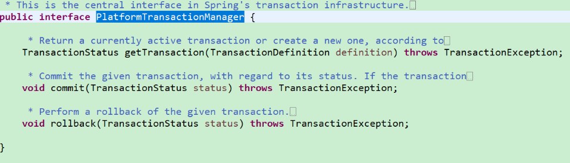


使用数据源

```java
@Repository
public class UserDao {
	
	@Autowired
	private JdbcTemplate jdbcTemplate;
	
	public void insert() {
		String sql = "insert into `tbl_user`(username, age) values(?, ?)";
		String username = UUID.randomUUID().toString().substring(0, 5);
		jdbcTemplate.update(sql, username, 19); // 增删改都来调用这个方法
	}
}
```

service

```java
@Service
public class UserService {

	@Autowired
	private UserDao userDao;
	
  @Transactional
	public void insertUser() {
		userDao.insert();
		System.out.println("插入完成...");
    int i = 10 / 0;
	}
}
```


### @EnableTransactionManagement

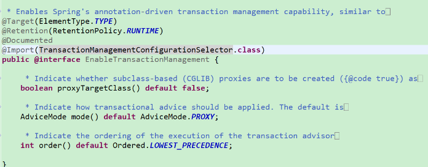

1、@EnableTransactionManagement注解利用TransactionManagementConfigurationSelector给容器中导入两个组件，一个叫AutoProxyRegistrar，一个叫ProxyTransactionManagementConfiguration。

2、AutoProxyRegistrar向容器中注入了一个自动代理创建器，即InfrastructureAdvisorAutoProxyCreator，它同样也是一个后置处理器，和之前研究AOP原理时向容器中注入的AnnotationAwareAspectJAutoProxyCreator组件所做的事情基本上没差别，利用后置处理器机制在对象创建以后进行包装，然后返回一个代理对象，并且该代理对象里面会存有所有的增强器。最后，代理对象执行目标方法，在此过程中会利用拦截器的链式机制，依次进入每一个拦截器中进行执行。

3、ProxyTransactionManagementConfiguration是一个配置类，它会利用@Bean注解向容器中注册各种组件，而且注册的第一个组件就是BeanFactoryTransactionAttributeSourceAdvisor，这个Advisor是事务的核心内容，可以暂时称之为事务增强器。然后该事务增强器又会转成一个transactionInterceptor，

4、然后该拦截器会获取我们注册的PlatformTransactionManager，之后就是执行方法，如果出现异常，就使用管理器回滚，否则提交。

总结：

> 首先，使用AutoProxyRegistrar向Spring容器里面注册一个后置处理器，这个后置处理器会负责给我们包装代理对象。然后，使用ProxyTransactionManagementConfiguration（配置类）再向Spring容器里面注册一个事务增强器，此时，需要用到事务拦截器。最后，代理对象执行目标方法，在这一过程中，便会执行到当前Spring容器里面的拦截器链，而且每次在执行目标方法时，如果出现了异常，那么便会利用事务管理器进行回滚事务，如果执行过程中一切正常，那么则会利用事务管理器提交事务。


## 扩展原理

### BeanFactoryPostProcessor

- BeanPostProcessor：bean的后置处理器，在Bean创建前后工作；
- BeanFactoryPostProcessor：BeanFactory的后置处理器。
- 先有beanFactory后有bean

接口方法：

postProcessBeanFactory()

执行时间：

在BeanFactory标准初始化之后调用，来定制和修改BeanFactory的内容。所有的bean定义已经加载到BeanFactory，但是bean的实例还未创建。

调用过程：

IOC容器创建时，调用`refresh()`方法，该方法调用`invokeBeanFactoryPostProcessors(beanFactory)`。

在BeanFactory中找到所有的`BeanFactoryPostProcessor`类型的组件，并执行它们的`postProcessBeanFactory()`方法。

在初始化创建其他组件前面执行。


### BeanDefinitionRegistryPostProcessor

该接口继承于`BeanFactoryPostProcessor`，增加了一个方法`postProcessBeanDefinitionRegistry()`

接口方法：

postProcessBeanDefinitionRegistry()

执行时间：

在所有bean**定义信息将要被加载**，bean实例还未创建。

在BeanFactoryPostProcessor的`postProcessBeanFactory()`方法执行**之前**。

可以利用beanDefinitionRegistryPostProcessor给容器中再注册bean。

例如：

```java
@Override
// BeanDefinitionRegistry Bean定义信息的保存中心，以后BeanFactory就是按照BeanDefinitionRegistry里面保存的每一个bean定义信息创建bean实例的。
public void postProcessBeanDefinitionRegistry(BeanDefinitionRegistry registry) throws BeansException {
    int beanDefinitionCount = registry.getBeanDefinitionCount();
    System.out.println("postProcessBeanDefinitionRegistry.." + beanDefinitionCount);

    // new出来一个Yellow的BeanDefinition
    RootBeanDefinition yellowBeanDefinition = new RootBeanDefinition(Yellow.class);
    registry.registerBeanDefinition("yellow", yellowBeanDefinition);  // 将bean注册到容器中
    // 使用BeanDefinitionBuilder构建出来一个Red的BeanDefinition
    AbstractBeanDefinition redBeanDefinition = BeanDefinitionBuilder.rootBeanDefinition(Red.class).getBeanDefinition();
    registry.registerBeanDefinition("red", redBeanDefinition); // 将bean注册到容器中
}
// 所以如果在BeanFactoryPostProcessor中打印count，应当是当前方法中的count+2
```

调用过程：

同BeanFactoryPostProcessor一样：从refresh()调用到`invokeBeanFactoryPostProcessors(beanFactory)`；

从容器中获取所有的BeanDefinitionRegistryPostProcessor组件，遍历执行每个组件的`postProcessBeanDefinitionRegistry()`方法，再执行其继承的BeanFactoryPostProcessor的`postProcessBeanFactory()`方法。

之后再从容器中找到BeanFactoryPostProcessor组件，遍历执行`postProcessBeanFactory()`方法。


### ApplicationListener

监听容器中发布的事件，完成事件驱动模型开发。

```java
public interface ApplicationListener<E extends ApplicationEvent> extends EventListener {
	void onApplicationEvent(E event);
}
```

接口的泛型为监听的事件类型，即只能监听ApplicationEvent及其下面的子类。

开发步骤：

1.  编写一个监听器（实现ApplicationListener接口），来监听某个事件（ApplicationEvent及其子类）
   例如： 

   ```java
   @Component
   public class MyApplicationListener implements ApplicationListener {
       @Override
       public void onApplicationEvent(ApplicationEvent event) {
           System.out.println("收到事件: " + event);
       }
   }
   ```

2. 把监听器加入到容器中(使用`@Compenent`) 

3. 只要容器中有相关事件的发布，就能监听到这个事件。
   例如（spring发布的事件）： 

- - ContextRefreshedEvent：容器刷新完成事件（所有bean都完成创建时，Spring会自动发布这个事件）

- - ContextClosedEvent：容器关闭事件（Spring自动发布的事件）

4. 发布一个自定义事件
   使用ioc容器进行发布： 

   ```java
   applicationContext.publishEvent(new ApplicationEvent("我的事件") {});
   ```

调用过程：

1. 容器创建中的`refresh()`方法； 

2. 在容器刷新方法的最后一步，调用了`finishRefresh()`方法完成容器刷新 
3. 容器完成刷新的方法内发布容器刷新事件： 

```java
publishEvent(new ContextRefreshedEvent(this));
```

publishEvent()方法的事件发布的流程： 

1. 1.  获取事件的多播器/派发器：`getApplicationEventMulticaster()` 
   2.  `multicastEvent()`派发事件 
   3.  派发事件方法中获取到所有支持当前事件类型的ApplicationListener 

```java
for (final ApplicationListener<?> listener : getApplicationListeners(event, type)) {
    // 如果有Executor，可以使用多线程异步派发
    Executor executor = getTaskExecutor();
    if (executor != null) {
        executor.execute(new Runnable() {
            @Override
            public void run() {
                invokeListener(listener, event);  // 执行listener里面的onApplicationEvent方法
            }
        });
    }
    else {  // 否则，同步方式直接执行listener里面的onApplicationEvent方法
        invokeListener(listener, event);
    }
}
```

事件多播器(派发器)的注册：

1. 容器创建对象：`refresh()` 

2. `refresh()`方法中有一步调用`initApplicationEventMulticaster()`：初始化ApplicationEventMulticaster；
   先到容器中尝试获取beanId为`applicationEventMulticaster`的`ApplicationEventMulticaster`类型组件。
   如果可以获取到，则直接使用；
   如果获取不到，则`new SimpleApplicationEventMulticaster(beanFactory);`，然后注册到ioc容器中;

监听器的注册：

1. 容器创建对象：`refresh()` 
2.  `refresh()`方法中有一步调用`registerListeners()`：注册监听器
   从ioc容器中拿到所有的ApplicationListener类型监听器bean，把它们注册添加到applicationEventMulticaster派发器中； 


### @EventListener

使用`@EventListener`注解监听事件。

标记在方法上，使用`classes`属性声明要监听的事件类型。ApplicationEvent类型的方法参数可以获得到该事件。

```java
@Service
public class UserService {

    @EventListener(classes = {ApplicationEvent.class})
    public void listener(ApplicationEvent event) {
        System.out.println("得到事件:" + event);
    }
}
```

使用`EventListenerMethodProcessor`处理器来解析方法上的`@EventListener`注解。

`EventListenerMethodProcessor`实现了`SmartInitializingSingleton`接口。


### SmartInitializingSingleton

在所有单实例bean都创建完成之后调用，调用的时机类似`ContextRefreshedEvent`。

接口方法：

- afterSingletonsInstantiated()

调用过程：

1. ioc创建对象并刷新容器：refresh() 

2. refresh()调用`finishBeanFactoryInitialization()` 

3. finishBeanFactoryInitialization()初始化剩下的单实例bean 

1. 1. 遍历所有待创建的单实例bean，调用`getBean()`创建所有的单实例bean 

2. 2. 获取所有创建好的单实例bean，判断是否是`SmartInitializingSingleton`类型。
      如果是该类型，就调用其`afterSingletonsInstantiated()`方法 


### 容器创建

这个版本有点老了，现在的源码已经不是这样了

[上链接](https://www.yuque.com/tmfl/spring/klr8ps)


### servlet3.0

主要是介绍了如何使用注解的方式配置servlet3.0而免去配置文件（其实就是通过实现接口，然后重写类，加载自己的组件，来代替配置文件声明组件）

也介绍了如何通过这种方式定制化springMVC，原理类似，也是实现接口或者类，然后重写方法，实现自己的逻辑

[上链接](https://www.yuque.com/tmfl/spring/yhx2bd)


#### 异步处理

> servelet3.0原生处理

1. 在`@WebServlet`注解中设置`asyncSupported=true`
2. 在`doGet()`/`doPost()`方法中，通过`req.startAsync()`获取到`AsyncContext`对象
3. 调用`AsyncContext`对象的`start()`方法，传入一个Thread线程对象
4. 在线程的`run()`方法中，使用`AsyncContext`对象的`complete()`方法完成操作
5. `AsyncContext`对象可以获取request、response进行后续操作

```java
@WebServlet(value = "/helloAsync", asyncSupported = true)
public class HelloAsyncServlet extends HttpServlet{

	@Override
	protected void doGet(HttpServletRequest req, HttpServletResponse resp) throws ServletException, IOException {
		System.out.println("主线程开始: " + Thread.currentThread());
		AsyncContext startAsync = req.startAsync();
		startAsync.start(() -> {
			try {
				System.out.println("子线程开始：" + Thread.currentThread());
				sayHello();
				startAsync.complete();
//				AsyncContext asyncContext = req.getAsyncContext();
				ServletResponse response = startAsync.getResponse();
				response.getWriter().write("hello Async");
				System.out.println("子线程结束开始：" + Thread.currentThread());
			} catch (Exception e) {
				e.printStackTrace();
			}
		});
		System.out.println("主线程结束: " + Thread.currentThread());
	}
	public void sayHello() throws Exception {
		Thread.sleep(3000);
	}

}
```

> SpringMVC的Callable

返回一个`Callable`类型的返回值。

```java
@Controller
public class AsyncController {

    @RequestMapping("/asyncTest01")
    public Callable<String> asyncTest01() {
        /*Callable<String> callable = new Callable<String>() {
            @Override
            public String call() throws Exception {
                Thread.sleep(2000);
                return "asyncTest01 exec......";
            }
        };
        return callable;*/

        return () -> {
            Thread.sleep(2000);
            return "success";
        };
    }
}
```

如果加了拦截器，拦截器的`preHandle()`方法会执行两次，SpringMVC执行过程如下：

```txt
拦截器preHandle.......
主线程开始....
主线程结束....
-----------至此,DispatcherServlet及所有Filter退出线程--------

----------Callable开始执行----------
Callable子线程开始....
Callable子线程结束....
----------Callable执行结束-----------

----------SpringMVC将请求重新派发给容器--------------
拦截器preHandle...
拦截器posthandle.....（Callable的返回值就是目标方法返回值，此时不再执行目标方法）
拦截器afterCompletion.....
```

原理：

1. 控制器返回Callable
2. Spring异步处理：将Callable提交到`TaskExecutor`，使用一个隔离的线程进行执行
3. DispatcherServlet和所有的Filter退出Web容器的线程，但是Response保持打开状态
4. Callable返回结果，SpringMVC将请求重新派发给容器，恢复之前的处理
5. 根据Callable返回的结果，SpringMVC继续进行视图渲染等（从收请求-视图渲染 重新进行）


> 异步拦截器

SpringMVC的普通拦截器并不能拦截到真正的Callable请求。如果需要拦截异步请求，则需要使用异步拦截器：

- 使用原生API的`AsyncListener`

- 使用SpringMVC的`AsyncHandlerInterceptor`接口


> SpringMVC的DeferredResult

使用步骤：

1. 在Controller中创建一个`DeferredResult`对象，并保存进消息队列或其他位置中
2. 将该`DeferredResult`对象进行返回
3. 编写一个监听，消费消息队列里面的`DeferredResult`对象
4. 将结果通过`DeferredResult`对象的`setResult()`方法设置给`DeferredResult`对象

示例程序：

```java
@Controller
public class AsyncController {

    /**
     * 创建订单请求
     */
    @RequestMapping("/createOrder")
    @ResponseBody
    public DeferredResult<Object> createOrder() {
        // 创建一个deferredResult对象，保存进消息队列中
        // 并不直接进行订单的创建。等其他线程消费该消息队列的deferredResult对象，并通过setResult()给deferredResult对象设置结果之后，将结果响应给浏览器
        DeferredResult<Object> deferredResult = new DeferredResult<>(3000L, "create failed ...");
        DeferredResultQueue.save(deferredResult);
        return deferredResult;
    }

    /**
     * 模拟监听器，执行消息队列中的DeferredResult对象
     */
    @RequestMapping("/create")
    @ResponseBody
    public String create() {
        // 从消息队列中取出deferredResult对象，进行订单的创建
        String orderNo = UUID.randomUUID().toString();
        DeferredResult<Object> deferredResult = DeferredResultQueue.get();
        // 设置要响应给浏览器的内容
        deferredResult.setResult("orderNo=" + orderNo);
        return "success: " + orderNo;
    }
}
```

消息队列模拟

```java
// 模拟消息队列
public class DeferredResultQueue {
    private static Queue<DeferredResult<Object>> queue = new ConcurrentLinkedDeque<>();
    // 向队列中添加内容
    public static void save(DeferredResult<Object> deferredResult) {
        queue.add(deferredResult);
    }
    // 消费队列中的对象
    public static DeferredResult<Object> get() {
        return queue.poll();
    }
}
```

