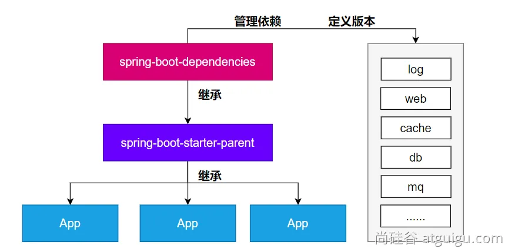
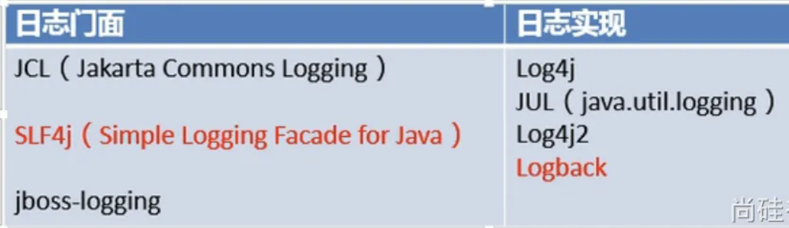
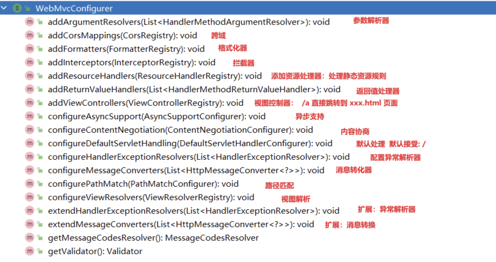
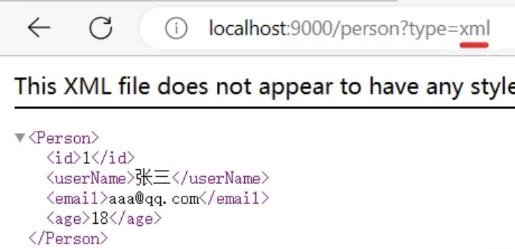
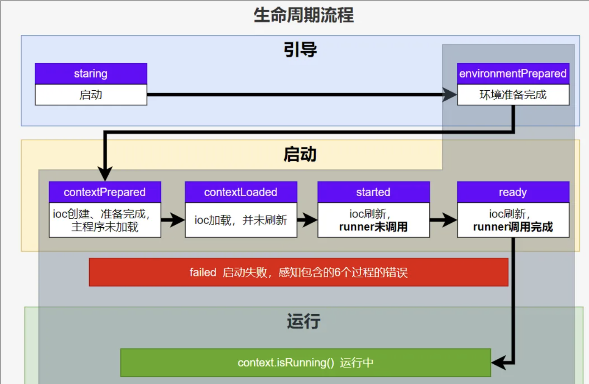

# SpringBoot基础

## 概念

SpringBoot 帮我们简单、快速地创建一个独立的、生产级别的 **Spring 应用（说明：SpringBoot底层是Spring）**

大多数 SpringBoot 应用只需要编写少量配置即可快速整合 Spring 平台以及第三方技术

### 特性

- 快速创建独立 Spring 应用
  - SSM：导包、写配置、启动运行

- 直接嵌入Tomcat、Jetty or Undertow（无需部署 war 包）【Servlet容器】

  - linux  java tomcat mysql： war 放到 tomcat 的 webapps下

  - jar： java环境:  java -jar

- **重点**：提供可选的starter，简化应用**整合**

  - **场景启动器**（starter）：web、json、邮件、oss（对象存储）、异步、定时任务、缓存...

  - 导包一堆，控制好版本。

  - 为每一种场景准备了一个依赖； **web-starter, mybatis-starter**

- **重点：**按需自动配置 Spring 以及 第三方库

  - 如果这些场景我要使用（生效）。这个场景的所有配置都会自动配置好。

  - **约定大于配置**：每个场景都有很多默认配置。

  - 自定义：配置文件中修改几项就可以

- 提供生产级特性：如 监控指标、健康检查、外部化配置等
  - 监控指标、健康检查（k8s）、外部化配置

- 无代码生成、无xml


### 依赖管理机制

思考：

1、为什么导入`starter-web`所有相关依赖都导入进来？

- 开发什么场景，导入什么场景启动器。
- maven依赖传递原则。A-B-C： A就拥有B和C
- 导入场景启动器。场景启动器：自动把这个场景的所有核心依赖全部导入进来

2、为什么版本号都不用写？

- 每个boot项目都有一个父项目`spring-boot-starter-parent`
- parent的父项目是`spring-boot-dependencies`
- 父项目 版本仲裁中心，把所有常见的jar的依赖版本都声明好了。
- 比如：`mysql-connector-j`

3、自定义版本号

- 利用maven的就近原则
  - 直接在当前项目properties标签中声明父项目用的版本属性的key
  - 直接在导入依赖的时候声明版本

4、第三方的jar包

- boot父项目没有管理的需要自行声明好

```xml
<!-- https://mvnrepository.com/artifact/com.alibaba/druid -->
<dependency>
  <groupId>com.alibaba</groupId>
  <artifactId>druid</artifactId>
  <version>1.2.16</version>
</dependency>
```




### 自动配置机制

```java
public static void main(String[] args) {

  //java10： 局部变量类型的自动推断
  var ioc = SpringApplication.run(MainApplication.class, args);

  //1、获取容器中所有组件的名字
  String[] names = ioc.getBeanDefinitionNames();
  //2、挨个遍历：
  // dispatcherServlet、beanNameViewResolver、characterEncodingFilter、multipartResolver
  // SpringBoot把以前配置的核心组件现在都给我们自动配置好了。
  for (String name : names) {
      System.out.println(name);
  }
}
```

- **默认的包扫描规则**

  - `@SpringBootApplication` 标注的类就是主程序类

  - **SpringBoot只会扫描主程序所在的包及其下面的子包，自动的component-scan功能**

  - **自定义扫描路径**

    - @SpringBootApplication(scanBasePackages = "com.xx")

    - `@ComponentScan("com.xxx")` 直接指定扫描的路径

- **配置默认值**

  - **配置文件**的所有配置项是和某个**类的对象**值进行一一绑定的。

  - 绑定了配置文件中每一项值的类： **属性类**。

  - 比如：

    - `ServerProperties`绑定了所有Tomcat服务器有关的配置

    - `MultipartProperties`绑定了所有文件上传相关的配置

    - ....参照[官方文档](https://docs.spring.io/spring-boot/docs/current/reference/html/application-properties.html#appendix.application-properties.server)：或者参照 绑定的  **属性类**。

- 按需加载自动配置

  - 导入场景`spring-boot-starter-web`

  - 场景启动器除了会导入相关功能依赖，还会导入一个`spring-boot-starter`，是所有`starter`的`starter`，基础核心starter

  - `spring-boot-starter`导入了一个包 `spring-boot-autoconfigure`。包里面都是各种场景的`AutoConfiguration`**自动配置类**

  - 虽然全场景的自动配置都在 `spring-boot-autoconfigure`这个包，但是不是全都开启的。
    - 导入哪个场景就开启哪个自动配置

总结： 导入场景启动器、触发 `spring-boot-autoconfigure`这个包的自动配置生效、容器中就会具有相关场景的功能


> **完整流程**

思考：

1、SpringBoot怎么实现导一个`**starter**`**、写一些简单配置，应用就能跑起来，我们无需关心整合**

2、为什么Tomcat的端口号可以配置在`application.properties`中，并且`Tomcat`能启动成功？

3、导入场景后哪些自动配置能生效？


***自动配置流程细节梳理：***

**1、**导入`starter-web`：导入了web开发场景

- 1、场景启动器导入了相关场景的所有依赖：`starter-json`、`starter-tomcat`、`springmvc`
- 2、每个场景启动器都引入了一个`spring-boot-starter`，核心场景启动器。
- 3、**核心场景启动器**引入了`spring-boot-autoconfigure`包。
- 4、`spring-boot-autoconfigure`里面囊括了所有场景的所有配置。
- 5、只要这个包下的所有类都能生效，那么相当于SpringBoot官方写好的整合功能就生效了。
- 6、SpringBoot默认却扫描不到 `spring-boot-autoconfigure`下写好的所有**配置类**。（这些**配置类**给我们做了整合操作），**默认只扫描主程序所在的包**。

**2、** **主程序**：`@SpringBootApplication`

- 1、`@SpringBootApplication`由三个注解组成`@SpringBootConfiguration`、`@EnableAutoConfiguratio`、`@ComponentScan`

- 2、SpringBoot默认只能扫描自己主程序所在的包及其下面的子包，扫描不到 `spring-boot-autoconfigure`包中官方写好的**配置类**

- 3、**`@EnableAutoConfiguration`**：SpringBoot **开启自动配置的核心**。

  - 是由`@Import(AutoConfigurationImportSelector.class)`提供功能：批量给容器中导入组件。

  - SpringBoot启动会默认加载 142个配置类。

  - 这**142个配置类**来自于`spring-boot-autoconfigure`下 `META-INF/spring/**org.springframework.boot.autoconfigure.AutoConfiguration**.imports`文件指定的

  - 项目启动的时候利用 @Import 批量导入组件机制把 `autoconfigure` 包下的142 `xxxxAutoConfiguration`类导入进来（**自动配置类**）

  - 虽然导入了`142`个自动配置类，并不是这`142`个自动配置类都能生效

- 4、按需生效：
  - 每一个自动配置类，都有条件注解`@ConditionalOnxxx`，只有条件成立，才能生效 

**3、**`xxxxAutoConfiguration`**自动配置类**

- **1、给容器中使用@Bean 放一堆组件。**
- 2、每个**自动配置类**都可能有这个注解`@EnableConfigurationProperties(ServerProperties.class)`，用来把配置文件中配的指定前缀的属性值封装到 `xxxProperties`**属性类**中
- 3、以Tomcat为例：把服务器的所有配置都是以`server`开头的。配置都封装到了属性类中。
- 4、给**容器**中放的所有**组件**的一些**核心参数**，都来自于`**xxxProperties**`**。**`**xxxProperties**`**都是和配置文件绑定。**
- **只需要改配置文件的值，核心组件的底层参数都能修改**

**4、**写业务，全程无需关心各种整合（底层这些整合写好了，而且也生效了）


**核心流程总结：**

1、导入`starter`，就会导入`autoconfigure`包。

2、`autoconfigure` 包里面 有一个文件 `META-INF/spring/org.springframework.boot.autoconfigure.AutoConfiguration.imports`,里面指定的所有启动要加载的自动配置类

3、@EnableAutoConfiguration 会自动的把上面文件里面写的所有**自动配置类都导入进来。xxxAutoConfiguration 是有条件注解进行按需加载**

4、`xxxAutoConfiguration`给容器中导入一堆组件，组件都是从 `xxxProperties`中提取属性值

5、`xxxProperties`又是和**配置文件**进行了绑定

**效果：**导入`starter`、修改配置文件，就能修改底层行为。


### 条件注解

如果注解指定的**条件成立**，则触发指定行为

***@ConditionalOnXxx***

**@ConditionalOnClass：如果类路径中存在这个类，则触发指定行为**

**@ConditionalOnMissingClass：如果类路径中不存在这个类，则触发指定行为**

**@ConditionalOnBean：如果容器中存在这个Bean（组件），则触发指定行为**

**@ConditionalOnMissingBean：如果容器中不存在这个Bean（组件），则触发指定行为**

**@ConditionalOnBean（value=组件类型，name=组件名字）：判断容器中是否有这个类型的组件，并且名字是指定的值**

@ConditionalOnRepositoryType (org.springframework.boot.autoconfigure.data)
@ConditionalOnDefaultWebSecurity (org.springframework.boot.autoconfigure.security)
@ConditionalOnSingleCandidate (org.springframework.boot.autoconfigure.condition)
@ConditionalOnWebApplication (org.springframework.boot.autoconfigure.condition)
@ConditionalOnWarDeployment (org.springframework.boot.autoconfigure.condition)
@ConditionalOnJndi (org.springframework.boot.autoconfigure.condition)
@ConditionalOnResource (org.springframework.boot.autoconfigure.condition)
@ConditionalOnExpression (org.springframework.boot.autoconfigure.condition)
**@ConditionalOnClass** (org.springframework.boot.autoconfigure.condition)
@ConditionalOnEnabledResourceChain (org.springframework.boot.autoconfigure.web)
**@ConditionalOnMissingClass** (org.springframework.boot.autoconfigure.condition)
@ConditionalOnNotWebApplication (org.springframework.boot.autoconfigure.condition)
@ConditionalOnProperty (org.springframework.boot.autoconfigure.condition)
@ConditionalOnCloudPlatform (org.springframework.boot.autoconfigure.condition)
**@ConditionalOnBean** (org.springframework.boot.autoconfigure.condition)
**@ConditionalOnMissingBean** (org.springframework.boot.autoconfigure.condition)
@ConditionalOnMissingFilterBean (org.springframework.boot.autoconfigure.web.servlet)
@Profile (org.springframework.context.annotation)
@ConditionalOnInitializedRestarter (org.springframework.boot.devtools.restart)
@ConditionalOnGraphQlSchema (org.springframework.boot.autoconfigure.graphql)
@ConditionalOnJava (org.springframework.boot.autoconfigure.condition)


### 属性绑定

**@ConfigurationProperties： 声明组件的属性和配置文件哪些前缀开始项进行绑定（使用这个的前提是该类已经被注册为bean）**

**@EnableConfigurationProperties：快速注册注解：**

- **场景：**SpringBoot默认只扫描自己主程序所在的包。如果导入第三方包，即使组件上标注了 @Component、@ConfigurationProperties 注解，也没用。因为组件都扫描不进来，此时使用这个注解就可以快速进行属性绑定并把组件注册进容器

将容器中任意**组件（Bean）的属性值**和**配置文件**的配置项的值**进行绑定**

1. 给容器中注册组件（@Component、@Bean）
2. 使用@ConfigurationProperties 声明组件和配置文件的哪些配置项进行绑定

或者

1. 使用@ConfigurationProperties 声明组件和配置文件的哪些配置项进行绑定
2. 然后使用@EnableConfigurationProperties将上一步声明的类注册为组件，并完成属性绑定


## 日志



**SpringBoot怎么把日志默认配置好的**

1、每个`starter`场景，都会导入一个核心场景`spring-boot-starter`

2、核心场景引入了日志的所用功能`spring-boot-starter-logging`

3、默认使用了`logback + slf4j` 组合作为默认底层日志

4、`日志是系统一启动就要用`，`xxxAutoConfiguration`是系统启动好了以后放好的组件，后来用的。

5、日志是利用**监听器机制**配置好的。`ApplicationListener`。

6、日志所有的配置都可以通过修改配置文件实现。以`logging`开始的所有配置。


> 日志格式

```shell
2023-03-31T13:56:17.511+08:00  INFO 4944 --- [           main] o.apache.catalina.core.StandardService   : Starting service [Tomcat]
2023-03-31T13:56:17.511+08:00  INFO 4944 --- [           main] o.apache.catalina.core.StandardEngine    : Starting Servlet engine: [Apache Tomcat/10.1.7]
```

默认输出格式：

- 时间和日期：毫秒级精度
- 日志级别：ERROR, WARN, INFO, DEBUG, or TRACE.
- 进程 ID
- ---： 消息分割符
- 线程名： 使用[]包含
- Logger 名： 通常是产生日志的**类名**
- 消息： 日志记录的内容

注意： logback 没有FATAL级别，对应的是ERROR


> 使用日志

```java
Logger logger = LoggerFactory.getLogger(getClass());

或者使用Lombok的@Slf4j注解,会自动为当前类注入一个log属性
```


> 日志级别

- 由低到高：`ALL,TRACE, DEBUG, INFO, WARN, ERROR,FATAL,OFF`；**只会打印指定级别及以上级别的日志**

  - ALL：打印所有日志

  - TRACE：追踪框架详细流程日志，一般不使用

  - DEBUG：开发调试细节日志

  - INFO：关键、感兴趣信息日志

  - WARN：警告但不是错误的信息日志，比如：版本过时

  - ERROR：业务错误日志，比如出现各种异常

  - FATAL：致命错误日志，比如jvm系统崩溃

  - OFF：关闭所有日志记录

- 不指定级别的所有类，都使用root指定的级别作为默认级别
- SpringBoot日志**默认级别是** **INFO**


1. 在`application.properties/yaml`中配置`logging.level.<logger-name>=<level>`指定日志级别
2. level可取值范围：`TRACE, DEBUG, INFO, WARN, ERROR, FATAL, or OFF`，定义在 `LogLevel`类中
3. root 的`logger-name`叫root，可以配置`logging.level.root=warn`，代表所有未指定日志级别都使用 root 的 warn 级别


> 日志分组

比较有用的技巧是：

将相关的logger分组在一起，统一配置。SpringBoot 也支持。比如：Tomcat 相关的日志统一设置

```java
logging.group.tomcat=org.apache.catalina,org.apache.coyote,org.apache.tomcat
logging.level.tomcat=trace
```

SpringBoot 预定义两个组

| Name | Loggers                                                      |
| ---- | ------------------------------------------------------------ |
| web  | org.springframework.core.codec, org.springframework.http, org.springframework.web, org.springframework.boot.actuate.endpoint.web, org.springframework.boot.web.servlet.ServletContextInitializerBeans |
| sql  | org.springframework.jdbc.core, org.hibernate.SQL, org.jooq.tools.LoggerListener |


> 日志文件输出

SpringBoot 默认只把日志写在控制台，如果想额外记录到文件，可以在application.properties中添加logging.file.name or logging.file.path配置项。

| logging.file.name | logging.file.path | 示例     | 效果                             |
| ----------------- | ----------------- | -------- | -------------------------------- |
| 未指定            | 未指定            |          | 仅控制台输出                     |
| **指定**          | 未指定            | my.log   | 写入指定文件。可以加路径         |
| 未指定            | **指定**          | /var/log | 写入指定目录，文件名为spring.log |
| **指定**          | **指定**          |          | 以logging.file.name为准          |


> 日志文件归档和滚动切割

归档：每天的日志单独存到一个文档中。

切割：每个文件10MB，超过大小切割成另外一个文件。

1. 每天的日志应该独立分割出来存档。如果使用logback（SpringBoot 默认整合），可以通过application.properties/yaml文件指定日志滚动规则。
2. 如果是其他日志系统，需要自行配置（添加log4j2.xml或log4j2-spring.xml）
3. 支持的滚动规则设置如下

| 配置项                                               | 描述                                                         |
| ---------------------------------------------------- | ------------------------------------------------------------ |
| logging.logback.rollingpolicy.file-name-pattern      | 日志存档的文件名格式（默认值：${LOG_FILE}.%d{yyyy-MM-dd}.%i.gz） |
| logging.logback.rollingpolicy.clean-history-on-start | 应用启动时是否清除以前存档（默认值：false）                  |
| logging.logback.rollingpolicy.max-file-size          | 存档前，每个日志文件的最大大小（默认值：10MB）               |
| logging.logback.rollingpolicy.total-size-cap         | 日志文件被删除之前，可以容纳的最大大小（默认值：0B）。设置1GB则磁盘存储超过 1GB 日志后就会删除旧日志文件 |
| logging.logback.rollingpolicy.max-history            | 日志文件保存的最大天数(默认值：7).                           |


> 自定义配置

通常我们配置 application.properties 就够了。当然也可以自定义。比如：

| 日志系统                | 自定义                                                       |
| ----------------------- | ------------------------------------------------------------ |
| Logback                 | logback-spring.xml, logback-spring.groovy, logback.xml, or logback.groovy |
| Log4j2                  | log4j2-spring.xml or log4j2.xml                              |
| JDK (Java Util Logging) | logging.properties                                           |

如果可能，建议在日志配置中使用`-spring` 变量（例如，`logback-spring.xml` 而不是 `logback.xml`）。如果使用标准配置文件，spring 无法完全控制日志初始化。最佳实战：自己要写配置，配置文件名加上 `xx-spring.xml`


> 切换日志组合

先排除已有的，然后引入自己的

```xml
<dependency>
    <groupId>org.springframework.boot</groupId>
    <artifactId>spring-boot-starter-web</artifactId>
</dependency>
<dependency>
    <groupId>org.springframework.boot</groupId>
    <artifactId>spring-boot-starter</artifactId>
    <exclusions>
        <exclusion>
            <groupId>org.springframework.boot</groupId>
            <artifactId>spring-boot-starter-logging</artifactId>
        </exclusion>
    </exclusions>
</dependency>
<dependency>
    <groupId>org.springframework.boot</groupId>
    <artifactId>spring-boot-starter-log4j2</artifactId>
</dependency>
```

log4j2支持yaml和json格式的配置文件

| 格式 | 依赖                                                         | 文件名                   |
| ---- | ------------------------------------------------------------ | ------------------------ |
| YAML | com.fasterxml.jackson.core:jackson-databind + com.fasterxml.jackson.dataformat:jackson-dataformat-yaml | log4j2.yaml + log4j2.yml |
| JSON | com.fasterxml.jackson.core:jackson-databind                  | log4j2.json + log4j2.jsn |

### 

## springboot-web开发

> SpringBoot的Web开发能力，由**SpringMVC**提供。

### WebMvcAutoConfiguration原理

#### 生效条件

```java
@AutoConfiguration(after = { DispatcherServletAutoConfiguration.class, TaskExecutionAutoConfiguration.class,
		ValidationAutoConfiguration.class }) //在这些自动配置之后
@ConditionalOnWebApplication(type = Type.SERVLET) //如果是web应用就生效，类型SERVLET、REACTIVE 响应式web
@ConditionalOnClass({ Servlet.class, DispatcherServlet.class, WebMvcConfigurer.class })
@ConditionalOnMissingBean(WebMvcConfigurationSupport.class) //容器中没有这个Bean，才生效。默认就是没有
@AutoConfigureOrder(Ordered.HIGHEST_PRECEDENCE + 10)//优先级
@ImportRuntimeHints(WebResourcesRuntimeHints.class)
public class WebMvcAutoConfiguration { 
}
```


#### 效果

WebMvcAutoConfiguration主要结构如下：

- 放了两个Filter

  - `HiddenHttpMethodFilter`；页面表单提交Rest请求（GET、POST、PUT、DELETE）

  - `FormContentFilter`： 表单内容Filter，GET（数据放URL后面）、POST（数据放请求体）请求可以携带数据，PUT、DELETE 的请求体数据会被忽略，这个filter则提供了该支持

- 给容器中放了`WebMvcConfigurer`组件；给SpringMVC添加各种定制功能，和springboot配置的默认行为

  - 所有的功能最终会和配置文件进行绑定

  - WebMvcProperties： `spring.mvc`配置文件

  - WebProperties： `spring.web`配置文件

  - ```java
    @Configuration(proxyBeanMethods = false)
    @Import(EnableWebMvcConfiguration.class) //额外导入了其他配置
    @EnableConfigurationProperties({ WebMvcProperties.class, WebProperties.class })
    @Order(0)
    public static class WebMvcAutoConfigurationAdapter implements WebMvcConfigurer, ServletContextAware{
    }
    ```

- 还有一个**EnableWebMvcConfiguration类**：配置一些额外功能可以看作是上一个接口功能的补充，比如：欢迎页，静态资源前缀


#### WebMvcConfigurer接口

提供了配置SpringMVC底层的所有组件入口




#### 静态资源规则源码

```java
@Override
public void addResourceHandlers(ResourceHandlerRegistry registry) {
    if (!this.resourceProperties.isAddMappings()) {
        logger.debug("Default resource handling disabled");
        return;
    }
    addResourceHandler(registry, this.mvcProperties.getWebjarsPathPattern(),
            "classpath:/META-INF/resources/webjars/");
    addResourceHandler(registry, this.mvcProperties.getStaticPathPattern(), (registration) -> {
        registration.addResourceLocations(this.resourceProperties.getStaticLocations());
        if (this.servletContext != null) {
            ServletContextResource resource = new ServletContextResource(this.servletContext, SERVLET_LOCATION);
            registration.addResourceLocations(resource);
        }
    });
}
```

- 规则一：访问： `/webjars/**`路径就去 `classpath:/META-INF/resources/webjars/`下找资源.
- 规则二：访问： `/**`路径就去 `静态资源默认的四个位置找资源`
  - `classpath:/META-INF/resources/`
  - `classpath:/resources/`
  - `classpath:/static/`
  - `classpath:/public/`
- 规则三：**静态资源默认都有缓存规则的设置**
  - 所有缓存的设置，直接通过**配置文件**： `spring.web`
  - cachePeriod： 缓存周期； 多久不用找服务器要新的。 默认没有，以s为单位
  - cacheControl： **HTTP缓存**控制；[https://developer.mozilla.org/zh-CN/docs/Web/HTTP/Caching](https://developer.mozilla.org/zh-CN/docs/Web/HTTP/Caching#概览)
  - **useLastModified**：是否使用最后一次修改。配合HTTP Cache规则

> 如果浏览器访问了一个静态资源 `index.js`，如果服务这个资源没有发生变化，下次访问的时候就可以直接让浏览器用自己缓存中的东西，而不用给服务器发请求。

```java
registration.setCachePeriod(getSeconds(this.resourceProperties.getCache().getPeriod()));
registration.setCacheControl(this.resourceProperties.getCache().getCachecontrol().toHttpCacheControl());
registration.setUseLastModified(this.resourceProperties.getCache().isUseLastModified());
```


#### EnableWebMvcConfiguration 源码

```java
//SpringBoot 给容器中放 WebMvcConfigurationSupport 组件。
//我们如果自己放了 WebMvcConfigurationSupport 组件，Boot的WebMvcAutoConfiguration都会失效。
@Configuration(proxyBeanMethods = false)
@EnableConfigurationProperties(WebProperties.class)
public static class EnableWebMvcConfiguration extends DelegatingWebMvcConfiguration implements ResourceLoaderAware {}
```

- `HandlerMapping`： 根据请求路径 ` /a` 找那个handler能处理请求

  - `WelcomePageHandlerMapping`： 

    - 访问 `/**`路径下的所有请求，都在以前四个静态资源路径下找，欢迎页也一样

    - 找`index.html`：只要静态资源的位置有一个 `index.html`页面，项目启动默认访问


#### 为什么容器中放一个`WebMvcConfigurer`就能配置底层行为

1. WebMvcAutoConfiguration 是一个自动配置类，它里面有一个 `EnableWebMvcConfiguration`
2. `EnableWebMvcConfiguration`继承与 `DelegatingWebMvcConfiguration`，这两个都生效
3. `DelegatingWebMvcConfiguration`利用 DI 把容器中 所有 `WebMvcConfigurer `注入进来
4. 别人调用 ``DelegatingWebMvcConfiguration`` 的方法配置底层规则，而它调用所有 `WebMvcConfigurer`的配置底层方法。


#### WebMvcConfigurationSupport

提供了很多的默认设置。

判断系统中是否有相应的类：如果有，就加入相应的`HttpMessageConverter`

```java
jackson2Present = ClassUtils.isPresent("com.fasterxml.jackson.databind.ObjectMapper", classLoader) &&
				ClassUtils.isPresent("com.fasterxml.jackson.core.JsonGenerator", classLoader);
jackson2XmlPresent = ClassUtils.isPresent("com.fasterxml.jackson.dataformat.xml.XmlMapper", classLoader);
jackson2SmilePresent = ClassUtils.isPresent("com.fasterxml.jackson.dataformat.smile.SmileFactory", classLoader);
```


### Web默认配置

整合web后：

```xml
<dependency>
    <groupId>org.springframework.boot</groupId>
    <artifactId>spring-boot-starter-web</artifactId>
</dependency>
```

SpringMVC自动配置场景给我们配置了如下所有默认行为

1. `WebMvcAutoConfiguration`web场景的自动配置类
   1. 支持RESTful的filter：HiddenHttpMethodFilter
   2. 支持非POST请求，请求体携带数据：FormContentFilter
   3. 导入**`EnableWebMvcConfiguration`**：
      1. `RequestMappingHandlerAdapter`
      2. `WelcomePageHandlerMapping`： **欢迎页功能**支持（模板引擎目录、静态资源目录放index.html），项目访问/ 就默认展示这个页面.
      3. `RequestMappingHandlerMapping`：找每个请求由谁处理的映射关系
      4. `ExceptionHandlerExceptionResolver`：默认的异常解析器 
      5. `LocaleResolver`：国际化解析器
      6. `ThemeResolver`：主题解析器
      7. `FlashMapManager`：临时数据共享
      8. `FormattingConversionService`： 数据格式化 、类型转化
      9. `Validator`： 数据校验`JSR303`提供的数据校验功能
      10. `WebBindingInitializer`：请求参数的封装与绑定
      11. `ContentNegotiationManager`：内容协商管理器
   4. **`WebMvcAutoConfigurationAdapter`**配置生效，它是一个`WebMvcConfigurer`，定义mvc底层组件
      1. 定义好 `WebMvcConfigurer` **底层组件默认功能；**
      2. 视图解析器：`InternalResourceViewResolver`
      3. 视图解析器：`BeanNameViewResolver`,**视图名（controller方法的返回值字符串）**就是组件名
      4. 内容协商解析器：`ContentNegotiatingViewResolver`
      5. 请求上下文过滤器：`RequestContextFilter`: 任意位置直接获取当前请求
      6. 静态资源链规则
      7. `ProblemDetailsExceptionHandler`：错误详情
      8. SpringMVC内部场景异常被它捕获：
   5. 定义了MVC默认的底层行为: **`WebMvcConfigurer`**


**重要：**

- 如果想保持boot mvc 的默认配置，并且自定义更多的 mvc 配置，如：interceptors,formatters,view controllers 等。可以使用@Configuration注解添加一个WebMvcConfigurer 类型的配置类，并不要标注 @EnableWebMvc
- 如果想保持 boot mvc 的默认配置，但要自定义核心组件实例，比如：RequestMappingHandlerMapping, RequestMappingHandlerAdapter, 或ExceptionHandlerExceptionResolver，给容器中放一个 WebMvcRegistrations 组件即可
- 如果想全面接管 Spring MVC，@Configuration 标注一个配置类，并加上@EnableWebMvc注解，实现 WebMvcConfigurer 接口

`@ConditionalOnMissingBean(WebMvcConfigurationSupport.class)`从这里可以看出，只有我们没有注册该组件，springboot才会去创建他的web自动配置，他的默认配置才会生效，比如静态资源访问等等

而`@EnableWebMvc`注导入了`@Import({DelegatingWebMvcConfiguration.class})`，该类是`WebMvcConfigurationSupport.class`的子类，所以一旦我们使用了该注解，springboot为我们做的工作就不会生效了（但是处理请求之类的还是可以访问，这些不属于springboot做的工作，是springmvc做的工作）


### 静态资源映射

#### 默认配置

静态资源映射规则在 WebMvcAutoConfiguration 中进行了定义：

- `/webjars/**` 的所有路径 资源都在 `classpath:/META-INF/resources/webjars/`
- `/**` 的所有路径 资源都在 `classpath:/META-INF/resources/`、`classpath:/resources/`、`classpath:/static/`、`classpath:/public/`

静态资源缓存

- 所有静态资源都定义了缓存规则。【浏览器访问过一次，就会缓存一段时间】，但此功能参数无默认值
  - `period`： 缓存间隔。 默认 0S；
  - `cacheControl`：缓存控制。 默认无；
  - `useLastModified`：是否使用lastModified头。 默认 false；

欢迎页

- 欢迎页规则在 WebMvcAutoConfiguration 中进行了定义：

  - 在**静态资源**目录下找 index.html

  - 没有就在 templates下找index模板页

Favicon

- 在静态资源目录下找 favicon.ico


#### 自定义配置

配置文件

```properties
#开启静态资源映射规则,默认true
spring.web.resources.add-mappings=true

#设置缓存
#spring.web.resources.cache.period=3600
##缓存详细合并项控制，覆盖period配置：
## 浏览器第一次请求服务器，服务器告诉浏览器此资源缓存7200秒，7200秒以内的所有此资源访问不用发给服务器请求，7200秒以后发请求给服务器
spring.web.resources.cache.cachecontrol.max-age=7200
#使用资源 last-modified 时间，来对比服务器和浏览器的资源是否相同没有变化。相同返回 304
spring.web.resources.cache.use-last-modified=true

#自定义静态资源文件夹位置
spring.web.resources.static-locations=classpath:/a/,classpath:/b/,classpath:/static/

#2、 spring.mvc
## 2.1. 自定义webjars路径前缀
spring.mvc.webjars-path-pattern=/wj/**
## 2.2. 静态资源访问路径前缀，浏览器访问时，需要加static
spring.mvc.static-path-pattern=/static/**
```

配置类（注意不要使用@EnableWebMvc）

```java
@Configuration // 这是一个配置类,直接继承 WebMvcConfigurer
public class MyConfig implements WebMvcConfigurer {
    @Override
    public void addResourceHandlers(ResourceHandlerRegistry registry) {
        //保留以前规则
        //自己写新的规则。
        registry.addResourceHandler("/static/**")
                .addResourceLocations("classpath:/a/","classpath:/b/")
                .setCacheControl(CacheControl.maxAge(1180, TimeUnit.SECONDS));
    }
}
```

或者

```java
@Configuration // 这是一个配置类,给容器中放一个 WebMvcConfigurer 组件，就能自定义底层
public class MyConfig {
    @Bean
    public WebMvcConfigurer webMvcConfigurer(){
        return new WebMvcConfigurer() {
            @Override
            public void addResourceHandlers(ResourceHandlerRegistry registry) {
                registry.addResourceHandler("/static/**")
                        .addResourceLocations("classpath:/a/", "classpath:/b/")
                        .setCacheControl(CacheControl.maxAge(1180, TimeUnit.SECONDS));
            }
        };
    }
}
```


### 路径匹配规则

> **Spring5.3** 之后加入了更多的请求路径匹配的实现策略；
>
> 以前只支持 AntPathMatcher 策略, 现在提供了 **PathPatternParser** 策略。并且可以让我们指定到底使用那种策略。

Ant 风格的路径模式语法具有以下规则：

- *：表示**任意数量**的字符。
- ?：表示任意**一个字符**。
- ：表示任意数量的**目录**。
- {}：表示一个命名的模式**占位符**。
- []：表示**字符集合**，例如[a-z]表示小写字母。

例如：

- *.html 匹配任意名称，扩展名为.html的文件。
- /folder1/* / *.java 匹配在folder1目录下的任意两级目录下的.java文件。
- /folder2/** / *.jsp 匹配在folder2目录下任意目录深度的.jsp文件。
- /{type}/{id}.html 匹配任意文件名为{id}.html，在任意命名的{type}目录下的文件。

注意：Ant 风格的路径模式语法中的特殊字符需要转义，如：

- 要匹配文件路径中的星号，则需要转义为\ \ *。
- 要匹配文件路径中的问号，则需要转义为\ \ ?。


AntPathMatcher 与 PathPatternParser

- PathPatternParser 在 jmh 基准测试下，有 6~8 倍吞吐量提升，降低 30%~40%空间分配率
- PathPatternParser 兼容 AntPathMatcher 语法，并支持更多类型的路径模式
- PathPatternParser  "**" 多段匹配的支持仅允许在模式末尾使用

总结： 

- 使用默认的路径匹配规则，是由 PathPatternParser  提供的
- 如果路径中间需要有 **，替换成ant风格路径

```properties
# 改变路径匹配策略：
# ant_path_matcher 老版策略；
# path_pattern_parser 新版策略；
spring.mvc.pathmatch.matching-strategy=ant_path_matcher
```


### 内容协商

#### 概念

> `@ResponseBody`由`HttpMessageConverter`处理

**SpringBoot 多端内容适配**。

- 基于请求头内容协商：（默认开启）
- 客户端向服务端发送请求，携带HTTP标准的**Accept请求头**。
- **Accept**: `application/json`、`text/xml`、`text/yaml`
- 服务端根据客户端**请求头期望的数据类型**进行**动态返回**

基于请求参数内容协商**：（需要开启）**

- 发送请求 GET /projects/spring-boot?format=json 
- 匹配到 @GetMapping("/projects/spring-boot") 
- 根据**参数协商**，优先返回 json 类型数据【**需要开启参数匹配设置**】
- 发送请求 GET /projects/spring-boot?format=xml,优先返回 xml 类型数据


#### xml

请求同一个接口，可以返回json和xml不同格式数据

引入支持写出xml内容依赖

```xml
<dependency>
  <groupId>com.fasterxml.jackson.dataformat</groupId>
  <artifactId>jackson-dataformat-xml</artifactId>
</dependency>
```

标注注解

```java
@JacksonXmlRootElement  // 可以写出为xml文档
@Data
public class Person {
  private Long id;
  private String userName;
  private String email;
  private Integer age;
}
```

开启基于请求参数的内容协商

```properties
# 开启基于请求参数的内容协商功能。 默认参数名：format。 默认此功能不开启
spring.mvc.contentnegotiation.favor-parameter=true
# 指定内容协商时使用的参数名。默认是 format
spring.mvc.contentnegotiation.parameter-name=type
大多数 MediaType 都是开箱即用的。也可以自定义内容类型，这种就需要自己写HttpMessageConveter
spring.mvc.contentnegotiation.media-types.yaml=text/yaml
```




#### Yaml

导入依赖

```xml
<dependency>
    <groupId>com.fasterxml.jackson.dataformat</groupId>
    <artifactId>jackson-dataformat-yaml</artifactId>
</dependency>
```

编写配置

```properties
#新增一种媒体类型
spring.mvc.contentnegotiation.media-types.yaml=text/yaml
```

增加HttpMessageConverter组件，专门负责把对象写出为yaml格式，HttpMessageConverter的示例写法 

```java
public class MyYamlHttpMessageConverter extends AbstractHttpMessageConverter<Object> {

    private ObjectMapper objectMapper = null; //把对象转成yaml

    public MyYamlHttpMessageConverter(){
        //告诉SpringBoot这个MessageConverter支持哪种媒体类型  //媒体类型
        super(new MediaType("text", "yaml", Charset.forName("UTF-8")));
        YAMLFactory factory = new YAMLFactory()
                .disable(YAMLGenerator.Feature.WRITE_DOC_START_MARKER);
        this.objectMapper = new ObjectMapper(factory);
    }

    @Override
    protected boolean supports(Class<?> clazz) {
        //只要是对象类型，不是基本类型
        return true;
    }

    @Override  //@RequestBody
    protected Object readInternal(Class<?> clazz, HttpInputMessage inputMessage) throws IOException, HttpMessageNotReadableException {
        return null;
    }

    @Override //@ResponseBody 把对象怎么写出去
    protected void writeInternal(Object methodReturnValue, HttpOutputMessage outputMessage) throws IOException, HttpMessageNotWritableException {
        //try-with写法，自动关流
        try(OutputStream os = outputMessage.getBody()){
            this.objectMapper.writeValue(os,methodReturnValue);
        }
    }
}
```


### 错误处理

**错误处理的自动配置**都在`ErrorMvcAutoConfiguration`中，两大核心机制：

- SpringBoot 会自适应处理错误，响应页面或JSON数据
- SpringMVC的错误处理机制依然保留，MVC处理不了，才会交给boot进行处理


> 前后端分离项目：使用@ControllerAdvice + @ExceptionHandler 进行统一异常处理，返回json数据即可


## Profiles环境

### 注解使用

容器中所有组件均可以使用`@Profile`注解来标记该组件生效的环境，如果不配置，默认是所有环境都生效


### 环境激活

```properties
# 存在一个默认环境default
# spring.profiles.active 和spring.profiles.default只能写在主配置文件中
spring.profiles.active=production,hsqldb
# 包含环境
spring.profiles.include[0]=common
spring.profiles.include[1]=local
spring.profiles.include=common,local
# 生效的环境 = 激活的环境/默认环境  + 包含的环境
# 基础的配置mybatis、log、xxx：写到包含环境中;需要动态切换变化的 db、redis：写到激活的环境中
# 环境分组
spring.profiles.group.prod[0]=db
spring.profiles.group.prod[1]=mq
# 使用spring.profiles.active=prod ，就会激活prod，db，mq配置文件
```


### Profile配置文件

优先级由高到低，前面覆盖后面

- 命令行 > 包外config直接子目录 > 包外config目录 > 包外根目录 > 包内目录

- 同级比较： 

  - profile配置 > 默认配置

  - properties配置 > yaml配置




## 核心原理

### Springboot生命周期



 ```java
 /**
  * Listener先要从 META-INF/spring.factories 读到
  *
  * 1、引导： 利用 BootstrapContext 引导整个项目启动
  *      starting：              应用开始，SpringApplication的run方法一调用，只要有了 BootstrapContext 就执行
  *      environmentPrepared：   环境准备好（把启动参数等绑定到环境变量中），但是ioc还没有创建；【调一次】
  * 2、启动：
  *      contextPrepared：       ioc容器创建并准备好，但是sources（主配置类）没加载。关闭引导上下文；组件都没创建【调一次】
  *      contextLoaded：         ioc容器加载。主配置类加载进去了。但是ioc容器还没刷新（bean没创建）。
  *      =======截止以前，ioc容器里面还没造bean=======
  *      started：               ioc容器刷新了（所有bean造好了），但是 runner 没调用。
  *      ready:                  ioc容器刷新了（所有bean造好了），所有 runner 调用完了。
  * 3、运行
  *     以前步骤都正确执行，代表容器running。
  */
 ```

如何监听生命周期：自定义`SpringApplicationRunListener`来**监听事件**；

1. 编写`SpringApplicationRunListener` **实现类**
2. 在 `META-INF/spring.factories` 中配置 `org.springframework.boot.SpringApplicationRunListener=com.example.springboot_study.config.Config`，还可以指定一个**有参构造器**，接受两个参数`(SpringApplication application, String[] args)`

```java
public class Config implements SpringApplicationRunListener {
    @Override
    public void starting(ConfigurableBootstrapContext bootstrapContext) {
        SpringApplicationRunListener.super.starting(bootstrapContext);
    }

    @Override
    public void environmentPrepared(ConfigurableBootstrapContext bootstrapContext, ConfigurableEnvironment environment) {
        SpringApplicationRunListener.super.environmentPrepared(bootstrapContext, environment);
    }

    @Override
    public void contextPrepared(ConfigurableApplicationContext context) {
        SpringApplicationRunListener.super.contextPrepared(context);
    }

    @Override
    public void contextLoaded(ConfigurableApplicationContext context) {
        SpringApplicationRunListener.super.contextLoaded(context);
    }

    @Override
    public void started(ConfigurableApplicationContext context, Duration timeTaken) {
        SpringApplicationRunListener.super.started(context, timeTaken);
    }

    @Override
    public void ready(ConfigurableApplicationContext context, Duration timeTaken) {
        SpringApplicationRunListener.super.ready(context, timeTaken);
    }

    @Override
    public void failed(ConfigurableApplicationContext context, Throwable exception) {
        SpringApplicationRunListener.super.failed(context, exception);
    }
}
// 他就会自动加载该类，并在相应的事件调用相应的函数
```


### springboot事件

sprinboot除了有生命周期，还有事件机制，两者是同时运行的

和生命周期同样操作即可，这样可以监听所有的事件

```java
public class MyListener implements ApplicationListener {
    @Override
    public void onApplicationEvent(ApplicationEvent event) {
        System.out.println(event);
    }
}
// spring.factories
// org.springframework.context.ApplicationListener=com.example.springboot_study.config.MyListener
```

9大事件触发顺序&时机

1. `ApplicationStartingEvent`：应用启动但未做任何事情, 除过注册listeners and initializers.
2. `ApplicationEnvironmentPreparedEvent`：  Environment 准备好，但context 未创建.
3. `ApplicationContextInitializedEvent`: ApplicationContext 准备好，ApplicationContextInitializers 调用，但是任何bean未加载
4. `ApplicationPreparedEvent`： 容器刷新之前，bean定义信息加载
5. `ApplicationStartedEvent`： 容器刷新完成， runner未调用

=========以下就开始插入了**探针机制**============

1. `AvailabilityChangeEvent`： `LivenessState.CORRECT`应用存活； **存活探针**
2. `ApplicationReadyEvent`: 任何runner被调用
3. `AvailabilityChangeEvent`：`ReadinessState.ACCEPTING_TRAFFIC`**就绪探针**，可以接请求
4.  `ApplicationFailedEvent `：启动出错


### 自定义事件驱动开发

> 自定义事件

`LoginSuccessEvent`定义一个事件类，实现`ApplicationEvent`即可，只需要在该类中存储数据即可


> 定义事件发布者

这里可以选择实现`ApplicationEventPublisherAware`接口，也可以选择直接使用注解自动注入`ApplicationEventPublisher`

```java
@Service
public class EventPublisher implements ApplicationEventPublisherAware {

    /**
     * 底层发送事件用的组件，SpringBoot会通过ApplicationEventPublisherAware接口自动注入给我们
     * 事件是广播出去的。所有监听这个事件的监听器都可以收到
     */
    ApplicationEventPublisher applicationEventPublisher;

    /**
     * 所有事件都可以发
     * @param event
     */
    public void sendEvent(ApplicationEvent event) {
        //调用底层API发送事件
        applicationEventPublisher.publishEvent(event);
    }

    /**
     * 会被自动调用，把真正发事件的底层组组件给我们注入进来
     * @param applicationEventPublisher event publisher to be used by this object
     */
    @Override
    public void setApplicationEventPublisher(ApplicationEventPublisher applicationEventPublisher) {
        this.applicationEventPublisher = applicationEventPublisher;
    }
}
```

> 事件订阅者

```java
@Service
public class CouponService {

    @Order(1) // 	使用该注解，可以设置事件订阅者的处理优先级
    @EventListener
    public void onEvent(LoginSuccessEvent loginSuccessEvent){
        System.out.println("===== CouponService ====感知到事件"+loginSuccessEvent);
        UserEntity source = (UserEntity) loginSuccessEvent.getSource();
        sendCoupon(source.getUsername());
    }

    public void sendCoupon(String username){
        System.out.println(username + " 随机得到了一张优惠券");
    }
}
// 也可以选择实现接口
@Component
public class CouponService implements ApplicationListener<LoginSuccessEvent> {
    @Override
    public void onApplicationEvent(LoginSuccessEvent event) {
        System.out.println("Received custom event - " + event);
    }
}
```

> 触发事件

```java
@Autowired
private EventPublisher eventPublisher;

public void sendEvent() {
    eventPublisher.sendEvent(xxxx);
}
```


### SpringBootApplication

1、@SpringBootConfiguration

就是： @Configuration ，容器中的组件，配置类。spring ioc启动就会加载创建这个类对象

2、@EnableAutoConfiguration：开启自动配置

开启自动配置，包含下面两个注解

@AutoConfigurationPackage：扫描主程序包：加载自己的组件

- 利用 `@Import(AutoConfigurationPackages.Registrar.class)` 想要给容器中导入组件。
- 把主程序所在的**包**的所有组件导入进来。

@Import(AutoConfigurationImportSelector.class)：加载所有自动配置类：加载starter导入的组件

>扫描SPI文件：`META-INF/spring/org.springframework.boot.autoconfigure.AutoConfiguration.imports`，以前都是放在spring.factories文件中，现在单独抽取了一个自动配置类文件

3、@ComponentScan

组件扫描：排除一些组件（哪些不要）

排除前面已经扫描进来的`配置类`、和`自动配置类`。

```java
@ComponentScan(excludeFilters = { @Filter(type = FilterType.CUSTOM, classes = TypeExcludeFilter.class),
      @Filter(type = FilterType.CUSTOM, classes = AutoConfigurationExcludeFilter.class) })
```


完整流程


### 自定义starter

1. 创建`自定义starter`项目，引入`spring-boot-starter`基础依赖

2. 编写模块功能，引入模块所有需要的依赖。

3. 编写`xxxAutoConfiguration`自动配置类，帮其他项目导入这个模块需要的所有组件

4. 编写配置文件`META-INF/spring/org.springframework.boot.autoconfigure.AutoConfiguration.imports`指定启动需要加载的自动配置

5. 其他项目引入即可使用


> 1、配置映射

```java
@ConfigurationProperties(prefix = "robot")  //此属性类和配置文件指定前缀绑定
@Component
@Data
public class RobotProperties {
    private String name;
    private String age;
    private String email;
}
```

倒入配置提示包

```xml
<!--        导入配置处理器，配置文件自定义的properties配置都会有提示-->
<dependency>
    <groupId>org.springframework.boot</groupId>
    <artifactId>spring-boot-configuration-processor</artifactId>
    <optional>true</optional>
</dependency>
```


> 2、编写业务代码


> 3、编写RobotAutoConfiguration类
>
> 这里建议采用@EnableConfigurationProperties(RobotProperties.class)，然后在RobotProperties类中不使用@Component注解了

```java
@Import({/*导入所有的bean*/})
@Configuration
public class RobotAutoConfiguration {
  // 也可以使用@bean导入
}
```

到这一步，就可以在别的工程中引入改starter，然后使用@Import注解导入`RobotAutoConfiguration`配置类即可

但这样太麻烦


> 添加@Enablexxx机制
>
> 创建自定义注解，自己导入`RobotAutoConfiguration`配置类

```java
@Retention(RetentionPolicy.RUNTIME)
@Target({ElementType.TYPE})
@Documented
@Import(RobotAutoConfiguration.class)
public @interface EnableRobot {

}
```

使用的时候加上一个`@EnableRobot`注解就好了，这样仍然很麻烦，下面做到自动化


> 依赖SpringBoot的SPI机制
>
> 创建META-INF/spring/org.springframework.boot.autoconfigure.AutoConfiguration.imports 文件，编写好自动配置类的全类名即可
>
> 项目启动，自动加载自动配置类 perfect
