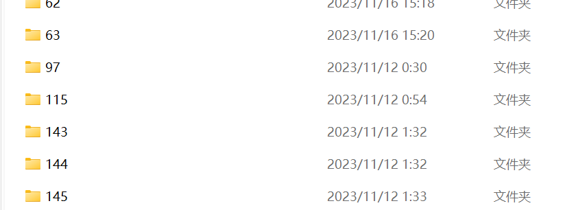

# System Usage

## 基本操作

一些ubuntu系统的基本操作


> 修改密码

```bash
passwd
```

然后输入旧密码，和新密码即可


> 查看当前所处目录

```bash
pwd

/data0/shunliu
```


> 创建目录

```bash
mkdir xxx
```


> 包括隐藏文件和详细信息：

```
bashCopy code
ls -a -l
```

这将显示包括隐藏文件在内的所有文件，并提供详细信息，如文件权限、所有者、大小等。


> 删除目录或文件

删除安装python的目录

```bash
rm -rf ~/python3.9
```


> 不小心删了环境变量

可以手动修改配置文件后，关闭当前终端窗口，然后重新打开一个新的终端窗口。每次打开新终端时，它都会加载配置文件，包括 `.bashrc`。


> 关闭脚本日志输出

使用：

```
脚本路径/脚本名 >/dev/null 2>&1
```

说明：

- 可以简单的理解/dev/null是Linux下的回收站
- \>默认是把标准输出重定向
- 2>&1是把出错输出也定向到标准输出


## 磁盘

### 磁盘空间

使用df -h命令来查看磁盘信息， -h 选项为根据大小适当显示

```bash
df -h
```

| 内容参数     | 含义                    |
| ------------ | ----------------------- |
| `Filesystem` | 文件系统                |
| `Size`       | 分区大小                |
| `1k-blocks`  | 单位是1KB(使用`df`查看) |
| `Used`       | 已用容量                |
| `Avail`      | 还可用的容量            |
| `Use%`       | 已用百分比              |
| `Mounted on` | 挂载点                  |

### 使用情况

`du` (disk usage)，含义为显示磁盘空间的使用情况，用于查看当前目录的大小

```bash
#查看当前目录大小
du -sh
#返回该目录/文件的大小
du -sh [目录/文件]
#查看当前文件夹下的所有文件大小（包含子文件夹）
du -h
#查看指定文件夹下的所有文件大小（包含子文件夹）
du -h [目录/文件]
#返回当前文件夹的总M数
du -sm
#返回指定文件夹/文件总M数
du -sm [文件夹/文件]
```

参数	含义
-s	对每个Names参数只给出占用的数据块总数
-a	递归地显示指定目录中各文件及子目录中各文件占用的数据块数
-b	以字节为单位列出磁盘空间使用情况（系统默认以k字节为单位）
-k	以1024字节为单位列出磁盘空间使用情况
-c	最后再加上一个总计（系统默认设置）
-l	计算所有的文件大小，对硬链接文件，则计算多次
-x	跳过在不同文件系统上的目录不予统计
-h	以K，M，G为单位，提高信息的可读性


## 文件操作

### 编辑

**Vim:**

Vim是一个强大的文本编辑器。要使用Vim：

```bash
vim filename
```

在Vim中，按 `i` 进入插入模式，进行编辑。完成编辑后，按 `Esc` 键，然后输入 `:wq` 并按 `Enter` 保存更改并退出。

> :w 保存文件但不退出vi
> :w file 将修改另外保存到file中，不退出vi
> :w! 强制保存，不推出vi
> :wq 保存文件并退出vi
> :wq! 强制保存文件，并退出vi
> :q 不保存文件，退出vi
> :q! 不保存文件，强制退出vi
> :e! 放弃所有修改，从上次保存文件开始再编辑命令历史


### 复制文件

```bash
cp -r /data0/shunliu/pythonfile/code_context_model_prediction/git_repo_code/ /data0/shunliu/dataset_copy/
cp -r 源路径 目的路径 （可以是文件夹也可以是w）
```


### 传文件

要将本地文件夹传输到Ubuntu服务器，可以使用一些常见的工具和协议，例如 `scp`（Secure Copy Protocol）。下面是基本方法：（这个针对大的文件夹以及一些不合法的命名可能会失败）

```bash
scp -r -P 22 /path/to/local/folder username@remote_server_ip:/path/on/remote/server
```

- `-r`: 递归地复制整个文件夹。
- `-P`：指定端口号，默认为22。
- `/path/to/local/folder`: 本地文件夹的路径。
- `username`: 远程服务器上的用户名。
- `remote_server_ip`: 远程服务器的IP地址。
- `/path/on/remote/server`: 远程服务器上存储文件夹的路径。


## 文件系统顺序

### linux

Linux文件系统本身是区分大小写的，这意味着在Linux中文件和目录的名称是区分大小写的。例如，`file.txt`和`File.txt`在Linux中被视为两个不同的文件。

然而，需要注意的是，Linux的文件系统对大小写敏感，但文件系统的访问权限通常是不区分大小写的。这意味着，如果你在文件系统上创建了一个名为`file.txt`的文件，你可以用`File.txt`或`FILE.txt`等形式来引用这个文件，只要确保在大小写敏感的环境中使用正确的大小写形式。

总体而言，Linux的文件系统本身是区分大小写的，但在文件名的访问权限上通常不区分大小写。这与Windows的文件系统（例如NTFS）有所不同，因为Windows默认是不区分大小写的。

### vs windows

Ubuntu（Linux系统）和Windows系统对文件系统的排序方式可能会有所不同。这是因为它们使用不同的文件系统和排序算法。

Linux系统通常使用的文件系统是类Unix的文件系统，例如ext4。在这些文件系统中，文件和目录的排序是基于字母顺序的，不区分大小写。这是因为Linux默认是区分大小写的，所以文件名的排序也会按照字符的ASCII码值进行。

而在Windows系统中，默认的文件系统是NTFS（新技术文件系统）或FAT32。在Windows上，文件和目录的排序通常是不区分大小写的，同时还考虑了一些特殊字符的排序规则。

因此，在跨平台开发时，如果依赖文件名的排序顺序，可能需要注意这些差异，以确保代码在不同操作系统上的一致性。在Python中，可以使用`os.listdir()`获取目录中的文件列表，然后根据需要对这个列表进行排序。例如：

```python
import os

files = os.listdir('/path/to/directory')
sorted_files = sorted(files, key=str.casefold)  # 不区分大小写的排序
```

上述代码中，`str.casefold`用于在排序时不区分大小写。这样可以帮助你处理在不同操作系统上的文件排序差异。

windows:



linux:


## 文件路径

### vs windows

Ubuntu（Linux）和Windows在文件路径表示上有一些差异，主要表现在路径分隔符、根目录表示、以及驱动器表示等方面。

1. **路径分隔符：**
   - **Ubuntu/Linux:** 使用斜杠 `/` 作为路径分隔符。例如：`/home/user/Documents`.
   - **Windows:** 使用反斜杠 `\` 作为路径分隔符。例如：`C:\Users\User\Documents`.

2. **根目录表示：**
   - **Ubuntu/Linux:** 根目录用 `/` 表示，根目录下的文件路径是绝对路径。例如：`/home/user/Documents`.
   - **Windows:** 每个驱动器都有一个根目录，通常是`C:\`、`D:\`等。路径可以是绝对路径（例如：`C:\Users\User\Documents`）或相对路径。

3. **驱动器表示：**
   - **Ubuntu/Linux:** 不涉及驱动器的概念，文件系统都被挂载到目录中。
   - **Windows:** 使用驱动器号表示不同的磁盘分区，例如`C:\`, `D:\`, 等。

4. **相对路径表示：**
   - **Ubuntu/Linux:** 相对路径从当前工作目录开始，使用 `.` 表示当前目录，`..` 表示上一级目录。例如：`./subdirectory/file.txt`.
   - **Windows:** 同样使用 `.` 和 `..` 表示相对路径，例如：`.\subdirectory\file.txt`.

需要注意的是，一些跨平台的工具和框架（如Python）可以处理这些路径差异，但在编写跨平台代码时，最好使用相对路径和跨平台的路径处理方法，以确保在不同操作系统上都能正确运行。(也坑到我了)


## 进程

### 查询

在 Linux 中，可以使用 ps 命令来查看进程。这个命令可以显示当前运行的进程的详细信息。以下是一些常用的 ps 命令选项:

- `ps aux`：显示所有用户的所有进程
- `ps -ef`：显示所有进程的完整信息
- `ps -uf`：显示当前用户的进程的完整信息
- `ps -e`：显示所有进程，但不包括线程
- `ps -f`：显示完整的格式化输出，包括父进程 ID (PPID) 和运行时间等信息

也可以结合其他命令来过滤和查找特定的进程。例如，使用 grep 命令可以根据进程名称或其他关键词进行过滤。例如：`ps -ef | grep java`


### 终止

1、kill命令：使用kill命今可以向进程发送信号，其中SIGTERM信号可以用来优雅地终止进程，而SIGKILL信号则强制杀死进程.

- 例如，要杀死进程号为1234的进程，可以使用以下命令：`kill 1234`
- 如果进程无法响应SIGTERM信号，可以使用以下命令强制杀死进程：`kill -9 1234`

2、pkill命令：pkill命令可以通过进程名称或者其他属性来杀死进程

- 要杀死名为nginx的进程，可以使用以下命令：`pkill nginx`


### 后台运行nohup

**nohup**
no hang up 不挂起
npm start 启动命令
\>app.logs 输出日志
2>&1 将错误也输出到日志
& 后台运行

```bash
nohup npm start >app.logs 2>&1 &
```

如果此时直接关闭终端的话，会断掉该命令所对应的session，导致nohup对应的进程被通知需要一起shutdown，起不到关掉终端后调用程序继续后台运行的作用。

解决方法：使用`exit`退出终端

使用exit命令退出终端，我们的程序还是会继续运行，这是为什么呢? 这是因为使用exit命令退出终端时不会向终端所属任务发SIGHUP信号，这是huponexit 配置项控制的，默认是off，可以使用shopt 命令查看

```bash
shunliu@amax:~/javafile/java-code-extractor/target$ shopt |grep huponexit
huponexit       off
shunliu@amax:~/javafile/java-code-extractor/target$ shopt -s huponexit
shunliu@amax:~/javafile/java-code-extractor/target$ shopt |grep huponexit
huponexit       on
```

1.将huponexit设置为off

```bash
shopt -u huponexit
```

2.将huponexit设置为on

```bash
shopt -s huponexit
```


## 安装python

没有sudo权限，可以在没有特权的用户下安装Python。

1. **选择或创建安装目录：**

   首先，选择一个你有写入权限的目录，或者在你的主目录下创建一个新目录来安装Python。例如，你可以在主目录下创建一个名为`python3.9`的目录：

   ```bash
   mkdir ~/python3.9
   ```

2. **下载Python 3.9.2源代码：**

   在终端中执行以下命令，从Python官方网站下载源代码：

   ```bash
   wget https://www.python.org/ftp/python/3.9.2/Python-3.9.2.tgz
   ```

3. **解压缩源代码文件：**

   ```bash
   tar -xf Python-3.9.2.tgz
   ```

4. **进入解压缩后的目录：**

   ```bash
   cd Python-3.9.2
   ```

5. **配置安装路径和编译：**

   ```bash
   ./configure --prefix=/data1/shunliu/Program/python3.9
   make -j$(nproc)
   ```

   这将在你的主目录下创建一个名为`python3.9`的目录，并在其中安装Python。

6. **安装Python 3.9.2：**

   ```bash
   make install
   ```

   这将安装Python到你指定的目录。

7. **添加Python可执行文件路径到PATH：**

   你可能需要将Python的可执行文件路径添加到你的PATH中，这样系统才能找到它。在你的shell配置文件（例如`~/.bashrc`或`~/.zshrc`）中添加以下行：

   ```bash
   export PATH=/data1/shunliu/Program/pyt:$PATH
   ```

   然后运行 `source ~/.bashrc` 或 `source ~/.zshrc` 来使更改生效。

8. **验证安装：**

   ```bash
   python3.9 --version
   ```

   这将显示安装的Python 3.9.2版本号。


## 安装pip

如果你想在非root用户下安装`pip`，并且同时指定安装路径，你可以使用 `--target` 选项。这个选项允许你指定包的安装目录。

以下是步骤：

1. **下载 `get-pip.py` 脚本:**

   在终端中执行以下命令，下载 `get-pip.py` 脚本：

   ```bash
   wget https://bootstrap.pypa.io/get-pip.py
   ```

   如果你没有安装 `wget`，你可以使用 `curl`：

   ```bash
   curl -O https://bootstrap.pypa.io/get-pip.py
   ```

2. **指定安装路径运行脚本:**

   使用 `python` 命令运行 `get-pip.py` 脚本，并指定安装路径。确保使用的是你要安装 `pip` 的 Python 版本，例如，如果你想安装给 Python 3 使用，使用 `python3`：

   ```bash
   python3.9 get-pip.py --target=/data1/shunliu/Program/my_pip
   ```

   这将在 `$HOME/my_pip_installation` 目录中安装 `pip`。

3. **将用户本地 `bin` 目录添加到 `$PATH`：**

   为了能够在任何地方运行 `pip`，确保用户本地的 `bin` 目录在 `$PATH` 中。在 `~/.bashrc` 或 `~/.zshrc` 文件中添加以下行：

   ```bash
   export PATH=$PATH:/data1/shunliu/Program/my_pip
   ```

   使用 `source` 命令或重新启动终端以使更改生效。

4. **验证安装:**

   运行以下命令验证 `pip` 是否已成功安装：

   ```bash
   pip --version
   ```

   如果一切正常，你应该能够看到 `pip` 的版本信息。

5. **切换为清华源**

   ```bash
   pip config set global.index-url https://pypi.tuna.tsinghua.edu.cn/simple
   pip config list
   ```


## 安装Anaconda

使用上面的方法安装了python和pip之后，安装一些库的时候会报`_ctype`找不到的错误，网上的解决方式是使用apt-get安装libffi-dev库，但是没有root权限，在实验室服务器上始终没找到办法解决。最后使用anaconda进行环境的自动管理。

使用 `wget` 命令下载并安装 Anaconda。以下是在终端中执行的步骤：

1. **在终端中下载Anaconda脚本:** 打开终端并使用 `wget` 下载Anaconda脚本。请注意，您需要替换 `<版本号>` 为您要下载的Anaconda版本的实际版本号。访问 [Anaconda官方网站](https://www.anaconda.com/products/distribution) 获取最新版本的下载链接。

   ```bash
   wget https://repo.anaconda.com/archive/Anaconda3-<版本号>-Linux-x86_64.sh
   ```

2. **运行安装脚本:** 下载完成后，运行下载的脚本来安装Anaconda。

   ```bash
   bash Anaconda3-<版本号>-Linux-x86_64.sh
   ```

   在这里，同样需要替换 `<版本号>` 为下载的Anaconda版本的实际版本号。

3. **按照安装程序的提示进行操作:** 安装程序将提示您接受许可协议、选择安装位置等。最好使用它的**默认安装位置**，不知道为什么，我切换安装目录他会安装失败。

4. **初始化Anaconda:** 安装完成后，可能需要重新启动终端，或者运行以下命令来初始化Anaconda：

   ```bash
   source ~/.bashrc
   ```

5. **测试Anaconda:** 运行以下命令来测试Anaconda是否正确安装：

   ```bash
   conda --version
   ```

   这应该显示Anaconda的版本号，表明安装成功。


## 安装java

1. **下载 OpenJDK 16 压缩包：**

   ```bash
   mkdir -p java
   cd java
   wget https://download.java.net/java/GA/jdk16/7863447f0ab643c585b9bdebf67c69db/36/GPL/openjdk-16_linux-x64_bin.tar.gz
   ```

   请注意，上述 URL 是 Java 16 的下载链接，可以根据需要选择其他版本。

2. **解压缩文件：**

   ```bash
   tar -xzvf openjdk-16_linux-x64_bin.tar.gz
   ```

3. **设置环境变量：**

   在 `~/.bashrc` 文件中添加以下行：

   ```bash
   export JAVA_HOME=/data1/shunliu/java/jdk-16
   export PATH=$JAVA_HOME/bin:$PATH
   ```

   然后运行 `source ~/.bashrc` 以使更改生效。

4. **验证安装：**

   ```bash
   java -version
   ```

   确保显示安装的 Java 版本信息。
