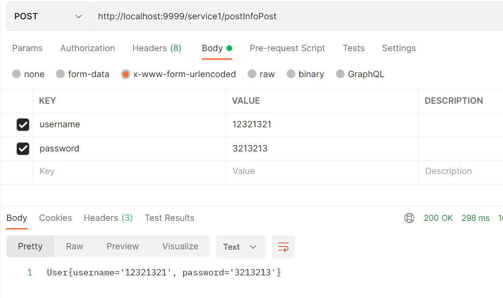

# SpringCloud微服务搭建和调用

## 1 安装nacos

Nacos 致力于帮助您发现、配置和管理微服务。Nacos 提供了一组简单易用的特性集，帮助您快速实现动态服务发现、服务配置、服务元数据及流量管理。

Nacos 帮助您更敏捷和容易地构建、交付和管理微服务平台。 Nacos 是构建以“服务”为中心的现代应用架构 (例如微服务范式、云原生范式) 的服务基础设施。

首先下载nacos：https://github.com/alibaba/nacos/releases


下载的时候注意：1.4.0以下使用的mysql驱动是8.0以下的，1.4.0以上使用的驱动就是8.0以上的了，所以大家在使用的nacos的时候要注意与mysql的对应版本问题，否则会因为nacos与mysql的版本不对应导致的nacos无法加载数据源。


接下来需要配置数据库，进入`conf`目录，然后使用数据库工具建立nacos数据库，并执行下面的sql脚本


然后修改配置文件`application.properties`，配置数据库源，使用mysql数据源记得下面这行的注释取消掉


然后修改`nacos`运行模式，nacos默认使用的集群模式cluster，需要修改为单机模式standalone

Nacos支持三种部署模式，这里是用于自己测试，使用第一种就行

1、单机模式：可用于测试和单机使用，生产环境切忌使用单机模式（满足不了高可用）

2、集群模式：可用于生产环境，确保高可用

3、多集群模式：可用于多数据中心场景

修改`bin`目录下的`startup.cmd`，将启动模式设置为`standalone`，它默认是集群启动


之后就可以启动nacos了，**启动nacos需要有java环境**，如果没有配置java环境变量，需要先配置好。


双击cmd程序即可直接运行


进入图中提示的Console网页，就是nacos的控制台


账号密码默认都是`nacos`


## 2 项目搭建

### 工程搭建


首先搭建最外层项目，这里新建一个maven项目即可。然后把所有文件都删掉，只留下一个`pom.xml`配置文件即可。


然后创建两个微服务，之这个maven项目下，新建module，选择springboot项目即可。这样就可以是一个父子工程，只需要在父工程里面导入一个公共的依赖，子工程就不需要额外引入了，可以直接继承。


这里需要注意很大的问题，就是springboot和springcloud存在版本适配问题，需要版本对应了，才能启动成功

cloud和boot版本对照表，[可以去官网](https://spring.io/projects/spring-cloud)


### 父子工程依赖配置

父工程配置`pom.xml`

```xml
<groupId>org.example</groupId>
<artifactId>nacos_demo</artifactId>
<version>0.0.1-SNAPSHOT</version>
<!--    有了这个parent就不需要给子集pom配置版本号了,因为它包括了
        1.定义了java编译版本为1.8
        2.使用utf-8格式编码
        3.继承spring-boot-dependencies进行统一版本依赖管理
        4.执行打包 war jar操作配置（可以省略打包plugin的配置）
        5.自动化资源过滤 如application.properties和application.yml的资源过滤 包括profile 多环境配置的
        6.自动化插件配置
        7.不需要配置maven打包plugin插件配置-->
<parent>
    <groupId>org.springframework.boot</groupId>
    <artifactId>spring-boot-starter-parent</artifactId>
    <version>2.1.3.RELEASE</version>
</parent>

<!--父工程配置这个文件的打包方法，不然打包的时候，这个配置文件不会打包进去-->
<packaging>pom</packaging>
<!--子项目在这注册-->
<modules>
    <module>nacos-server1</module>
    <module>nacos-server2</module>
    <module>nacos-gateway</module>
</modules>

<dependencyManagement>
    <dependencies>
        <!--引入springcloud的版本-->
        <dependency>
            <groupId>org.springframework.cloud</groupId>
            <artifactId>spring-cloud-dependencies</artifactId>
            <version>Greenwich.SR3</version>
            <type>pom</type>
            <scope>import</scope>
        </dependency>

        <dependency>
            <groupId>com.alibaba.cloud</groupId>
            <artifactId>spring-cloud-alibaba-dependencies</artifactId>
            <version>2.1.1.RELEASE</version>
            <type>pom</type>
            <scope>import</scope>
        </dependency>
    </dependencies>

</dependencyManagement>
<!--国内依赖镜像仓库，可以方便下载依赖-->
<repositories>
    <repository>
        <id>spring</id>
        <url>https://maven.aliyun.com/repository/spring</url>
        <releases>
            <enabled>true</enabled>
        </releases>
        <snapshots>
            <enabled>true</enabled>
        </snapshots>
    </repository>
</repositories>
<properties>
    <maven.compiler.source>8</maven.compiler.source>
    <maven.compiler.target>8</maven.compiler.target>
</properties>
```

子工程`pom.xml`

```xml
<parent>
    <!--配置引用的父工程-->
    <groupId>org.example</groupId>
    <artifactId>nacos_demo</artifactId>
    <version>0.0.1-SNAPSHOT</version>
</parent>
<groupId>com.example</groupId>
<artifactId>nacos-server1</artifactId>
<version>0.0.1-SNAPSHOT</version>
<name>nacos-server1</name>
<!--子工程配置打包方式-->
<packaging>jar</packaging>
<description>nacos-server1</description>
<properties>
    <java.version>1.8</java.version>
</properties>
<dependencies>
    <dependency>
        <groupId>org.springframework.boot</groupId>
        <artifactId>spring-boot-starter</artifactId>
    </dependency>

    <dependency>
        <groupId>org.springframework.boot</groupId>
        <artifactId>spring-boot-starter-test</artifactId>
        <scope>test</scope>
    </dependency>

    <dependency>
        <groupId>com.alibaba.cloud</groupId>
        <artifactId>spring-cloud-alibaba-nacos-discovery</artifactId>
    </dependency>

    <!--提供web服务的子项目导入这个依赖-->
    <dependency>
        <groupId>org.springframework.boot</groupId>
        <artifactId>spring-boot-starter-web</artifactId>
    </dependency>
    <!--gateway子项目则导入gateway的依赖-->
    <!--<dependency>
        <groupId>org.springframework.cloud</groupId>
        <artifactId>spring-cloud-starter-gateway</artifactId>
    </dependency>-->
    
    <!--其余的可以根据需要再自行引入-->
</dependencies>
```


### springcloud配置

首先需要再每个子项目的启动类上添加`@EnableDiscoveryClient`注解，允许nacos服务发现


然后配置web服务的项目的`application.yml`文件

```yml
server:
  port: 8081
spring:
  application:
	# 微服务的名字
    name: service1
  cloud:
  	# nacos的注册地址
    nacos:
      discovery:
        server-addr: localhost:8848
```


然后配置网关的`application.yml`文件

```yml
server:
  # 统一的访问入口
  port: 9999
spring:
  application:
    name: nacos-gateway
  cloud:
    nacos:
      discovery:
        server-addr: localhost:8848
    gateway:
      discovery:
        locator:
          enabled: true #开启表示根据微服务名称映射，就是微服务名称拼接到url中可以直接访问，但是不推荐这么使用 容易暴露微服务 默认false，开启后可以通过ip:port/服务名称/接口地址进行服务转发
      enabled: true #默认开启网关true，关闭网关false
      # 这里就是配置微服务的访问，可以实现负载均衡等功能
      routes:
        - id: service1 #路由的ID，没有固定规则但要求唯一，建议配合服务名
          uri: http://localhost:8081  #匹配后提供服务的路由地址
          predicates:
            - Path=/service1/**  #断言，路径相匹配的进行路由转发
        - id: service2
          uri: http://localhost:8082
          predicates:
            - Path=/service2/**

```


## 3 启动

分别启动这三个项目，即可看到这三个项目都在nacos注册了


## 4 调用

写个简单的例子


当启动了可以根据服务名匹配时，就可以使用ip:port/服务名称/接口地址进行访问


关闭之后，就不能了，只能通过自己定义的匹配规则进行访问


## 5 服务间调用FeignClient

feign是Springboot cloud体系下的一个重要组件，用于微服务间的调用，底层为httpClient。
feign 暂时不支持GET方式传递bean类封装的多参数对象，feign调用用GET请求传递复杂参数时,底层的urlhttpclient会自动把get方法转为post方法，因此需要针对bean类进行转换，主要有三种方式：
1）将 bean封装的多参数对象拆散成一个一个单独的属性放在方法参数里。（不适用于参数多的案例）
2）使用 GET 传递 @Requestbody（慎用），此方式违反 RESTFul 规范，要求被请求项目参数支持Requestbody，且需要将FeignClient的访问方式替换为apache下的httpclient访问方式。
3）把方法参数变成 Map 传递。
这里使用第三种方法把方法参数变成 Map 传递实现。


哪个服务用到，就操作哪个服务，一下均是操作`service`服务

添加依赖

```xml
<!-- feign -->
<dependency>
    <groupId>org.springframework.cloud</groupId>
    <artifactId>spring-cloud-starter-openfeign</artifactId>
</dependency>
```

启动类添加如下注解`@EnableFeignClients`


然后编写代理类

```JAVA
package com.example.nacosserver1;

import org.springframework.cloud.openfeign.FeignClient;
import org.springframework.stereotype.Component;
import org.springframework.web.bind.annotation.RequestMapping;

import java.util.Map;

@FeignClient(name = "service2",url = "http://localhost:8082")
@Component
public interface Server2FeignClient {


  @RequestMapping("/service2/postInfo")
  String postInfo(@RequestParam Map requestVo); // get请求携带对象，转换为map，加个注解就行

  @RequestMapping("/service2/hello")
  String hello();

  @RequestMapping(value = "/service2/postInfoPost", method = RequestMethod.POST)
  String postInfoPost(User user);
}

```

和`controller`类

```java
package com.example.nacosserver1;

import com.alibaba.fastjson.JSON;
import org.springframework.beans.factory.annotation.Autowired;
import org.springframework.web.bind.annotation.CrossOrigin;
import org.springframework.web.bind.annotation.RequestMapping;
import org.springframework.web.bind.annotation.RestController;

import java.util.Map;

@RestController
@CrossOrigin
@RequestMapping("service1")
public class UserController {

  // 自动注入接口
  @Autowired
  private Server2FeignClient server2FeignClient;

  @RequestMapping("hello")
  public String hello() {
    return "hello1";
  }

  @RequestMapping("hello2")
  public String hello2() {
      // 直接调用接口的函数即可
    return server2FeignClient.hello();
  }

  @GetMapping("postInfo")
  public String postInfo(User user) {
    // 使用fastjson完成对象到map的转换
    return server2FeignClient.postInfo(JSON.parseObject(JSON.toJSONString(user), Map.class));
  }
    
  @PostMapping("postInfoPost")
  public String postInfoPost(User user) {
    return server2FeignClient.postInfoPost(user);
  }
}

```


顺便给出`service2`的controller

```java
@RequestMapping("hello")
public String hello() {
    return "hello2";
}

@GetMapping("/postInfo")
public String postInfo(User user) {
    System.out.println(user);
    return user.toString();
}

@PostMapping("/postInfoPost")
public String postInfoPost(@RequestBody User user) {
    System.out.println(user);
    return user.toString();
}
```


测试：


通过`service`调用`service2`的hello接口，这是无参数传递情况


传递一个user对象，get请求，需要转换为map形式，然后feign客户端需要使用`@RequestParam`参数



使用post请求携带请求体，可以直接使用user作为feign的参数传递，只不过需要注意的是，feign只支持`json`形式的请求体，所以在`service2`中需要使用`@RequestBody`注解，但是`service1`里面可以不用，可以使用`x-www-form-urlencoded`格式的请求体。


有了这些基本的框架，就可以开始学习编写微服务项目。