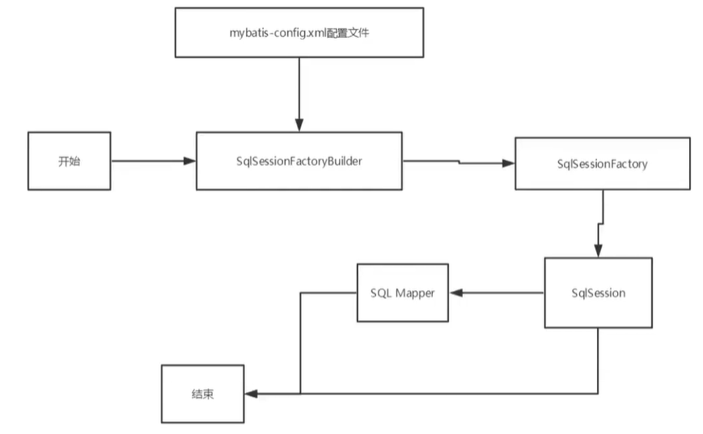
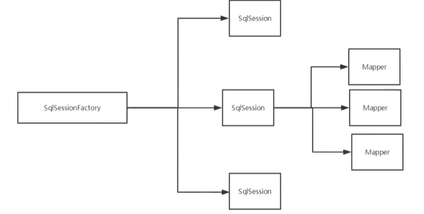
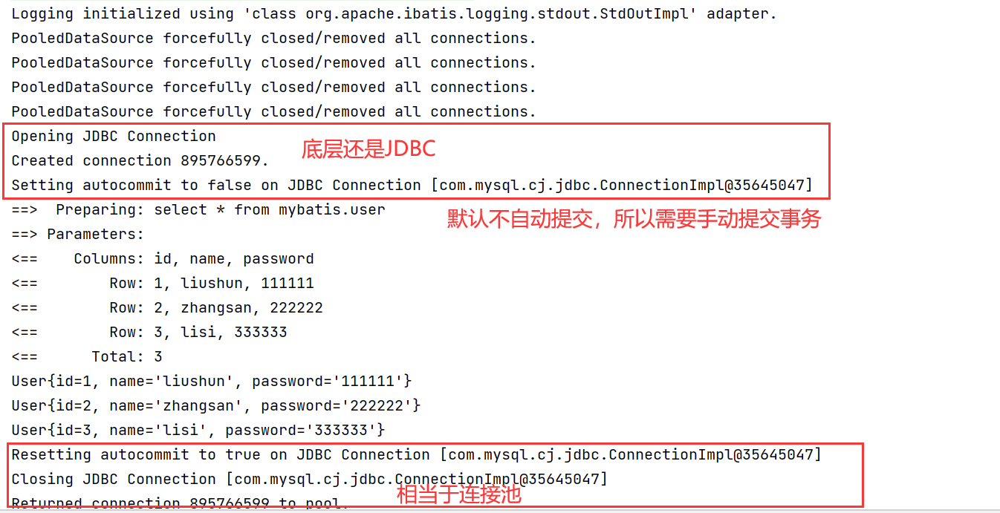

# Mybatis

## 简介

### 概念

MyBatis 是一款优秀的持久层框架，它支持自定义 SQL、存储过程以及高级映射。

MyBatis 免除了几乎所有的 JDBC 代码以及设置参数和获取结果集的工作。

MyBatis 可以通过简单的 XML 或注解来配置和映射原始类型、接口和 Java POJO（Plain Old Java Objects，普通老式 Java 对象）为数据库中的记录。

### 官网

https://mybatis.org/mybatis-3/zh/getting-started.html

### jar包

```xml
<!-- https://mvnrepository.com/artifact/org.mybatis/mybatis -->
<dependency>
    <groupId>org.mybatis</groupId>
    <artifactId>mybatis</artifactId>
    <version>3.5.7</version>
</dependency>
```

### 持久化和持久层

持久化是一个操作，持久层是一个名词

持久化是指将数据保存到文件或者数据库中，持久层是进行操作持久化的地方

## 第一个Mybatis程序

驱动配置

```xml
<!--        mysql 驱动    -->
        <dependency>
            <groupId>mysql</groupId>
            <artifactId>mysql-connector-java</artifactId>
            <version>8.0.26</version>
        </dependency>
<!--        mybatis 驱动-->
        <!-- https://mvnrepository.com/artifact/org.mybatis/mybatis -->
        <dependency>
            <groupId>org.mybatis</groupId>
            <artifactId>mybatis</artifactId>
            <version>3.5.7</version>
        </dependency>
<!--        junit 单元测试    -->
        <dependency>
            <groupId>junit</groupId>
            <artifactId>junit</artifactId>
            <version>4.12</version>
            <scope>test</scope>
        </dependency>
```

由于maven约定大于配置，所以需要配置resources 防止资源导出失败

```xml
<build>
        <resources>
            <resource>
                <directory>src/main/resources</directory>
                <includes>
                    <include>**/*.properties</include>
                    <include>**/*.xml</include>
                </includes>
                <filtering>true</filtering>
            </resource>
            <resource>
                <directory>src/main/java</directory>
                <includes>
                    <include>**/*.properties</include>
                    <include>**/*.xml</include>
                </includes>
                <filtering>true</filtering>
            </resource>
        </resources>
    </build>
```

mybatis工具类，相当于JDBC中的PreparedStatement，用来执行数据库操作

SqlSession 提供了在数据库执行 SQL 命令所需的所有方法

```java
//获得SqlSession对象
public class MybatisUtils {

    private static SqlSessionFactory sqlSessionFactory;
    static {
        try {
            //获得SqlSessionFactory实例
            String resource = "mybatis-config.xml";
            InputStream inputStream = Resources.getResourceAsStream(resource);
            sqlSessionFactory = new SqlSessionFactoryBuilder().build(inputStream);
        } catch (IOException e) {
            e.printStackTrace();
        }
    }

    //既然有了 SqlSessionFactory，顾名思义，我们可以从中获得 SqlSession 的实例。
    // SqlSession 提供了在数据库执行 SQL 命令所需的所有方法。你可以通过 SqlSession 实例来直接执行已映射的 SQL 语句
    public static SqlSession getSqlSession(){
        return sqlSessionFactory.openSession();
    }
}
```

编写UserMapper.xml来代替UserMapper接口的实现类

```xml
<?xml version="1.0" encoding="UTF8"?>这里要是UTF8不能有-
<!DOCTYPE mapper
        PUBLIC "-//mybatis.org//DTD Mapper 3.0//EN"
        "http://mybatis.org/dtd/mybatis-3-mapper.dtd">
<!--namespace 唯一绑定dao的接口-->
<mapper namespace="com.shun.dao.UserMapper">
    <select id="getUserList" resultType="com.shun.pojo.User">
        select * from mybatis.user
    </select>
</mapper>
```

重要的是mybatis-config.xml的配置每一个Mapper.xml文件，都需要注册，最好使用绝对路径

```xml
<?xml version="1.0" encoding="UTF-8" ?>
<!DOCTYPE configuration
        PUBLIC "-//mybatis.org//DTD Config 3.0//EN"
        "http://mybatis.org/dtd/mybatis-3-config.dtd">
<configuration>
    <environments default="development">
        <environment id="development">
            <transactionManager type="JDBC"/>
            <dataSource type="POOLED">
                <property name="driver" value="com.mysql.cj.jdbc.Driver"/>
                <property name="url" value="jdbc:mysql://localhost:3306/mybatis?useSSL=true&amp;userUnicode=true&amp;characterEncoding=UTF-8"/>
                <property name="username" value="root"/>
                <property name="password" value=".20010404liushun"/>
            </dataSource>
        </environment>
    </environments>
    <mappers>
        <mapper resource="com/shun/dao/UserMapper.xml"/>
    </mappers>
</configuration>
```

## CRUD

增删改必须要提交事务才能真正写入数据库

mybatis是默认开启事务的，并且是默认不自动提交的

==参数一般用Map来实现，而不是使用对象==

```java
//获得对象
SqlSession sqlSession = MybatisUtils.getSqlSession();

//执行
UserMapper mapper = sqlSession.getMapper(UserMapper.class);
int ddd = mapper.addUser(new User(4, "ddd", "1111111"));

sqlSession.commit();
sqlSession.close();
```

## 配置解析

### 核心文件配置

db.properties

```properties
driver=com.mysql.cj.jdbc.Driver
url=jdbc:mysql://localhost:3306/mybatis?useSSL=true&userUnicode=true&characterEncoding=UTF-8
username=root
password=.20010404liushun
```

mybatis-config.xml

```xml
<!--    引入外部配置文件    -->
    <properties resource="db.properties"/>
```

### 映射器

```xml
<!-- 使用相对于类路径的资源引用 -->
<mappers>
  <mapper resource="org/mybatis/builder/AuthorMapper.xml"/>
  <mapper resource="org/mybatis/builder/BlogMapper.xml"/>
  <mapper resource="org/mybatis/builder/PostMapper.xml"/>
</mappers>
```

```xml
<!-- 使用映射器接口实现类的完全限定类名 -->
<mappers>
  <mapper class="org.mybatis.builder.AuthorMapper"/>
  <mapper class="org.mybatis.builder.BlogMapper"/>
  <mapper class="org.mybatis.builder.PostMapper"/>
</mappers>
```

```xml
<!-- 将包内的映射器接口实现全部注册为映射器 -->
<mappers>
  <package name="org.mybatis.builder"/>
</mappers>
```

后面两种方式要求：

实体类和Mapper配置文件必须**同名**且在**同一包**下

## 生命周期和作用域



作用域和生命周期类别是至关重要的，因为错误的使用会导致非常严重的**并发问题**

#### SqlSessionFactoryBuilder

一旦创建了 SqlSessionFactory，就不再需要它

局部变量

#### SqlSessionFactory

说白了就是数据库连接池

SqlSessionFactory 一旦被创建就应该在应用的运行期间一直存在，没有任何理由丢弃它或重新创建另一个实例

因此 SqlSessionFactory 的最佳作用域是应用作用域

最简单的就是使用单例模式或者静态单例模式

#### SqlSession

等价于连接到连接池的一个请求

SqlSession 的实例不是线程安全的，因此是不能被共享的，所以它的最佳的作用域是请求或方法作用域

用完之后需要立即关闭，否则就会一直占用资源

换句话说，每次收到 HTTP 请求，就可以打开一个 SqlSession，返回一个响应后，就关闭它



每一个Mapper，就代表一个具体的业务

## 结果集映射

解决字段名和属性名不一致的问题

有两种方式

- 取类型别名
- resultMap：只需要映射不同的名称即可

```xml
方式一
<select id="selectUsers" resultType="User">
  select
    user_id             as "id",
    user_name           as "userName",
    hashed_password     as "hashedPassword"
  from some_table
  where id = #{id}
</select>
方式二
<resultMap id="userResultMap" type="User">
  <id property="id" column="user_id" />
  <result property="username" column="user_name"/>
  <result property="password" column="hashed_password"/>
</resultMap>
<select id="selectUsers" resultMap="userResultMap">
  select user_id, user_name, hashed_password
  from some_table
  where id = #{id}
</select>
```

## 日志


### STDOUT_LOGGING 标准日志输出

#### 配置文件

```xml
<settings>
    <setting name="logImpl" value="STDOUT_LOGGING"/>
</settings>
```



### log4j

#### 概念

Log4j是[Apache](https://baike.baidu.com/item/Apache/8512995)的一个开源项目，通过使用Log4j，我们可以控制日志信息输送的目的地是[控制台](https://baike.baidu.com/item/控制台/2438626)、文件、[GUI](https://baike.baidu.com/item/GUI)组件；

我们也可以控制每一条日志的输出格式；

通过定义每一条日志信息的级别，我们能够更加细致地控制日志的生成过程

这些可以通过一个[配置文件](https://baike.baidu.com/item/配置文件/286550)来灵活地进行配置，而不需要修改应用的代码

#### 依赖

```xml
<!-- https://mvnrepository.com/artifact/log4j/log4j -->
<dependency>
    <groupId>log4j</groupId>
    <artifactId>log4j</artifactId>
    <version>1.2.17</version>
</dependency>
```

#### 配置文件

```properties
#将等级为DEBUG的日志信息输出到console和file这两个目的地
log4j.rootLogger = DEBUG, console, file

#控制台输出的相关设置
log4j.appender.console = org.apache.log4j.ConsoleAppender
log4j.appender.console.Target = System.out
log4j.appender.console.threshold = DEBUG
log4j.appender.console.layout = org.apache.log4j.PatternLayout
log4j.appender.console.layout.ConversionPattern = [%c]-%m%n

#文件输出的相关设置
log4j.appender.file = org.apache.log4j.RollingFileAppender
log4j.appender.file.File = ./log/shun.log
log4j.appender.file.MaxFileSize = 10mb
log4j.appender.file.threshold = DEBUG
log4j.appender.file.layout = org.apache.log4j.PatternLayout
log4j.appender.file.layout.ConversionPattern = [%p][%d{yy-mm-dd}][%c]%m%n

#日志输出级别
log4j.logger.org.mybatis = DEBUG
log4j.logger.java.sql = DEBUG
log4j.logger.java.sql.Statement = DEBUG
log4j.logger.java.sql.ResultSet = DEBUG
log4j.logger.java.sql.PreparedStatement = DEBUG
```

#### 简单使用

##### 导入包

```java
import org.apache.log4j.Logger;
```

##### 获得对象，参数为当前类的class

```java
Logger logger = Logger.getLogger(UserMapperTest.class);
```

##### 使用

```java
logger.info("info");
logger.debug("debug");
logger.error("error");
```

## 分页

#### 接口

```java
//分页查询用户
List<User> getUserByLimit(HashMap<String, Integer> map);
```

xml

```java
<select id="getUserByLimit" parameterType="map" resultType="com.shun.pojo.User">
    select * from user limit #{startIndex}, #{pageSize}
</select>
```

测试

```java
SqlSession sqlSession = MybatisUtils.getSqlSession();
UserMapper mapper = sqlSession.getMapper(UserMapper.class);

HashMap<String, Integer> stringIntegerHashMap = new HashMap<>();
stringIntegerHashMap.put("startIndex", 1);
stringIntegerHashMap.put("pageSize", 2);

List<User> userByLimit = mapper.getUserByLimit(stringIntegerHashMap);

for (User user : userByLimit) {
    System.out.println(user);
}

sqlSession.close();
```

## 多对一处理

#### 学生实体类包含老师实体类对象

方式一相当于子查询，方式二为联表查询

```xml
<! --思路:
1.查询所有的学生信息
2．根据查询出来的学生的tid，寻找对应的老师!
-->
<select id="getstudent" resu1tMap="StudentTeacher">
    select * from student
</select>
<resultMap id="StudentTeacher" type="Student">
    <result property="id" column="id" />
    <result property="name" column="name" / >
	<!--复尔的属性，我们需要单独处理  对象:association,集合:collection -->
	<association property="teacher" column="tid" javAType="Teacher" select="getTeacher" />
</resu1tMap>
<select id="getTeacher" resultType="Teacher">
    select * from teacher where id =#{id}
</select>   
```

```xml
<!--按照结果嵌套处理-->
<select id="getStudent2" resultMap="StudentTeacher2">
    select s.id sid,s.name sname,t.name tname
    from student s,teacher t
    where s.tid = t.id;
</select>
<resultMap id="StudentTeacher2" type="Student">
    <result property="id" column="sid"/>
    <result property="name" column="sname" / >
    <association property="teacher" javaType="Teacher">
        <result property="name" column="tname"/>
    </association>
</resultMap>
```

#### 老师实体类里面有一个学生实体类的list

```xml
<!--按结果欣套查询-->
<select id="getTeacher" resultMap="TeacherStudent">
    select s.id sid, s.name sname，t.name tname,t.id tidfrom student s,teacher t
    where s.tid = t.id and t.id = #{tid}
</select>
<resultMap id="TeacherStudent" type="Teacher">
    <result property="id" column="tid"/>
    <result property="name" column="tname" / >
    <!--复杂的属性，我们需要单独处理对象:association 集合: collectionjavaType=""指定属性的类型!
    集合中的泛型信息，我们使用ofType获取-->
    <collection property="students" ofType="Student">
        <result property="id" column="sid"/>
        <result property="name" column="sname"/ ><result property="tid" column="tid" />
    </collection>
</resultMap>
```

#### javaType & ofType

1. JavaType用来指定实体类中属性的类型
2. ofType用来指定映射到List或者集合中的pojo类型，泛型中的约束类型!

## 动态SQL

### 概念

指根据不同的条件生成不同的SQL语句

### 传递参数

一般是一个hashMap<String,  String> 

### if

参数传入title，就追加if语句内容

if语句可重复使用

```xml
<select id="findActiveBlogWithTitleLike"
     resultType="Blog">
  SELECT * FROM BLOG
  WHERE state = ‘ACTIVE’
  <if test="title != null">
    AND title like #{title}
  </if>
</select>
```

### Choose、When、Otherwise

只会选择一个，当title成立，就优先title，如果都没有就选择otherwise

```xml
<select id="findActiveBlogLike"
     resultType="Blog">
  SELECT * FROM BLOG WHERE state = ‘ACTIVE’
  <choose>
    <when test="title != null">
      AND title like #{title}
    </when>
    <when test="author != null and author.name != null">
      AND author_name like #{author.name}
    </when>
    <otherwise>
      AND featured = 1
    </otherwise>
  </choose>
</select>
```

### Where、Set、trim

where标签可以去除开头多余的and，

set标签可以去除末尾多余的逗号，

trim自定义标签

```xml
<select id="findActiveBlogLike"
     resultType="Blog">
  SELECT * FROM BLOG
  <where>
    <if test="state != null">
         state = #{state}
    </if>
    <if test="title != null">
        AND title like #{title}
    </if>
    <if test="author != null and author.name != null">
        AND author_name like #{author.name}
    </if>
  </where>
</select>
<!--与where等价的自定义标签 -->
<trim prefix="WHERE" prefixOverrides="AND |OR ">
  ...
</trim>

<update id="updateAuthorIfNecessary">
  update Author
    <set>
      <if test="username != null">username=#{username},</if>
      <if test="password != null">password=#{password},</if>
      <if test="email != null">email=#{email},</if>
      <if test="bio != null">bio=#{bio}</if>
    </set>
  where id=#{id}
</update>
<!--与set等价的自定义标签 -->
<trim prefix="SET" suffixOverrides=",">
  ...
</trim>
```

### foreach

*foreach* 元素的功能非常强大，它允许你指定一个集合，声明可以在元素体内使用的集合项（item）和索引（index）变量。它也允许你指定开头与结尾的字符串以及集合项迭代之间的分隔符。这个元素也不会错误地添加多余的分隔符

你可以将任何可迭代对象（如 List、Set 等）、Map 对象或者数组对象作为集合参数传递给 *foreach*。当使用可迭代对象或者数组时，index 是当前迭代的序号，item 的值是本次迭代获取到的元素。当使用 Map 对象（或者 Map.Entry 对象的集合）时，index 是键，item 是值。

```xml
<select id="selectPostIn" resultType="domain.blog.Post">
  SELECT *
  FROM POST P
  WHERE ID in
  <foreach item="item" index="index" collection="list"
      open="(" separator="," close=")">
        #{item}
  </foreach>
</select>
```

