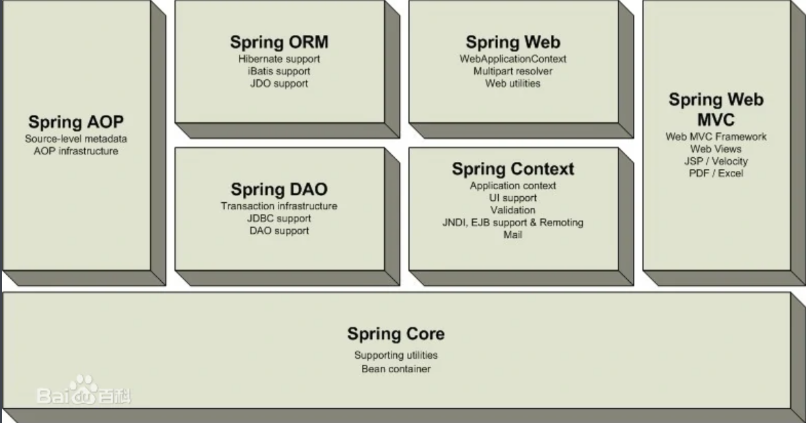
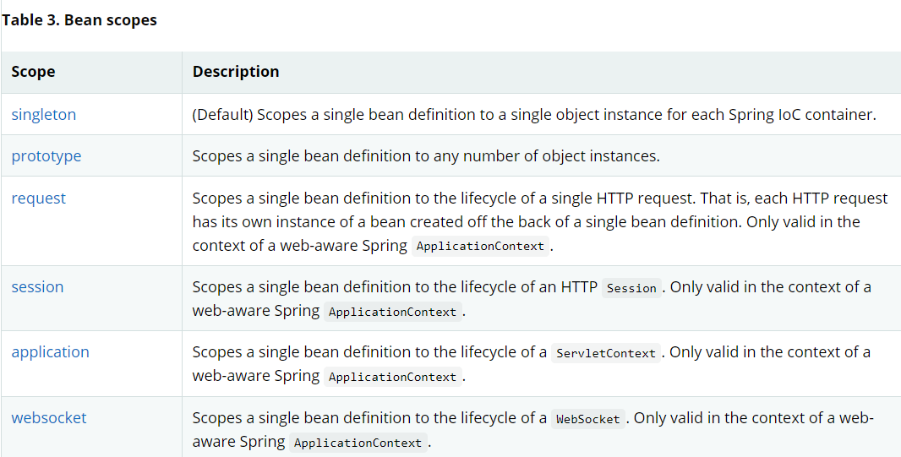
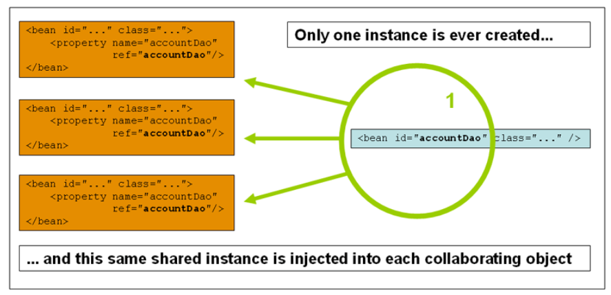
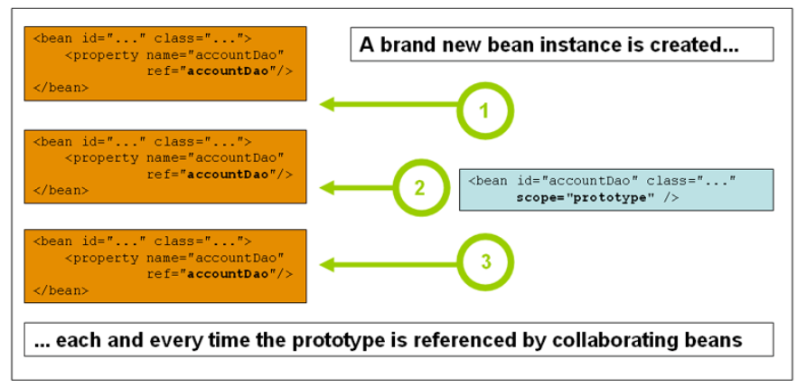
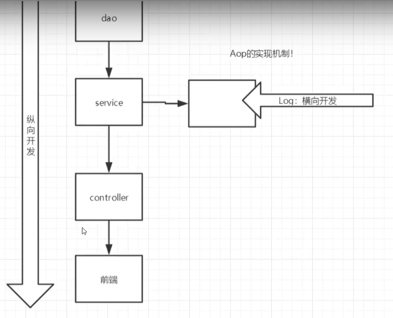
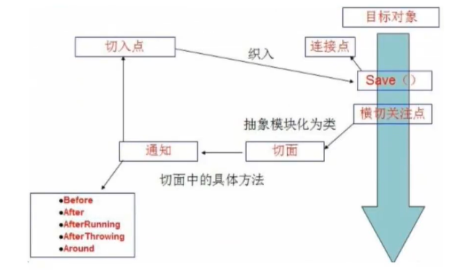
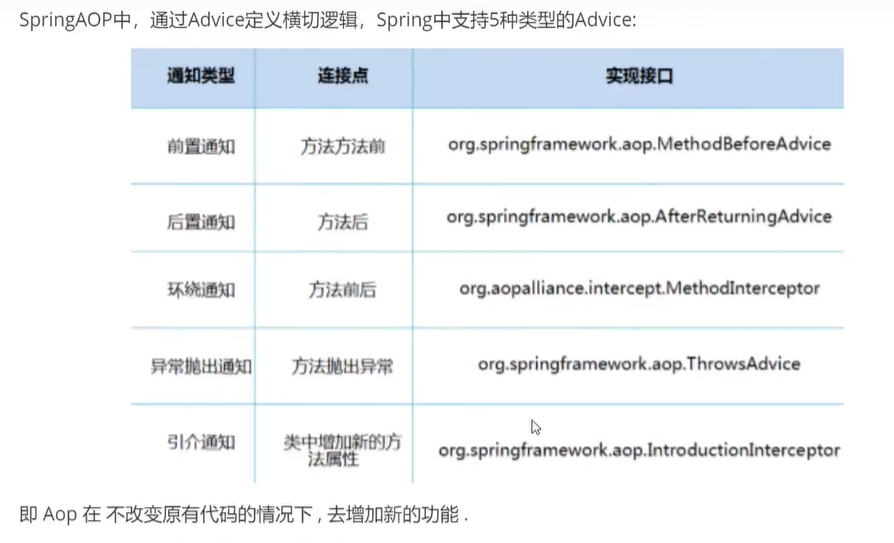
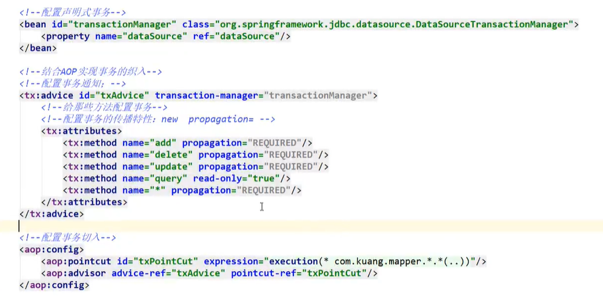

# Spring

## 前言

### 概念

**Spring是一个轻量级的==控制反转(IOC)==和==面向切面(AOP)==的容器框架**    ==非入侵，支持事务处理==

轻量——从大小与开销两方面而言Spring都是轻量的

控制反转——Spring通过一种称作控制反转（IOC）的技术促进了松耦合

面向切面——Spring提供了[面向切面编程](https://baike.baidu.com/item/面向切面编程)的丰富支持，允许通过分离应用的业务逻辑与系统级服务（例如审计（auditing）和事务（transaction）管理）进行内聚性的开发

### 配置

```xml
<!-- https://mvnrepository.com/artifact/org.springframework/spring-webmvc -->
<dependency>
    <groupId>org.springframework</groupId>
    <artifactId>spring-webmvc</artifactId>
    <version>5.3.9</version>
</dependency>

<!-- https://mvnrepository.com/artifact/org.springframework/spring-jdbc -->
<dependency>
    <groupId>org.springframework</groupId>
    <artifactId>spring-jdbc</artifactId>
    <version>5.3.9</version>
</dependency>

```

### 组成



## IOC控制反转

### 本质

控制反转loC(Inversion of Control)，是一种设计思想，DI(依赖注入)是实现loC的一种方法，也有人认为DI只是loC的另一种说法。没有loC的程序中，我们使用面向对象编程，对象的创建与对象间的依赖关系完全硬编码在程序中，对象的创建由程序自己控制，控制反转后将对象的创建转移给第三方，个人认为所谓控制反转就是:获得依赖对象的方式反转了。

采用XML方式配置Bean的时候，Bean的定义信息是和实现分离的，而采用注解的方式可以把两者合为一体，Bean的定义信息直接以注解的形式定义在实现类中，从而达到了零配置的目的。

控制反转是一种通过描述（XML或注解）并通过第三方去生产或获取特定对象的方式。在Spring中实现控制反转的是loC容器，其实现方法是依赖注入(Dependency Injection,Dl)。

### 基本理念

- Hello 对象是谁创建的?
- hello对象是由Spring创建的. 
- Hello对象的属性是怎么设置的?
- hello对象的属性是由Spring容器设置的，

这个过程就叫控制反转:

控制:谁来控制对象的创建，传统应用程序的对象是由程序本身控制创建的，使用Spring后，对象是由Spring来创建的．

反转:程序本身不创建对象，而变成被动的接收对象．

依赖注入:就是利用set方法来进行注入的.

IOC是一种编程思想，由主动的编程变成被动的接收．

### 对象构造方式

1、默认是无参构造函数

```xml
<bean id="user" class="com.shun.pojo.User">
    <property name="name" value="liushun"/>
</bean>
```

2、有参构造

三种方式

```xml
<!--    第一种方式， 通过下标-->
    <bean id="user" class="com.shun.pojo.User">
        <constructor-arg index="0" value="liushun"/>
    </bean>

<!--    第二种方式， 通过类型 不建议使用-->
    <bean id="user" class="com.shun.pojo.User">
        <constructor-arg type="java.lang.String" value="liushun"/>
    </bean>

<!--    第三种方式, 通过参数名-->
    <bean id="user" class="com.shun.pojo.User">
        <constructor-arg name="name" value="liushun"/>
    </bean>
```

3、总结

在配置文件加载时，容器中的对象就已经被初始化创建了

## spring配置

### 别名

```xml
<!--别名，如果添加了别名，我们也可以使用别名获取到这个对象-->
<alias name="user" alias="userNew" />
```

### Bean配置

```xml
<!--
id : bean的唯一标识符，也就是相当于我们学的对象名
class : bean对象所对应的全限定名﹔包名＋类型
name :也是别名,而且name可以同时取多个别名
-->
<bean id="userT" c1ass="com. kuang.pojo.userT" name="user2 u2,u3;u4">
    <property name="name" value="西部开源"/>
</bean>
```

### import

一般用于多人开发，可以将多个人的配置文件合并

```xml
<import resource="xxx.xml"/>
```

## 依赖注入

### 1、构造器注入

### 2、set注入

依赖注入：

依赖：bean对象的创建依赖于容器

注入：bean对象的所有属性，由容器来注入

复杂类型

```java
private String name;
private Address address;
private String[] book;
private List<String> hobbies;
private Map<String, String> card;
private Set<String> games;
private String wife;
private Properties info;
```

注入

```xml
<?xml version="1.0" encoding="UTF-8"?>
<beans xmlns="http://www.springframework.org/schema/beans"
       xmlns:xsi="http://www.w3.org/2001/XMLSchema-instance"
       xsi:schemaLocation="http://www.springframework.org/schema/beans http://www.springframework.org/schema/beans/spring-beans.xsd">

<!--    <bean id="user" class="com.shun.pojo.Student">-->
<!--        <property name="name" value="liushun"/>-->
<!--    </bean>-->

<!--&lt;!&ndash;    第一种方式， 通过下标&ndash;&gt;-->
<!--    <bean id="user" class="com.shun.pojo.Student">-->
<!--        <constructor-arg index="0" value="liushun"/>-->
<!--    </bean>-->

<!--&lt;!&ndash;    第二种方式， 通过类型 不建议使用&ndash;&gt;-->
<!--    <bean id="user" class="com.shun.pojo.Student">-->
<!--        <constructor-arg type="java.lang.String" value="liushun"/>-->
<!--    </bean>-->

<!--&lt;!&ndash;    第三种方式, 通过参数名&ndash;&gt;-->
<!--    <bean id="user" class="com.shun.pojo.Student">-->
<!--        <constructor-arg name="name" value="liushun"/>-->
<!--    </bean>-->

    <bean id="address" class="com.shun.pojo.Address">
        <property name="address" value="hunan"/>
    </bean>

    <bean id="student" class="com.shun.pojo.Student">
<!--        第一种普通属性    -->
        <property name="name" value="liushun"/>
<!--        第二种，类     -->
        <property name="address" ref="address"/>
<!--        第三种 数组    -->
        <property name="book">
            <array>
                <value>西游记</value>
                <value>水浒传</value>
                <value>西游记</value>
            </array>
        </property>
<!--        第四种 List    -->
        <property name="hobbies">
            <list>
                <value>打球</value>
                <value>打游戏</value>
                <value>看电视</value>
            </list>
        </property>
<!--        map    -->
        <property name="card">
            <map>
                <entry key="身份证" value="22222"/>
                <entry key="银行卡" value="222333"/>
            </map>
        </property>
<!--        set     -->
        <property name="games">
            <set>
                <value>lol</value>
                <value>cf</value>
            </set>
        </property>
<!--        null    -->
        <property name="wife">
            <null/>
        </property>
<!--        properties    -->
        <property name="info">
            <props>
                <prop key="xingming">llll</prop>
                <prop key="xingbie">nan</prop>
                <prop key="nianling">22</prop>
            </props>
        </property>
    </bean>
</beans>
```

### 3、命名空间注入

#### xml约束

```xml
       xmlns:p="http://www.springframework.org/schema/p"
       xmlns:c="http://www.springframework.org/schema/c"
```

#### 使用

```xml
<!--p命名空问注入，可以直接注入属性的值: property -->
<bean id="user" class="com.kuang. pojo.User" p:name="秦疆”p:age="18"/>
                                                                  
<!-- c命名宝问注入，通过构造器注入; construct-args -->
<bean id="user2" class="com.kuang.pojo.User" c:age="18" c:name="狂神"/>

```

## bean作用域

两个常用，其余一般在web中才使用



### 1、单例模式（默认）

只会创建一个对象，getBean获得的是同一个对象

```xml
<bean id="accountService" class="com.something.DefaultAccountService" scope="singleton"/>
```



### 2、原型模式

每次getBean获得的是一个新对象

```xml
<bean id="accountService" class="com.something.DefaultAccountService" scope="prototype"/>
```



## Bean的自动装配

自动装配是Spring满足bean依赖的一种方式

Spring会在上下文中自动寻找，并自动给Bean装配属性

在Spring装配属性三种方式

1、在xml中显示装配

2、在Java中显示装配

3、隐式的自动装配bean

### ByName自动装配

一个人有两个宠物，可以不要写两个宠物

```xml
<! --byName:会自动在容器上下文中查找，和自己对象set方法后面的值对应的 beanid !-->
<bean id="people" class="com.kuang.pojo.Peop1e" autowire="byName ">
    <property name="name" value="小狂神呀"/>
</bean>
```

### ByType自动装配

```xml
<bean id="cat" class="com. kuang.pojo.cat" />
<bean id="dog" class="com. kuang.pojo.Dog" />

<!--
byName:会自动在容器上下文中查找，和自己对象set方法后面的值对应的 beanid!
byType:会自动在容器上下文中查找，和自己对象属性类型相同的bean !-->
<bean id="people" class="com. kuang.pojo.People" autowire="byType ">
```

### 小结

byname：需要保证所有bean的id唯一，并且这个bean需要和自动注入的属性的set方法的值一致!

bytype：需要保证所有bean的class唯一，并且这个bean需要和自动注入的属性的类型一致，只能有一个bean声明语句


## 使用注解自动装配

1、导入约束:context

2、配置注解的支持:annotation-config

```xml
<?xml version="1.0" encoding="UTF-8"?>
<beans xmlns="http://www.springframework.org/schema/beans"
       xmlns:xsi="http://www.w3.org/2001/XMLSchema-instance"
       xmlns:context="http://www.springframework.org/schema/context"
       xsi:schemaLocation="http://www.springframework.org/schema/beans
       http://www.springframework.org/schema/beans/spring-beans.xsd
       http://www.springframework.org/schema/context
       http://www.springframework.org/schema/context/spring-context.xsd">
<!--注解支持-->
    <context:annotation-config/>

```

### 1、注入对象

@Autowired

直接在属性上使用，也可以在set方法上使用

先按照type查找，如果有多个，就按照name进行查找，如果再有多个，就报错，这时可以用qualifier

如果@Autowired自动装配的环境比较复杂，自动装配无法通过一个注解【@Autowired】完成的时候、我们可以使用@Qualifier(value="xxx")去配置@Autowired的使用，指定一个唯一的bean对象注入!

```java
public class Peop1e {
    //如果显示定义了Autowired的required属性为fa1se，说明这个对象可以为nu11，否则不允许为空
    @Autowired(required = false)
    private cat cat;
    @Autowired
    private Dog dog;private string name;

public class Peop1e {
    @Autowired
    @Qualifier(value="cat111")
    private cat cat;
    @Autowired
    Qualifier(value="dog222")
        private Dog dog;
    private string name;
}

```

**自动装配**

```xml
<!--    指定要扫描的包    -->
    <context:component-scan base-package="com.shun.pojo"/>
```

### 2、注入一般属性

```java
//相当于 <bean id="people" class="com.shun.pojo.people"/>
//@Component 组件
@Component
public class People {

    //相当于 <property name="name" value="liushun"/>
    //也可以用在set方法上
    @Value("liushun")
    private String name;
```

### 3、衍生注解

@component有几个衍生注解，通常按照mvc分层使用

- controller   @Controller
- service    @Service
- dao    @Repository

这四个注解功能都是一样的，都是代表将某个类注册到Spring中，装配Bean

4、自动装配

```xml
@Autowired :内动装配通过类型。名字
	如果Autowired不能唯一自动装配上属性，则需要通过@Qualifier(value="xxx")
@Nullable字段标记了这个注解，说明这个字段可以为null;
@Resource:自动装配通过名字。类型。

```

5、作用域

```java
@Component
@Scope("prototype")
public class People {

    //相当于 <property name="name" value="liushun"/>
    //也可以用在set方法上
    @Value("liushun")
    private String name;
```

6、小结

xml 与注解:

- xml更加万能，适用于任何场合!维护简单方便。
- 注解不是自己类使用不了，维护相对复杂!

xml 与注解最佳实践:

- xml用来管理bean;
- 注解只负责完成属性的注入;
- 我们在使用的过程中，只需要注意一个问题:必须让注解生效，就需要开启注解的支持

## 使用java的方式配置Spring

```java
//这里这个注解的意思，就是说明这个类被spring接管了，注册到了容器中@component
public c1ass user {
    private string name;
    pub1ic string getName() {
        return name;
    }
    @value("QIN3IANG")//属性注入值
    public void setName(string name) {
        this.name = name;
    }
    @override
    pub7ic string tostring( {
        return "user{" +
        "name='" + name + '\' +'}';
    }

```

```java
package com.shun.config;
import com.shun.pojo.user;
import org.springframework.context.annotation.Bean;
import org.springframework.context.annotation.componentscan;
import org.springframework.context.annotation.configuration;
import org.springframework.context.annotation.Import;

// 这个也会spring容器托管，注册到容器中，因为他本来就是一个@component
// @configuration代表这是一个配置类，就和我们之前看的beans. xm 71
@configuration
@componentscan("com.shun.pojo")
@Import(Config2.c1ass)
public class Config {
    //注册一个bean ,就相当于我们之前写的一个bean标签
    //这个方法的名字，就相当于bean标签中的id属性
    //这个方法的返回值，就相当于bean标签中的c1ass属性
    @Bean
    public User user(){
        return new User();//就是返回要注入到bean的对象!

```

```java
public class MyTest {
public static void main(string[] args) {
    //如果完全使用了配置类方式去做，我们就只能通过 Annotationconfig 上下文来获取容器，通过配
    //置类的c1ass对象加载!
    Applicationcontext context = new
    AnnotationconfigApplicationcontext(Config.c1ass);
    user getuser = (user) context.getBean ("user");
    system.out.println(getuser.getName());

```

## 代理模式

### 静态代理

角色分析:

抽象角色:一般会使用接口或者抽象类来解决

真实角色︰被代理的角色，实现抽象角色

代理角色︰代理真实角色，代理真实角色后，我们一般会做一些附属操作

客户∶访问代理对象的人!



### 动态代理

动态代理和静态代理角色一样

动态代理的代理类是动态生成的，不是我们直接写好的

动态代理分为两大类：基于接口的动态代理， 基于类的动态代理

基于接口---JDK动态代理[我们使用的]

基于类：cglib

java字节码实现：javasist

需要了解两个类

Proxy：代理     InvocationHandler：调用处理程序

```java
package com.shun.proxyDemo;


import java.lang.reflect.InvocationHandler;
import java.lang.reflect.Method;
import java.lang.reflect.Proxy;

//用来自动生成代理类
public class ProxyInvocationHandler implements InvocationHandler {

    //被代理的接口
    private Rent rent;//改成Object 即可成为万能代理类

    public void setRent(Rent rent) {
        this.rent = rent;
    }

    //生成得到代理类
    public Object getProxy(){
        return Proxy.newProxyInstance(this.getClass().getClassLoader(), rent.getClass().getInterfaces(), this);
    }

    //处理代理实例，并返回结果值
    @Override
    public Object invoke(Object proxy, Method method, Object[] args) throws Throwable {
        seeHouse();
        //动态代理的本质就是反射机制
        Object result = method.invoke(rent, args);

        return result;
    }

    public void seeHouse(){
        System.out.println("中介带看房子");
    }

}

```

```java
public static void main(String[] args) {
    Host host = new Host();

    ProxyInvocationHandler proxyInvocationHandler = new ProxyInvocationHandler();

    proxyInvocationHandler.setRent(host);
    //Proxy是动态生成的
    Rent proxy = (Rent) proxyInvocationHandler.getProxy();

    proxy.rent();
}
```

动态代理的好处:

- 可以使真实角色的操作更加纯粹!不用去关注一些公共的业务
- 公共也就就交给代理角色!实现了业务的分工!
- 公共业务发生扩展的时候，方便集中管理!
- 一个动态代理类代理的是一个接口，一般就是对应的一类业务
- 一个动态代理类可以代理多个类，只要是实现了同一个接口即可

## AOP

### 概念

AOP (Aspect Oriented Programming)意为:面向切面编程，通过预编译方式和运行期动态代理实现程序功能的统一维护的一种技术。AOP是OOP的延续，是软件开发中的一个热点，也是Spring框架中的一个重要内容，是函数式编程的一种衍生范型。利用AOP可以对业务逻辑的各个部分进行隔离，从而使得业务逻辑各部分之间的耦合度降低，提高程序的可重用性，同时提高了开发的效率。

### AOP在Spring中的作用

- 提供声明式事务;允许用户自定义切面

- 横切关注点：跨越应用程序多个模块的方法或功能。即是，与我们业务逻辑无关的，但是我们需要关注的部分，就是横切关注点。如日志，安全，缓存，事务等等...
- 切面(ASPECT)︰横切关注点被模块化的特殊对象。即，它是一个类。
- 通知（(Advice) :切面必须要完成的工作。即，它是类中的一个方法。
- 目标（Target)︰被通知对象。
- 代理(Proxy)∶向目标对象应用通知之后创建的对象。
- 切入点(PointCut) ︰切面通知执行的“地点"的定义。·连接点(JointPoint) :与切入点匹配的执行点。





### 在Spinrg中实现AOP

#### 依赖导入

```xml
<dependency>
    <groupId>org.aspectj</groupId>
    <artifactId>aspectjweaver</artifactId>
    <version>1.9.7</version>
</dependency>
```

#### 方式一 使用Spring的API接口--API实现

```java
package com.shun.Log;

import org.springframework.aop.AfterReturningAdvice;

import java.lang.reflect.Method;

public class AfterLog implements AfterReturningAdvice {
    @Override
    public void afterReturning(Object returnValue, Method method, Object[] args, Object target) throws Throwable {
        System.out.println("执行了" + method.getName() + "返回了" + (String) returnValue);
    }
}

```

```java
package com.shun.Log;

import org.springframework.aop.MethodBeforeAdvice;

import java.lang.reflect.Method;

public class BeforeLog implements MethodBeforeAdvice {
    @Override
    public void before(Method method, Object[] objects, Object o) throws Throwable {
        System.out.println(o.getClass().getName() + "的" + method.getName() + "执行了");
    }
}

```

```xml
<?xml version="1.0" encoding="UTF-8"?>
<beans xmlns="http://www.springframework.org/schema/beans"
       xmlns:xsi="http://www.w3.org/2001/XMLSchema-instance"
       xmlns:context="http://www.springframework.org/schema/context"
       xmlns:aop="http://www.springframework.org/schema/aop"
       xsi:schemaLocation="http://www.springframework.org/schema/beans
       http://www.springframework.org/schema/beans/spring-beans.xsd
       http://www.springframework.org/schema/context
       http://www.springframework.org/schema/context/spring-context.xsd
       http://www.springframework.org/schema/aop
       http://www.springframework.org/schema/aop/spring-aop.xsd">

    <bean id="userService" class="com.shun.service.UserServiceImpl"/>
    <bean id="beforeLog" class="com.shun.Log.BeforeLog"/>
    <bean id="afterLog" class="com.shun.Log.AfterLog"/>
<!--配置aop 导入约束-->
<!--    使用spring的API接口-->
    <aop:config>
<!--        切入点-->
<!--        修饰词 返回值 类名 方法名 参数    -->
        <aop:pointcut id="pointcut" expression="execution(* com.shun.service.UserServiceImpl.*(..))"/>
<!--   执行环绕增加    -->
        <aop:advisor advice-ref="beforeLog" pointcut-ref="pointcut"/>
        <aop:advisor advice-ref="afterLog" pointcut-ref="pointcut"/>
    </aop:config>
</beans>
```

```java
@Test
public void test(){
    ClassPathXmlApplicationContext context = new ClassPathXmlApplicationContext("ApplicationContext.xml");

    //代理的是接口
    UserService userService = (UserService) context.getBean("userService");

    userService.add();

    context.close();
}
//com.shun.service.UserServiceImpl的add执行了
//add
//执行了add返回了null
```

#### 方式二：自定义类实现--切面定义

```java
package com.shun.diy;

public class Diy {
    public void before(){
        System.out.println("===before===");
    }

    public void after(){
        System.out.println("===after===");
    }
}

```

```xml
<bean id="diy" class="com.shun.diy.Diy"/>
<!--    自定义类实现    -->
<aop:config>
    <aop:aspect ref="diy">
        <!--            切入点    -->
        <aop:pointcut id="point" expression="execution(* com.shun.service.UserServiceImpl.*(..))"/>
        <!--            通知 也就是要添加的方法    -->
        <aop:before method="before" pointcut-ref="point"/>
        <aop:after method="after" pointcut-ref="point"/>
    </aop:aspect>
</aop:config>
```

#### 方式三：使用注解实现

```xml
<bean id="annotationPointCut" class="com.shun.diy.AnnotationPointCut"/>
<!--    开启注解支持    -->
<aop:aspectj-autoproxy/>
```

```java
package com.shun.diy;

import org.aspectj.lang.annotation.After;
import org.aspectj.lang.annotation.Aspect;
import org.aspectj.lang.annotation.Before;

@Aspect
public class AnnotationPointCut {

    @Before("execution(* com.shun.service.UserServiceImpl.*(..))")
    public void before(){
        System.out.println("before");
    }

    @After("execution(* com.shun.service.UserServiceImpl.*(..))")
    public void after(){
        System.out.println("after");
    }
}
```

```java
import com.shun.pojo.People;
import com.shun.service.UserService;
import com.shun.service.UserServiceImpl;
import org.junit.Test;
import org.springframework.context.support.ClassPathXmlApplicationContext;


public class MyTest {
    @Test
    public void test(){
        ClassPathXmlApplicationContext context = new ClassPathXmlApplicationContext("ApplicationContext.xml");

        //代理的是接口
        UserService userService = (UserService) context.getBean("userService");

        userService.add();

        context.close();
    }
}
```

## 整合myBatis

**实体类编写---接口---xml---数据源配置以及各种配置---（由于需要用Spring去调用）需要实现类---注入bean---调用spring调用方法**

### 方式一

1、编写数据源配置

2、SqlSessionFactory

3、SqlSessionTemplate

SqlSessionTemplate就直接代替SqlSession

```xml
<?xml version="1.0" encoding="UTF-8"?>
<beans xmlns="http://www.springframework.org/schema/beans"
       xmlns:xsi="http://www.w3.org/2001/XMLSchema-instance"
       xsi:schemaLocation="http://www.springframework.org/schema/beans http://www.springframework.org/schema/beans/spring-beans.xsd">

<!--    DataSource:使用Spring的数据源替换MyBatis的配置  -->
<!--    我们这里使用Spring提供的JDBC  -->
    <bean id="datasource" class="org.springframework.jdbc.datasource.DriverManagerDataSource">
        <property name="driverClassName" value="com.mysql.cj.jdbc.Driver"/>
        <property name="url" value="jdbc:mysql://localhost:3306/mybatis?useSSL=true&amp;userUnicode=true&amp;characterEncoding=UTF-8"/>
        <property name="username" value="root"/>
        <property name="password" value=".20010404liushun"/>
    </bean>

<!--    sqlSessionFactory   -->
    <bean id="sqlSessionFatory" class="org.mybatis.spring.SqlSessionFactoryBean">
        <property name="dataSource" ref="datasource"/>
<!--        绑定MyBatis配置文件    -->
        <property name="configLocation" value="classpath:mybatis-config.xml"/>
        <property name="mapperLocations" value="classpath:com/shun/mapper/*.xml"/>
    </bean>

<!--    sqlSessionTemplate：就是我们使用的sqlSession    -->
    <bean id="sqlSessionTemplate" class="org.mybatis.spring.SqlSessionTemplate">
<!--        只能由构造器注入，源码没有set方法    -->
        <constructor-arg index="0" ref="sqlSessionFatory"/>
    </bean>

    <bean id="userMapper" class="com.shun.mapper.UserMapperImpl">
        <property name="sqlSessionTemplate" ref="sqlSessionTemplate"/>
    </bean>
</beans>
```

```xml
<?xml version="1.0" encoding="UTF-8" ?>
<!DOCTYPE configuration
        PUBLIC "-//mybatis.org//DTD Config 3.0//EN"
        "http://mybatis.org/dtd/mybatis-3-config.dtd">
<configuration>

    <settings>
<!--        <setting name="logImpl" value="STDOUT_LOGGING"/>-->
        <setting name="logImpl" value="log4j"/>
    </settings>

    <typeAliases>
        <package name="com.shun.pojo"/>
    </typeAliases>

</configuration>
```

**我们使用spring来整合myBatis，将mybatis中的一这些配置交给spring来做，所以mybatis的配置文件就变得很简单，我们一般选择只是将一些设置工作，比如日志、别名交给myBatis来做**

4、接口实现类

接口实现类来帮我们调用函数，执行数据库操作，然后返回结果

```java
package com.shun.mapper;

import com.shun.pojo.User;
import org.mybatis.spring.SqlSessionTemplate;

import java.util.List;

public class UserMapperImpl implements UserMapper{

    //所有的操作，原来都是用SqlSession，现在都是用SqlSessionTemplate

    private SqlSessionTemplate sqlSessionTemplate;

    public void setSqlSessionTemplate(SqlSessionTemplate sqlSessionTemplate) {
        this.sqlSessionTemplate = sqlSessionTemplate;
    }

    @Override
    public List<User> selectUser() {
        UserMapper mapper = sqlSessionTemplate.getMapper(UserMapper.class);
        return mapper.selectUser();
    }
}

```

5、将自己写的实现类，注入到spring中

6、测试

测试里面就只需要加载spring的配置文件，然后获得实现类的对象

直接调用方法就可以得到结果了

```java
import com.shun.mapper.UserMapper;
import com.shun.pojo.User;
import org.apache.ibatis.io.Resources;
import org.apache.ibatis.session.SqlSession;
import org.apache.ibatis.session.SqlSessionFactory;
import org.apache.ibatis.session.SqlSessionFactoryBuilder;
import org.junit.Test;
import org.springframework.context.support.ClassPathXmlApplicationContext;

import java.io.File;
import java.io.IOException;
import java.io.InputStream;
import java.util.List;

public class MyTest {

    @Test
    public void test() throws IOException {

        ClassPathXmlApplicationContext context = new ClassPathXmlApplicationContext("spring-mapper.xml");
        UserMapper userMapper = context.getBean("userMapper", UserMapper.class);
        List<User> userList = userMapper.selectUser();

        for (User user : userList) {
            System.out.println(user);
        }

    }
}

```

### 方式二

**利用SqlSessionDaoSupport**

简单化，就只要继承这个类，直接就可以拿到SqlSession对象，就可以直接调用方法执行，返回结果即可

只需要配置一个SqlSessionFactory即可

```java
package com.shun.mapper;

import com.shun.pojo.User;
import org.apache.ibatis.session.SqlSession;
import org.mybatis.spring.support.SqlSessionDaoSupport;

import java.util.List;

public class UserMapperImpl2 extends SqlSessionDaoSupport implements UserMapper{
    @Override
    public List<User> selectUser() {
        SqlSession sqlSession = getSqlSession();
        UserMapper mapper = sqlSession.getMapper(UserMapper.class);
        return mapper.selectUser();
    }
}

```

```xml
<bean id="userMapper2" class="com.shun.mapper.UserMapperImpl2">
    <property name="sqlSessionFactory" ref="sqlSessionFatory"/>
</bean>
```

```java
@Test
public void test() throws IOException {

    ClassPathXmlApplicationContext context = new ClassPathXmlApplicationContext("spring-mapper.xml");
    UserMapper userMapper = context.getBean("userMapper2", UserMapper.class);
    List<User> userList = userMapper.selectUser();

    for (User user : userList) {
        System.out.println(user);
    }

}
```

## 声明式事务

### ACID原则

原子性

一致性

隔离性：多个业务可能同时操作同一个资源，防止数据被破坏

持久性：事务一旦提交，就会被持久性的写到存储器中

### 配置



### 为什么需要事务？

如果不配置事务，可能存在数据提交不一致的问题

如果不在Spring中配置声明式事务，就需要在代码中手动实现事务

事务在项目开发中十分重要，这涉及到数据的一致性和完整性
