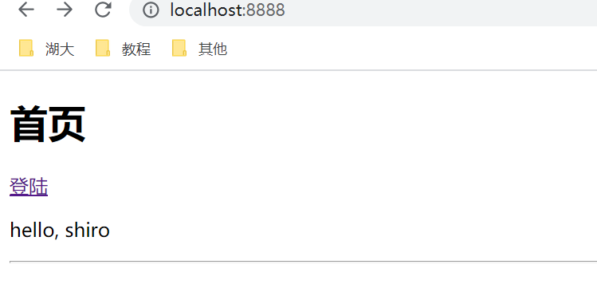

# SpringBoot

## 如何写一个网站


## 微服务架构

### 微服务

#### 什么是微服务?

微服务是一种架构风格，它要求我们在开发一个应用的时候，这个应用必须构建成―系列小服务的组合;可以通过http的方式进行互通。要说微服务架构，先得说说过去我们的单体应用架构。

#### 单体应用架构

所谓单体应用架构(all in one)是指，我们将一个应用的中的所有应用服务都封装在一个应用中。

无论是ERP、CRM或是其他什么系统，你都把数据库访问，web访问，等等各个功能放到一个war包内。

这样做的好处是，易于开发和测试;也十分方便部署;当需要扩展时，只需要将war复制多份，然后放到多个服务器上，再做个负载均衡就可以了。

单体应用架构的缺点是，哪怕我要修改一个非常小的地方，我都需要停掉整个服务，重新打包、部署这个应用war包。特别是对于一个大型应用，我们不可能吧所有内容都放在一个应用里面，我们如何维护、如何分工合作都是问题。

#### 微服务架构

all in one的架构方式，我们把所有的功能单元放在一个应用里面。然后我们把整个应用部署到服务器上。如果负载能力不行，我们将整个应用进行水平复制，进行扩展，然后在负载均衡。

所谓微服务架构，就是打破之前all in one的架构方式，把每个功能元素独立出来。把独立出来的功能元素的动态组合，需要的功能元素才去拿来组合，需要多一些时可以整合多个功能元素。所以微服务架构是对功能元素进行复制，而没有对整个应用进行复制。

这样做的好处是:

1.节省了调用资源。

2.每个功能元素的服务都是一个可替换的、可独立升级的软件代码。

#### 如何构建微服务

一个大型系统的微服务架构，就像一个复杂交织的神经网络，每一个神经元就是一个功能元素，它们各自完成自己的功能，然后通过http相互请求调用。比如一个电商系统，查缓存、连数据库、浏览页面、结账、支付等服务都是一个个独立的功能服务，都被微化了，它们作为一个个微服务共同构建了一个庞大的系统。如果修改其中的一个功能，只需要更新升级其中一个功能服务单元即可。

但是这种庞大的系统架构给部署和运维带来很大的难度。于是，spring为我们带来了构建大型分布式微服务的全套、全程产品:

构建一个个功能独立的微服务应用单元，可以使用springboot，可以帮我们快速构建一个应用;

大型分布式网络服务的调用，这部分由spring cloud来完成，实现分布式;

在分布式中间，进行流式数据计算、批处理，我们有s pring cloud data flow。

spring为我们想清楚了整个从开始构建应用到大型分布式应用全流程方案。


## 第一个SpringBoot程序

### 创建

直接新建一个项目，使用**Spring Initializr**


这里可以添加框架，可以自动导入jar包


在同级目录建立各种目录，就可以开始开发了


### 初测试

```java
package com.shun.helloworld.controller;

import org.springframework.web.bind.annotation.RequestMapping;
import org.springframework.web.bind.annotation.RestController;

@RestController
public class HelloController {


    @RequestMapping("/hello")
    public String hello(){
        return "hello,world!";
    }
}

```


### 更改端口号

在properties配置文件中设置即可


### 自定义banner

https://www.bootschool.net/ascii-art/comic

可以在这个网站上去定义banner样式


启动后，本来是Spring字样，现在变成自定义了


## yaml语法

### 配置文件

SpringBoot使用一个全局的配置文件，配置文件名称是固定的

**application.properties**

- 语法结构: key=value

**application.yml**

- 语法结构: key:空格value

配置文件的作用∶修改SpringBoot自动配置的默认值，因为SpringBoot在底层都给我们自动配置好了;

### YAML

#### 简介

YAML 语言（发音 /ˈjæməl/ ）的设计目标，就是方便人类读写。它实质上是一种通用的数据串行化格式。

它的基本语法规则如下。

> - 大小写敏感
> - 使用缩进表示层级关系
> - 缩进时不允许使用Tab键，只允许使用空格。
> - 缩进的空格数目不重要，只要相同层级的元素左侧对齐即可

`#` 表示注释，从这个字符一直到行尾，都会被解析器忽略。

YAML 支持的数据结构有三种。

> - 对象：键值对的集合，又称为映射（mapping）/ 哈希（hashes） / 字典（dictionary）
> - 数组：一组按次序排列的值，又称为序列（sequence） / 列表（list）
> - 纯量（scalars）：单个的、不可再分的值

#### 1、对象

对象的一组键值对，使用冒号结构表示。

> ```javascript
> animal: pets
> ```

转为 JavaScript 如下。

> ```javascript
> { animal: 'pets' }
> ```

Yaml 也允许另一种写法，将所有键值对写成一个行内对象。

> ```javascript
> hash: { name: Steve, foo: bar } 
> ```

转为 JavaScript 如下。

> ```javascript
> { hash: { name: 'Steve', foo: 'bar' } }
> ```

#### 2、数组

一组连词线开头的行，构成一个数组。

> ```javascript
> - Cat
> - Dog
> - Goldfish
> ```

转为 JavaScript 如下。

> ```javascript
> [ 'Cat', 'Dog', 'Goldfish' ]
> ```

数据结构的子成员是一个数组，则可以在该项下面缩进一个空格。

> ```javascript
> -
>  - Cat
>  - Dog
>  - Goldfish
> ```

转为 JavaScript 如下。

> ```javascript
> [ [ 'Cat', 'Dog', 'Goldfish' ] ]
> ```

数组也可以采用行内表示法。

> ```javascript
> animal: [Cat, Dog]
> ```

转为 JavaScript 如下。

> ```javascript
> { animal: [ 'Cat', 'Dog' ] }
> ```

#### 3、复合结构

对象和数组可以结合使用，形成复合结构。

> ```javascript
> languages:
>  - Ruby
>  - Perl
>  - Python 
> websites:
>  YAML: yaml.org 
>  Ruby: ruby-lang.org 
>  Python: python.org 
>  Perl: use.perl.org 
> ```

转为 JavaScript 如下。

> ```javascript
> { languages: [ 'Ruby', 'Perl', 'Python' ],
>   websites: 
>    { YAML: 'yaml.org',
>      Ruby: 'ruby-lang.org',
>      Python: 'python.org',
>      Perl: 'use.perl.org' } }
> ```

#### 4、纯量

纯量是最基本的、不可再分的值。以下数据类型都属于 JavaScript 的纯量。

> - 字符串
> - 布尔值
> - 整数
> - 浮点数
> - Null
> - 时间
> - 日期

数值直接以字面量的形式表示。

> ```javascript
> number: 12.30
> ```

转为 JavaScript 如下。

> ```javascript
> { number: 12.30 }
> ```

布尔值用`true`和`false`表示。

> ```javascript
> isSet: true
> ```

转为 JavaScript 如下。

> ```javascript
> { isSet: true }
> ```

`null`用`~`表示。

> ```javascript
> parent: ~ 
> ```

转为 JavaScript 如下。

> ```javascript
> { parent: null }
> ```

时间采用 ISO8601 格式。

> ```javascript
> iso8601: 2001-12-14t21:59:43.10-05:00 
> ```

转为 JavaScript 如下。

> ```javascript
> { iso8601: new Date('2001-12-14t21:59:43.10-05:00') }
> ```

日期采用复合 iso8601 格式的年、月、日表示。

> ```javascript
> date: 1976-07-31
> ```

转为 JavaScript 如下。

> ```javascript
> { date: new Date('1976-07-31') }
> ```

YAML 允许使用两个感叹号，强制转换数据类型。

> ```javascript
> e: !!str 123
> f: !!str true
> ```

转为 JavaScript 如下。

> ```javascript
> { e: '123', f: 'true' }
> ```

#### 5、字符串

字符串是最常见，也是最复杂的一种数据类型。

字符串默认不使用引号表示。

> ```javascript
> str: 这是一行字符串
> ```

转为 JavaScript 如下。

> ```javascript
> { str: '这是一行字符串' }
> ```

如果字符串之中包含空格或特殊字符，需要放在引号之中。

> ```javascript
> str: '内容： 字符串'
> ```

转为 JavaScript 如下。

> ```javascript
> { str: '内容: 字符串' }
> ```

单引号和双引号都可以使用，双引号不会对特殊字符转义。

> ```javascript
> s1: '内容\n字符串'
> s2: "内容\n字符串"
> ```

转为 JavaScript 如下。

> ```javascript
> { s1: '内容\\n字符串', s2: '内容\n字符串' }
> ```

单引号之中如果还有单引号，必须连续使用两个单引号转义。

> ```javascript
> str: 'labor''s day' 
> ```

转为 JavaScript 如下。

> ```javascript
> { str: 'labor\'s day' }
> ```

字符串可以写成多行，从第二行开始，必须有一个单空格缩进。换行符会被转为空格。

> ```javascript
> str: 这是一段
>   多行
>   字符串
> ```

转为 JavaScript 如下。

> ```javascript
> { str: '这是一段 多行 字符串' }
> ```

多行字符串可以使用`|`保留换行符，也可以使用`>`折叠换行。

> ```javascript
> this: |
>   Foo
>   Bar
> that: >
>   Foo
>   Bar
> ```

转为 JavaScript 代码如下。

> ```javascript
> { this: 'Foo\nBar\n', that: 'Foo Bar\n' }
> ```

`+`表示保留文字块末尾的换行，`-`表示删除字符串末尾的换行。

> ```javascript
> s1: |
>   Foo
> 
> s2: |+
>   Foo
> 
> 
> s3: |-
>   Foo
> ```

转为 JavaScript 代码如下。

> ```javascript
> { s1: 'Foo\n', s2: 'Foo\n\n\n', s3: 'Foo' }
> ```

字符串之中可以插入 HTML 标记。

> ```javascript
> message: |
> 
>   <p style="color: red">
>     段落
>   </p>
> ```

转为 JavaScript 如下。

> ```javascript
> { message: '\n<p style="color: red">\n  段落\n</p>\n' }
> ```

#### 6、引用

锚点`&`和别名`*`，可以用来引用。

> ```javascript
> defaults: &defaults
>   adapter:  postgres
>   host:     localhost
> 
> development:
>   database: myapp_development
>   <<: *defaults
> 
> test:
>   database: myapp_test
>   <<: *defaults
> ```

等同于下面的代码。

> ```javascript
> defaults:
>   adapter:  postgres
>   host:     localhost
> 
> development:
>   database: myapp_development
>   adapter:  postgres
>   host:     localhost
> 
> test:
>   database: myapp_test
>   adapter:  postgres
>   host:     localhost
> ```

`&`用来建立锚点（`defaults`），`<<`表示合并到当前数据，`*`用来引用锚点。

下面是另一个例子。

> ```javascript
> - &showell Steve 
> - Clark 
> - Brian 
> - Oren 
> - *showell 
> ```

转为 JavaScript 代码如下。

> ```javascript
> [ 'Steve', 'Clark', 'Brian', 'Oren', 'Steve' ]
> ```

#### 7、函数和正则表达式的转换

这是 [JS-YAML](https://github.com/nodeca/js-yaml) 库特有的功能，可以把函数和正则表达式转为字符串。

> ```javascript
> # example.yml
> fn: function () { return 1 }
> reg: /test/
> ```

解析上面的 yml 文件的代码如下。

> ```javascript
> var yaml = require('js-yaml');
> var fs   = require('fs');
> 
> try {
>   var doc = yaml.load(
>     fs.readFileSync('./example.yml', 'utf8')
>   );
>   console.log(doc);
> } catch (e) {
>   console.log(e);
> }
> ```

从 JavaScript 对象还原到 yaml 文件的代码如下。

> ```javascript
> var yaml = require('js-yaml');
> var fs   = require('fs');
> 
> var obj = {
>   fn: function () { return 1 },
>   reg: /test/
> };
> 
> try {
>   fs.writeFileSync(
>     './example.yml',
>     yaml.dump(obj),
>     'utf8'
>   );
> } catch (e) {
>   console.log(e);
> }
> ```


## 属性赋值

### 实体类以及配置文件

```java
@Component
public class Dog {
    @Value("旺财")
    private String name;
    @Value("3")
    private Integer age;/*
configurationProperties作用:
将配置文件中配置的每一个属性的值，映射到这个组件中;
告诉SpringBoot将本类中的所有属性和配置文件中相关的配置进行绑定
参数 prefix = "person":将配置文件中的person下面的所有属性—─对应
只有这个组件是容器中的组件，才能使用容器提供的configurationProperties功能

 */
@Component
@ConfigurationProperties(prefix = "person")
public class Person {
    private String name;
    private Integer age;
    private Boolean happy;
    private Date brithday;
    private Map<String, Object> maps;
    private List<Object> lists;
    private Dog dog;
    
@Component
public class Dog {
    @Value("旺财")
    private String name;
    @Value("3")
    private Integer age;
```

```yaml
person:
  name: liushun
  age: 3
  happy: true
  brithday: 2021/1/1
  maps: {k1: v1, k2: v2}
  lists:
    - code
    - music
    - play
  dog:
    name: 旺财
    age: 4
```

### 测试

```java
@Autowired
private Dog dog;

@Autowired
private Person person;

@Test
void contextLoads() {
    System.out.println(dog);
    System.out.println(person);
}
```

```tex
Dog{name='旺财', age=3}
Person{name='liushun', age=3, happy=true, brithday=Fri Jan 01 00:00:00 CST 2021, maps={k1=v1, k2=v2}, lists=[code, music, play], dog=Dog{name='旺财', age=4}}
```

### 对比图


- cp只需要写一次即可， value则需要每个字段都添加
- 松散绑定:这个什么意思呢?比如我的yml中写的last-name，这个和lastName是一样的，–后面跟着的字母默认是大写的。这就是松散绑定
- JSR303数据校验，这个就是我们可以在字段是增加一层过滤器验证，可以保证数据的合法性复杂类型封装，yml中可以封装对象，使用@value就不支持

### 结论

- 配置yml和配置properties都可以获取到值，强烈推荐yml
- 如果我们在某个业务中，只需要获取配置文件中的某个值，可以使用一下@value
- 如果说，我们专门编写了一个JavaBean来和配置文件进行映射，就直接使用@configurationProperties，不要犹豫!


## JSR303校验

JSR-303 是 JAVA EE 6 中的一项子规范，叫做 Bean Validation，官方参考实现是Hibernate Validator。

此实现与 Hibernate ORM 没有任何关系。 JSR 303 用于对 Java Bean 中的字段的值进行验证。 

Spring MVC 3.x 之中也大力支持 JSR-303，可以在控制器中对表单提交的数据方便地验证。

### 基本校验规则

空检查 
@Null 验证对象是否为null 
@NotNull 验证对象是否不为null, 无法查检长度为0的字符串 
@NotBlank 检查约束字符串是不是Null还有被Trim的长度是否大于0,只对字符串,且会去掉前后空格. 
@NotEmpty 检查约束元素是否为NULL或者是EMPTY.

Booelan检查 
@AssertTrue 验证 Boolean 对象是否为 true 
@AssertFalse 验证 Boolean 对象是否为 false

长度检查 
@Size(min=, max=) 验证对象（Array,Collection,Map,String）长度是否在给定的范围之内 
@Length(min=, max=) Validates that the annotated string is between min and max included.

日期检查 
@Past 验证 Date 和 Calendar 对象是否在当前时间之前，验证成立的话被注释的元素一定是一个过去的日期 
@Future 验证 Date 和 Calendar 对象是否在当前时间之后 ，验证成立的话被注释的元素一定是一个将来的日期 
@Pattern 验证 String 对象是否符合正则表达式的规则，被注释的元素符合制定的正则表达式，regexp:正则表达式 flags: 指定 Pattern.Flag 的数组，表示正则表达式的相关选项。

数值检查 
建议使用在Stirng,Integer类型，不建议使用在int类型上，因为表单值为“”时无法转换为int，但可以转换为Stirng为”“,Integer为null 
@Min 验证 Number 和 String 对象是否大等于指定的值 
@Max 验证 Number 和 String 对象是否小等于指定的值 
@DecimalMax 被标注的值必须不大于约束中指定的最大值. 这个约束的参数是一个通过BigDecimal定义的最大值的字符串表示.小数存在精度 
@DecimalMin 被标注的值必须不小于约束中指定的最小值. 这个约束的参数是一个通过BigDecimal定义的最小值的字符串表示.小数存在精度 
@Digits 验证 Number 和 String 的构成是否合法 
@Digits(integer=,fraction=) 验证字符串是否是符合指定格式的数字，interger指定整数精度，fraction指定小数精度。 
@Range(min=, max=) 被指定的元素必须在合适的范围内 
@Range(min=10000,max=50000,message=”range.bean.wage”) 
@Valid 递归的对关联对象进行校验, 如果关联对象是个集合或者数组,那么对其中的元素进行递归校验,如果是一个map,则对其中的值部分进行校验.(是否进行递归验证) 
@CreditCardNumber信用卡验证 
@Email 验证是否是邮件地址，如果为null,不进行验证，算通过验证。 
@ScriptAssert(lang= ,script=, alias=) 
@URL(protocol=,host=, port=,regexp=, flags=)

### 案例

```java
public class Order {
    // 必须不为 null, 大小是 10
    @NotNull
    @Size(min = 10, max = 10)
    private String orderId;
    // 必须不为空
    @NotEmpty
    private String customer;
    // 必须是一个电子信箱地址
    @Email
    private String email;
    // 必须不为空
    @NotEmpty
    private String address;
    // 必须不为 null, 必须是下面四个字符串'created', 'paid', 'shipped', 'closed'其中之一
    // @Status 是一个定制化的 contraint
    @NotNull
    @Status
    private String status;
    // 必须不为 null
    @NotNull
    private Date createDate;
    // 嵌套验证
    @Valid
    private Product product;
 
   // getter 和setter方法
}
```

## 多环境配置

### 多环境选择

直接在一个yml文件中写多套配置，用三条横线分割，然后规定使用哪一套配置即可

也可以使用多文件，**application-dev**.yml格式命名


### 自动配置初原理

1)SpringBoot启动会加载大量的自动配置类

2)我们看我们需要的功能有没有在SpringBoot默认写好的自动配置类当中;

3)我们再来看这个自动配置类中到底配置了哪些组件;(只要我们要用的组件存在在其中，我们就不需要再手动配置了)

4)给容器中自动配置类添加组件的时候，会从properties类中获取某些属性。我们只需要在配置文件中指定这些属性的值即可;

xxxxAutoConfigurartion:自动配置类;给容器中添加组件

xxxxProperties:封装配置文件中相关属性;

### 查看生效配置

可以通过debug=true来查看，哪些自动配置类生效，哪些没有生效!

```yml
debug: true
```


## SpringBoot Web开发

### 静态资源导入


如果没有自定义的话，静态资源一般可以放在三个目录下，分别在resources目录下的resources,static,public，且优先级和顺序一致，即public优先级最低

而templates下面的页面只能通过controller才跳转，其余的可以通过url直接访问


### 首页

所以在上面三个路径下新建一个index.html即可


### 模板引擎thymeleaf

#### 简介

模板引擎的作用就是我们来写一个页面模板，比如有些值呢，是动态的，我们写一些表达式。而这些值，从哪来呢，我们来组装一些数据，我们把这些数据找到。然后把这个模板和这个数据交给我们模板引擎，模板引擎按照我们这个数据帮你把这表达式解析、填充到我们指定的位置，然后把这个数据最终生成一个我们想要的内容给我们写出去，这就是我们这个模板引擎，不管是jsp还是其他模板引擎，都是这个思想。

不同模板引擎之间，他们可能这个语法有点不一样。

SpringBoot给我们推荐的Thymeleaf模板引擎是一个高级语言的模板引擎，他的这个语法更简单。而且呢，功能更强大。

#### 源码


#### 依赖

```xml
<!--        thymeleaf 基于3.x开发-->
<dependency>
    <groupId>org.thymeleaf</groupId>
    <artifactId>thymeleaf-spring5</artifactId>
</dependency>
<dependency>
    <groupId>org.thymeleaf.extras</groupId>
    <artifactId>thymeleaf-extras-java8time</artifactId>
</dependency>
```

#### 简单使用

```html
<!DOCTYPE html>
<html lang="en" xmlns:th="http://www.thymeleaf.org">
<head>
    <meta charset="UTF-8">
    <title>Title</title>
</head>
<body>
<!--文本，不转义-->
<div th:text="${msg}"></div>
<!--文本转义-->
<div th:utext="${msg}"></div>

<!--换行线-->
<hr>

<!--遍历-->
<h3 th:each="user:${users}" th:text="${user}"></h3>
<!--<h3 th:each="user:${users}">[[ ${user} ]]</h3>-->
</body>
</html>
```


有很多用法，可以看文档https://www.thymeleaf.org/doc/tutorials/3.0/usingthymeleaf.html#standard-expression-syntax

#### 简单使用规则

- Simple expressions:
  - Variable Expressions: `${...}`
  - Selection Variable Expressions: `*{...}`
  - Message Expressions: `#{...}`
  - Link URL Expressions: `@{...}`
  - Fragment Expressions: `~{...}`
- Literals
  - Text literals: `'one text'`, `'Another one!'`,…
  - Number literals: `0`, `34`, `3.0`, `12.3`,…
  - Boolean literals: `true`, `false`
  - Null literal: `null`
  - Literal tokens: `one`, `sometext`, `main`,…
- Text operations:
  - String concatenation: `+`
  - Literal substitutions: `|The name is ${name}|`
- Arithmetic operations:
  - Binary operators: `+`, `-`, `*`, `/`, `%`
  - Minus sign (unary operator): `-`
- Boolean operations:
  - Binary operators: `and`, `or`
  - Boolean negation (unary operator): `!`, `not`
- Comparisons and equality:
  - Comparators: `>`, `<`, `>=`, `<=` (`gt`, `lt`, `ge`, `le`)
  - Equality operators: `==`, `!=` (`eq`, `ne`)
- Conditional operators:
  - If-then: `(if) ? (then)`
  - If-then-else: `(if) ? (then) : (else)`
  - Default: `(value) ?: (defaultvalue)`
- Special tokens:
  - No-Operation: `_`


### SpringMVC扩展--配置

所有的配置扩展，只需要继承一个接口，然后添加一个注解，就可以生效

```java
package com.shun.helloworld.config;

import org.springframework.context.annotation.Configuration;
import org.springframework.web.servlet.config.annotation.ViewControllerRegistry;
import org.springframework.web.servlet.config.annotation.WebMvcConfigurer;

//如果要扩展springmvc配置，就可以写一个配置类，添加configuration注解
@Configuration
public class MyMvcConfig implements WebMvcConfigurer {

    //视图跳转
    @Override
    public void addViewControllers(ViewControllerRegistry registry) {
        registry.addViewController("/shun").setViewName("test");
    }
}

```

#### 结果


## 员工管理系统

首先还没有数据库，所以需要模拟数据库操作

### 1、导入静态资源


这里需要注意的是t'hth

### 2、创建各种类

#### pojo

可以导入lombok依赖，实现自动装配方法

```java
//部门表
public class Department {
    private Integer id;
    private String departmentName;
    
//员工表
public class Employee {
    private Integer id;
    private String lastName;
    private String email;
    private Integer gender;//0 女 1 男
    private Department department;
    private Date birth;
```

#### dao

记得加**@Repository**这个注解

```java
package com.shun.helloworld.dao;

import com.shun.helloworld.pojo.Department;

import java.util.Collection;
import java.util.HashMap;
import java.util.Map;

//部门dao
@Repository
public class DepartmentDao {

    //模拟数据库
    private static Map<Integer, Department> departmentMap = null;

    static {
        departmentMap = new HashMap<Integer, Department>();

        departmentMap.put(101, new Department(101, "教学部"));
        departmentMap.put(102, new Department(102, "实践部"));
        departmentMap.put(103, new Department(103, "后勤部"));
        departmentMap.put(104, new Department(104, "保卫部"));
        departmentMap.put(105, new Department(105, "监督部"));
        departmentMap.put(106, new Department(106, "集资部"));
    }

    //操作
    //获得所有部门信息
    public Collection<Department> getDepartments(){
        return departmentMap.values();
    }

    //通过Id得到部门
    public Department getDepartmentById(Integer id){
        return departmentMap.get(id);
    }
}
```

```java
package com.shun.helloworld.dao;

import com.shun.helloworld.pojo.Department;
import com.shun.helloworld.pojo.Employee;
import org.springframework.beans.factory.annotation.Autowired;

import java.util.Collection;
import java.util.Date;
import java.util.HashMap;
import java.util.Map;

@Repository
public class EmployeeDao {

    //模拟数据库
    private static Map<Integer, Employee> employeeMap = null;
    //员工所属部门
    @Autowired
    private DepartmentDao departmentDao;
    static {
        employeeMap = new HashMap<Integer, Employee>();

        employeeMap.put(1001, new Employee(1001, "aa", "1143760069@qq.com", 1, new Department(101, "教学部"), new Date()));
        employeeMap.put(1001, new Employee(1001, "bb", "2243760069@qq.com", 0, new Department(102, "实践部"), new Date()));
        employeeMap.put(1001, new Employee(1001, "cc", "3343760069@qq.com", 1, new Department(103, "后勤部"), new Date()));
        employeeMap.put(1001, new Employee(1001, "dd", "4443760069@qq.com", 0, new Department(104, "保卫部"), new Date()));
        employeeMap.put(1001, new Employee(1001, "ee", "5543760069@qq.com", 1, new Department(105, "监督部"), new Date()));
        employeeMap.put(1001, new Employee(1001, "ff", "6643760069@qq.com", 0, new Department(106, "集资部"), new Date()));
    }

    //主键自增
    private static Integer initId = 1006;
    //操作

    public void add(Employee employee){
        if(employee.getId() == null){
            employee.setId(initId++);
        }

        employee.setDepartment(departmentDao.getDepartmentById(employee.getDepartment().getId()));

        employeeMap.put(employee.getId(), employee);
    }

    //查询员工
    public Collection<Employee> getAll(){
        return employeeMap.values();
    }

    public Employee getEmployeeById(Integer id){
        return employeeMap.get(id);
    }

    public void deleteById(Integer id){
        employeeMap.remove(id);
    }
}
```


### 3、首页实现

配置扩展实现首页的显示

```java
package com.shun.helloworld.config;

import org.springframework.context.annotation.Configuration;
import org.springframework.web.servlet.config.annotation.ViewControllerRegistry;
import org.springframework.web.servlet.config.annotation.WebMvcConfigurer;

//如果要扩展springmvc配置，就可以写一个配置类，添加configuration注解
@Configuration
public class MyMvcConfig implements WebMvcConfigurer {

    @Override
    public void addViewControllers(ViewControllerRegistry registry) {
        registry.addViewController("/").setViewName("index");
        registry.addViewController("/index.html").setViewName("index");
    }
}

```


### 4、国际化

#### 1、i18n配置编写


#### 2、前端页面链接选择

```html
<a class="btn btn-sm" th:href="@{/index.html(language='zh_CN')}">中文</a>
<a class="btn btn-sm" th:href="@{/index.html(language='en_US')}">English</a>
```

#### 3、编写自己的国际化解析器LocaleResolver

```java
package com.shun.helloworld.config;

import org.springframework.util.StreamUtils;
import org.springframework.util.StringUtils;
import org.springframework.web.servlet.LocaleResolver;

import javax.servlet.http.HttpServletRequest;
import javax.servlet.http.HttpServletResponse;
import java.util.Locale;

public class MyLocaleResolver implements LocaleResolver {

    //解析请求
    @Override
    public Locale resolveLocale(HttpServletRequest httpServletRequest) {
        //获取参数
        String language = httpServletRequest.getParameter("language");

        Locale aDefault = Locale.getDefault();
        if (!StringUtils.isEmpty(language)) {
            String[] s = language.split("_");
            aDefault = new Locale(s[0], s[1]);
        }
        return aDefault;
    }

    @Override
    public void setLocale(HttpServletRequest httpServletRequest, HttpServletResponse httpServletResponse, Locale locale) {

    }
}
```

#### 4、注册到容器

在扩展配置中注册

```java
//注入 自定义国际化组件到 spring 容器
@Bean
public LocaleResolver localeResolver(){
    return new MyLocaleResolver();
}
```

#### 5、界面展示


 

### 5、登陆界面及拦截器

#### LoginController

```java
package com.shun.helloworld.controller;

import org.springframework.stereotype.Controller;
import org.springframework.ui.Model;
import org.springframework.util.StringUtils;
import org.springframework.web.bind.annotation.RequestMapping;
import org.springframework.web.bind.annotation.RequestParam;
import javax.servlet.http.HttpSession;

@Controller
public class LoginController {

    @RequestMapping("/user/login")
    public String login(@RequestParam("username") String username,
                        @RequestParam("password") String password,
                        Model model, HttpSession session){
        //业务
        if (!StringUtils.isEmpty(username) && "123456".equals(password)){
            session.setAttribute("loginUser", username);
            return "redirect:/main.html";
        }else {
            model.addAttribute("msg", "用户名或密码错误");
            return "index";
        }
    }
}
```


**一般我们会让他重定向到main.html请求，然后视图解析器直接将main.html映射到我们的主页**


#### 拦截器

写在config中

首先需要自己写拦截器类，根据session中有没有数据判断是否登陆成功

```java
package com.shun.helloworld.config;

import org.springframework.web.servlet.HandlerInterceptor;

import javax.servlet.http.HttpServletRequest;
import javax.servlet.http.HttpServletResponse;

public class LoginHandlerInterceptor implements HandlerInterceptor {

    @Override
    public boolean preHandle(HttpServletRequest request, HttpServletResponse response, Object handler) throws Exception {
        Object loginUser = request.getSession().getAttribute("loginUser");
        if (loginUser == null){
            request.setAttribute("msg", "没有权限，请先登录");
            request.getRequestDispatcher("/index.html").forward(request,response);
            return false;
        }
        return true;
    }
}

```

注册拦截器到容器中

addPathPatterns是添加拦截器的url，excludePathPatterns是不添加的路径，一般登陆页面请求，以及一些静态资源不添加

```java
//登陆拦截器
@Override
public void addInterceptors(InterceptorRegistry registry) {
    registry.addInterceptor(new LoginHandlerInterceptor())
        .addPathPatterns("/**")
        .excludePathPatterns("/index.html", "/", "/user/login", "/static/**");
}
```


### 6、展示员工列表

#### 1、前端公共页面抽离


#### 2、前端公共页面引用


#### 3、页面选择栏高亮

一个传递参数 list.html


一个接收参数并判断 commons.html


#### 4、页面展示Controller

```java
package com.shun.helloworld.controller;

import com.shun.helloworld.dao.EmployeeDao;
import com.shun.helloworld.pojo.Employee;
import org.springframework.beans.factory.annotation.Autowired;
import org.springframework.stereotype.Controller;
import org.springframework.ui.Model;
import org.springframework.web.bind.annotation.RequestMapping;

import java.util.Collection;

@Controller
public class EmployeeController {

    @Autowired
    EmployeeDao employeeDao;

    @RequestMapping("/emps")
    public String list(Model model){
        Collection<Employee> employees = employeeDao.getAll();
        model.addAttribute("emps", employees);
        System.out.println("00000");
        return "emp/list";
    }
}
```

#### 5、前端员工数据展示

```html
<main role="main" class="col-md-9 ml-sm-auto col-lg-10 pt-3 px-4">
    <h2>员工列表</h2>
    <div class="table-responsive">
        <table class="table table-striped table-sm">
            <thead>
                <tr>
                    <th>id</th>
                    <th>lastName</th>
                    <th>email</th>
                    <th>gender</th>
                    <th>department</th>
                    <th>birth</th>
                    <th>操作</th>
                </tr>
            </thead>
            <tbody>
                <tr th:each="emp:${emps}">
                    <td th:text="${emp.getId()}"></td>
                    <td th:text="${emp.getLastName()}"></td>
                    <td th:text="${emp.getEmail()}"></td>
                    <td th:text="${emp.getGender()==0?'女':'男'}"></td>
                    <td th:text="${emp.getDepartment().getDepartmentName()}"></td>
                    <td th:text="${#dates.format(emp.getBirth(), 'yyyy-MM-dd')}"></td>
                    <td>
                        <button class="btn btn-sm btn-primary">编辑</button>
                        <button class="btn btn-sm btn-danger">删除</button>
                    </td>
                </tr>
            </tbody>
        </table>
    </div>
</main>
```

#### 6、结果展示


### 7、添加员工

#### 前端

前端需要一个添加页面add.html

```html
list.html页面中的button组件
<h2><a class="btn btn-sm btn-success" th:href="@{/emp}">添加员工</a> </h2>

add.html页面的主要逻辑，复制list.html的样式
<form th:action="@{/emp}" th:method="post">
    <div class="form-group">
        <label>LastName</label>
        <input type="text" class="form-control" name="lastName" placeholder="sssss">
    </div>
    <div class="form-group">
        <label>Email</label>
        <input type="text" class="form-control" name="email" placeholder="sssss">
    </div>
    <div class="form-group">
        <label>Gender</label>
        <br>
        <div class="form-check form-check-inline">
            <input class="form-check-input" type="radio" name="gender" value="1">
            <label class="form-check-label">男</label>
        </div>
        <div class="form-check form-check-inline">
            <input class="form-check-input" type="radio" name="gender" value="0">
            <label class="form-check-label">女</label>
        </div>
    </div>
    <div class="form-group">
        <label>Department</label>
        <!--  这里提交的应该是一个属性，否则需要封装  -->
        <select class="form-control" name="department.id">
            <option th:each="dept:${departments}" th:text="${dept.getDepartmentName()}" th:value="${dept.getId()}"></option>
        </select>
    </div>
    <div class="form-group">
        <label>Birth</label>
        <input type="text" class="form-control" name="birth" placeholder="yyyy/mm/dd">
    </div>
    <button type="submit" class="btn btn-sm btn-primary">添加</button>
</form>
```

#### Controller

```java
@GetMapping("/emp")
public String toAddPage(Model model){
    //查出所有部门的信息
    Collection<Department> departments = departmentDao.getDepartments();
    model.addAttribute("departments", departments);
    return "emp/add";
}

@PostMapping("/emp")
public String addEmp(Employee employee){
    //添加的操作
    employeeDao.add(employee);
    return "redirect:/emps";
}
```

**restful风格请求，请求路径相同，但是提交方法不同**

#### 结果展示


### 8、修改员工

#### 前端

前端需要一个修改页面，直接复制list.html的样式即可

只不过表单里面需要显示员工原来的信息

```html
<form th:action="@{/updateEmp}" th:method="post">
    <input type="hidden" name="id" th:value="${employee.getId()}">
    <div class="form-group">
        <label>LastName</label>
        <input th:value="${employee.getLastName()}" type="text" class="form-control" name="lastName" placeholder="sssss">
    </div>
    <div class="form-group">
        <label>Email</label>
        <input th:value="${employee.getEmail()}" type="text" class="form-control" name="email" placeholder="sssss">
    </div>
    <div class="form-group">
        <label>Gender</label>
        <br>
        <div class="form-check form-check-inline">
            <input th:checked="${employee.getGender()==1}" class="form-check-input" type="radio" name="gender" value="1">
            <label class="form-check-label">男</label>
        </div>
        <div class="form-check form-check-inline">
            <input th:checked="${employee.getGender()==0}" class="form-check-input" type="radio" name="gender" value="0">
            <label class="form-check-label">女</label>
        </div>
    </div>
    <div class="form-group">
        <label>Department</label>
        <!--  这里提交的应该是一个属性，否则需要封装  -->
        <select class="form-control" name="department.id">
            <option th:selected="${dept.getId()==employee.getDepartment().getId()}" th:each="dept:${departments}" th:text="${dept.getDepartmentName()}" th:value="${dept.getId()}"></option>
        </select>
    </div>
    <div class="form-group">
        <label>Birth</label>
        <input th:value="${#dates.format(employee.getBirth(), 'yyyy-MM-dd')}" type="text" class="form-control" name="birth" placeholder="yyyy-MM-dd">
    </div>
    <button type="submit" class="btn btn-sm btn-primary">提交修改</button>
</form>
```

list.html里面的按钮需要修改一下


#### Controller

需要写一个跳转页面和一个提交修改的页面

同样使用restful风格

```java
@GetMapping("/emp/{id}")
public String toUpdate(@PathVariable("id") Integer id, Model model){
    //用户信息
    Employee employeeById = employeeDao.getEmployeeById(id);
    model.addAttribute("employee", employeeById);
    //查出所有部门的信息
    Collection<Department> departments = departmentDao.getDepartments();
    model.addAttribute("departments", departments);
    return "emp/update";
}

@PostMapping("/updateEmp")
public String updateEmp(Employee employee){
    employeeDao.add(employee);
    return "redirect:/emps";
}
```

#### 展示


### 9、删除员工及404的处理

#### 前端按钮提交


#### 后端处理loginController

```java
@RequestMapping("/user/logout")
public String logout(HttpSession session){
    session.invalidate();
    return "redirect:/index.html";
}
```

#### 404

在springBoot中，只需要在templates目录下，新修建一个error文件加，见处理错误的代码放在里面，一旦出现错误，就会自动寻找并匹配，比如404.html，500.html等等


## 整合JDBC

创建项目时，添加jdbc和mysql driver依赖

### 配置文件

```yml
spring:
  datasource:
    username: root
    password: .20010404liushun
    driver-class-name: com.mysql.cj.jdbc.Driver
    url: jdbc:mysql://localhost:3306/mybatis?useUnicode=true&characterEncoding=utf-8
```

### Controller使用

使用template可以直接执行

```java
package com.example.datedemo.controller;

import org.springframework.beans.factory.annotation.Autowired;
import org.springframework.jdbc.core.JdbcTemplate;
import org.springframework.web.bind.annotation.GetMapping;
import org.springframework.web.bind.annotation.RestController;

import java.util.List;
import java.util.Map;

@RestController
public class JDBCController {

    @Autowired
    JdbcTemplate jdbcTemplate;

    @GetMapping("/userlist")
    public List<Map<String, Object>> userlist(){
        String sql = "select * from user";
        List<Map<String, Object>> maps = jdbcTemplate.queryForList(sql);
        return maps;
    }
}

```


## 整合Druid数据源

### DRUID简介

Druid是阿里巴巴开源平台上一个数据库连接池实现，结合了C3PO、DBCP、PROXOOL等DB池的优点，同时加入了日志监控。

Druid 可以很好的监控DB池连接和SQL的执行情况，天生就是针对监控而生的DB连接池。

Spring Boot 2.0 以上默认使用Hikari 数据源，可以说Hikari与 Driud都是当前Java Web上最优秀的数据源，我们来重点介绍Spring Boot如何集成Druid 数据源，如何实现数据库监控。

com.alibaba.druid.pool.DruidDataSource基本配置参数如下:

| 配置                                       | 缺省值             | 说明                                                         |
| :----------------------------------------- | ------------------ | :----------------------------------------------------------- |
| name                                       |                    | 配置这个属性的意义在于，如果存在多个数据源，监控的时候可以通过名字来区分开来。如果没有配置，将会生成一个名字，格式是："DataSource-" + System.identityHashCode(this). 另外配置此属性至少在1.0.5版本中是不起作用的，强行设置name会出错。[详情-点此处](http://blog.csdn.net/lanmo555/article/details/41248763)。 |
| url                                        |                    | 连接数据库的url，不同数据库不一样。例如： mysql : jdbc:mysql://10.20.153.104:3306/druid2 oracle : jdbc:oracle:thin:@10.20.149.85:1521:ocnauto |
| username                                   |                    | 连接数据库的用户名                                           |
| password                                   |                    | 连接数据库的密码。如果你不希望密码直接写在配置文件中，可以使用ConfigFilter。[详细看这里](https://github.com/alibaba/druid/wiki/使用ConfigFilter) |
| driverClassName                            | 根据url自动识别    | 这一项可配可不配，如果不配置druid会根据url自动识别dbType，然后选择相应的driverClassName |
| initialSize                                | 0                  | 初始化时建立物理连接的个数。初始化发生在显示调用init方法，或者第一次getConnection时 |
| maxActive                                  | 8                  | 最大连接池数量                                               |
| maxIdle                                    | 8                  | 已经不再使用，配置了也没效果                                 |
| minIdle                                    |                    | 最小连接池数量                                               |
| maxWait                                    |                    | 获取连接时最大等待时间，单位毫秒。配置了maxWait之后，缺省启用公平锁，并发效率会有所下降，如果需要可以通过配置useUnfairLock属性为true使用非公平锁。 |
| poolPreparedStatements                     | false              | 是否缓存preparedStatement，也就是PSCache。PSCache对支持游标的数据库性能提升巨大，比如说oracle。在mysql下建议关闭。 |
| maxPoolPreparedStatement-PerConnectionSize | -1                 | 要启用PSCache，必须配置大于0，当大于0时，poolPreparedStatements自动触发修改为true。在Druid中，不会存在Oracle下PSCache占用内存过多的问题，可以把这个数值配置大一些，比如说100 |
| validationQuery                            |                    | 用来检测连接是否有效的sql，要求是一个查询语句，常用select 'x'。如果validationQuery为null，testOnBorrow、testOnReturn、testWhileIdle都不会起作用。 |
| validationQueryTimeout                     |                    | 单位：秒，检测连接是否有效的超时时间。底层调用jdbc Statement对象的void setQueryTimeout(int seconds)方法 |
| testOnBorrow                               | true               | 申请连接时执行validationQuery检测连接是否有效，做了这个配置会降低性能。 |
| testOnReturn                               | false              | 归还连接时执行validationQuery检测连接是否有效，做了这个配置会降低性能。 |
| testWhileIdle                              | false              | 建议配置为true，不影响性能，并且保证安全性。申请连接的时候检测，如果空闲时间大于timeBetweenEvictionRunsMillis，执行validationQuery检测连接是否有效。 |
| keepAlive                                  | false （1.0.28）   | 连接池中的minIdle数量以内的连接，空闲时间超过minEvictableIdleTimeMillis，则会执行keepAlive操作。 |
| timeBetweenEvictionRunsMillis              | 1分钟（1.0.14）    | 有两个含义： 1) Destroy线程会检测连接的间隔时间，如果连接空闲时间大于等于minEvictableIdleTimeMillis则关闭物理连接。 2) testWhileIdle的判断依据，详细看testWhileIdle属性的说明 |
| numTestsPerEvictionRun                     | 30分钟（1.0.14）   | 不再使用，一个DruidDataSource只支持一个EvictionRun           |
| minEvictableIdleTimeMillis                 |                    | 连接保持空闲而不被驱逐的最小时间                             |
| connectionInitSqls                         |                    | 物理连接初始化的时候执行的sql                                |
| exceptionSorter                            | 根据dbType自动识别 | 当数据库抛出一些不可恢复的异常时，抛弃连接                   |
| filters                                    |                    | 属性类型是字符串，通过别名的方式配置扩展插件，常用的插件有： 监控统计用的filter:stat 日志用的filter:log4j 防御sql注入的filter:wall |
| proxyFilters                               |                    | 类型是List<com.alibaba.druid.filter.Filter>，如果同时配置了filters和proxyFilters，是组合关系，并非替换关系 |

### druid依赖

```xml
<!-- https://mvnrepository.com/artifact/com.alibaba/druid -->
<dependency>
    <groupId>com.alibaba</groupId>
    <artifactId>druid</artifactId>
    <version>1.2.6</version>
</dependency>
```

### 配置数据源及相关参数

这些参数一般都是预先设定好的

```yml
spring:
  datasource:
    username: root
    password: .20010404liushun
    driver-class-name: com.mysql.cj.jdbc.Driver
    url: jdbc:mysql://localhost:3306/mybatis?useUnicode=true&characterEncoding=utf-8
    type: com.alibaba.druid.pool.DruidDataSource
    #Spring Boot 黑认是不注入这些属性值的，需要自己绑定
    #druid数据源专有配置
    initialSize: 5
    minIdle: 5
    max-active: 20
    max-wait: 60000
    time-between-eviction-runs-millis: 60000
    min-evictable-idle-time-millis: 300000
    validation-query: SELECT 1 FROM DUAL
    test-while-idle: true
    test-on-borrow: false
    test-on-return: false
    pool-prepared-statements: true

    #配置监控统计拦截的filters, stat:监控统计  Log4j:日志记录  wall:防御lsqL注入
    #如果允许时报错java.lang.cLassNotFoundException: org.apache.log4j.Priority
    #则导入log4j依赖即可，Maven地址: https : //mvnrepository.com/artifact/log4j/log4j
    filters: stat, wall, log4j
    maxpoolPreparedStatementPerConnectionSize: 20
    useGlobalDataSourceStat: true
    connection-properties: druid.stat.mergeSql=true;druid.stat.slowSqlMillis=500
```

### 自定义druid配置

这是配置数据库，不是配置我们这个项目

这样配置以后，我们就有了一个对数据库的后台监控了，我们可以通过访问/druid来进入该控制后台，查看相关信息

```java
package com.example.datedemo.config;

import com.alibaba.druid.pool.DruidDataSource;
import com.alibaba.druid.support.http.StatViewServlet;
import com.alibaba.druid.support.http.WebStatFilter;
import org.springframework.boot.context.properties.ConfigurationProperties;
import org.springframework.boot.web.servlet.FilterRegistrationBean;
import org.springframework.boot.web.servlet.ServletRegistrationBean;
import org.springframework.context.annotation.Bean;
import org.springframework.context.annotation.Configuration;

import javax.sql.DataSource;
import java.util.HashMap;
import java.util.logging.Filter;

@Configuration
public class DruidConfig {

    @Bean
    @ConfigurationProperties(prefix = "spring.datasource")
    public DataSource druidDateSource(){
        return new DruidDataSource();
    }

    //后台监控,可以监控数据库操作情况，通过url：/druid可以访问到该后台
    //因为SpringBoot内置了servlet容器，所以没有web.xml ,替代方法: ServletRegistrationBean
    @Bean
    public ServletRegistrationBean StatViewServlet(){
        ServletRegistrationBean<StatViewServlet> bean = new ServletRegistrationBean<>(new StatViewServlet(), "/druid/*");
        //后台需要有人登录，账号密码配置
        HashMap<String, String> initParameters = new HashMap<>();
        //增加配置
        //登陆的key是固定的，loginUsername loginPassword
        initParameters.put("loginUsername", "admin");
        initParameters.put("loginPassword", "123456");
        //允许谁可以访问 不写就是都可以
        initParameters.put("allow", "");
        bean.setInitParameters(initParameters);
        return bean;
    }

    //filter
    @Bean
    public FilterRegistrationBean webStatFilter(){
        FilterRegistrationBean bean = new FilterRegistrationBean();
        bean.setFilter(new WebStatFilter());
        //过滤请求的参数设置
        HashMap<String, String> initParameters = new HashMap<>();
        //那些请求不进行统计
        initParameters.put("exclusions", "*.js,*.css,/druid/*");
        bean.setInitParameters(initParameters);
        return bean;
    }
}
```

### 结果展示


登陆进入后台，就可以看到相关信息

如果执行了一个sql操作，就可以在SQL监控中，看到该语句的执行情况


点进去还可以查看详情


## 整合MyBatis框架

### 1、依赖

```xml
<!-- https://mvnrepository.com/artifact/org.mybatis.spring.boot/mybatis-spring-boot-starter -->
<dependency>
    <groupId>org.mybatis.spring.boot</groupId>
    <artifactId>mybatis-spring-boot-starter</artifactId>
    <version>2.2.0</version>
</dependency>
```

### 2、Mapper接口

直接一个Mapper注解就相当于将mapper注册了

```java
package com.example.mybatisdemo.mapper;

import com.example.mybatisdemo.pojo.User;
import org.apache.ibatis.annotations.Mapper;
import org.springframework.stereotype.Repository;

import java.util.List;

//这个注解表示了这是Mybaits的一个mapper类
@Mapper
@Repository
public interface UserMapper {

    List<User> queryUserList();
}
```

### 3、配置文件

包括向spring boot里面整合mybatis


### 4、mapper.xml实现

```xml
<?xml version="1.0" encoding="UTF-8"?>
<!DOCTYPE mapper PUBLIC "-//mybatis.org//DTD Mapper 3.0//EN"
        "http://mybatis.org/dtd/mybatis-3-mapper.dtd">
<mapper namespace="com.example.mybatisdemo.mapper.UserMapper">

    <select id="queryUserList" resultType="User">
        select * from user
    </select>
</mapper>
```

### 5、Controller直接测试

本来需要controller调用service层，然后service层调用mapper（dao）层

```java
package com.example.mybatisdemo.controller;

import com.example.mybatisdemo.mapper.UserMapper;
import com.example.mybatisdemo.pojo.User;
import org.springframework.beans.factory.annotation.Autowired;
import org.springframework.web.bind.annotation.RequestMapping;
import org.springframework.web.bind.annotation.RestController;

import java.util.List;

@RestController
public class UserController {

    @Autowired
    private UserMapper userMapper;

    @RequestMapping("/query")
    public List<User> queryUserList(){
        List<User> users = userMapper.queryUserList();
        for (User user : users) {
            System.out.println(user);
        }
        return users;
    }
}
```

### 6、结果


## SpringSecurity

### 简介

Spring Security 是针对Spring项目的安全框架，也是Spring Boot底层安全模块默认的技术选型，他可以实现强大的Web安全控制，对于安全控制，我们仅需要引入spring-boot-starter-security模块，进行少量的配置，即可实现强大的安全管理!

记住几个类:

- webSecurityConfigurerAdapter:自定义Security策略 
- AuthenticationManagerBuilder:自定义认证策略
- @EnableWebSecurity:开启WebSecurity模式

spring Security的两个主要目标是“认证"和“授权”(访问控制)。

“认证”(Authentication)

“授权”(Authorization)

这个概念是通用的，而不是只在Spring Security中存在。

官网：https://spring.io/projects/spring-security

### 导入依赖

```xml
<dependency>
    <groupId>org.springframework.boot</groupId>
    <artifactId>spring-boot-starter-security</artifactId>
</dependency>
```

接下来就只需要在配置文件目录建立配置类即可

### 用户认证和授权

#### 配置类

重写了授权方法后，访问特定页面需要登陆对应的用户才能访问，对应的用户信息在认证方法中填写（一般是从数据库中获取）

```java
package com.example.mybatisdemo.config;

import org.springframework.security.config.annotation.authentication.builders.AuthenticationManagerBuilder;
import org.springframework.security.config.annotation.web.builders.HttpSecurity;
import org.springframework.security.config.annotation.web.configuration.EnableWebSecurity;
import org.springframework.security.config.annotation.web.configuration.WebSecurityConfigurerAdapter;
import org.springframework.security.crypto.bcrypt.BCryptPasswordEncoder;

//AOP 拦截器 横切
@EnableWebSecurity
public class SecurityConfig extends WebSecurityConfigurerAdapter {

    //链式编程
    //授权
    @Override
    protected void configure(HttpSecurity http) throws Exception {
        //首页所有人可以访问，功能页只有对应权限的人才能访问
        //请求授权的规则
        http.authorizeRequests()
                .antMatchers("/").permitAll()
                .antMatchers("/level1/**").hasRole("vip1")
                .antMatchers("/level2/**").hasRole("vip2")
                .antMatchers("/level3/**").hasRole("vip3");

        //没有权限自动到登录页
        http.formLogin();
    }

    //认证
    @Override
    protected void configure(AuthenticationManagerBuilder auth) throws Exception {
        //这些数据正常应该从数据库中去读
        //通过and链接多个用户, passwordEncoder是设置密码加密编码，不加会报错
        auth.inMemoryAuthentication().passwordEncoder(new BCryptPasswordEncoder())
                .withUser("liushun").password(new BCryptPasswordEncoder().encode("123456")).roles("vip1","vip2")
                .and()
                .withUser("root").password(new BCryptPasswordEncoder().encode("123456")).roles("vip1","vip2","vip3")
                .and()
                .withUser("guest").password(new BCryptPasswordEncoder().encode("123456")).roles("vip3");
    }
}

```

#### 数据库中获取认证信息

需要先注入数据源，然后在认证时，获取数据源


#### 结果及解释

formLogin的方法源码注释中写名了，如果没有登陆就会自动跳转到/login请求，如果认证失败了，会重定向到error请求


登陆页面如下，这个登陆页面是他自己内定配置的，不是我们写的登陆页面


如果账号或者密码错误，会跳转到?error请求，页面如下


登陆成功了，就能访问配置类代码中授权的页面


### 注销

#### 前端


#### 后端


直接在授权的方法中，假如该语句即可

#### 结果


点击注销即可跳至如下页面，需要确认退出


### 其余配置-有错

```java
//没有权限自动到登录页,   后面可以设置跳转至哪个页面
http.formLogin().loginPage("/toLogin").usernameParameter("username").passwordParameter("password").loginProcessingUrl("/login");

//注销功能,如果注销成功，返回首页
http.logout().logoutSuccessUrl("/");

//开启记住我功能 cookie默认保存两周
http.rememberMe().rememberMeParameter("remember");
```


## Shiro

### 简介

Apache Shiro是一个强大且易用的Java安全框架,执行身份验证、授权、密码和会话管理。使用Shiro的易于理解的API,您可以快速、轻松地获得任何应用程序,从最小的移动应用程序到最大的网络和企业应用程序。

### 主要功能


三个核心组件：**Subject, SecurityManager 和 Realms.**

Subject：即“当前操作用户”。但是，在Shiro中，Subject这一概念并不仅仅指人，也可以是第三方进程、后台帐户（Daemon Account）或其他类似事物。它仅仅意味着“当前跟软件交互的东西”。

Subject代表了当前用户的安全操作，SecurityManager则管理所有用户的安全操作。

SecurityManager：它是Shiro框架的核心，典型的[Facade模式](https://baike.baidu.com/item/Facade模式/7557140)，Shiro通过SecurityManager来管理内部组件实例，并通过它来提供安全管理的各种服务。

Realm： Realm充当了Shiro与应用安全数据间的“桥梁”或者“连接器”。也就是说，当对用户执行认证（登录）和授权（访问控制）验证时，Shiro会从应用配置的Realm中查找用户及其权限信息。

从这个意义上讲，Realm实质上是一个安全相关的DAO：它封装了数据源的连接细节，并在需要时将相关数据提供给Shiro。当配置Shiro时，你必须至少指定一个Realm，用于认证和（或）授权。配置多个Realm是可以的，但是至少需要一个。

Shiro内置了可以连接大量安全数据源（又名目录）的Realm，如LDAP、关系数据库（JDBC）、类似INI的文本配置资源以及属性文件等。如果系统默认的Realm不能满足需求，你还可以插入代表自定义数据源的自己的Realm实现。

### 环境整合

#### 1、首先需要自定义realm类

```java
package com.example.shirodemo.config;

import org.apache.shiro.authc.AuthenticationException;
import org.apache.shiro.authc.AuthenticationInfo;
import org.apache.shiro.authc.AuthenticationToken;
import org.apache.shiro.authz.AuthorizationInfo;
import org.apache.shiro.realm.AuthorizingRealm;
import org.apache.shiro.subject.PrincipalCollection;

public class UserRealm extends AuthorizingRealm {

    //授权
    @Override
    protected AuthorizationInfo doGetAuthorizationInfo(PrincipalCollection principalCollection) {
        System.out.println("授权");
        return null;
    }

    //认证
    @Override
    protected AuthenticationInfo doGetAuthenticationInfo(AuthenticationToken authenticationToken) throws AuthenticationException {
        System.out.println("认证");
        return null;
    }
}

```

#### 2、然后是配置类

```java
package com.example.shirodemo.config;

import org.apache.shiro.spring.web.ShiroFilterFactoryBean;
import org.apache.shiro.web.mgt.DefaultWebSecurityManager;
import org.springframework.beans.factory.annotation.Qualifier;
import org.springframework.context.annotation.Bean;
import org.springframework.context.annotation.Configuration;

@Configuration
public class ShiroConfig {

    //ShiroFilterFactory
    @Bean
    public ShiroFilterFactoryBean shiroFilterFactoryBean(DefaultWebSecurityManager defaultWebSecurityManager){
        ShiroFilterFactoryBean bean = new ShiroFilterFactoryBean();
        //设置安全管理器
        bean.setSecurityManager(defaultWebSecurityManager);
        return bean;
    }

    //DefaultWebSecurityManager : 2
    //根据方法名自动注入
    @Bean
    public DefaultWebSecurityManager defaultWebSecurityManager(@Qualifier("userRealm") UserRealm userRealm){
        DefaultWebSecurityManager defaultWebSecurityManager = new DefaultWebSecurityManager();
        //关联realm
        defaultWebSecurityManager.setRealm(userRealm);
        return defaultWebSecurityManager;
    }


    //realm  需要自定义类: 1
    @Bean
    public UserRealm userRealm(){
        return new UserRealm();
    }
}

```

### 登录拦截

只需要在shiroFilterFactoryBean方法中，设置相关属性即可

```java
/*    添加Shiro的内置过滤器
        anon:无需认证就可以访问
        authc:必颈认证了才能让问
        user:必须拥有记住我功能才能用
        perms :拥有对某个资源的权限才能访问;
        roles :拥有某个角色权限才能访问
         */
Map<String, String> linkedHashMap = new LinkedHashMap<>();
//linkedHashMap.put("/user/add", "anon");
linkedHashMap.put("/user/*", "authc");
bean.setFilterChainDefinitionMap(linkedHashMap);

设置登陆的请求
bean.setLoginUrl("/toLogin");
```

下面是一些权限等级


只要点击页面就回跳至登陆页面

### 用户验证

#### controller登陆方法

```java
@RequestMapping("/login")
public String login(String username, String password, Model model){
    //获取当前用户
    Subject subject = SecurityUtils.getSubject();
    //封装用户的登陆数据
    UsernamePasswordToken token = new UsernamePasswordToken(username, password);
    //执行登陆方法，如果没有异常就ok
    try{
        subject.login(token);  //c
        return "index";
    }catch (UnknownAccountException e){  //用户名
        model.addAttribute("msg", "username error");
        return "login";
    }catch (IncorrectCredentialsException e){  //密码
        model.addAttribute("msg", "password error");
        return "login";
    }
```

#### 关于认证的一些函数以及用法

```java
subject currentuser = securityutils.getsubject;
session session = currentuser.getsession();
currentuser.isAuthenticated();
currentuser.getPrincipal();
currentUser.hasRole( "schwartz");
currentuser.isPermitted ("lightsaberlwield");
currentuser.logout();

```

#### UserRealm中认证方法

```java
//认证
@Override
protected AuthenticationInfo doGetAuthenticationInfo(AuthenticationToken authenticationToken) throws AuthenticationException {
    System.out.println("认证");

    //从数据库中获取
    String username = "root";
    String password = "123456";

    UsernamePasswordToken usernamePasswordToken = (UsernamePasswordToken) authenticationToken;

    if(!usernamePasswordToken.getUsername().equals(username)){
        return null;//抛出异常
    }
    //密码验证，shiro做,这是为了安全，防止泄露

    return new SimpleAuthenticationInfo("", password, "");
}
```

#### 结果


输入错误密码，会提示密码错误，同样用户名也如此，只有登陆成功了，就能够访问add和update页面


### 整合mybatis-数据库

#### 依赖

```xml
<dependency>
    <groupId>mysql</groupId>
    <artifactId>mysql-connector-java</artifactId>
</dependency>
<dependency>
    <groupId>log4j</groupId>
    <artifactId>log4j</artifactId>
    <version>1.2.17</version>
</dependency>
<dependency>
    <groupId>com.alibaba</groupId>
    <artifactId>druid</artifactId>
    <version>1.2.6</version>
</dependency>
<dependency>
    <groupId>org.mybatis.spring.boot</groupId>
    <artifactId>mybatis-spring-boot-starter</artifactId>
    <version>2.2.0</version>
</dependency>
```

#### 建立mapper,service,pojo层


#### resources里面需要添加xml配置文件


#### yml文件配置数据源，以及mybatis

```yml
server:
  port: 8888

spring:
  datasource:
    username: root
    password: .20010404liushun
    driver-class-name: com.mysql.cj.jdbc.Driver
    url: jdbc:mysql://localhost:3306/mybatis?useUnicode=true&characterEncoding=utf-8
    type: com.alibaba.druid.pool.DruidDataSource
    #Spring Boot 黑认是不注入这些属性值的，需要自己绑定
    #druid数据源专有配置
    initialSize: 5
    minIdle: 5
    max-active: 20
    max-wait: 60000
    time-between-eviction-runs-millis: 60000
    min-evictable-idle-time-millis: 300000
    validation-query: SELECT 1 FROM DUAL
    test-while-idle: true
    test-on-borrow: false
    test-on-return: false
    pool-prepared-statements: true

    #配置监控统计拦截的filters, stat:监控统计  Log4j:日志记录  wall:防御lsqL注入
    #如果允许时报错java.lang.cLassNotFoundException: org.apache.log4j.Priority
    #则导入log4j依赖即可，Maven地址: https : //mvnrepository.com/artifact/log4j/log4j
    filters: stat, wall, log4j
    maxpoolPreparedStatementPerConnectionSize: 20
    useGlobalDataSourceStat: true
    connection-properties: druid.stat.mergeSql=true;druid.stat.slowSqlMillis=500

mybatis:
  type-aliases-package: com.example.shirodemo.pojo
  mapper-locations: classpath:mapper/*.xml
```

#### realm类方法实现数据库

```java
public class UserRealm extends AuthorizingRealm {

    //为了从数据库中获得数据
    @Autowired
    UserServiceImpl userService;

    //认证
    @Override
    protected AuthenticationInfo doGetAuthenticationInfo(AuthenticationToken authenticationToken) throws AuthenticationException {
        System.out.println("认证");
        UsernamePasswordToken usernamePasswordToken = (UsernamePasswordToken) authenticationToken;
        //从数据库中获得数据
        User user = userService.queryUserByName(((UsernamePasswordToken) authenticationToken).getUsername());
        if (user == null){
            return null;
        }
        //密码验证，shiro做 加密了
        return new SimpleAuthenticationInfo("", user.getPassword(), "");
    }
}
```


### 请求授权

##### 1、shiroFilterFactoryBean方法

```java
LinkedHashMap<String, String> linkedHashMap = new LinkedHashMap<>();
//   ----授权一定要卸载拦截前面---
//授权
//如果没有被授权，就会跳转到未授权页面
linkedHashMap.put("/user/add", "perms[user:add]");
linkedHashMap.put("/user/update", "perms[user:update]");

//拦截
//这里拦截的是url请求，所以需要和requestMapping的路径一致
//linkedHashMap.put("/user/add", "anon");
linkedHashMap.put("/user/*", "authc");

bean.setFilterChainDefinitionMap(linkedHashMap);

//设置登陆的请求
bean.setLoginUrl("/toLogin");
//设置未授权页面
bean.setUnauthorizedUrl("/unauth");
```

#### 2、doGetAuthorizationInfo方法

授权操作

```java
//授权
@Override
protected AuthorizationInfo doGetAuthorizationInfo(PrincipalCollection principalCollection) {
    System.out.println("授权");

    //给用户授予权限，拿到授权对象
    SimpleAuthorizationInfo info = new SimpleAuthorizationInfo();
    //拿到当前对象
    Subject subject = SecurityUtils.getSubject();
    //拿到user对象,通过认证方法的返回值
    User currentUser = (User) subject.getPrincipal();
    //设置当前用户的权限
    info.addStringPermission(currentUser.getPerms());

    return info;
}
```

user对象由认证方法获得


#### 3、Controller需要处理没有权限请求

```java
@RequestMapping("/unauth")
@ResponseBody
public String unauthorized(){
    return "未经授权无法访问该页面";
}
```


这样，登陆liushun用户后，他只能访问add页面，不能访问update页面


### 整合thymeleaf

#### maven依赖

```xml
<!--整合shiro和thymeleaf-->
<dependency>
    <groupId>com.github.theborakompanioni</groupId>
    <artifactId>thymeleaf-extras-shiro</artifactId>
    <version>2.0.0</version>
</dependency>
```

#### 前端页面控制

主要实现的功能就是，有哪些权限就显示哪些页面，以及登陆成功后就不显示登陆按钮了

```html
<h1>首页</h1>
<div th:if="${session.loginUser==null}">
    <a th:href="@{/toLogin}">登陆</a>
</div>

<p th:text="${msg}"></p>
<hr>
<div shiro:hasPermission="user:add">
    <a th:href="@{/user/add}">add</a>
</div>
<div shiro:hasPermission="user:update">
    <a th:href="@{/user/update}">update</a>
</div>
```

#### 设置session信息--UserRealm的认证方法中

这个session不是网站的session，这是Java中的一个接口

```java
//还可以设置session，并且在前端获取
Subject subject = SecurityUtils.getSubject();
Session session = subject.getSession();
session.setAttribute("loginUser", user);
```

#### 存在问题

在项目中使用shiro作为权限控制，配置成功后，访问一切正常。但发现在向登录页面重定向时，URL中总是带;JSESSIONID=***，这时Session的另一种使用方式（一种是Cookie）。

导致出现400错误

#### 解决方案

实现一个DefaultWebSessionManager类，将他的自动追加功能设置为false

```java
//解决整合thymeleaf url自动追加sessionid的问题
@Bean
public DefaultWebSessionManager defaultWebSessionManager(){
    DefaultWebSessionManager defaultWebSessionManager = new DefaultWebSessionManager();
    //不让重写url
    defaultWebSessionManager.setSessionIdUrlRewritingEnabled(false);
    return defaultWebSessionManager;
}

//DefaultWebSecurityManager : 2
//根据方法名自动注入
@Bean
public DefaultWebSecurityManager defaultWebSecurityManager(@Qualifier("userRealm") UserRealm userRealm, DefaultWebSessionManager defaultWebSessionManager){
    DefaultWebSecurityManager defaultWebSecurityManager = new DefaultWebSecurityManager();
    //关联realm
    defaultWebSecurityManager.setSessionManager(defaultWebSessionManager);
    defaultWebSecurityManager.setRealm(userRealm);
    return defaultWebSecurityManager;
}
```

这样，验证后，并能正确访问了

#### 结果展示



初始，没有用户时，只有一个登录按钮


登录用户后，就没有了登录按钮，有了它对应权限相应的页面选项


点击add按钮，也可以看到请求url没有追加sessionId了，可以正常访问


## Swagger

### 学习目标

- 了解Swagger的作用和概念
- 了解前后端分离
- 在SpringBoot中集成Swagger

### 前后端分离

前后端分离式时代:

- 后端︰后端控制层，服务层，数据访问层【后端团队】
- 前端︰前端控制层，视图层【前端团队】
  - 伪造后端数据，json。已经存在了，不需要后端，前端工程依旧能够跑起来
- 前端后如何交互?===>APl
- 前后端相对独立，松耦合;
- 前后端甚至可以部署在不同的服务器上;

### 简介

- 号称世界上最流行的Api框架;
- RestFul Api文档在线自动生成工具=>Api文档与API定义同步更新
- 直接运行，可以在线测试API接口;
- 支持多种语言:(Java，Php....)

### springBoot集成

#### maven依赖

```xml
<!--使用2.9.2版本最好    -->
<!-- https://mvnrepository.com/artifact/io.springfox/springfox-swagger2 -->
<dependency>
    <groupId>io.springfox</groupId>
    <artifactId>springfox-swagger2</artifactId>
    <version>2.9.2</version>
</dependency>
<!-- https://mvnrepository.com/artifact/io.springfox/springfox-swagger-ui -->
<dependency>
    <groupId>io.springfox</groupId>
    <artifactId>springfox-swagger-ui</artifactId>
    <version>2.9.2</version>
</dependency>
```

#### 需要自己写配置类

```java
package com.example.swaggerdemo.config;

import org.springframework.beans.factory.config.YamlProcessor;
import org.springframework.context.annotation.Bean;
import org.springframework.context.annotation.Configuration;
import org.springframework.web.servlet.config.annotation.ResourceHandlerRegistry;
import org.springframework.web.servlet.config.annotation.WebMvcConfigurationSupport;
import springfox.documentation.service.ApiInfo;
import springfox.documentation.service.Contact;
import springfox.documentation.spi.DocumentationType;
import springfox.documentation.spring.web.plugins.Docket;
import springfox.documentation.swagger2.annotations.EnableSwagger2;

import java.util.ArrayList;

@Configuration
@EnableSwagger2
public class SwaggerConfig extends WebMvcConfigurationSupport {

    @Bean
    public Docket docket(){
        return new Docket(DocumentationType.SWAGGER_2)
                .apiInfo(apiInfo());
    }

    //配置swagger信息
    public ApiInfo apiInfo(){
        //可以用builder来设置信息，更加清晰
        //        private ApiInfo apiInfo(){
        //            return new ApiInfoBuilder()
        //                    .title("Swagger2")
        //                    .description("RESTful API接口")
        //                    .version("1.0.1")
        //                    .build();
        //        }
        Contact contact = new Contact("liushun", "aaa", "1743760060@qq.com");
        return new ApiInfo(
                "刘顺的swaggerAPI文档",
                "努力就好",
                "v1.0",
                "111",
                contact,
                "Apache 2.0",
                "http://www.apache.org/licenses/LICENSE-2.0",
                new ArrayList<>()
        );
    }
    /**
     * 解决swagger-ui.html 404无法访问的问题 要用2.9.2版本的maven jar包
     */
    @Override
    protected void addResourceHandlers(ResourceHandlerRegistry registry) {
        // 解决静态资源无法访问
        registry.addResourceHandler("/**")
                .addResourceLocations("classpath:/static/");
        // 解决swagger无法访问
        registry.addResourceHandler("/swagger-ui.html")
                .addResourceLocations("classpath:/META-INF/resources/");
        // 解决swagger的js文件无法访问
        registry.addResourceHandler("/webjars/**")
                .addResourceLocations("classpath:/META-INF/resources/webjars/");
        super.addResourceHandlers(registry);
    }

}

```

#### 初结果

访问swagger-ui.html请求，就可以进入该页面


#### 配置扫描接口及开关

```java
@Bean
public Docket docket(Environment environment){

    //获得项目的运行环境
    Profiles profiles = Profiles.of("dev", "test");
    //通过environment.acceptsProfiles判断是否处在设定的环境中
    boolean flag = environment.acceptsProfiles(profiles);

    return new Docket(DocumentationType.SWAGGER_2)
        .apiInfo(apiInfo())
        //是否启用swagger,false则不能在浏览器中访问，默认为true
        .enable(flag)
        //select和build是配套的，中间不能加别的了，只能是apis和paths
        .select()
        //RequestHandlerSelectors 配置要扫描接口的方式
        //basePackage 指定要扫描的包
        //any 扫描所有
        //none 不扫描
        .apis(RequestHandlerSelectors.basePackage("com.example.swaggerdemo.controller"))
        //过滤路径 只扫描/user路径下的请求
        //.paths(PathSelectors.ant("/user/**"))
        .build();
}
```

配置多套环境，并且可以选择激活哪套环境


如果选择默认环境，端口为8080，那么，他就不能访问swagger


如果选择dev环境，他就可以授权访问


#### 配置API文档的分组


原来默认是default


多用户

```java
//可以配置多个Docket，代表了多个用户
@Bean
public Docket docketA(){
    return new Docket(DocumentationType.SWAGGER_2).groupName("A");
}

@Bean
public Docket docketB(){
    return new Docket(DocumentationType.SWAGGER_2).groupName("B");
}

@Bean
public Docket docketC(){
    return new Docket(DocumentationType.SWAGGER_2).groupName("C");
}

@Bean
public Docket docket(Environment environment){

    //获得项目的运行环境
    Profiles profiles = Profiles.of("dev", "test");
    //通过environment.acceptsProfiles判断是否处在设定的环境中
    boolean flag = environment.acceptsProfiles(profiles);

    return new Docket(DocumentationType.SWAGGER_2)
        .apiInfo(apiInfo())
        //是否启用swagger,false则不能在浏览器中访问，默认为true
        .enable(flag)
        //分组
        .groupName("刘顺")
        //select和build是配套的，中间不能加别的了，只能是apis和paths
        .select()
        //RequestHandlerSelectors 配置要扫描接口的方式
        //basePackage 指定要扫描的包
        //any 扫描所有
        //none 不扫描
        .apis(RequestHandlerSelectors.basePackage("com.example.swaggerdemo.controller"))
        //过滤路径 只扫描/user路径下的请求
        //.paths(PathSelectors.ant("/user/**"))
        .build();
}
```

结果如下


#### 注释

实体类

```java
package com.example.swaggerdemo.pojo;

import io.swagger.annotations.ApiModel;
import io.swagger.annotations.ApiModelProperty;

//@Api(注释)
@ApiModel("用户实体类")
public class User {
    @ApiModelProperty("用户名")
    public String username;
    @ApiModelProperty("密码")
    public String password;
```


controller

```java
@Api(tags = "hello控制类")
@Controller
public class HelloController {

    @ResponseBody
    @GetMapping("/hello")
    public String hello(){
        return "hello";
    }

    //只要我们的接口中，返回的是一个实体类，就会被扫描到swagger中
    @ResponseBody
    @PostMapping("/user")
    public User user(){
        return new User("liushun", "123456");
    }

    @ApiOperation("hello控制类")
    @GetMapping("/hello2")
    public String hello2(@ApiParam("用户名") String username){
        return "hello" + username;
    }
```


#### 测试

点击try it out，可以进行测试


下面就会要你填写参数，点击execute就可以执行请求，就可以看到执行结果及相关信息

### 总结

- 我们可以通过Swagger给一些比较难理解的属性或者接口，增加注释信息
- 接口文档实时更新
- 可以在线测试

Swagger是一个优秀的工具，几乎所有大公司都有使用它

【注意点】在正式发布的时候，关闭Swagger! ! !出于安全考虑。而且节省运行的内存;


## 任务

### 异步任务

有时候一些消耗时间的工作可以开启一个异步任务去处理，提高用户的体验感

只需要在启动类和需要异步执行的方法上加上注解即可实现

#### 启动类

```java
//开启异步功能
@EnableAsync
@SpringBootApplication
public class TaskDemoApplication {

    public static void main(String[] args) {
        SpringApplication.run(TaskDemoApplication.class, args);
    }

}
```

#### 异步方法

```java
package com.example.taskdemo.service;

import org.springframework.scheduling.annotation.Async;
import org.springframework.stereotype.Service;


@Service
public class AsyncService {

    //异步方法
    @Async
    public void hello(){
        try{
            Thread.sleep(3000);
        }catch (InterruptedException e){
            e.printStackTrace();
        }
        System.out.println("handling.....");
    }
}
```

#### Controller

```java
@Controller
public class HelloController {

    @Autowired
    AsyncService asyncService;

    @ResponseBody
    @RequestMapping("/hello")
    public String hello(){
        asyncService.hello();
        return "hello";
    }
}
```


### 邮件任务

#### 导入jar包

```xml
<dependency>
    <groupId>org.springframework.boot</groupId>
    <artifactId>spring-boot-starter-mail</artifactId>
</dependency>
```

#### 配置文件

```properties
spring.mail.host=smtp.qq.com
spring.mail.username=1743760069@qq.com
#授权码
spring.mail.password=ansrfoqtefwhbgbb
#开启加密验证
spring.mail.properties.mail.smtp.ssl.enable=true
```

#### 发送邮件

```java
@SpringBootTest
class TaskDemoApplicationTests {

    @Autowired
    JavaMailSenderImpl javaMailSender;

    @Test
    void contextLoads() {
        //一个简单的邮件
        SimpleMailMessage simpleMailMessage = new SimpleMailMessage();
        simpleMailMessage.setSubject("subject");
        simpleMailMessage.setText("text");
        simpleMailMessage.setFrom("1743760069@qq.com");
        simpleMailMessage.setTo("1743760069@qq.com");
        javaMailSender.send(simpleMailMessage);
    }

    @Test
    void contextLoads2() throws MessagingException {
        //一个复杂的邮件，可以将这个封装为一个方法，就可以作为一个工具类了
        MimeMessage mimeMessage = javaMailSender.createMimeMessage();
        //组装
        MimeMessageHelper helper = new MimeMessageHelper(mimeMessage, true);
        helper.setSubject("subject");
        helper.setText("<h1 style='color:red'>text</h1>", true);
        //附件,第一个参数是自己命名的文件名
        helper.addAttachment("1.png", new File("C:\\Users\\17437\\Desktop\\1.png"));
        helper.setFrom("1743760069@qq.com");
        helper.setTo("1743760069@qq.com");

        javaMailSender.send(mimeMessage);
    }
}
```

#### 结果


### 定时任务

#### 实现

和异步任务类似，运行类需要添加注解


然后service方法也要加注解，这样可以看到刚好在16：40的时候打印了一个hello

```java
@Service
public class ScheduledService {

    //设置时间 cron表达式
    //秒 分 时 日 月 周几
    @Scheduled(cron = "0 40 16 * * 0-7")
    public void hello(){
        System.out.println("hello");
    }
}
```

#### cron表达式

##### 简介

Cron表达式是一个字符串，字符串以5或6个空格隔开，分为6或7个域，每一个域代表一个含义

*Seconds Minutes Hours DayofMonth Month DayofWeek Year或
Seconds Minutes Hours DayofMonth Month DayofWeek*

其中每个元素可以是一个值(如6),一个连续区间(9-12),一个间隔时间(8-18/4)(/表示每隔4小时),一个列表(1,3,5),通配符。由于"月份中的日期"和"星期中的日期"这两个元素互斥的,必须要对其中一个设置?

##### 字符

每一个域可出现的字符如下：

- Seconds:可出现", - * /"四个字符，有效范围为0-59的整数
- Minutes:可出现", - * /"四个字符，有效范围为0-59的整数
- Hours:可出现", - * /"四个字符，有效范围为0-23的整数
- DayofMonth:可出现", - * / ? L W C"八个字符，有效范围为0-31的整数
- Month:可出现", - * /"四个字符，有效范围为1-12的整数或JAN-DEc
- DayofWeek:可出现", - * / ? L C #"四个字符，有效范围为1-7的整数或SUN-SAT两个范围。1表示星期天，2表示星期一， 依次类推
- Year:可出现", - * /"四个字符，有效范围为1970-2099年

##### 特殊字符

每一个域都使用数字，但还可以出现如下特殊字符，它们的含义是：

- (1)*：表示匹配该域的任意值，假如在Minutes域使用*, 即表示每分钟都会触发事件。
- (2)?:只能用在DayofMonth和DayofWeek两个域。它也匹配域的任意值，但实际不会。因为DayofMonth和 DayofWeek会相互影响。例如想在每月的20日触发调度，不管20日到底是星期几，则只能使用如下写法： 13 13 15 20 * ?, 其中最后一位只能用？，而不能使用*，如果使用*表示不管星期几都会触发，实际上并不是这样。
- (3)-:表示范围，例如在Minutes域使用5-20，表示从5分到20分钟每分钟触发一次
- (4)/：表示起始时间开始触发，然后每隔固定时间触发一次，例如在Minutes域使用5/20,则意味着5分钟触发一次，而25，45等分别触发一次.
- (5),:表示列出枚举值值。例如：在Minutes域使用5,20，则意味着在5和20分每分钟触发一次。
- (6)L:表示最后，只能出现在DayofWeek和DayofMonth域，如果在DayofWeek域使用5L,意味着在最后的一个星期四触发。
- (7)W: 表示有效工作日(周一到周五),只能出现在DayofMonth域，系统将在离指定日期的最近的有效工作日触发事件。例如：在 DayofMonth使用5W，如果5日是星期六，则将在最近的工作日：星期五，即4日触发。如果5日是星期天，则在6日(周一)触发；如果5日在星期一 到星期五中的一天，则就在5日触发。另外一点，W的最近寻找不会跨过月份
- (8)LW:这两个字符可以连用，表示在某个月最后一个工作日，即最后一个星期五。
- (9)#:用于确定每个月第几个星期几，只能出现在DayofMonth域。例如在4#2，表示某月的第二个星期三。

- 举几个例子:
  0 0 2 1 * ? * 表示在每月的1日的凌晨2点调度任务
  0 15 10 ? * MON-FRI 表示周一到周五每天上午10：15执行作业
  0 15 10 ? 6L 2002-2006 表示2002-2006年的每个月的最后一个星期五上午10:15执行

##### 例子

- 0 0 10,14,16 * * ? 每天上午10点，下午2点，4点
- 0 0/30 9-17 * * ? 朝九晚五工作时间内每半小时
- 0 0 12 ? * WED 表示每个星期三中午12点
- "0 0 12 * * ?" 每天中午12点触发
- "0 15 10 ? * *" 每天上午10:15触发
- "0 15 10 * * ?" 每天上午10:15触发
- "0 15 10 * * ? *" 每天上午10:15触发
- "0 15 10 * * ? 2005" 2005年的每天上午10:15触发
- "0 * 14 * * ?" 在每天下午2点到下午2:59期间的每1分钟触发
- "0 0/5 14 * * ?" 在每天下午2点到下午2:55期间的每5分钟触发
- "0 0/5 14,18 * * ?" 在每天下午2点到2:55期间和下午6点到6:55期间的每5分钟触发
- "0 0-5 14 * * ?" 在每天下午2点到下午2:05期间的每1分钟触发
- "0 10,44 14 ? 3 WED" 每年三月的星期三的下午2:10和2:44触发
- "0 15 10 ? * MON-FRI" 周一至周五的上午10:15触发
- "0 15 10 15 * ?" 每月15日上午10:15触发
- "0 15 10 L * ?" 每月最后一日的上午10:15触发
- "0 15 10 ? * 6L" 每月的最后一个星期五上午10:15触发
- "0 15 10 ? * 6L 2002-2005" 2002年至2005年的每月的最后一个星期五上午10:15触发
- "0 15 10 ? * 6#3" 每月的第三个星期五上午10:15触发

##### 范围和列表

有些子表达式能包含一些**范围或列表**

- 例如：子表达式（天（星期））可以为 “MON-FRI”，“MON，WED，FRI”，“MON-WED,SAT”

- “*”字符代表所有可能的值

  因此，*在子表达式（月）里表示每个月的含义，在子表达式（天（星期））表示星期的每一天

- “/”字符用来指定数值的增量
  例如：在子表达式（分钟）里的“0/15”表示从第0分钟开始，每15分钟
  在子表达式（分钟）里的“3/20”表示从第3分钟开始，每20分钟（它和“3，23，43”）的含义一样

- “？”字符仅被用于天（月）和天（星期）两个子表达式，表示不指定值
  当2个子表达式其中之一被指定了值以后，为了避免冲突，需要将另一个子表达式的值设为“？”

- “L” 字符仅被用于天（月）和天（星期）两个子表达式，它是单词“last”的缩写
  但是它在两个子表达式里的含义是不同的。
  在天（月）子表达式中，“L”表示一个月的最后一天
  在天（星期）自表达式中，“L”表示一个星期的最后一天，也就是SAT

  如果在“L”前有具体的内容，它就具有其他的含义了

  例如：“6L”表示这个月的倒数第６天，“FRIL”表示这个月的最一个星期五
  注意：在使用“L”参数时，不要指定列表或范围，因为这会导致问题

##### 字段 允许值 允许的特殊字符

- 秒 0-59 , - * /
- 分 0-59 , - * /
- 小时 0-23 , - * /
- 日期 1-31 , - * ? / L W C
- 月份 1-12 或者 JAN-DEC , - * /
- 星期 1-7 或者 SUN-SAT , - * ? / L C #
- 年（可选） 留空, 1970-2099 , - * /

##### 范例

- 每隔5秒执行一次：*/5 * * * * ?
- 每隔1分钟执行一次：0 */1 * * * ?
- 每天23点执行一次：0 0 23 * * ?
- 每天凌晨1点执行一次：0 0 1 * * ?
- 每月1号凌晨1点执行一次：0 0 1 1 * ?
- 每月最后一天23点执行一次：0 0 23 L * ?
- 每周星期天凌晨1点实行一次：0 0 1 ? * L
- 在26分、29分、33分执行一次：0 26,29,33 * * * ?
- 每天的0点、13点、18点、21点都执行一次：0 0 0,13,18,21 * * ?


## 分布式系统理论

### 什么是分布式系统?

- 在《分布式系统原理与范型》一书中有如下定义:“分布式系统是若干独立计算机的集合，这些计算机对于用户来说就像单个相关系统”;
- 分布式系统是由一组通过网络进行通信、为了完成共同的任务而协调工作的计算机节点组成的系统。分布式系统的出现是为了用廉价的、普通的机器完成单个计算机无法完成的计算、存储任务。**其目的是利用更多的机器，处理更多的数据。**
- 分布式系统（distributed system）是建立在网络之上的软件系统。
- 首先需要明确的是，只有当单个节点的处理能力无法满足日益增长的计算、存储任务的时候，且硬件的提升（加内存、加磁盘、使用更好的CPU)高昂到得不偿失的时候，应用程序也不能进一步优化的时候，我们才需要考虑分布式系统。因为，分布式系统要解决的问题本身就是和单机系统一样的，而由于分布式系统多节点、通过网络通信的拓扑结构，会引入很多单机系统没有的问题，为了解决这些问题又会引入更多的机制、协议，带来更多的问题。。。

### RPC理论

两个核心模块：通讯，序列化（用于数据传输）

https://www.jianshu.com/p/7d6853140e13

### 分布式Dubbo+Zookeeper+SpringBoot

#### 什么是Dubbo

Apache Dubbo是一款高性能、轻量级的开源Java RPC框架，它提供了三大核心能力:面向接口的远程方法调用，智能容错和负载均衡，以及服务自动注册和发现。

#### 结构


- 服务提供者(Provider):暴露服务的服务提供方，服务提供者在启动时，向注册中心注册自己提供的服务。
- 服务消费者（Consumer):调用远程服务的服务消费方，服务消费者在启动时，向注册中心订阅自己所需的服务，服务消费者，从提供者地址列表中，基于软负载均衡算法，选一台提供者进行调用，如果调用失败，再选另一台调用。
- 注册中心(Registry):注册中心返回服务提供者地址列表给消费者，如果有变更，注册中心将基于长连接推送变更数据给消费者
- 监控中心(Monitor):服务消费者和提供者，在内存中累计调用次数和调用时间，定时每分钟发送一次统计数据到监控中心


zookeeper :注册中心

dubbo-admin:是一个监控管理后台查看我们注册了哪些服务，哪些服务被消费了

Dubbo: jar包

在项目目录下打包dubbo-admin

mvn clean package -D maven.test.skip=true


算了，太难了，这个，也不懂是啥


## 现状与未来

```java
三层架构+ MVC
	架构--->解耦
开发框架
spring
    IOC AOP
        IOC :控制反转
            约泡:
                泡温泉，泡茶....，泡友
                附近的人，打招呼。加微信，聊天，天天聊， --->约泡
            浴场（容器)︰温泉，茶庄，泡友
                直接进温泉，就有人和你一起了!
                    
            原来我们都是自己一步步操作，现在交给容器了!我们需要什么就去拿就可以了
                    
        AOP:切面(本质，动态代理)
            为了解决什么?不影响业务本来的情况下，实现动态增加功能，大量应用在日志，事务...等等方面
            
        spring是一个轻量级的Java开源框架，容器
        目的︰解决企业开发的复杂性问题
        spring是春天，觉得他是春天，也十分复杂，配置文件!
            

    springBoot
        springBoot并不是新东西，就是spring的升级版!
        新一代avaEE的开发标准，开箱即用!->拿过来就可以用!
        它自动帮我们配置了非常多的东西，我们拿来即用!特性:约定大于配置!
        随着公司体系越来越大，用户越来越多!
            
微服务架构--->新架构
    模块化，功能化!
    用户，支付，签到，娱乐，..... ;
    人多余多:一台服务器解决不了;在增加服务器!横向
    假设A服务器占用98%资源，B服务器只占用了10% 。--负载均衡;

    将原来的整体项目，分成模块化，用户就是一个单独的项目，签到也是一个单独的项目，项目和项目之前需要通信，如何通信?
    用户非常多，而签到十分少!给用户多一点服务器，给签到少一点服务器!

微服务架构问题?
    分布式架构会遇到的四个核心问题?
    1．这么多服务，客户端该如何去访问?
    2．这么多服务，服务之间如何进行通信?
    3．这么多服务，如何治理呢?
    4．服务挂了，怎么办?

        
解决方案:
    springc1oud，是一套生态，就是来解决以上分布式架构的4个问题
    想使用springcloud，必须要掌握SpringBoot，因为springc1oud是基于springBoot;

    1.spring cloud NetFlix，出来了一套解决方案!一站式解决方案。我们都可以直接去这里拿?
        Api网关，zuu1组件
        Feign --> Httpclient ---> HTTP的通信方式，同步并阻塞
        服务注册与发现，Eureka
        熔断机制，Hystrix
        
        2018年年底，NetF7ix宣布无限期停止维护。生态不再维护，就会脱节。
        
    2. Apache Dubbo zookeeper，第二套解决系统
        API ∶没有!要么找第三方组件，要么自己实现
        Dubbo是一个高性能的基于Java实现的RPC通信框架! 2.6.x
        服务注册与发现，zookeeper:动物园管理者(Hadoop , Hive)
        没有:借助了Hystrix

    3. Springc1oud Alibaba一站式解决方案!
            
目前，又提出了一种方案:
    服务网格:下一代微服务标准,Server Mesh
    代表解决方案: istio(你们未来可能需要掌握! )
        
万变不离其宗，一通百通!
    1.API网关,服务路由
    2.HTTP， RPC框架，异步调用
    3.服务注册与发现，高可用
    4.熔断机制，服务降级
        
如果，你们基于这四个问题，开发一套解决方案，也叫springcloud!
        
为什么要解决这个问题?‘本质:网络是不可靠的!

```

