# SpringMVC

## MVC

经典MVC模式中，M是指业务模型，V是指用户界面，C则是控制器，使用MVC的目的是将M和V的实现[代码](https://baike.baidu.com/item/代码/86048)分离，从而使同一个程序可以使用不同的表现形式

V即View视图是指用户看到并与之交互的界面。比如由html元素组成的网页界面，或者软件的客户端界面。MVC的好处之一在于它能为应用程序处理很多不同的视图。在视图中其实没有真正的处理发生，它只是作为一种输出数据并允许用户操作的方式。

M即model模型是指模型表示业务规则。在MVC的三个部件中，模型拥有最多的处理任务。被模型返回的数据是中立的，模型与数据格式无关，这样一个模型能为多个视图提供数据，由于应用于模型的代码只需写一次就可以被多个视图重用，所以减少了代码的重复性。

C即controller控制器是指控制器接受用户的输入并调用模型和视图去完成用户的需求，控制器本身不输出任何东西和做任何处理。它只是接收请求并决定调用哪个模型构件去处理请求，然后再确定用哪个视图来显示返回的数据。

## SpringMVC

### 定义

Spring MVC是Spring Framework的一部分，是基于Java实现MVC的轻量级Web框架。

### 特点

- 轻量级，简单易学
- 高效，基于请求响应的MVC框架心
- 与Spring兼容性好，无缝结合
- 约定优于配置
- 功能强大:RESTful、数据验证、格式化、本地化、主题等
- 简洁灵活

Spring的web框架围绕DispatcherServlet[调度Servlet ]设计。

DispatcherServlet的作用是将请求分发到不同的处理器。从Spring 2.5开始，使用Java 5或者以上版本的用户可以采用基于注解形式进行开发，十分简洁;

### 原理

当发起请求时被前置的控制器拦截到请求，根据请求参数生成代理请求，找到请求对应的实际控制器，控制器处理请求，创建数据模型，访问数据库，将模型响应给中心控制器，控制器使用模型与视图渲染视图结果，将结果返回给中心控制器，再将结果返回给请求者。

## SpringMVC执行原理

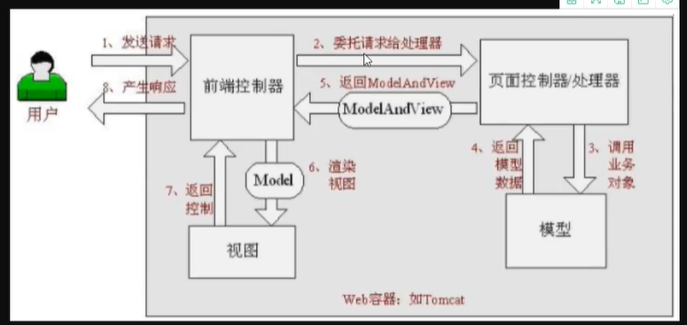

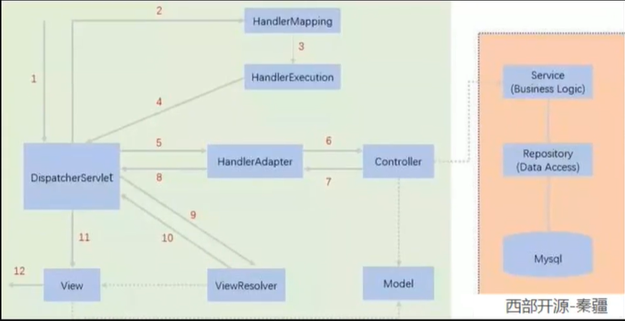

图为SpringMVC的一个较完整的流程图，实线表示SpringMVC框架提供的技术，不需要开发者实现，虚线表示需要开发者实现。

### 流程

1. DispatcherServlet表示前置控制器，是整个SpringMVC的控制中心。用户发出请求，DispatcherServlet接收请求并拦截请求。
我们假设请求的url为 : http:// localhost:8080/SpringMVC/hello
如上url拆分成三部分:
http://localhost:8080服务器域名. Spring MVC部署在服务器上的web站点. hello表示控制器
通过分析，如上url表示为:请求位于服务器localhost:8080上的SpringMVC站点的hello控制器。
2. HandlerMapping为处理器映射。DispatcherServlet调用HandlerMapping,HandlerMapping根据请求url查找Handler。
3. HandlerExecution表示具体的Handler,其主要作用是根据url查找控制器，如上url被查找控制器为: hello。
4. HandlerExecution将解析后的信息传递给DispatcherServlet,如解析控制器映射等。
5. HandlerAdapter表示处理器适配器，其按照特定的规则去执行Handler。
6. Handler让具体的Controller执行。
7. Controller将具体的执行信息返回给HandlerAdapter,如ModelAndView。
8. HandlerAdapter将视图逻辑名或模型传递给DispatcherServlet。
9. DispatcherServlet调用视图解析器(ViewResolver)来解析HandlerAdapter传递的逻辑视图名。
10. 视图解析器将解析的逻辑视图名传给DispatcherServlet。
11. DispatcherServlet根据视图解析器解析的视图结果，调用具体的视图。
12. 最终视图呈现给用户。

## 样例--XML

### 1、web.xml配置

```xml
<?xml version="1.0" encoding="UTF-8"?>
<web-app xmlns="http://xmlns.jcp.org/xml/ns/javaee"
         xmlns:xsi="http://www.w3.org/2001/XMLSchema-instance"
         xsi:schemaLocation="http://xmlns.jcp.org/xml/ns/javaee http://xmlns.jcp.org/xml/ns/javaee/web-app_4_0.xsd"
         version="4.0">

<!--    配置DispatchServlet:这个是SpringMVC的核心：请求分发器，前端控制器    -->
    <servlet>
        <servlet-name>springmvc</servlet-name>
        <servlet-class>org.springframework.web.servlet.DispatcherServlet</servlet-class>
<!--    DispatchServlet必须要绑定springmvc的配置文件    -->
        <init-param>
            <param-name>contextConfigLocation</param-name>
            <param-value>classpath:springmvc-servlet.xml</param-value>
<!--    启动级别：1    -->
        </init-param>
        <load-on-startup>1</load-on-startup>
    </servlet>
<!--    springmvc中 / 和 /* 是有区别的
        / ： 只会匹配所有的请求，不会去匹配jsp页面
        /*： 会匹配所有请求，也会匹配jsp页面    -->

    <servlet-mapping>
        <servlet-name>springmvc</servlet-name>
        <url-pattern>/</url-pattern>
    </servlet-mapping>
    
</web-app>
```

### 2、springmvc-servlet配置文件

```xml
<?xml version="1.0" encoding="UTF-8"?>
<beans xmlns="http://www.springframework.org/schema/beans"
       xmlns:xsi="http://www.w3.org/2001/XMLSchema-instance"
       xsi:schemaLocation="http://www.springframework.org/schema/beans http://www.springframework.org/schema/beans/spring-beans.xsd">

<!--    处理器映射器    -->
    <bean class="org.springframework.web.servlet.handler.BeanNameUrlHandlerMapping"/>
<!--    处理器适配器    -->
    <bean class="org.springframework.web.servlet.mvc.SimpleControllerHandlerAdapter"/>
<!--    视图解析器    -->
    <bean class="org.springframework.web.servlet.view.InternalResourceViewResolver" id="internalResourceViewResolver">
<!--        前后缀    -->
        <property name="prefix" value="/WEB-INF/jsp/"/>
        <property name="suffix" value=".jsp"/>
    </bean>

<!--    BeanNameUrlHandlerMapping : bean  -->
    <bean id="/hello" class="com.shun.controller.HelloController"/>
</beans>
```

### 3、Controller实现类

```java
package com.shun.controller;

import org.springframework.web.servlet.ModelAndView;
import org.springframework.web.servlet.mvc.Controller;

import javax.servlet.http.HttpServletRequest;
import javax.servlet.http.HttpServletResponse;

public class HelloController implements Controller {
    @Override
    public ModelAndView handleRequest(HttpServletRequest httpServletRequest, HttpServletResponse httpServletResponse) throws Exception {
        ModelAndView modelAndView = new ModelAndView();

        String result = "hellonmk";
        modelAndView.addObject("msg", result);

        modelAndView.setViewName("hello");

        return modelAndView;
    }
}
```

## 样例---注解

### 1、web.xml配置

```xml
<?xml version="1.0" encoding="UTF-8"?>
<web-app xmlns="http://xmlns.jcp.org/xml/ns/javaee"
         xmlns:xsi="http://www.w3.org/2001/XMLSchema-instance"
         xsi:schemaLocation="http://xmlns.jcp.org/xml/ns/javaee http://xmlns.jcp.org/xml/ns/javaee/web-app_4_0.xsd"
         version="4.0">

<!--    配置DispatchServlet:这个是SpringMVC的核心：请求分发器，前端控制器    -->
    <servlet>
        <servlet-name>springmvc</servlet-name>
        <servlet-class>org.springframework.web.servlet.DispatcherServlet</servlet-class>
<!--    DispatchServlet必须要绑定springmvc的配置文件    -->
        <init-param>
            <param-name>contextConfigLocation</param-name>
            <param-value>classpath:springmvc-servlet.xml</param-value>
<!--    启动级别：1    -->
        </init-param>
        <load-on-startup>1</load-on-startup>
    </servlet>
<!--    springmvc中 / 和 /* 是有区别的
        / ： 只会匹配所有的请求，不会去匹配jsp页面
        /*： 会匹配所有请求，也会匹配jsp页面    -->

    <servlet-mapping>
        <servlet-name>springmvc</servlet-name>
        <url-pattern>/</url-pattern>
    </servlet-mapping>
    
</web-app>
```

### 2、springmvc-servlet.xml配置

```xml
<?xml version="1.0" encoding="UTF-8"?>
<beans xmlns="http://www.springframework.org/schema/beans"
       xmlns:context="http://www.springframework.org/schema/context"
       xmlns:mvc="http://www.springframework.org/schema/mvc"
       xmlns:xsi="http://www.w3.org/2001/XMLSchema-instance"
       xsi:schemaLocation="http://www.springframework.org/schema/beans
       http://www.springframework.org/schema/beans/spring-beans.xsd
       http://www.springframework.org/schema/context
       http://www.springframework.org/schema/context/spring-context.xsd
       http://www.springframework.org/schema/mvc
       http://www.springframework.org/schema/mvc/spring-mvc.xsd">

<!--    自动扫描包,让注解生效，有IOC容器统一管理    -->
    <context:component-scan base-package="com.shun.controller"/>
<!--    让Spring不处理静态资源    -->
    <mvc:default-servlet-handler/>
<!--    支持mvc注解驱动
        ispring中一殷采用@RequestMapping注解来完成映射关系
        要想仅@RequestMapping注解生效
        必须向上下文中注册DefaultAnnotationHandlerMapping
        和一个AnnotationMethodHandLerAdapter实例
        这两个实例分别在类级别和方法级别处理。
        而annotation-driven配置帮助我们自动完成上述两个实例的注入。
-->
    <mvc:annotation-driven/>

<!--    视图解析器    -->
    <bean class="org.springframework.web.servlet.view.InternalResourceViewResolver" id="internalResourceViewResolver">
<!--        前后缀    -->
        <property name="prefix" value="/WEB-INF/jsp/"/>
        <property name="suffix" value=".jsp"/>
    </bean>

</beans>
```

3、Controller

```java
package com.shun.controller;


import org.springframework.stereotype.Controller;
import org.springframework.ui.Model;
import org.springframework.web.bind.annotation.RequestMapping;

@Controller
public class HelloController{

    @RequestMapping("/hello")
    public String hello(Model model){
        //封装数据
        model.addAttribute("msg", "helloAnnotation");

        return "hello";
    }
}
```

**可以在类上加RequestMapping注解，作为请求url的前缀**


## Controller配置总结

### Controller控制器

控制器复杂提供坊问应用程序的行为，通常通过接口定义或注解定义两种方法实现。

控制器负责解析用户的请求并将其转换为一个模型。

在Spring MVC中一个控制器类可以包含多个方法

在Spring MVC中，对于Controller的配置方式有很多种

### 实现方法

#### 实现接口

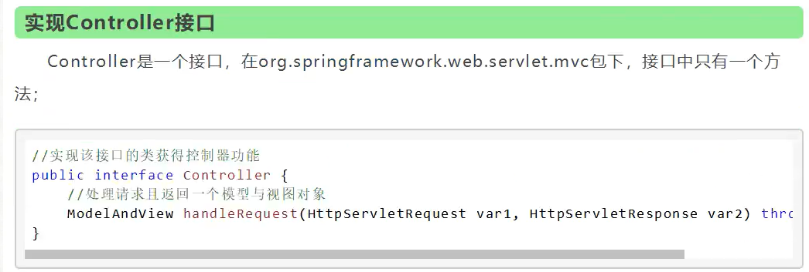

实现接口Controller定义控制器是较老的办法
缺点是:一个控制器中只有一个方法，如果要多个方法则需要定义多个Controller;定义的方式比较麻烦;

#### 注解

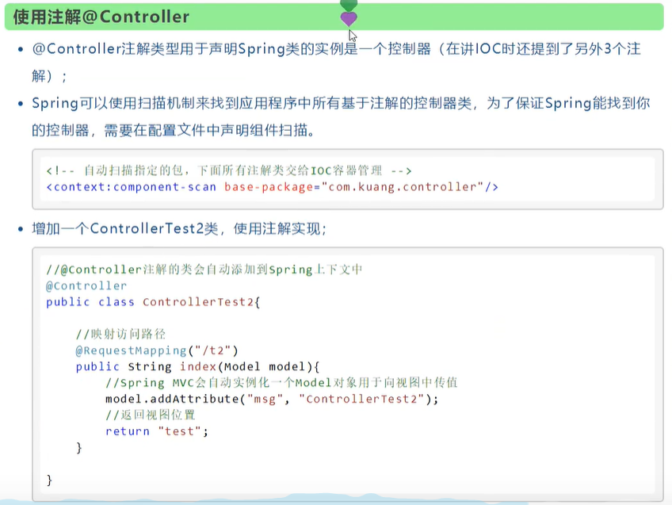

被这个注解的类，中的所有方法，如果返回值是string，并且有具体页面可以跳转，那么就会被视图解析器解析;


## Restful风格

### 概念

Restful就是一个资源定位及资源操作的风格。不是标准也不是协议，只是一种风格。基于这个风格设计的软件可以更简洁，更有层次，更易于实现缓存等机制。

隐藏了一些细节，也更安全

### 功能

资源:互联网所有的事物都可以被抽象为资源

资源操作:使用POST、DELETE、PUT、GET，使用不同方法对资源进行操作

分别对应添加、删除、修改、查询

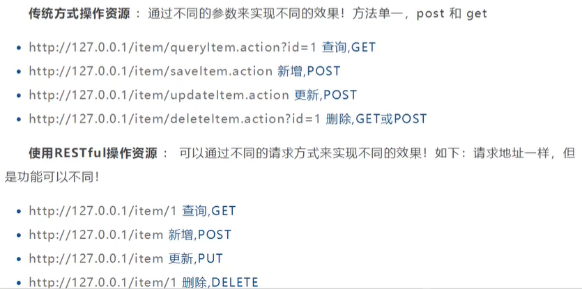

### 样例

```java
@Controller
public class RestfulController {

    @RequestMapping(value = "/add/{a}/{b}",method = RequestMethod.GET)
    public String add(@PathVariable int a, @PathVariable int b, Model model){
        int res = a + b;
        model.addAttribute("msg", res);
        return "hello";
    }
}
```

RequestMapping默认是Get方式请求，使用method参数可以限定使用什么方式请求

也可以用以下的专用注解替换

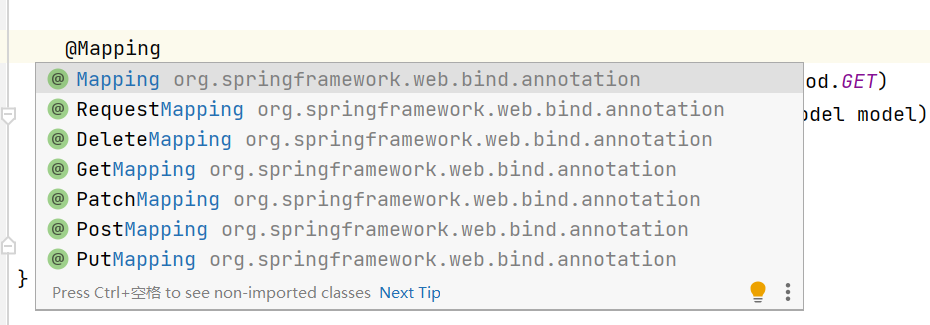

## 转发和重定向

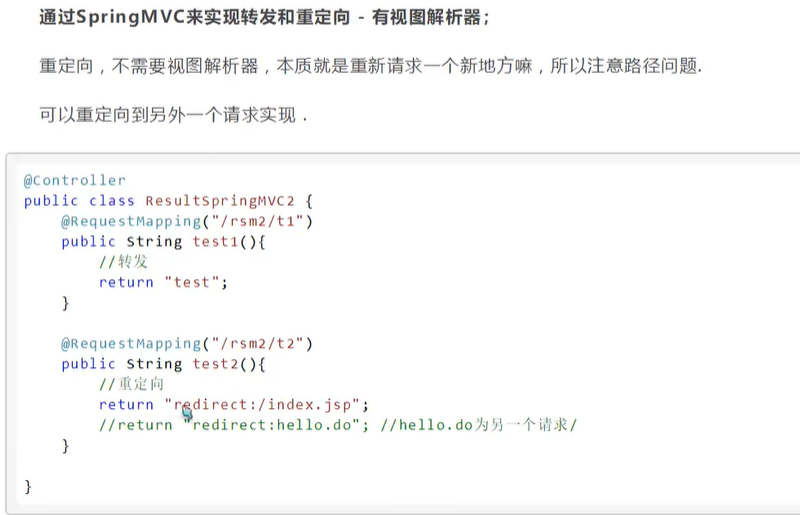

## 接受请求参数和数据回显

### 接收

#### 方式一

```java
@GetMapping("show")
public String show(String name, Model model){
    model.addAttribute("msg", name);
    return "hello";
}
```

这样要求前端的参数名必须是name

#### 方式二

```java
@GetMapping("show")
public String show(@RequestParam("username") String name, Model model){
    model.addAttribute("msg", name);
    return "hello";
}
```

**可以利用@RequestParam参数设置url的请求参数名字**

#### 方式三-对象

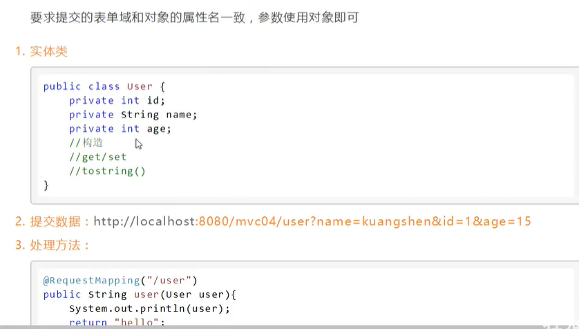

这样框架会自动封装为一个对象

### 回响

第一种ModelAndView在样例中使用了，一般在实现接口当中使用

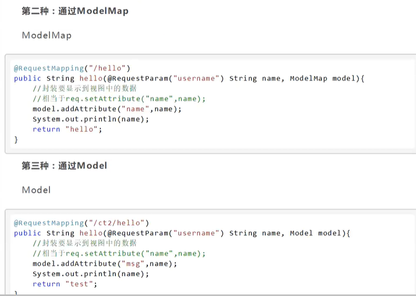

### 其他

Model只有寥寥几个方法只适合用于储存数据，简化了新手对于wodel对象的操作和理解;

ModelMap继承了 LinkedMap ，除了实现了自身的一些方法，同样的继承LinkedMap 的方法和特性;

ModelAndView可以在储存数据的同时，可以进行设置返回的逻辑视图，进行控制展示层的跳转。

## 乱码问题

#### 1、a.jsp提交请求

```jsp
<%@ page contentType="text/html;charset=UTF-8" language="java" %>
<html>
<head>
    <title>Title</title>
</head>
<body>

<form action="/02_helloSpringmvc_war_exploded/t1" method="post">
    <input type="text" name="name">
    <input type="submit">
</form>
</body>
</html>
```

#### 2、Controller编写

```java
package com.shun.controller;

import org.springframework.stereotype.Controller;
import org.springframework.ui.Model;
import org.springframework.web.bind.annotation.PostMapping;

@Controller
public class EncodingController {
    @PostMapping("/t1")
    public String test(String name, Model model){
        model.addAttribute("msg", name);
        return "hello";
    }
}
```

### 解决方式一-Servlet方式

#### 3、添加过滤器

```java
package com.shun.filter;

import javax.servlet.*;
import java.io.IOException;

public class EncodingFilter implements Filter {
    @Override
    public void init(FilterConfig filterConfig) throws ServletException {

    }

    @Override
    public void doFilter(ServletRequest servletRequest, ServletResponse servletResponse, FilterChain filterChain) throws IOException, ServletException {
        servletResponse.setCharacterEncoding("utf-8");
        servletRequest.setCharacterEncoding("utf-8");
        filterChain.doFilter(servletRequest, servletResponse);
    }

    @Override
    public void destroy() {

    }
}

```

#### 4、注册

```xml
<filter>
    <filter-name>encodingFilter</filter-name>
    <filter-class>com.shun.filter.EncodingFilter</filter-class>
</filter>
<filter-mapping>
    <filter-name>encodingFilter</filter-name>
    <url-pattern>/*</url-pattern>
</filter-mapping>
```

### 解决方式二-SpringMVC过滤器

直接配置即可

```xml
<filter>
    <filter-name>encoding</filter-name>
    <filter-class>org.springframework.web.filter.CharacterEncodingFilter</filter-class>
    <init-param>
        <param-name>encoding</param-name>
        <param-value>utf-8</param-value>
    </init-param>
</filter>
<filter-mapping>
    <filter-name>encoding</filter-name>
    <url-pattern>/*</url-pattern>
</filter-mapping>
```


## JSON

### 概念

-  JSON(JavaScript Object Notation,JS对象标记)是一种轻量级的数据交换格式，目前使用特别广泛。
- 采用完全独立于编程语言的文本格式来存储和表示数据。
- 简洁和清晰的层次结构使得JSON成为理想的数据交换语言。
- 易于人阅读和编写，同时也易于机器解析和生成，并有效地提升网络传输效率。

在JavaScript语言中，一切都是对象。因此，任何JavaScript支持的类型都可以通过JSON来表示，例如字符串、数字、对象、数组等。看看他的要求和语法格式:

- 对象表示为键值对，数据由逗号分隔
- 花括号保存对象
- 方括号保存数组

JSON键值对是用来保存JavaScript对象的一种方式，和JavaScript 对象的写法也大同小异，键/值对组合中的键名写在前面并用双引号""包裹，使用冒号︰分隔，然后紧接着值:

### jackson

#### jar依赖

```xml
<!-- https://mvnrepository.com/artifact/com.fasterxml.jackson.core/jackson-databind -->
<dependency>
    <groupId>com.fasterxml.jackson.core</groupId>
    <artifactId>jackson-databind</artifactId>
    <version>2.12.4</version>
</dependency>
```

#### 使用

**可以抽离代码，作为一个json工具类**

```java
package com.shun.controller;

import com.fasterxml.jackson.core.JsonProcessingException;
import com.fasterxml.jackson.databind.ObjectMapper;
import com.fasterxml.jackson.databind.SerializationFeature;
import com.shun.pojo.User;
import org.springframework.stereotype.Controller;
import org.springframework.web.bind.annotation.RequestMapping;
import org.springframework.web.bind.annotation.ResponseBody;
import org.springframework.web.bind.annotation.RestController;

import java.text.SimpleDateFormat;
import java.util.ArrayList;
import java.util.Date;

//@RestController 这个注解说明他的方法不会走视图解析器
@Controller
public class UserController {

    @RequestMapping("/t")
    @ResponseBody  //不会走视图解析器，直接返回一个字符串
    public String test() throws JsonProcessingException {
        //jackson  ObjectMapper对象
        ObjectMapper objectMapper = new ObjectMapper();
        User user = new User(1, "刘顺", "22222");
        String s = objectMapper.writeValueAsString(user);
        return s;
    }

    @RequestMapping("/t1")
    @ResponseBody  //不会走视图解析器，直接返回一个字符串
    public String test1() throws JsonProcessingException {
        //jackson  ObjectMapper对象
        ObjectMapper objectMapper = new ObjectMapper();
        ArrayList<User> users = new ArrayList<>();
        users.add(new User(1, "刘顺", "22222"));
        users.add(new User(2, "刘顺", "22222"));
        users.add(new User(3, "刘顺", "22222"));
        users.add(new User(4, "刘顺", "22222"));
        String s = objectMapper.writeValueAsString(users);
        return s;
    }

    @RequestMapping("/t2")
    @ResponseBody  //不会走视图解析器，直接返回一个字符串
    public String test2() throws JsonProcessingException {
        //jackson  ObjectMapper对象
        ObjectMapper objectMapper = new ObjectMapper();
        objectMapper.configure(SerializationFeature.WRITE_DATE_KEYS_AS_TIMESTAMPS, false);  //设置时间格式
        SimpleDateFormat sdf = new SimpleDateFormat("yyyy-MM-dd:HH-mm-ss");
        objectMapper.setDateFormat(sdf);
        Date date = new Date();
        //ObjectMapper时间解析后的默认格式为：TimeStamp 时间戳
        String s = objectMapper.writeValueAsString(date);
        return s;
    }
}
```

### fastjson

#### fastjson三个主要的类:

**JSONObject代表json对象**

- JSONObject实现了Map接口,猜想JSONObject底层操作是由Map实现的。
- JSONObject对应json对象，通过各种形式的get()方法可以获取json对象中的数据，也可利用诸如size()，isEmpty()等方法获取"键:值"对的个数和判断是否为空。其本质是通过实现Map接口并调用接口中的方法完成的。

**JSONArray 代表json对象数组**

- 内部是有List接口中的方法来完成操作的。

**JSON代表JSONObject和JSONArray的转化**

- JSON类源码分析与使用
- 仔细观察这些方法，主要是实现json对象，json对象数组，javabean对象，json字符串之间的相互转化。

#### 依赖

```xml
<!-- https://mvnrepository.com/artifact/com.alibaba/fastjson -->
<dependency>
    <groupId>com.alibaba</groupId>
    <artifactId>fastjson</artifactId>
    <version>1.2.76</version>
</dependency>
```

#### 使用

```java
@RequestMapping("/t3")
@ResponseBody  //不会走视图解析器，直接返回一个字符串
public String test3() {
    ArrayList<User> users = new ArrayList<>();
    users.add(new User(1, "刘顺", "22222"));
    users.add(new User(2, "刘顺", "22222"));
    users.add(new User(3, "刘顺", "22222"));
    users.add(new User(4, "刘顺", "22222"));
    String s = JSON.toJSONString(users);
    return s;
}
```

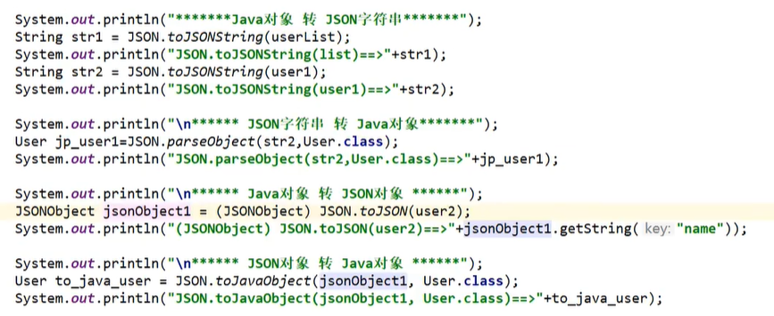


## 整合SSM

### 各种jar包

```xml
<?xml version="1.0" encoding="UTF-8"?>
<project xmlns="http://maven.apache.org/POM/4.0.0"
         xmlns:xsi="http://www.w3.org/2001/XMLSchema-instance"
         xsi:schemaLocation="http://maven.apache.org/POM/4.0.0 http://maven.apache.org/xsd/maven-4.0.0.xsd">
    <modelVersion>4.0.0</modelVersion>

    <groupId>org.example</groupId>
    <artifactId>ssmbuild</artifactId>
    <version>1.0-SNAPSHOT</version>

    <properties>
        <maven.compiler.source>16</maven.compiler.source>
        <maven.compiler.target>16</maven.compiler.target>
    </properties>

<!--    依赖 junit 数据库驱动 连接池 servlet jsp mybatis mybatis-spring spring    -->
    <dependencies>
<!--        junit   -->
        <dependency>
            <groupId>junit</groupId>
            <artifactId>junit</artifactId>
            <version>4.13</version>
        </dependency>
<!--        数据库驱动    -->
        <dependency>
            <groupId>mysql</groupId>
            <artifactId>mysql-connector-java</artifactId>
            <version>8.0.26</version>
        </dependency>
<!--        连接池    -->
        <!-- https://mvnrepository.com/artifact/com.mchange/c3p0 -->
        <dependency>
            <groupId>com.mchange</groupId>
            <artifactId>c3p0</artifactId>
            <version>0.9.5.5</version>
        </dependency>
<!--        servlet    -->
        <dependency>
            <groupId>javax.servlet</groupId>
            <artifactId>servlet-api</artifactId>
            <version>2.5</version>
        </dependency>
        <dependency>
            <groupId>javax.servlet.jsp</groupId>
            <artifactId>jsp-api</artifactId>
            <version>2.2</version>
        </dependency>
        <dependency>
            <groupId>javax.servlet.jsp.jstl</groupId>
            <artifactId>jstl-api</artifactId>
            <version>1.2</version>
        </dependency>
        <dependency>
            <groupId>taglibs</groupId>
            <artifactId>standard</artifactId>
            <version>1.1.2</version>
        </dependency>
<!--        mybatis    -->
        <dependency>
            <groupId>org.mybatis</groupId>
            <artifactId>mybatis</artifactId>
            <version>3.5.7</version>
        </dependency>
        <dependency>
            <groupId>org.mybatis</groupId>
            <artifactId>mybatis-spring</artifactId>
            <version>2.0.6</version>
        </dependency>
<!--        spring    -->
        <dependency>
            <groupId>org.springframework</groupId>
            <artifactId>spring-webmvc</artifactId>
            <version>5.3.9</version>
        </dependency>
        <dependency>
            <groupId>org.springframework</groupId>
            <artifactId>spring-jdbc</artifactId>
            <version>5.3.9</version>
        </dependency>
        <!--        日志    -->
        <!-- https://mvnrepository.com/artifact/log4j/log4j -->
        <dependency>
            <groupId>log4j</groupId>
            <artifactId>log4j</artifactId>
            <version>1.2.17</version>
        </dependency>
<!--        事务     -->
        <dependency>
            <groupId>org.aspectj</groupId>
            <artifactId>aspectjweaver</artifactId>
            <version>1.9.7</version>
        </dependency>
    </dependencies>

<!--    静态资源导出    -->
    <build>
        <resources>
            <resource>
                <directory>src/main/resources</directory>
                <includes>
                    <include>**/*.properties</include>
                    <include>**/*.xml</include>
                </includes>
                <filtering>true</filtering>
            </resource>
            <resource>
                <directory>src/main/java</directory>
                <includes>
                    <include>**/*.properties</include>
                    <include>**/*.xml</include>
                </includes>
                <filtering>true</filtering>
            </resource>
        </resources>
    </build>
</project>
```

### 日志配置文件

```properties
#将等级为DEBUG的日志信息输出到console和file这两个目的地
log4j.rootLogger = DEBUG, console, file

#控制台输出的相关设置
log4j.appender.console = org.apache.log4j.ConsoleAppender
log4j.appender.console.Target = System.out
log4j.appender.console.threshold = DEBUG
log4j.appender.console.layout = org.apache.log4j.PatternLayout
log4j.appender.console.layout.ConversionPattern = [%c]-%m%n

#文件输出的相关设置
log4j.appender.file = org.apache.log4j.RollingFileAppender
log4j.appender.file.File = ./log/shun.log
log4j.appender.file.MaxFileSize = 10mb
log4j.appender.file.threshold = DEBUG
log4j.appender.file.layout = org.apache.log4j.PatternLayout
log4j.appender.file.layout.ConversionPattern = [%p][%d{yy-mm-dd}][%c]%m%n

#日志输出级别
log4j.logger.org.mybatis = DEBUG
log4j.logger.java.sql = DEBUG
log4j.logger.java.sql.Statement = DEBUG
log4j.logger.java.sql.ResultSet = DEBUG
log4j.logger.java.sql.PreparedStatement = DEBUG

```

### mybatis层

#### 1、数据库

```sql
create database `ssmbuild`;

use `ssmbuild`;

create table `books`(
	`bookID` int(10) not null primary key auto_increment,
    `bookName` varchar(100) not null,
    `bookCounts` int(10) not null,
    `detail` varchar(200) not null
)engine=InnoDB default charset=utf8;

insert into `books` (`bookName`,`bookCounts`,`detail`) values
('java', 1, '从入门到放弃'),
('mysql', 10, '从删库到跑路'),
('linux', 2, '从进门到进牢');
```

#### 2、数据库配置文件

```properties
driver=com.mysql.cj.jdbc.Driver
url=jdbc:mysql://localhost:3306/ssmbuild?useSSL=true&useUnicode=true&characterEncoding=utf8
username=root
password=.20010404liushun
```

#### 3、mybatis-config.xml配置文件

```xml
<?xml version="1.0" encoding="UTF-8" ?>
<!DOCTYPE configuration
        PUBLIC "-//mybatis.org//DTD Config 3.0//EN"
        "http://mybatis.org/dtd/mybatis-3-config.dtd">
<configuration>
<!--    &lt;!&ndash;    引入外部配置文件    &ndash;&gt;-->
<!--    <properties resource="db.properties"/>-->

    <settings>
<!--   <setting name="logImpl" value="STDOUT_LOGGING"/>    -->
       <setting name="logImpl" value="log4j"/>
    </settings>-->

    <typeAliases>
        <package name="com.shun.pojo"/>
    </typeAliases>

    <mappers>
        <mapper class="com.shun.mapper.BookMapper"/>
    </mappers>
</configuration>
```

#### 4、各层的基本实现

##### 实体类

```java
package com.shun.pojo;

public class Books {
    private int bookID;
    private String bookName;
    private int bookCounts;
    private String detail;

    public Books() {
    }

    public Books(int bookID, String bookName, int bookCounts, String detail) {
        this.bookID = bookID;
        this.bookName = bookName;
        this.bookCounts = bookCounts;
        this.detail = detail;
    }

    public int getBookID() {
        return bookID;
    }

    public void setBookID(int bookID) {
        this.bookID = bookID;
    }

    public String getBookName() {
        return bookName;
    }

    public void setBookName(String bookName) {
        this.bookName = bookName;
    }

    public int getBookCounts() {
        return bookCounts;
    }

    public void setBookCounts(int bookCounts) {
        this.bookCounts = bookCounts;
    }

    public String getDetail() {
        return detail;
    }

    public void setDetail(String detail) {
        this.detail = detail;
    }
}
```

##### mapper

```java
package com.shun.mapper;

import com.shun.pojo.Books;
import org.apache.ibatis.annotations.Param;

import java.util.List;

public interface BookMapper {

    int addBook(Books books);

    int deleteBookByID(@Param("bookID") int id);

    int updateBook(Books books);

    Books queryBookByID(@Param("bookID") int id);

    List<Books> selectAll();

}
```

```xml
<?xml version="1.0" encoding="UTF-8" ?>
<!DOCTYPE mapper
        PUBLIC "-//mybatis.org//DTD Config 3.0//EN"
        "http://mybatis.org/dtd/mybatis-3-mapper.dtd">
<mapper namespace="com.shun.mapper.BookMapper">
    
    <insert id="addBook" parameterType="Books">
        insert into books (bookName, bookCounts, detail)
        values (#{bookName}, #{bookCounts}, #{detail})
    </insert>

    <delete id="deleteBookByID" parameterType="int">
        delete from books where bookID = #{bookID}
    </delete>
    
    <update id="updateBook" parameterType="Books">
        update books
        set bookName=#{bookName},bookCounts=#{bookCounts},detail=#{detail}
        where bookID=#{bookID}
    </update>
    
    <select id="queryBookByID" parameterType="int" resultType="Books">
        select * from books where bookID = #{bookID}
    </select>

    <select id="selectAll" resultType="Books">
        select * from books
    </select>
</mapper>
```

##### service

```java
package com.shun.service;

import com.shun.pojo.Books;

import java.util.List;

public interface BookService {
    int addBook(Books books);

    int deleteBookByID(int id);

    int updateBook(Books books);

    Books queryBookByID(int id);

    List<Books> selectAll();
}
```

```java
package com.shun.service;

import com.shun.mapper.BookMapper;
import com.shun.pojo.Books;

import java.util.List;

public class BookServiceImpl implements BookService{

    //组合mapper
    private BookMapper bookMapper;

    public void setBookMapper(BookMapper bookMapper) {
        this.bookMapper = bookMapper;
    }

    @Override
    public int addBook(Books books) {
        return bookMapper.addBook(books);
    }

    @Override
    public int deleteBookByID(int id) {
        return bookMapper.deleteBookByID(id);
    }

    @Override
    public int updateBook(Books books) {
        return bookMapper.updateBook(books);
    }

    @Override
    public Books queryBookByID(int id) {
        return bookMapper.queryBookByID(id);
    }

    @Override
    public List<Books> selectAll() {
        return bookMapper.selectAll();
    }
}
```

### Spring层

#### 1、整合mapper层

```xml
<?xml version="1.0" encoding="UTF-8"?>
<beans xmlns="http://www.springframework.org/schema/beans"
       xmlns:xsi="http://www.w3.org/2001/XMLSchema-instance"
       xmlns:context="http://www.springframework.org/schema/context"
       xsi:schemaLocation="http://www.springframework.org/schema/beans
       http://www.springframework.org/schema/beans/spring-beans.xsd
        http://www.springframework.org/schema/context
       http://www.springframework.org/schema/context/spring-context.xsd">

<!--    关联数据库配置文件    -->
    <context:property-placeholder location="db.properties"/>
<!--    连接池
        dbcp: 半自动化操作，不能自动连接
        c3p0: 自动化操作（自动化的加载配置文件，并且可以自动设置到对象中）
        druid,hikari  -->
    <bean id="dataSource" class="com.mchange.v2.c3p0.ComboPooledDataSource">
        <property name="driverClass" value="${driver}"/>
        <property name="jdbcUrl" value="${url}"/>
        <property name="user" value="${username}"/>
        <property name="password" value="${password}"/>

<!--        c3p0连接池的私有属性    -->
        <property name="maxPoolSize" value="30"/>
        <property name="minPoolSize" value="10"/>
<!--        关闭连接池后不自动commit    -->
        <property name="autoCommitOnClose" value="false"/>
<!--        获取连接池超时时间    -->
        <property name="checkoutTimeout" value="10000"/>
<!--        获取连接失败重试次数    -->
        <property name="acquireRetryAttempts" value="2"/>
    </bean>


<!--    SqlSessionFactory    -->
    <bean id="sqlSessionFactory" class="org.mybatis.spring.SqlSessionFactoryBean">
<!--        数据源    -->
        <property name="dataSource" ref="dataSource"/>
<!--        绑定mybatis配置文件    -->
        <property name="configLocation" value="classpath:mybatis-config.xml"/>
    </bean>

<!--    配置mapper接口扫描包，动态地实现了mapper接口，可以注入到Spring容器中，就不需要写实现类了-->
    <bean class="org.mybatis.spring.mapper.MapperScannerConfigurer">
<!--        注入sqlSessionFactory    -->
        <property name="sqlSessionFactoryBeanName" value="sqlSessionFactory"/>
<!--        要扫描的mapper包    -->
        <property name="basePackage" value="com.shun.mapper"/>
    </bean>
</beans>
```

#### 2、整合service层

```xml
<?xml version="1.0" encoding="UTF-8"?>
<beans xmlns="http://www.springframework.org/schema/beans"
       xmlns:xsi="http://www.w3.org/2001/XMLSchema-instance"
       xmlns:context="http://www.springframework.org/schema/context"
       xsi:schemaLocation="http://www.springframework.org/schema/beans
       http://www.springframework.org/schema/beans/spring-beans.xsd
       http://www.springframework.org/schema/context
       http://www.springframework.org/schema/context/spring-context.xsd">

<!--    扫描service下的包    -->
    <context:component-scan base-package="com.shun.service"/>

<!--    将我们的所有的业务类，注入到spring中，可以通过配置，也可以通过注解    -->
    <bean id="bookServiceImpl" class="com.shun.service.BookServiceImpl">
        <property name="bookMapper" ref="bookMapper"/>
    </bean>

<!--    声明式事务    -->
    <bean id="transactionManager" class="org.springframework.jdbc.datasource.DataSourceTransactionManager">
<!--        注入数据源    -->
        <property name="dataSource" ref="dataSource"/>
    </bean>
    
    <!--aop事务支持! -->
    <!--结合AOP实现事务的织入--><!--配置事务通知l; -->
    <tx:advice id="txAdvice" transaction-manager="transactionManager">
        <!--给那些方法配置事务-->
        <!--配置事务的传播特性: new propagation= -->
        <tx:attributes>
            <tx:method name="*" propagation="REQUIRED"/>
        </tx:attributes>
    </tx:advice>
    <!--配置事务切入-->
    <aop:config>
        <aop:pointcut id="txPointCut" expression="execution(* com.shun.mapper.*.*(..))"/>
        <aop:advisor advice-ref="txAdvice" pointcut-ref="txPointCut"/>
    </aop:config>
</beans>
```

#### 3、整合mvc层

```xml
<?xml version="1.0" encoding="UTF-8"?>
<beans xmlns="http://www.springframework.org/schema/beans"
       xmlns:xsi="http://www.w3.org/2001/XMLSchema-instance"
       xmlns:mvc="http://www.springframework.org/schema/mvc"
       xmlns:context="http://www.springframework.org/schema/context"
       xsi:schemaLocation="http://www.springframework.org/schema/beans
       http://www.springframework.org/schema/beans/spring-beans
       http://www.springframework.org/schema/mvc
       http://www.springframework.org/schema/mvc/spring-mvc.xsd
       http://www.springframework.org/schema/context
       http://www.springframework.org/schema/context/spring-context.xsd">

<!--    注解驱动    -->
    <mvc:annotation-driven/>
<!--    静态资源过滤    -->
    <mvc:default-servlet-handler/>
<!--    扫描包：controller    -->
    <context:component-scan base-package="com.shun.controller"/>
<!--    视图解析器    -->
    <bean class="org.springframework.web.servlet.view.InternalResourceViewResolver">
        <property name="prefix" value="/WEB-INF/jsp/"/>
        <property name="suffix" value=".jsp"/>
    </bean>
</beans>
```

#### 4、总的配置文件applicationContext.xml

```xml
<?xml version="1.0" encoding="UTF-8"?>
<beans xmlns="http://www.springframework.org/schema/beans"
       xmlns:xsi="http://www.w3.org/2001/XMLSchema-instance"
       xsi:schemaLocation="http://www.springframework.org/schema/beans http://www.springframework.org/schema/beans/spring-beans.xsd">

    <import resource="spring-mapper.xml"/>
    <import resource="spring-service.xml"/>
    <import resource="spring-mvc.xml"/>
</beans>
```

### 初始页面

#### 前端渲染

```jsp
<%--
  Created by IntelliJ IDEA.
  User: 17437
  Date: 2021/8/7
  Time: 21:54
  To change this template use File | Settings | File Templates.
--%>
<%@ page contentType="text/html;charset=UTF-8" language="java" %>
<html>
  <head>
    <title>首页</title>
    <style>
      a{
        text-decoration: none;
        color: black;
        font-size: 18px;
      }
      h3{
        width: 180px;
        height: 38px;
        margin: 100px auto;
        text-align: center;
        line-height: 38px;
        background: cornflowerblue;
        border-radius: 5px;
      }
    </style>
  </head>
  <body>
    <h3>
      <a href="${pageContext.request.contextPath}/book/allBooks">进入书籍页面</a>
    </h3>
  </body>
</html>

```

#### 结果展示


### 查询书籍

#### controller

```java
package com.shun.controller;

import com.shun.pojo.Books;
import com.shun.service.BookService;
import org.springframework.beans.factory.annotation.Autowired;
import org.springframework.beans.factory.annotation.Qualifier;
import org.springframework.stereotype.Controller;
import org.springframework.ui.Model;
import org.springframework.web.bind.annotation.RequestMapping;

import java.util.List;

@Controller
@RequestMapping("/book")
public class BookController {

    //controller层调用service层
    @Autowired
    @Qualifier("bookServiceImpl")
    private BookService bookService;

    //查询所有书籍，并显示
    @RequestMapping("/allBooks")
    public String selectAllBooks(Model model){
        logger.info("查询所有书籍");
        List<Books> books = bookService.selectAll();
        //System.out.println(books);
        model.addAttribute("books", books);
        return "allBooks";
    }

}
```

#### 前端页面显示

```jsp
<%@ taglib prefix="c" uri="http://java.sun.com/jsp/jstl/core" %>
<%@ page contentType="text/html;charset=UTF-8" language="java" %>
<html>
<head>
    <title>书籍展示</title>
    <!-- 新 Bootstrap 核心 CSS 文件 -->
    <link href="https://cdn.staticfile.org/twitter-bootstrap/3.3.7/css/bootstrap.min.css" rel="stylesheet">

</head>
<body>

<div class="container">
    <div class="row clearfix">
        <div class="col-md-12 column">
            <div class="page-header">
                <h1>
                    <small>书籍列表------显示所有书籍</small>
                </h1>
            </div>
        </div>
    </div>
    <div class="row clearfix">
        <div class="col-md-12 column">
            <table class="table table-hover table-striped">
                <thead>
                    <tr>
                        <th>书籍编号</th>
                        <th>书籍名称</th>
                        <th>书籍库存</th>
                        <th>书籍描述</th>
                    </tr>
                </thead>

            <%--书籍从数据库中查询出来，从books这个集合中遍历出来，foreach--%>
                <tbody>
                    <c:forEach var="book" items="${books}">
                        <tr>
                            <td>${book.bookID}</td>
                            <td>${book.bookName}</td>
                            <td>${book.bookCounts}</td>
                            <td>${book.detail}</td>
                        </tr>
                    </c:forEach>
                </tbody>
            </table>
        </div>
    </div>
</div>
</body>
</html>
```

#### 结果展示

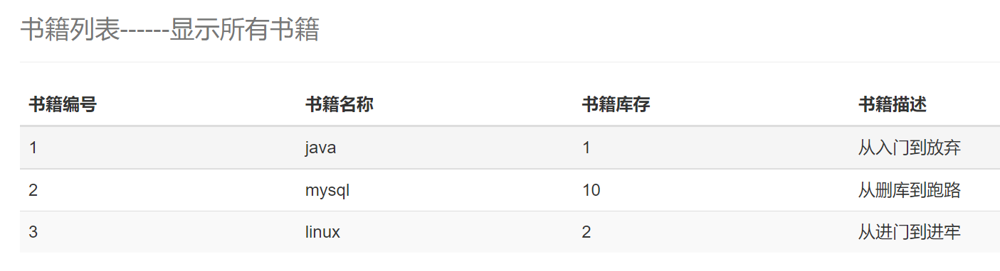

### 添加书籍

#### controller

```java
//跳转到增加书籍页面
@RequestMapping("/toAddBook")
public String toAddPage(){
    logger.info("跳转到增加书籍页面");
    return "addBook";
}

//添加书籍
@RequestMapping("/addBook")
public String addBook(Books books){
    logger.info("-----增加书籍-----");
    int i = bookService.addBook(books);
    if(i > 0){
        logger.debug("增加书籍成功");
    }else {
        logger.debug("增加书籍失败");
    }
    return "redirect:/book/allBooks";//重定向到请求   @RequestMapping("/allBooks")
}
```

#### jsp

```jsp
allBooks.jsp
<div class="row clearfix">
    <div class="col-md-12 column">
        <div class="page-header">
            <h1>
                <small>书籍列表------显示所有书籍</small>
            </h1>
        </div>
    </div>
    <div class="row">
        <div class="col-md-4 column">
            <a class="btn btn-primary" href="${pageContext.request.contextPath}/book/toAddBook">新增书籍</a>
        </div>
    </div>
</div>
```

```jsp
addBook.jsp
<%--
  Created by IntelliJ IDEA.
  User: 17437
  Date: 2021/8/8
  Time: 11:19
  To change this template use File | Settings | File Templates.
--%>
<%@ page contentType="text/html;charset=UTF-8" language="java" %>
<html>
<head>
    <title>增加书籍</title>
    <!-- 新 Bootstrap 核心 CSS 文件 -->
    <link href="https://cdn.staticfile.org/twitter-bootstrap/3.3.7/css/bootstrap.min.css" rel="stylesheet">

</head>
<body>
<div class="container">
    <div class="row clearfix">
        <div class="col-md-12 column">
            <div class="page-header">
                <h1>
                    <small>新增书籍</small>
                </h1>
            </div>
        </div>
    </div>
    <form action="${pageContext.request.contextPath}/book/addBook" method="post">
        <div class="form-group">
            <label for="bookname">书籍名称：</label>
            <input type="text" name="bookName" class="form-control" id="bookname" required>
        </div>
        <div class="form-group">
            <label for="booknumber">书籍数量：</label>
            <input type="text" name="bookCounts" class="form-control" id="booknumber" required>
        </div>
        <div class="form-group">
            <label for="bookdetail">书籍描述：</label>
            <input type="text" name="detail" class="form-control" id="bookdetail" required>
        </div>
        <div class="form-group">
            <input type="submit" class="form-control" value="添加">
        </div>
    </form>
</div>
</body>
</html>

```

#### 效果展示

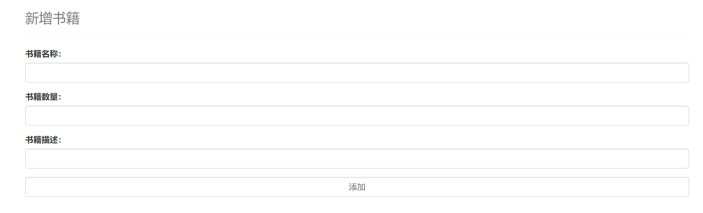

### 更新和删除书籍

#### Controller

```java
//跳转到修改页面
@RequestMapping("/toUpdateBook/{bookID}")
public String toUpdatePage(@PathVariable("bookID") int id, Model model){
    logger.info("跳转到更新书籍页面");
    Books books = bookService.queryBookByID(id);
    model.addAttribute("QBooks", books);
    return "updateBook";
}

//修改书籍
@RequestMapping("/updateBook")
public String updateBook(Books books){
    logger.info("-----更新书籍-----");
    int i = bookService.updateBook(books);
    if(i > 0){
        logger.debug("更新书籍成功");
    }else {
        logger.debug("更新书籍失败");
    }
    return "redirect:/book/allBooks";//重定向到请求   @RequestMapping("/allBooks")
}

@RequestMapping("/deleteBook/{bookID}")
public String deleteBook(@PathVariable("bookID") int id){
    logger.info("-----删除书籍-----");
    int i = bookService.deleteBookByID(id);
    if(i > 0){
        logger.debug("删除书籍成功");
    }else {
        logger.debug("删除书籍失败");
    }
    return "redirect:/book/allBooks";
}
```

#### jsp

```jsp
allBooks.jsp
<td>${book.bookID}</td>
<td>${book.bookName}</td>
<td>${book.bookCounts}</td>
<td>${book.detail}</td>
<td>
    <a href="${pageContext.request.contextPath}/book/toUpdateBook/${book.bookID}">修改</a>
    &nbsp; | &nbsp;
    <a href="${pageContext.request.contextPath}/book/deleteBook/${book.bookID}">删除</a>
</td>
```

```jsp
updateBook.jsp
<%--
  Created by IntelliJ IDEA.
  User: 17437
  Date: 2021/8/8
  Time: 16:05
  To change this template use File | Settings | File Templates.
--%>
<%@ page contentType="text/html;charset=UTF-8" language="java" %>
<html>
<head>
    <title>修改书籍</title>
    <!-- 新 Bootstrap 核心 CSS 文件 -->
    <link href="https://cdn.staticfile.org/twitter-bootstrap/3.3.7/css/bootstrap.min.css" rel="stylesheet">

</head>
<body>
<div class="container">
  <div class="row clearfix">
    <div class="col-md-12 column">
      <div class="page-header">
        <h1>
          <small>修改书籍</small>
        </h1>
      </div>
    </div>
  </div>
  <form action="${pageContext.request.contextPath}/book/updateBook" method="post">

    <div class="form-group">
      <label for="bookID">书籍ID：</label>
      <input type="text" name="bookID" class="form-control" id="bookID" value="${QBooks.bookID}" required readonly>
    </div>
<%--    或者作为隐藏域    --%>
<%--    <input type="hidden" name="bookID" class="form-control" value="${QBooks.bookID}"> --%>
    <div class="form-group">
      <label for="bookname">书籍名称：</label>
      <input type="text" name="bookName" class="form-control" id="bookname" value="${QBooks.bookName}" required>
    </div>
    <div class="form-group">
      <label for="booknumber">书籍数量：</label>
      <input type="text" name="bookCounts" class="form-control" id="booknumber" value="${QBooks.bookCounts}" required>
    </div>
    <div class="form-group">
      <label for="bookdetail">书籍描述：</label>
      <input type="text" name="detail" class="form-control" id="bookdetail" value="${QBooks.detail}" required>
    </div>
    <div class="form-group">
      <input type="submit" class="form-control" value="修改">
    </div>
  </form>
</div>
</body>
</html>
```

#### 效果展示

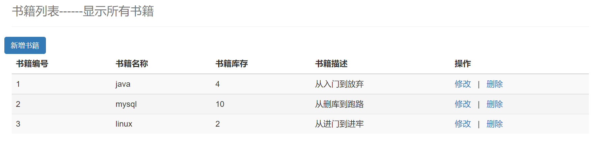

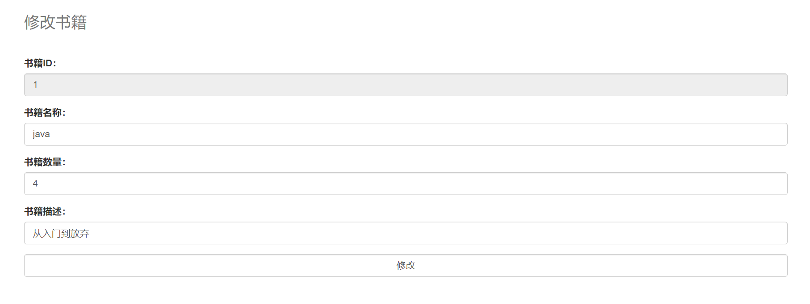

### 新增查询功能

#### 前端

```jsp
<div class="row">
    <div class="col-md-4 column">
        <a class="btn btn-primary" href="${pageContext.request.contextPath}/book/toAddBook">新增书籍</a>
        <a class="btn btn-primary" href="${pageContext.request.contextPath}/book/allBooks">显示全部书籍</a>
    </div>
    <div class="col-md-4 column"></div>
    <div class="col-md-4 column">
        <%--                查询书籍    --%>
        <form action="${pageContext.request.contextPath}/book/queryBook" method="post" style="float: right">
            <span type="text" style="color: red;font-weight: bold">${error}</span>
            <input type="text" name="queryBookName" class="form-inline" placeholder="请输入要查询书籍的名称" required>
            <input type="submit" value="查询" class="btn btn-primary">
        </form>
    </div>
</div>
```

#### mapper层

```java
Books queryBookByName(@Param("bookName") String bookName);

<select id="queryBookByName" resultType="Books">
    select * from books where bookName=#{bookName}
</select>
```

#### service层

```java
Books queryBookByName(String bookName);

@Override
public Books queryBookByName(String bookName) {
    return bookMapper.queryBookByName(bookName);
}
```

#### controller层

```java
//查询书籍
@RequestMapping("queryBook")
public String queryBook(String queryBookName, Model model){
    logger.info("查询书籍");
    Books books = bookService.queryBookByName(queryBookName);
    List<Books> list = new ArrayList<Books>();
    list.add(books);
    if (books == null){
        list = bookService.selectAll();
        model.addAttribute("error", "未查询到相关书籍");
    }
    model.addAttribute("books", list);
    return "allBooks";
}
```

#### 结果展示

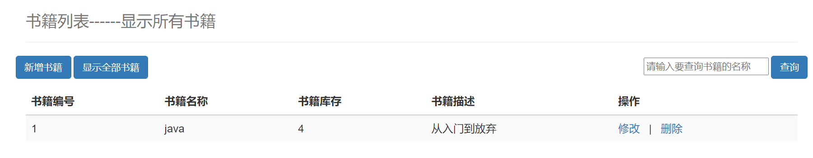

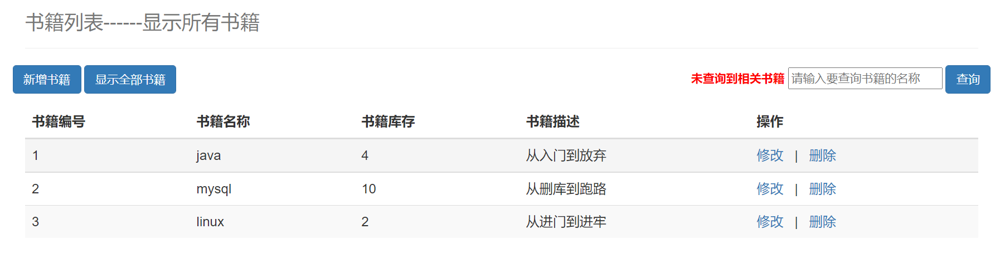

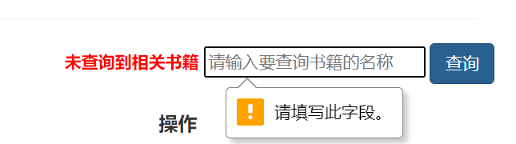


## Ajax技术

### 简介

AJAX = Asynchronous JavaScript and XML(异步的JavaScript和XML).AJAX是一种在无需重新加载整个网页的情况下，能够更新部分网页的技术。

Ajax 不是一种新的编程语言，而是一种用于创建更好更快以及交互性更强的Web应用程序的技术。

在2005年，Google通过其Google Suggest使AJAX变得流行起来。Google Suggest能够自动帮你完成搜索单词。

Google Suggest使用AJAX创造出动态性极强的 web界面:当您在谷歌的搜索框输入关键字时，JavaScript 会把这些字符发送到服务器，然后服务器会返回一个搜索建议的列表。

就和国内百度的搜索框一样:

传统的网页(即不用ajax技术的网页)，想要更新内容或者提交一个表单，都需要重新加载整个网页。

使用ajax技术的网页，通过在后台服务器进行少量的数据交换，就可以实现异步局部更新。

使用Ajax，用户可以创建接近本地桌面应用的直接、高可用、更丰富、更动态的Web用户界面。

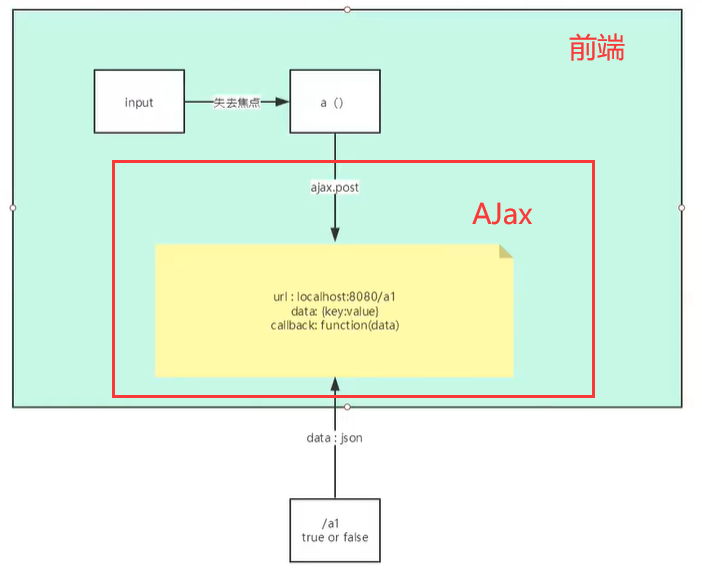

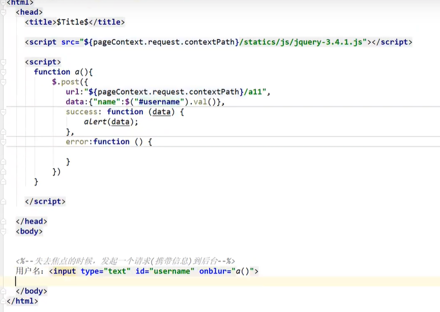

## 拦截器

### 概述

SpringMVC的处理器拦截器类似于Servlet开发中的过滤器Filter,用于对处理器进行预处理和后处理。开发者可以自己定义一些拦截器来实现特定的功能。

**过滤器与拦截器的区别**:拦截器是AOP思想的具体应用。

**过滤器**

- servlet规范中的一部分，任何java web工程都可以使用
- 在url-pattern中配置了/*之后，可以对所有要访问的资源进行拦截

**拦截器**

- 拦截器是Spring MVC框架自己的，只有使用了SpringMVC框架的工程才能使用
- 拦截器只会拦截访问的控制器方法，如果访问的是jsp/html/css/image/js是不会进行拦截的

### 实现

#### 1、拦截器代码

```java
package com.shun.config;

import org.springframework.web.servlet.HandlerInterceptor;
import org.springframework.web.servlet.ModelAndView;

import javax.servlet.http.HttpServletRequest;
import javax.servlet.http.HttpServletResponse;

public class MyInterceptor implements HandlerInterceptor {
    @Override
    public boolean preHandle(HttpServletRequest request, HttpServletResponse response, Object handler) throws Exception {
        System.out.println("====执行前=====");
        return true;
        //return true：执行下一个拦截器，放行
        //return false：不执行下一个拦截器，不放行
    }

    @Override
    public void postHandle(HttpServletRequest request, HttpServletResponse response, Object handler, ModelAndView modelAndView) throws Exception {
        System.out.println("====处理====");
    }

    @Override
    public void afterCompletion(HttpServletRequest request, HttpServletResponse response, Object handler, Exception ex) throws Exception {
        System.out.println("====执行后=====");
    }
}
```

#### 2、配置文件--注册拦截器

```xml
<mvc:interceptors>
    <mvc:interceptor>
        <!--            包括整个请求下的所有请求    -->
        <mvc:mapping path="/**"/>
        <bean class="com.shun.config.MyInterceptor"/>
    </mvc:interceptor>
</mvc:interceptors>
```

#### 3、运行结果

```java
====执行前=====
t1
====处理====
====执行后=====
```

## SSM回顾

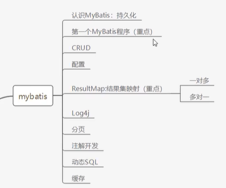

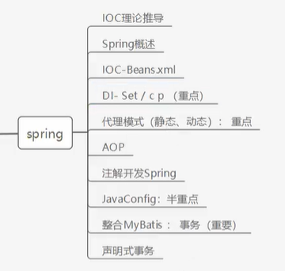

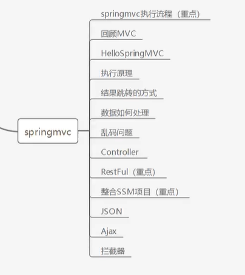
