# Centos7使用Docker

## 安装docker

### 1 检查centos版本

Docker 运行在 CentOS 7 上，要求系统为64位、系统内核版本为 3.10 以上。Docker 运行在 CentOS-6.5 或更高的版本的 CentOS 上，要求系统为64位、系统内核版本为 2.6.32-431 或者更高版本。

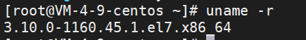

如果版本不符合要求，可以使用下面的某个指令升级

```shell
yum -y update
升级所有包，改变软件设置和系统设置，注意系统内核版本也会升级，因此如果需要升级使用改命令。

yum -y upgrade
升级所有包，不改变软件设置和系统设置，系统版本升级，但是不改变内核
```


[官方教程](https://docs.docker.com/engine/install/centos/#install-using-the-repository)

### 2 卸载旧版本

```shell
yum remove docker docker-client docker-client-latest docker-common docker-latest docker-latest-logrotate docker-logrotate docker-engine
```

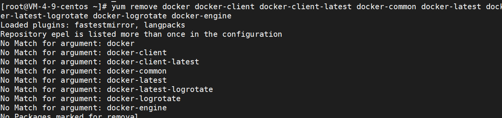

由于我没有安装过，所以没有匹配的文件


### 3 安装新版本

安装依赖

```shell
yum install -y yum-utils
```

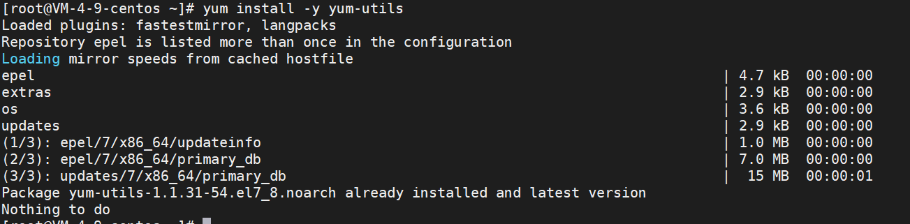


设置仓库源

```shell
yum-config-manager --add-repo https://download.docker.com/linux/centos/docker-ce.repo
```

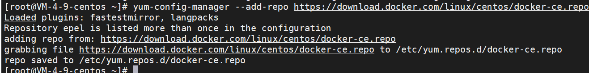


更新索引

```shell
yum makecache fast
```

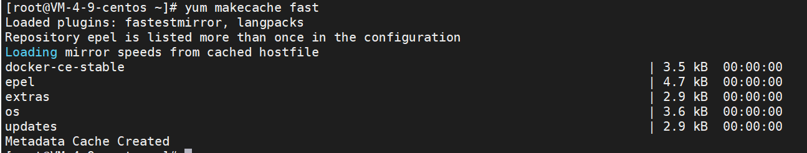


安装docker引擎

Install the *latest version* of Docker Engine, containerd, and Docker Compose

```shell
yum install docker-ce docker-ce-cli containerd.io docker-compose-plugin
```

`docker-ce-cli`这个下载特别慢，还可能安装失败，再次进行安装即可

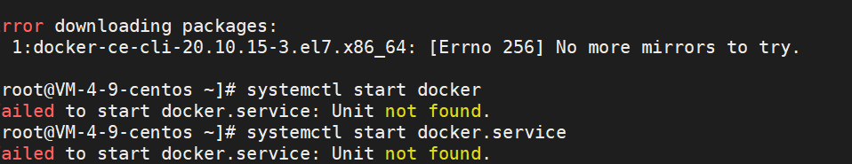

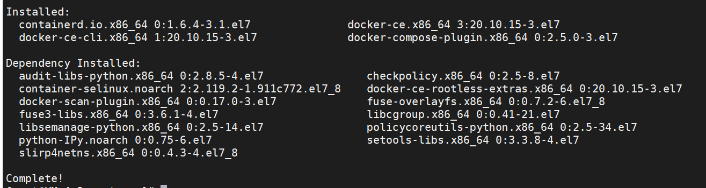


启动

```shell
systemctl start docker
```

查看状态

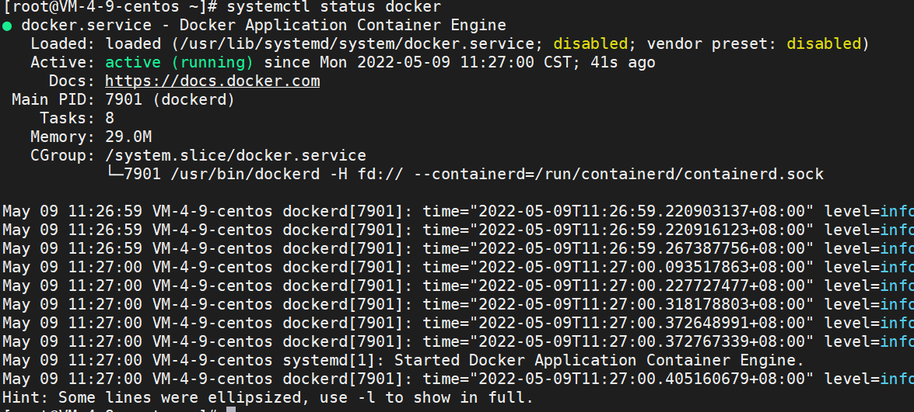

设置开机自启动

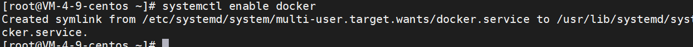


查看版本

有client和service两部分表示docker安装启动都成功了

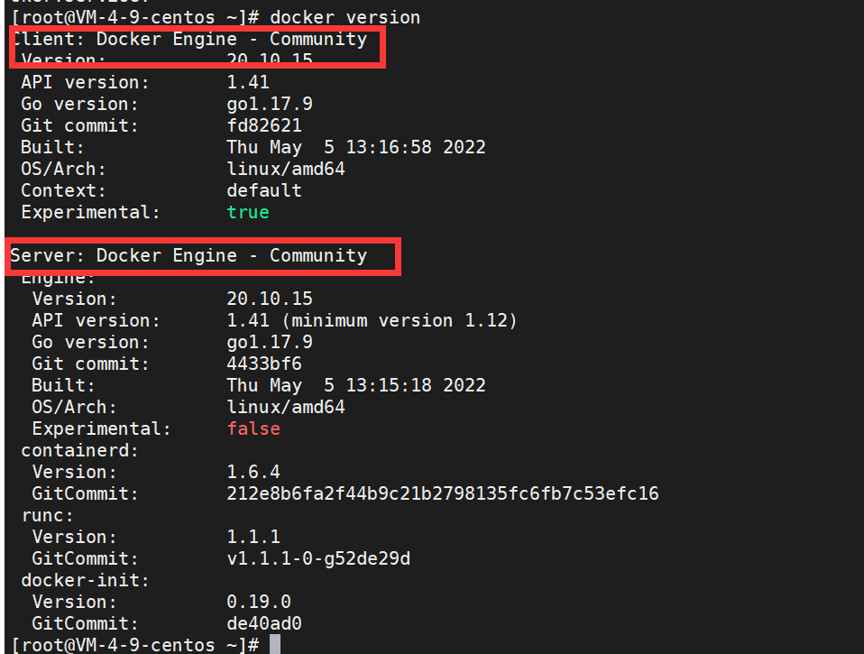


### 4 一些基础命令

```shell
docker system
```

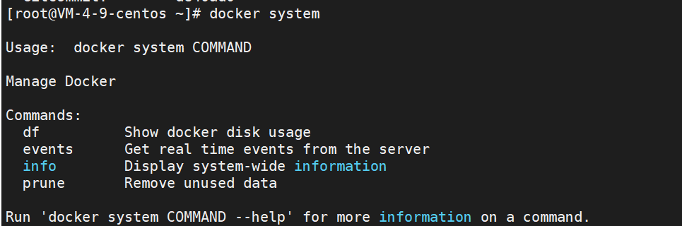


```shell
docker info
展示信息
目前容器中没有程序在运行
```

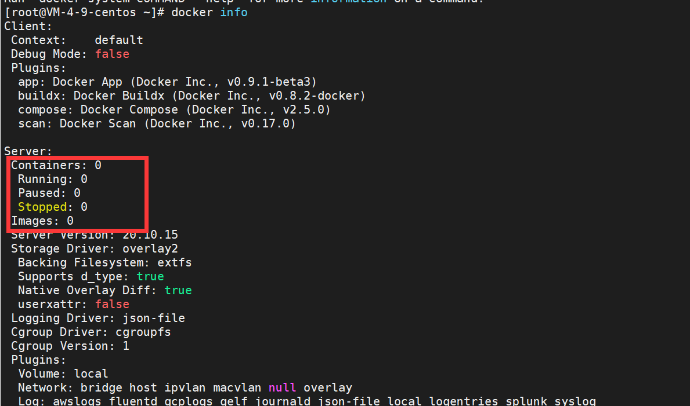


```shell
systemctl restart docker
重启
```


```shell
docker stop 容器名字/容器id    // 停止容器
docker rm   容器名字/容器id    // 删除容器
docker ps                    // 查看运行的容器

docker rmi <image id>        // 删除镜像

docker logs id   // 查看容器的日志，如果报错可以查看
```


### 5 配置镜像

镜像可以加速安装一些软件

在docker目录创建`daemon.json`文件存放加速器地址，并做如下配置

```shell
vim /etc/docker/daemon.json
```

```shell
{
"registry-mirrors": ["https://registry.docker.cn.com"]
}
```

配置完记得重启一下


## docker使用nginx

### 1 安装nginx镜像

```shell
docker pull nginx
```

默认使用版本为latest的镜像

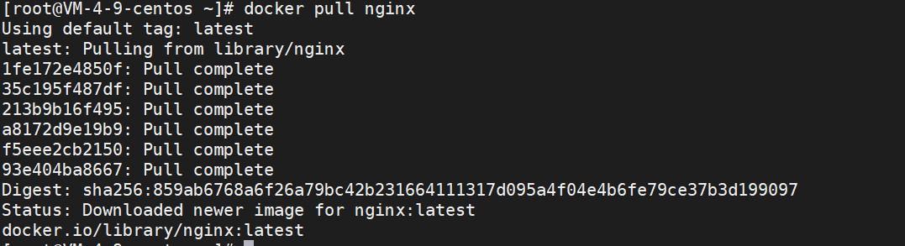

查看安装的镜像

```shell
docker images
```

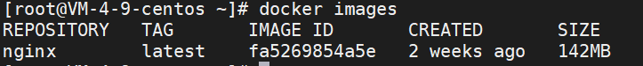


### 2 利用镜像创建容器实例

run 创建容器实例

-- name 容器命名

-v 映射目录

-d 设置容器后台运行

-p 本机端口映射 将容器的80端口映射到本机的80端口

语句最后一个nginx是使用镜像的名称

```shell
docker run --name nginx-test -p 80:80 -d nginx
```

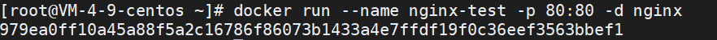


### 3 启动

```shell
docker start nginx-test
docker ps // 查看运行的容器
```

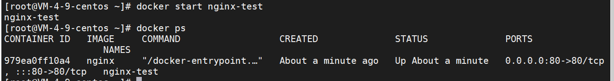


### 4 访问

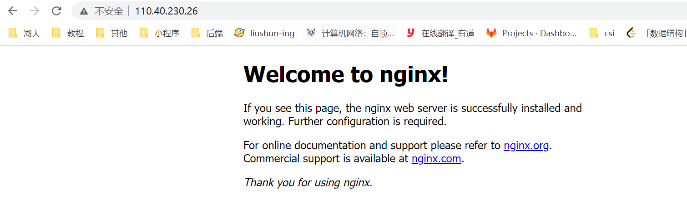


### 5 映射本地配置

配置在容器中进行，太麻烦，所以把配置文件给映射到本地，方便配置与管理

> 创建本地目录

```shell
mkdir -p /root/nginx/www /root/nginx/logs /root/nginx/conf
www: nginx存储网站网页的目录
logs: nginx日志目录
conf: nginx配置文件目录
```

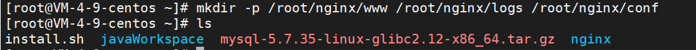


> 将刚刚的nginx-test容器配置复制到本地目录

```shell
docker cp 979ea:/etc/nginx/nginx.conf /root/nginx/conf
docker cp 979ea:/etc/nginx/conf.d /root/nginx/conf
docker cp 979ea:/usr/share/nginx/html /root/nginx/www
```


> 停止移除该容器

```shell
docker stop 979
docker rm 979
这个id唯一即可
```

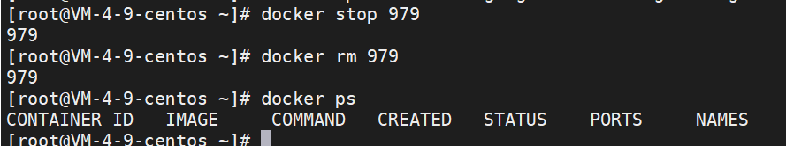


### 6 运行新的容器

创建新容器，并进行文件的映射，并启动

```shell
docker run -d -p 80:80 --name nginx-web -v /root/nginx/www:/usr/share/nginx/html -v /root/nginx/conf/nginx.conf:/etc/nginx/nginx.conf -v /root/nginx/logs:/var/log/nginx -v /root/nginx/conf/conf.d:/etc/nginx/conf.d nginx
```

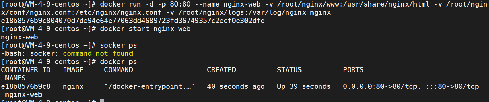

设置docker容器自启动

```shell
docker update --restart=always nginx-web
```

```shell
# 开启容器自启动
docker update --restart=always 【容器名】
例如：docker update --restart=always tracker

# 关闭容器自启动
docker update --restart=no【容器名】
例如：docker update --restart=no tracker

# 相关配置解析
no： 不要自动重启容器。（默认）
on-failure：如果容器由于错误而退出，则重新启动容器，该错误表现为非零退出代码。
always：如果容器停止，请务必重启容器。如果手动停止，则仅在Docker守护程序重新启动或手动重新启动容器本身时才重新启动。（参见重启政策详情中列出的第二个项目）
unless-stopped：类似于always，除了当容器停止（手动或其他方式）时，即使在Docker守护程序重新启动后也不会重新启动容器。
```


### 7 配置nginx

然后上传自己的web项目到www目录下，一个项目一个文件夹

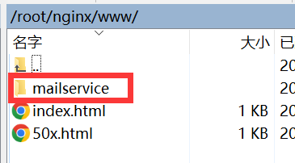


然后进行代理配置

```conf
user  nginx;
worker_processes  auto;

error_log  /var/log/nginx/error.log notice;
pid        /var/run/nginx.pid;


events {
	worker_connections  1024;
}


http {
    include       /etc/nginx/mime.types;
    default_type  application/octet-stream;

    log_format  main  '$remote_addr - $remote_user [$time_local] "$request" '
    '$status $body_bytes_sent "$http_referer" '
    '"$http_user_agent" "$http_x_forwarded_for"';

    access_log  /var/log/nginx/access.log  main;

    sendfile        on;
    #tcp_nopush     on;

    keepalive_timeout  65;

    #gzip  on;

    include /etc/nginx/conf.d/*.conf;

    # 主要是设置这个地方
    server {
        listen       80;
        server_name  localhost;

        #charset koi8-r;

        #access_log  logs/host.access.log  main;

        # 静态资源，都需要在这里设置访问权限,也可以不设置
        location ~ .*\.(gif|jpg|jpeg|png|bmp|map|swf|ioc|rar|zip|txt|flv|mid|doc|docx|pptx|ppt|pdf|xls|xlsx|mp3|wma|ttf|woff|woff2|js.map|map|eot|svg|json|ico|JPG|PNG|JPEG|DOC|DOCX|PPTX|PPT|PDF|XLS|XLSX)$
        {
            expires 30d; 
            #error_log /dev/null;
            #access_log /dev/null; 
        }

        location ~ .*\.(js|css)?$
        {
            expires      12h;
            #error_log /dev/null;
            #access_log /dev/null; 
        }
        # 在这里在设置/是没用的，它默认走的是default.conf里面的配置
        location /mailservice {
            root   mailservice;
            index  index.html index.htm;
        }
        #error_page  404              /404.html;

        # redirect server error pages to the static page /50x.html
        #
        error_page   500 502 503 504  /50x.html;
        location = /50x.html {
        	root   html;
        }
    }

}

```

修改完配置记得重启一下


到此，就可以访问了

访问`http://110.40.230.26/mailservice`

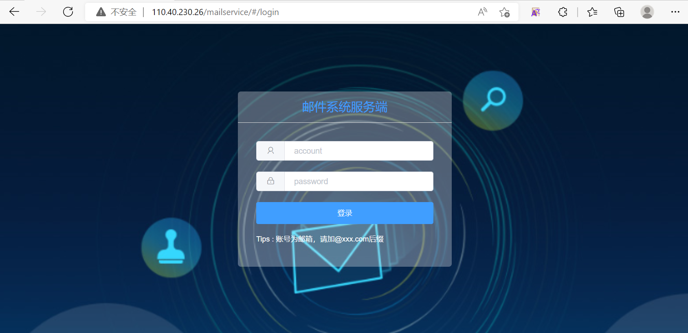


## docker使用mysql

### 1 安装镜像

```shell
docker pull mysql
```

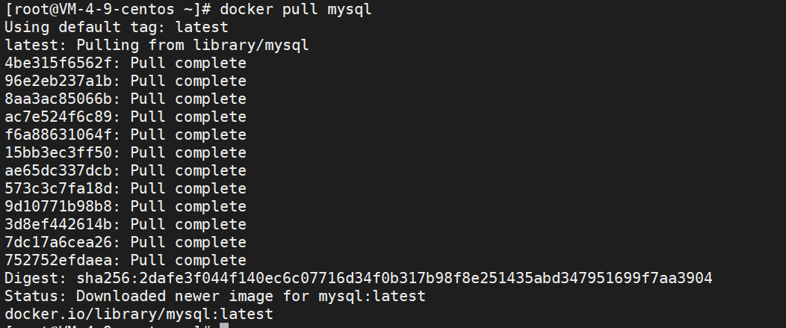


### 2 数据挂载

在宿主机创建mysql的配置文件的目录和数据目录

```shell
mkdir -p /usr/mysql/conf /usr/mysql/data /usr/mysql/logs
```

在配置文件目录下创建MySQL的配置文件my.cnf

```shell
vim /usr/mysql/conf/my.cnf
```

```shell
[client]

#socket = /usr/mysql/mysqld.sock

default-character-set = utf8mb4

[mysqld]

#pid-file        = /var/run/mysqld/mysqld.pid

#socket          = /var/run/mysqld/mysqld.sock

#datadir        = /var/lib/mysql

#socket = /usr/mysql/mysqld.sock

#pid-file = /usr/mysql/mysqld.pid

datadir = /usr/mysql/data

character_set_server = utf8mb4

collation_server = utf8mb4_bin

secure-file-priv = NULL

# Disabling symbolic-links is recommended to prevent assorted security risks

symbolic-links = 0

# Custom config should go here

!includedir /etc/mysql/conf.d/
```


### 3 创建容器

-v : 挂载宿主机目录和 docker容器中的目录，前面是宿主机目录，后面是容器内部目录

-d : 后台运行容器

-p 映射容器端口号和宿主机端口号

-e 环境参数，MYSQL_ROOT_PASSWORD设置root用户的密码

```shell
docker run --restart=always -d --name mysql -v /usr/mysql/conf/my.cnf:/etc/mysql/my.cnf -v /usr/mysql/logs:/logs -v /usr/mysql/data:/var/lib/mysql -p 3306:3306 -e MYSQL_ROOT_PASSWORD=123456 mysql

docker start mysql // 开启服务
```

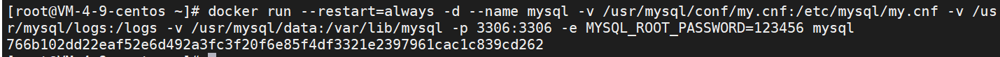

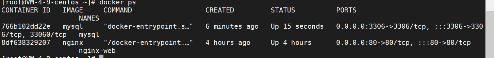


### 4 设置访问权限

进入mysql容器

```shell
docker exec -it mysql /bin/bash

输入
mysql -u root -p
你的密码
mysql>use mysql;
mysql>alter user 'root'@'%'identified with mysql_native_password by '123456';
mysql>flush privileges;
// 设置并更新权限
mysql>quit;

然后输入exit或者ctrl+d退出容器
```

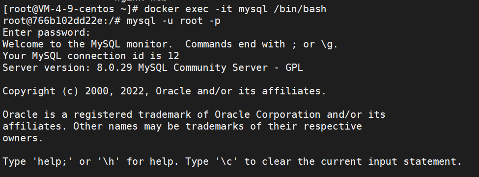

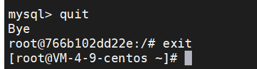

完成，之后可以用navicat连接了

[为什么要用数据挂载](https://www.cnblogs.com/zhaokejin/p/15605229.html)