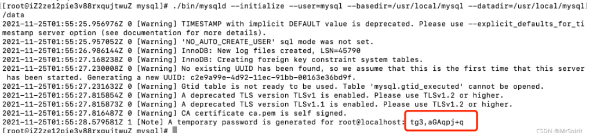
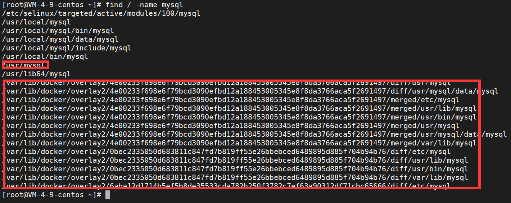
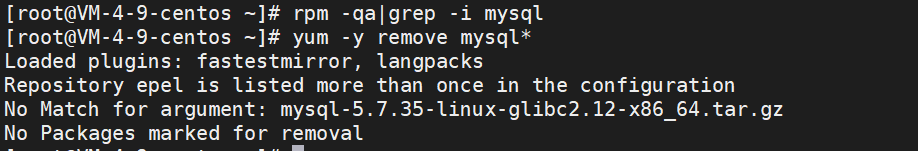
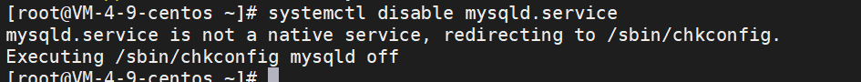

# Centos7安装MySQL

### 1 删除原有的数据库

1、先彻底删除centos预装的mariadb，或者是卸载残留的MySQL

查看是否有mariadb

```shell
rpm -qa | grep mariadb
```

如果存在，就删除掉

```shell
rpm -e --nodeps mariadb-libs-5.5.65-1.el7.x86_64　　
// 强力删除模式，连带删除依赖
// 这个需要看看是版本是不是对应
```


2、查询卸载的文件残留

```shell
find / -name mysql
```

如果有，就删除

```shell
rm -rf /usr/local/mysql
```


### 2 下载安装包

```shell
wget https://downloads.mysql.com/archives/get/p/23/file/mysql-5.7.35-linux-glibc2.12-x86_64.tar.gz
```


### 3 安装

进入`/usr/local`目录，所以也可以一开始就进入这个目录去下载省事

```shell
cd /usr/local
```

解压

```shell
tar -zxvf mysql-5.7.35-linux-glibc2.12-x86_64.tar.gz
// 可以用tar指令指定解压后的位置   j
tar -zxvf 所要解压的文件名 -C 解压位置
tar -zxvf mysql-5.7.35-linux-glibc2.12-x86_64.tar.gz -C /usr/local/
```

修改文件夹名字

```shell
mv mysql-5.7.35-linux-glibc2.12-x86_64 mysql
```

进入`mysql`目录

```shell
cd mysql/
```

创建data文件夹

```shell
mkdir data
```

添加mysql用户及用户组

```shell
groupadd mysql
useradd -r -g mysql mysql
chown -R mysql.mysql /usr/local/mysql 
//将mysql文件夹授权给mysql用户和用户组
```

创建mysql配置文件

如果之前有这个文件，直接更改，如果没有就创建新的

```shell
vim /etc/my.cnf
```

做如下配置

```shell
[mysqld]
port=3306
basedir=/usr/local/mysql
datadir=/usr/local/mysql/data
symbolic-links=0
max_connections=600
default-time-zone='+08:00'
character_set_server=utf8
sql_mode=STRICT_TRANS_TABLES,NO_ZERO_IN_DATE,NO_ZERO_DATE,ERROR_FOR_DIVISION_BY_ZERO,NO_ENGINE_SUBSTITUTION
```

初始化mysql

先安装依赖

```shell
yum install libaio* -y
```

开始初始化

```shell
cd /usr/local/mysql
./bin/mysqld --initialize --user=mysql --basedir=/usr/local/mysql --datadir=/usr/local/mysql/data
```



安装好后，会给一个初始化密码，记得保存下来


使用mysqld服务并设置开机启动

```shell
cp support-files/mysql.server /etc/init.d/mysqld //添加mysqld服务
chmod 755 /etc/init.d/mysqld    //服务授权
chkconfig --add mysqld    //添加开机启动
chkconfig --list    //查看添加的开机启动服务
```


启动前检查配置

```shell
vim /etc/init.d/mysqld

// 检查配置是否如下
basedir=/usr/local/mysql
datadir=/usr/local/mysql/data
```


### 4 启动服务

```shell
service mysqld start
```


### 5 重置MySQL密码并设置远程访问

进入`/usr/local/mysql/bin`目录，执行登陆命令

```shell
./mysql -u root -p
```

输入上面保存的初始化密码


修改密码

```shell
alter user 'root'@'localhost' identified by '你的密码';
flush privileges;
```


授权远程登陆

```shell
use mysql;
GRANT ALL PRIVILEGES ON *.* TO root@"%" IDENTIFIED BY "你的密码";
flush privileges;
```


`quit`指令退出后，重启一下服务器


### 6 相关命令

重启

```shell
mysql service mysqld restart
```

启动

```shell
mysql service mysqld start
```

关闭

```shell
mysql service mysqld stop
```

查看运行状态

```shell
service mysqld status
```


### 7 配置环境变量

编辑配置文件

```shell
vi /etc/profile
```

在最后面加上

```shell
export PATH=$PATH:/usr/local/mysql/bin
```

更新配置文件

```shell
source /etc/profile
```

之后就可以在任何地方使用mysql指令了


### 8 卸载mysql

查找所有mysql文件

```shell
find / -name mysql
```




依次删除这些文件即可

```shell
rm -rf /etc/selinux/targeted/active/modules/100/mysql
rm -rf /usr/local/mysql
rm -rf /usr/local/bin/mysql
rm -rf /usr/lib64/mysql
// 还需要删除配置文件
rm -rf /etc/my.cnf
```


此时用yum工具也找不到了



完成


记得关闭一下他的开机自启动服务

```shell
systemctl disable mysqld.service
```



```shell
systemctl list-unit-files | grep enabled
用这个检查是否g
```

