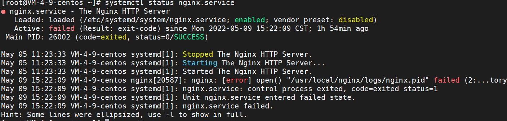
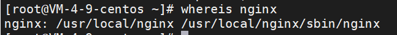
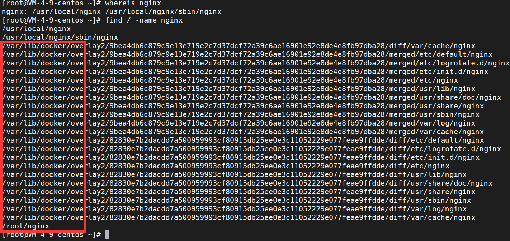
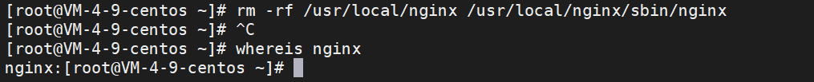
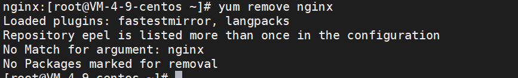
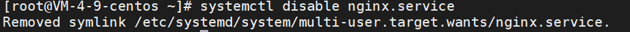

# Centos7安装nginx

### 1 下载

```shell
wget http://nginx.org/download/nginx-1.20.2.tar.gz
```

### 2 安装依赖

```shell
yum -y install gcc pcre-devel zlib-devel openssl openssl-devel
```

### 3 安装

```shell
#解压
tar -zxvf nginx-1.20.2.tar.gz

#进入nginx目录
cd ./nginx-1.20.2

#配置 输出目录
./configure --prefix=/usr/local/nginx

#编译
make
make install
```

### 4 配置环境变量

进入配置文件

```shell
vi /etc/profile
```

在最后加入如下配置

```shell
export PATH=$PATH:/usr/local/nginx/sbin
```

重新加载配置

```shell
source /etc/profile
```

可以使用如下指令来查看所有环境变量

```shell
echo $PATH
```


### 5 一些命令

启动：`nginx` 或者 `nginx -s start`

以特定目录下的配置文件启动：`nginx -c /特定目录/nginx.conf`

重新加载配置：`nginx -s reload` 执行这个命令后，master进程会等待worker进程处理完当前请求，然后根据最新配置重新创建新的worker进程，完成Nginx配置的热更新。

立即停止服务：`nginx -s stop`

从容停止服务：`nginx -s quit` 执行该命令后，Nginx在完成当前工作任务后再停止。

检查配置文件是否正确：`nginx -t`

检查特定目录的配置文件是否正确：`nginx -t -c /特定目录/nginx.conf`

查看版本信息：`nginx -v`


### 6 配置systemd方式管理nginx

```shell
vim /etc/systemd/system/nginx.service
```

做如下配置

```shell
[Unit]
Description=The Nginx HTTP Server
After=network.target remote-fs.target nss-lookup.target

[Service]
Type=forking
PIDFile=/usr/local/nginx/logs/nginx.pid
ExecStart=/usr/local/nginx/sbin/nginx
ExecReload=/usr/local/nginx/sbin/nginx -s reload
ExecStop=/usr/local/nginx/sbin/nginx -s stop
PrivateTmp=true

[Install]
WantedBy=multi-user.target
```

配置后的命令

```shell
systemctl start nginx.service　#（启动nginx服务）
systemctl stop nginx.service　#（停止nginx服务）
systemctl enable nginx.service #（设置开机自启动）
systemctl disable nginx.service #（停止开机自启动）
systemctl status nginx.service #（查看服务当前状态）
systemctl restart nginx.service　#（重新启动服务）
systemctl list-units --type=service #（查看所有已启动的服务）
```


### 7 设置防火墙

注意如果是云服务器，还需要再云服务平台也开放防火墙端口

让 CentOS 系统对外网公开 80 端口和允许外部访问 http 服务

```shell
firewall-cmd --zone=public --add-port=80/tcp --permanent
firewall-cmd --zone=public --add-service=http --permanent
// 重启
firewall-cmd --reload
```

如果Web 站点启用 HTTPS 协议，那么还需要让防火强对外公开 443 端口和 https 服务。

```shell
firewall-cmd --zone=public --add-port=443/tcp --permanent
firewall-cmd --zone=public --add-service=https --permanent
// 重启
firewall-cmd --reload
```


### 8 卸载nginx

先查看nginx是否在运行

```shell
systemctl status nginx.service
```



如果在运行，就使用`nginx -s stop` 或者 `systemctl stop nginx.service`停止服务


查看nginx相关文件

```shell
whereis nginx
```




find查找相关文件

```shell
find / -name nginx
```



注意只要红框是docker配置的nginx，不删


删除相关文件

```shell
rm -rf /usr/local/nginx /usr/local/nginx/sbin/nginx
```




使用yum在清理一次

```shell
yum remove nginx
```




关闭一下开启自启动

```shell
systemctl disable nginx.service
```




完成


