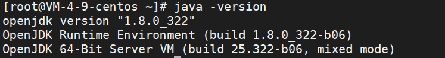

# centos基本操作

## 1 查看端口、进程情况

```shell
1、检查端口被哪个进程占用
netstat -lnp 查看所有列表
netstat -lnp|grep 88   #88请换为你的apache需要的端口，如：80
SSH执行以上命令，可以查看到88端口正在被哪个进程使用。
```


```shell
2、查看进程的详细信息

ps 1777
SSH执行以上命令。查看相应进程号的程序详细路径。如下图。
```


```shell
3、杀掉进程
kill -9 24983    #杀掉pid为24983的进程
```


## 2 配置java环境

### 安装

首先用yum命令看一下是否有自带的java环境

```shell
yum list installed |grep java
```

如果有的话，就需要删掉


查看yum库中的java安装包

```shell
yum -y list java*
```


安装JDK

```shell
yum -y install java-1.8.0-openjdk*
```


查找java安装路径

```shell
which java
```


查看安装的依赖文件

执行

```shell
ls -lrt /usr/bin/java
```


执行

```shell
ls -lrt /etc/alternatives/java
```


可以看到jvm目录，进入该目录

```shell
cd /usr/lib/jvm
```


查看该目录下的文件


### 配置环境变量

```shell
vi /etc/profile
```

最底部添加

```shell
export JAVA_HOME=/usr/lib/jvm/java-1.8.0
export JRE_HOME=$JAVA_HOME/jre  
export PATH=$PATH:$JAVA_HOME/bin:$JRE_HOME/bin
export CLASSPATH=.:$JAVA_HOME/lib/dt.jar:$JAVA_HOME/lib/tools.jar:$JRE_HOME/lib
```

重新加载配置

```shell
source /etc/profile
```


### 检查配置




### 删除已有的环境

查询

```shell
rpm -qa | grep java
```


使用yum卸载

```shell
yum -y remove java java-1.8.0-openjdk-1.8.0.322.b06-1.el7_9.x86_64
```

或者使用rpm删除

```shell
rpm -e --nodeps java-1.8.0-openjdk-1.8.0.322.b06-1.el7_9.x86_64
```


find查看是否还有相关残余文件

```shell
find / -name java
find / -name jdk
find / -name jre
find / -name gcj
//如果有,利用rm删除
```


## 3 部署springboot项目

打包springboot项目为jar包

再服务器建立一个`javaWorkspace`

然后再每个工程建立一个单独的文件夹


将打包好的jar包放进对应的文件夹里面

进行该文件夹，运行程序（记得给运行端口开放防火墙）

```shell
nohup java -jar smtpClient-0.0.1-SNAPSHOT.jar &
```

以nohup模式运行，就会将控制台打印的信息全部存入nohop.out中，不会打印在控制台了。

如果想要关闭程序，可以利用上面的杀死进程方法关闭程序；


## 4 centos默认占用25端口问题

查看端口情况

```shell
netstat -tan
```


查看pid

```shell
netstat -tanp #带PID名
```


他之前25端口是由一个master程序占用

查一下这个程序位置

```shell
find / -name master #查了一下位置
/usr/libexec/postfix/master
```

停止服务

```shell
systemctl stop postfix #停止服务
systemctl disable postfix #禁止开机启动
```

之后就可以自己使用了