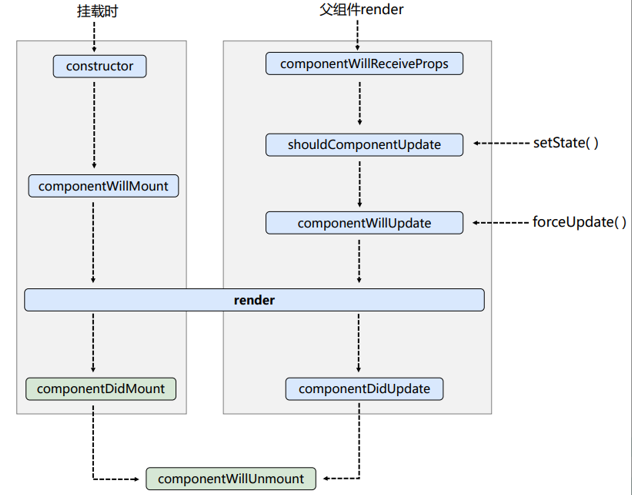
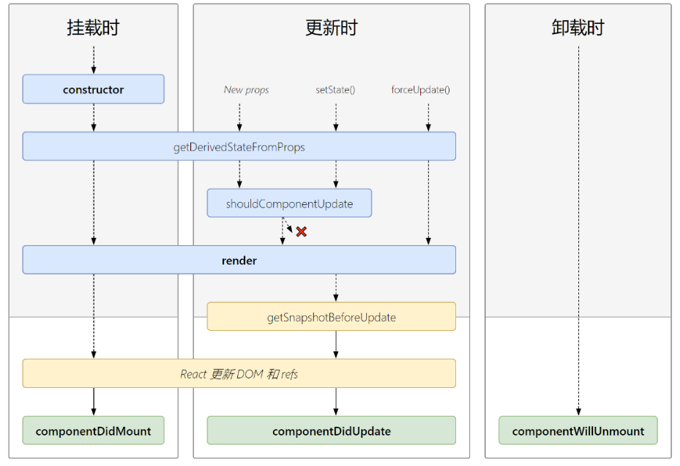
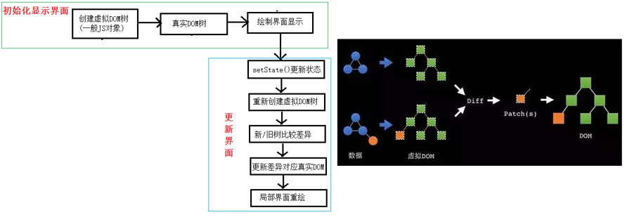

# React面向组件编程

## 组件创建

### 函数式组件

```jsx
// 1.创建函数式组件
function MyComponent(){
    console.1og(this); //此处的this是undefined,因为babe1编译后开启了严格模式，不会默指向windows
    return <h2>我是用函数定义的组件(适用于[简单组件]的定义)</h2>
}
// 2.渲染组件到页面
ReactDOM.render(<MyComponent/>, document.getElementById('test'))
/*
    执行了ReactDOM. render( <MyComponent/>......之后，发生了什么?
    1.React解析组件标签，找到了MyComponent组件。
    2.发现组件是使用函数定义的，随后调用该函数，将返回的虚拟DOM转为真实DOM，随后呈现在页面中。
*/

```

### 类式组件

```jsx
//1.创建类式组件
class MyComponent extends React.Component {
    render(){
        //render是放在哪里的? - - MyComponent的原型对象上，供实例使用。
        //render中的this是谁? - MyComponent组件实例对象。
        console.1og('render中的this: ' ,this);
        return <h2>我是用类定义的组件(适用于[复杂组件]的定义)</h2>
    }
}
//2.渲染组件到页面
ReactDOM.render(<MyComponent/>, document.getElementById('test'))
/*
    执行了ReactDOM.render(<MyComponent/.......之后，发生了什么?
    1. React解析组件标签，找到了MyComponent组件。
    2.发现组件是使用类定义的，随后new出来该类的实例，并通过该实例调用到原型上的render方法。
    3.将render返回的虚拟DOM转为真实DOM，随后呈现在页面中。
*/

```


## 组件实例三大核心属性

### state

#### 理解

- state是组件对象最重要的属性, 值是对象(可以包含多个**key-value**的组合)
- 组件被称为"状态机", 通过更新组件的state来更新对应的页面显示(重新渲染组件)

#### 强烈注意

- 组件中render方法中的this为组件实例对象
- 组件自定义的方法中this为undefined，如何解决？
  - a)   **强制绑定this**: 通过函数对象的bind()
  - b)   箭头函数
- 状态数据，**不能直接修改或更新**

#### 使用

```jsx
//1.创建组件
class Weather extends React.Component{
    constructor(props){
        super(props)
        //初始化状态，里面是对象
        this.state = {isHot:false}
    }
    render(){
        //读取状态
        const {isHot} = this.state
        return <h1 onClick={this.changeWeather}>今天天很{isHot ? '炎热' : ' 凉爽'}</h1>
    }
    changeWeather(){
        // changeWeather放在哪里?一Weather 的原型对象上，供实例使用
        //由于changeWeather是作为onClick的回调，所以不是通过实例调用的，是直接调用
        //类中的方法默认开启了局部的严格模式，所以changeWeather中的this为undefined
        console.log(this)
    }
}
//2.渲染组件到页面
ReactDOM.render( <Weather/>，document. getElementById('test'))

```

#### this指向问题

constructor，render中this指向实例对象，但是自定义函数中是undifined，那么如何解决自定义函数中this问题？

方法一：**在构造器中绑定this**

```jsx
constructor(props){
    super(props)
    //初始化状态，里面是对象
    this.state = {isHot:false}
    this.changeWeather = this.changeWeather.bind(this)
}
```

方法二：**使用箭头函数**

在下面状态修改中给出

#### 状态修改

这个方法在`React.Component`的原型对象上

```jsx
// 严重注意:状态必须通过setState进行更新,且更新是一种合并，不是替换。
// 所以只需要设置需要变化的值就好了
this.setState({isHot: !isHot})
```

#### 写法规范

```jsx
//1.创建组件
class Weather extends React . Component{
    //初始化状态
    state = {isHot :false ,wind: '微风'}

    render(){
        const {isHot} = this.state
        // onClick 大写
        return <h1 onClick={this.changeWeather}>今天很{isHot ? '炎热' : '凉爽'}</h1>
    }
    //自定义方法----要用赋值语句的形式+箭头函数
    changeWeather = () => { 
        const isHot = this.state.isHot
        this.setState({isHot: !isHot})
    }
}
//2.渲染组件到页面
ReactDOM. render( <Weather/>, document. getElementById('test' ))

```


### props

#### 理解

- 每个组件对象都会有props(properties的简写)属性
- 组件标签的所有属性都保存在props中
- **只读属性**

#### 作用

- 通过标签属性从组件外向组件内传递变化的数据
- 注意: 组件内部不要修改props数据

#### 使用

1、内部读取某个属性值

```jsx
this.props.属性名
```

2、 扩展属性: 将对象的所有属性通过props传递

```jsx
const p = {name: xxx, age: xxx, sex: xxx}
ReactDOM.render( <Weather {...p}/>，document.getElementById('test'))
// 这样props里面的属性名和p的属性名一致
// let p = {...对象}，语法糖，构造字面量对象是使用展开语法，用于克隆一个新对象
// 合并对象，let p = {...p1, ...p2}
// let p = {...p1, name: xxx, age: xxx},也可以是加属性，后面覆盖前面的
```

3、对props中的属性值进行类型限制和必要性限制，或者给与默认值

```jsx
class Person{

}
Person.propTypes = {
    // 使用prop-types库进限制（需要引入prop-types库），15版本之后可以直接使用PropTypes
    name: PropTypes.string.isRequired, //限制name必传，且为字符串
    sex: PropTypes.string,//限制sex为字符串.
    age: PropTypes.number ,//限制age为数值
    speak: PropTypes.func,//限制speak为函数
}
//指定默认标签属性值
Person.defaultProps = {
    sex: '男',
    age: 18
}
// 如果不符合规则，或报错
```

4、构造器中使用

在React组件挂载之前，会调用它的构造函数。在为React.Component子类实现构造函数时,应在其他语句之前前调用super(props)。 否则，this. props在构造函数中可能会出现未定义的bug.

```jsx
constructor(props){
    super(props);
}
```

#### 写法规范

```jsx
class Person{
    static propTypes = {
        name: PropTypes.string.isRequired,
        sex: PropTypes.string,
        age: PropTypes.number,
        speak: PropTypes.func
    }
	static defaultProps = {
        sex: '男',
        age: 18
    }
}
```

#### 函数式组件使用props

```jsx
//创建组件
function Person (props){
    const {name,age,sex} = props
    return (
        <ul>
            <li>姓名: {name}</li>
            <li>性别: {sex}</li>
            <1i>年龄: {age}</1i>
        </ul>
    )
}
Person.propTypes = {
    name: PropTypes.string.isRequired, //限制name必传，且为字符串
    sex: PropTypes.string, //限制sex为字符串
    age :PropTypes.number,//限制age为数值
}
//指定默认标签属性值
Person.defaultProps = {
    sex:'男',//sex默认值为男
    age:18 //age默认值为18
}
//渲染组件到页面
ReactDOM.render(<Person name="jerry"/> , document.getElementById( 'test1' ))
```


### refs

**不要过度使用ref**

#### 理解

- 组件内的标签可以定义`ref`属性来标识自己

#### 使用

1、使用字符串形式创建ref

**已经过时了**，不建议使用

这是放在refs上了

```jsx
//创建组件
class Demo extends React.Component{
    //展示左侧输入框的数据
    showData = ()=>{
        const {input1} = this.refs
        alert(input1.value)
    }
    //展示右侧输入框的数据
    showData2 = ()=>{
        const {input2} = this.refs
        alert(input2.value)
    }
    render(){
        return(
        <div>
            <input ref="input1" type="text" placeholder=" 点击按钮提示数据"/>
            <button onClick={this . showData}>点我提示左侧的数据</button>&nbsp;
            <input onBlur={this.showData2} ref="input2" type="text" placeholder="失去焦点提示数据"/>
        </div>
        )
    }
}
```

2、使用回调函数创建ref

这是放在对象本身上了

**最多使用**

```jsx
//创建组件
class Demo extends React.Component{
    //展示左侧输入框的数据
    showData = ()=>{
        const {input1} = this 
        alert(input1.value)
    }
    //展示右侧输入框的数据
    showData2 = ()=>{
        const {input2} = this
        alert(input2.value)
    }
    render(){
        return(
        <div>
            {/*ref回调函数的参数是指代当前节点currentNode*/}
            <input ref={c => this.input1 = C } type="text" placeholder=" 点击按钮提示数据"/>
            <button onClick={this.showData}>点我提示左侧的数据</button>&nbsp;
            <input onBlur={this.showData2} ref={c => this.input2 = c } type="text" placeholder="失去焦点提示数据"/>
        </div>
        )
    }
}
```

说明：

如果ref回调函数是以**内联函数**（上面那种方式就是）的方式定义的，在**更新过程**中它会被执行**两次**,**第一次传入参数null,然后第二次会传入参数DOM元素**。这是因为在每次渲染时会创建一个新的函数实例，所以React清空旧的ref并且设置新的。通过将ref 的回调函数定义成class的绑定函数的方式可以避免上述问题，但是大多数情况下它是无关紧要的。

3、使用createRef创建

**最推荐方式**

```jsx
//创建组件
class Demo extends React.Component{
    this.input1 = React.createRef()
	this.input2 = React.createRef()
    //展示左侧输入框的数据
    showData = ()=>{
        // 注意有current
        alert(this.input1.current.value)
    }
    //展示右侧输入框的数据
    showData2 = ()=>{
        alert(this.input2.current.value)
    }
    render(){
        return(
        <div>
            {/*ref回调函数的参数是指代当前节点currentNode*/}
            <input ref={this.input1} type="text" placeholder=" 点击按钮提示数据"/>
            <button onClick={this.showData}>点我提示左侧的数据</button>&nbsp;
            <input onBlur={this.showData2} ref={this.input2} type="text" placeholder="失去焦点提示数据"/>
        </div>
        )
    }
}
```


## 事件处理

- 通过onXxx属性指定事件处理函数(注意**大小写**)
  - React使用的是**自定义(合成)**事件, 而不是使用的原生DOM事件----兼容性
  - React中的事件是通过**事件委托**方式处理的(委托给**组件最外层**的元素)-----高效
- 通过event.target得到发生事件的DOM元素对象----代替refs

```jsx
//创建组件
class Demo extends React.Component{
	this.input2 = React.createRef()
    //展示右侧输入框的数据
    showData2 = ()=>{
        alert(this.input2.current.value)
    }
    render(){
        return(
        <div>
            <input onBlur={this.showData2} ref={this.input2} type="text" placeholder="失去焦点提示数据"/>
        </div>
        )
    }
}
// 对于这个例子，如果事件绑定函数操作的对象和ref指定的对象是同一个对象，
// 那么可以直接通过方法参数获得对象,不需要refs了
class Demo extends React.Component{
    //展示右侧输入框的数据
    showData2 = (event)=>{
        alert(event.target.value)
    }
    render(){
        return(
        <div>
            <input onBlur={this.showData2} type="text" placeholder="失去焦点提示数据"/>
        </div>
        )
    }
}
```


## 收集表单数据

### 非受控组件

通过ref，现用现取

```jsx
/创建组件
class Login extends React.Component{
    handleSubmit = (event)=>{
    	event.preventDefault() //阻止表单提交
        const {username, password} = this
    	alert(`你输入的用户名是: ${username.value},你输入的密码是: ${password.value}`)
    }
    render(){
        return(
            <form onSubmit={this.handleSubmit}>
            用户名<input ref={c => this.username = c} type="text" name="username"/>
            密码<input ref={c => this.password = c} type="password" name="password"/>
                <button>登录</ button>
            </ form>
    }
}
```


### 受控组件

**实时的将数据改变更新到state中**，然后需要使用时从state中取数据

推荐使用，因为可以少使用ref

```jsx
class Login extends React.Component{
    // 初始化
    state = {
        username: '',
        password: ''
    }
    saveUsername = (event)=>{
        this.setState({username: event.target.value})
    }
    savePassword = (event)=>{
        this.setState({password:event.target.value})
    }
    //表单提交的回调
    handleSubmit = (event)=>{
        event.preventDefault()//阻止表单提交
        const {username,password} = this.state
        alert(`你输入的用户名是:${username},你输入的密码是: ${password}`)
    }
    render(){
        return (
        <form onsubmit={this.handleSubmit}>
            用户名:<input onChange={this.saveUsername} type="text" name="username"/>
            密码:<input onChange={this.savePassword} type="password" name="password"/>			<button>登录</button>
        </form>
        )
    }
}

```


### 高阶函数和函数柯里化

#### 概念

高阶函数:如果一个函数符合下面2个规范中的任何一个，那该函数就是高阶函数。

- 1.若A函数，接收的参数是一个函数， 那么A就可以称之为高阶函数。Promise
- 2.若A函数，调用的返回值依然是一个函数，那么A就可以称之为高阶函数。

函数的柯里化:通过函数调用继续返回函数的方式，实现**多次接收参数最后统一处理**的函数编码形式。

#### 使用

使用一下写法就可以统一函数体，减少很多重复性代码

```jsx
class Login extends React.Component{
    // 初始化
    state = {
        username: '',
        password: ''
    }
    saveFormdata = (dataType)=>{
        return (event) => {
        	this.setState({[dataType]: event.target.value})
		}
    }
    //表单提交的回调
    handleSubmit = (event)=>{
        event.preventDefault()//阻止表单提交
        const {username,password} = this.state
        alert(`你输入的用户名是:${username},你输入的密码是: ${password}`)
    }
    render(){
        return (
        <form onsubmit={this.handleSubmit}>
            用户名:<input onChange={this.saveFormdata('username')} type="text" name="username"/>
            密码:<input onChange={this.saveFormdata('password')} type="password" name="password"/>			<button>登录</button>
        </form>
        )
    }
}
```


## 组件生命周期

### 理解

- 组件从创建到死亡它会经历一些特定的阶段。
- React组件中包含一系列勾子函数(生命周期回调函数), 会在特定的时刻调用。
-  我们在定义组件时，会在特定的生命周期回调函数中，做特定的工作。

### 旧流程

#### 图示



#### 三个阶段

**1.** **初始化阶段:** 由ReactDOM.render()触发---初次渲染

1. constructor()
2. componentWillMount()
3.  render()
4. componentDidMount()

**2.** **更新阶段:** 由组件内部this.setSate()或父组件重新render触发

1. shouldComponentUpdate()----必须要有一个bool返回值，true表示更新，false表示不允许更新
2. componentWillUpdate()
3. render()
4. componentDidUpdate()

**3.** **卸载组件:** 由ReactDOM.unmountComponentAtNode()触发

1. componentWillUnmount()


### 新流程

#### 图示



#### 阶段

新增的两个钩子，用的都很少，基本不怎么用

**1.** **初始化阶段:** 由ReactDOM.render()触发---初次渲染

1. constructor()
2. getDerivedStateFromProps(props, state)   // 从props获得衍生state，必须返回null或者state对象(会将state直接重新赋值，且无法通过setState改变)
3. render()
4. componentDidMount()

**2.** **更新阶段:** 由组件内部this.setSate()或父组件重新render触发

1. getDerivedStateFromProps
2. shouldComponentUpdate()
3. render()
4. getSnapshotBeforeUpdate(prevProps, prevState, snapshotValue)   // 获取快照，用于获取改变之前元素的一些属性值
5. componentDidUpdate()  // 更新完的钩子

**3.** **卸载组件:** 由ReactDOM.unmountComponentAtNode()触发

1. componentWillUnmount()

### 重要的勾子

- render：初始化渲染或更新渲染调用
- componentDidMount：渲染完之后，开启监听, 定时器，发送ajax请求，订阅消息
- componentWillUnmount：做一些收尾工作, 如: 清理定时器，取消订阅

### 即将废弃的勾子

- componentWillMount
- componentWillReceiveProps
- componentWillUpdate

现在使用会出现警告，下一个大版本需要加上UNSAFE_前缀才能使用，以后可能会被彻底废弃，不建议使用。


## 虚拟DOM与DOM Diffing算法




## key

```jsx
<ul>
    data.map((item, index) => {
        return <li key={index}>{item}</li>
    })
</ul>
```

经典面试题:

- 1). react/vue中的key有什么作用?(key的内部原理是什么?)
- 2).为什么遍历列表时，key最好不要用index?

### 虚拟DOM中key的作用

1)，简单的说: key是虚拟DOM对象的标识，在更新显示时key起着极其重要的作用。

2)．详细的说:当状态中的数据发生变化时，react会根据【新数据】生成【新的虚拟DOM】,随后React进行【新虚拟DOM】与【旧虚拟DOM】的diff比较，比较规则如下:

- a.旧虚拟DOM中**找到了**与新虚拟DOM相同的key:
  - (1).若虚拟DOM中**内容没变**,直接使用之前的真实DOM
  - (2).若虚拟DON中**内容变了**，则**生成新的**真实DOM，随后替换掉页面中之前的真实DOM
- b.旧虚拟DOM中**未找到**与新虚拟DOM相同的key
  - 根据数据**创建**新的真实DOM，随后渲染到到页面


### 用index作为key可能会引发的问题

1.若对数据进行:**逆序添加、逆序删除等破坏顺序操作**:

​		会产生没有必要的真实DOM更新 == 〉界面效果没问题，但效率低。

2.如果结构中还包含输入类的DOM:

​		会产生错误DOM更新 == > 界面有问题。

3．注意!

​		如果不存在对数据的逆序添加、逆序删除等破坏顺序操作，仅用于渲染列表用于展示，使用index作为key是没有问题的。


### 开发中如何选择key

1.最好使用每条数据的唯一标识作为key，比如id、手机号、身份证号、学号等唯一值。

2.如果确定只是简单的展示数据，用index也是可以的。
