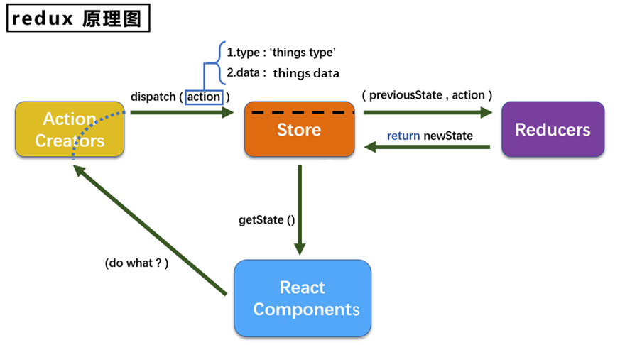
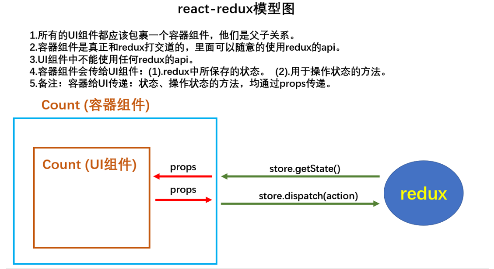
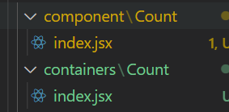
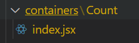
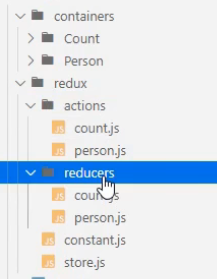

# Redux

## redux理解

### 学习文档

英文文档: https://redux.js.org/

中文文档: http://www.redux.org.cn/

Github: https://github.com/reactjs/redux

### redux是什么

redux是一个专门用于做**状态管理**的JS库(不是react插件库)。

它可以用在react, angular, vue等项目中, 但基本与react配合使用。

作用: 集中式管理react应用中多个组件**共享**的状态。

### 什么情况下需要使用redux

某个组件的状态，需要让其他组件可以随时拿到（共享）。

一个组件需要改变另一个组件的状态（通信）。

总体原则：能不用就不用, 如果不用比较吃力才考虑使用。

### 7.1.4. redux工作流程

                   


## redux的三个核心概念

### action

-  动作的对象
- 包含2个属性
  - l type：标识属性, 值为字符串, 唯一, 必要属性
  - l data：数据属性, 值类型任意, 可选属性
- 例子：{ type: 'ADD_STUDENT',data:{name: 'tom',age:18} }

### reducer

- 用于初始化状态、加工状态。
- 加工时，根据旧的state和action， 产生新的state的**纯函数**。

### store

- 将state、action、reducer联系在一起的对象
- 如何得到此对象?
  - import {createStore} from 'redux'
  - import reducer from './reducers'
  - const store = createStore(reducer)

- 此对象的功能?
  - getState(): 得到state
  - dispatch(action): 分发action, 触发reducer调用, 产生新的state
  - subscribe(listener): 注册监听, 当产生了新的state时, 自动调用


## 练习

### 简单版

(1).去除Count组件自身的状态，可以保留自己私有的state

(2).src下建立;

- -redux
  - -store.js
  - -count_reducer.js

(3).store.js:

- 1).引入redux中的createstore函数，创建一个store
- 2).createstore调用时要传入一个为其服务的reducer
- 3).记得暴露store对象

```js
// 引入createStore,专门用于创建最为核心的store对象
import {createStore} from 'redux';
//引入count组件服务的reducer
import countReducer from './count_reducer'
// 暴露store
export default createStore(countReducer)
```

(4).count_reducer.js:

- 1).reducer的本质是一个函数，接收: preState,action，返回加工后的状态
- 2).reducer有两个作用:初始化状态，加工状态
- 3 ).reducer被第一次调用时，是store自动触发的，
  - 传递的preState是undefined,
  - 传递的action是:{type : ' @@REDUX/INIT_a.2.b.4}

```js
/**
 * 该文件用于创建一个reducer,本质是一个函数
 * 参数为：preState前一个状态, action动作对象
 */
const initState = 0   // 初始化状态
export default function countReducer(preState=initState, action) {
  const {type, data} = action
  switch (type) {
    case 'increment':
      return preState + data
    case 'decrement':
      return preState - data
    default:
      return preState
  }
}
```

(5).在index.js中监测store中状态的改变，一旦发生改变重新渲染<App/>

备注: redux只负责管理状态，至于状态的改变驱动着页面的展示，要靠我们自己写。

```js
import React from "react";
import ReactDOM from "react-dom";
import "./index.css";
import App from "./App";
import reportWebVitals from "./reportWebVitals";
import store from './redux/store'

ReactDOM.render(
  <React.StrictMode>
    <App />
  </React.StrictMode>,
  document.getElementById("root")
);  

// 全局订阅redux，其实就是如果状态更新，就全部重新刷新页面
store.subscribe(() => {
  ReactDOM.render(
    <React.StrictMode>
      <App />
    </React.StrictMode>,
    document.getElementById("root")
  );  
})
reportWebVitals();

```

使用

```jsx
// 获取状态
const count = store.getState()
// 分发任务，修改状态
store.dispatch({type: 'increment', data:value*1})

```


### 完整版

新增文件:
1. count_action.js 专门用于创建action对象

```js
/**
 * 专门为count组件生成action
 */
import {INCREMENT, DECREMENT} from './constant'
export const createIncrementAction = data => ({
  type: INCREMENT,
  data
})

export const createDecrementAction = data => ({
  type: DECREMENT,
  data
})
```

1. constant.js放置容易写错的type值

```js
/**
 * 定义action对象中type类型的常量值
 */
export const INCREMENT = 'increment'
export const DECREMENT = 'decrement'
```

其余的地方就可以用这个代替

使用

```jsx
// 获取状态
const count = store.getState()
// 改变状态
store.dispatch(createIncrementAction(value*1))
```


### 异步action版

异步和同步是说action的类型是什么，同步是对象，异步是函数

(1).明确:延迟的动作不想交给组件自身，想交给action

(2) .何时需要异步action:想要对状态进行操作，但是具体的数据靠异步任务返回(非必须)。

(3).具体编码:

- `npm install redux-thunk`， 并配置在store中

```js
// 引入createStore,专门用于创建最为核心的store对象
import {createStore, applyMiddleware} from 'redux';
//引入count组件服务的reducer
import countReducer from './count_reducer'
// 引入redun-thunk,用来指出异步action,并且需要applyMiddleware支持
import thunk from 'redux-thunk'
// 暴露store
export default createStore(countReducer, applyMiddleware(thunk))
```

- 创建action的函数不再返回一般对象， 而是一个函数， 该函数中写异步任务。

```js
// 异步action返回值为函数,异步action中一般都会调用同步action
export const createIncrementAsyncAction = (data, time) => {
  // 这个函数本身就是store调用，所以可以直接传一个dispatch参数，不需要单独引入store了 
  return (dispatch) => {
    setTimeout(() => {
      dispatch(createIncrementAction(data))
    }, time);
  }
}
```

- 异步任务有结果后，分发一个同步的action去真正操作数据。

```jsx
store.dispatch(createIncrementAsyncAction(value*1, 500))
// store.dispatch({type: 'increment', data:value*1}) 可以换成上面那种写法了
```

备注:异步action不是必须要写的，完全可以自己等待异步任务的结果了再去分发同步action。


## react-redux

### 理解

- 一个react插件库
- **专门用来简化react应用中使用redux**

### react-Redux组件分类

#### UI组件

- 只负责 UI 的呈现，不带有任何业务逻辑
- 通过props接收数据(一般数据和函数)
- 不使用任何 Redux 的 API
- 一般保存在components文件夹下

#### 容器组件

- 负责管理数据和业务逻辑，不负责UI的呈现
- 使用 Redux 的 API
- 一般保存在containers文件夹下

### 模型图




### 练习react-redux版

#### 编写



(1).明确两个概念:

- 1).UI组件:不能使用任何redux的api，只负责页面的呈现、交互等。

```jsx
import React, { Component } from 'react'

export class Count extends Component {

  increment = ()=>{
    const {value} = this.selectNumber
    // 就直接调用容器组件传过来的方法就可以
    this.props.increment(value*1)
  }
  decrement = ()=>{
    const {value} = this.selectNumber
    this.props.decrement(value*1)
  }
  incrementIfOdd = () => {
    const {value} = this.selectNumber

  }
  incrementAsync = () => {
    const {value} = this.selectNumber
    this.props.incrementAsync(value*1, 500)
  }

  render() {
    return (
      <div>
        <h1>当前求和为:{this.props.count}</ h1>
        <select ref={c => this.selectNumber = c}>
          <option value="1">1</option>
          <option value="2">2</option>
          <option value="3">3</option>
        </select>&nbsp;
        <button onClick={this.increment}>+</button>&nbsp;
        <button onClick={this.decrement}>-</button>&nbsp;
        <button onClick={this.incrementIfOdd}>当前求和为奇数再加</button>&nbsp;
        <button onClick={this.incrementAsync}>异步加</button>&nbsp;
      </div>
    )
  }
}

export default Count
```

- 2).容器组件:负责和redux通信，将结果交给UI组件。

```jsx
import CountUI from "../../component/Count";
// 这个不能自己引入，需要传props
// import store from '../../redux/store'

// 引入connct用于连接UI组件和redux
import { connect } from "react-redux";

import {
  createIncrementAction,
  createDecrementAction,
  createIncrementAsyncAction,
} from "../../redux/count_action";

/*
1.mapStateToProps函数返回的是一个对象;
2.返回的对象中的key就作为传递给UI组件props的key,value就作为传递给UI组件props的value
3.mapStateToProps用于传递状态
*/
function mapStateToProps(state) {
  return { count: state };
}

/*
1.mapDispatchToProps函数返回的是一个对象;
2.返回的对象中的key就作为传递UI组件props的key, value就作为传递给UI组件props的value
3.mapDispatchToProps用于传递操作状态的方法
*/
// function mapDispatchToProps(dispatch) {
//   return {
//     increment: (number) => dispatch(createIncrementAction(number)),
//     decrement: (number) => dispatch(createDecrementAction(number)),
//     incrementAsync: (number, time) =>
//       dispatch(createIncrementAsyncAction(number, time)),
//   };
// }

// 简写形式，第二个参数mapDispatchToProps可以是一个对象
const mapDispatchToProps = {
  increment: createIncrementAction,
  decrement: createDecrementAction,
  incrementAsync: createIncrementAsyncAction,
}

export default connect(mapStateToProps, mapDispatchToProps)(CountUI);

```

(2).如何创建一个容器组件--靠react-redux 的connect函数

- -**connect**(mapstateToProps,mapDispatchToProps)(UI组件)
- -**mapstateToProps**:映射状态，返回值是一个对象
- -**mapDispatchToProps:l**映射操作状态的方法，返回值是一个对象

(3).备注:容器组件中的**store是靠props**传进去的，而不是在容器组件中直接引入

```jsx
import Count from './containers/Count';
import store from './redux/store';
// app.js中就只需要引入容器组件，并且传入store即可
render() {
    return (
        <div>
            <Count store={store}></Count>
        </div>
    )
}
```

(4).备注2: mapDispatchToProps，也可以是一个**对象**

#### 优化

==用了react-redux之后，index.js就不需要监听状态改变了，它会自动检测==

此外，也不需要为每一个容器组件分别添加，store属性，直接用Provider包裹App组件，就能自动进行传递

```jsx
ReactDOM.render(
  <React.StrictMode>
    <Provider store={store}>
      <App />    
    </Provider>
  </React.StrictMode>,
  document.getElementById("root")
);  
```

下一个优化，

将UI组件和容器组件进行文件合并，因为最终暴露的是容器组件，UI组件只是给容器组件使用，所以可以在容器组件中直接定义UI组件，没必要单独定义了

最终只需要一个container组件



```jsx
// 引入connect用于连接UI组件和redux
import { connect } from "react-redux";
import {
  createIncrementAction,
  createDecrementAction,
  createIncrementAsyncAction,
} from "../../redux/count_action";
import React, { Component } from 'react'

class Count extends Component {

  increment = ()=>{
    const {value} = this.selectNumber
    this.props.increment(value*1)
  }
  decrement = ()=>{
    const {value} = this.selectNumber
    this.props.decrement(value*1)
  }
  incrementIfOdd = () => {
    const {value} = this.selectNumber

  }
  incrementAsync = () => {
    const {value} = this.selectNumber
    this.props.incrementAsync(value*1, 500)
  }

  render() {
    return (
      <div>
        <h1>当前求和为:{this.props.count}</ h1>
        <select ref={c => this.selectNumber = c}>
          <option value="1">1</option>
          <option value="2">2</option>
          <option value="3">3</option>
        </select>&nbsp;
        <button onClick={this.increment}>+</button>&nbsp;
        <button onClick={this.decrement}>-</button>&nbsp;
        <button onClick={this.incrementIfOdd}>当前求和为奇数再加</button>&nbsp;
        <button onClick={this.incrementAsync}>异步加</button>&nbsp;
      </div>
    )
  }
}

// 可以优化为箭头函数
function mapStateToProps(state) {
  return { count: state };
}

// 简写形式，可以是一个对象
const mapDispatchToProps = {
  increment: createIncrementAction,
  decrement: createDecrementAction,
  incrementAsync: createIncrementAsyncAction,
}

// 可以优化为直接将函数和对象填入，不需要定义一个变凉了
export default connect(mapStateToProps, mapDispatchToProps)(Count);
```


#### 多个组件共享数据

**项目结构优化**：

- 每个组件一个文件夹，将容器和UI组件写在一个index.jsx文件里面
- redux中将所有的actions和reducers分别放在一个文件夹中，并且以组件名命名
- constant和store则共用
- 此外，reducers一般建一个index.js，统一将所有的reducers引入，然后conbine之后，暴露一个最终的对象，方便管理和store引入



==重点==: 每个组件的Reducer要使用combineReducers进行合并，合并后的总状态是一个对象

交给store的是总reducer，并且connect连接UI组件和容器组件时，用到的state是总state，所以需要注意取state时，注意对象取值。

组件的定义互不影响，只是需要在store.js中进行合并

```jsx
//引入为Count组件服务的reducer
import countReducer from './reducers/count'
//引入为Count组件服务的reducer
import personReducer from './reducers/person'
//引入redux-thunk，用于支持异步action
import thunk from 'redux - thunk '
//汇总所有的reducer变为一个总的reducer
const allReducer = combineReducers({
    count: countReducer,
    allPerson: personReducer
    // 这里的属性名就是组件的state想要保存的数据的名称
})
//暴露store
export default createStore(allReducer, applyMiddleware(thunk))
```


## 纯函数和高级函数

### 纯函数

- 一类特别的函数: 只要是同样的输入(实参)，必定得到同样的输出(返回)
- 必须遵守以下一些约束 
  - 不得改写参数数据
  - 不会产生任何副作用，例如网络请求，输入和输出设备
  - 不能调用Date.now()或者Math.random()等不纯的方法 
- ==redux的reducer函数必须是一个纯函数==

所以对于preState的修改，不能使用数组的push、unshift等函数，使用解构赋值构建一个新的数组代替，这样会改变传过来的参数，导致状态改变了，但是页面不会刷新（这是因为react-redux是采用的浅比较，引用没变，所以相当于state没更新）

```jsx
preState.push(data)   //错误
[...preState, data]  // 正确
```

### 高阶函数

- 理解: 一类特别的函数
  - 情况1: 参数是函数
  - 情况2: 返回是函数
- 常见的高阶函数: 
  - 定时器设置函数
  - 数组的forEach()/map()/filter()/reduce()/find()/bind()
  - promise
  - react-redux中的connect函数
- 作用: 能实现更加动态, 更加可扩展的功能
