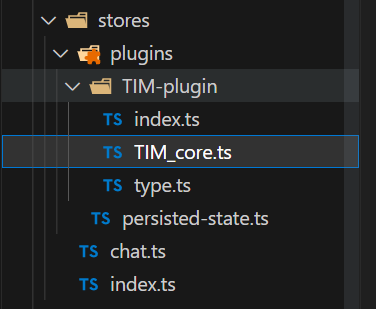
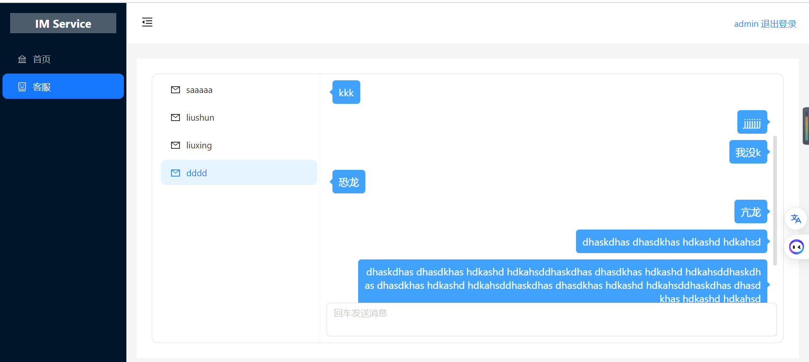
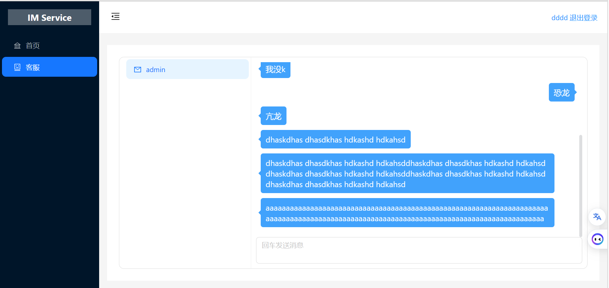

# pinia

## 介绍

Pinia 是 Vue 的存储库，它允许您跨组件/页面共享状态。 如果您熟悉 Composition API，您可能会认为您已经可以通过一个简单的 `export const state = reactive({})`. 这对于单页应用程序来说是正确的，但如果它是服务器端呈现的，**会使您的应用程序暴露于安全漏洞**。 但即使在小型单页应用程序中，您也可以从使用 Pinia 中获得很多好处：

- dev-tools 支持
  - 跟踪动作、突变的时间线
  - Store 出现在使用它们的组件中
  - time travel 和 更容易的调试
- 热模块更换
  - 在不重新加载页面的情况下修改您的 Store
  - 在开发时保持任何现有状态
- 插件：使用插件扩展 Pinia 功能
- 为 JS 用户提供适当的 TypeScript 支持或 **autocompletion**
- 服务器端渲染支持

与 Vuex 相比，Pinia 提供了一个更简单的 API，具有更少的规范，提供了 Composition-API 风格的 API，最重要的是，在与 TypeScript 一起使用时具有可靠的类型推断支持。


## pinia项目实战-基于腾讯IM的客服程序

### 了解自定义插件

#### 介绍

Pinia 插件是一个函数，可以选择返回要添加到 store 的属性。 它需要一个可选参数，一个 *context*：

```
export function myPiniaPlugin(context) {
  context.pinia // 使用 `createPinia()` 创建的 pinia
  context.app // 使用 `createApp()` 创建的当前应用程序（仅限 Vue 3）
  context.store // 插件正在扩充的 store
  context.options // 定义存储的选项对象传递给`defineStore()`
  // ...
}
```

然后使用 `pinia.use()` 将此函数传递给 `pinia`：

```
pinia.use(myPiniaPlugin)
```

插件仅适用于**在将`pinia`传递给应用程序后创建的 store **，否则将不会被应用。


#### 自定义状态持久化插件

```typescript
import type { PiniaPluginContext } from 'pinia'

export default (context: PiniaPluginContext) => {

  const currState = JSON.parse(localStorage.getItem(context.store.$id) || '{}')
  context.store.$patch(currState)

  context.store.$subscribe((_state, state) => {
    localStorage.setItem(_state.storeId, JSON.stringify(state))
  }, {
    detached: true // 该订阅在组件卸载后保留
  })
}
```


### 项目实现

腾讯IM的功能以pinia插件的形式实现，将IM的核心功能作为pinia插件，在pinia初始化时，自动初始化IM api

[腾讯IM文档地址](https://cloud.tencent.com/document/product/269/75285)  [免费试用腾讯IM](https://cloud.tencent.com/act/free/personal?from=20417)


#### 为pinia添加IM核心功能属性和创建选项

需要在src目录下，新建`type.d.ts`类型声明文件

创建选项，是需要在创建pinia，初始化IM时，传入IM的服务`SDKAppID`

核心功能属性时将整个TIM对象挂载到pinia上，方便调用其api

```ts
// type.ts
export interface ITimCoreProps {
  SDKAppID: number
}
```

```ts
import 'pinia'
import { ITimCoreProps } from './stores/plugins/TIM-plugin/type'
import type TIMCore from './stores/plugins/TIM-plugin/TIM_core'

declare module 'pinia' {
  export interface DefineStoreOptionsBase<S, Store> {
    /**
     * TIM初始化的参数
     */
    TIMOptions?: ITimCoreProps
  }
  export interface PiniaCustomProperties {
    /**
     * TIM核心功能对象
     */
    timCore: TIMCore
  }
}

```


#### 创建TIMCore核心类



可以创建一个类，在需要使用的时候，new一个类实例即可

在`store`文件夹中，创建`TIM-plugin`文件夹，创建`TIM_core.ts`文件，用来定义核心功能类

这里直接复制官网的代码即可，只不过将`TencentCloudChat.create(options)`生成的对象作为类属性即可

```ts
// 如果您已集成 v2.x 的 SDK，想升级到 V3 并且想尽可能地少改动项目代码，可以继续沿用 TIM
// import TIM from '@tencentcloud/chat';
import TIMUploadPlugin from 'tim-upload-plugin'
import type { ITimCoreProps, TIMLoginParams } from './type'
import type { ChatSDK, Message } from '@tencentcloud/chat'
import TencentCloudChat from '@tencentcloud/chat'

export default class TIMCore {
  public chat: ChatSDK | undefined
  public userID: string = ''
  public userSig: string = ''

  constructor(props: ITimCoreProps) {
    this.initTimSdk(props.SDKAppID)
    this.bindTIMEvent()
  }

  initTimSdk(SDKAppID: number) {
    let options = {
      SDKAppID, // 接入时需要将0替换为您的即时通信 IM 应用的 SDKAppID
    }
    // 创建 SDK 实例，`TIM.create()`方法对于同一个 `SDKAppID` 只会返回同一份实例
    this.chat = TencentCloudChat.create(options) // SDK 实例通常用 chat 表示
    this.chat.setLogLevel(0) // 普通级别，日志量较多，接入时建议使用
    // chat.setLogLevel(1); // release 级别，SDK 输出关键信息，生产环境时建议使用
    // 注册腾讯云即时通信 IM 上传插件
    this.chat.registerPlugin({ 'tim-upload-plugin': TIMUploadPlugin })
    // 注册腾讯云即时通信 IM 本地审核插件
    // chat.registerPlugin({
    //   'tim-profanity-filter-plugin': TIMProfanityFilterPlugin,
    // })
    this.persisted()
  }
}

```


#### 创建TIM插件

即目录的`/TIM_plugin/index.ts`文件

在这个插件中，需要根据自定义的options，去创建一个TIMCore对象，挂载到store即可

```ts
import type { PiniaPluginContext } from 'pinia'
import TIMCore from './TIM_core'

export default (context: PiniaPluginContext) => {
  if (context.options.TIMOptions) {
    const timCore = new TIMCore(context.options.TIMOptions)
    context.store.timCore = timCore
  }
}

```


#### 创建TIMStore

即`store/chat.ts`

在这个store中，需要声明TIMOptions，赋值SDKAppID，这样在插件中才会有值

```ts
import type { Message, Conversation } from '@tencentcloud/chat'
import { defineStore } from 'pinia'

export const useTIMStore = defineStore('chat', {
  TIMOptions: {
    SDKAppID: 1400823884,
  },
})
```


完成以上工作，就可以看到控制台会打印很多chat的日志，就说明IM初始化好了


#### 登录登出

在TIMCore中完善登录逻辑

在这里需要注意持久化登录，每次刷新页面，pinia都会重新初始化，所以需要自动刷新登陆状态

在登出的时候，需要取消订阅消息

```ts
// type.ts
export interface TIMLoginParams {
  userID: string,
  userSig: string
}
```

```ts
/**
 * 持久登录
 */
private persisted = () => {
  const t = JSON.parse(localStorage.getItem('TIMCoreLogin') || "{}")
  if (t.userID) {
    this.TIMLogin(t)
  }
}

/**
 * 登录TIM
 * @param options 用户信息
 * @returns
 */
TIMLogin = async (options: TIMLoginParams) => {
  if (!this.chat) return
  await this.chat.login(options)
  localStorage.setItem('TIMCoreLogin', JSON.stringify(options))
  this.userID = options.userID
  this.userSig = options.userSig
}

/**
 * 登出TIM
 * @returns
 */
TIMLogout = async () => {
  if (!this.chat) return
  await this.chat.logout()
  this.chat.off(TencentCloudChat.EVENT.MESSAGE_RECEIVED, () => {})
  this.chat.off(TencentCloudChat.EVENT.SDK_READY, () => {})
  localStorage.removeItem('TIMCoreLogin')
}
```


#### 订阅ready事件

在TIMCore中完善逻辑

在创建TIMCore对象时，便需要订阅好SDKReady事件，在SDK ready后，订阅接收消息事件和会话列表更新事件

```ts
  /**
   * 订阅sdk ready事件
   * @returns
   */
  private bindTIMEvent = () => {
    if (!this.chat) return
    this.chat.on(TencentCloudChat.EVENT.SDK_READY, this.handleSDKReady, this)
  }
  
  /**
   * SDKready回调，并订阅接收消息事件
   * @returns
   */
  private handleSDKReady = () => {
    if (!this.chat) return
    console.log('SDK ready..........')
    this.onReady()
    this.chat.on(
      TencentCloudChat.EVENT.MESSAGE_RECEIVED,
      this.onMessageReceived,
      this
    )
    this.chat.on(TencentCloudChat.EVENT.CONVERSATION_LIST_UPDATED, this.onReady)
  }

  /**
   * 准备就绪回调，可覆盖，交给用户自定义逻辑
   */
  public onReady = () => {

  }
```


#### 发送消息

在TIMCore中完善逻辑

定义一个发送文本消息函数，暴露出去即可

```ts
  /**
   * 发送消息
   * @param userId 用户名
   * @param text 消息
   * @returns 无
   */
  public sendTextMessage = async (userId: string, text: string) => {
    if (!this.chat) return
    // 1. 创建消息实例，接口返回的实例可以上屏
    let message = this.chat.createTextMessage({
      to: userId,
      conversationType: TencentCloudChat.TYPES.CONV_C2C,
      // 消息优先级，用于群聊。如果某个群的消息超过了频率限制，后台会优先下发高优先级的消息
      // priority: TencentCloudChat.TYPES.MSG_PRIORITY_NORMAL,
      payload: {
        text,
      },
      // 如果您发消息需要已读回执，需购买旗舰版套餐，并且创建消息时将 needReadReceipt 设置为 true
      // needReadReceipt: true,
      // 消息自定义数据（云端保存，会发送到对端，程序卸载重装后还能拉取到）
      // cloudCustomData: 'your cloud custom data'
    })
    // 2. 发送消息
    await this.chat.sendMessage(message)
    console.log('发送成功', text)
    return message
  }
```


#### 接收消息

在TIMCore中完善逻辑

```ts
  /**
   * 接收消息回调
   *
   * @param event 事件对象
   */
  private onMessageReceived = (event: { data: Message[] }) => {
    // event.data - 存储 Message 对象的数组 - [Message]
    const messageList = event.data
    messageList.forEach((message) => {
      if (message.type === TencentCloudChat.TYPES.MSG_TEXT) {
        // 文本消息 - https://web.sdk.qcloud.com/im/doc/v3/zh-cn/Message.html#.TextPayload
        console.log("TIM---- ", message.payload.text)
        // 设置消息已读
        this.chat?.setMessageRead({conversationID: message.conversationID})
      }
    })
    this.messageReceived(messageList)
  }

  /**
   * 对外暴露的接收消息回调，可重写,交给用户自定义
   * @param event 
   */
  public messageReceived = (messageList: Message[]) => {
  }
```


到这里，就已经完成了TIMCore的核心功能，登录登出，发送和接收消息的api


#### 获取会话列表

在`chat.ts`中完善逻辑

这里获取会话列表后，需要将其存储到store中，因此要定义在状态中

保存下来各个会话的`conversationID`即可

```ts
  state: (): {
    conversationList: string[]
  } => {
    return {
      conversationList: [],
    }
  },

  actions: {
    /**
     * 获取会话列表
     */
    async getSessionList() {
      const data = (await this.timCore.chat?.getConversationList()) || []
      data.data.conversationList.forEach(
        (item: Conversation) =>
          !this.conversationList.includes(item.conversationID) &&
          this.conversationList.unshift(item.conversationID)
      )
      console.log('get conversation', this.conversationList)
    },
  },
```


#### 维护消息列表

在`chat.ts`中完善逻辑

消息列表获取后，也用store保存一下，减少请求次数

用一个对象存储，key是会话id，值是消息列表

提供添加消息，获取消息action，getMessageList作为过渡，如果存在则拿现有的，否则请求腾讯IM

```ts
  state: (): {
    conversationList: string[]
    messageList: {
      [key: string]: Message[]
    }
  } => {
    return {
      conversationList: [],
      messageList: {},
    }
  },

  actions: {
    addMessage(key: string, message: Message) {
      this.messageList[key]
        ? this.messageList[key].push(message)
        : (this.messageList[key] = [message])
    },

    async getHistoryMessageList(conversationId: string) {
      const list = await this.timCore.chat?.getMessageList({
        conversationID: conversationId,
      })
      this.messageList[conversationId] = list.data.messageList
      return this.messageList[conversationId]
    },

    async getMessageList(conversationId: string) {
      if (this.messageList[conversationId]) {
        console.log(111111111111111)
        return this.messageList[conversationId]
      } else {
        return await this.getHistoryMessageList(conversationId)
      }
    },

    resetStore() {
      this.conversationList = []
      this.messageList = {}
    },
  },
```


#### 页面登录登出逻辑

```ts
// utils.js
import { genTestUserSig } from '../../debug/index'

export const getUserSig = (
  userId: string
): {
  SDKAppID: number
  userSig: string
} => {
  return genTestUserSig({
    SDKAppID: 1400823884,
    userID: userId,
    // 在腾讯网站复制即可
    secretKey:
      '3f6b4e829fdc360d58c8a6fe92ad0706f71ee256d0ee9203dccca6842a1d2b69',
  })
}
```

```ts
// 登录
interface FormState {
  username: string;
  password: string;
}

const formState = reactive<FormState>({
  username: '',
  password: '',
});
const router = useRouter()
const store = useTIMStore()
const onFinish = async (values: FormState) => {
  // 调用timCore对象的登陆方法即可
  await store.timCore.TIMLogin({
    userID: values.username,
    userSig: getUserSig(values.username).userSig
  })
  localStorage.removeItem('role')
  if (values.username == 'admin') {
    localStorage.setItem('role', JSON.stringify({
      role: 'admin',
      username: values.username
    }))
  } else {
    localStorage.setItem('role', JSON.stringify({
      role: 'normal',
      username: values.username
    }))
  }
  router.push('/')
}

// 登出
const store = useTIMStore()
const logout = async () => {
  localStorage.removeItem('role')
  // 调用timCore登出方法
  await store.timCore.TIMLogout()
  // 要重置store
  store.resetStore()
  router.push('/login')
}
```


#### 页面聊天逻辑

```vue
<template>
  <div class="service-box">
    <a-menu v-model:selectedKeys="selectedKeys" style="width: 256px; height: 100%" mode="vertical" :items="items"
      @select="handleClick" />
    <div class="right">
      <div class="message" ref="messageRef">
        <div class="message-item" v-for="item in messageList" :key="item.text + Math.random().toString()" :style="{
          textAlign: item.align == 'left' ? 'left' : 'right',
        }">
          <div :style="{
            display: 'inline-block',
            marginLeft: item.align == 'left' ? '0' : '50px',
            marginRight: item.align == 'left' ? '50px' : '0',
          }">
            <div class="item-content">
              <div class="left-arrow" v-if="item.align == 'left'"></div>
              <span class="content">{{ item.text }}</span>
              <div class="right-arrow" v-if="item.align == 'right'"></div>
            </div>
          </div>
        </div>
      </div>
      <div class="input-box">
        <a-textarea v-model:value="inputValue" @pressEnter="sendMessage" placeholder="回车发送消息"
          :auto-size="{ minRows: 2, maxRows: 4 }" />
      </div>
    </div>
  </div>
</template>

<script lang="ts" setup>
import { h, ref, computed, nextTick } from 'vue'
import {
  MailOutlined
} from '@ant-design/icons-vue'
import { useTIMStore } from '@/stores/chat'
import type { Message } from '@tencentcloud/chat';

const selectedKeys = ref<string[]>([]);
interface messageItem {
  text: string
  align: string
}
const messageList = ref<messageItem[]>([])

// 每次切换会话，都需要重新获取消息
const handleClick = ({ key }: { key: string }) => {
  selectedKeys.value = [key]
  getMessage()
};

const roleItem = JSON.parse(localStorage.getItem('role') || "{}")
const userId = computed(() => selectedKeys.value[0].slice(3))
const inputValue = ref('')
const store = useTIMStore()
// 会话列表计算属性，根据store保存的会话列表计算出来
const items = computed(
  () => {
    // 这里需要注意，如果是普通用户，那么默认一个admin客户会话
    const list = store.conversationList.length > 0
      ? store.conversationList.map(item => {
        return {
          key: item,
          icon: () => h(MailOutlined),
          label: item.slice(3),
          title: item.slice(3),
        }
      }) : roleItem.role == 'normal' ? [{
        // 记得要加C2C
        key: 'C2Cadmin',
        icon: () => h(MailOutlined),
        label: 'admin',
        title: 'admin',
      }] : []
    // 初始化会话选择，默认选择第一个会话
    if (selectedKeys.value.length == 0) {
      selectedKeys.value = list.length > 0 ? [list[0]?.key] : []
    }
    getMessage()
    return list
  });
 // 发送消息，调用timCore的方法，然后更新store的消息列表
const sendMessage = async () => {
  const message = await store.timCore.sendTextMessage(userId.value, inputValue.value)
  inputValue.value = ''
  message && store.addMessage(selectedKeys.value[0], message)
  getMessage()
}
// 自定义sdkready逻辑，sdk ready后，获取会话列表
store.timCore.onReady = async () => {
  await store.getSessionList()
}
// 获取store的消息，然后保存到页面的数据中，刷新页面
const getMessage = async () => {
  messageList.value = []
  const list = await store.getMessageList(selectedKeys.value[0])
  messageList.value = list.map(item => {
    return {
      text: item.payload.text,
      align: item.flow == 'out' ? 'right' : 'left'
    }
  })
  nextTick(() => setScroll())
}
// 自定义接受消息逻辑，将接收到的消息保存到store
store.timCore.messageReceived = (messageList: Message[]) => {
  messageList.forEach((item) => {
    item && store.addMessage(item.conversationID, item)
  })
  getMessage()
}

// 每次消息列表更新，都将滚动条移到最后，保证在最后一条消息
const messageRef = ref(null)
const setScroll = () => {
  const dom: any = messageRef.value && messageRef.value
  if (dom)
    dom.scrollTop = dom.scrollHeight
}
</script>

<style scoped lang="scss">
.service-box {
  width: 100%;
  height: 100%;
  border: 1px solid #ddd;
  border-radius: 10px;
  display: flex;
  padding-left: 10px;

  .right {
    height: 100%;
    width: 100%;
    flex: 1;
    display: flex;
    flex-direction: column;
    padding: 10px;

    .message {
      flex: 1;
      padding: 10px 0;
      overflow-y: scroll;

      &::-webkit-scrollbar {
        width: 6px;
        height: 6px;
      }

      // 滚动条的轨道的两端按钮，允许通过点击微调小方块的位置。
      &::-webkit-scrollbar-button {
        display: none;
      }

      // 滚动条的轨道（里面装有Thumb）
      &::-webkit-scrollbar-track {
        background: transparent;
      }

      // 滚动条的轨道（里面装有Thumb）
      &::-webkit-scrollbar-track-piece {
        background-color: transparent;
      }

      // 滚动条里面的小方块，能向上向下移动（或往左往右移动，取决于是垂直滚动条还是水平滚动条）
      &::-webkit-scrollbar-thumb {
        background: rgba(144, 147, 153, 0.3);
        cursor: pointer;
        border-radius: 4px;
      }

      // 边角，即两个滚动条的交汇处
      &::-webkit-scrollbar-corner {
        display: none;
      }

      // 两个滚动条的交汇处上用于通过拖动调整元素大小的小控件
      &::-webkit-resizer {
        display: none;
      }


      .message-item {
        width: 100%;
        margin-bottom: 10px;

        .item-content {
          display: flex;
          align-items: center;

          .left-arrow {
            display: block;
            width: 0px;
            border-top: 5px solid transparent;
            border-right: 5px solid #41a2fc;
            border-bottom: 5px solid transparent;
            border-left: 5px solid transparent;
          }

          .content {
            display: block;
            flex: 1;
            background-color: #41a2fc;
            color: #fff;
            word-break: break-all;
            font-size: 16px;
            border-radius: 5px;
            padding: 8px 10px;
          }

          .right-arrow {
            display: block;
            width: 0px;
            border-top: 5px solid transparent;
            border-right: 5px solid transparent;
            border-bottom: 5px solid transparent;
            border-left: 5px solid #41a2fc;
          }
        }
      }
    }
  }
}
</style>
```


#### /store/index.ts

```ts
import { createPinia } from 'pinia'
import persistedState from './plugins/persisted-state'
import TIMPlugin from './plugins/TIM-plugin'

const pinia = createPinia()
// 使用插件
pinia.use(persistedState).use(TIMPlugin)

export default pinia
```


#### 最后结果




