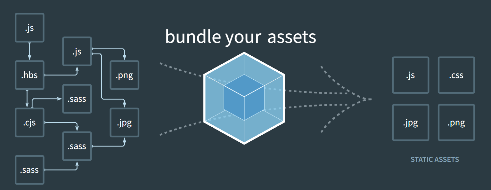

# webpack残缺知识



# 简介
webpack:核心编译工具，他对webpack所有的特点进行功能支持(代码包)
核心代码包提供一个函数导出，你需要编译的时候你就去调用这个函数，然后这个函数帮你去进行编译，将你的源代码作为参数给他
webpack-cli: webpack脚手架，脚手架会提供一些命令行命令，用来帮助我们更好的去操作webpack，eg
webpack:直接帮我们调用核心函数包的打包功能，并且读取我们工程下的所有文件作为参数传递给他
webpack打包的结果是一个立即执行函数

为什么要用webpack
通过script标签引入库时，会有以下问题

- It is not immediately apparent that the script depends on an external library.
- If a dependency is missing, or included in the wrong order, the application will not function properly.
- If a dependency is included but not used, the browser will be forced to download unnecessary code.

Let's use webpack to manage these scripts instead.

# yarn和npm注意事项
两者不要混用
npm install --->扫描当前目录下的package-lock.json(锁定了你这个工程所有的依赖以及这些依赖依赖的依赖)
yarn install --->扫描当前目录下的yarn.lock(锁定了这个工程的所有依赖具体的版本号)，依赖刚刚被装上的时候的那个版本
如果使用npm同时没有package-lock. json 系统就会去读取package.json --> 会安装最新版本的依赖，所以这个时候我们就可能安装到错误版本^5.74.0 -> 5.xx.xx （^表示该系统适配的最低版本）
如果使用的yarn，同时没有yarn.lock 系统就会去读取package. json --> 同样就可能安装到错误版本

# webpack概念
本质上，**webpack** 是一个用于现代 JavaScript 应用程序的 _静态模块打包工具_。当 webpack 处理应用程序时，它会在内部从一个或多个入口点构建一个 [依赖图(dependency graph)](https://webpack.docschina.org/concepts/dependency-graph/)，然后将你项目中所需的每一个模块组合成一个或多个 _bundles_，它们均为静态资源，用于展示你的内容。
## 入口entry
**入口起点(entry point)** 指示 webpack 应该使用哪个模块，来作为构建其内部 [依赖图(dependency graph)](https://webpack.docschina.org/concepts/dependency-graph/) 的开始。进入入口起点后，webpack 会找出有哪些模块和库是入口起点（直接和间接）依赖的。
默认值是 ./src/index.js，但你可以通过在 [webpack configuration](https://webpack.docschina.org/configuration) 中配置 entry 属性，来指定一个（或多个）不同的入口起点。例如：
**webpack.config.js**
```javascript
module.exports = {
  entry: './path/to/my/entry/file.js',
};
```
可以有多种配置方式：[https://webpack.docschina.org/concepts/entry-points/](https://webpack.docschina.org/concepts/entry-points/)
单入口项目一般就使用简单字符串
数组形式一般很少用，可以用import来实现
下面详细解释对象形式（注意runtime 和 dependOn 不应在同一个入口上同时使用，会抛出错误）
```javascript
module.exports = {
	entry: {
    main: {
      filename: "target.js", // 输出的filename
      import: "./src/index.js",// 就代表你指定的入口文件
      //如果当前webpack的工作中有过mainRuntime运行时环境，则直接重用那个运行时环境
      //如果没有这个运行时环境，创建一个当前的运行时环境名字叫做mainRuntime
      runtime: "mainRuntime",
      //配置你当前这个chunk的运行时环境每一段旅程都会生成一些资源cacheModules 已经缓存
      //过的模块bpack没加载完一个模块就会把这个模块放入到当前的chunk的缓存中去
      //以后再到这个chunk中发现同样的模块加载，则直接使用缓存（仅针对于当前chunk
      //默认情况不同chunk之间的缓存是隔离开的
    },
    //走第二趟旅程也就是第二趟chunk的时候，重新生成运行时环境
    test: {
        filename : "target.js",// 输出的filename
        import: "./src/c.js ",// 这个c.js也依赖了a.js
        runtime: "mainRuntime",// 代表和main chunk共享一个运行时环境
        // 重用的话可以进行性能优化---> 解析耗费时间 所以就代表优化了一点构建性能
    }
  }
}
```

## 出口output
**output** 属性告诉 webpack 在哪里输出它所创建的 _bundle_，以及如何命名这些文件。主要输出文件的默认值是 ./dist/main.js，其他生成文件默认放置在 ./dist 文件夹中。
你可以通过在配置中指定一个 output 字段，来配置这些处理过程：
**webpack.config.js**
```javascript
const path = require('path');

module.exports = {
  entry: './path/to/my/entry/file.js',
  output: {
    path: path.resolve(__dirname, 'dist'),
    filename: 'my-first-webpack.bundle.js',
  },
};
```
在上面的示例中，我们通过 output.filename 和 output.path 属性，来告诉 webpack bundle 的名称，以及我们想要 bundle 生成(emit)到哪里。path 模块是一个 [Node.js 核心模块](https://nodejs.org/api/modules.html)，用于操作文件路径。
**多个入口起点**
如果配置中创建出多于一个 "chunk"（例如，使用多个入口起点或使用像 CommonsChunkPlugin 这样的插件），则应该使用 [占位符(substitutions)](https://webpack.docschina.org/configuration/output#output-filename) 来确保每个文件具有唯一的名称。
```javascript
module.exports = {
  entry: {
    app: './src/app.js',
    search: './src/search.js',
  },
  output: {
    filename: '[name].[contenthash:5].js',
    path: __dirname + '/dist',
  },
};

// 写入到硬盘：./dist/app.js, ./dist/search.js
```

## loader
### 介绍
webpack 只能理解 JavaScript 和 JSON 文件，这是 webpack 开箱可用的自带能力。**loader** 让 webpack 能够去处理其他类型的文件，并将它们转换为有效 [模块](https://webpack.docschina.org/concepts/modules)，以供应用程序使用，以及被添加到依赖图中。loader 用于对模块的源代码进行转换。loader 可以使你在 import 或 "load(加载)" 模块时预处理文件。因此，loader 类似于其他构建工具中“任务(task)”，并提供了处理前端构建步骤的得力方式。loader 可以将文件从不同的语言（如 TypeScript）转换为 JavaScript 或将内联图像转换为 data URL。loader 甚至允许你直接在 JavaScript 模块中 import CSS 文件！
在更高层面，在 webpack 的配置中，**loader** 有两个属性：

1. test 属性，识别出哪些文件会被转换。
2. use 属性，定义出在进行转换时，应该使用哪个 loader。

**webpack.config.js**
```javascript
const path = require('path');

module.exports = {
  output: {
    filename: 'my-first-webpack.bundle.js',
  },
  module: {
    rules: [{ test: /\.txt$/, use: 'raw-loader' }],
  },
};
```
以上配置中，对一个单独的 module 对象定义了 rules 属性，里面包含两个必须属性：test 和 use。这告诉 webpack 编译器(compiler) 如下信息：
_“嘿，webpack 编译器，当你碰到「在 require()/import 语句中被解析为 '.txt' 的路径」时，在你对它打包之前，先 **use(使用)** raw-loader 转换一下。”_
### 配置
[module.rules](https://webpack.docschina.org/configuration/module/#modulerules) 允许你在 webpack 配置中指定多个 loader。 这种方式是展示 loader 的一种简明方式，并且有助于使代码变得简洁和易于维护。同时让你对各个 loader 有个全局概览：
loader 从右到左（或从下到上）地取值(evaluate)/执行(execute)。在下面的示例中，从 sass-loader 开始执行，然后继续执行 css-loader，最后以 style-loader 为结束。查看 [loader 功能](https://webpack.docschina.org/concepts/loaders/#loader-features) 章节，了解有关 loader 顺序的更多信息。
```javascript
module.exports = {
  module: {
    rules: [
      {
        test: /\.css$/,
        use: [
          { loader: 'style-loader' },
          {
            loader: 'css-loader',
            options: {
              modules: true,
            },
          },
          { loader: 'sass-loader' },
        ],
      },
    ],
  },
};
```


# dependences和devDependences
将dependencies的依赖放到devDependencies中，对打包没有影响，说明package. json 中的devDependencies 以及dependencies构建没有任何关系
package. json---->npm搞出来的一个东西，为了方便发包 devDependencies 和dependencies理所当然是为发包服务的配置项
构建生产环境的代码是靠什么？不是靠的npm，而是webpack
安装在dependencies中的是生产依赖，安装在devdependencies中的是开发依赖
**发包**：
1、如果你的包发出去了，别人要安装
2、npm就会看package.json里的配置devDependencies 和dependencies
3、如果你的东西是配置在devDependencies里了 npm默认你是开发时态依赖（在你开发test-react的时候用到的依赖，而不是核心代码的依赖)
4、如果你的东西是配置在dependencies里面的，npm默认你是核心依赖
5、核心依赖将会在别人使用yarn add test-react·去安装你这个包的时候顺带安装上

现在可以明晰：只要我们不发包，那这个package.json里的devDependencies和dependencies就是随便用的?
按照大多数情况下确实是这样，如果我们将所有的dependencies里的依赖全部移到devDependencies是不会对生产环境造成任何影响的
我们还需要考虑SSR 服务端渲染【服务端渲染必须要时刻关注package.json即使你不发包】，这种情况如果将dependencies里的东西移到devDependencies里去会造成性能问题
国内的前端就想出来了一些**约定的形式**:

- 生产会用的依赖比如react lodash 全部放到dependencies里去
- 在生产不会用到的依赖，比如ts webpack -->构建生产代码全部放到devDependencies里去

这样的话在ssr里也不会出错，即使你会多安装一些依赖在ssr中【ssr会用package. json在服务端装依赖】，但是也比出错要好


