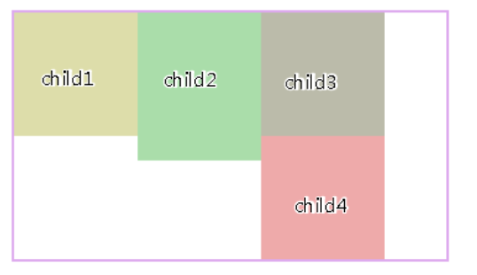
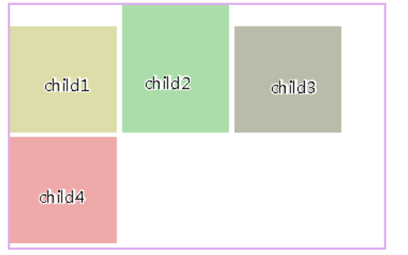
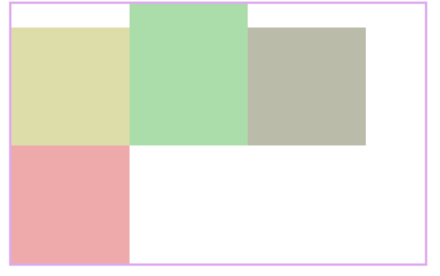

# CSS小知识

## 1、box-shadow

```css
box-shadow:[inset/指定为内阴影] 0px 0px 5px [10px] #000;
/*参数分别为x偏移量，y偏移量，模糊程度，阴影扩展长度，颜色*/
```

## 2、border-radius

```css
/*这样可以分别设置四个方向的圆角*/
/*
	两个值分别为水平或垂直半径
    第一个值是水平半径。
    如果第二个值省略，则它等于第一个值，这时这个角就是一个四分之一圆角。
    如果任意一个值为0，则这个角是矩形，不会是圆的。
    值不允许是负值。
*/
border-top-left-radius: <length> <length>;
border-top-right-radius
border-bottom-left-radius
border-bottom-right-radius
/*也可以全局设置*/
border-radius: 20px;


```

## 3、inline-block&float

### 元素种类

- inline（行内元素）:
  1. 使元素变成行内元素，拥有行内元素的特性，即可以与其他行内元素共享一行，不会独占一行. 
  2. 不能更改元素的height，width的值，大小由内容撑开. 
  3. 可以使用padding上下左右都有效，margin只有left和right产生边距效果，但是top和bottom就不行.
- block（块级元素）:
  1. 使元素变成块级元素，独占一行，在不设置自己的宽度的情况下，块级元素会默认填满父级元素的宽度. 
  2. *能够改变元素的height，width的值.* 
  3. 可以设置padding，margin的各个属性值，top，left，bottom，right都能够产生边距效果.
-  inline-block（融合行内于块级）:
  1. 结合了inline与block的一些特点，结合了上述inline的第1个特点和block的第2,3个特点.
  2. 用通俗的话讲，就是不独占一行的块级元素。

### 对比

对元素设置display：inline-block ，元素不会脱离文本流，而float就会使得元素脱离文本流，且还有父元素高度坍塌的效果

**浮动布局不太好的地方：**参差不齐的现象



**inline-block存在的小问题**：可以看到用了display:inline-block后，存在间隙问题，间隙为4像素，这个问题产生的原因是换行引起的，因为我们写标签时通常会在标签结束符后顺手打个回车，而回车会产生回车符，回车符相当于空白符，通常情况下，多个连续的空白符会合并成一个空白符，而产生“空白间隙”的真正原因就是这个让我们并不怎么注意的空白符。



去除空隙的方法：对父元素添加，{font-size:0}，即将字体大小设为0，那么那个空白符也变成0px，从而消除空隙



### 总结

display：inline-block的布局方式和浮动的布局方式，究竟使用哪个，我觉得应该根据实际情况来决定的：

对于横向排列东西来说，我更倾向与使用inline-block来布局，因为这样清晰，也不用再像浮动那样清除浮动，害怕布局混乱等等。

对于浮动布局就用于需要文字环绕的时候，毕竟这才是浮动真正的用武之地，水平排列的是就交给inline-block了。

## 4、object-fit

object-fit具体有5个值：

```css
.fill { object-fit: fill; }
.contain { object-fit: contain; }
.cover { object-fit: cover; }
.none { object-fit: none; }
.scale-down { object-fit: scale-down; }
```

每个属性值的具体含义如下：(显示的是center部分)

- fill: 中文释义“填充”。**默认值**。替换内容拉伸填满整个content box, 不保证保持原有的比例。
- contain: 中文释义“包含”。保持原有尺寸比例。保证替换内容尺寸一定可以在容器里面放得下。因此，此参数可能会在容器内留下空白。
- cover: 中文释义“覆盖”。保持原有尺寸比例。保证替换内容尺寸一定大于容器尺寸，宽度和高度至少有一个和容器一致。因此，此参数可能会让替换内容（如图片)部分区域不可见。
- none: 中文释义“无”。保持原有尺寸比例。同时保持替换内容原始尺寸大小。
- scale-down: 中文释义“降低”。就好像依次设置了none或contain, 最终呈现的是尺寸比较小的那个。


## 5、自定义滚动条样式

谷歌浏览器和microsoft

```less
.container {
  height: 100%;
  overflow: auto;
  // 滚动条整体部分
  &::-webkit-scrollbar {
    width: 6px;
    height: 6px;
  }
  // 滚动条的轨道的两端按钮，允许通过点击微调小方块的位置。
  &::-webkit-scrollbar-button {
    display: none;
  }
  // 滚动条的轨道（里面装有Thumb）
  &::-webkit-scrollbar-track {
    background: transparent;
  }
  // 滚动条的轨道（里面装有Thumb）
  &::-webkit-scrollbar-track-piece {
    background-color: transparent;
  }
  // 滚动条里面的小方块，能向上向下移动（或往左往右移动，取决于是垂直滚动条还是水平滚动条）
  &::-webkit-scrollbar-thumb {
    background: rgba(144, 147, 153, 0.3);
    cursor: pointer;
    border-radius: 4px;
  }
  // 边角，即两个滚动条的交汇处
  &::-webkit-scrollbar-corner {
    display: none;
  }
  // 两个滚动条的交汇处上用于通过拖动调整元素大小的小控件
  &::-webkit-resizer {
    display: none;
  }
}
```

但是打开Firefox浏览器后发现滚动条样式并没有生效，火狐提供了自己的`CSS`样式属性去设置滚动条的样式，比起谷歌可操作空间非常小，加上适配火狐的代码如下：

```less
.container {
  height: 100%;
  overflow: auto;
  scrollbar-color: rgba(144, 147, 153, 0.3) transparent; /* 滑块颜色  滚动条背景颜色 */
  scrollbar-width: thin; /* 滚动条宽度有三种：thin、auto、none */
  // 滚动条整体部分
  &::-webkit-scrollbar {
    width: 6px;
    height: 6px;
  }
  // 滚动条的轨道的两端按钮，允许通过点击微调小方块的位置。
  &::-webkit-scrollbar-button {
    display: none;
  }
  // 滚动条的轨道（里面装有Thumb）
  &::-webkit-scrollbar-track {
    background: transparent;
  }
  // 滚动条的轨道（里面装有Thumb）
  &::-webkit-scrollbar-track-piece {
    background-color: transparent;
  }
  // 滚动条里面的小方块，能向上向下移动（或往左往右移动，取决于是垂直滚动条还是水平滚动条）
  &::-webkit-scrollbar-thumb {
    background: rgba(144, 147, 153, 0.3);
    cursor: pointer;
    border-radius: 4px;
  }
  // 边角，即两个滚动条的交汇处
  &::-webkit-scrollbar-corner {
    display: none;
  }
  // 两个滚动条的交汇处上用于通过拖动调整元素大小的小控件
  &::-webkit-resizer {
    display: none;
  }
}
```

