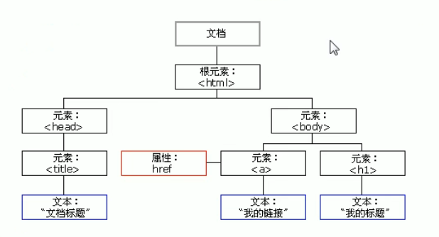
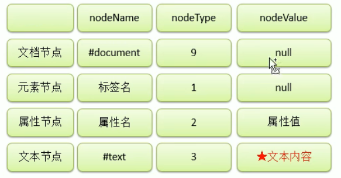

# js基础知识

JavaScript（简称“JS”） 是一种具有函数优先的轻量级，解释型或即时编译型的[编程语言](https://baike.baidu.com/item/编程语言/9845131)。虽然它是作为开发[Web](https://baike.baidu.com/item/Web/150564)页面的[脚本语言](https://baike.baidu.com/item/脚本语言/1379708)而出名，但是它也被用到了很多非[浏览器](https://baike.baidu.com/item/浏览器/213911)环境中，JavaScript 基于原型编程、多范式的动态脚本语言，并且支持[面向对象](https://baike.baidu.com/item/面向对象/2262089)、命令式、声明式、[函数](https://baike.baidu.com/item/函数/301912)式编程范式。

## 1、this

解析器在调用函数每次都会向函数内部传递进一个隐含的参数，这个隐含的参数就是this;

 this指向的是一个对象，这个对象我们称为函数执行的上下文对象，

根据函数的调用方式的不同，this会指向不同的对象

1.以函数的形式调用时，this永远都是window

2.以方法的形式调用时，this就是调用方法的那个对象

3.当以构造函数的形式调用时，this就是新创建的那个对象

## 2、构造函数

### 定义

构造函数就是一个普通的函数，创建方式和普通函数没有区别，不同的是构造函数习惯上**首字母大写**

构造函数和普通函数的区别就是调用方式的不同

普通函数是直接调用，而构造函数需要使用**new关键字来调用**

### 执行流程

构造函数的执行流程:

1. 立刻创建一个新的对象
2. 将新建的对象设置为函数中this,在构造函数中可以使用this来引用新建的对象
3. 逐行执行函数中的代码
4. 将新建的对象作为返回值返回

### 作用

构造函数可以专门用来创建一类对象

使用同一个构造函数创建的对象，我们称为一类对象，也将一个构造函数称为一个类。

我们将通过一个构造函数创建的对象，称为是该类的实例

### 使用

```javascript
function Person(name, age, gender){
    this.name = name;
    this.age = age;
    this.gender = gender;
    // 这样会浪费资源，重复创造方法对象,使用原型解决
    this.sayName = function(){
        alert(this.name);
    };
}
var per = new Person(xxx, xx, xx);
```

## 3、原型

- 我们所创建的每一个函数，解析器都会向函数中添加一个属性prototype，这个属性对应着一个对象，这个对象就是我们所谓的原型对象；如果函数作为普通函数调用prototype没有任何作用

- 当函数以构造函数的形式调用时，它所创建的对象中都会有一个隐含的属性，指向该构造函数的原型对象，我们可以通过 `__proto__`来访间该属性

- 原型对象就相当于一个公共的区域，所有同一个类的实例都可以访问到这个原型对象，我们可以将对象中共有的内容，统一设置到原型对象中
- 当我们访问对象的一个属性或方法时，它会先在对象自身中寻找，如果有则直接使用，如果没有则会去原型对象中寻找，如果找到则直接使用
- 以后我们创建构造函数时，可以将这些对象共有的属性和方法，统一添加到构造函数的原型对象中，
  这样不用分别为每一个对象添加，也不会影响到全局作用域，就可以使每个对象都具有这些属性和方法了

```js
function Myclass(){
}
var mc = new Myclass();
console.log(Myclass.prototype);
//输出结果为对象
console.log(mc._proto__ == Myclass.prototype);
//输出结果为true

// 设置原型属性
Person.prototype.name = "ddd";
//向原型中添加sayName方法
Person.prototype.sayName = function(){
	alert( "He1lo大家好，我是:" + this.name );
};

// 使用in检查对象中是否含有某个属性时，如果对象中没有但是原型中有，也会返回true
console.log("name" in mc);
// 可以使用对象的hasOwnProperty()来检查对象自身中是否含有该属性
console.log(mc.hasOwnProperty("age"));
```

## 4、原型链

原型对象也是对象，所以它也有原型，当我们使用一个对象的属性或方法时，

- 会现在自身中寻找自身中如果有，则直接使用，

- 如果没有则去原型对象中寻找，如果原型对象中与，则使用，
- 如果没有则去原型的原型中寻找，直到找到**Object对象**的原型，
- **0bject对象的原型没有原型**，如果在object中依然没有找到，则返回undefined

```js
console.log(mc.__proto__.hasOwnProperty("hasOwnProperty"));
console.log(mc.__proto__.__proto__.hasOwnProperty( "hasOwnProperty")
console.log(mc.__proto__.__proto__.__proto__);
```

## 5、垃圾回收

当一个对象没有任何的变量或属性对它进行引用，此时我们将永远无法操作该对象，此时这种对象就是一个垃圾，这种对象过多会占用大量的内存空间，导致程序运行变慢，所以这种垃圾必须进行清理。

在JS中拥有自动的垃圾回收机制，会自动将这些垃圾对象从内存中销毁，我们不需要也不能进行垃圾回收的操作

我们需要做的只是要将不再使用的对象引用设置null即可

## 6、函数方法call&apply

call()和apply()

- 这两个方法都是函数对象的方法，需要通过函数对象来调用
- 当对函数调用call()和apply()都会调用函数执行
- 在调用cal1()和apply()可以将一个对象指定为第一个参数，此时这个对象将会成为函数执行时的this

- call()方法可以将实参在对象之后依次传递
- apply()方法需要将实参封装到一个数组中统─传递

```js
fun.call(obj, 2, 3);
fun.apply(obj, [2,3]);
// 传入的obj是什么，fun中的this就指向哪个对象
```

## 7、arguments

在调用函数时，浏览器每次都会传递进两个隐含的参数:

1.函数的上下文对象this

2.封装实参的对象arguments

- arguments是一个**类数组对象**,它也可以通过索引来操作数据，也可以获取长度
- 在调用函数时，我们所传递的实参都会在arguments中保存
- arguments. length可以用来获取实参的长度
- 它里边有一个属性叫做callee,
  这个属性对应一个函数对象，就是当前正在指向的函数的对象

```js
function fun(){
    console.log(arguments instanceof Array); // false
    console.log(Array.isArray(arguments));  // false
    console.log(arguments[1]);  
    console.log(arguments.length);
	console.log(arguments.callee == fun);  // true
}

```

## 8、正则表达式

语法:

var变量= new RegExp("正则表达式", "匹配模式");

使用typeof检查正则对象，会返回object

var reg = new RegExp("a");这个正则表达式可以来检查一个字符串中是否含有a

在构造函数中可以传递一个匹配模式作为第二个参数，

可以是：i 忽略大小写       g 全局匹配模式(匹配所有项，不只是第一个)

```js
var reg = new RegExp("a", 'i');
reg.test(string);   // 结果为boolean

// 字面量创建
var reg = /a/i;  // object
```

```js
// | 或
var reg = /a|b/;

// [] 或
var reg = /[abcd]/;
var reg = /[a-z]/;

// [^] 除了
var reg = /[^ab]/; //不含ab

// 量词
// {n}连续出现次数，只对前面一个字符生效
// {m, n} 连续出现m到n次
// {m, } 连续出现m次以上
// + 至少一次，相当于{1, }
// * 0个或者多个，{0, }
// ? 0或者1, {0, 1}
var reg = /ab{3}/;  // abbb
reg = /(ab){3}/; //ababab

// ^ 开头
reg = /^a/; // a开头
// $ 结尾
reg = /a$/; // a结尾
// 如果同时使用，必须完全匹配，如^aaa$

// . 表示任意字符
/*
	\\ \ 转义字符
	\. .
    \w -任意字母、数字、_  [A-z0-9_]
    \W -除了字母、数字、_ [^A-z0-9_]
    \d -任意的数字 [0-9]
    \D -除了数字[^0-9]
    \s -空格
    \S -除了空格
    \b 单词边界  \bchild\b  只能是单词child
    \B 除了单词边界
*/

// 手机号
reg = /^1[3-9][0-9]{9}$/;
// 开头空格
reg = /^\s*/;
// 结尾
reg = /\s*$/;
// 开头或结尾，注意g
reg = /^\s*|\s*$/g
```

## 9、DOM

### DOM概念

DOM，全称Document Object Model文档对象模型。

JS中通过DOM来对HTML文档进行操作。只要理解了DOM就可以随心所欲的操作WEB页面。

- 文档
  - -文档表示的就是整个的HTML网页文档

- 对象
  - -对象表示将网页中的每一个部分都转换为了一个对象。

- 模型
  - -使用模型来表示对象之间的关系，这样方便我们获取对象
  - 成树状，模型树



### 节点

#### 概念

节点Node，是构成我们网页的最基本的组成部分，网页中的每一个部分都可以称为是一个节点。

比如: html标签、属性、文本、注释、整个文档等都是一个节点。

虽然都是节点，但是实际上他们的具体类型是不同的。

比如︰标签我们称为元素节点、属性称为属性节点、文本称为文本节点、文档称为文档节点。

节点的类型不同，属性和方法也都不尽相同。

#### 类型

常用节点分为四类

- 文档节点:整个HTML文档
- 元素节点:HTML文档中的HTML标签
- 属性节点∶元素的属性
- 文本节点:HTML标签中的文本内容



#### 常用节点

```js
/*在document中有一个属性body，它保存的是body的引用*/
var body = document.body;
/*document.documentElement保存的是html根标签*/
var html = document.documentElement;
```

#### 节点获取

##### 获取元素节点

通过document对象调用

getElementById()					-通过id属性获取一个元素节点对象

getElementsByTagName()	-通过标签名获取一组元素节点对象

getElementsByName()			-通过name属性获取一组元素节点对象

getElementsByClassName()	-通过class属性获取一组元素节点对象，ie8以上才支持

##### 获取节点子节点

通过具体的元素节点调用

getElementsByTagName()	-方法，返回当前节点的指定标签名后代节点

childNodes	-属性，表示当前节点的所有子节点，包含空白文本节点

children        -属性，展示当前节点的所有子节点，只含标签

firstChild	-属性，表示当前节点的第一个子节点，包含空白文本节点

firstElementChild	-属性，表示当前节点的第一个子节点，不包含空白文本节点

lastChild	-属性，表示当前节点的最后一个子节点

##### 获取节点父节点和兄弟节点

通过具体的节点调用

parentNode	-属性，表示当前节点的父节点

previousSibling 	-属性，表示当前节点的前一个兄弟节点，会有空白文本

previousElementSibling 	-属性，表示当前节点的前一个兄弟元素节点

nextSibling	-属性，表示当前节点的后一个兄弟节点

#### 根据选择器获取节点

```js
/*
document.querySelector()
需要一个选择器的字符串作为参数，可以根据一个CSS选择器来查询一个元素节点对象
虽然IE8中没有getElementsByClassName()但是可以使用querySelector()代替
使用该方法总会返回唯一的一个元素，如果满足条件的元素有多个，那么它只会返回第一个
*/
var div = document.querySelector(".box1 div");
var box1 = document.querySelector(".box1");

// 返回多个需要使用querySelectorAll
// 即使只有一个符合条件，也会返回一个数组
var box1 = document.querySelector("div");
```

### 事件

#### 概念

事件，就是文档或浏览器窗口中发生的一些特定的交互瞬间。

JavaScript 与HTML之间的交互是通过事件实现的。

对于Web应用来说，有下面这些代表性的事件:点击某个元素、将鼠标移动至某个元素上方、按下键盘上某个键，等等。

#### 未加载问题

浏览器在加载一个页面时，是按照自上向下的顺序加载的，读取到一行就运行一行,如果将script标签写到页面的上边，在代码执行时，页面还没有加载，页面没有加载，DOM对象也没有加载，会导致无法获取到DOM对象。

```js
/*
    onload事件会在整个页面加载完成之后才触发
    为window绑定一个onload事件
    该事件对应的响应函数将会在页面加载完成之后执行，
    这样可以确保我们的代码执行时所有的DOM对象已经加载完毕了
*/
window.onload = function() {
    //获取id为btn的按钮
    var btn = document.getE1ementById( "btn" ); //为按钮绑定一个单击响应函数
    btn.onclick = function(){
        alert( "hello");
    };
};

```

#### 滚动条事件

```js
//获取id为info的p元素
var info = document.getElementByTd("info");
info.onscroll = function() {
    //检查垂直滚动条是否滚动到底
    if(info.scrollHeight - info.scrollTop == info.clientHeight){
        xxxxxx
    }
};

```

#### 鼠标移动事件

```js
/*
当事件的响应函数被触发时，浏览器每次都会将一个事件对象作为实参传递进响应函数，
在事件对象中封装了当前事件相关的一切信息，比如:鼠标的坐标键盘哪个按键被按下鼠标滚轮滚动的方向。
*/
areaDiv.onmousemove = function(event){
    /*
        在IE8中,响应函数被触发时,浏览器不会传递事件对象，
        在IE8及以下的浏览器中，是将事件对象作为window对象的属性保存的
    */
    event = event || window.event;
    /*
        clientX可以获取鼠标指针的窗口水平坐标
        cilentY可以获取鼠标指针的窗口垂直坐标
        pageX可以获取鼠标指针的页面水平坐标 IE8不支持
        pageY可以获取鼠标指针的页面垂直坐标
    */
        var x = event.clientX;
        var y = event.clientY;
        alert( "x="+x + ” , y = "+y );
}
// document.documentElement.scrollTop;
// document.documentElement.scrollLeft;
// 浏览器的滚动条属于html，可以根据这个获取滚动条滚动位置
```

#### 事件冒泡

div里面包含span，这样触发span事件时，div和body的点击事件都会被相继触发

```js
/*
*事件的冒泡（Bubble）
*所谓的冒泡指的就是事件的向上传导，当后代元素上的事件被触发时，其祖先元素的相同事件也会被触发
*冒泡大部分情况下是有用的，也可以使用事件对象取消冒泡
*/
//为s1绑定一个单击响应函数
var s1 = document.getElementById ("s1");
s1.onclick = function(event){
    event = event || window.event;
    // 这样就可以取消冒泡
    event.cancelBubble = true;
    alert("我是span的单击响应函数"");
};
//为box1绑定一个单击响应函数
var box1 = document.getElementById( "box1");
box1.onclick = function( ){
    alert("我是div的单击响应函数");
};
//为body绑定一个单击响应函数
document.body.onclick = function( ){
    alert("我是body的单击响应函数");
};
```

#### 事件委派

```js
/*
    我们希望，只绑定一次事件，即可应用到多个的元素上，即使元素是后添加的
    我们可以尝试将其绑定给元素的共同的祖先元素
    
    事件的委派
    指将事件统一绑定给元素的共同的祖先元素，这样当后代元素上的事件触发时，会一直冒泡到祖先元素
    从而通过祖先元素的响应函数来处理事件。
    事件委派是利用了冒泡，通过委派可以减少事件绑定的次数，提高程序的性能
*/
// 为ul绑定一个单击响应函数，并使用target进行判断，就可以使用冒泡间接为所有ul下的li绑定此事件
u1.onclick = function(event){
    event = event || window.event;
    /*
        target
        event中的target表示的触发事件的对象
    */
    //如果触发事件的对象是我们期望的元素，则执行否则不执行
    if(event.target.className = "xxx"){
        xxxx
    }
}

```

#### 事件绑定

##### 绑定方式一

```js
使用对象.事件 = 函数的形式绑定响应函数,
它只能同时为一个元素的一个事件绑定一个响应函数,不能绑定多个，
如果绑定了多个，则后边会覆盖掉前边的
```

##### 绑定方式二，addEventListener

IE8以上才支持

```js
/*
	addEventListener()  –通过这个方法也可以为元素绑定响应函数
	-参数,
        1.事件的字符串，不要on
        2.回调函数，当事件触发时该函数会被调用
        3.是否在捕获阶段触发事件，需要一个布尔值，一般都传false
	使用addEventListener()可以同时为一个元素的相同事祥同时绑定多个响应函数，
	这样当事件被触发时，响应函数将会按照函数的绑定顺序执行
*/
btn01.addEventListener( "click" ,function(){
    alert(1);
},false);
btn01.addEventListener( "click" ,function(){
    alert(2);
},false);

```

##### 绑定方式三，IE8-attachEvent

```js
/*
    attachEvent() –在IE8中可以使用attachEvent()来绑定事件
    -参数,
        1.事件的字符串，要on
        2.回调函数
    -这个方法也可以同时为一个事件绑定多个处理函数，
    不同的是它是后绑定先执行，执行顺序和addEventListener()相反
*/
btn01.attachEvent("onclick" ,function(){
    alert(1);
});
btn01.attachEvent("onclick" ,function(){
    alert(2);
});

```

##### 自定义绑定函数-bind

```js
//定义一个函数，用来为指定元素绑定响应函数
/*
addEventListener()中的this，是绑定事件的对象
attachEvent()中的this，是window
需要统一两个方法this
参数:
    obj要绑定事件的对象
    eventStr事件的字符串
    callback回调函数
*/
function bind(obj, eventstr, callback) {
	if(obj.addEventListener) {
        //大部分浏览器兼容的方式
        obj.addEventListener(eventStr, callback, false);
    } else {
        /*
            this是谁由调用方式决定
            callback.call(obj)
        */
        //IE8及以下
        obj.attachEvent("on" + eventStr , function(){
            //在匿名函数中调用回调函数,就可以使this统一指向obj
            callback.call(obj);
        });
    }
}

// 使用
bind(btn01, "click", function(){
    // this就指向btn01了
    alert(this);
});

```

#### 事件传播

-关于事件的传播网景公司和微软公司有不同的理解

-微软公司认为事件应该是由内向外传播，也就是当事件触发时，应该先触发当前元素上的事件，然后再向当前元素的祖先元素上传播,也就说事件应该在冒泡阶段执行。

-网景公司认为事件应该是由外向内传播的，也就是当前事件触发时，应该先触发当前元素的最外层的祖先元素的事件.然后在向内传播给后代元素

W3C综合了两个公司的方案，将事件传播分成了三个阶段

- 1.捕获阶段
  -在捕获阶段时从最外层的祖先元素，向目标元素进行事件的捕获，但是默认此时不会触发事件
- 2.目标阶段
  -事件捕获到目标元素,捕获结束开始在目标元素上触发事件
- 3.冒泡阶段
  -事件从目标元素向他的祖先元素传递，依次触发祖先元素上的事件

-如果希望在捕获阶段就触发事件，可以将addEventListener()的第三个参数设置为true
一般情况下我们不会希望在捕获阶段触发事件，所以这个参数一般都是false

IE8以下的浏览器没有事件捕获阶段

### 操作DOM

```js
/*
document .createElement( )
可以用于创建一个元素节点对象，
它需要一个标签名作为参数，将会根据该标签名创建元素节点对象
并将创建好的对象作为返回值返回
*/
var li = document.createElement("li");

/*
document.createTextNode()
可以用来创建一个文本节点对象
需要一个文本内容作为参数，将会根据该内容创建文本节点，并将新的节点返回
*/
var gzText = document.createTextNode("广州");
// 这个可以直接使用innerHTML进行设置

/*
appendChild( )
向一个父节点中添加一个新的子节点
用法:父节点.appendchild(子节点)
*/
li.appendChild(gzText);

/*
insertBefore( )
可以在指定的子节点前插入新的子节点
父节点.insertBefore(新节点, 参考节点);
*/
city.insertBefore(li , bj);

/*
replaceChild()
可以使用指定的子节点替换已有的子节点
父节点.replaceChild(新节点,旧节点);
*/
city.replaceChild(li , bj);


/*
removeChild( )
可以删除一个子节点
父节点.removeChild(子节点);
常用法：子节点.parentNode.removeChild(子节点);
*/
city.removechild(bj);
bj.parentNode.removeChild(bj); // 自杀


/*
使用innerHTML也可以完成DOM的增删改的相关操作
一般不建议这么使用，他的影响范围是整个父子节点
*/
city.innerHTML += "<li>广州</li>";
```

### 操作样式

通过JS修改元素的样式:

语法:元素.style.样式名 = 样式值（这样操作的都是内联样式）

注意:如果CSS的样式名中含有-，这种名称在JS中是不合法的比如background-color需要将这种样式名修改为驼峰命名法，

我们通过style属性设置的样式都是内联样式，而内联样式有较高的优先级,所以通过JS修改的样式往往会立即显示

**注意**：通过style修改样式，每使用一次，就会重新渲染一次页面，性能差

**解决方法**：一般通过在css中设置备用样式，然后通过修改元素的class，来直接修改多个样式，这样浏览器只需要重新渲染一次页面，性能较好

```js
var box1 = document.getElementById("#box1");
box1.style.width = "300px";
box1.style.height = "300px";
box1.style.backgroundColor = "yellow";

function addClass(obj, classname) {
    // 先判断有没有该类,\b单词边界
    var reg = new RegExp("\\b" + classname + "\\b");
    if(!reg.test(obj.className)){
        // 加空格，可以实现样式覆盖和重用，不会直接替换
        obj.calssName += " " + classname   
    }
}

function removeClass(obj, classname) {
    // 先判断有没有该类,\b单词边界
    var reg = new RegExp("\\b" + classname + "\\b");
    obj.className = obj.className.replace(reg, "");
}

// 切换，有就删除，没有就添加
function toggleClass(obj, classname) {
    // 先判断有没有该类,\b单词边界
    var reg = new RegExp("\\b" + classname + "\\b");
    if(!reg.test(obj.className)){
        obj.className = obj.className.replace(reg, "");  
    } else {
        obj.calssName += " " + classname;
    }
}
```

```js
// 一下都是只读，不能修改样式
/*
    获取元素的当前显示的样式
    语法,元素.currentStyle.样式名*它可以用来读取当前元素正在显示的样式
    如果当前元素没有设置该样式，则获取它的默认值
    currentstyle只有IE浏览器支持，其他的浏览器都不支持
*/
alert(box1.currentStyle.width);
alert(box1.currentstyle.backgroundColor);

/*
    在其他浏览器中可以使用牢
    getComputedStyle()这个方法来获取元素当前的样式
    这个方法是window的方法，可以直接使用
    需要两个参数
    第一个,要获取样式的元素
    第二个,可以传递一个伪元素，一般都传null
    如果获取的样式没有设置，则会获取到真实的值，而不是默认值
    比如:没有设置width，它不会获取到auto，而是一个长度
    ie8以上才支持
*/
var obj = getComputedStyle(box1, null);
alert(obj.width);

// 通用
function getstyle(obj , name){
    if(window.getComputedStyle){
        //正常浏览器的方式，具有getComputedStyle()方法
        return getComputedStyle(obj, null)[name];
    }else{
    	//IE8的方式，没有getComputedStyle()方法
        return obj.currentstyle[name];
    }
    //可以直接用一个三元表达式
}
```

## 10、BOM

**浏览器对象模型**，BOM可以使我们通过JS来操作浏览器，在BOM中为我们提供了一组对象，用来完成对浏览器的操作

Window
-代表的是整个浏览器的窗口，同时window也是网页中的全局对象

Navigator
-代表的当前浏览器的信息，通过该对象可以来识别不同的浏览器

Location
-代表当前浏览器的地址栏信息，通过Location可以获取地址栏信息，或者操作浏览器跳转页面

History
-代表浏览器的历史记录，可以通过该对象来操作浏览器的历史记录
由于隐私原因，该对象不能获取到具体的历史记录，只能操作浏览器向前或向后翻页而且该操作只在当次访问时有效

Screen
-代表用户的屏幕的信息，通过该对象可以获取到用户的显示器的相关的信息

这些BOM对象在浏览器中都是作为window对象的属性保存的，
可以通过window对象来使用，也可以直接使用，**window调用为大写，直接使用时为小写**

## 11、定时器

### 定时调用setInterval

```js
/*
setInterval()
-定时调用
-可以将一个函数，每隔一段时间执行一次
-参数;
    1.回调函数，该函数会每隔一段时间被调用一次
    2.每次调用间隔的时间，单位是毫秒
-返回值:
    返回一个Number类型的数据
    这个数字用来作为定时器的唯一标识
*/
var num = 1;
var timer = setInterval(function() {
    count.innerHTML = num++;
    if(num == 11){
        // 关闭定时器
        clearInterval(timer);
    }
}, 300);
```

### 延时调用setTimeout

```js
/*
*延时调用，
*延时调用一个函数不马上执行，而是隔一段时间以后在执行，只会执行一次
*延时调用和定时调用的区别，定时调用会执行多次，而延时调用只会执行一次
*/
var timer = setTimeout(function(){
    console.log(num++);
},3000);
//使用clearTimeout()来关闭一个延时调用
clearTimeout(timer);
```

