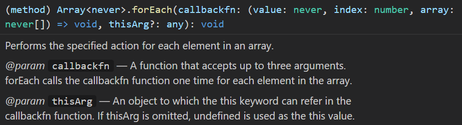
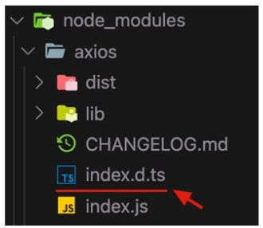
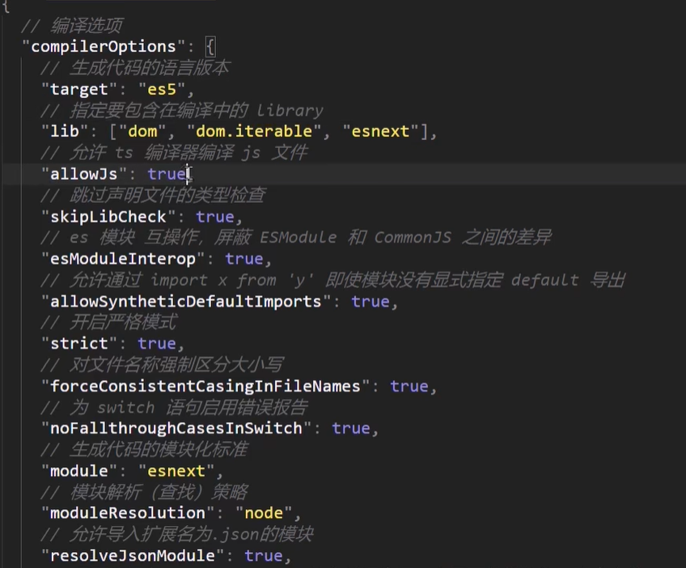
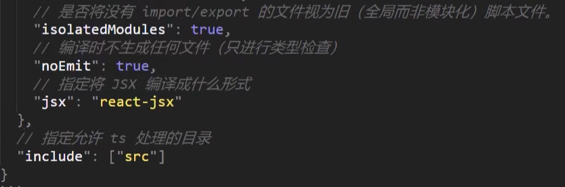

# TypeScript入门

## ts介绍

### ts是什么

- TypeScript（简称:TS）是JavaScript的超集(JS有的TS都有)。
- TypeScript = Type + JavaScript(在JS基础之上，为JS添加了类型支持)。
- TypeScript是微软开发的开源编程语言，可以在任何运行JavaScript的地方运行。

### ts为什么要加类型支持

> 问题

背景:JS的类型系统存在“先天缺陷”，JS代码中绝大部分错误都是类型错误（UncaughtTypeError)。

问题:增加了找Bug、改Bug的时间，严重影响开发效率。

> 区别

从编程语言的动静来区分，TypeScript属于静态类型的编程语言，JS属于动态类型的编程语言。

静态类型:编译期做类型检查;动态类型:执行期做类型检查。

代码编译和代码执行的顺序:1编译 2执行。

> 优点

对于JS来说:需要等到代码真正去执行的时候才能发现错误（晚）。

对于TS来说:在代码编译的时候（代码执行前）就可以发现错误（早）。

并且，配合VSCode等开发工具，TS可以提前到在编写代码的同时就发现代码中的错误，减少找Bug、改Bug 时间。


### ts优势

1. 更早（写代码的同时）发现错误，减少找Bug、改Bug时间，提升开发效率。
2. 程序中任何位置的代码都有代码提示，随时随地的安全感，增强了开发体验。
3. 强大的类型系统提升了代码的可维护性，使得重构代码更加容易。
4. 支持最新的ECMAScript语法，优先体验最新的语法，让你走在前端技术的最前沿。
5. TS类型推断机制，不需要在代码中的每个地方都显示标注类型，让你在享受优势的同时，尽量降低了成本。
6. 除此之外，Vue3源码使用TS重写、Angular默认支持TS、React与TS完美配合，TypeScript已成为大中型前端项目的首先编程语言。


## ts入门使用

### ts环境安装

问题:为什么要安装编译TS的工具包?

回答: Node.js/浏览器，只认识JS代码，不认识TS代码。需要先将TS代码转化为JS代码，然后才能运行。

安装命令: `npm i -g typescript`。

typescript包:用来编译TS代码的包，提供了tsc命令，实现了TS->JS的转化。

验证是否安装成功: `tsc -v` (查看typescript 的版本）。


### 使用

编写`ts`文件

```ts
let age: number = 10
console.log(age)
```

编译转换`tsc xx.ts`，得到js文件

运行js文件，`node xx.js`

```js
var age = 10;
console.log(age);
```


### 简化运行

简化方式:使用ts-node包，直接在Node.js 中执行TS代码。

安装命令:`npm i -g ts-node` ( ts-node包提供了ts-node命令)。

使用方式: `ts-node xxx.ts`。

解释:ts-node命令在内部偷偷的将TS->Js，然后，再运行JS代码。


## ts类型

### 类型注解

```typescript
let a: number = 1
```

说明:代码中的`: number`就是类型注解。

作用:为变量添加类型约束。比如，上述代码中， 约定变量age的类型为number ( 数值类型)。

解释:约定了什么类型，就只能给变量赋值该类型的值，否则，就会报错。


### 常用类型

可以将TS中的常用基础类型细分为两类: JS 已有类型 和 TS新增类型。
1. JS已有类型
    原始类型: number/string/boolean/null/ undefined/symbol。
    对象类型: object (包括,数组、对象、函数等对象)。

1. TS新增类型
    联合类型、自定义类型(类型别名)、接口、元组、字面量类型、枚举、void. any等。

> 原始类型

```ts
let a: number = 1
let b: string = 'a'
let c: boolean = false
let d: null = null
let e: undefined = undefined
let f: symbol = Symbol()
```


> 对象类型

**数组**

数组类型的两种写法: ( 推荐使用number[]写法)

```ts
let numbers: number[] = [1, 3, 5]
let strings: Array<string> = ['a', 'b']
```

联合类型

```ts
let arr: (number | string)[] = [1, 'a', 3, 'b']
// 注意与下面区分
let arr: number | string[] = 1  // 或者['1', '2']
```


**函数类型**

```ts
// 有返回值
function add(num1: number, num2: number): number {
  return num1 + num2
}
const add2 = (num1: number, num2: number): number => {
  return num1 + num2
}

// 没有返回值
function printName(name: string): void {
  console.log(name)
}

// 可选参数
function mySlice(start?: number, end?: number): void {
  console.log(start, end)
}
// 注意，可选参数只能放在参数列表的后面
```


**对象类型**

```ts
let person: { name: string; age: number; sayHi(): void } = {
  name: 'ls',
  age: 1,
  sayHi() { }
}

// 可选属性 ?:
function myAxios(config: { url: string; method?: string }) {
  console.log(config)
}
```

- 直接使用{}来描述对象结构。属性采用属性名:类型的形式;方法采用方法名():返回值类型的形式。
- 如果方法有参数，就在方法名后面的小括号中指定参数类型(比如: `greet(name: string): void`)。
- 在一行代码中指定对象的多个属性类型时,使用; (分号)来分隔。
- 如果一行代码只指定一一个属性类型( 通过换行来分隔多个属性类型)，可以去掉; (分号)。
- 方法的类型也可以使用箭头函数形式(比如: `{sayHi:()=> void}`)。


> **接口**

当一个对象类型被多次使用时，一般会使用接口(interface)来描述对象的类型，达到复用的目的。

```ts
interface IPerson {
  name: string
  age: number
  sayHi(): void
}

let person: IPerson = {
  name: 'ls',
  age: 1,
  sayHi() { }
}

// 接口继承 extends
interface Point2D { x: number; y: number }
interface Point3D extends Point2D { z: number }
let p3: Point3D = {
  x: 1,
  y: 2,
  z: 3
}
```

- 使用interface关键字来声明接口。
- 接口名称(比如，此处的IPerson)，可以是任意合法的变量名称。
- 声明接口后，直接使用接口名称作为变量的类型。
- 因为每一行只有一个属性类型，因此，属性类型后没有; (分号)。


> **元组**

元组类型是另一种类型的数组,它确切地知道包含多少个元素，以及特定索引对应的类型。

```ts
let position: [number, number] = [39, 111]
```


### 类型别名

类型别名(自定义类型) :为任意类型起别名。

使用场景:当同一类型(复杂)被多次使用时，可以通过类型别名，简化该类型的使用。

```ts
type CustomArray = (number | string)[]
let arr1: CustomArray = [1, 'a', 2, 3]
```

接口和类型别名比较：

相同点：都可以给对象指定类型。

不同点：接口，只能为对象指定类型。类型别名，不仅可以为对象指定类型，实际上可以为任意类型指定别名。


### 类型推论

- 在TS中，某些没有明确指出类型的地方,TS的类型推论机制会帮助提供类型。
- 换句话说:由于类型推论的存在，这些地方，类型注解可以省略不写!
- 发生类型推论的2种常见场景: 1声明变量并初始化时  2决定函数返回值时。
- 能省略类型注解的地方就省略(充分利用TS类型推论的能力，提升开发效率)。

```ts
let ddd = 19
const add2 = (num1: number, num2: number) => {
  return num1 + num2
}
```


### 类型断言

用来指定一个更加准确的类型

注意: getElementByld方法返回值的类型是HTMLElement，该类型只包含所有标签公共的属性或方法，不包含a标签特有的href 等属性。因此，这个类型太宽泛（不具体)，无法操作href等a标签特有的属性或方法。

```ts
const alink = document.getElementById('link') as HTMLAnchorElement
// 另一种语法，不推荐
const alink = <HTMLAnchorElement>document.getElementById('link')
```

解释:

1．使用as关键字实现类型断言。

2．关键字as 后面的类型是一个更加具体的类型（HTMLAnchorElement是HTMLElement的子类型）。

3．通过类型断言，aLink的类型变得更加具体，这样就可以访问a标签特有的属性或方法了。


### 字面量类型

```ts
const str = "Hello TS"
// str的类型是 'Hello TS'
```

注意:此处的'Hello TS'，就是一个字面量类型。也就是说某个特定的字符串也可以作为TS中的类型

除字符串外，任意的JS字面量（比如，对象、数字等）都可以作为类型使用。

```ts
// 字面量类型配合联合类型一起使用。
// 使用场景:用来表示一组明确的可选值列表。
function changeDirection(direction: 'up' | 'down' | 'left' | 'right') {
  console.log(direction)
}
```


### 枚举类型

定义一组命名常量

```ts
enum Direction { UP, DOWN, LEFT, RIGHT }
function changeDirection(direction: Direction) {
  console.log(direction)
}
changeDirection(Direction.UP)
```

- 使用enum 关键字定义枚举。
- 约定枚举名称、枚举中的值以大写字母开头。
- 枚举中的多个值之间通过，(逗号）分隔。
- 定义好枚举后，直接使用枚举名称作为类型注解。

> 枚举的值-数字

枚举成员的值默认是从0开始的自增数值

可以自定义值，没有设置的就自动递增

```ts
enum Direction { UP = 10, DOWN = 12, LEFT, RIGHT }
```

> 枚举的值-字符串

枚举为字符串时，没有默认值，必须为每个成员都指定值

```ts
enum Direction {
    Up = 'UP',
	Down = 'DOWN',
	Left = 'LEFT',
	Right = 'RIGHT'
}
```


### any类型

当值的类型为any时，可以对该值进行任意操作，并且不会有代码提示。

```ts
let obj: any = { x:0 }
obj.bar = 100
obj()
const n: number = obj
```

解释:以上操作都不会有任何类型错误提示，即使可能存在错误!

尽可能的避免使用any类型，除非临时使用any来“避免”书写很长、很复杂的类型!

其他隐式具有any类型的情况:1声明变量不提供类型也不提供默认值  ⒉函数参数不加类型。


### typeof

TS也提供了typeof操作符：可以在**类型上下文**中引用变量或属性的类型（类型查询)。

使用场景:根据已有变量的值，获取该值的类型，来简化类型书写。

```ts
let p = { x: 1, y: 2}
function formatPoint(point: typeof p) {}
let a: typeof p.x
```

使用typeof 操作符来获取变量p的类型，结果与第一种（对象字面量形式的类型）相同。

typeof出现在类型注解的位置（参数名称的冒号后面）所处的环境就在类型上下文（区别于JS代码）。

注意: typeof 只能用来查询**变量或属性的类型**，无法查询其他形式的类型（比如，函数调用的类型）。


## ts高级类型

### class类

> 基础

```ts
class Person {
  // 指定类型
  age: number
  // 设置默认值
  gender = 'male'
    
  // 构造函数没有返回值
  constructor(age: number, gender: string) {
    this.age = age
    this.gender = gender
  }
  
  // 类的方法，有返回值可以写返回之，没有的话，可以直接省略
  addAge(n: number) {
    this.age += n
  }
}
const ps = new Person(1, 'male')
```

> 继承

```ts
class Animal {
  move() {
    console.log('move')
  }
}

class Dog extends Animal {
  name = 'x'

  bark() {
    console.log('bark')
  }
}
const d = new Dog()
d.move()
d.bark()
```

> 实现接口

```ts
interface Singable {
  name: string
  sing(): void
}

// 实现类中必须要完全重写接口的属性和方法
class Bird implements Singable {
  name: string = 'hhh'
  sing(): void {
    console.log(this.name)
  }
}
```

> 可见修饰符

可见性修饰符有：`public(默认值)`,  `protected`,  `private`

public：表示公有的、公开的，公有成员可以被任何地方访问，默认可见性

protected：表示受保护的，仅对其声明所在类和子类中（非实例对象）可见。只能通过this访问，不能通过实例访问

private：表示私有的，只在当前类中可见，对实例对象以及子类也是不可见的。

> 其他修饰符

readonly：表示只读，用来防止在构造函数之外对属性进行赋值。只能修饰属性，不能修饰方法。

属性后面的类型注解如果不加，则属性类型将变成字面量类型

接口或对象中也可以使用改修饰符


### 类型兼容性

两种类型系统: 1 StructuralType System（结构化类型系统）2Nominal Type System(标明类型系统)。

TS采用的是结构化类型系统，也叫做ducktyping（鸭子类型），类型检查关注的是值所具有的形状。

也就是说，在结构类型系统中，如果两个对象具有相同的形状（更准确的说法：对于对象类型来说，y的成员至少与x相同，则×兼容y（成员多的可以赋值给少的）），则认为它们属于同一类型。

```ts
class Point {
  x: number
  y: number
}

class Point2D {
  x: number
  y: number
}

class Point3D {
  x: number
  y: number
  z: number
}

const ppp: Point = new Point2D()
const pppp: point2D = new Point3D()
```

- Point和 Point2D是两个名称不同的类。
- 变量p的类型被显示标注为Point类型，但是，它的值却是Point2D的实例，并且没有类型错误。
- 因为TS是结构化类型系统，只检查Point和Point2D的结构是否相同（相同，都具有x和y两个属性，属性类型也相同）。
- 但是，如果在Nominal Type System中(比如，C#、Java等)，它们是不同的类，类型无法兼容。


> 其他兼容性-接口兼容性

和class的兼容性差不多，class和interface之间也可以兼容。

```ts
interface Point {
  x: number
  y: number
}
interface Point2D {
  x: number
  y: number
}
interface Point3D {
  x: number
  y: number
  z: number
}
let pp1: Point = {x: 1, y: 2}
let pp2: Point2D = {x: 1, y: 2}
let pp3: Point3D = {x: 1, y: 2, z: 3}

pp1 = pp2
pp1 = pp3
pp2 = pp3
```


> 其他兼容性-函数兼容性

函数之间兼容性比较复杂，需要考虑:1参数个数 2参数类型 3返回值类型

1、**参数个数**

参数多的兼容参数少的（或者说，参数少的可以赋值给多的）。

```ts
type F1 = (a: number) => void
type F2 = (a: number, b: number) => void
let f1: F1
let f2: F2 = f1
```


2、**参数类型**

相同位置的参数类型要相同（原始类型）或兼容（对象类型）。

注意，参数为对象类型时与前面讲到的接口兼容性冲突。将对象拆开，把每个属性看做一个个参数，则，参数少的可以赋值给参数多的。（与前面的方法相反）


3、**返回值类型**

返回值类型，只关注返回值类型本身即可

```ts
//对象类型:
type F7 = () => { name: string }
type F8 = () => { name: string; age: number }
let f7: F7
let f8: F8
f7 = f8
```

如果返回值类型是原始类型，此时两个类型要相同

如果返回值类型是对象类型，此时成员多的可以赋值给成员少的


### 交叉类型

交叉类型(&)︰功能类似于接口继承（extends），用于组合多个类型为一个类型（常用于对象类型）。

```ts
interface Person {
  name: string
  say(): number
}
interface Contact {
  phone: string
}
type PersonDetail = Person & Contact
let obj: PersonDetail = {
  name: 'xx',
  phone: 'xx',
  say() {
    return 1
  }
}
```

> 与接口继承对比

相同点：都可以实现对象类型的组合。

不同点：两种方式实现类型组合时，对于同名属性之间，处理类型冲突的方式不同。继承会报错，交叉类型会进行合并（两者都可以，或者的关系）


### 泛型

**基础**

泛型是可以在保证类型安全前提下，让函数等与多种类型一起工作，从而实现复用，常用于∶函数、接口、class中

泛型在保证类型安全(不丢失类型信息）的同时，可以让函数等与多种不同的类型一起工作，灵活可复用

```ts
function id<Type>(value: Type): Type {
  return value
}
// 两种调用方式
const id1 = id<number>(10)
const id2 = id(false)
// TS内部会采用一种叫做类型参数推断的机制，来根据传入的实参自动推断出类型变量 Type 的类型
```


**泛型约束**

通过添加约束来收缩类型（缩窄类型取值范围）

```ts
// 第一种方法直接指定类型
// 约束为数组类型
function fan<Type>(value: Type[]): Type[] {
  console.log(value.length)
  return value
}

// 第二种方法，添加约束
interface ILength { length: number }
function fan1<Type extends ILength>(value: Type): Type {
  value.length
  return value
}
fan1([1, 2])


function getProp<Type, Key extends keyof Type>(obj: Type, key: Key) {
  return obj[key]
}
getProp({ name: 'jack', age: 10 }, 'name')
```

- 泛型的类型变量可以有多个，并且类型变量之间还可以约束(比如，第二个类型变量受第一个类型变量约束)。
- 添加了第二个类型变量Key,两个类型变量之间使用(,) 逗号分隔
- 类型变量Key受Type约束，可以理解为: Key只能是Type所有键中的任意一个，或者说只能访问对象中存在的属性

```ts
// keyof关键字接收一个对象类型，生成其键名称（可能是字符串或数字）的联合类型。
function getProp<Type, Key extends keyof Type>(obj: Type, key: Key) {
  return obj[key]
}
getProp({ name: 'jack', age: 10 }, 'name')
```


**泛型接口**

接口也可以配合泛型来使用，以增加其灵活性，增强其复用性

在接口名称的后面添加<类型变量>,那么,这个接口就变成了泛型接口。

接口的类型变量，对接口中所有其他成员可见，也就是接口中所有成员都可以使用类型变量。

使用泛型接口时，需要显式指定具体的类型

```ts
interface IdFunc<Type> {
  id: (value: Type) => Type
  ids: () => Type[]
}

let objj: IdFunc<number> = {
  id(value) {
    return value
  },
  ids() {
    return [1, 2, 3]
  }
}
```


### 泛型类

```ts
class GenericNumber<T> {
  defaultValue: T
  add: (x: T, y: T) => T

  constructor(value: T) {
    this.defaultValue = value
  }
}

// 有构造函数的时候类型指定是可选的
const myNum = new GenericNumber<number>(10)
```


### 泛型工具类型

> `Partial<T>`

`Partial<Type>`用来构造(创建)一个类型，将Type的所有属性设置为可选

```ts
interface Props {
    id: string
    children: number[]
}
type PartialProps = Partial<Props>
let o: PartialProps = {}
```

> `readonly<T>`

`Readonly<Type>`用来构造一个类型，将Type的所有属性都设置为readonly (只读)

```ts
interface Props {
    id: string
    children: number[]
}
type ReadonlyProps = Readonly<Props>
let p: ReadonlyProps = { id: '1'， children: [] }
props.id = '2' // 会报错
```


> `Pick<Type>`

`Pick<Type, Keys>`从Type中选择一组属性（必须存在）构造新类型。

```ts
interface Props {
    id: string
    title: string
    children: number[]
}
type PickProps = Pick<Props, 'id' | 'title'>
```


> `Record<Type>`

`Record<Keys,Type>`构造一个对象类型，属性键为Keys，属性类型为Type

```ts
type Record0bj = Record<'a' | 'b' | 'C', string[]>
let obj: RecordObj = {
    a: ['1'],
    b: ['2'],
    C: ['3']
}
```


### 索引签名类型

当无法确定对象中有哪些属性(或者说对象中可以出现任意多个属性)，此时，就用到索引签名类型了

使用`[key: string]`来约束该接口中允许出现的属性名称。表示只要是string类型的属性名称，都可以出现在对象中，key只是占位符

```ts
interface MyArray<T> {
	[n: number]: T
}
let arr: MyArray<number> = [1, 3, 5]

interface Any0bject {
	[key: string]: number
}
let obj: Any0bject = {
    a: 1
    b: 2
}
```


### 映射类型

基于旧类型创建新类型(对象类型)，减少重复、提升开发效率

```ts
type PropKeys = 'x' | 'y' | 'z'
type Type1 = { x: number; y: number; z: number }
type Type2 = { [Key in PropKeys]: number }

type Props = { a: number; b: string; c: boolean }
type Type3 = { [Key in keyof Props]: number }
```

- 映射类型是基于索引签名类型的，所以，该语法类似于索引签名类型，也使用了[]。
- Key in PropKeys表示Key可以是PropKeys联合类型中的任意一个, 类似于forin(let k in obj)。
- 使用映射类型创建的新对象类型Type2和类型Type1结构完全相同。
- 注意:映射类型只能在类型别名中使用，不能在接口中使用。


> **T[p]语法**

索引查询(访问)类型，用来查询属性的类型

```ts
type Props = { a: number; b: string; c: boolean }
type TypeA = Props['a'] // number
// Props['a']表示查询类型Props中属性'a'对应的类型number。所以, TypeA的类型为number

// 同时查询多种类型，自动去重
type TypeB = Props['a' | 'b'] // number | string
type TypeC = Props[keyof Props]  // 所有属性的联合属性
```

[]中的属性必须存在于被查询类型中，否则就会报错。


## TS类型声明文件

### 基础

今天几乎所有的JavaScript应用都会引入许多第三方库来完成任务需求。

这些第三方库不管是否是用TS编写的，最终都要编译成JS代码，才能发布给开发者使用。

我们知道是TS提供了类型，才有了代码提示和类型保护等机制。

但在项目开发中使用第三方库时，你会发现它们几乎都有相应的TS类型，这些类型是怎么来的呢?类型声明文件

**类型声明文件:用来为已存在的JS库提供类型信息。**这样在TS项目中使用这些库时，就像用TS一样，都会有代码提示、类型保护等机制了。

1. TS的两种文件类型
2. 类型声明文件的使用说明


### ts中两种文件类型

`.ts`文件(代码实现文件):

1. 既包含类型信息又可执行代码。
2. 可以被编译为 js文件，然后，执行代码。
3. 用途：编写程序代码的地方。

`.d.ts`文件(类型声明文件):

1. 只包含类型信息的类型声明文件。
2. 不会生成 js 文件，仅用于提供类型信息。
3. 用途：为JS提供类型信息。


### 类型声明文件使用说明

> 使用已有的类型声明文件: 1内置类型声明文件 2第三方库的类型声明文件。

内置类型声明文件: TS为JS运行时可用的所有标准化内置API都提供了声明文件。

比如，在使用数组时，数组所有方法都会有相应的代码提示以及类型信息:




第三方库的类型声明文件:目前,几乎所有常用的第三方库都有相应的类型声明文件。

第三方库的类型声明文件有两种存在形式: 1库自带类型声明文件  2由DefinitelyTyped提供。




> **自定义类型声明文件**：1项目内共享类型 2为已有JS文件提供类型声明。

1．项目内共享类型

如果多个.ts文件中都用到同一个类型，此时可以创建.d.ts文件提供该类型，实现类型共享。

操作步骤:

1. 创建index.d.ts类型声明文件。
2. 创建需要共享的类型，并使用export 导出(TS中的类型也可以使用import/export 实现模块化功能)。
3. 在需要使用共享类型的.ts文件中，通过import 导入即可（.d.ts后缀导入时，直接省略)

```ts
type Props = {}
export {Props}

import {Props} from "./index"
let p: Props = {}
```

2.为已有JS文件提供类型声明:

- 在将JS项目迁移到TS项目时，为了让已有的.js文件有类型声明。
- 成为库作者，创建库给其他人使用。

注意∶类型声明文件的编写与模块化方式相关，不同的模块化方式有不同的写法。但由于历史原因，JS模块化的发展经历过多种变化（AMD、CommonJS、UMD、ESModule等），而TS支持各种模块化形式的类型声明。这就导致，类型声明文件相关内容又多又杂。

使用webpack搭建时，通过ts-loader处理.ts 文件。


2.为已有JS文件提供类型声明:说明:TS项目中也可以使用.js 文件。

说明:在导入.js文件时，TS 会自动加载与.js同名的.d.ts 文件，以提供类型声明。

declare关键字∶用于类型声明，为其他地方（比如，.js文件）已存在的变量声明类型，而不是创建一个新的变量。

- 对于type、interface等这些明确就是TS类型的(只能在TS中使用的），可以省略declare 关键字。
- 对于let、function等具有双重含义（在JS、TS中都能用），应该使用declare 关键字，明确指定此处用于类型声明。

```js
// utils.js
let count = 10
let songName = 'xxx'
let position = {
  x: 0,
  y: 0
}
function add(x, y) {
  return x + y
}
function changeDirection(direction) { console.log(direction) }
const fomartPoint = point => { console.log('当前坐标:', point) }
```

```ts
// util.d.ts util.js的类型声明文件，应当与util.js同目录
declare let count: number
declare let songName: string
interface Point {
    x: number
    y: number
}
declare let position: Point
declare function add(x: number, y: number) : number
declare function changeDirection(direction: 'up' | 'down' | 'left' | 'right'): void
type FomartPoint = (point: Point) => void
declare const fomartPoint: FomartPoint

export { count, songName, Point, position, add, changeDirection, FormatPoint, formatPoint }
```


## tsconfig.json配置文件

tsconfig.json指定:项目文件和项目编译所需的配置项。

注意:TS的配置项非常多（100+)，以CRA项目中的配置为例来学习，其他的配置项用到时查文档即可。

1. tsconfig.json文件所在目录为项目根目录（与package.json同级）。

2. tsconfig.json可以自动生成，命令: `tsc --init`。




