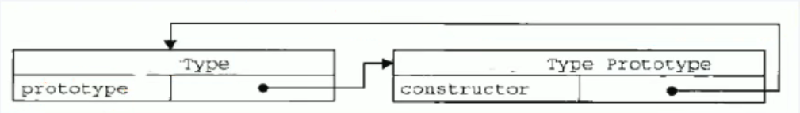
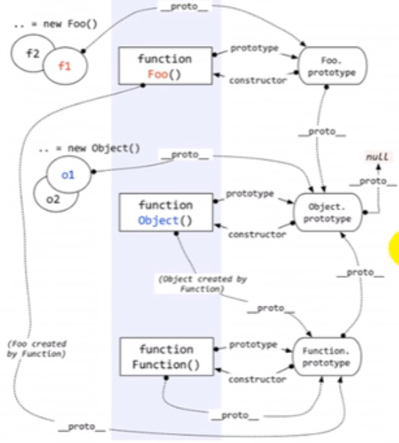
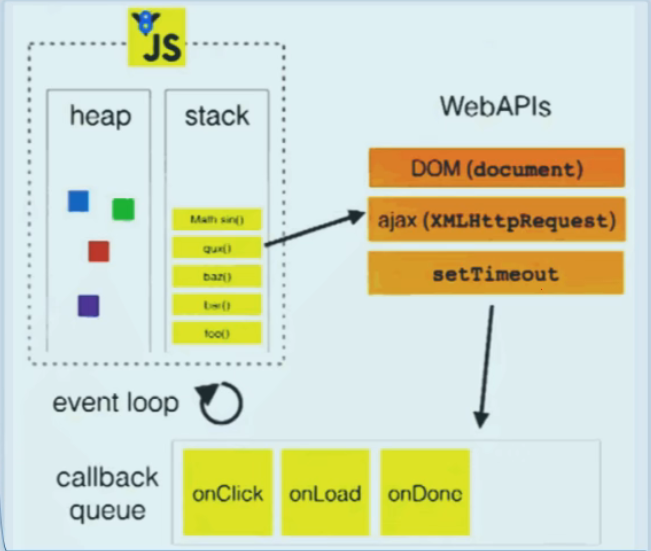

# JS高级知识

## 1、函数的prototype

每个函数都有一个prototype属性，它默认指向一个Object空对象(即称为:原型对象)

原型对象中有一个属性constructor,它指向函数对象

给原型对象添加属性(一般都是方法)

作用:函数的所有实例对象自动拥有原型中的属性(方法)

```js
Function.prototype.constructor === Function // true

// 为原型添加方法并调用
Fun.prototype.test = function() {};
var fun = new Fun();
fun.test();

// Function本身是自己的实例
Function.prototype === Function.__proto__  //true
// 隐式原型链尽头是Object,而Object没有隐式原型，Object.__proto__=n
// Object.__proto__ = Function.prototype
// Object.prototype.__proto__ = null;
```





## 2、显示原型和隐式原型

每个函数function都有一个`prototype`，即显式原型(属性)

每个实例对象都有一个`__proto__`，可称为隐式原型(属性)

对象的隐式原型的值 === 对应构造函数的显式原型的值

**给显示原型添加方法，实例对象可以直接调用（通过隐式原型）**

总结:

函数的`prototype`属性:在定义函数时自动添加的，默认值是一个空0bject对象

对象的`__proto__`属性:创建对象时自动添加的，默认值为构造函数的`prototype`属性值

程序员能直接操作显式原型，但不能直接操作隐式原型(ES6之前)

## 3、执行上下文

### 全局执行上下文

在执行全局代码前将window确定为全局执行上下文

对全局数据进行如下预处理：

- var定义的全局变量-->undefined，添加为window的属性
- function声明的全局函数==>赋值(fun)，添加为window的方法==
- ==this==>赋值(window)

最终开始执行全局代码

### 函数执行上下文

在调用函数，准备**执行**函数体之前，创建对应的函数执行上下文对象

对局部数据进行如下预处理：

- 形参变量 ==> 赋值(实参) ==> 添加为执行上下文的属性
- arguments ==> 赋值(实参列表)，添加为执行上下文的属性
- var定义的局部变量 ==> undefined，添加为执行上下文的属性
- function声明的函数 ==> 赋值(fun)，添加为执行上下文的方法
- this ==> 赋值(调用函数的对象)

最终开始执行函数体代码

### 执行上下文栈

1.在全局代码执行前,JS引擎就会创建一个栈来存储管理所有的执行上下文对象

2.在全局执行上下文(window)确定后,将其添加到栈中(压栈)

3.在函数执行上下文创建后,将其添加到栈中(压栈)

4.在当前函教执行完后,将栈顶的对象移除(出栈)

5.当所有的代码执行完后,栈中只剩下window

## 4、作用域和执行上下文

区别1

- 全局作用域之外，每个函数都会创建自己的作用域，作用域在函数定义时就已经确定了。而不是在函数调用时
- 全局执行上下文环境是在全局作用域确定之后，js代码马上执行之前创建
- 函数执行上下文是在调用函数时，函数体代码执行之前创建

区别2

- 作用域是**静态**的，只要函数定义好了就一直存在，且不会再变化
- 执行上下文是动态的，调用函数时创建，函数调用结束时就会**自动释放**

联系

- 上下文环境(对象)是从属于所在的作用域
- 全局上下文环境 ==> 全局作用域
- 函数上下文环境 ==> 对应的函数使用域

## 5、闭包

### 1 如何产生闭包?

当一个嵌套的内部(子)函数引用了嵌套的外部(父)函数的变量(函数)时，就产生了闭包

### 2 闭包到底是什么?

理解一:闭包是嵌套的内部函数(绝大部分人)

理解二:包含被引用变量(函数)的对象(极少数人)

注意:闭包存在于嵌套的内部函数中

### 3 产生闭包的条件?

函数嵌套

内部函数引用了外部函数的数据(变量/函数)

### 4 闭包作用

使用函数内部的变量在函数执行完后，仍然存活在内存中(延长了局部变量的生命周期)

让函数外部可以操作(读写)到函数内部的数据(变量/函数)

### 5 常见的闭包

```js
// 1．将函数作为另一个函数的返回值
function fn1() {
    var a = 2
    var b = 3
    function fn2() {
        a++
        console.log(a)
    }
    return fn2
}
var f = fn1()
f() //3
f() //4
// 闭包中只有一个a属性

// 2．将函数作为实参传递给另一个函数调用
function showDeLay(msg, time) {
    setTimeout(function () {
    	alert(msg)
    }, time)
}
showDelay('xxx', 2000)
```

### 6 闭包的生命周期

产生：在嵌套内部函数**定义执行完**时就产生了(不是在调用)

死亡：在嵌套的内部函数成为拉圾对象时

### 7 闭包应用-定义js模块

模块：

- 具有特定功能的js文件
- 将所有的数据和功能都封装在一个函数内部(私有的)
- 只向外暴露一个包含n个方法的对象或函数

模块的使用者，只需要通过模块暴露的对象调用方法来实现对应的功能

```js
// 模块化方法一
function myModule() {
    // 私有数据
    var msg = 'My atguigu'
    // 操作数据的函数
    function doSomething() {
    	console.log('dosomething()' + msg.toUpperCase())
    }
    function dootherthing() {
    	console.log("do0therthing()"+ msg.toLowerCase())
    }
    //向外暴露对象(给外部使用的方法)
    return {
    	doSomething: doSomething,
        dootherthing: dootherthing
    }
}

// 模块化方式二
(function () {
    //私有数据
    var msg = "My atguigu'操作数据的函数
    function doSomething() {
    	console.log('doSomething()' + msg.toUpperCase())
    }
    function dootherthing() {
    	console.log('dootherthing()' + msg.toLowerCase())
    }
    //向外暴露对象(给外部使用的方法)
    window.myModule2 = {
    	doSomething: doSomething,
        doOtherthing: dootherthing
    }
})()

/*
前者引入之后还需要调用函数才会产生闭包，才能调用相关导出的模块化函数
后者不需要引入即可直接调用
*/
```

### 8 闭包缺点

缺点

- 函数执行完后，函数内的局部变量没有释放
- 占用内存时间会变长容易造成内存泄露

解决

- 能不用闭包就不用
- 及时释放（赋值null），让内部函数成为垃圾对象，进行垃圾回收

### 9 利用闭包遍历绑定按钮事件

```js
// 利用闭包
// 这样就可以不需要为btn对象添加index属性了，可以直接利用闭包保存i
for (var i = 0, length = btns.length; i < length; i++){
    (function (i){
		var btn = btns[i]
		btn.onclick = function () {
            alert('第' + (i+1) + '个")
        }
    })(i)
}
```

## 6、内存溢出和泄露

### 内存溢出

- 一种程序运行出现的错误
- 当程序运行需要的内存超过了剩余的内存时，就出抛出内存溢出的错误

### 内存泄露

- 占用的内存没有及时释放
- 内存泄露积累多了就容易导致内存溢出

### 常见的内存泄露:

- 意外的全局变量
- 没有及时清理的计时器或回调函数
- 闭包

## 7、对象创建模式

```js
/*方式一:object构造函数模式
*套路:先创建空object对象，再动态添加属性/方法
*适用场景:起始时不确定对象内部数据
*问题:语句太多
*/
var person = new Object();
person.xxx = xxx;

/*方式二:对象字面量模式
*套路:使用{}创建对象，同时指定属性/方法
*适用场景:起始时对象内部数据是确定的
*问题:如创建多个对象,有重复代码
*/
var person = {
    xxx: xxx
}

/*方式三:工厂模式
*套路:通过工厂函数动态创建对象并返回
*适用场景:需要创建多个对象
*问题:对象没有一个具体的类型,都是Object类型
*/
function createPerson(xxx, xx) {
    return {
        xxx: xxx,
        xxx: xx
    }
}
var p1 = createPerson(xxx, xxx);

/*方式四:自定义构造函数模式
*套路:自定义构造函数，通过new创建对象
*适用场景:需要创建多个类型确定的对象
*问题:每个对象都有相同的数据，浪费内存
*/
function Person(xx, xxx) {
    this.xx = xx;
    this.xxx = xxx;
}
var p = new Person(xx, xxx);

/*方式六:构造函数+原型的组合模式
*套路:自定义构造函数，属性在函数中初始化，方法添加到原型上
*适用场景:需要创建多个类型确定的对象
*/
function Person(xx, xxx) {
    this.xx = xx;
    this.xxx = xxx;
}
Person.prototype.setXx = function(xx) {
    this.xx = xx;
}
var p = new Person(xx, xxx);

```

## 8、继承模式

原型链 + 借用构造函数的组合继承

1．利用原型链实现对父类型对象的方法继承

2．利用call()借用父类型构建函数初始化相同属性

```js
function Person(name, age) {
    this.name = name
	this.age = age
}
Person.prototype.setName = function(name) {
	this.name = name;
};

function Student(name, age, price) {
    Person.call(this，name，age); // 相当于: this.Person(name，age),为了得到属性
    this.price = price;
}

student.prototype = new Person(); // 子类型原型指向父类型的实例，为了能看到父类型的方法
student.prototype.constructor = Student; // 修正constructor属性，否则会指向父类型
student.prototype.setPrice = function (price) {
    this.price = price;
}

var s = new Student("xx", 18, 1200);
```

## 9、线程机制和事件机制

### 浏览器内核模块组成

#### 主线程

- js引擎模块:负责js程序的编译与运行
- html ,css文档解析模块:负责页面文本的解析
- DOM/CSS模块:负责dom/css在内存中的相关处理
- 布局和渲染模块:负责页面的布局和效果的绘制(内存中的对象)

#### 分线程

- 定时器模块:负责定时器的管理
- DOM事件响应模块:负责事件的管理
- 网络请求模块:负责Ajax请求

### js线程

- js是单线程执行的(回调函数也是在主线程)
- H5提出了实现多线程的方案:web workers--- >worker
- **只能是主线程更新界面**

### 定时器问题

- 定时器并不真正完全定时
- 如果在主线程执行了一个长时间的操作，可能导致延时才处理

### 事件处理机制

代码分类

- 初始化执行代码:包含绑定dom事件监听，设置定时器，发送ajax请求的代码
- 回调执行代码:处理回调逻辑

js引擎执行代码的基本流程:

- 初始化代码===>回调代码

模型的2个重要组成部分:

- 事件管理模块
  回调队列

模型的运转流程

- 执行初始化代码,将事件回调函数交给对应模块管理
- 当事件发生时，管理模块会将回调函数及其数据添加到回调列队中
- 只有当初始化代码执行完后(可能要一定时间)，才会遍历读取回调队列中的回调函数执行



## 经典问题

**1、undefined 与nuLL的区别?**

undefined代表定义未赋值

nulLl定义并赋值了，只是值为null

**2、什么时候给变量赋值为null呢?**

初始赋值，表明将要赋值为对象

结束前,让对象成为垃圾对象(被垃圾回收器回收)

**3、严格区别变量类型与数据类型?**

数据的类型：基本类型&对象类型

变量的类型(变量内存值的类型)：基本类型:保存就是基本类型的数据&引用类型:保存的是地址值

**4、内存，数据，变量三者之间的关系**

内存用来存储数据的空间

变量是内存的标识，通过变量找到对应的内存，从而操作数据

**5、在js 调用函数时传递变量参数时，是值传递还是引用传递**

理解1：都是值(基本/地址值)传递

理解2：可能是值传递，也可能是引用传递(地址值)

**6、IIFE**

全称: ImmediateLy-Invoked Function Expression

作用

- 隐藏实现
- 不会污染外部(全局)命名空间
- 用它来编码js模块

```js
(function() { // 匿名函数自调用
	console.log(3);
})();
```

**7、new一个对象背后做了什么**

- 创建一个空对象
- 给对象设置`__proto__`,值为构造函数对象的prototype属性值
- 执行构造函数体(给对象添加属性/方法)
