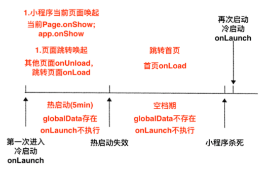
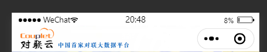
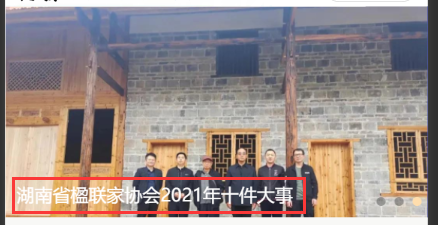
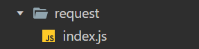

# MiniProgram小知识

## 1、ios系统时间显示NAN

>原因如下：
>
>当进行网络请求的时候，后端返回日期格式为“2018-05-03”。iOS手机或者浏览器不支持这种类型的日期格式

解决：ios系统只支持解析以斜杠分隔的时间，所以需要用正则将时间格式转换一下

```js
// 在小程序的工具文件util.js中进行封装
function formatTime(date) {
    var time = date==null ? "" : Date.parse(date.replace(/-/g, '/')); // 时间戳
    var date = new Date(time);
    var year = date.getFullYear();
    var month = date.getMonth() + 1;
    var day = date.getDate();
    var hour = date.getHours();
    var minute = date.getMinutes();
    var second = date.getSeconds();
    return [year, month, day].map(formatNumber).join('/');
}
```


## 2、微信热启动/冷启动

### 热启动

热启动就是指关闭了小程序，或者按了home键，并且在一个时间范围内（一般为五分钟），再次打开小程序，就属于热启动。每次启动，app.js中onShow就会执行。

热启动的过程中（0-5min），小程序的数据（globalData）还是存在的。

但是热启动的方式有两种，一种是直接唤起，例如在最新使用的小程序中，点击刚才关闭的小程序，页面直接被唤起了，停留在你上一次使用的页面，包括滚动位置都是一样的，这种情况就会执行onShow，如果超过五分钟，就会重新加载，会加载到首页，执行onLoad方法。

还有一种是会跳转的，例如打开朋友分享的小程序，点到了另外的页面，然后关闭了，再次打开，会定位小程序的首页，之前打开的页面都会执行onUnload卸载掉，执行首页的onLoad方法。

热启动的过程中，onLuanch是不会执行的，所以onLuanch中最好只是设置一下GloablData。

### 冷启动

冷启动就是第一次进入小程序；或者时间很长，微信把小程序杀死了；或者小程序太占内存，被微信杀死了；或者手动杀死了微信进程，就会触发冷启动。每次触发冷启动，就会执行OnLuanch。

有一个问题，正常情况下，微信什么时候会杀死小程序进程？上面说一般为五分钟，但是并不代表，五分钟到了，就会杀死小程序，只是说五分钟到了，小程序的服务线程（小程序中有两个线程，视图线程，例如wxml，服务线程，例如js）被杀死，globalData没了。

现实情况是，微信可能很长一段时间都不会杀死小程序，也就是说，很长一段时间onLuanch都不会执行，因此会存在一段空档期（5-Xmin），在这段时间内，globalData没有了，也不会执行onLuanch。




### 如何安排？

globalData可以放在onLoad中执行

```js
onLoad(options) {
    if(!app.globalData.init){//防止重复初始化
        app.globalData.init=true;
        
        app.global.***=option.***;//接受参数
    }
}
```

某些对象需要在初始化时（app.js）挂载，可以放在onShow中执行

```js
onShow(){
    if(!this.***){//没有挂载
        this.***=****;
    }
}
```

一般登录逻辑可以放在onLuanch中执行

登陆一般涉及两个时效性，一个是setStorage，将数据放在本地存储中，时效一般比较长；第二个是we.login，他得到code，然后传给后端去换的openid等数据，session_key，session_key一般为三天，这两个时效性都比onluanch长，所以可以将登陆放在onLuanch中执行。

> [参考博客](http://www.qiutianaimeili.com/html/page/2021/04/20347wh9zpbtkre.html)


## 3、自定义导航栏

### 第一步、弃用默认的导航栏

json文件中设置

```json
"window": {
    "navigationStyle": "custom"
}
```

### 第二步、根据胶囊的位置获取导航栏的高度

#### 2.1 首先获取胶囊的信息

```js
const menuButtonInfo = wx.getMenuButtonBoundingClientRect();
```

| width | height | top        | right      | bottom     | left       |
| ----- | ------ | ---------- | ---------- | ---------- | ---------- |
| 宽度  | 高度   | 上边界坐标 | 右边界坐标 | 下边界坐标 | 左边界坐标 |



#### 2.2 获取系统信息

```js
const systemInfo = wx.getSystemInfoSync();
```

根据这个获取statusBarHeight(状态栏高度)

#### 2.3 计算高度

导航栏高度 = 状态栏到胶囊的间距（胶囊距上距离-状态栏高度） * 2 + 胶囊高度 + 状态栏高度

```js
App({
    onLaunch: function(options) {
        const that = this;
        // 获取系统信息
        const systemInfo = wx.getSystemInfoSync();
        // 胶囊按钮位置信息
        const menuButtonInfo = wx.getMenuButtonBoundingClientRect();
        // 导航栏高度 = 状态栏到胶囊的间距（胶囊距上距离-状态栏高度） * 2 + 胶囊高度 + 状态栏高度
        that.globalData.navBarHeight = (menuButtonInfo.top - systemInfo.statusBarHeight) * 2 + menuButtonInfo.height + systemInfo.statusBarHeight;
        that.globalData.menuRight = systemInfo.screenWidth - menuButtonInfo.right;
        that.globalData.menuBotton = menuButtonInfo.top - systemInfo.statusBarHeight;
        that.globalData.menuHeight = menuButtonInfo.height;
    },
    // 数据都是根据当前机型进行计算，这样的方式兼容大部分机器
    globalData: {
        navBarHeight: 0, // 导航栏高度
        menuRight: 0, // 胶囊距右方间距（方保持左、右间距一致）
        menuBotton: 0, // 胶囊距底部间距（保持底部间距一致）
        menuHeight: 0, // 胶囊高度（自定义内容可与胶囊高度保证一致）
    }
})
```

#### 2.4 自定义组件

```html
<!-- html -->
<!-- 自定义顶部栏 -->
<view class="nav_bar" style="height:{{navBarHeight}}px;">
	<!-- 导航栏背景图片 -->
	<image class="backgroundImg" style="margin-top: {{navStatusHeight}}px;" mode="widthFix" src="{{navBarImg}}"/>
</view>

<!-- 
	内容区域：
	自定义顶部栏用的fixed定位，会遮盖到下面内容，注意设置好间距
-->
<view class="content" style="margin-top:{{navBarHeight}}px;"></view>

```

```js
// js
const app = getApp()
Component({
	// 子组件传递参数
    properties: {
    },
    // 组件自己的数据
    data: {
        navBarHeight: '',
        navStatusHeight: '',
        navBarImg: "../../icons/navImage.png",
    },
    // 子组件加载
    attached: function() {
        this.setData({
            navBarHeight: app.globalData.navBarHeight,
            navStatusHeight: app.globalData.navStatusHeight
        })
    },
    methods: {

    },
    // 使用全局样式，否则无法使用图标或者图片
    options: {
        addGlobalClass: true
    }
})
```

```css
/* wxss */
.nav_bar {
  background-color: #fff;
  position: fixed;
  width: 100%;
  top: 0;
  left: 0;
  z-index: 99999;
}
.nav_bar .backgroundImg {
  position: fixed;
  height: 100%;
}

```

### 第四步、使用自定义导航栏组件

1、在json文件中引入组件

```json
"NavBar": "../../components/NavBar/NavBar",
```

2、在wxml中使用组件

```html
<!-- 自定义导航栏 -->
<NavBar></NavBar>
```


## 4、图片上叠加文字

使用relative和absolute定位

### 4.1 首先将图片和文字放在同一个父盒子下

```html
<navigator url="/pages/news_about/news_detail/index?newsId={{item.newsId}}" hover-class="none">
    <image mode="widthFix" src="{{item.newsImage}}"></image>
    <view class="news_info">
        {{item.newsTitle}}
    </view>
</navigator>
```

### 4.2 将父盒子设置为relative定位

```css
navigator{
    position: relative;
    height: 375rpx;
    width: 100%;
    padding: 0;
}
```

### 4.3 将文字设置为absolute定位，相对父盒子定位

```html
image{
    width: 100%;
    height: 375rpx;
}   
.news_info{
    position: absolute;
    left: 20rpx;
    bottom: 20rpx;
    width: 80%;
    color: #ffffff;
    // overflow: hidden;
    // white-space: nowrap;
    // text-overflow: ellipsis;
    display: -webkit-box;
    overflow: hidden;
    text-overflow: ellipsis;
    -webkit-box-orient: vertical;
    -webkit-line-clamp: 2;
} 
```

### 4.4 结果




## 5、设置轮播图指示点位置

```css
/*指示点位置*/
.wx-swiper-dots{
    position:relative;
    left: unset!important;
    right: -30rpx;
}
```

## 6、获取元素高度

最好在onReady中调用，在页面渲染完成的回调函数中处理高度问题

```JS
// 计算的时候，不能有没有确定宽高的图标或者图片
// 并且需要设置延时，如果不加定时器，获取的元素的高度还是没渲染完异步数据前的高度
setTimeout(() => {
    // 首先创建一个元素选择对象
    const query = wx.createSelectorQuery();
    // 根据类选择器或者id选择器选择元素
    query.selectAll('.minusView').boundingClientRect();
    // 对元素进行处理
    query.exec((res) => {
        this.setData({
            // 实时获取窗口高度
            scrollHeight: (wx.getSystemInfoSync().windowHeight - res[0][0].height - res[0][1].height -  res[0][2].height)
        });
    });
    query.selectAll('#introductionId').boundingClientRect();
    query.exec((res) => {
        // 选择器获取到的单位是Px，需要适应不同的手机型号，所以将需要根据rpx去比例计算得到px
        if(res[0][0].height > getPx(120)) {
            this.setData({
                showMore: true
            });
        } else {
            this.setData({
                showMore: false
            });
        }
    })
}, 500);

// 获取单位转换结果,由rpx转换为该手机下的px
const getPx = rpx => {
  const width = wx.getSystemInfoSync().windowWidth;
  const rate = width / 750.0;
  // console.log(rpx * rate);
  return rpx * rate;
}
```

## 7、获取页面栈

微信小程序支持最多十个页面栈

```js
// 页面栈
let pages = getCurrentPages();
// 上一个页面
let prevPage = pages[pages.length - 2];
if ( prevPage.route === 'pages/my_about/modify_information/index' && pages.length !== this.pageNumber) {
    // 如果是从修改页面跳转过来的，就需要刷新数据
    // 只有从修改页面跳转回来，length才会改变，
    this.pageNumber = pages.length;
    this.getMyInfo();
 } else {
	// 否则不需要刷新数据，说明还是上次修改
}
```

## 8、封装request

### 1、选择新建一个文件夹request

### 2、新建一个`index.js`文件



### 3、封装

```js
import {baseURL} from '../utils/util.js';

// 记录同时发送请求的个数
let AjaxTimes = 0;

// 调用时先在js文件中导入该函数，然后传入参数即可
// 参数传入形式{url:xxx, data:xxx, method: xxx}
// method只有POST请求需要说明，url只需传入后面一截就好了，data也只需要在有需要的时候传入即可
export const request=(params)=>{
  AjaxTimes++;
  wx.showLoading({
    title: '加载中',
    mask: true
  });

  let keys = Object.keys(params);
  let index = keys.indexOf('userId');
  if(index != -1) {
    if(!params.userId) {
      return Promise.reject("当前用户信息失效，请重新进入小程序");
    }
  }
  // 返回一个promise
  return new Promise((resolve, reject)=>{
    if(params.method === 'POST') {
      var header = {
        "token" : wx.getStorageSync('userSession').token,
        'Content-Type': 'application/x-www-form-urlencoded'
      }      
    } else {
      var header = {
        "token" : wx.getStorageSync('userSession').token,
      }    
    }
    // 发送请求
    wx.request({
      ...params,
      url : baseURL + params.url,
      header : header,
      success:(result)=>{
        // 这里可以进一步的获取结果，如result.data;
        resolve(result);
      },
      fail:(err)=>{
        reject(err);
      },
      complete:()=>{
        AjaxTimes--;
        //  关闭加载中
        if (AjaxTimes === 0) {
          wx.hideLoading();
        }
      }
    })
  })
}
```

### 4、使用

使用的时候只需要引入request函数即可，然后可以使用`async`和`await`语法进行使用

```js
async selectAction(e) {
    // 给后端发请求,删除资料
    let url = '/file-server/document-collection/deleteDocumentByDocumentId';
    const reqData = {
        userId: wx.getStorageSync('userSession').userId,
        documentId: this.data.selectedDocumentId
    }
    // 使用try catch捕获异常即可
    try {
        const res = await request({url: url, data: reqData, method: 'POST'});
        if(res.data.code === 20000) {
            let documentList = this.data.documentList;
            documentList.splice(this.data.index, 1);
            this.setData({
                documentList,
                userDocuments: this.data.userDocuments - 1
            });
            Toast.success('移除成功');
        } else {
            wx.showToast({
                title: '移除失败',
                duration: 1000,
                icon: 'none'
            });
        }
    } catch (error) {
        // 提示请求失败信息
        console.log(error);
    }
}
```

## 9、使用Towxml

**Towxml** 是一个可将`HTML`、`Markdown`转为微信小程序`WXML`(WeiXin Markup Language)的渲染库。用于解决在微信小程序中`Markdown`、`HTML`不能直接渲染的问题。

下载地址：[github](https://gitcode.net/mirrors/sbfkcel/towxml?utm_source=csdn_github_accelerator)

1、首先构建Towxml，[构建教程](https://github.com/sbfkcel/towxml/wiki/3.0-%E6%9E%84%E5%BB%BATowxml)

2、引入，新构建出来的文件在`dist`目录下，将`dist`目录复制到你的小程序项目中并将目录名称改为`towxml`即可

3、使用，[使用教程](https://github.com/sbfkcel/towxml/wiki/3.0-%E5%A6%82%E4%BD%95%E4%BD%BF%E7%94%A8)

4、示例

```js
// 使用towxml将markdown转换为wxml
const newsContent = app.towxml(res.data.data.newsContent, 'markdown', {
    // base:'https://xxx.com',				// 相对资源的base路径
    // theme:'dark',					// 主题，默认`light`
    // events:{					// 为元素绑定的事件方法
    //   tap:(e)=>{
    //     console.log('tap',e);
    //   }
    // }  注释内容都是非必须的
})
this.setData({
    newsContent
});
```

```html
<view class="container">
  <towxml nodes="{{newsContent}}"/>
</view>
```

