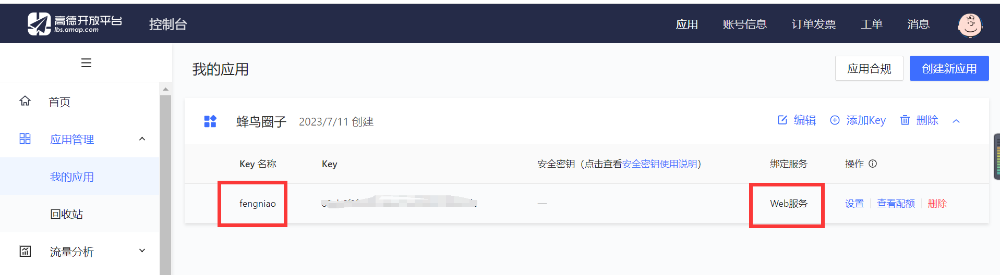

# uniapp开发tips


## 通过高德地图获取ip省份

根据[官网web服务](https://lbs.amap.com/api/webservice/summary)去申请即可，绑定支付宝就可以

在高德地图上申请即可，申请一个应用，选择服务为web服务



```js
//向外导出省份
export function getProvince() {
	return new Promise((resolve, reject) => {
		let historyProvince = uni.getStorageSync("historyProvince");
		if (historyProvince) {
			if ((Date.now() - historyProvince.time) > 1000 * 60 * 60) {
				getIp().then(res => {
					resolve(res)
				}).catch(err => {
					reject(err)
				})
			} else {
				resolve(historyProvince.province);
			}
		} else {
			getIp().then(res => {
				resolve(res)
			}).catch(err => {
				reject(err)
			})
		}
	})
}

//获取所在省市
function getIp() {
	return new Promise((resolve, reject) => {
		uni.request({
			url: "https://restapi.amap.com/v3/ip?key=xxxxx",
			success: res => {
				let str = ""
				typeof(res.data.province) == "string" ? str = res.data.province: str = "火星"
				resolve(str)
				let obj = {
					province: str,
					time: Date.now()
				}
				uni.setStorageSync("historyProvince", obj);
			},
			fail: err => {
				reject(err)
			}
		})
	})
}
```

```json
// 返回示例
{
  "status" : "1",
  "info" : "OK",
  "infocode" : "10000",
  "province" : "北京市",
  "city" : "北京市",
  "adcode" : "110000",
  "rectangle" : "116.0119343,39.66127144;116.7829835,40.2164962"
}
```


## 数据库

### 临时表

通过临时表连表查询数据可以提高性能

使用临时表进行联表查询，可以先对主表或者副表进行过滤，然后在处理后的临时表的基础上生成虚拟联表。

```js
const likeTemp = db.collection('quanzi-like').where({
    article_id: this.id
}).getTemp()
const userTemp = db.collection('uni-id-users').field("_id, avatar_file").getTemp()
const res = await db.collection(likeTemp, userTemp).orderBy("like_date desc").limit(6).get()
```


### 分组查询

```js
const res1 = await db.collection('quanzi-comment').where({
    reply_comment_id: db.command.in(idList),
}).groupBy("reply_comment_id").groupField('count(*) as totalReply').get()
```


### 查询去重

通过.distinct()方法，对数据查询结果中重复的记录进行去重。

distinct方法将按照field方法指定的字段进行去重（如果field内未指定`_id`，不会按照`_id`去重）

```js
const res = await db.collection('table1')
.field('field1')
.distinct() // 注意distinct方法没有参数
.get()
```


### jql语句内云端环境变量

[地址](https://uniapp.dcloud.net.cn/uniCloud/jql.html#variable)

|       参数名       |        说明         |
| :----------------: | :-----------------: |
|   $cloudEnv_uid    | 用户uid，依赖uni-id |
|   $cloudEnv_now    |    服务器时间戳     |
| $cloudEnv_clientIP |    当前客户端IP     |

在字符串内使用

```js
db.collection('user').where('_id==$cloudEnv_uid').get()
```

在对象内使用

```js
db.collection('user').where({
	_id: db.getCloudEnv('$cloudEnv_uid')	
}).get()
```

**注意**

- 这些变量使用时并非直接获取对应的值，而是生成一个标记，在云端执行数据库操作时再将这个标记替换为实际的值


## Editor富文本组件

富文本编辑器，可以对图片、文字格式进行编辑和混排。

在web开发时，可以使用`contenteditable`来实现内容编辑。但这是一个dom API，在非H5平台无法使用。于是微信小程序和uni-app的App-vue提供了`editor`组件来实现这个功能，并且在uni-app的H5平台也提供了兼容。从技术本质来讲，这个组件仍然运行在视图层webview中，利用的也是浏览器的`contenteditable`功能。

编辑器导出内容支持带标签的 `html`和纯文本的 `text`，编辑器内部采用 `delta` 格式进行存储。

通过`setContents`接口设置内容时，解析插入的 `html` 可能会由于一些非法标签导致解析错误，建议开发者在应用内使用时通过 delta 进行插入。

### editor Context api

[地址](https://uniapp.dcloud.net.cn/api/media/editor-context.html#)

```js
editorReady() {
  uni.createSelectorQuery().in(this).select('#editor').fields({
    size: true,
    context: true,
  }, (res) => {
    this.editorCtx = res.context
  }).exec()
},
// 添加分割线
insertDivider() {
  this.editorCtx.insertDivider()
},
setHead() {
  this.editorCtx.format("header", this.headShow ? 'H2' : false)
},
setBold() {
  this.editorCtx.format("bold")
},
setItalic() {
  this.editorCtx.format("italic")
},
editOk() {
  this.editorCtx.getContents({
    success: res => {
      this.article.description = res.text.slice(0, 80)
      this.article.content = res.html
      this.article.picUrls = getImgSrc(res.html)
    }
  })
},
```


## 上传云图片

[微信小程序和别的不同](https://uniapp.dcloud.net.cn/api/media/image.html)，需要单独处理

```js
insertImage() {
  // #ifdef MP-WEIXIN
  uni.chooseMedia({
    count: 3,
    mediaType: ['image'],
    success: async res => {
      uni.showLoading({
        title: "图片上传中",
        mask: true
      })
      for (let item of res.tempFiles) {
        let res1 = await uniCloud.uploadFile({
          filePath: item.tempFilePath,
          cloudPath: item.tempFilePath.split('/')[3]
        })
        this.editorCtx.insertImage({
          src: res1.fileID
        })
      }
      uni.hideLoading()
    }
  })
  // #endif
  // #ifndef MP-WEIXIN
  uni.chooseImage({
    count: 3,
    success: async res => {
      uni.showLoading({
        title: "图片上传中",
        mask: true
      })
      for (let item of res.tempFiles) {
        let res1 = await uniCloud.uploadFile({
          filePath: item.path,
          cloudPath: item.name ? item.name : item.path
        })
        this.editorCtx.insertImage({
          src: res1.fileID
        })
      }
      uni.hideLoading()
    }
  })
  // #endif
},
```


## 页面跳转

### 传递参数

```javascript
//在起始页面跳转到test.vue页面并传递参数
uni.navigateTo({
	url: 'test?id=1&name=uniapp'
});
```

```javascript
// 在test.vue页面接受参数
export default {
	onLoad: function (option) { //option为object类型，会序列化上个页面传递的参数
		console.log(option.id); //打印出上个页面传递的参数。
		console.log(option.name); //打印出上个页面传递的参数。
	}
}
```


### 监听事件

```js
// 在起始页面跳转到test.vue页面，并监听test.vue发送过来的事件数据
uni.navigateTo({
  url: '/pages/test?id=1',
  events: {
    // 为指定事件添加一个监听器，获取被打开页面传送到当前页面的数据
    acceptDataFromOpenedPage: function(data) {
      console.log(data)
    },
    someEvent: function(data) {
      console.log(data)
    }
    ...
  },
  success: function(res) {
    // 通过eventChannel向被打开页面传送数据
    res.eventChannel.emit('acceptDataFromOpenerPage', { data: 'data from starter page' })
  }
})

// 在test.vue页面，向起始页通过事件传递数据
onLoad: function(option) {
  const eventChannel = this.getOpenerEventChannel();
  eventChannel.emit('acceptDataFromOpenedPage', {data: 'data from test page'});
  eventChannel.emit('someEvent', {data: 'data from test page for someEvent'});
  // 监听acceptDataFromOpenerPage事件，获取上一页面通过eventChannel传送到当前页面的数据
  eventChannel.on('acceptDataFromOpenerPage', function(data) {
    console.log(data)
  })
}
```


## uniCloud获取当前用户信息

> getCurrentUserInfo

解析客户端token获取用户信息。常用于在前端判断当前登录的用户状态和用户权限，比如根据不同的权限显示隐藏某些按钮。

**注意**

- 此接口不会发送网络请求，**此接口仅仅是客户端接口，不校验token的合法性以及是否过期**
- 需要搭配uni-id使用并要求客户端必须将token存储在storage内的`uni_id_token`内
- 如需获取role、permission需要将角色权限缓存在token内，此功能自uni-id 3.0.0 或 uni-id-common中默认开启

用法：`uniCloud.getCurrentUserInfo()`

该方法为同步方法。

**响应参数**

| 字段         | 类型   | 说明                                  |
| ------------ | ------ | ------------------------------------- |
| uid          | Number | 当前用户uid                           |
| role         | Array  | 用户角色列表。admin用户返回["admin"]  |
| permission   | Array  | 用户权限列表。注意admin角色此数组为空 |
| tokenExpired | Number | token过期时间                         |

未能获取用户信息时返回以下结果

```js
{
  uid: null,
  role: [],
  permission: [],
  tokenExpired: 0
}
```

**示例**

```js
if (uniCloud.getCurrentUserInfo().tokenExpired > Date.now()) {
  try {
    await uniIdCo.logout()
  } catch (e) {
    console.error(e);
  }
}
```


## 云对象

### 自动显示交互界面

背景：每次写客户端联网的代码时，开发者都免不了重复写一堆代码：先调用loading等待框，联网结束后再关闭loading，如果服务器异常则弹出提示。

从HBuilderX 3.4.6起，调用云对象的方法时，默认会自动显示交互/提示界面。

1. 在请求联网开始时显示loading等待框，
2. 结束后隐藏loading
3. 如果请求报错，显示弹窗（也可配置为显示Toast）

如果默认显示的UI不符合你的需求，你可以通过配置自定义一些交互内容，也可以直接关闭自动显示的交互界面。

- 如需关闭自动显示的UI，请在客户端导入云对象时传入参数`customUI: true`

例：

```js
uniCloud.importObject('todo', {
	customUI: true // 取消自动展示的交互提示界面
})
```

- 如需自定义默认显示的UI，配置如下：

```js
uniCloud.importObject('todo', {
	customUI: false, // 是否取消自动展示的交互界面。默认为false，配置为true时取消自动展示的交互提示界面，以下配置均不再生效
	loadingOptions: { // loading相关配置
		title: '加载中...', // 显示的loading内的提示文字。默认值为：加载中...
		mask: true // 是否使用透明遮罩，配置为true时不可点击页面其他内容。默认值为：true
	},
	errorOptions: { // 错误界面相关配置
		type: 'modal', // 错误信息展示方式，可取值：modal（弹框，默认）、toast（toast消息框）。默认值为：modal
		retry: false // 是否展示重试按钮，仅在type为modal时生效。用户点击重试按钮时将重新请求调用的方法，默认为false
	},
  parseSystemError({ // 转化云对象内未捕获的错误，或客户端网络错误
    objectName, // 云对象名
    methodName, // 方法名
    params, // 调用方法时传的参数，注意params是一个数组
    errCode, // 请求返回的错误码
    errMsg // 请求返回的错误信息
  } = {}){
    return {
      errMsg: '系统错误，请稍后再试' // 用于展示的错误信息
    }
  }
})
```

**注意**

1. 配置仅对当前`importObject`返回的云对象实例生效
2. 本功能仅对客户端调用云对象生效。在云函数或云对象中调用云对象不生效
