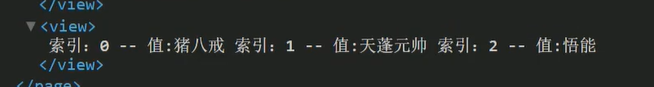

# 小程序部分语法

详细教程可以查看黑马编写的文档 [黑马文档](./ref.pdf)

## 公共配置

### app.json公共配置文件

颜色只能是十六进制形式

其他选择访问https://developers.weixin.qq.com/miniprogram/dev/reference/configuration/app.html#pages

```json
"pages":[
    "pages/index/index",
    "pages/logs/logs"
],
"window":{
    "backgroundTextStyle":"light",   // 下拉刷新框的风格，只有light 和 dark
    "navigationBarBackgroundColor": "#fff",   //导航栏背景颜色
    "navigationBarTitleText": "Weixin",   //小程序标题
    "navigationBarTextStyle":"black",   //标题颜色，只有白色和黑色
    "enablePullDownRefresh":true,   //开启下拉刷新
    "backgroundColor": "#abcdfe"   //刷新框的背景颜色
},
```


### tabbar

写在app.json中，和window同级，

```json
"tabBar": {
    "list": [
      {
        "pagePath": "pages/index/index",
        "text": "首页",
        "iconPath": "icon/_home.png",
        "selectedIconPath": "icon/home.png"
      },
      {
        "pagePath": "pages/img/img",
        "text": "图片",
        "iconPath": "icon/_img.png",
        "selectedIconPath": "icon/img.png"
      },
      {
        "pagePath": "pages/search/search",
        "text": "搜索",
        "iconPath": "icon/_search.png",
        "selectedIconPath": "icon/search.png"
      },
      {
        "pagePath": "pages/mine/mine",
        "text": "我的",
        "iconPath": "icon/_my.png",
        "selectedIconPath": "icon/my.png"
      }
    ],
    "color":"#eeff33",   //未选中颜色
    "selectedColor": "#225599",   //选中颜色
    "backgroundColor": "#000000",   //背景颜色
    "borderStyle": "white",
    "position": "bottom"   //位置
  },
```


### 页面配置

每一个小程序页面也可以使用 `.json` 文件来对本页面的窗口表现进行配置。页面中配置项在当前页面会覆盖 `app.json` 的 `window` 中相同的配置项

所以在pages字段中要将该页面放在index的上方，否则不会覆盖

属性同window


### sitemap配置

是在小程序发布时才会使用到

微信现已开放小程序内搜索，开发者可以通过 `sitemap.json` 配置，或者管理后台页面收录开关来配置其小程序页面是否允许微信索引。当开发者允许微信索引时，微信会通过爬虫的形式，为小程序的页面内容建立索引。当用户的搜索词条触发该索引时，小程序的页面将可能展示在搜索结果中。

## 模板语法与方法绑定

### 1、数据绑定

```javascript
  data: {
    msg: "hello mina",
    num: 10000,
    isGirl: false,
    person: {
      age: 74,
      height: 145,
      weight: 200,
      name: "富婆"
    },
    isChecked: false
  },
```

```html
<!-- 
  1 text 相当于原来的 span 标签，是行内元素 不会换行
  2 view 相当于原来的 div 标签，是块级元素 会换行
 -->
<text>1</text>
<text>2</text>
<view>12</view>

<!-- 1 字符串 -->
<view> {{msg}}</view>
<!-- 2 数字类型 -->
<view>{{num}}</view>
<!-- 3 bool类型 -->
<view>是否是伪娘:{{isGirl}}</view>
<!-- 4 object类型 -->
<view>{{person.age}}</view>
<view>{{person.height}}</view>
<view>{{person.weight}}</view>
<view>{{person.name}}</view>
<!-- 5在标签的属性中使用 要加双引号 -->
<view data-num="{{num}}">自定义属性</view>
<!-- 使用bool类型充当属性 checked
  字符串和花括号之间一定不要存在空格否则会导致识别失败
  以下写法就是错误的示范
  <checkbox checked="   {{isChecked}}"> </checkbox>
  -->
<view>
  <checkbox checked="{{isChecked}}"></checkbox>
</view>
```


### 2、运算

可以在{{}}中，写数学运算，字符串拼接，以及三元表达式

```
{{1 + 1}}
{{"dsd" + "da"}}
{{10%2 === 0 ? "偶数" : "奇数"}}
```


### 3、循环

```html
<!-- 
  8 列表循环
    1 wx:for="{{数组或者对象}}"  wx:for-item="循环项的名称"  wx:for-index="循环项的索引"
    2 wx:key="唯一的值" 用来提高列表渲染的性能
      1 wx:key 绑定一个普通的字符串的时候 那么这个字符串名称 肯定是 循环数组 中的 对象的 唯一属性
      2 wx:key ="*this"  就表示 你的数组 是一个普通的数组  *this 表示是 循环项 
        [1,2,3,44,5]
        ["1","222","adfdf"]
    3 当出现 数组的嵌套循环的时候 尤其要注意  以下绑定的名称 不要重名
        wx:for-item="item" wx:for-index="index"
    4 默认情况下 我们 不写
       wx:for-item="item" wx:for-index="index"
       小程序也会把 循环项的名称 和 索引的名称 item 和 index 
       只有一层循环的话 （wx:for-item="item" wx:for-index="index"） 可以省略

  9 对象循环
    1 wx:for="{{对象}}" wx:for-item="对象的值"  wx:for-index="对象的属性"
    2 循环对象的时候 最好把 item和index的名称都修改一下
      wx:for-item="value"  wx:for-index="key"

 -->
 <view>
   <view 
  wx:for="{{list}}"
  wx:for-item="item"
  wx:for-index="index"
  wx:key="id"
   >
     索引：{{index}}
     --
     值:{{item.name}}
   </view>
 </view>

 <view>
   <view>对象循环</view>
   <view 
  wx:for="{{person}}"
  wx:for-item="value"  
  wx:for-index="key"
  wx:key="age"
  >
     属性:{{key}}
     --
     值:{{value}}
   </view>
 </view>
```

block标签

```html
 <!-- 
   10 block
    1 占位符的标签 
    2 写代码的时候 可以看到这标签存在
    3 页面渲染 小程序会把它移除掉
  -->

  <view>
    <block 
       wx:for="{{list}}"
       wx:for-item="item"
       wx:for-index="index"
       wx:key="id"
       class="my_list"
    >
      索引：{{index}}
      --
      值:{{item.name}}
    </block>
  </view>
```

最后结果就是直接去掉格式，一起打印




### 4、条件渲染

```html
<!-- 
    11 条件渲染
      1 wx:if="{{true/false}}"
        1 if , else , if else
        wx:if
        wx:elif
        wx:else 
      2 hidden 
        1 在标签上直接加入属性 hidden 
        2 hidden="{{true}}"

      3 什么场景下用哪个
        1 当标签不是频繁的切换显示 优先使用 wx:if
          直接把标签从 页面结构给移除掉 
        2 当标签频繁的切换显示的时候 优先使用 hidden
          通过添加样式的方式来切换显示 
          hidden 属性 不要和 样式 display一起使用
   -->

   <view>
     <view>条件渲染</view>
     <view wx:if="{{true}}">显示</view>
     <view wx:if="{{false}}">隐藏</view>

     <view wx:if="{{false}}">1</view>
     <view wx:elif="{{false}}">2 </view>
     <view wx:else> 3 </view>

     <view>---------------</view>
     <view hidden >hidden1</view>
     <view hidden="{{false}}" >hidden2</view>

     <view>-----000-------</view>
     <view wx:if="{{false}}">wx:if</view>
     <view hidden  style="display: flex;" >hidden</view>
     <!--后面的style样式会直接覆盖掉hidden属性，仍然会显示，行内样式优先级高-->  
   </view>
```


### 5、方法绑定

注意字段的赋值需要调用setdata方法

```html
<!-- 
  1 需要给input标签绑定 input事件 
    绑定关键字 bindinput
  2 如何获取 输入框的值 
    通过事件源对象来获取  
    e.detail.value 
  3 把输入框的值 赋值到 data当中
    不能直接 
      1 this.data.num=e.detail.value 
      2 this.num=e.detail.value 
    正确的写法
      this.setData({
        num:e.detail.value 
      })
  4 需要加入一个点击事件 
      1 bindtap
      2 无法在小程序当中的 事件中 直接传参 
      3 通过自定义属性的方式来传递参数
      4 事件源中获取 自定义属性
 -->
<input type="text" bindinput="handleInput" />
<button bindtap="handletap" data-operation="{{1}}" >+</button>
<button bindtap="handletap" data-operation="{{-1}}">-</button>
<view>  
  {{num}}
</view>
```

```javascript
// pages/demo04/demo04.js
Page({
  data: {
    num: 0
  },
  // 输入框的input事件的执行逻辑
  handleInput(e) {
    // console.log(e.detail.value );
    this.setData({
      num: e.detail.value
    })
  },
  // 加 减 按钮的事件
  handletap(e) {
    // console.log(e);
    // 1 获取自定义属性 operation
    const operation = e.currentTarget.dataset.operation;
    this.setData({
      num: this.data.num + operation
    })
  }
})
```

