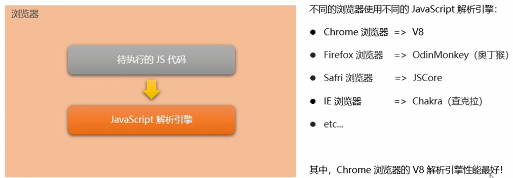
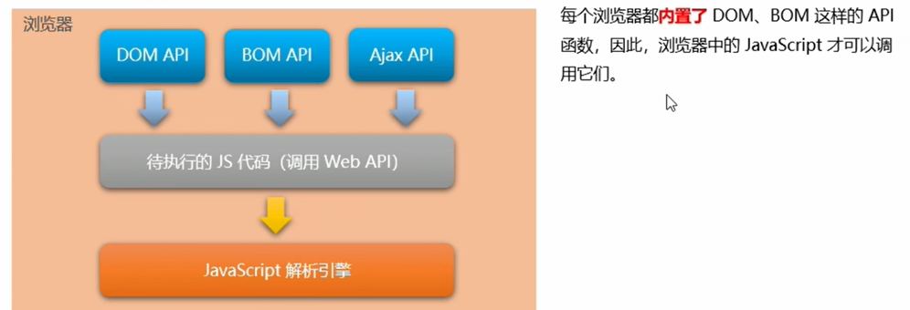
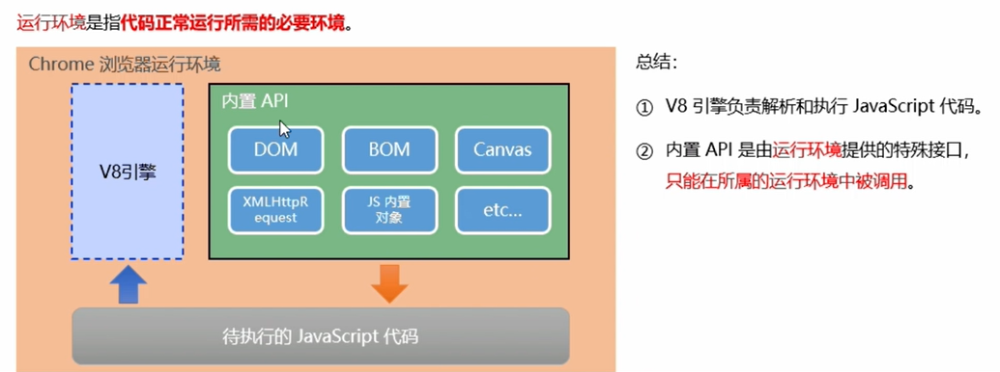
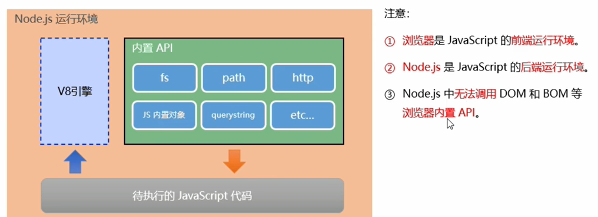

# 初始node.js

## 1 回顾

> 为什么js可以在浏览器中执行？




> 为什么js可以操作DOM和BOM？




> 浏览器的js运行环境




## 2 node.js简介

Node.js是一个基于Chrome V8引擎的JavaScript运行时环境。这是后端开发。


> node.js中的js运行环境




> node.js可以做什么

Node.js 作为一个JavaScript 的运行环境，仅仅提供了基础的功能和API。然而，基于Nodejs 提供的这些基础功能，有很多强大的工具和框架：

- 基于 Express框架，可以快速构建Web 应用
- 基于Electron框架，可以构建跨平台的桌面应用
- 基于restify框架，可以快速构建API接口项目读写和操作数据库、创建实用的命令行工具辅助前端开发...


## 3 fs文件系统模块

### 3.1 介绍

fs 模块是Node.js 官方提供的、用来操作文件的模块。它提供了一系列的方法和属性，用来满足用户对文件的操作需求。

例如:

- fs.readFile()方法，用来读取指定文件中的内容
- fs.writeFile)方法，用来向指定的文件中写入内容


### 3.2 使用

> 读文件

参数1∶必选参数，字符串，表示文件的路径。
参数2 : 可选参数，编码格式。
参数3︰必选参数，文件读取完成后，通过回调函数拿到读取的结果。

```js
fs.readFile(path[, options], callback)
```

```js
const fs = require('fs')

fs.readFile('./files/1.txt', 'utf8', function(err, result) {
  if (err) {
    return console.log('读取文件失败！' + err.message)
  }
  console.log('读取文件成功！' + result)
})
// 如果读取成功，则 err 的值为 null
// 如果读取失败，则 err 的值为 错误对象，result 的值为 undefined
```


> 写文件

参数1∶必选参数，表示文件的存放路径。

参数2∶必选参数，表示要写入的内容。

参数3 : 可选参数，格式，默认值是utf8。

参数4 : 必选参数，文件写入完成后的回调函数。

```js
fs.writeFile(file, data[, options], callback)
```

```js
fs.writeFile('./files/3.txt', 'ok123', function(err) {
  // 2.1 如果文件写入成功，则 err 的值等于 null
  // 2.2 如果文件写入失败，则 err 的值等于一个 错误对象
  if (err) {
    return console.log('文件写入失败！' + err.message)
  }
  console.log('文件写入成功！')
})
```


> 文件路径问题

`__dirname`表示当前文件所处的目录，防止文件路径出错

```js
fs.writeFile(__dirname + '/files/3.txt', 'ok123', function(err) {
  // 2.1 如果文件写入成功，则 err 的值等于 null
  // 2.2 如果文件写入失败，则 err 的值等于一个 错误对象
  if (err) {
    return console.log('文件写入失败！' + err.message)
  }
  console.log('文件写入成功！')
})
```


## 4 path路径模块

path模块是Node.,js 官方提供的、用来处理路径的模块。它提供了一系列的方法和属性，用来满足用户对路径的处理需求。

例如:

- path.join()方法，用来将多个路径片段拼接成一个完整的路径字符串
- path.basename()方法，用来从路径字符串中，将文件名解析出来


> join

```js
const pathStr = path.join('/a', '/b/c'， '../'， './d', 'e')
console.log(pathStr)
// \a\b\d\e
path.join(__dirname, '/file/1.txt')
```


> basename

```js
path.basename(fpath[, suffix])
// 定义文件的存放路径
const fpath = '/a/b/c/index.html'

const fullName = path.basename(fpath)
//index.html
const nameWithoutExt = path.basename(fpath, '.html')
// index
```


> extname

```js
// 这是文件的存放路径
const fpath = '/a/b/c/index.html'
const fext = path.extname(fpath)
// html
```


## 5 拆分页面文件实例

```js
const fs = require('fs')
const path = require('path')

const regStyle = /<style>[\s\S]*<\/style>/
const regScript = /<script>[\s\S]*<\/script>/

fs.readFile(path.join(__dirname, 'index.html'), 'utf8', function(err, dataStr) {
  if (err) return console.log('读取HTML文件失败！' + err.message)
  resolveCSS(dataStr)
  resolveJS(dataStr)
  resolveHTML(dataStr)
})

// 定义处理 css 样式的方法
function resolveCSS(htmlStr) {
  // 使用正则提取需要的内容
  const r1 = regStyle.exec(htmlStr)
  // 将提取出来的样式字符串，进行字符串的 replace 替换操作
  const newCSS = r1[0].replace('<style>', '').replace('</style>', '')
  fs.writeFile(path.join(__dirname, './clock/index.css'), newCSS, function(err) {
    if (err) return console.log('写入 CSS 样式失败！' + err.message)
    console.log('写入样式文件成功！')
  })
}

// 定义处理 js 脚本的方法
function resolveJS(htmlStr) {
  const r2 = regScript.exec(htmlStr)
  const newJS = r2[0].replace('<script>', '').replace('</script>', '')
  fs.writeFile(path.join(__dirname, './clock/index.js'), newJS, function(err) {
    if (err) return console.log('写入 JavaScript 脚本失败！' + err.message)
    console.log('写入 JS 脚本成功！')
  })
}

// 定义处理 HTML 结构的方法
function resolveHTML(htmlStr) {
  // 将字符串调用 replace 方法，把内嵌的 style 和 script 标签，替换为外联的 link 和 script 标签
  const newHTML = htmlStr
  	.replace(regStyle, '<link rel="stylesheet" href="./index.css" />')
  	.replace(regScript, '<script src="./index.js"></script>')
  fs.writeFile(path.join(__dirname, './clock/index.html'), newHTML, function(err) {
    if (err) return console.log('写入 HTML 文件失败！' + err.message)
    console.log('写入 HTML 页面成功！')
  })
}
```


## 6 http模块

http模块是Node.js官方提供的、用来创建web服务器的模块。通过 http模块提供的 http.createServer()方法，就能方便的把一台普通的电脑，变成一台Web服务器，从而对外提供 Web资源服务。

创建一个简单的实例

```js
// 1. 导入 http 模块
const http = require('http')
// 2. 创建 web 服务器实例
const server = http.createServer()
// 3. 为服务器实例绑定 request 事件，监听客户端的请求
server.on('request', function (req, res) {
  console.log('Someone visit our web server.')
})
// 4. 启动服务器
server.listen(8080, function () {  
  console.log('server running at http://127.0.0.1:8080')
})
```


> 两个对象

只要服务器接收到了客户端的请求，就会调用通过`server.on()`为服务器绑定的request事件处理函数。

`req`：客户端数据与属性；`res`：服务器端数据与属性

```js
// req 是请求对象，包含了与客户端相关的数据和属性
server.on('request', (req, res) => {
  // req.url 是客户端请求的 URL 地址
  const url = req.url
  // req.method 是客户端请求的 method 类型
  const method = req.method
  const str = `Your request url is ${url}, and request method is ${method}`
  console.log(str)
  // 调用 res.setHeader() 方法，设置 Content-Type 响应头，解决中文乱码的问题
  res.setHeader('Content-Type', 'text/html; charset=utf-8')
  // 调用 res.end() 方法，向客户端响应一些内容
  res.end(str)
})
```


## 7 模块化

### 7.1 概念

编程领域中的模块化：把一个大文件拆成独立并互相依赖的多个小模块。要遵循模块化规范。

把代码进行模块化拆分的好处:

- 提高了代码的复用性
- 提高了代码的可维护性
- 可以实现按需加载

Node.js 中根据模块来源的不同，将模块分为了3大类，分别是:

- 内置模块(内置模块是由Node.js 官方提供的，例如fs、path、http等)
- 自定义模块（用户创建的每个.js 文件，都是自定义模块)
- 第三方模块（由第三方开发出来的模块，并非官方提供的内置模块，也不是用户创建的自定义模块，使用前需要先下载)


> 模块作用域

和函数作用域类似，在自定义模块中定义的变量、方法等成员，只能在当前模块内被访问，这种模块级别的访问限制，叫做模块作用域。

好处：防止了全局变量污染


### 7.2 使用

#### 向外共享模块

> module对象

在每个`.js`自定义模块中都有一个`module`对象，它里面存储了和当前模块有关的信息

> module.export对象

在自定义模块中，可以使用`module.exports`对象，将模块内的成员共享出去，供外界使用。外界用`require()`方法导入自定义模块时，得到的就是`module.exports`所指向的对象。

> exports对象

由于`module.exports`单词写起来比较复杂，为了简化向外共享成员的代码，Node提供了`exports` 对象。默认情况下，`exports`和`module.exports` 指向同一个对缘。最终共享的结果，还是以`module.exports`指向的对象为准。

```js
// console.log(exports === module.exports)
// true
const username = 'zs'
module.exports.username = username
exports.age = 20
exports.sayHello = function() {
  console.log('大家好！')
}
```


### 7.3 nodejs的模块规范

`Node.js`遵循了`CommonJS`模块化规范，`CommonJS`规定了模块的特性和各模块之间如何相互依赖。

`CommonJS`规定:

- 每个模块内部，`module`变量代表当前模块。
- `module`变量是一个对象，它的`exports`属性(即`module.exports`）是对外的接口。
- 加载某个模块，其实是加载该模块的`module.exports`属性。`require()`方法用于加载模块。


## 8 npm与包

> 概念

`nodejs`的第三方模块又叫包

> 作用

由于Node.js 的内置模块仅提供了一些底层的API，导致在基于内置模块进行项目开发的时，效率很低。

包是基于内置模块封装出来的，提供了更高级、更方便的API，极大的提高了开发效率。

包和内置横块之间的关系，类似于iOuerv和浏览器内置API之间的关系


> 包的安装

`npm install xxx@版本号`或者`npm i xxx`，默认是最新版本，@指定版本

初次装包完成后，在项目文件夹下多一个叫做`node_modules`的文件夹和`package-lock.json`的配置文件。

其中:

- `node modules`文件夹用来存放所有已安装到项目中的包。`require()`导入第三方包时，就是从这个目录中查找并加载包
- `package-lock.json`配置文件用来记录`node modules`目录下的每一个包的下载信息，例如包的名字、版本号、下载地址等


> 包的语义化版本规范

包的版本号是以“点分十进制”形式进行定义的，总共有三位数字，例如2.24.0

其中每一位数字所代表的的含义如下:

- 第1位数字:大版本
- 第2位数字:功能版本
- 第3位数字:Bug修复版本


> 包管理配置文件

npm规定，在项目根目录中，必须提供一个叫做package.json的包管理配置文件。用来记录与项目有关的一些配置信息。例如:

- 项目的名称、版本号、描述等
- 项目中都用到了哪些包
- 哪些包只在开发期间会用到
- 那些包在开发和部署时都需要用到

今后在项目开发中，一定要把`node_modules`文件夹，添加到`.gitignore`忽略文件中。


> package.json

npm包管理工具提供了一个快捷命令，可以在执行命令时所处的目录中，快速创建`package,json`这个包管理配置文件:`npm init -y`，该命令运行目录只能是英文的。

运行`npm install` 命令安装包的时候，npm包管理工具会自动把包的名称和版本号，记录到`package,json`中。


> 包记录节点

如果某些包只在项目开发阶段会用到，在项目上线之后不会用到，则建议把这些包记录到`devDependencies`节点中。

与之对应的，如果某些包在开发和项目上线之后都需要用到，则建议把这些包记录到`dependencies`节点中。

```js
//安装指定的包，并记录到devDependencies节点中
npm i 包名 -D
//注意:上述命令是简写形式，等价于下面完整的写法:
npm install 包名 --save-dev
```


> npm镜像源

下包镜像源就是下包的服务器地址

```shell
#查看当前的下包镜像源
npm config get registry
#将下包的镜像源切换为淘宝镜像源
npm config set registry=https://registry.npm.taobao.org/
```


> nrm

为了更方便的切换下包的镜像源，我们可以安装`nrm`工具，利用`nrm`提供的终端命令，可以快速查看和切换下包的镜像源。

```shell
#通过npm包管理器，将nrm安装为全局可用的工具
npm i nrm -g
#查看所有可用的镜像源
nrm ls
#将下包的镜像源切换为taobao镜像
nrm use taobao
```


> 包的分类

**项目包**

那些被安装到项目的`node_modules`目录中的包，都是项目包。项目包又分为两类，分别是:

- 开发依赖包(被记录到devDependencies节点中的包，只在开发期间会用到)
- 核心依赖包(被记录到dependencies节点中的包，在开发期间和项目上线之后都会用到)

**全局包**

在执行`npm install`命令时，如果提供了`-g`参数，则会把包安装为全局包。

全局包会被安装到`C\Users\用户目录\AppData\Roaming\npm\node_modules`目录下。


> 规范包结构

一个规范的包，它的组成结构，必须符合以下3点要求:

- 包必须以单独的目录而存在
- 包的顶级目录下要必须包含`package.json`这个包管理配置文件
- `package.json`中必须包含`name`,`version`,`main`这三个属性，分别代表包的名字、版本号、包的入口。


> 模块加载机制

**优先从缓存中加载**

模块在第一次加载后会被缓存。这也意味着多次调用require()不会导致模块的代码被执行多次。

注意:不论是内置模块、用户自定义模块、还是第三方模块，它们都会优先从缓存中加载，从而提高模块的加载效率。

**内置模块的加载优先级最高**

存在相同名字的内置模块和第三方模块时，优先内置模块

**自定义模块加载**

使用require()加载自定义模块时，必须指定以`./`或`../`开头的路径标识符。在加载自定义模块时，如果没有指定`./`或`../`这样的路径标识符，则 node 会把它当作内置模块或第三方模块进行加载。

同时，在使用require()导入自定义模块时，如果省略了文件的扩展名，则Node.js 会按顺序分别尝试加载以下的文件:

1. 按照确切的文件名进行加载
2. 补全.js扩展名进行加载
3. 补全.json扩展名进行加载
4. 补全.node扩展名进行加载
5. 加载失败，终端报错

**第三方库加载**

如果传递给require()的模块标识符不是一个内置模块，也没有以`./`或`../`开头，则Nodejs 会从当前模块的父目录开始，尝试从`/node_modules`文件夹中加载第三方模块。

如果没有找到对应的第三方模块，则移动到再上一层父目录中，进行加载，直到文件系统的根目录。

例如，假设在'CN\Users\itheimalproject\foo.js'文件里调用了require('tools')，则Node.js 会按以下顺序查找:
C:\Users\itheimaproject\node_modules\tools
C:\Users\itheimanode_modules\tools
C\Users\node_modules\tools
C:\node_modules\tools

**目录作为模块**

当把目录作为模块标识符，传递给`require()`进行加载的时候，有三种加载方式:

在被加载的目录下查找一个叫做`package.json`的文件，并寻找`main`属性，作为`require()`加载的入口

如果目录里没有`package.json`文件，或者`main`入口不存在或无法解析，则Node.js将会试图加载目录下的`index.js`文件

如果两步都失败了，则Node.js会在终端打印错误消息，报告模块的缺失:`Error : Cannot find module 'koo'`


## 9 Express

### 9.1 概念

官方给出的概念: Express是基于Node.js 平台，快速、开放、极简的Web开发框架。

通俗的理解: Express 的作用和Node.js内置的 http模块类似，是专门用来创建Web 服务器的。

Express的本质:就是一个npm 上的第三方包，提供了快速创建Web 服务器的便捷方法。

Express是基于内置的http模块进一步封装出来的，能够极大的提高开发效率。


### 9.2 基本使用

```js
const express = require('express')

const app = express()

app.get('/user', (req, res) => {
  // get中的参数
  const query = req.query;
  res.send({
    username: 'tom'
  });
})

app.get('/question/:id', (req, res) => {
  const id = req.params.id;
  res.send(id);
})

app.post('addUser', (req, res) => {
  res.send("post addUser");
})

app.listen(80, () => {
  console.log('start an app')
})
```


### 9.3 托管静态资源

express提供了一个非常好用的函数，叫做`express.static()`，通过它，我们可以非常方便地创建一个静态资源服务器，例如，通过如下代码就可以将public目录下的图片、CSS文件、JavaScript 文件对外开放访问了:

需要使用**绝对路径**

```js
app.use(express.static(path.join(__dirname, '../day1')))
```

也可以托管多个静态资源目录，多次调用这个目录即可

会按照调用的顺序进行搜索

```js
app.use(express.static('public'))
app.use(express.static('files'))
// 以上的方式都不需要加public前缀，如果需要指定前缀可以使用如下的形式
app.use('/public', express.static('public'))
```


### 9.4 nodemon

在编写调试Node,js项目的时候，如果修改了项目的代码，则需要频繁的手动close掉，然后再重新启动，非常繁琐。

现在，我们可以使用`nodemon`这个工具，它能够监听项目文件的变动，当代码被修改后，`nodemon`会自动帮我们重启项目，极大方便了开发和调试。

安装：`npm i -g nodemon`

现在，我们可以将node命令替换为nodemon命令，使用`nodemon app.js`来启动项目。这样做的好处是:代码皮修改之后，会被nodemon监听到，从而实现自动重启项目的效果。


### 9.5 Express路由

为了方便对路由进行模块化的管理，Express 不建议将路由直接挂载到app上，而是推荐将路由抽离为单独的模块。将路由抽离为单独模块的步骤如下:

- 创建路由模块对应的.js 文件
- 调用express.Router()函数创建路由对象
- 向路由对象上挂载具体的路由
- 使用module.exports向外共享路由对象

- 使用app.use()函数注册路由模块

```js
// 这是路由模块route.js
// 1. 导入 express
const express = require('express')
// 2. 创建路由对象
const router = express.Router()
// 3. 挂载具体的路由
router.get('/user/list', (req, res) => {
  res.send('Get user list.')
})
router.post('/user/add', (req, res) => {
  res.send('Add new user.')
})
// 4. 向外导出路由对象
module.exports = router

// 注册使用app.js
// 1. 导入路由模块
const router = require('./03.router')
// 2. 注册路由模块,这里同时添加了路由前缀
app.use('/api', router)
// 注意： app.use() 函数的作用，就是来注册全局中间件
```


### 9.5 Express中间件

express中间件的实质是一个函数，

> next函数

next函数是实现多个中间件连续调用的关键，它表示把流转关系转交给下一个中间件或路由。

> 定义全局生效中间件

客户端发起的任何请求，到达服务器之后，都会触发的中间件，叫做全局生效的中间件。

通过调用`app.use(中间件函数)`，即可定义一个全局生效的中间件，示例代码如下:

可以使用`app.use()`连续定义多个全局中间件。客户端请求到达服务器之后，会按照中间件定义的**先后顺序**依次进行调用，示例代码如下:

```js
const mw = function (req, res, next) {
  console.log('这是最简单的中间件函数')
  // 把流转关系，转交给下一个中间件或路由
  next()
}
// 将 mw 注册为全局生效的中间件
app.use(mw)

// 之后再写路由...
```

> 中间件作用

多个中间件之间，共享同一份req和res。基于这样的特性，我们可以在上游的中间件中，统一为req或res 对象添加自定义的属性或方法，供下游的中间件或路由进行使用。

> 局部中间件

```js
// 1. 定义中间件函数
const mw1 = (req, res, next) => {
  console.log('调用了局部生效的中间件')
  next()
}
// 2. 创建路由
app.get('/', mw1, (req, res) => {
  res.send('Home page.')
})

// 创建多个
// 逗号分隔或者使用数组都可以
app.get('/', mw1, mw2, (req, res) => {
  res.send('Home page.')
})
app.get('/', [mw1, mw2], (req, res) => {
  res.send('Home page.')
})
```

> 总结

- 一定要在路由之前注册中间件
- 客户端发送过来的请求，可以连续调用多个中间件进行处理
- 执行完中间件的业务代码之后，不要忘记调用next()函数
- 为了防止代码逻辑混乱，调用next()函数后不要再写额外的代码
- 连续调用多个中间件时，多个中间件之间，共享req和res对象

> 中间件分类

**应用级别中间件**

通过app.use()或 app.get()或 app.post()，绑定到app实例上的中间件，叫做应用级别的中间件

**路由级别中间件**

绑定到express.Router()实例上的中间件，叫做路由级别的中间件。它的用法和应用级别中间件没有任何区别。只不过，应用级别中间件是绑定到 app 实例上，路由级别中间件绑定到 router实例上

```js
router.use(function() => {})
```

**错误级别中间件**

错误级别中间件的作用:专门用来捕获整个项目中发生的异常错误，从而防止项目异常崩溃的问题。

格式:错误级别中间件的 function处理函数中，必须有4个形参，形参顺序从前到后，分别是`(err, req, res, next)`。

需要注册在所有路由之后

```j**s
// 1. 定义路由
app.get('/', (req, res) => {
  // 制造错误
  throw new Error('服务器内部发生了错误！')
  res.send('Home page.')
})

// 2. 定义错误级别的中间件，捕获整个项目的异常错误，从而防止程序的崩溃
app.use((err, req, res, next) => {
  console.log('发生了错误！' + err.message)
  res.send('Error：' + err.message)
})
```

**Express内置中间件**

自Express 4.16.0版本开始，Express 内置了3个常用的中间件，极大的提高了Express项目的开发效率和体验:

- express.static快速托管静态资源的内置中间件，例如: HTML文件、图片、CSS样式等(无兼容性)
- express.json解析JSON格式的请求体数据（有兼容性，仅在4.16.0+版本中可用)
- express.urlencoded解析URL-encoded格式的请求体数据（有兼容性，仅在4.16.0+版本中可用)

```js
// 通过 express.json() 这个中间件，解析表单中的 JSON 格式的数据
app.use(express.json())
// 通过 express.urlencoded() 这个中间件，来解析 表单中的 url-encoded 格式的数据
app.use(express.urlencoded({ extended: false }))

app.post('/user', (req, res) => {
  // 在服务器，可以使用 req.body 这个属性，来接收客户端发送过来的请求体数据
  // 默认情况下，如果不配置解析表单数据的中间件，则 req.body 默认等于 undefined
  console.log(req.body)
  res.send('ok')
})
```

**第三方中间件**

非Express 官方内置的，而是由第三方开发出来的中间件，叫做第三方中间件。在项目中，可以按需下载并配置第三方中间件，从而提高项目的开发效率。

例如:在 express@4.16.0之前的版本中，经常使用body-parser这个第三方中间件，来解析请求体数据。使用步骤如下:

- 运行 npm install body-parser安装中间件
- 使用require 导入中间件
- 调用app.use()注册并使用中间件

### 9.6 跨域问题

```js
// 一定要在路由之前，配置 cors 这个中间件，从而解决接口跨域的问题
const cors = require('cors')
app.use(cors())
```


## 10 整合mysql

需要先安装`npm install mysql`

```js
// 1. 导入 mysql 模块
const mysql = require('mysql')
// 2. 建立与 MySQL 数据库的连接关系
const db = mysql.createPool({
  host: '127.0.0.1', // 数据库的 IP 地址
  user: 'root', // 登录数据库的账号
  password: 'admin123', // 登录数据库的密码
  database: 'my_db_01', // 指定要操作哪个数据库
})

const user = { username: 'Spider-Man', password: 'pcc123' }
// 定义待执行的 SQL 语句
const sqlStr = 'insert into users (username, password) values (?, ?)'
// 执行 SQL 语句
db.query(sqlStr, [user.username, user.password], (err, results) => {
  // 执行 SQL 语句失败了
  if (err) return console.log(err.message)
  // 成功了
  // 注意：如果执行的是 insert into 插入语句，则 results 是一个对象
  // 可以通过 affectedRows 属性，来判断是否插入数据成功
  if (results.affectedRows === 1) {
    console.log('插入数据成功!')
  }
})

// 简写形式，会自动对应键和字段名
const user = { username: 'Spider-Man2', password: 'pcc4321' }
// 定义待执行的 SQL 语句
const sqlStr = 'insert into users set ?'
// 执行 SQL 语句
db.query(sqlStr, user, (err, results) => {
  if (err) return console.log(err.message)
  if (results.affectedRows === 1) {
    console.log('插入数据成功')
  }
})

// 更新数据
const user = { id: 6, username: 'aaa', password: '000' }
// 定义 SQL 语句
const sqlStr = 'update users set username=?, password=? where id=?'
// 执行 SQL 语句
db.query(sqlStr, [user.username, user.password, user.id], (err, results) => {
  if (err) return console.log(err.message)
  // 注意：执行了 update 语句之后，执行的结果，也是一个对象，可以通过 affectedRows 判断是否更新成功
  if (results.affectedRows === 1) {
    console.log('更新成功')
  }
})

// 更新数据便捷方式
const user = { id: 6, username: 'aaaa', password: '0000' }
// 定义 SQL 语句
const sqlStr = 'update users set ? where id= ?'
// 执行 SQL 语句
db.query(sqlStr, [user, user.id], (err, results) => {
  if (err) return console.log(err.message)
  if (results.affectedRows === 1) {
    console.log('更新数据成功')
  }
})
```


## 11 身份认证

> session认证（cookie+认证）

Cookie 是**存储在用户浏览器中的一段不超过 4 KB 的字符串**。它由一个名称（Name）、一个值（Value）和其它几个用于控制 Cookie 有效期、安全性、使用范围的可选属性组成。

不同域名下的 Cookie 各自独立，每当客户端发起请求时，会**自动**把**当前域名下**所有**未过期的 Cookie** 一同发送到服务器。

**Cookie的几大特性：**

- 自动发送
- 域名独立
- 过期时限
- 4KB 限制

缺点：Session 认证机制需要配合 Cookie 才能实现。由于 Cookie 默认不支持跨域访问，所以，当涉及到前端跨域请求后端接口的时候，**需要做很多额外的配置**，才能实现跨域 Session 认证。

安装：`npm install express-session`

```js
// 导入 express 模块
const express = require('express')
// 创建 express 的服务器实例
const app = express()

// TODO_01：请配置 Session 中间件
const session = require('express-session')
app.use(
  session({
    secret: 'itheima', // 随便填个字符串
    resave: false,
    saveUninitialized: true,
  })
)

// 托管静态页面
app.use(express.static('./pages'))
// 解析 POST 提交过来的表单数据
app.use(express.urlencoded({ extended: false }))

// 登录的 API 接口
app.post('/api/login', (req, res) => {
  // 判断用户提交的登录信息是否正确
  if (req.body.username !== 'admin' || req.body.password !== '000000') {
    return res.send({ status: 1, msg: '登录失败' })
  }

  // TODO_02：请将登录成功后的用户信息，保存到 Session 中
  // 注意：只有成功配置了 express-session 这个中间件之后，才能够通过 req 点出来 session 这个属性
  req.session.user = req.body // 用户的信息
  req.session.islogin = true // 用户的登录状态

  res.send({ status: 0, msg: '登录成功' })
})

// 获取用户姓名的接口
app.get('/api/username', (req, res) => {
  // TODO_03：请从 Session 中获取用户的名称，响应给客户端
  if (!req.session.islogin) {
    return res.send({ status: 1, msg: 'fail' })
  }
  res.send({
    status: 0,
    msg: 'success',
    username: req.session.user.username,
  })
})

// 退出登录的接口
app.post('/api/logout', (req, res) => {
  // TODO_04：清空 Session 信息
  req.session.destroy()
  res.send({
    status: 0,
    msg: '退出登录成功',
  })
})

// 调用 app.listen 方法，指定端口号并启动web服务器
app.listen(80, function () {
  console.log('Express server running at http://127.0.0.1:80')
})
```


> jwt认证

JWT 通常由三部分组成，分别是 Header（头部）、Payload（有效荷载）、Signature（签名）。

三者之间使用英文的“.”分隔，格式如下：`Header.Payload.Signature`

**Payload** 部分**才是真正的用户信息**，它是用户信息经过加密之后生成的字符串。Header 和 Signature 是**安全性相关**的部分，只是为了保证 Token 的安全性。

客户端收到服务器返回的 JWT 之后，通常会将它储存在 localStorage 或 sessionStorage 中。

此后，客户端每次与服务器通信，都要带上这个 JWT 的字符串，从而进行身份认证。推荐的做法是**把 JWT 放在 HTTP请求头的 Authorization 字段中**，格式如下：`Authorization: Bearer <token>`

安装：`npm install jsonwebtoken express-jwt`，`jsonwebtoken`用于生成 JWT 字符串，`express-jwt`用于将 JWT 字符串解析还原成 JSON 对象

```js

const express = require('express')
// 创建 express 的服务器实例
const app = express()

const jwt = require('jsonwebtoken')
const expressJWT = require('express-jwt')

// 允许跨域资源共享
const cors = require('cors')
app.use(cors())

// 解析 post 表单数据的中间件
const bodyParser = require('body-parser')
app.use(bodyParser.urlencoded({ extended: false }))

// TODO_02：定义 secret 密钥，建议将密钥命名为 secretKey
const secretKey = 'itheima No1 ^_^'

// TODO_04：注册将 JWT 字符串解析还原成 JSON 对象的中间件
// 注意：只要配置成功了 express-jwt 这个中间件，就可以把解析出来的用户信息，挂载到 req.user 属性上
app.use(expressJWT({ secret: secretKey }).unless({ path: [/^\/api\//] }))

// 登录接口
app.post('/api/login', function (req, res) {
  // 将 req.body 请求体中的数据，转存为 userinfo 常量
  const userinfo = req.body
  // 登录失败
  if (userinfo.username !== 'admin' || userinfo.password !== '000000') {
    return res.send({
      status: 400,
      message: '登录失败！',
    })
  }
  // 登录成功
  // TODO_03：在登录成功之后，调用 jwt.sign() 方法生成 JWT 字符串。并通过 token 属性发送给客户端
  // 参数1：用户的信息对象
  // 参数2：加密的秘钥
  // 参数3：配置对象，可以配置当前 token 的有效期
  // 记住：千万不要把密码加密到 token 字符中
  const tokenStr = jwt.sign({ username: userinfo.username }, secretKey, { expiresIn: '30s' })
  res.send({
    status: 200,
    message: '登录成功！',
    token: tokenStr, // 要发送给客户端的 token 字符串
  })
})

// 这是一个有权限的 API 接口
app.get('/admin/getinfo', function (req, res) {
  // TODO_05：使用 req.user 获取用户信息，并使用 data 属性将用户信息发送给客户端
  console.log(req.user)
  res.send({
    status: 200,
    message: '获取用户信息成功！',
    data: req.user, // 要发送给客户端的用户信息
  })
})

// TODO_06：使用全局错误处理中间件，捕获解析 JWT 失败后产生的错误
app.use((err, req, res, next) => {
  // 这次错误是由 token 解析失败导致的
  if (err.name === 'UnauthorizedError') {
    return res.send({
      status: 401,
      message: '无效的token',
    })
  }
  res.send({
    status: 500,
    message: '未知的错误',
  })
})

// 调用 app.listen 方法，指定端口号并启动web服务器
app.listen(8888, function () {
  console.log('Express server running at http://127.0.0.1:8888')
})
```

