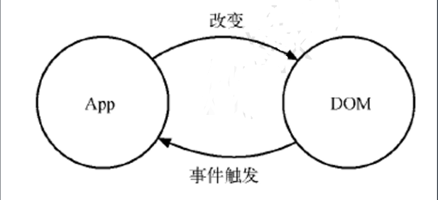
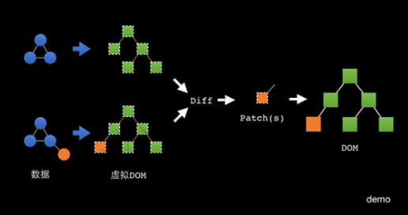
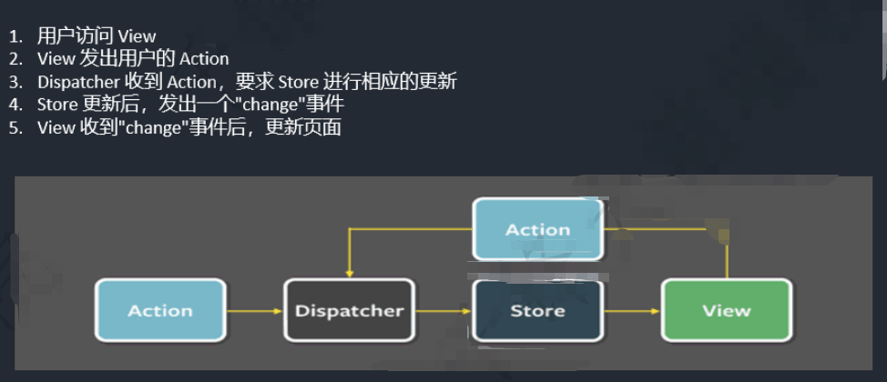
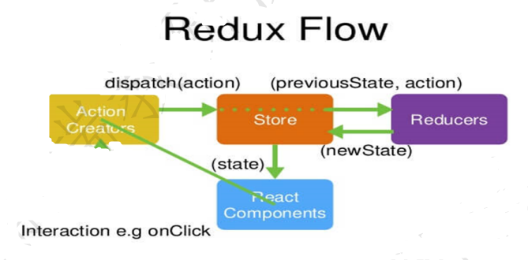
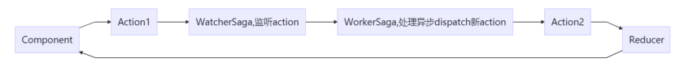

# React新学习笔记

## 一. React介绍

### 1.React起源与发展

React 起源于 Facebook 的内部项目，因为该公司对市场上所有 JavaScript MVC 框架，都不满意，就决定自己写一套，用来架设Instagram 的网站。做出来以后，发现这套东西很好用，就在2013年5月开源 了。 

### 2.React与传统MVC的关系

轻量级的视图层库！A JavaScript library for building user interfaces

React不是一个完整的MVC框架，最多可以认为是MVC中的V（View），甚至React并不非常认可MVC开发模式；React 构建页面 UI 的库。可以简单地理解为，React 将界面分成了各个独立的小块，每一个块就是组件，这些组件之间可以组合、嵌套，就成了我们的页面。

### 3.React特性

1.声明式设计-React采用声明范式，可以轻松描述应用。

2.高效-React通过对DOM的模拟(虚拟dom)，最大限度地减少与DOM的交互

3.灵活-React可以与已知的库或框架很好地配合。

4.JSX-JSX是JavaScript 语法的扩展。

5.组件-通过 React 构建组件，使得代码更加容易得到复用，能够很好的应用在大项目的开发中

6.单向响应的数据流- React 实现了单向响应的数据流，从而减少了重复代码，这也是它为什么比传统数据绑定更简单。

### 4.虚拟dom

传统dom更新:

真实页面对应一个DOM 树。在传统页面的开发模式中，每次需要更新页面时，都要手动操作 DOM来进行更新:



虚拟dom:

DOM 操作非常昂贵。在前端开发中，性能消耗最大的就是 DOM 操作，而且这部分代码会让整体项目的代码变得难以维护。React 把真实 DOM 树转换成JavaScript 对象树，也就是 Virtual DOM:




## 二、基本使用

### 1.构建项目

全局安装create-react-app

```shell
$ npm install -g create-react-app
```

创建一个项目

```shell
$ create-react-app your-app
```

如果不想全局安装，可以直接使用npx

```shell
$ npx create-react-app myapp 
```

这个过程实际上会安装三个东西:

- react: react的顶级库 
- react-dom: 因为react有很多的运行环境，比如app端的react-native, 我们要在web上运行就使用 react-dom 
- react-scripts: 包含运行和打包react应用程序的所有脚本及配置

><React.StrictMode>目前有助于： 
>
>- 识别不安全的生命周期
>- 关于使用过时字符串 ref API 的警告
>- 检测意外的副作用
>- 检测过时的 context API


### 2.jsx语法和组件

#### 2.1.jsx

[JSX](https://legacy.reactjs.org/docs/introducing-jsx.html) 将 HTML 语法直接加入到 JavaScript 代码中，再通过翻译器转换到纯 JavaScript 后由浏览器执行。 在实际开发中，JSX 在产品打包阶段都已经编译成纯 JavaScript，不会带来任何副作用，反而会让代码更加直观并易于维护。 编译过程由Babel 的 JSX 编译器实现。

使用`{}`单括号来引用变量

原理是什么呢？

要明白JSX的原理，需要先明白如何用 JavaScript 对象来表现一个 DOM 元素的结构?

看下面的DOM结构

```html
<div class='app' id='appRoot'>
  <h1 class='title'>欢迎进入React的世界</h1>
  <p>
  	React.js 是一个帮助你构建页面 UI 的库
  </p>
</div>
```

上面这个 HTML 所有的信息我们都可以用 JavaScript 对象来表示：

```json
{
  tag: 'div',
  attrs: { className: 'app', id: 'appRoot'},
  children: [
    {
      tag: 'h1',
      attrs: { className: 'title' },
      children: ['欢迎进入React的世界']
    },
    {
      tag: 'p',
      attrs: null,
      children: ['React.js 是一个构建页面 UI 的库']
    }
  ]
}
```

但是用 JavaScript 写起来太长了，结构看起来又不清晰，用 HTML 的方式写起来就方便很多了。 

于是 React.js 就把 JavaScript 的语法扩展了一下，让 JavaScript 语言能够支持这种直接在 JavaScript 代码里面编写类似 HTML 标签结构的语法，这样写起来就方便很多了。编译的过程会把类似 HTML 的 JSX 结构转换成JavaScript 的对象结构

```jsx
import React from 'react'
import ReactDOM from 'react-dom'
class App extends React.Component {
  render () {
    return (
      <div className='app' id='appRoot'>
      	<h1 className='title'>欢迎进入React的世界</h1>
        <p>
          React.js 是一个构建页面 UI 的库
        </p>
      </div>
    )
  }
}
ReactDOM.render(
  <App />,
  document.getElementById('root')
)
```

编译之后将得到这样的代码:

```json
import React from 'react'
import ReactDOM from 'react-dom'
class App extends React.Component {
  render () {
    return (
      React.createElement(
        "div",
        {
          className: 'app',
          id: 'appRoot'
        },
        React.createElement(
          "h1",
          { className: 'title' },
          "欢迎进入React的世界"
        ),
        React.createElement(
          "p",
          null,
          "React.js 是一个构建页面 UI 的库"
        )
      )
    )
  }
}
ReactDOM.render(
  React.createElement(App),
  document.getElementById('root')
)
```

`React.createElement` 会构建一个 JavaScript 对象来描述你 HTML 结构的信息，包括标签名、属性、 还有子元素等, 语法为

```jsx
React.createElement(
  type,
  [props],
  [...children]
)
```

所谓的 JSX 其实就是 JavaScript 对象，所以使用 React 和 JSX 的时候一定要经过编译的过程:

>JSX —使用react构造组件，bable进行编译—> JavaScript对象 — ReactDOM.render() —>DOM 元素 —>插入页面


#### 2.2.Class组件

ES6的加入让JavaScript直接支持使用class来定义一个类，react创建组件的方式就是使用的类的继承， ES6 class 是目前官方推荐的使用方式，它使用了ES6标准语法来构建，看以下代码：

```jsx
import React from 'react'
import ReactDOM from 'react-dom'
class App extends React.Component {
  render () {
    return (
      <h1>欢迎进入React的世界</h1>
    )
  }
}
ReactDOM.render(
  <App />,
  document.getElementById('root')
)
```

es6 class 组件其实就是一个构造器,每次使用组件都相当于在实例化组件，像这样：

```jsx
import React from 'react'
import ReactDOM from 'react-dom'
class App extends React.Component {
  render () {
    return (
      <h1>欢迎进入{this.props.name}的世界</h1>
    )
  }
}
const app = new App({
  name: 'react'
}).render()
ReactDOM.render(
  app,
  document.getElementById('root')
)
```


#### 2.3.函数式组件

组件名必须大写，否则报错

```jsx
import React from 'react'
import ReactDOM from 'react-dom'
const App = (props) => <h1>欢迎进入React的世界</h1>
ReactDOM.render(
  // React组件的调用方式
  <App />,
  document.getElementById('root')
)
```


#### 2.4.组件样式

> 行内样式

想给虚拟dom添加行内样式，需要使用表达式传入样式对象的方式来实现：

```jsx
// 注意这里的两个括号，第一个表示我们在要JSX里插入JS了，第二个是对象的括号
<p style={{color:'red', fontSize:'14px'}}>Hello world</p>
```

行内样式需要写入一个样式对象，样式对象的位置可以放在很多地方，例如 render 函数里、组件原型上、外链js文件中

> 使用 class

React推荐我们使用行内样式，因为React觉得每一个组件都是一个独立的整体

其实大多数情况下还是大量的在为元素添加类名，但是需要注意的是， class 需要写成 className （因为毕竟是在写类js代码，会收到js规则的限制，而 class 是关键字）

> 注意： class ==> className , for ==> htmlFor(label)


> css module

[官网](https://create-react-app.dev/docs/adding-a-css-modules-stylesheet/)

This project supports [CSS Modules](https://github.com/css-modules/css-modules) alongside regular stylesheets using the `[name].module.css` file naming convention. CSS Modules allows the scoping of CSS by automatically creating a unique classname of the format `[filename]\_[classname]\_\_[hash]`.

> **Tip:** Should you want to preprocess a stylesheet with Sass then make sure to [follow the installation instructions](https://create-react-app.dev/docs/adding-a-sass-stylesheet) and then change the stylesheet file extension as follows: `[name].module.scss` or `[name].module.sass`.

CSS Modules let you use the same CSS class name in different files without worrying about naming clashes. Learn more about CSS Modules [here](https://css-tricks.com/css-modules-part-1-need/).

`Button.module.css`

```css
.error {
  background-color: red;
}
```

`another-stylesheet.css`

```css
.error {
  color: red;
}
```

`Button.js`

```js
import React, { Component } from 'react';
import styles from './Button.module.css'; // Import css modules stylesheet as styles
import './another-stylesheet.css'; // Import regular stylesheet

class Button extends Component {
  render() {
    // reference as a js object
    return <button className={styles.error}>Error Button</button>;
  }
}
```

Result

No clashes from other `.error` class names

```html
<!-- This button has red background but not red text -->
<button class="Button_error_ax7yz">Error Button</button>
```

**This is an optional feature.** Regular `<link>` stylesheets and CSS files are fully supported. CSS Modules are turned on for files ending with the `.module.css` extension.

> 如果不想要某个样式模块化，可以使用`:global()`包裹，将会变成全局样式


#### 2.5.事件处理 

> 绑定事件

采用on+事件名的方式来绑定一个事件，注意，这里和原生的事件是有区别的，原生的事件全是小写 onclick , React里的事件是驼峰 onClick ，React的事件并不是原生事件，而是合成事件。

> 事件handler的写法

- 直接在render里写行内的箭头函数(不推荐)
- **在组件内使用箭头函数定义一个方法(推荐)** 
- 直接在组件内定义一个非箭头函数的方法，然后在render里直接使用 onClick= {this.handleClick.bind(this)} (不推荐)
- 直接在组件内定义一个非箭头函数的方法，然后在constructor里bind(this)(推荐)

> Event 对象

和普通浏览器一样，事件handler会被自动传入一个 event 对象，这个对象和普通的浏览器 event 对象所包含的方法和属性都基本一致。不同的是 React中的 event 对象并不是浏览器提供的，而是它自己内部所构建的。它同样具有 `event.stopPropagation`、`event.preventDefault` 这种常用的方法


#### 2.6.Ref的应用

给标签设置ref="username" 通过this.refs.username , ref可以获取到应用的真实dom 

给组件设置ref="username" 通过this.refs.username ,ref可以获取到组件对象 

新的写法:

```jsx
myRef = React.createRef()
<div ref={this.myRef}>hello</div>
// 访问this.myRef.current
```


## 三、组件的数据挂载方式

### 1.状态state

状态就是组件描述某种显示情况的数据，由组件自己设置和更改，也就是说由组件自己维护，使用状态的目的就是为了在不同的状态下使组件的显示不同(自己管理)

#### 1.1.定义state

```jsx
class App extends Component {
  state = {
    name: 'React',
    isLiked: false
  }
}
// or
class App extends Component {
  constructor() {
    super()
    this.state = {
      name: 'React',
      isLiked: false
    }
  }
}
```

this.state 是纯js对象。在vue中，data属性是利用 Object.defineProperty 处理过的，更改data的数据的时候会触发数据的 getter 和 setter ，但是React中没有做这样的处理，如果直接更改的话，react是无法得知的，所以，需要使用特殊的更改状态的方法 setState 。

#### 1.2.setState

setState 有两个参数

第一个参数可以是对象，也可以是方法return一个对象，我们把这个参数叫做 updater

参数是对象

```jsx
this.setState({
  isLiked: !this.state.isLiked
})
```

参数是方法：

注意的是这个方法接收两个参数，第一个是上一次的state, 第二个是props

```jsx
this.setState((prevState, props) => {
  return {
    isLiked: !prevState.isLiked
  }
})
```

setState 是异步的，所以想要获取到最新的state，没有办法获取，就有了第二个参数，这是一个可选的回调函数

```jsx
this.setState((prevState, props) => {
  return {
    isLiked: !prevState.isLiked
  }
}, () => {
  console.log('回调里的',this.state.isLiked)
})
```


### 2.属性props

props 是正常是外部传入的，组件内部也可以通过一些方式来初始化的设置，属性不能被组件自己更 改，但是你可以通过父组件主动重新渲染的方式来传入新的 props

属性是描述性质、特点的，组件自己不能随意更改。 

总的来说，在使用一个组件的时候，可以把参数放在标签的属性当中，所有的属性都会作为组件 props 对象的键值。通过箭头函数创建的组件，需要通过函数的参数来接收 props :

(1) 在组件上通过key=value 写属性,通过this.props获取属性,这样组件的可复用性提高了。

(2) 注意在传参数时候，如果写成isShow="true" 那么这是一个字符串 如果写成isShow={true} 这个 是布尔值

(3) {...对象} 展开赋值

(4) 默认属性值

```jsx
类名.defaultProps = {
}
// or 写成静态属性
static defaultProps = {
  myname:"默认的myname",
  myshow:true
}
```

(5) prop-types 属性验证

```jsx
import propTypes from "prop-types";
类名.propTypes={
  name:propTypes.string,
  age:propTypes.number
}
static propTypes={
  myname:propTypes.string,
  myshow:propTypes.bool
}
```


### 3.属性和状态

相似点：都是纯js对象，都会触发render更新，都具有确定性（状态/属性相同，结果相同） 

不同点： 

1. 属性能从父组件获取，状态不能 
2. 属性可以由父组件修改，状态不能 
3. 属性能在内部设置默认值，状态也可以，设置方式不一样 
4. 属性不在组件内部修改，状态要在组件内部修改 
5. 属性能设置子组件初始值，状态不可以 
6. 属性可以修改子组件的值，状态不可以

state 的主要作用是用于组件保存、控制、修改自己的可变状态。 state 在组件内部初始化，可以被组件自身修改，而外部不能访问也不能修改。你可以认为 state 是一个局部的、只能被组件自身控制的数据源。 state 中状态可以通过 this.setState 方法进行更新，setState 会导致组件的重新渲染。 

props 的主要作用是让使用该组件的父组件可以传入参数来配置该组件。它是外部传进来的配置参数，组件内部无法控制也无法修改。除非外部组件主动传入新的 props ，否则组件的props永远保持 不变。 

没有 state 的组件叫无状态组件（stateless component），设置了 state 的叫做有状态组件（stateful component）。因为状态会带来管理的复杂性，我们尽量多地写无状态组件，尽量少地写有状态的组件。这样会降低代码维护的难度，也会在一定程度上增强组件的可复用性。


### 4.渲染数据

> 条件渲染

```jsx
{
  condition ? '渲染列表的代码' : '空空如也'
}
```

> 列表渲染

```jsx
{
  people.map(person => {
    return (
      <dl key={person.id}>
        <dt>{person.name}</dt>
        <dd>age: {person.age}</dd>
      </dl>
    )
  })
}
```

React的高效依赖于所谓的 Virtual-DOM，尽量不碰 DOM。对于列表元素来说会有一个问题：元素可能会在一个列表中改变位置。要实现这个操作，只需要交换一下 DOM 位置就行了，但是React并不知道 其实我们只是改变了元素的位置，所以它会重新渲染后面两个元素（再执行 Virtual-DOM ），这样会大大增加 DOM 操作。但如果给每个元素加上唯一的标识，React 就可以知道这两个元素只是交换了位 置，这个标识就是 key ，这个 key 必须是每个元素唯一的标识.

> dangerouslySetInnerHTML

```jsx
state = {
  content : "<p>React.js是一个构建UI的库</p>"
}
(
  <div
    // 注意这里是两个下下划线 __html
    dangerouslySetInnerHTML={{__html: this.state.content}}
    />
)
```

## 四、表单中的受控和非受控组件

### 4.1.非受控组件

React要编写一个非受控组件，可以使用 ref 来从 DOM 节点中获取表单数据，就是非受控组件。

 例如，下面的代码使用非受控组件接受一个表单的值：

```jsx
class NameForm extends React.Component {
  constructor(props) {
    super(props);
    this.handleSubmit = this.handleSubmit.bind(this);
    this.input = React.createRef();
  }
  handleSubmit(event) {
    alert('A name was submitted: ' + this.input.current.value);
    event.preventDefault();
  }
  render() {
    return (
      <form onSubmit={this.handleSubmit}>
        <label>
          Name:
          <input type="text" ref={this.input} />
        </label>
        <input type="submit" value="Submit" />
      </form>
    );
  }
}
```

因为非受控组件将真实数据储存在 DOM 节点中，所以在使用非受控组件时，有时候反而更容易同时集成 React 和非 React 代码。如果你不介意代码美观性，并且希望快速编写代码，使用非受控组件往往可以减少你的代码量。否则，你应该使用受控组件。

> 默认值

在 React 渲染生命周期时，表单元素上的 value 将会覆盖 DOM 节点中的值，在非受控组件中，希望 React 能赋予组件一个初始值，但是不去控制后续的更新, 可以指定一个 `defaultValue` 属性，而不是 `value`。

```jsx
render() {
  return (
    <form onSubmit={this.handleSubmit}>
      <label>
        Name:
        <input
          defaultValue="Bob"
          type="text"
          ref={this.input} />
      </label>
      <input type="submit" value="Submit" />
    </form>
  );
}
```

同样，`<input type="checkbox">`和 `<input type="radio">`支持 `defaultChecked` ，`<select>`和`<textarea>`支持 `defaultValue`


### 4.2.受控组件

```jsx
class NameForm extends React.Component {
  constructor(props) {
    super(props);
    this.state = {value: ''};
    this.handleChange = this.handleChange.bind(this);
    this.handleSubmit = this.handleSubmit.bind(this);
  }
  handleChange(event) {
    this.setState({value: event.target.value});
  }
  handleSubmit(event) {
    alert('提交的名字: ' + this.state.value);
    event.preventDefault();
  }
  render() {
    return (
      <form onSubmit={this.handleSubmit}>
        <label>
          名字:
          <input type="text" value={this.state.value} onChange={this.handleChange}/>
        </label>
        <input type="submit" value="提交" />
      </form>
    );
  }
}
```

由于在表单元素上设置了 value 属性，因此显示的值将始终为 this.state.value ，这使得 React 的 state 成为 唯一数据源。由于 handlechange 在每次按键时都会执行并更新 React 的 state，因此显示的值将随着用户输入而更新。 

对于受控组件来说，输入的值始终由 React 的 state 驱动。你也可以将 value 传递给其他 UI 元素，或者通过其他 事件处理函数重置，但这意味着需要编写更多的代码.

> 注意: 另一种说法（广义范围的说法），React组件的数据渲染是否被调用者传递的 props 完全控制，控制则 为受控组件，否则非受控组件


## 五、组件通信方式

### 5.1.父子组件通信

（1）传递数据(父传子)与传递方法(子传父) 

（2）ref标记 (父组件拿到子组件的引用，从而调用子组件的方法) 

在父组件中清除子组件的input输入框的value值。this.refs.form.reset()

### 5.2.非父子组件通信

（1）状态提升(中间人模式)

React中的状态提升概括来说,就是将多个组件需要共享的状态提升到它们最近的父组件上，在父组件上改变这个状态然后通过props分发给子组件

（2）发布订阅模式实现

（3）context状态树传参

```jsx
// a. 先定义全局context对象
import React from 'react'
const GlobalContext = React.createContext()
export default GlobalContext
```

```jsx
//b根组件引入GlobalContext，并使用GlobalContext.Provider（生产者）
//重新包装根组件 class App {}
<GlobalContext.Provider
  value={{
    name:"kerwin",
      age:100,
        content:this.state.content,
          show:this.show.bind(this),
            hide:this.hide.bind(this)
  }}>
  <root></root>
</GlobalContext.Provider>
```

```jsx
// c任意组件引入GlobalContext并调用context，使用GlobalContext.Consumer（消费者）
<GlobalContext.Consumer>
  render() {
    context => {
      this.myshow = context.show; //可以在当前组件任意函数触发
      this.myhide = context.hide;//可以在当前组件任意函数触发
      return (
        <div>
          {context.name}-{context.age}-{context.content}
        </div>
      )
    }
  }
</GlobalContext.Consumer>
```

> 注意：GlobalContext.Consumer内必须是回调函数，通过context方法改变根组件状态 
>
> context优缺点： 
>
> 优点：跨组件访问数据 
>
> 缺点：react组件树中某个上级组件shouldComponetUpdate 返回false，当context更新时，不会引起下级组件更新


## 六、生命周期

### 6.1.初始化阶段

- `componentWillMount`: render之前最后一次修改状态的机会
- `render`: 只能访问this.props和this.state，不允许修改状态和DOM输出
- `componentDidMount`: 成功render并渲染完成真实DOM之后触发，可以修改DOM


### 6.2.运行中阶段

- `componentWillReceiveProps`: 父组件修改属性触发
- `shouldComponentUpdate`: 返回false会阻止render调用
- `componentWillUpdate`: 不能修改属性和状态render: 只能访问this.props和this.state，不允许修改状态和DOM输出
- `componentDidUpdate`: 可以修改DOM


### 6.3.销毁阶段

- `componentWillUnmount`: 在删除组件之前进行清理操作，比如计时器和事件监听器


### 6.4.老生命周期问题

1. componentWillMount ,在ssr中 这个方法将会被多次调用， 所以会重复触发多遍，同时在这里如果绑定事件， 将无法解绑，导致内存泄漏 ， 变得不够安全高效逐步废弃。
2. componentWillReceiveProps 外部组件多次频繁更新传入多次不同的 props，会导致不必要的异步请求 
3. componetWillupdate, 更新前记录 DOM 状态, 可能会做一些处理，与componentDidUpdate相隔时间如果过 长， 会导致状态不太信


### 6.5.新生命周期替代

`getDerivedStateFromProps` 第一次的初始化组件以及后续的更新过程中(包括自身状态更新以及父传子) ， 返回一个对象作为新的state，返回null则说明不需要在这里更新state

```jsx
//老的生命周期的写法
componentDidMount() {
  if(this.props.value!==undefined){
    this.setState({
      current:this.props.value
    })
  }
}
componentWillReceiveProps(nextProps){
  if(nextProps.value !==undefined){
    this.setState({
      current:nextProps.value
    })
  }
}
// 新的生命周期写法
static getDerivedStateFromProps(nextProps) {
  if(nextProps.value!==undefined){
    return {
      current:nextProps.value
    }
  }
  return null
}
```

`getSnapshotBeforeUpdate` 取代了 `componetWillUpdate` ,触发时间为update发生的时候，在render之后 dom渲染之前返回一个值，作为`componentDidUpdate`的第三个参数。

```jsx
//新的数据不断插入数据前面，导致我正在看的数据向下走，如何保持可视区依旧是我之前看的数据呢？
getSnapshotBeforeUpdate(){
  return this.refs.wrapper.scrollHeight
}
componentDidUpdate(prevProps, prevState,preHeight) {
  //if(preHeight===200)return ;
  this.refs.wrapper.scrollTop +=this.refs.wrapper.scrollHeight-preHeight
}
<div style={{height:"200px",overflow:"auto"}}} ref="wrapper">
  <ul>
    .........
  </ul>
</div>
```


### 6.6.React中性能优化

> shouldComponentUpdate

控制组件自身或者子组件是否需要更新，尤其在子组件非常多的情况下， 需要进行优化

> PureComponent

PureComponent会帮你比较新props 跟旧的props， 新的state和老的state（值相等,或者对象含有相同的属性、且属性值相等），决定shouldcomponentUpdate 返回true 或者 false，从而决定要不要呼叫 render function。 

注意： 如果你的 state 或 props 『永远都会变』，那 PureComponent 并不会比较快，因为 shallowEqual 也需要花时间


## 七、React Hooks

### 7.1.使用hooks理由

1. 高阶组件为了复用，导致代码层级复杂 
2. 生命周期的复杂 
3. 写成functional组件,无状态组件，因为需要状态，又改成了class， 成本高


### 7.2.useState

(保存组件状态)

```jsx
const [state, setstate] = useState(initialState)
```


### 7.3.useEffect

useEffect(处理副作用)和useLayoutEffect (同步执行副作用)

Function Component 不存在生命周期，所以不要把 Class Component 的生命周期概念搬过来试图对号入座

```jsx
useEffect(() => {
  //effect
  return () => {
    //cleanup
  };
}, [依赖的状态;空数组,表示不依赖])
```

不要对 Dependencies 撒谎, 如果你明明使用了某个变量，却没有申明在依赖中，你等于向 React 撒了谎，后果就是，当依赖的变量改变时，useEffect 也不会再次执行， eslint会报警告

> useEffect和useLayoutEffect有什么区别

简单来说就是调用时机不同， useLayoutEffect 和原来 componentDidMount & componentDidUpdate 一致，在 react完成DOM更新后马上同步调用的代码，会阻塞页面渲染。而 useEffect 是会在整个页面渲染完才会调用的 代码。

官方建议优先使用useEffect，在实际使用时如果想避免页面抖动（在 useEffect 里修改DOM很有可能出现）的话，可以把需要操作DOM的代码放在 useLayoutEffect 里。在这里做点dom操作，这些dom修改会和 react 做出的更改一起被一次性渲染到屏幕 上，只有一次回流、重绘的代价。


### 7.4.useCallback

(记忆函数)

防止因为组件重新渲染，导致方法被重新创建 ，起到缓存作用; 只有第二个参数变化了，才重新声明一次

```jsx
var handleClick = useCallback(()=>{
  console.log(name)
},[name])
<button onClick={()=>handleClick()}>hello</button>
//只有name改变后， 这个函数才会重新声明一次，
//如果传入空数组，那么就是第一次创建后就被缓存，如果name后期改变了,拿到的还是老的name。
//如果不传第二个参数，每次都会重新声明一次，拿到的就是最新的name
```


### 7.5.useMemo

记忆组件

useCallback 的功能完全可以由 useMemo 所取代，如果你想通过使用 useMemo 返回一个记忆函数也是完全可以的

```jsx
useCallback(fn, inputs) is equivalent to useMemo(() => fn, inputs)
```

唯一的区别是：useCallback 不会执行第一个参数函数，而是将它返回给你，而 useMemo 会执行第一个函数并 且将函数执行结果返回给你。所以在前面的例子中，可以返回 handleClick 来达到存储函数的目的。 

所以 useCallback 常用记忆事件函数，生成记忆后的事件函数并传递给子组件使用。而 useMemo 更适合经过函数计算得到一个确定的值(vue中的计算属性)，比如记忆组件。


### 7.6.useRef

(保存引用值)

```jsx
const myswiper = useRef(null);
<Swiper ref={myswiper}/>
```


### 7.7.useReducer和useContext

(减少组件层级)

```jsx
import React from 'react'
var GlobalContext= React.createContext()
// 注意此时的reducer 返回值是一个对象 {isShow:false,list:[]}
const reducer = (prevState, action)=>{
  console.log("reduercer",prevState,action)
  let newstate = {...prevState}
  switch(action.type) {
    case "hide":
      newstate.isShow = action.payload
      return newstate
    case "show":
      newstate.isShow = action.payload
      return prevState
  }
}
function App(props){
  let [state,dispatch] = useReducer(reducer,{isShow:true,list:[]})
  return <GlobalContext.Provider value={{
      dispatch
    }}>
    <div>
      {
        state.isShow?
          <div >我是选项卡</div>
          :null
      }
      {props.children}
    </div>
  </GlobalContext.Provider>
}
function Detail(){
  var {dispatch} = useContext(GlobalContext)
  useEffect(() => {
    //隐藏
    dispatch({
      type:"Hide",
      payload:false
    })
    return () => {
      //显示
      dispatch({
        type:"Show",
        payload:true
      })
    };
  }, [])
  return <div>
    detail
  </div>
}
```


### 7.8.自定义hooks

想在两个函数之间共享逻辑时，可以把它提取到第三个函数中。

必须以“use”开头吗？必须如此。这个约定非常重要。不遵循的话，由于无法判断某个函数是否包含对其内部 Hook 的调用，React 将无法自动检查你的 Hook 是否违反了 Hook 的规则


## 八、React路由

### 1.react-router-dom@5

#### 1.1.导入

```jsx
import React from "react";
import {
  BrowserRouter as Router,
  Switch,
  Route,
  Link
} from "react-router-dom";
```


#### 1.2.定义路由和重定向

```jsx
<HashRouter>
  <Switch>
    <Route path="/films" component={Films}/>
    <Route path="/cinemas" component={Cinemas}/>
    <Route path="/center" component={Center}/>
    <Redirect from="/" to="/films" />
    {/* <Redirect from="/" to="/films" exact/>
				<Route path="*" component={NotFound}/> */}
  </Switch>
</HashRouter>
```

> exact 精确匹配 (Redirect 即使使用了exact, 外面还要嵌套Switch 来用)


#### 1.3.嵌套路由

```jsx
// 在Films组件内书写
<Switch>
  <Route path="/films/nowplaying" component={Nowplaying}/>
  <Route path="/films/comingsoon" component={Comingsoon}/>
  <Redirect from="/films" to="/films/nowplaying"/>
</Switch>
```


#### 1.4.路由跳转

> 声明式

```jsx
<NavLink to="/films" activeClassName="active">films</NavLink>
<NavLink to="/cinemas" activeClassName="active">cinemas</NavLink>
<NavLink to="/center" activeClassName="active">center</NavLink>
```

> 导航式

```jsx
this.props.history.push(`/center`)
```


#### 1.5.路由传参

```jsx
(1)
this.props.history.push({ pathname : '/user' ,query : { day: 'Friday'} })
this.props.location.query.day
(2)
this.props.history.push({ pathname:'/user',state:{day : 'Friday' } })
this.props.location.state.day
(3)
<Route path="/films/:id" component={xxx}/>
this.props.match.params.id
```


#### 1.6.路由拦截

```jsx
<Route path="/center" render={()=>isAuth()?<Center/>:<Login/>}/>
```


#### 1.7.高阶组件withRouter

> You can get access to the [`history`](https://v5.reactrouter.com/web/api/history) object’s properties and the closest `<Route>`'s [`match`](https://v5.reactrouter.com/web/api/match) via the `withRouter` higher-order component. `withRouter` will pass updated `match`, `location`, and `history` props to the wrapped component whenever it renders.

```jsx
import React from "react";
import PropTypes from "prop-types";
import { withRouter } from "react-router";

// A simple component that shows the pathname of the current location
class ShowTheLocation extends React.Component {
  static propTypes = {
    match: PropTypes.object.isRequired,
    location: PropTypes.object.isRequired,
    history: PropTypes.object.isRequired
  };

  render() {
    const { match, location, history } = this.props;

    return <div>You are now at {location.pathname}</div>;
  }
}

// Create a new component that is "connected" (to borrow redux
// terminology) to the router.
const ShowTheLocationWithRouter = withRouter(ShowTheLocation);
// withRouter(connect(...)(MyComponent))
```


#### 1.8.反向代理

[官网](https://create-react-app.dev/docs/proxying-api-requests-in-development/)

First, install `http-proxy-middleware` using npm or Yarn:

```sh
$ npm install http-proxy-middleware --save
$ # or
$ yarn add http-proxy-middleware
```

Next, create `src/setupProxy.js` and place the following contents in it:

```js
const { createProxyMiddleware } = require('http-proxy-middleware');

module.exports = function(app) {
  // ...
};
```

You can now register proxies as you wish! Here's an example using the above `http-proxy-middleware`:

```js
const { createProxyMiddleware } = require('http-proxy-middleware');

module.exports = function(app) {
  app.use(
    '/api',
    createProxyMiddleware({
      target: 'http://localhost:5000',
      changeOrigin: true,
    })
  );
};
```


### 2.react-router-dom@6

#### 2.1.简介

- react-router ：**核心模块**，包含 React 路由大部分的核心功能，包括路由匹配算法和大部分核心组件和钩子。
- react-router-dom：React应用中用于路由的软件包，包括react-router的所有内容，并添加了一些特定于 DOM 的 API，包括但不限于BrowserRouter、HashRouter和Link。
- react-router-native： 用于开发React Native应用，包括react-router的所有内容，并添加了一些特定于 React Native 的 API，包括但不限于NativeRouter和Link。


#### 2.2.对比V5

1. 包大小对比


2. `<Route>` 特性变更

   path：与当前页面对应的URL匹配。

   element：新增，用于决定路由匹配时，渲染哪个组件。代替，v5的component和render。

3. `<Routes>`代替了`<Switch>`

4. `<Outlet></Outlet>`让嵌套路由更简单 

5. useNavigate代替useHistory

6. 移除了`<NavLink/>`的activeClassName 和 activeStyle

7. 钩子useRoutes代替react-router-config

8. https://reactrouter.com/docs/en/v6/upgrading/v5

#### 2.3.用法详解

##### 1. 一级路由与多级路由

```jsx
<Routes>
    {/*<Route path="/" element={<Film/>}/>*/}
    <Route index element={<Film/>}/> 
    <Route path="/film" element={<Film/>}/>
    <Route path="/cinema" element={<Cinema/>}/>
    <Route path="/center" element={<Center/>}/>
</Routes>


```


> index用于嵌套路由，仅匹配父路径时，设置渲染的组件。
>
> 解决当嵌套路由有多个子路由但本身无法确认默认渲染哪个子路由的时候，可以增加index属性来指定默认路由。index路由和其他路由不同的地方是它没有path属性，他和父路由共享同一个路径。


##### 2. 路由重定向

 (1) 官方推荐方案 1: 使用 Navigate 组件替代

```jsx
<Routes>
    {/* <Route index element={<Film/>}/> */}
    <Route path="/film" element={<Film/>}/>
    <Route path="/cinema" element={<Cinema/>}/>
    <Route path="/center" element={<Center/>}/>
    <Route path="*" element={<Navigate to="/film"/>}/>
</Routes>
```

 (2) 官方推荐方案 2: 自定义 Redirect 组件

```jsx
<Route path="*" element={<Redirect to="/film"/>}/>

function Redirect({to}){
    const navigate  =useNavigate()
    useEffect(() => {
        navigate(to,{replace:true})
    })
    return null
}
```

  (3) 404如何实现?

```jsx
<Route path="/" element={<Redirect to="/film"/>}/>
<Route path="*" element={<NotFound/>}/>
```


##### 3. 嵌套路由

```jsx
<Route path="/film" element={<Film/>}>
    {/* <Route index  element={<Nowplaying/>}/> */}
    <Route path="" element={<Redirect to="/film/nowplaying"/>}/>
    <Route path="nowplaying" element={<Nowplaying/>}/>
    <Route path="comingsoon" element={<Comingsoon/>}/>
</Route>

Film组件 <Outlet></Outlet> 类似vue的<router-view/>
```


##### 4. 声明式导航与编程式导航

```jsx
 <ul>
    <li><NavLink to="nowplaying" className={({ isActive }) => isActive ? "kactive" : ""} >正在热映</NavLink></li>
    <li><NavLink to="comingsoon" className={({ isActive }) => isActive ? "kactive" : ""}>即将上映</NavLink></li>
 </ul>
```

```js
//url传参
const navigate = useNavigate()
navigate(`/detail?id=${id}`)

//获取url参数
import { useSearchParams } from 'react-router-dom'
const [searchParams, setSearchParams] = useSearchParams()
// 获取参数
searchParams.get('id')
// 判断参数是否存在
searchParams.has('id')
// 同时页面内也可以用set方法来改变路由
setSearchParams({"id":2})
```


##### 5.动态路由

```jsx
//跳转页面,路由传参
navigate(`/detail/${id}`)
//配置动态路由
<Route path="/detail/:id" element={<Detail/>}/>
//获取动态路由参数
const {id} = useParams()
```


##### 6.路由拦截

```jsx
<Route path="/center" element={
	<AuthComponent>
		<Center></Center>
	</AuthComponent>
}/>
// 自定义组件
function AuthComponent({children}){
    return localStorage.getItem("token")?
    children:<Redirect to="/login"/>
}
```


##### 7.路由模式

```jsx
import {HashRouter} from 'react-router-dom'
import {BrowserRouter} from 'react-router-dom'
```


##### 8.withRouter / 类组件跳转方法

需要自定义withRouter，官方没有这个

```jsx
import {
  useLocation,
  useNavigate,
  useParams
} from "react-router-dom";

function withRouter(Component) {
  function ComponentWithRouterProp(props) {
    let location = useLocation();
    let push = useNavigate();
    let params = useParams();
    return (
      <Component
        {...props}
        history={{ location, push, params }}
        />
    );
  }
  return ComponentWithRouterProp;
}

export default withRouter
```


##### 9. 路由懒加载

```jsx
// 自定义懒加载函数
const LazyLoad = (path) => {
    const Comp = React.lazy(() => import(`../views/${path}`))
    return (
        <React.Suspense fallback={<>加载中...</>}>
            <Comp />
        </React.Suspense>
    )
}
```

```jsx
export default function MRouter() {
    return (
        <Routes>
            {/* <Route index element={<Film/>}/> */}
            <Route path="/film" element={LazyLoad("Film")}>
                {/* <Route index  element={<Nowplaying/>}/> */}
                <Route path="" element={<Redirect to="/film/nowplaying"/>}/>
                <Route path="nowplaying" element={LazyLoad("film/Nowplaying")}/>
                <Route path="comingsoon" element={LazyLoad("film/Comingsoon")}/>
            </Route>
            <Route path="/cinema" element={LazyLoad("Cinema")}/>
            <Route path="/login" element={LazyLoad("Login")}/>
            <Route path="/center" element={<AuthComponent>
                {LazyLoad("Center")}
            </AuthComponent>}/>
            <Route path="/detail/:id" element={LazyLoad("Detail")}/>
            <Route path="/" element={<Redirect to="/film"/>}/>
            <Route path="*" element={LazyLoad("NotFound")}/>
        </Routes>
    )
}
```


##### 10. useRoutes钩子配置路由

```jsx
export default function MRouter() {
  const element = useRoutes([
    {
      path:"/film",
      element:LazyLoad("Film"),
      children:[
        {
          path:"",
          element:<Redirect to="/film/nowplaying"/>
        },
        {
          path:"nowplaying",
          element:LazyLoad("film/Nowplaying")
        },
        {
          path:"comingsoon",
          element:LazyLoad("film/Comingsoon")
        }
      ]
   	},
    {
      path:"/cinema",element:LazyLoad("Cinema")
    },
    {
      path:"/login",element:LazyLoad("Login")
    },
    {
      path:"/center",element:<AuthComponent>
        {LazyLoad("Center")}
      </AuthComponent>
    },
    {
      path:"/detail/:id",element:LazyLoad("Detail")
    },
    {
      path:"/",element:<Redirect to="/film"/>
    },
    {
      path:"*",element:LazyLoad("NotFound")
    },
  ])
  return element
}
```


## 九、Flux&Redux

Flux 是一种架构思想，专门解决软件的结构问题。它跟MVC架构是同一类东西，但是更加简单和 清晰。Flux存在多种实现(至少15种) https://github.com/voronianski/flux-comparison 

Facebook Flux是用来构建客户端Web应用的应用架构。它利用单向数据流的方式来组合React 中的视图组件。它更像一个模式而不是一个正式的框架，开发者不需要太多的新代码就可以快速的上手Flux



Redux最主要是用作应用状态的管理。简言之，Redux用一个单独的常量状态树（state对象）保存这一整个应用的状态，这个对象不能直接被改变。当一些数据变化了，一个新的对象就会被创建（使用actions和reducers），这样就可以进行数据追踪，实现时光旅行


### 1.redux三大原则

- state 以单一对象存储在 store 对象中
- state 只读 (每次都返回一个新的对象)
- 使用纯函数（不改变原来的数据） reducer 执行 state 更新

> **`redux`现在都是用`Redux Toolkit`了，到时候在看官网吧**


### 2.redux工作流




### 3.redux原理解析

```jsx
store 是通过 createStore创建出来的，大致结构如下:
export const createStore =
      function(reducer, initialState) {
        // ...
        return {
          // dispatch, 用于action的分发，改变store里面的state(currentState=reducer(currentState,action)) ，并在内部遍历subcribe注册的监听器
          // subscribe,注册listener，store里面state发生改变后，执行该listener
          // getState, 取store里面的state
          //...
        }
      }
function createStore(reducer){
  var list = [];
  var state =reducer();
  function subscribe(callback){
    list.push(callback);
  }
  function dispatch(data){
    state =
      reducer(state,data);
    for(var i in list){
      list[i]();
    }
  }
  function getState(){
    return state;
  }
  return {
    subscribe,
    dispatch,
    getState
  }
}
```


### 4.reducer扩展

如果如果不同的action所处理的属性之间没有联系，我们可以把 Reducer 函数拆分。不同的函数负责处理不同属性，最终把它们合并成一个大的 Reducer 即可

```jsx
import {combineReducers} from "redux";
const reducer = combineReducers({
  a: functionA,
  b: functionB,
  c: functionC
})
// 访问：
(state)=>{
  return {
    kerwinstate:state.a (不同的命名空间)
  }
}
```

样例：

```jsx
function visibilityFilter(state = 'SHOW_ALL', action) {
  switch (action.type) {
    case 'SET_VISIBILITY_FILTER':
      return action.filter
    default:
      return state
  }
}

function todos(state = [], action) {
  switch (action.type) {
    case 'ADD_TODO':
      return [
        ...state,
        {
          text: action.text,
          completed: false
        }
      ]
    case 'COMPLETE_TODO':
      return state.map((todo, index) => {
        if (index === action.index) {
          return Object.assign({}, todo, {
            completed: true
          })
        }
        return todo
      })
    default:
      return state
  }
}

import { combineReducers, createStore } from 'redux'
let reducer = combineReducers({ visibilityFilter, todos })
let store = createStore(reducer)
```


### 5.redux中间件

在redux里，action仅仅是携带了数据的普通js对象。action creator返回的值是这个action类型的对象。然后通过store.dispatch()进行分发。同步的情况下一切都很完美，但是reducer无法处理异步的情况。 

那么我们就需要在action和reducer中间架起一座桥梁来处理异步。这就是middleware。


#### 5.1.中间件机制

```jsx
export default function thunkMiddleware({ dispatch, getState }) {
  return next => action =>
    typeof action === 'function' ?
      action(dispatch, getState) :
      next(action);
}
```

这段代码的意思是，中间件这个桥梁接受到的参数action，如果不是function则和过去一样直接执行next方法(下一步处理)，相当于中间件没有做任何事。如果action是function，则先执行action， action的处理结束之后，再在action的内部调用dispatch

```jsx
// action.js
export const REQUEST_POSTS = 'REQUEST_POSTS'
function requestPosts(subreddit) {
  return {
    type: REQUEST_POSTS,
    subreddit
  }
}

export const RECEIVE_POSTS = 'RECEIVE_POSTS'
function receivePosts(subreddit, json) {
  return {
    type: RECEIVE_POSTS,
    subreddit,
    posts: json.data.children.map(child => child.data),
    receivedAt: Date.now()
  }
}

export const INVALIDATE_SUBREDDIT = ‘INVALIDATE_SUBREDDIT’
export function invalidateSubreddit(subreddit) {
  return {
    type: INVALIDATE_SUBREDDIT,
    subreddit
  }
}

// 来看一下我们写的第一个 thunk action 创建函数！
// 虽然内部操作不同，你可以像其它 action 创建函数一样使用它：
// store.dispatch(fetchPosts('reactjs'))
export function fetchPosts(subreddit) {
  // Thunk middleware 知道如何处理函数。
  // 这里把 dispatch 方法通过参数的形式传给函数，
  // 以此来让它自己也能 dispatch action。
  return function (dispatch) {
    // 首次 dispatch：更新应用的 state 来通知
    // API 请求发起了。
    dispatch(requestPosts(subreddit))
    // thunk middleware 调用的函数可以有返回值，
    // 它会被当作 dispatch 方法的返回值传递。
    // 这个案例中，我们返回一个等待处理的 promise。
    // 这并不是 redux middleware 所必须的，但这对于我们而言很方便。
    return fetch(`http://www.subreddit.com/r/${subreddit}.json`)
      .then(
      response => response.json(),
      // 不要使用 catch，因为会捕获
      // 在 dispatch 和渲染中出现的任何错误，
      // 导致 'Unexpected batch number' 错误。
      // https://github.com/facebook/react/issues/6895
      error => console.log('An error occurred.', error)
    )
      .then(json =>
            // 可以多次 dispatch！
            // 这里，使用 API 请求结果来更新应用的 state。
            dispatch(receivePosts(subreddit, json))
           )
  }
}

// reducer.js
import { combineReducers } from 'redux'
import {
  SELECT_SUBREDDIT,
  INVALIDATE_SUBREDDIT,
  REQUEST_POSTS,
  RECEIVE_POSTS
} from '../actions'

function selectedsubreddit(state = 'reactjs', action) {
  switch (action.type) {
    case SELECT_SUBREDDIT:
      return action.subreddit
    default:
      return state
  }
}

function posts(
state = {
  isFetching: false,
  didInvalidate: false,
  items: []
},
 action
) {
  switch (action.type) {
    case INVALIDATE_SUBREDDIT:
      return Object.assign({}, state, {
        didInvalidate: true
      })
    case REQUEST_POSTS:
      return Object.assign({}, state, {
        isFetching: true,
        didInvalidate: false
      })
    case RECEIVE_POSTS:
      return Object.assign({}, state, {
        isFetching: false,
        didInvalidate: false,
        items: action.posts,
        lastUpdated: action.receivedAt
      })
    default:
      return state
  }
}

function postsBySubreddit(state = {}, action) {
  switch (action.type) {
    case INVALIDATE_SUBREDDIT:
    case RECEIVE_POSTS:
    case REQUEST_POSTS:
      return Object.assign({}, state, {
        [action.subreddit]: posts(state[action.subreddit], action)
      })
    default:
      return state
  }
}

const rootReducer = combineReducers({
  postsBySubreddit,
  selectedsubreddit
})

export default rootReducer
```


#### 5.2.常用异步中间件

a. redux-thunk (store.dispatch参数可以是一个function)

```jsx
import thunk from 'redux-thunk';
import {applyMiddleware} from "redux";
// 记得应用中间件
const store = createStore(fetchReducer, applyMiddleware(thunk));
const getComingSoon = ()=>{
  //进行异步请求
  return (dispatch,store)=>{
    axios.get().then(res => {
      dispatch({
        xxx:xxx
      })
    })
  }
}
```

b. redux-promise (store.dispatch参数可以是一个promise对象）

```jsx
import promiseMiddleware from 'redux-promise';
const store = createStore(fetchReducer, applyMiddleware(thunk,promiseMiddleware));
const getComingSoon = ()=>{
  //进行异步请求
  return axios.get(`****`).then(res=>{
    return {
      type:"cominglist",
      info:res.data.data
    }
  })
}
```


### 6.Redux DevTools Extension

> https://github.com/zalmoxisus/redux-devtools-extension

```jsx
import { createStore, compose} from 'redux'
import reducer from './reducer'
const composeEnhancers = window.__REDUX_DEVTOOLS_EXTENSION_COMPOSE__ || compose;
const store = createStore(reducer, /* preloadedState, */ composeEnhancers())
export default store
```


## 十、React-Redux

> https://github.com/reactjs/react-redux

### 1.容器和UI组件

1）UI组件 

- 只负责 UI 的呈现，不带有任何业务逻辑 
- 没有状态（即不使用this.state这个变量） 
- 所有数据都由参数（this.props）提供 
- 不使用任何 Redux 的 API 

2）容器组件 

- 负责管理数据和业务逻辑，不负责 UI 的呈现 
- 带有内部状态 
- 使用 Redux 的 API


### 2.Provider&Connect

React-Redux 提供Provider组件，可以让容器组件拿到state

```jsx
import React from 'react'
import ReactDOM from 'react-dom'
import { Provider } from 'react-redux'
import store from './store'
import App from './App'
const rootElement = document.getElementById('root')
ReactDOM.render(
  <Provider store={store}>
    <App />
  </Provider>,
  rootElement
)
```

React-Redux 提供connect方法，用于从 UI 组件生成容器组件。connect的意思，就是将这 两种组件连起来

> You may define the function with a second argument, `ownProps`, if your component needs the data from its own props to retrieve data from the store. This argument will contain all of the props given to the wrapper component that was generated by `connect`.

```jsx
import { connect } from 'react-redux'
import { increment, decrement, reset } from './actionCreators'
// const Counter = ...

// 这里可以自定义自己注册哪些状态到props,然后不需要订阅，状态更新的时候，会自动重新渲染组件
const mapStateToProps = (state /*, ownProps*/) => {
  return {
    counter: state.counter
  }
}
// 这种简化写法是因为react-redux会自动注入dispatch 
const mapDispatchToProps = { increment, decrement, reset }
// 非简化写法
const mapDispatchToProps = (dispatch) => {
  return {
    // dispatching plain actions
    increment: () => dispatch({ type: 'INCREMENT' }),
    decrement: () => dispatch({ type: 'DECREMENT' }),
    reset: () => dispatch({ type: 'RESET' }),
  }
}
export default connect(
  mapStateToProps,
  mapDispatchToProps
)(Counter)
```


### 3.HOC与context通信在react-redux底层中的应用

connect 是HOC， 高阶组件

Provider组件，可以让容器组件拿到state ， 使用了context


### 4.高阶组件构建与应用

HOC不仅仅是一个方法，确切说应该是一个组件工厂，获取低阶组件，生成高阶组件。 用处：

- 代码复用，代码模块化
- 增删改props
- 渲染劫持

```jsx
// Child.js
//高阶函数
function Control(wrappedComponent) {
  return class MyControl extends React.Component {
    render(){
      if(!this.props.data) {
        return <div>loading...</div>
      }
      return <wrappedComponent {...props} />
    }
  }
}
class MyComponent extends React.Component {
  render(){
    return <div>{this.props.data}</div>
  }
}
export default Control(MyComponent); //高阶组件

// Parent.js
import MyControlComponent from "./Child"
<MyControlComponent data={this.state.value}/>
  //在父级传入data是null的时候，这一块儿就只会显示loading...,
  //不会显示组件的具体内容，如果data不为null, 就显示真实组件信息
```


### 5.redux持久化

```jsx
import {persistStore, persistReducer} from 'redux-persist';
import storage from 'redux-persist/lib/storage';
import autoMergeLevel2 from 'redux-persist/lib/stateReconciler/autoMergeLevel2';
const persistConfig = {
  key: 'kerwin',
  storage: storage,
  //localStorage: import storage from 'redux-persist/lib/storage'
  //sessionStorage: import storageSession from 'redux-persist/lib/storage/session'
  stateReconciler: autoMergeLevel2
  //控制在本地存储中，新老状态怎么合并，覆盖？或者合并？
};
//改造reducer
const myPersistReducer = persistReducer(persistConfig, reducer)
//改造store
export const persistor = persistStore(store)
//改造根组件
import {persistor} from './Store'
import {PersistGate} from 'redux-persist/lib/integration/react';
<PersistGate loading={null} persistor={persistor}>
  ...
</PersistGate>
```


## 十一、immutable

> https://github.com/immutable-js/immutable-js

每次修改一个 Immutable 对象时都会创建一个新的不可变的对象，在新对象上操作并不会影响到原对象的数据


### 1.深拷贝和浅拷贝

- var arr = { } ; arr2 = arr ; 浅拷贝
- Object.assign() 只是一级属性复制，比浅拷贝多拷贝了一层而已。
- const obj1 = JSON.parse(JSON.stringify(obj)); 数组，对象都好用的方法(缺点: 不能有undefined)


### 2.immutable优化性能的方式

Immutable 实现的原理是 Persistent Data Structure（持久化数据结构），也就是使用旧数据创建新数据时，要 保证旧数据同时可用且不变。同时为了避免 deepCopy 把所有节点都复制一遍带来的性能损耗，Immutable 使用 了 Structural Sharing（结构共享），即如果对象树中一个节点发生变化，只修改这个节点和受它影响的父节点， 其它节点则进行共享。


### 3.immutable常用语法

```jsx
// map
const { Map } = require('immutable');
const map1 = Map({ a: 1, b: 2, c: 3 });
const map2 = map1.set('b', 50);
map1.get('b') + " vs. " + map2.get('b'); // 2 vs. 50

// List
const { List } = require('immutable');
const list1 = List([ 1, 2 ]);
const list2 = list1.push(3, 4, 5);
const list3 = list2.unshift(0);
const list4 = list1.concat(list2, list3);
assert.equal(list1.size, 2);
assert.equal(list2.size, 5);
assert.equal(list3.size, 6);
assert.equal(list4.size, 13);
assert.equal(list4.get(0), 1);
//push, set, unshift or splice 都可以直接用，返回一个新的immutable对象

// merge,concat
const { Map, List } = require('immutable');
const map1 = Map({ a: 1, b: 2, c: 3, d: 4 });
const map2 = Map({ c: 10, a: 20, t: 30 });
const obj = { d: 100, o: 200, g: 300 };
const map3 = map1.merge(map2, obj);
// Map { a: 20, b: 2, c: 10, d: 100, t: 30, o: 200, g: 300 }
const list1 = List([ 1, 2, 3 ]);
const list2 = List([ 4, 5, 6 ]);
const array = [ 7, 8, 9 ];
const list3 = list1.concat(list2, array);
// List [ 1, 2, 3, 4, 5, 6, 7, 8, 9 ]

// 最常用的就是toJs和fromJs
// toJs()
const { Map, List } = require('immutable');
const deep = Map({ a: 1, b: 2, c: List([ 3, 4, 5 ]) });
console.log(deep.toObject()); // { a: 1, b: 2, c: List [ 3, 4, 5 ] }
console.log(deep.toArray()); // [ 1, 2, List [ 3, 4, 5 ] ]
console.log(deep.toJS()); // { a: 1, b: 2, c: [ 3, 4, 5 ] }
JSON.stringify(deep); // '{"a":1,"b":2,"c":[3,4,5]}'

// fromJs()
const { fromJS } = require('immutable');
const nested = fromJS({ a: { b: { c: [ 3, 4, 5 ] } } });
// Map { a: Map { b: Map { c: List [ 3, 4, 5 ] } } }
const nested2 = nested.mergeDeep({ a: { b: { d: 6 } } });
// Map { a: Map { b: Map { c: List [ 3, 4, 5 ], d: 6 } } }
console.log(nested2.getIn([ 'a', 'b', 'd' ])); // 6
//如果取一级属性 直接通过get方法，如果取多级属性 getIn(["a","b","c"]])
//setIn 设置新的值
const nested3 = nested2.setIn([ 'a', 'b', 'd' ], "kerwin");
// Map { a: Map { b: Map { c: List [ 3, 4, 5 ], d: "kerwin" } } }
//updateIn 回调函数更新
const nested3 = nested2.updateIn([ 'a', 'b', 'd' ], value => value + 1);
console.log(nested3);
// Map { a: Map { b: Map { c: List [ 3, 4, 5 ], d: 7 } } }
const nested4 = nested3.updateIn([ 'a', 'b', 'c' ], list => list.push(6));
// Map { a: Map { b: Map { c: List [ 3, 4, 5, 6 ], d: 7 } } }
```


### 4.结合redux

可以选择state用immutable格式，也可以用普通js对象，然后每次在reducer里使用immutable转换

```jsx
//reducer.js
const initialState = fromJS({
  category:"",
  material:""
})
const reducer = (prevstate = initialState,action={})=>{
  let {type,payload} = action
  switch(type){
    case GET_HOME:
      var newstate =prevstate.set("category",fromJS(payload.category))
      var newstate2 =newstate.set("material",fromJS(payload.material))
      return newstate2;
    default:
      return prevstate
  }
}
//home.js
const mapStateToProps = (state)=>{
  return {
    category:state.homeReducer.getIn(["category"]) || Map({}),
    material:state.homeReducer.getIn(["material"]) || Map({})
  }
}
this.props.category.get("相关属性")
this.props.category.toJS() //或者转成普通对象
```


## 十二、typescript

### 1.定义类组件

```jsx
interface PropInter {
  name: string | number;
  firstName?: string;//可选属性
  lastName?: string;//可选属性
  // [propName: string]: any 任意属性
}
interface StateInter {
  count: number
}
//根组件 ，第一个参数可以传any
class HelloClass extends React.Component<PropInter, StateInter> {
  state: StateInter = {
    count: 0,
  }; //setState时候也才会检查
  static defaultProps = { // 属性默认值
    name: "default name",
    firstName: "",
    lastName: "",
  };
}
```

### 2.定义函数式组件

```jsx
//根组件
const App:React.FC = (props)=>{
  console.log(props)
  const [name, setname] = useState<string>("kerwin")
  return <div>
    app
  </div>
}
//子组件接受属性 1
interface iprops {
  count:number
}
const Child:React.FC<iprops> = (props)=>{
  return <div>
    child-{props.count}
  </div>
}
//子组件接受属性 2
const Child = (props:iprops) => {
  return <div>
    child-{props.count}
  </div>
}
```


### 3.useRef

```jsx
const mytext = useRef<HTMLInputElement>(null)
<input type="text" ref={mytext}/>
  useEffect(() => {
  console.log(mytext.current && mytext.current.value)
}, [])
```


### 4.useContext

```jsx
interface IContext{
  call:string
}
const GlobalContext = React.createContext<IContext>({
  call:"" //定义初始值,按照接口规则
})
<GlobalContext.Provider value={{
                               call:"电话"
                              }}>
                                ....
                                </GlobalContext.Provider>
const {call} = useContext(GlobalContext)
```


### 5.useReducer

```jsx
interface IPrevState {
  count:number
}
interface IAction {
  type:string,
  payload:any
}
function reducer (prevState:IPrevState, action:IAction){
  .....
  return prevState
}
const [state,dispatch]= useReducer(reducer,{
  count:1
})
dispatch({
  type:"Action1",
  payload:[]
})
```


### 6.父子通信

```jsx
//父组件调用
<Child key={index} item={item} index={index} cb={(index)=>{
    var newlist= [...list]
    newlist.splice(index,1)
    setList(newlist)
  }}/>
//子组件
interface ItemType{
  item:string,
  index:number, //定义接口
  cb:(param:number)=>void //定义接口
}
const Child = (props:ItemType)=>{
  let {index,item,cb} = props
  return <div >{item}
    <button onClick={()=>cb(index)}>del-{index}</button>
  </div>
}
```


### 7.路由

```jsx
// 使用编程式导航，需要引入接口配置
import { RouteComponentProps } from "react-router-dom";
interface IProps {自己定义的接口}
type HomeProps = IProps & RouteComponentProps; //两个接口属性都支持
interface IState {}
class Home extends React.Component<HomeProps, IState> {
  private handleSubmit = async () => {
    //code for API calls
    this.props.history.push("/home");
  };
  public render(): any {
    return <div>Hello</div>;
  }
}

// 动态路由
interface IParams{
  id:string
}
// RouteComponentProps是一个泛型接口
class Detail extends Component<RouteComponentProps<IParams>>{
  componentDidMount() {
    console.log(this.props.match.params.id)
  }
  render(){
    return <div>
      detail
    </div>
  }
}
```


### 8.redux

```jsx
import {createStore} from 'redux'
interface ActionInter {
  type:String,
  payload:any
}
const reducer = (prevState={},action:ActionInter)=>{
  return action.payload
}
const store = createStore(reducer)//, enhancer)
export default store
```


## 十三、redux-saga

在saga中，全局监听器和接收器使用Generator函数和saga自身的一些辅助函数实现对整个流程的管控




```jsx
//index.js
import {createStore,applyMiddleware } from 'redux'
import createSagaMiddleware from 'redux-saga';
import {reducer} from './reducer'
import mySagas from './saga'
const sagaMiddleware = createSagaMiddleware();//创建中间件
const store = createStore(reducer,{list:[]},applyMiddleware(sagaMiddleware))
//注意运行的时机是在store创建好了之后
sagaMiddleware.run(mySagas);
export default store
```

```jsx
//saga.js
import {takeEvery,put} from 'redux-saga/effects'
import {changeList} from './action'
function *mySagas(){
  //监听GET_LIST
  //在每个 `监听GET_LIST` action 被 dispatch 时调用 getList
  yield takeEvery("GET_LIST", getList);
  //yield takeEvery("DELETE_LIST", deleteList);
}
function *getList(){
  //异步处理，可以将封装成一个函数，用let res = yeild call(xxx)代替
  let res = yield new Promise(resolve=>{
    setTimeout(()=>{
      resolve(["1111","2222","3333"])
    },2000)
  })
  yield put(changeList(res)) //发出新的action
}
export default mySagas
```

```jsx
//action.js
export const changeList = (value) => {
  return {
    type:"CHANGE_LIST",
    payload:value
  }
}
export const getSaAction = () => {
  //GET_LIST 被saga监听
  return {
    type:"GET_LIST"
  }
}
```

```jsx
//reducer.js
// 只需要监听CHANGE_LIST即可
export const reducer = (prevState, action)=>{
  let {type, payload} = action;
  switch(type) {
    case "CHANGE_LIST":
      let newstate = {...prevState}
      newstate.list = [...newstate.list, ...payload]
      return newstate
    default :
      return prevState
  }
}
```

```jsx
//App.js
class App extends Component {
  componentDidMount() {
    store.subscribe(()=>{
      console.log(store.getState())
    })
  }
  handleClick = ()=>{
    store.dispatch(getSaAction())
  }
  render() {
    return <div >
      <button onClick={this.handleClick}>获取异步</button>
    </div>
  }
}
```


## 十四、react补充

### 1.portal

Portals 提供了一个最好的在父组件包含的DOM结构层级外的DOM节点渲染组件的方法（遮罩层弹窗）

```jsx
ReactDOM.createPortal(child,container);
```

第一个参数child是可渲染的react子项，比如元素，字符串或者片段等。第二个参数container是一个DOM元素。


> 用法

普通的组件，子组件的元素将挂载到父组件的DOM节点中。

```jsx
render() {
  // React 挂载一个div节点，并将子元素渲染在节点中
  return (
    <div>
      {this.props.children}
    </div>
  );
}
```

有时需要将元素渲染到DOM中的不同位置上去，这是就用到的portal的方法

```jsx
render(){
  // 此时React不再创建div节点，而是将子元素渲染到Dom节点上。domNode，是一个有效的任意位置的dom节点。
  return ReactDOM.createPortal(
    this.props.children,
    domNode // document.body
  )
}
```

一个典型的用法就是当父组件的dom元素有 overflow:hidden 或者 z-index 样式，而你又需要显示的子元素超出 父元素的盒子。举例来说，如对话框，悬浮框，和小提示。


>在portal中的事件冒泡

虽然通过portal渲染的元素在父组件的盒子之外，但是渲染的dom节点仍在React的元素树上，在那个dom元素上 的点击事件仍然能在dom树中监听到

```jsx
import React, { Component } from 'react';
import ReactDOM from 'react-dom';
const getDiv = () => {
  const div = document.createElement('div');
  document.body.appendChild(div);
  return div;
};
const withPortal = (WrappedComponent) => {
  class AddPortal extends Component {
    constructor(props) {
      super(props);
      this.el = getDiv();
    }
    componentWillUnmount() {
      document.body.removeChild(this.el);
    }
    render(props) {
      return ReactDOM.createPortal(<WrappedComponent {...props} />, this.el);
    }
  }
  return AddPortal;
};
class Modal extends Component {
  render() {
    return (
      <div>
        <div>amodal content</div>
        <button type="button">Click</button>
      </div>
    );
  }
}
const PortalModal = withPortal(Modal);
class Page extends Component {
  constructor(props) {
    super(props);
    this.state = { clicks: 0 };
    this.handleClick = this.handleClick.bind(this);
  }
  handleClick() {
    this.setState(state => ({
      clicks: state.clicks + 1
    }));
  }
  render() {
    return (
      // 这个事件会被冒泡调用
      <div onClick={this.handleClick}>
        <h3>ppppppppp</h3>
        <h3>num: {this.state.clicks}</h3>
        <PortalModal />
      </div>
    );
  }
}
export default Page;
```


### 2.Lazy和Suspense

> React.lazy()

`React.lazy` 函数能让你像渲染常规组件一样处理动态引入（的组件）。 什么意思呢？其实就是懒加载。

 (1) 为什么代码要分割：当程序越来越大，代码量越来越多。一个页面上堆积了很多功能，也许有些功能很可能都用不到，但是一样下载加载到页面上，所以这里面肯定有优化空间。就如图片懒加载的理论。

 (2) 实现原理：当 Webpack 解析到该语法时，它会自动地开始进行代码分割(Code Splitting)，分割成一个文件，当使用到这个文件的时候会这段代码才会被异步加载。

 (3) 解决方案：在 React.lazy 和常用的三方包 react-loadable ，都是使用了这个原理，然后配合webpack进行代码打包拆分达到异步加载，这样首屏渲染的速度将大大的提高。 由于 React.lazy 不支持服务端渲染，所以这时候 react-loadable 就是不错的选择。


简单示例

```jsx
//OtherComponent.js 文件内容
import React from 'react'
const OtherComponent = ()=>{
  return (
    <div>
      我已加载
    </div>
  )
}
export default OtherComponent
// App.js 文件内容
import React from 'react';
import './App.css';
//使用React.lazy导入OtherComponent组件
const OtherComponent = React.lazy(() => import('./OtherComponent'));
function App() {
  return (
    <div className="App">
      <OtherComponent/>
    </div>
  );
}
export default App;
```

这是最简单的`React.lazy`，但是这样页面会报错。这个报错提示我们，在React使用了 lazy 之后，会存在一个加 载中的空档期，React不知道在这个空档期中该显示什么内容，需要指定。接下来就要使用到 `Suspense`。


> suspense

如果在 App 渲染完成后，包含 OtherComponent 的模块还没有被加载完成，我们可以使用加载指示器为此组件做优雅降级。这里使用 Suspense 组件来解决

```jsx
<Suspense fallback={<div>Loading...</div>}>
  <OtherComponent />
</Suspense>
```

Suspense 使用的时候， fallback 一定是存在且有内容的， 否则会报错


### 3.forwardRef

引用传递（Ref forwading）是一种通过组件向子组件自动传递引用ref的技术。对于应用者的大多数组件来说没什 么作用。但是对于有些重复使用的组件，可能有用。例如某些input组件，需要控制其focus，本来是可以使用ref来控制，但是因为该input已被包裹在组件中，这时就需要使用Ref forward来透过组件获得该input的引用。可以透传多层

> 未使用forwardRef

```jsx
//子组件
class Child extends Component{
  componentDidMount() {
    this.props.callback(this.refs.myinput)
  }
  render(){
    return <div>
      <input type="text" ref="myinput"/>
    </div>
  }
}
//父组件
class App extends Component {
  render() {
    return (
      <div>
        <Child callback={(el)=>{
            el.focus()
          }}/>
      </div>
    )
  }
}
```

> 使用

```jsx
//子组件
const Child = forwardRef((props,ref)=>{
  return <div>
    <input type="text" ref={ref}/>
  </div>
})
//父组件
class App extends Component {
  myref = createRef()
  componentDidMount() {
    this.myref.current.focus()
  }
  render() {
    return (
      <div>
        <Child ref={this.myref}/>
      </div>
    )
  }
}
```

> 只能传一个ref，传不了多个，很难崩


### 4. 函数式组件缓存

为啥取memo这个名字

在计算机领域，记忆化是一种主要用来提升计算机程序速度的优化技术方案。它将开销较大的函数调用的返回结果 存储起来，当同样的输入再次发生时，则返回缓存好的数据，以此提升运算效率

作用

组件仅在它的 props 发生改变的时候进行重新渲染。通常来说，在组件树中 React 组件，只要有变化就会走一遍渲染流程。但是React.memo()，我们可以仅仅让某些组件进行渲染。

与pureComponent区别

PureComponent 只能用于class 组件，memo 用于functional 组件

```jsx
import {memo} from 'react'
const Child = memo(()=>{
  return <div>
    <input type="text" />
  </div>
})
// 或者
const Child = ()=>{
  return <div>
    <input type="text" />
  </div>
})
const MemoChild = memo(Child)
```


## 十五、umi

> https://umijs.org/

umi，中文可发音为乌米，是一个可插拔的企业级 react 应用框架。umi 以路由为基础的，支持类 next.js 的 约定式路由，以及各种进阶的路由功能，并以此进行功能扩展，比如支持路由级的按需加载。umi 在约定式 路由的功能层面会更像 nuxt.js 一些

到时候，用到了在看官网吧