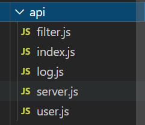

# VUE封装axios api

### 1 request.js

1、首先新建`request.js`文件，用来创建axios实例，这文件可以放在util目录中，也可以放在api目录中

```js
import axios from 'axios';
import qs from 'qs';

const service = axios.create({
    // baseURL: 'http://localhost:8080/api',
    baseURL: process.env.NODE_ENV === 'production' ? 'http://110.40.230.26:8081/' : 'http://localhost:8080/api',
    // 超时时间
    // timeout: 10000
});

service.interceptors.request.use(
    config => {
        // 设置请求头，添加token
        const Token = localStorage.getItem('login_token') ? JSON.parse(localStorage.getItem('login_token')).token : null;
        Token && (config.headers.Token = Token);
        // 有需要的话，可以转换数据格式
        if (config.method === 'post') {
            config.data = qs.stringify(config.data, { arrayFormat: 'repeat' });
        }
        return config;
    },
    error => {
        console.log(error);
        return Promise.reject();
    }
);

// 设置post请求头
service.defaults.headers.post['Content-Type'] = 'application/x-www-form-urlencoded;charset=utf-8';

service.interceptors.response.use(
    response => {
        if (response.status === 200) {
            // 这里的返回结果，关乎使用时的处理逻辑
            return response.data;
        } else {
            Promise.reject(response);
        }
    },
    // 在error里面可以根据状态码刷新token，或者重新登陆什么的
    error => {
        console.log(error);
        return Promise.reject(error);
    }
);

export default service;

```

可以看这个博客:[token刷新](https://blog.csdn.net/C_guoqing/article/details/120893653)

### 2 user.js

然后是api目录



定义api管理文件，统一管理，可以与后端对应，每个表建立一个文件夹，也可以根据自己的想法划分文件，这里的目的就是模块化，比如`user.js`，里面，一般就放user有关的api

```js
import request from '../utils/request';

const user = {
    login(data) {
        return request({
            url: '/login',
            method: 'post',
            data: data
        });
    },

    registerUser(data) {
        return request({
            url: '/user/registerUser',
            data: data,
            method: 'post'
        });
    },

    searchUser(params) {
        return request({
            url: '/user/searchUser',
            method: 'get',
            params: params
        });
    },

};

export default user;
```


### 3 index.js

然后创建`index.js`文件，统一引入所有api，统一导出

```js
import user from './user';
import server from './server';
import log from './log';
import filter from './filter';

export default {
  user,
  server,
  log,
  filter
}
```


### 4 全局引入

先到`main.js`中全局引入

```js
// 引入api
import api from './api/index.js';
// 挂载到全局vue原型上
Vue.prototype.$api = api;
```


### 5 使用示例

使用，以login为例

```js
this.$refs.login.validate(async (valid) => {
    if (valid) {
        try {
            const res = await this.$api.user.login(this.param);
            // 注意，这里的处理逻辑，与你前面定义的拦截器是相关的，可以自己定义规则
            if (res.code == 2000) {
                this.$message.success('登录成功');
                localStorage.setItem('login_token', JSON.stringify(res.data));
                this.$router.push('/');
            } else {
                this.$message.error(res.msg);
            }
        } catch (error) {
            console.log(error);
            this.$message.error('登陆失败');
        }
    } else {
        this.$message.error('请输入账号和密码');
        console.log('error submit!!');
        return false;
    }
});
```

参考：[链接](https://www.cnblogs.com/chaoyuehedy/p/9931146.html)

