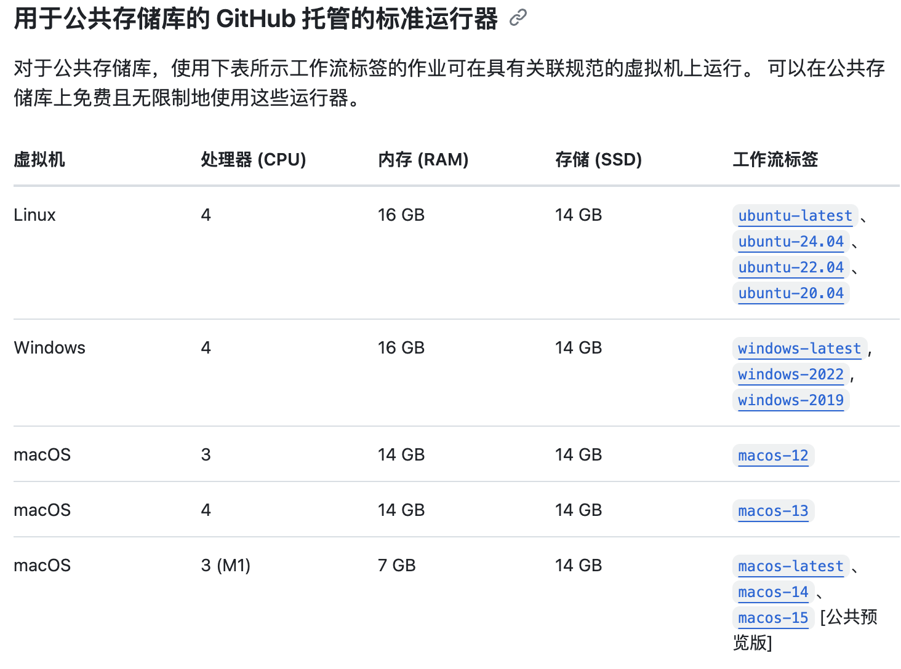
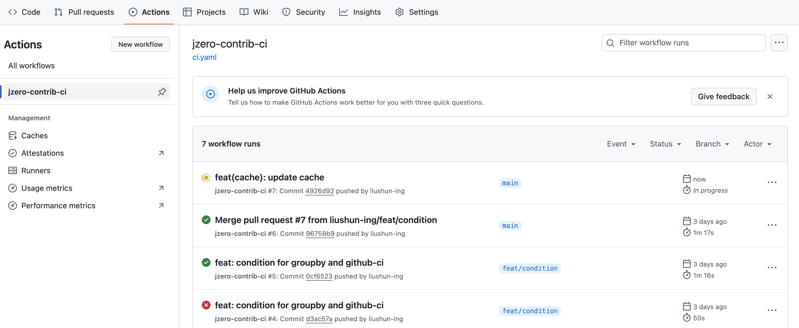
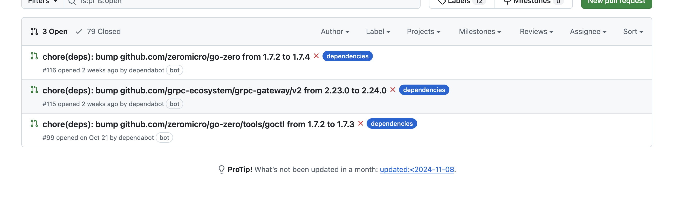

# Github Action

GitHub Actions 是一种持续集成和持续交付 (CI/CD) 平台，可用于自动执行生成、测试和部署管道。


## 介绍

持续集成由很多操作组成，比如抓取代码、运行测试、登录远程服务器，发布到第三方服务等等。GitHub 把这些操作就称为 actions。

很多操作在不同项目里面是类似的，完全可以共享。GitHub 注意到了这一点，想出了一个很妙的点子，允许开发者把每个操作写成独立的脚本文件，存放到代码仓库，使得其他开发者可以引用。

如果需要某个 action，不必自己写复杂的脚本，直接引用他人写好的 action 即可，整个持续集成过程，就变成了一个 actions 的组合。GitHub 做了一个[官方市场](https://github.com/marketplace?type=actions)，可以搜索到他人提交的 actions。

每个 action 就是一个独立脚本，因此可以做成代码仓库，使用`userName/repoName`的语法引用 action。比如，`actions/setup-go@v5`就表示`github.com/actions/setup-go`这个[仓库](https://github.com/actions/setup-node)，它代表一个 action，作用是安装go。

既然 actions 是代码仓库，当然就有版本的概念，用户可以引用某个具体版本的 action。

 ```bash
 actions/setup-go@74bc508 # 指向一个 commit
 actions/setup-go@v1.0    # 指向一个标签
 actions/setup-go@master  # 指向一个分支
 ```


## 基本概念

GitHub Actions 术语：

1. **workflow** （工作流程）：持续集成一次运行的过程，就是一个 workflow。
2. **job** （任务）：一个 workflow 由一个或多个 jobs 构成，含义是一次持续集成的运行，可以完成多个任务。
3. **step**（步骤）：每个 job 由多个 step 构成，一步步完成。
4. **action** （动作）：每个 step 可以依次执行一个或多个命令（action）。


## workflow文件

GitHub Actions 的配置文件叫做 workflow 文件，存放在代码仓库的`.github/workflows`目录。

workflow 文件采用 YAML 格式，文件名可以任意取，但是后缀名统一为`.yml/yaml`，比如`foo.yml`。一个库可以有多个 workflow 文件。GitHub 只要发现`.github/workflows`目录里面有`.yml`文件，就会自动运行该文件。

workflow 文件的配置字段非常多，[官方文档](https://docs.github.com/zh/actions/writing-workflows/workflow-syntax-for-github-actions)。下面只介绍一些基本字段。

name：name是workflow的名称，如果省略该字段，默认为当前workflow的文件名。

on：on指定出发workflow的条件，通常是某些事件。

```yml
on: push
on: [push, pull_request]
on:
	push:
		branches:
			- master
on:
  schedule:
    # * is a special character in YAML so you have to quote this string
    - cron:  '30 5,17 * * *'
```

他支持很多种类型的事件：如push事件，或者合并pull_request，还可以限定分支或tag，也可以是cron的定时任务。

jobs.<jon_id>.name：workflow文件的主体是jobs字段，标识要执行一项或多项任务。

jobs字段里面，需要写出每一项任务的job_id，job_id里的name字段是任务的说明。

```yml
jobs:
	first_job:
		name: aaa
	second_job:
		name: bbb
```

jobs.<job_id>.needs：needs字段指定当前任务的依赖关系，即运行顺序

```yml
jobs:
  job1:
  job2:
    needs: job1
  job3:
    needs: [job1, job2]
```

jobs.<job_id>.runs-on：runs-on字段指定运行所需要的虚拟机环境，是必填字段，下面是一些可用的环境



jobs.<job_id>.steps：steps字段指定每个job的运行步骤，可以包含一个或多个步骤，每个步骤都可以指定以下三个字段：

- `jobs.<job_id>.steps.name`：步骤名称。
- `jobs.<job_id>.steps.run`：该步骤运行的命令或者 action。
- `jobs.<job_id>.steps.env`：该步骤所需的环境变量。


下面是一个完整的实例：

```yml
name: golangci-gotest-ci

on:
  push:
    paths-ignore:
      - '**.md'
  pull_request:

jobs:
  golangci:
    name: ci
    runs-on: ubuntu-latest
    steps:
      - name: Checkout # 获取源码
        uses: actions/checkout@v4
        with:
          fetch-depth: 0

      - uses: actions/setup-go@v5 # 安装 go
        with:
          go-version: '1.22.3'

      - name: golangci-lint # 安装golangci-lint并检查
        uses: golangci/golangci-lint-action@v6
        with:
          # Optional: version of golangci-lint to use in form of v1.2 or v1.2.3 or `latest` to use the latest version
          version: latest

          # Optional: working directory, useful for monorepos
          working-directory: ./

          # Optional: golangci-lint command line arguments.
          args: --timeout 300s --verbose

          # Optional: show only new issues if it's a pull request. The default value is `false`.
          # only-new-issues: true

          # Optional: if set to true then the action will use pre-installed Go.
          skip-go-installation: true

          # Optional: if set to true then the action don't cache or restore ~/go/pkg.
          skip-pkg-cache: true

          # Optional: if set to true then the action don't cache or restore ~/.cache/go-build.
          # skip-build-cache: true
          
      - name: run test case # 执行所有单元测试
        run: |
          go test ./...
```

只需要在代码仓库中创建`.github/workflows`，创建一个yml文件，并写入上面内容，然后推送到远程仓库，以后每次push代码或者合并pr的时候都会自动执行go的代码静态检查和单元测试的运行。



就可以在github的actions中看到该任务了。


## Dependabot

Dependabot 可帮助随时掌握依赖项生态系统。 使用 Dependabot，可以保持依赖项为最新状态，从而解决供应链中的任何潜在安全问题。

Dependabot 由三种不同的功能组成，可帮助你管理依赖项：

- Dependabot alerts：就存储库中使用的依赖项中的漏洞问题通知你。
- Dependabot security updates：自动引发拉取请求，以更新你使用的具有已知安全漏洞的依赖项。
- Dependabot version updates：自动引发拉取请求以使依赖项保持最新。


### 版本更新

通过将 `dependabot.yml` 配置文件签入存储库的 `.github` 目录，可启用 Dependabot version updates。 Dependabot 然后提出拉取请求，使配置的依赖项保持最新。 然后就是写配置文件了。

```yml
version: 2 # 必填项。该文件必须以 version: 2 开头。
updates:
  - package-ecosystem: "gomod"
    directory: "/"
    schedule:
      interval: "daily"
      time: "10:00"
    labels:
      - "dependencies"
  - package-ecosystem: "github-actions"
    directory: "/"
    schedule:
      interval: "daily"
      time: "10:00"
    labels:
      - "dependencies"
```

- `package-ecosystem` 指定包管理器。 有关支持的包管理器的详细信息，去看“`dependabot.yml` 文件配置选项”中的 [`package-ecosystem`](https://docs.github.com/zh/code-security/dependabot/dependabot-version-updates/configuration-options-for-the-dependabot.yml-file#package-ecosystem)。
- `directory` 指定清单或其他定义文件的位置。 有关详细信息，去看“`dependabot.yml` 文件配置选项”中的 [`directory`](https://docs.github.com/zh/code-security/dependabot/dependabot-version-updates/configuration-options-for-the-dependabot.yml-file#directory)。

- `directories` 用于指定多个清单或其他定义文件的位置。 去看“`dependabot.yml` 文件的配置选项”中的 [`directories`](https://docs.github.com/zh/code-security/dependabot/dependabot-version-updates/configuration-options-for-the-dependabot.yml-file#directories)。

- `schedule.interval` 指定检查新版本的频率。 去看“`dependabot.yml` 文件配置选项”中的 [`schedule.interval`](https://docs.github.com/zh/code-security/dependabot/dependabot-version-updates/configuration-options-for-the-dependabot.yml-file#scheduleinterval)。

就可以看到bot他会自动提交一些更新依赖包的pr。

