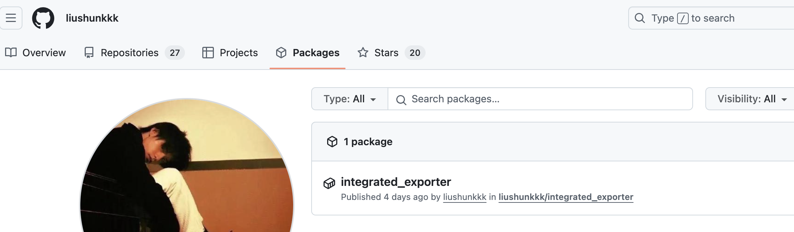

# release-ci

记录如何通过Github-ci来实现自动打包和发布go程序二进制包和docker镜像。


## 二进制包

go程序的二进制打包可以通过`go-releaser`来实现，[官网在这](https://goreleaser.com/customization/)。

### 1 创建`go-releaser`配置文件

在项目的根目录下创建`.goreleaser.yaml`文件。根据需要配置好需要打包的文件。

下面给出一个配置推荐：基本够用了

```yaml
version: 2

#project_name: myproject

# Default: './dist'.
#dist: another-folder-that-is-not-dist

before:
  hooks:
    - go mod tidy

builds:
  -
    env:
      - CGO_ENABLED=0
#    gcflags:
#      - 'all=-N -l'
    goos:
      - linux
      - windows
      - darwin
    goarch:
      - amd64
      - arm64

archives:
  - format: tar.gz
    # this name template makes the OS and Arch compatible with the results of `uname`.
    name_template: >-
      {{ .ProjectName }}_
      {{- title .Os }}_
      {{- if eq .Arch "amd64" }}x86_64
      {{- else if eq .Arch "386" }}i386
      {{- else }}{{ .Arch }}{{ end }}
      {{- if .Arm }}v{{ .Arm }}{{ end }}
    # use zip for windows archives
    format_overrides:
      - goos: windows
        format: zip

changelog:
  filters:
    exclude:
      - "^docs:"
      - "^test:"
      - "^debug:"

force_token: github
```


### 2 本地尝试发布

可以在本地使用go-releaser程序来判断配置文件是否有问题，打出来的包是否可运行。当然也可以直接到线上测试hh

安装`go-releaser`，注意，要求go的版本在`1.23.4`及以上。

```sh
go install github.com/goreleaser/goreleaser/v2@latest
```

然后检查配置文件：

```sh
goreleaser check
```

然后打包文件，注意打包的时候，它是根据git操作来实现的，因此在你打包之前，需要先提交本地修改，并且创建一个tag

```sh
goreleaser build --clean # clean会清理之前打包的
```


可以看到根目录多了个dist目录，然后里面就是他打包的可执行文件。


### 3 使用action发布

创建一个新的action即可，下面是一个样例，给予写权限和传递GITHUB_TOKEN。

```yaml
name: go-releaser-ci

on:
  push:
    # run only against tags
    tags:
      - v*

permissions:
  contents: write

jobs:
  releaseProgram:
    runs-on: ubuntu-latest
    steps:
      - name: Checkout
        uses: actions/checkout@v4
        with:
          fetch-depth: 0

      - name: Set up Go
        uses: actions/setup-go@v5
        with:
          go-version: '1.23.4'

      - name: Run GoReleaser
        uses: goreleaser/goreleaser-action@v6
        with:
          distribution: goreleaser
          args: release --clean
        env:
          GITHUB_TOKEN: ${{ secrets.GITHUB_TOKEN }}
```

然后，你就可以提交一个tag了，这样github会自动执行这个action，然后进行打包。

然后在releases下，就可以看到发布的版本包了


## docker镜像

虽然go-releaser也有打包镜像功能，最好还是使用专用的docker-action吧

### 1 编写Dockerfile文件

这个就根据自己的需要编写即可

注意这里取了巧，我们将这个发布docker镜像和发布release放在一个action执行，我们就可以直接利用go-releaser打得二进制包，他的路径可以在github-action的执行日志中找到，下面的COPY指令的源二进制路径就是在日志中找到的。其实通过本地的尝试，也可以知道他就是在dist目录下。

```dockerfile
# Use official Golang image with Alpine for a lightweight base
FROM golang:alpine

# Set environment variables
ENV CGO_ENABLED=0

# Add image metadata
LABEL org.opencontainers.image.title="integrated_exporter" \
      org.opencontainers.image.description="Integrated Exporter" \
      org.opencontainers.image.url="https://github.com/liushunkkk/integrated_exporter" \
      org.opencontainers.image.documentation="https://github.com/liushunkkk/integrated_exporter#readme" \
      org.opencontainers.image.source="https://github.com/liushunkkk/integrated_exporter" \
      org.opencontainers.image.licenses="Apache-2.0 license" \
      maintainer="liushun <liushun0311@zju.edu.cn>"

# Set the working directory
WORKDIR /app

# Copy binaries for different architectures
COPY dist/integrated_exporter_linux_amd64_v1/integrated_exporter /dist/integrated_exporter_linux_amd64/integrated_exporter
COPY dist/integrated_exporter_linux_arm64_v8.0/integrated_exporter /dist/integrated_exporter_linux_arm64/integrated_exporter

# Select the appropriate binary based on the architecture
RUN if [ "$(go env GOARCH)" = "amd64" ]; then \
      cp /dist/integrated_exporter_linux_amd64/integrated_exporter ./integrated_exporter; \
    elif [ "$(go env GOARCH)" = "arm64" ]; then \
      cp /dist/integrated_exporter_linux_arm64/integrated_exporter ./integrated_exporter; \
    fi

# Install dependencies and clean up
RUN apk update --no-cache \
    && apk add --no-cache tzdata ca-certificates \
    && rm -rf /dist /go/pkg/mod /go/pkg/sumdb

# Copy configuration files
COPY etc/etc.yaml ./etc/etc.yaml
COPY etc/.env.yaml ./etc/.env.yaml

# Expose the application port
EXPOSE 6070

# Set the default command
ENTRYPOINT ["./integrated_exporter", \
            "server", \
            "--port=6070", \
            "--config=./etc/etc.yaml", \
            "--env=./etc/.env.yaml"]
```


### 2 编写action

我们在上一个action上追加即可，具体的配置可以去各个action的仓库的文档查看。

```yaml
name: go-releaser-ci

on:
  push:
    # run only against tags
    tags:
      - v*

permissions:
  contents: write

jobs:
  releaseProgram:
    runs-on: ubuntu-latest
    steps:
      - name: Checkout
        uses: actions/checkout@v4
        with:
          fetch-depth: 0

      - name: Set up Go
        uses: actions/setup-go@v5
        with:
          go-version: '1.23.4'

#      - name: Set up Docker # macos 没有预装 docker，且只支持 macos-13
#        uses: docker/setup-docker-action@v4
#        env:
#          LIMA_START_ARGS: --cpus 4 --memory 8

      - name: Run GoReleaser
        uses: goreleaser/goreleaser-action@v6
        with:
          distribution: goreleaser
          args: release --clean
        env:
          GITHUB_TOKEN: ${{ secrets.GITHUB_TOKEN }}

      - name: Get version
        id: get_version
        run: echo VERSION=$GITHUB_REF_NAME >> $GITHUB_OUTPUT

      - name: Log in to Docker Hub
        uses: docker/login-action@v3
        with:
          username: ${{ vars.DOCKER_HUB_USERNAME }}
          password: ${{ secrets.DOCKER_HUB_PASSWORD }}

      - name: Login to GitHub Container Registry
        uses: docker/login-action@v3
        with:
          registry: ghcr.io
          username: ${{ github.repository_owner }}
          password: ${{ secrets.ACCESS_PACKAGE_TOKEN }}

      - name: Set up QEMU
        uses: docker/setup-qemu-action@v3

      - name: Set up Docker Buildx
        uses: docker/setup-buildx-action@v3

      - name: Docker build and push
        uses: docker/build-push-action@v6
        with:
          context: .
          platforms: linux/amd64, linux/arm64
          push: true
          tags: |
            liushun311/integrated_exporter:latest
            liushun311/integrated_exporter:${{ steps.get_version.outputs.VERSION }}
            ghcr.io/liushunkkk/integrated_exporter:latest
            ghcr.io/liushunkkk/integrated_exporter:${{ steps.get_version.outputs.VERSION }}
```


### 3 注意点

1、最好使用ubuntu-latest进行发布，因为它自带了docker程序，如果使用mac的话，还需要再引入一个`setup-docker-action`，并且这个action在latest上不支持，需要是`macos-13`才支持。可以看[支持的机器](https://docs.github.com/zh/actions/writing-workflows/workflow-syntax-for-github-actions#jobsjob_idruns-on)。

2、登陆GitHub Container Registry的时候，password最好自己在设置里创建personal access token，赋予package的所有权限，文档里写的可以用GITHUB_TOKEN，但是我尝试的时候是不行的，不知道哪出了问题，还是直接创建PAT省事。

3、[Dockerhub](https://hub.docker.com/)需要创建账号，然后需要注意自己命名空间，不是昵称，是可以用于登陆的用户名。


### 4 结果

dockerhub


github的ghcr是需要配置的，才能在仓库的packages里显示。



在packages里，然后右下角进入你的package的设置，在里面绑定package的项目即可。


