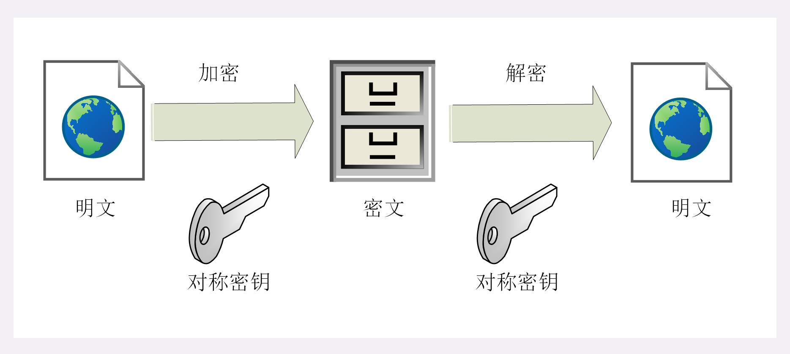

# HTTP协议

## 概念

**超文本传输协议（HTTP）是一种通信协议**，他允许将超文本标记语言（HTML）文档从web服务器传送到客户端的浏览器。HTTP是一个**属于应用层的面向对象的协议**，由于其简洁、快速的方式，适用于分布式超媒体信息系统。

Web是一种基于超文本和HTTP的、全球性的、动态交互的、跨平台的**分布式图形信息系统**。是建立在internet上的一种网络服务，为浏览者在internet上查找和浏览信息提供了图形化的、易于访问的直观界面，其中的文档及超级链接将internet上的信息节点组织成一个互为关联的网状结构。


## TCP/IP

### 协议内容

HTTP协议是构建在TCP/IP协议之上的，是TCP/IP协议族的一个子集

TCP/IP协议族是由一个四层协议组成的系统，这四层分别为：应用层、传输层

网络层和数据链路层。

应用层：

应用层一般是编写的应用程序，决定了向用户提供的应用服务。应用层可以通过系统调用与传输层进行通信，如FTP、DNS、HTTP等。

传输层：

传输层通过系统调用向应用层提供处于网络连接中的两台计算机之间的数据传输功能，包括TCP和UDP。

网络层：

网络层是用来处理在网络上流动的数据包，数据包时网络传输的最小数据单位。该层规定了通过怎样的路径（传输路线）到达对方计算机，并把数据包传输给对方。

链路层：

链路层用来处理连接网络的硬件部分，包括控制操作系统、硬件设备驱动、NIC网络适配器以及光纤等物理可见部分，硬件上的范畴均在链路层的作用范围之内。

### 封装过程


### 数据传输过程


发送端发送数据时，数据会从上层传输到下层，且每经过一层都会被打上该层的头部信息。而接受端接收数据时，数据会从下层传输到上层，传输前会把下层的头部信息删除。


### TCP三次握手

使用TCP协议进行通信的双方必须先建立连接，然后才能开始传输数据。为了确保连接双方可靠性，在建立连接时，TCP协议采用三次握手策略。


第一次握手：客户端发送带有SYN标志的连接请求报文段，然后进入SYN_SEND状态，等待服务端确认。(服务端确认自身接收正常)

第二次握手：服务端接收到客户端的SYN报文段后，需要发送ACK消息信息对这个SYN报文段进行确认。同时，还要发送自己的SYN请求信息。服务端会将上述信息放到一个报文段（SYN+ACK报文段）中，一并发送给客户端，此时服务端进入SYN_RECV状态。（客户端确认自身发送和接收正常）

第三次握手：客户端收到服务端的SYN+ACK报文段后，会向服务端发送ACK确认报文段，这个报文段发送完毕后，客户端和服务端都进入ESTABLISHED状态，完成TCP三次握手。（服务端确认自身发送正常）


## DNS域名解析

通常访问一个网站，使用的是主机名或域名来进行访问，相较于IP地址，域名更容易让人记住，但TCP/IP协议使用的是IP来访问的，必须有个机制把服务把域名转换为IP地址。DNS（Domain Name System 的缩写）解决了这个问题：提供域名到IP地址之间的解析服务。

### 查询过程

可以是用`dig`来查询域名解析过程，可能查询别的域名不止下面展示的这些信息。有些需要认证，就会有其他信息。


第一段是查询参数和统计。

第二段是查询内容：表明查询域名`baidu.com`的`A`记录，`A`是Address的缩写。

第三段是DNS服务器的答复：结果显示`baidu.com`由一个A记录，即一个IP地址，`1`是TTL值（Time to live），表示缓存时间。

第四段是DNS服务器的一些传输信息：显示本机的DNS服务器是`198.18.0.2`，查询端口是53，这是DNS服务器的默认端口，以及回应长度是73字节。

使用`+short`参数可以查看最终结果

```shell
dig +short google.com
198.18.0.237
```


### DNS服务器

本机一定要知道DNS服务器的IP地址，否则上不了网。DNS服务器的IP地址可能是动态的，每次上网时由网关分配，这叫做DHCP机制；也有可能是事先指定的固定地址，Linux系统中DNS服务器的IP地址保存在`/etc/resolv.conf`文件中。


上图中的DNS服务器是`198.18.0.2`，这是一个内网地址。

也可以使用公网的DNS服务器，最有名的就是Google的`8.8.8.8`和Level 3的`4.2.2.2`。


dig默认是请求自己的DNS服务器，也可以指定向哪个DNS服务器查询。


可以看到通过谷歌的DNS服务器，查到的百度的ip有两个，还和本地的都不一样。


### 域名层级

DNS服务器怎么会知道每个域名的IP地址呢？答案是分级查询。

在前面的查询中，每个域名的尾部都多了一个点，这是因为每个域名的尾部都有一个根域名。

举例来说，`www.example.com`的真正的域名时www.example.com.root，简写为`www.example.com.`。因为，根域名`.root`对于所有域名都是一样的，所以平时是省略的。

根域名的下一级，叫做"顶级域名"（top-level domain，缩写为TLD），比如`.com`、`.net`；再下一级叫做"次级域名"（second-level domain，缩写为SLD），比如`www.example.com`里面的`.example`，这一级域名是用户可以注册的；再下一级是主机名（host），比如`www.example.com`里面的`www`，又称为"三级域名"，这是用户在自己的域里面为服务器分配的名称，是用户可以任意分配的。

域名的层级结构如下：

```
主机名.次级域名.顶级域名.根域名
# 即
host.sld.tld.root
```


### 根域名服务器

DNS服务器根据域名的层级，进行分级查询。

需要明确的是，每一级域名都有自己的NS记录（name server），NS记录指向该级域名的域名服务器。这些服务器知道下一级域名的各种记录。

所谓分级查询，就是从根域名开始，依次查询每一级域名的NS记录，直到查到最终的IP地址，过程大致如下：

> 1. 从"根域名服务器"查到"顶级域名服务器TLD"的NS记录和A记录（IP地址）
> 2. 从"顶级域名服务器"查到"次级域名服务器（权限域名服务器）"的NS记录和A记录（IP地址）
> 3. 从"次级域名服务器"查出"主机名"的IP地址

仔细看上面的过程，没有提到DNS服务器怎么知道"根域名服务器"的IP地址。回答是"根域名服务器"的NS记录和IP地址一般是不会变化的，所以内置在DNS服务器里面。

目前，世界上一共有十三组根域名服务器，从`A.ROOT-SERVERS.NET`一直到`M.ROOT-SERVERS.NET`。


### 查询模式

**递归查询**


**迭代查询**


递归查询: 如果主机所询问的本地域名服务器不知道被查询域名的 IP 地址，那么本地域名服务器就以 DNS 客户端的身份，向其他根域名服务器继续发出查询请求报文，即替主机继续查询，而不是让主机自己进行下一步查询。

迭代查询：当根域名服务器收到本地域名服务器发出的迭代查询请求报文时，要么给出所要查询的IP 地址，要么告诉本地服务器下一步应该找哪个域名服务器进行查询，然后让本地服务器进行后续的查询。

由于递归查询对于被查询的域名服务器负担太大，通常采用以下模式：从请求主机到本地域名服务器的查询是递归查询，而其余的查询是迭代查询，其实也就是第二张图。

### 分级查询实例

dig命令的`+trace`参数可以显示DNS的整个分级查询过程


第一段列出根域名`.`的所有NS记录，即所有根域名服务器。

根据内置的根域名服务器IP地址，DNS服务器向所有这些IP地址发出查询请求，询问`baidu.com`的顶级域名服务器`com.`的NS记录。最先回复的根域名服务器将被缓存，以后只向这台服务器发请求。


上面显示`.com`域名的13条NS记录，同时返回每一条记录对应的IP地址。

然后DNS服务器向这些顶级域名服务器发出查询请求，询问次级域名`baidu.com`的NS记录。


上面显示了baidu.com的四条NS记录，同时返回的还有每一条NS记录对应的IP地址。

然后DNS服务器向上面这四台NS服务器查询baidu.com其实也是`www.baidu.com`的主机名


结果显示，baidu.com有两条A记录，即这两个IP地址都能访问到百度的网站，并且还显示，最先返回的结果的NS服务器是`ns1.baidu.com`，IP地址是`198.18.1.30`。


### NS记录查询

`dig`命令可以单独查看每一级域名的NS记录。+short参数可以显示简化的结果。

```bash
$ dig ns com
$ dig ns baidu.com
```


### DNS记录类型

域名与IP之间的对应关系，称为"记录"（record）。根据使用场景，"记录"可以分成不同的类型（type），前面已经看到了有`A`记录和`NS`记录。

常见的DNS记录类型如下。

> （1） `A`：地址记录（Address），返回域名指向的IP地址。
>
> （2） `NS`：域名服务器记录（Name Server），返回保存下一级域名信息的服务器地址。该记录只能设置为域名，不能设置为IP地址。
>
> （3）`MX`：邮件记录（Mail eXchange），返回接收电子邮件的服务器地址。
>
> （4）`CNAME`：规范名称记录（Canonical Name），返回另一个域名，即当前查询的域名是另一个域名的跳转，详见下文。
>
> （5）`PTR`：逆向查询记录（Pointer Record），只用于从IP地址查询域名，详见下文。

一般来说，为了服务的安全可靠，至少应该有两条`NS`记录，而`A`记录和`MX`记录也可以有多条，这样就提供了服务的冗余性，防止出现单点失败。

`CNAME`记录主要用于域名的内部跳转，为服务器配置提供灵活性，用户感知不到。举例来说，`facebook.github.io`这个域名就是一个`CNAME`记录。`facebook.github.io`的CNAME记录指向`github.map.fastly.net`。也就是说，用户查询`facebook.github.io`的时候，实际上返回的是`github.map.fastly.net`的IP地址。这样的好处是，变更服务器IP地址的时候，只要修改`github.map.fastly.net`这个域名就可以了，用户的`facebook.github.io`域名不用修改。

由于`CNAME`记录就是一个替换，所以域名一旦设置`CNAME`记录以后，就不能再设置其他记录了（比如`A`记录和`MX`记录），这是为了防止产生冲突。举例来说，`foo.com`指向`bar.com`，而两个域名各有自己的`MX`记录，如果两者不一致，就会产生问题。由于顶级域名通常要设置`MX`记录，所以一般不允许用户对顶级域名设置`CNAME`记录。

`PTR`记录用于从IP地址反查域名。`dig`命令的`-x`参数用于查询`PTR`记录。

```bash
$ dig -x 192.30.252.153

;; QUESTION SECTION:
;153.252.30.192.in-addr.arpa.	IN	PTR

;; ANSWER SECTION:
153.252.30.192.in-addr.arpa. 1483 IN	PTR	lb-192-30-252-153-iad.github.com.
```

逆向查询的一个应用，是可以防止垃圾邮件，即验证发送邮件的IP地址，是否真的有它所声称的域名。

`dig`命令可以查看指定的记录类型。

```bash
$ dig a github.com
$ dig ns github.com
$ dig mx github.com
```


### 其他DNS工具

除了`dig`，还有一些其他小工具也可以使用。

**（1）host 命令**

`host`命令可以看作`dig`命令的简化版本，返回当前请求域名的各种记录。

```sh
 liushun@ls  ~  host baidu.com
baidu.com has address 198.18.0.233
baidu.com mail is handled by 10 mx.maillb.baidu.com.
baidu.com mail is handled by 20 jpmx.baidu.com.
baidu.com mail is handled by 20 mx1.baidu.com.
baidu.com mail is handled by 15 mx.n.shifen.com.
baidu.com mail is handled by 20 mx50.baidu.com.
baidu.com mail is handled by 20 usmx01.baidu.com.
```

`host`命令也可以用于逆向查询，即从IP地址查询域名，等同于`dig -x <ip>`。

```sh
 liushun@ls  ~  host 34.226.211.254
254.211.226.34.in-addr.arpa domain name pointer ec2-34-226-211-254.compute-1.amazonaws.com.
```

**（2）nslookup 命令**

`nslookup`命令用于互动式地查询域名记录。

```sh
 liushun@ls  ~  nslookup
> baidu.com
Server:		198.18.0.2
Address:	198.18.0.2#53

Name:	baidu.com
Address: 198.18.0.233
> github.com
Server:		198.18.0.2
Address:	198.18.0.2#53

Name:	github.com
Address: 198.18.0.15
> 
```

**（3）whois 命令**

`whois`命令用来查看域名的注册情况。

```sh
whois baidu.com
```

然后会打印一长串东西。


## 协议结构和通讯原理

### 特点

HTTP 是简约的

大体上看，HTTP 被设计得简单且易读，尽管在 HTTP/2 中，HTTP 消息被封装进帧（frame）这点引入了额外的复杂度。HTTP 报文能够被人读懂并理解，向开发者提供了更简单的测试方式，也对初学者降低了门槛。

HTTP 是可扩展的

在 HTTP/1.0 中引入的 [HTTP 标头](https://developer.mozilla.org/zh-CN/docs/Web/HTTP/Headers)让该协议易于扩展和实验。只要服务器客户端之间对新标头的语义经过简单协商，新功能就可以被加入进来。

HTTP 无状态，但并非无会话

HTTP 是无状态的：在同一个连接中，两个执行成功的请求之间是没有关系的。这就带来了一个问题，用户没有办法在同一个网站中进行连贯的交互，比如在电商网站中使用购物车功能。尽管 HTTP 根本上来说是无状态的，但借助 HTTP Cookie 就可使用有状态的会话。利用标头的扩展性，HTTP Cookie 被加进了协议工作流程，每个请求之间就能够创建会话，让每个请求都能共享相同的上下文信息或相同的状态。

### 报文

#### 请求报文


报文头：

通用报文头


Connection：keep-alive：当一个网页打开完成后，客户端和服务器之间用于传输HTTP数据的TCP连接不会关闭，如果客户端再次访问这个服务器的网页，会继续使用这一条已经建立的连接。

Connect：close：代表一个request完成后，客户端和服务器之间用于传输HTTP数据的TCP连接会关闭，当客户端再次发送request，需要重新建立TCP连接。

请求报文头


这是针对浏览器的声明，如可接受的媒体类型，语言，字符集等等

Host：用于指定被请求资源的Internet主机和端口号

Referer：浏览器告诉服务器是从哪个页面链接过来的，服务器可以获取该信息进行处理

User-Agent：客户端使用的操作系统和浏览器的名称和版本


响应报文头


实体报文头


#### 响应报文


### 状态码


200：请求成功，请求所希望的响应头或数据体将随此响应返回

202：Accepted，已接受请求，但未处理完成

206：partial content部分内容，服务器成功处理了部分get请求

301：moved permanently，永久移动，请求的资源已被永久的移动到新URI，返回信息会包括新的URI，浏览器会自动定向到新URI，今后任何新的请求都会使用新的URI代替。

302：found，临时移动，与301类型，但是资源只是临时被移动，客户端应继续使用原有URI

304：not modified，服务器指代当前资源没有修改，使用缓存

400：bad request，客户端请求的语法错误，服务器无法理解

401：unauthorized，请求要求用户的身份认证

403：forbidden，服务器拒绝执行客户端的请求

404：not found，服务器无法根据客户端的请求找到资源

500：internal server error，服务器内部错误，无法完成请求

502：bad gateway，从充当网关或代理的远端服务器收到一个无效的请求。


### 状态管理

**Cookie**

Cookie实际上是一小段的文本信息，客户端请求服务器，如果服务器需要记录该用户状态，就向客户端浏览器颁发一个Cookie。

客户端浏览器会把Cookie保存起来，当浏览器在请求该网站时，浏览器把请求的网址连通该Cookie一同提交给服务器。服务器检查Cookie，以此来辨认用户状态。

`cookie存储的数据量有限`，不同的浏览器有不同的存储大小，但一般不超过4KB。

Cookie在生成时就会被指定一个Expire值，这就是Cookie的生存周期，在这个周期内Cookie有效，超出周期Cookie就会被清除。有些页面将Cookie的生存周期设置为“0”或负值，这样在关闭浏览器时，就马上清除Cookie，不会记录用户信息，更加安全。

**Session**

Session是另一种记录客户状态的机制，保存在服务器上，客户端浏览器访问服务器时，服务器把客户端信息以某种形式记录在服务器上。

客户端再次访问时，只需要从该Session中查找该客户的状态即可。


### 字符集与编码


常见的编码规范有ASCII码，GBK（中文），Unicode（所有字符），一种编码规范可能有多种编码方式，比如unicode编码规范有utf8，utf16等编码方式。


**URL的编解码**

URL是采用ASCII字符集进行编码的，所以如果URL中含有非ASCII字符集中的字符或者一些保留字符，如&作为参数分隔符，就需要对其进行编码。

`%编码`规范：对URL中属于ASCII字符集的非保留字不做编码；对URL中的保留字需要取其ASCII内码，然后加上%前缀将该字符进行编码；对于URL中的非ASCII字符需要取其Unicode内码，然后加上%前缀将该字符进行编码。


### 身份认证

HTTP常见认证方式：BASIC基本认证，DIGEST摘要认证，SSL客户端认证，FormBase基于表单认证

**BASIC认证**


**DIGEST认证**

DIGEST认证同样使用质询/响应的方式，但不会像BASIC认证那样直接发送明文密码。


**SSL客户端认证**

SSL客户端认证是借由HTTPS的客户端证书完成认证的方式。凭借客户端证书认证，服务器可确认访问是否来自己登陆的客户端。

**基于表单的认证**

基于表单的认证方法并不是在HTTP协议中定义的，是由Web应用程序各自实现的，通过Cookie和Session的方式来保持用户状态。


### 长短连接

HTTP协议是基于请求/响应模式的，因此只要服务端给了响应，本次HTTP请求就结束了。HTTP的长连接和短连接本质上是TCP的长连接和短连接。

HTTP/1.0中，默认使用的是短连接，浏览器和服务器每进行一次HTTP操作，就建立一次连接，结束就中断。

HTTP/1.1起，默认使用长连接，用以保持连接特性，就是请求头和相应头中都会设置Connect：keep-alive。


### 中介

#### 代理


代理作用

一些抓包的工具的原理就是作为一个代理。

匿名访问：代理服务器可以去除http报文中一些身份标识

过滤器：可以进行请求拦截等过滤访问内容


#### 网关

网关，可以作为某种翻译器使用，抽象出了一种能够到达资源的方法，它是资源和应用程序之间的粘合剂

————如何理解这句话？
首先，现如今Web应用越来越复杂，需要加载的资源的种类也越来越多，因此单个应用程序已经无法做到能够处理所有这些能够想到的资源，为了获取多种不同资源，就需要访问多个应用程序（多个服务器、服务器下多个应用程序），这些应用程序可能在同一个网络段下，也可能在不同的网络段下，那么对于这些各种不同资源所在的多个网络段，就可以使用一个网关连接起来，网关可以是一个服务器，可以是一个路由器，也可以是一个软件，客户端请求资源时，只要向网关请求，网关再请求对应的资源然后返回给客户端

————网关和代理服务器是不同的，网关还有另一个重要作用：协议转换
对于多个网络段下、多个服务器、应用程序之间，他们使用的网络传输协议可能是不同的，这时候网关就可以充当 “翻译”，对两个网络段中使用不同传输协议的数据进行互相的翻译转换

（代理服务器连接的是相同协议的两端、网关连接的是不同协议的两端）


Web网关：

Web网关在一侧使用HTTP协议，在另一侧使用另一种协议：<客户端协议>/<服务器端协议>

1、（HTTP/）服务器端网关：通过HTTP协议与客户端对话，通过其他协议与服务器端通信。

2、（/HTTP）客户端网关：通过其他协议与客户端对话，通过HTTP协议与服务端通信。

常见网关类型：

1、（HTTP/*）服务端Web网关：客户端通过HTTP协议请求，网关去与其他协议的服务器端通信。

2、（HTTP/HTTPS）服务器端安全网关：客户端使用HTTP协议，网关对客户端请求加密后，使用HTTPS和服务器通信。

3、（HTTPS/HTTP）客户端安全加速器网关：网关将客服端发送过来的加密的HTTP请求解密，然后再向服务器发送解密后的HTTP请求——网关中的解密软件解密效率高，因此无需服务器解密，减轻了服务器负担——现在很多云端都采用这种方式，HTTPS入、内网则调用HTTP。

4、资源网关：客户端发送HTTP资源请求到服务器，服务器并不直接返回响应，而是将请求通过网关的api发送给运行在服务器上的运行程序，应用程序返回响应资源给客户端，经典微服务中的gateway程序。


### HTTP缓存

HTTP 缓存会存储与请求关联的响应，并将存储的响应复用于后续请求。

可复用性有几个优点。首先，由于不需要将请求传递到源服务器，因此客户端和缓存越近，响应速度就越快。最典型的例子是浏览器本身为浏览器请求存储缓存。

此外，当响应可复用时，源服务器不需要处理请求——因为它不需要解析和路由请求、根据 cookie 恢复会话、查询数据库以获取结果或渲染模板引擎。这减少了服务器上的负载。


**缓存头部字段**

Cache-Control：请求/响应头，缓存控制字段

- no-store：所有内容都不缓存
- no-cache：缓存，但是浏览器使用缓存前，都会请求服务器判断缓存资源是否是最新
- max-age=x秒：请求缓存后的x秒内不再发起请求
- s-maxage=x秒：代理服务器请求源站缓存后的x秒内不再发起请求，支队CDN缓存有效
- public：客户端和代理服务器CDN都可缓存
- private：只有客户端可以缓存

Expires：响应头

- 代表资源过期时间，由服务器返回提供，是http1.0的属性，在与max-age共存的情况下，优先级要低。

Last-Modified：响应头

- 资源最新修改时间，由服务器告诉浏览器

If-Modified-Since：请求头

- 资源最新修改时间，由浏览器告诉服务器，和Last-Modified是一对，他两会进行对比。

Etag：响应头

- 资源标识，由服务器告诉浏览器

If-None-Match：请求头

- 缓存资源标识，由浏览器告诉服务器（其实就是上次服务器给的Etag），和Etag是一对，这两进行对比


**场景**

1、服务器和浏览器约定一个文件过期时间-Expires

服务器在返回资源时，设置Expires，浏览器在Expires时间内使用缓存。但是在Expires时间过期后，资源仍然可能没更改过。

2、让服务器与浏览器在约定文件过期时间基础上，再加上一个文件最新修改时间的对比——Last-Modified和If-Modified-Since。

服务器首次请求返回过期时间和Last-Modified，expires过期后，浏览器请求时带上If-Modified-Since，如果时间一致，则服务端返回304，告诉浏览器继续使用缓存。（expires不可靠，时间戳不够精准）

3、在2的基础上，再添加一个文件内容唯一对比标记——Etag和If-None-Match。Expires不稳定，再加入一个max-age来加以代替

这种模式下1和2中的设置就不生效了，虽然他还会有，但是优先级比这几个低。


**改进方案**

Md5/hash缓存

上面的方案中，浏览器都是被动的请求服务器，而无法主动感知文件是否变化了。现有的流行方案中，使用md5/hash缓存。

也就是对于静态文件，服务器会给他加上一个md5或者hash标识，只要文件存在说明没有改变，浏览器可以一直使用缓存，每次更改静态文件时，文件的标识都会不一样，前端打包的时候就是这个道理。


CDN缓存

CDN是构建在网络之上的内容分发网络，依靠部署在各地的边缘服务器，通过中心平台的负载均衡、内容分发、调度等功能模块，使用户就近获取所需内容，降低网络阻塞，提高用户访问响应速度和命中率。

其实通俗来说就是浏览器和服务器之间加了一个中间层，浏览器访问时，先访问CDN，如果CDN上的缓存没过期，就使用CDN上的。


**浏览器操作对缓存的影响**


mac上强制刷新是`command + shift + R`或者按住`shift`点击网页刷新。


### 内容协商机制

客户端和服务器端就响应的资源内容进行交涉，然后提供给客户端最为合适的资源，内容协商会以响应资源的语言，字符集，编码方式等作为判断的基准。

**协商方式**

- 客户端驱动：客户端发起请求，服务器发送可选项列表，客户端做出选择后再发送第二次请求。
- 服务器驱动：服务器检查客户端的请求头部集并决定提供哪个版本的页面
- 透明协商：某个中间设备，通常是缓存代理，代表客户端进行协商。

服务器驱动-请求首部集

Accept：告知服务器发送何种媒体类型

Accept-Language：告知服务器发送何种语言

Accept-Charset：告知服务器发送何种字符集

Accept-Encoding：告知服务器采用何种编码

还有Content-Type，Content-Language，Content-Encoding等等。

比如：`Accept-Language: en;q=0.5, fr;q=0.0, nl;q=1.0, tr;q=0.0`q越大表明最期待哪种语言，为0标识不接受那种语言。


### 断点续传和多线程下载

HTTP是通过在Header头里两个参数实现的，客户端发请求时对应的是Range，服务器端响应时对应的是Content-Range。

Range：

用于请求头中，指定需要下载的第一个字节的位置和最后一个字节的位置

Range: unit=[first byte pos]-[last byte pos]

Content-Range:

用于响应头中，在发出带Range的请求后，服务器会在Content-Range头部返回当前接受的范围和文件总大小。一般格式为：`Content-Range: unit [first byte pos] - [last byte pos]/[entity length]`

实例：

下载一个1024k的文件，已经下载了512k，网络中断恢复后，客户端请求续传，需要在http请求头中申明本次续传片段：`Range: bytes=512000-`

服务端收到断点续传请求后，从512k位置开始传输文件，并在HTTP头中增加：`Content-Range: bytes 521000-/1024000`，并且服务器返回的状态码是`206`，而不是`200`。


## 安全的HTTPS

HTTP协议传输数据是明文传输，任意的人抓包就能看到传输的数据，这显然不安全。1994年，Netscape 公司用加密协议增加了 HTTP，开始在 HTTP 的基础上加入 SSL 即安全套接层（Secure Socket Layer）。称为 "HTTP over SSL" 或者 "HTTP Secure"，也就是 HTTPS。

HTTPS 其实是一个“非常简单”的协议，RFC 文档很小，只有短短的 7 页，里面规定了新的协议名“https”，默认端口号 443。

### SSL/TSL

SSL/TLS是位于TCP/IP 7层协议中的会话层，用于认证用户和服务器，加解密数据以及维护数据的完整性，确保数据在传输过程中不会被修改。


SSL 有 v2 和 v3 两个版本，而 v1 因为有严重的缺陷从未公开过。1999 年改名为 TLS（传输层安全，Transport Layer Security），正式标准化，版本号从 1.0 重新算起，所以 TLS1.0 实际上就是 SSLv3.1。

目前应用的最广泛的 TLS 是 1.2。TLS 由记录协议、握手协议、警告协议、变更密码规范协议、扩展协议等几个子协议组成，综合使用了对称加密、非对称加密、身份认证等许多密码学前沿技术。浏览器和服务器在使用 TLS 建立连接时需要选择一组恰当的加密算法来实现安全通信，这些算法的组合被称为“密码套件”（cipher suite，也叫加密套件）。

SSL/TLS分为对称加密和非对称加密两种方式。

#### 对称加密

对称加密是指加密和解密都用同一份密钥。如下图所示：



AES 的意思是“高级加密标准”（Advanced Encryption Standard），密钥长度可以是 128、192 或 256，是应用最广泛的对称加密算法。

对称加密看上去好像完美地实现了机密性，但其中有一个很大的问题：如何把密钥安全地传递给对方，术语叫“密钥交换”。

因为在对称加密算法中只要持有密钥就可以解密。如果约定的密钥在传递途中被黑客窃取，那他就可以在之后随意解密收发的数据，通信过程也就没有机密性可言了。

所以就出现了非对称加密，也叫公钥加密算法。

#### 非对称加密

非对称加密对应于一对密钥，称为私钥和公钥，用私钥加密后需要用公钥解密，用公钥加密后需要用私钥解密。两个密钥是不同的，“不对称”，公钥可以公开给任何人使用，而私钥必须严格保密。如下图所示：


非对称加密可以解决“密钥交换”的问题。网站秘密保管私钥，在网上任意分发公钥，想要登录网站只要用公钥加密就行了，密文只能由私钥持有者才能解密。而黑客因为没有私钥，所以就无法破解密文。

非对称加密算法的设计要比对称算法难得多，在 TLS 里只有很少的几种，比如 DH、DSA、RSA、ECC 等。

- RSA 可能是其中最著名的一个，几乎可以说是非对称加密的代名词，它的安全性基于“整数分解”的数学难题，使用两个超大素数的乘积作为生成密钥的材料，想要从公钥推算出私钥是非常困难的。10 年前 RSA 密钥的推荐长度是 1024，但随着计算机运算能力的提高，现在 1024 已经不安全，普遍认为至少要 2048 位。
- ECC（Elliptic Curve Cryptography）是非对称加密里的“后起之秀”，它基于“椭圆曲线离散对数”的数学难题，使用特定的曲线方程和基点生成公钥和私钥，子算法 ECDHE 用于密钥交换，ECDSA 用于数字签名。

比起 RSA，ECC 在安全强度和性能上都有明显的优势。160 位的 ECC 相当于 1024 位的 RSA，而 224 位的 ECC 则相当于 2048 位的 RSA。因为密钥短，所以相应的计算量、消耗的内存和带宽也就少，加密解密的性能就上去了，对于现在的移动互联网非常有吸引力。

> 对称加密的优点是运算速度快，缺点是互联网环境下无法将密钥安全的传送给对方。非对称加密的优点是可以安全的将公钥传递给对方，但是运算速度慢。

#### TLS做法

TLS把对称加密和非对称加密结合起来，两者互相取长补短，即能高效地加密解密，又能安全地密钥交换。

1. 在通信刚开始的时候使用非对称算法，比如 RSA、ECDHE，首先解决密钥交换的问题。
2. 然后用随机数产生对称算法使用的“会话密钥”（session key），再用公钥加密。因为会话密钥很短，通常只有 16 字节或 32 字节，所以慢一点也无所谓。
3. 对方拿到密文后用私钥解密，取出会话密钥。这样，双方就实现了对称密钥的安全交换，后续就不再使用非对称加密，全都使用对称加密。


### 数字签名与证书

黑客虽然拿不到会话密钥，无法破解密文，但可以通过窃听收集到足够多的密文，再尝试着修改、重组后发给网站。因为没有完整性保证，服务器只能“照单全收”，然后他就可以通过服务器的响应获取进一步的线索，最终就会破解出明文。

另外，黑客也可以伪造身份发布公钥。如果你拿到了假的公钥，混合加密就完全失效了。你以为自己是在和“某宝”通信，实际上网线的另一端却是黑客，银行卡号、密码等敏感信息就在“安全”的通信过程中被窃取了。

所以，在机密性的基础上还必须加上完整性、身份认证等特性，才能实现真正的安全。


#### 摘要算法和完整性

实现完整性的手段主要是摘要算法（Digest Algorithm），也就是常说的散列函数、哈希函数（Hash Function）。

可以把摘要算法近似地理解成一种特殊的压缩算法，它能够把任意长度的数据“压缩”成固定长度、而且独一无二的“摘要”字符串，就好像是给这段数据生成了一个数字“指纹”。换一个角度，也可以把摘要算法理解成特殊的“单向”加密算法，它只有算法，没有密钥，加密后的数据无法解密，不能从摘要逆推出原文。

因为摘要算法对输入具有“单向性”和“雪崩效应”，输入的微小不同会导致输出的剧烈变化，所以也被 TLS 用来生成伪随机数（PRF，pseudo random function）。

目前 TLS 推荐使用的是 SHA-2。SHA-2 实际上是一系列摘要算法的统称，总共有 6 种，常用的有 SHA224、SHA256、SHA384，分别能够生成 28 字节、32 字节、48 字节的摘要。

不过摘要算法不具有机密性，如果明文传输，那么黑客可以修改消息后把摘要也一起改了，网站还是鉴别不出完整性。所以，真正的完整性必须要建立在机密性之上，在混合加密系统里用会话密钥**加密消息和摘要**，这样黑客无法得知明文，也就没有办法动手脚了。这有个术语，叫哈希消息认证码（HMAC）。


#### 数字签名

加密算法结合摘要算法，通信过程可以说是比较安全了。但这里还有漏洞，就是通信的两个端点（endpoint）缺少了身份认证。

现实生活中，解决身份认证的手段是签名和印章，只要在纸上写下签名或者盖个章，就能够证明这份文件确实是由本人而不是其他人发出的。

在这里，使用非对称加密里的“私钥”再加上摘要算法，就能够实现“数字签名”，同时实现“身份认证”和“不可否认”。

数字签名的原理其实很简单，就是把公钥私钥的用法反过来，之前是公钥加密、私钥解密，现在是私钥加密、公钥解密。

但又因为非对称加密效率太低，所以私钥只加密原文的摘要，这样运算量就小的多，而且得到的数字签名也很小，方便保管和传输。

签名和公钥一样完全公开，任何人都可以获取。但这个签名只有用私钥对应的公钥才能解开，拿到摘要后，再比对原文验证完整性，就可以像签署文件一样证明消息确实是你发的。


刚才的这两个行为也有专用术语，叫做“签名”和“验签”。

只要你和网站互相交换公钥，就可以用“签名”和“验签”来确认消息的真实性，因为私钥保密，黑客不能伪造签名，就能够保证通信双方的身份。

比如，你用自己的私钥签名一个消息“我是小明”。网站收到后用你的公钥验签，确认身份没问题，于是也用它的私钥签名消息“我是某宝”。你收到后再用它的公钥验一下，也没问题，这样你和网站就都知道对方不是假冒的，后面就可以用混合加密进行安全通信了。

#### 数字证书和CA

因为谁都可以发布公钥，所以黑客可以伪造公钥，无法判断某个公钥属于谁。

可以用类似密钥交换的方法来解决公钥认证问题，用别的私钥来给公钥签名，显然，这又会陷入“无穷递归”。要终结这个“死循环”，就必须引入“外力”，找一个公认的可信第三方，让它作为“信任的起点，递归的终点”，构建起公钥的信任链。

这个“第三方”就是常说的 **CA（Certificate Authority，证书认证机构）**。它就像网络世界里的公安局、教育部、公证中心，具有极高的可信度，由它来给各个公钥签名，用自身的信誉来保证公钥无法伪造，是可信的。CA 对公钥的签名认证也是有格式的，不是简单地把公钥绑定在持有者身份上就完事了，还要包含序列号、用途、颁发者、有效时间等等，把这些打成一个包再签名，**完整地证明公钥关联的各种信息，形成“数字证书”（Certificate）**。

知名的 CA 全世界就那么几家，比如 DigiCert、VeriSign、Entrust、Let’s Encrypt 等，它们签发的证书分 DV、OV、EV 三种，区别在于可信程度。

DV 是最低的，只是域名级别的可信，背后是谁不知道。EV 是最高的，经过了法律和审计的严格核查，可以证明网站拥有者的身份（在浏览器地址栏会显示出公司的名字，例如 Apple、GitHub 的网站）。

> 不过，CA 怎么证明自己呢？

这还是信任链的问题。小一点的 CA 可以让大 CA 签名认证，但链条的最后，也就是Root CA，就只能自己证明自己了，这个就叫“自签名证书”（Self-Signed Certificate）或者“根证书”（Root Certificate）。你必须相信，否则整个证书信任链就走不下去了。


有了这个证书体系，操作系统和浏览器都内置了各大 CA 的根证书，上网的时候只要服务器发过来它的证书，就可以验证证书里的签名，顺着证书链（Certificate Chain）一层层地验证，直到找到根证书，就能够确定证书是可信的，从而里面的公钥也是可信的。

### HTTPS 建立连接

当在浏览器地址栏里键入“https”开头的 URI，再按下回车，会发生什么呢？

浏览器首先要从 URI 里提取出协议名和域名。因为协议名是“https”，所以浏览器就知道了端口号是默认的 443，它再用 DNS 解析域名，得到目标的 IP 地址，然后就可以使用三次握手与网站建立 TCP 连接了。

在 HTTP 协议里，建立连接后，浏览器会立即发送请求报文。但现在是 HTTPS 协议，它需要再用另外一个“握手”过程，也就是TSL握手，在 TCP 上建立安全连接，之后才是收发 HTTP 报文。

下面的这张图简要地描述了 TLS 的握手过程，其中每一个“框”都是一个记录，多个记录组合成一个 TCP 包发送。所以，最多经过两次消息往返（4 个消息）就可以完成握手，然后就可以在安全的通信环境里发送 HTTP 报文，实现 HTTPS 协议。

