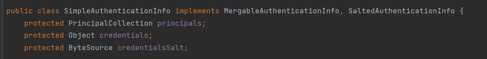

# Shiro入门

## 介绍

Apache Shiro 是 Java 的一个安全（权限）框架。

Shiro 可以完成：认证、授权、加密、会话管理、与Web 集成、缓存等。

shiro功能，重点是认证和授权功能


- **Authentication**:身份认证/登录，验证用户是不是拥有相应的身份
- **Authorization**:授权，即权限验证，验证某个已认证的用户是否拥有某个权限；即判断用户是否能进行什么操作，如：验证某个用户是否拥有某个角色。或者细粒度的验证某个用户对某个资源是否具有某个权限
- Session Management:会话管理，即用户登录后就是一次会话，在没有退出之前，它的所有信息都在会话中；会话可以是普通JavaSE环境，也可以是Web 环境的

- Cryptography:加密，保护数据的安全性，如密码加密存储到数据库，而不是明文存储

- Web Support:Web 支持，可以非常容易的集成到Web 环境

- Caching:缓存，比如用户登录后，其用户信息、拥有的角色/权限不必每次去查，这样可以提高效率

- Concurrency:Shiro支持多线程应用的并发验证，即如在一个线程中开启另一个线程，能把权限自动传播过去

- Testing:提供测试支持

- “Run As”:允许一个用户假装为另一个用户（如果他们允许）的身份进行访问

- Remember Me:记住我，这个是非常常见的功能，即一次登录后，下次再来的话不用登录了
  


## shiro架构

宏观来看：由三个组件构成Subject，SecurityManager，Realm


Subject：应用代码直接交互的对象是Subject，也就是说Shiro的对外API 核心就是Subject。Subject 代表了当前“用户”，这个用户不一定是一个具体的人，与当前应用交互的任何东西都是Subject，如网络爬虫，机器人等；与Subject 的所有交互都会委托给SecurityManager；Subject 其实是一个门面，SecurityManager才是实际的执行者

SecurityManager：安全管理器；即所有与安全有关的操作都会与SecurityManager交互；且其管理着所有Subject；它是Shiro的核心，它负责与Shiro的其他组件进行交互，它相当于SpringMVC中DispatcherServlet的角色

Realm：Shiro从Realm 获取安全数据（如用户、角色、权限），SecurityManager要验证用户身份，它需要从Realm 获取相应的用户进行比较以确定用户身份是否合法；也需要从Realm 得到用户相应的角色/权限进行验证用户是否能进行操作；可以把Realm 看成DataSource

微观来看


- **Subject**：任何可以与应用交互的“用户”；
- **SecurityManager**：是Shiro的心脏；所有具体的交互都通过SecurityManager进行控制；它管理着所有Subject、且负责进行认证、授权、会话及缓存的管理。
- **Authenticator**：负责Subject 认证，是一个扩展点，可以自定义实现；可以使用认证策略（Authentication Strategy），即什么情况下算用户认证通过了；
- **Authorizer**：授权器、即访问控制器，用来决定主体是否有权限进行相应的操作；即控制着用户能访问应用中的哪些功能；
- **Realm**：可以有1 个或多个Realm，可以认为是安全实体数据源，即用于获取安全实体的；可以是JDBC 实现，也可以是内存实现等等；由用户提供；所以一般在应用中都需要实现自己的Realm；
- SessionManager：管理Session 生命周期的组件；
- CacheManager：缓存控制器，来管理如用户、角色、权限等的缓存的；因为这些数据基本上很少改变，放到缓存中后可以提高访问的性能
- Cryptography：密码模块，Shiro提高了一些常见的加密组件用于如密码加密/解密。


## 简单示例

```java
public class Quickstart {
  public static void main(String[] args) {
      // 读取配置文件:
      Factory<SecurityManager> factory = new IniSecurityManagerFactory("classpath:shiro.ini");
      SecurityManager securityManager = factory.getInstance();
SecurityUtils.setSecurityManager(securityManager);
      // 获取当前的用户对象 Subject
      Subject currentUser = SecurityUtils.getSubject();
      //通过当前用户拿到Shiro的Session 可以脱离web存值取值
      Session session = currentUser.getSession();
      session.setAttribute("someKey", "aValue");
      String value = (String) session.getAttribute("someKey");
      if (value.equals("aValue")) {
          log.info("Retrieved the correct value! [" + value + "]");
      }
      //判断当前的用户是否被认证
      if (!currentUser.isAuthenticated()) {
          //Token 令牌
          UsernamePasswordToken token = new UsernamePasswordToken("lonestarr", "vespa");
          //设置记住我
          token.setRememberMe(true);
          try {
              //执行登录操作
              currentUser.login(token);
          } catch (UnknownAccountException uae) {
              log.info("There is no user with username of " + token.getPrincipal());
          } catch (IncorrectCredentialsException ice) {
              log.info("Password for account " + token.getPrincipal() + " was incorrect!");
          } catch (LockedAccountException lae) {
              log.info("The account for username " + token.getPrincipal() + " is locked.  " +
                      "Please contact your administrator to unlock it.");
          } catch (AuthenticationException ae) {

          }
      }
      // 检查角色
      if (currentUser.hasRole("schwartz")) {
          log.info("May the Schwartz be with you!");
      } else {
          log.info("Hello, mere mortal.");
      }
      //粗粒度权限
      if (currentUser.isPermitted("lightsaber:wield")) {
          log.info("You may use a lightsaber ring.  Use it wisely.");
      } else {
          log.info("Sorry, lightsaber rings are for schwartz masters only.");
      }
      //细粒度权限
      if (currentUser.isPermitted("winnebago:drive:eagle5")) {
          log.info("You are permitted to 'drive' the winnebago with license plate (id) 'eagle5'.  " +
                  "Here are the keys - have fun!");
      } else {
          log.info("Sorry, you aren't allowed to drive the 'eagle5' winnebago!");
      }
      //注销
      currentUser.logout();
  }
}
```


## 整合到springboot

可在ShiroConfig中的getShiroFilterFactoryBean方法中添加如下配置

anon： 无需认证就可以访问
authc： 必须认证了才能访问
user： 必须拥有记住我功能才能用
perms： 拥有对某个资源的权限才能访问
roles： 拥有某个角色权限

```java
Map<String, String> filterMap = new LinkedHashMap<>();
filterMap.put("/user/add","authc");
filterMap.put("/user/update","authc");
filterMap.put("/user/add","perms[user:add]");
filterMap.put("/user/update","perms[user:update]");
filterMap.put("/secret","authc,roles[admin]");  
bean.setFilterChainDefinitionMap(filterMap);
```


### 登陆接口

登录接口是可匿名访问接口，若用户名密码正确，则生成jwt并返回即可

```java
public LoginResponseBody login(LoginRequestBody loginRequestBody) {

  // 查询用户
  User user = userMapper.selectOne(new LambdaQueryWrapper<User>().eq(User::getAccount, loginRequestBody.getAccount()));
  if (user == null) {
    throw new UserNotFoundException();
  }
  if (user.getIsDisabled() == 1) {
    throw new UserInvalidException();
  }
  // 需要加密后进行判断
  if (!user.getPassword().equals(PasswordMD5.getPasswordMD5(loginRequestBody.getPassword()))) {
    throw new PasswordErrorException();
  }
  String token;
  try {
    // 生成token
    token = this.JWTUtil.sign(user.getAccount());
  } catch (Exception e) {
    e.printStackTrace();
    throw new SignTokenException();
  }
  return LoginResponseBody.builder()
      .userId(user.getUserId())
      .account(user.getAccount())
      .nickname(user.getNickname())
      .authority(user.getAuthority())
      .type(user.getType())
      .token(token)
      .build();
}
```

### 认证类

我们需自定义继承于AuthorizingRealm的类，称为userRealm，该类需重写3个方法，分别是：

- supports：为了让AuthorizingRealm支持jwt的凭证校验
- doGetAuthorizationInfo：定义权限校验的过程，访问非匿名借口时是否具有权限
- doGetAuthenticationInfo：进行用户认证校验，即在访问非匿名接口时，判断请求是否携带了正确的jwt

shiro默认supports的是UsernamePasswordToken，而我们现在采用了jwt的方式，所以这里我们需要自定义一个JwtToken，来完成shiro的supports方法。JwtToken需要实现AuthenticationToken接口，AuthenticationToken接口中定义了两个方法getPrincipal和getCredentials，本意分别是表示获取用户信息，以及获取只被Subject 知道的秘密值。由于我们无法直接从jwt中获得用户的全部信息，只能从jwt中解析出用户名或用户ID，再从数据库中查询才能得到用户实体，所以这两个方法我们都返回jwt token。这样可能有违本意，但不会影响程序运行

```java
public class JwtToken implements AuthenticationToken {
  private String token;

  public JwtToken(String jwt) {
      this.token = jwt;
  }

  @Override
  public Object getPrincipal() {
      return token;
  }

  @Override
  public Object getCredentials() {
      return token;
  }
}
```

doGetAuthenticationInfo方法中定义用户认证校验过程，该方法处理的是非匿名接口的访问，会去判断请求是否具有正确的JWT。该方法的返回值为AuthenticationInfo接口，表示用户信息的载体，我们可以返回SimpleAuthenticationInfo类，该类间接实现了了AuthenticationInfo接口：



该类第一个属性表示用户信息，第二个表示密码，也就是凭证，第三个表示当前realm的名字

完整的UserRealm如下：

```java
public class UserRealm extends AuthorizingRealm {

  @Resource private UserMapper userMapper;

  Logger logger = Logger.getLogger(UserRealm.class);

  /** 重写此方法，不然Shiro会报错 */
  @Override
  public boolean supports(AuthenticationToken token) {
    return token instanceof JWTToken;
  }

  // 授权
  @Override
  protected AuthorizationInfo doGetAuthorizationInfo(PrincipalCollection principals) {
    String account = JWTUtil.getAccount(principals.toString());
    User user = userMapper.selectOne(new LambdaQueryWrapper<User>().eq(User::getAccount, account));
    SimpleAuthorizationInfo simpleAuthorizationInfo = new SimpleAuthorizationInfo();
    switch (user.getAuthority()) {
      case 0:
        simpleAuthorizationInfo.addRole(Roles.Admin.getRole());
        break;
      case 1:
        simpleAuthorizationInfo.addRole(Roles.User.getRole());
      default:
        break;
    }
    return simpleAuthorizationInfo;
  }
  // 验证
  @Override
  protected AuthenticationInfo doGetAuthenticationInfo(AuthenticationToken auth)
      throws AuthenticationException {
    // 这里的auth就是刚刚定义的JwtToken
    String token = (String) auth.getCredentials();
    // 解密获得account，用于和数据库进行对比
    String account = JWTUtil.getAccount(token);
    if (account == null) {
      throw new AuthenticationException("token invalid");
    }

    User admin = userMapper.selectOne(new LambdaQueryWrapper<User>().eq(User::getAccount, account));
    if (admin == null) {
      throw new AuthenticationException("User didn't existed!");
    }
    // 第一个参数可以放用户信息，这里直接使用token了
    return new SimpleAuthenticationInfo(token, token, "userRealm");
  }
}
```

### JwtFilter

所有的请求都会首先经过该过滤器，我们需自定义过滤器JwtFilter，该类继承于Shiro内置的AuthenticatingFilter，AuthenticatingFilter内置了登录方法executeLogin
  我们需要重写以下方法：

- createToken：我们需要从http请求的header中拿到jwt，并将其封装成我们自定义的JwtToken
- onAccessDenied：进行拦截校验过程，当请求不含JWT时，我们直接通过放行（因为匿名也能访问一些接口，即使匿名去访问需要权限的接口，也会被权限注解拦截，因此是安全的）；当带有JWT的时候，首先我们校验jwt的有效性，正确我们就直接执行executeLogin方法实现自动登录
- onLoginFailure：登录异常时候进入的方法，我们直接把异常信息封装然后抛出
- preHandle：拦截器的前置拦截，在这里由于我写的是前后端分离项目，项目中除了需要跨域全局配置之外，我们在拦截器中也需要提供跨域支持。这样，拦截器才不会在进入Controller之前就被限制了。

```java
@Component
public class JwtFilter extends AuthenticatingFilter {

  @Override
  protected boolean onAccessDenied(ServletRequest servletRequest, ServletResponse servletResponse) throws Exception {
      HttpServletRequest request = (HttpServletRequest) servletRequest;
      String jwt = request.getHeader("Authorization");
      if (StringUtils.isEmpty(jwt)) {
          return true;
      } else {
          // 校验jwt
          Claims claims = JwtUtils.getClaimsByToken(jwt);
          if (claims == null || JwtUtils.isTokenExpired(claims)) {
              throw new ExpiredCredentialsException("token已失效，请重新登录");
          }
          // 执行登录
          return executeLogin(servletRequest, servletResponse);
      }
  }

  @Override
  protected AuthenticationToken createToken(ServletRequest servletRequest, ServletResponse servletResponse) throws Exception {
      HttpServletRequest request = (HttpServletRequest) servletRequest;
      String jwt = request.getHeader("Authorization");
      if (StringUtils.isEmpty(jwt)) {
          return null;
      }
      return new JwtToken(jwt);
  }

  @Override
  protected boolean onLoginFailure(AuthenticationToken token, AuthenticationException e, ServletRequest request, ServletResponse response) {
      HttpServletResponse httpServletResponse = (HttpServletResponse) response;
      Throwable throwable = e.getCause() == null ? e : e.getCause();
      Result result = Result.fail(throwable.getMessage());
      String json = JSONUtil.toJsonStr(result);
      try {
          httpServletResponse.getWriter().println(json);
      } catch (IOException ioException) {
      }
      return false;
  }

  @Override
  protected boolean preHandle(ServletRequest request, ServletResponse response) throws Exception {
      HttpServletRequest httpServletRequest = WebUtils.toHttp(request);
      HttpServletResponse httpServletResponse = WebUtils.toHttp(response);
      httpServletResponse.setHeader("Access-control-Allow-Origin", httpServletRequest.getHeader("Origin"));
      httpServletResponse.setHeader("Access-Control-Allow-Methods", "GET,POST,OPTIONS,PUT,DELETE");
      httpServletResponse.setHeader("Access-Control-Allow-Headers", httpServletRequest.getHeader("Access-Control-Request-Headers"));
      // 跨域时会首先发送一个OPTIONS请求，这里我们给OPTIONS请求直接返回正常状态
      if (httpServletRequest.getMethod().equals(RequestMethod.OPTIONS.name())) {
          httpServletResponse.setStatus(org.springframework.http.HttpStatus.OK.value());
          return false;
      }
      return super.preHandle(request, response);
  }
}
```

当然也可以继承别的Filter类，如BasicHttpAuthenticationFilter，需要重写的方法不一样，但是逻辑是类似的，下面是一个例子

```java
public class JWTFilter extends BasicHttpAuthenticationFilter {

  /**
   * 判断用户是否想要登入。
   * 检测header里面是否包含Authorization字段即可
   */
  @Override
  protected boolean isLoginAttempt(ServletRequest request, ServletResponse response) {
    HttpServletRequest req = (HttpServletRequest) request;
    String authorization = req.getHeader("Authorization");
    return authorization != null;
  }

  /**
   * 执行登陆方法
   */
  @Override
  protected boolean executeLogin(ServletRequest request, ServletResponse response) throws Exception {
    HttpServletRequest httpServletRequest = (HttpServletRequest) request;
    String authorization = httpServletRequest.getHeader("Authorization");
    JWTToken token = new JWTToken(authorization);
    // 提交给realm进行登入，如果错误他会抛出异常并被捕获
    getSubject(request, response).login(token);
    // 如果没有抛出异常则代表登入成功，返回true
    return true;
  }
  /**
   * 这里我们详细说明下为什么最终返回的都是true，即允许访问
   * 例如我们提供一个地址 GET /article
   * 登入用户和游客看到的内容是不同的
   * 如果在这里返回了false，请求会被直接拦截，用户看不到任何东西
   * 所以我们在这里返回true，Controller中可以通过 subject.isAuthenticated() 来判断用户是否登入
   * 如果有些资源只有登入用户才能访问，我们只需要在方法上面加上 @RequiresAuthentication 注解即可
   * 但是这样做有一个缺点，就是不能够对GET,POST等请求进行分别过滤鉴权(因为我们重写了官方的方法)，但实际上对应用影响不大
   */
  @Override
  protected boolean isAccessAllowed(ServletRequest request, ServletResponse response, Object mappedValue) {
    if (isLoginAttempt(request, response)) {
      try {
        executeLogin(request, response);
      } catch (Exception e) {
      }
    }
    return true;
  }
  /**
   * 对跨域提供支持
   */
  @Override
  protected boolean preHandle(ServletRequest request, ServletResponse response) throws Exception {
    HttpServletRequest httpServletRequest = (HttpServletRequest) request;
    HttpServletResponse httpServletResponse = (HttpServletResponse) response;
    httpServletResponse.setHeader("Access-Control-Allow-Origin", httpServletRequest.getHeader("Origin"));
    httpServletResponse.setHeader("Access-Control-Allow-Methods", "GET,POST,OPTIONS,PUT,DELETE");
    httpServletResponse.setHeader("Access-Control-Allow-Headers", httpServletRequest.getHeader("Access-Control-Request-Headers"));
    // 跨域时会首先发送一个option请求，这里我们给option请求直接返回正常状态
    if (httpServletRequest.getMethod().equals(RequestMethod.OPTIONS.name())) {
      httpServletResponse.setStatus(HttpStatus.OK.value());
      return false;
    }
    return super.preHandle(request, response);
  }
}
```

### shiro全局配置

在ShiroConfig中做3件事：

在ShiroFilterChainDefinition中，我们不再通过编码形式拦截Controller访问路径，而是所有的路由都需要经过JwtFilter这个过滤器，然后判断请求头中是否含有jwt的信息，有并且正确就进行Shiro的自动登录，没有JWT就跳过放行。跳过放行之后，有Controller中的shiro注解进行再次拦截，比如@RequiresAuthentication，这样来控制需要权限的访问，因此是安全的。还可以使用@RequiresRoles等注解设置角色权限等

```java
@Configuration
public class ShiroConfig {

  @Resource
  private UserRealm userRealm;

  @Bean("securityManager")
  public DefaultWebSecurityManager getManager(UserRealm realm) {
    DefaultWebSecurityManager manager = new DefaultWebSecurityManager();
    // 使用自己的realm
    manager.setRealm(realm);
    /*
     * 关闭shiro自带的session，详情见文档
     */
    DefaultSubjectDAO subjectDAO = new DefaultSubjectDAO();
    DefaultSessionStorageEvaluator defaultSessionStorageEvaluator = new DefaultSessionStorageEvaluator();
    defaultSessionStorageEvaluator.setSessionStorageEnabled(false);
    subjectDAO.setSessionStorageEvaluator(defaultSessionStorageEvaluator);
    manager.setSubjectDAO(subjectDAO);
    return manager;
  }
  @Bean("shiroFilter")
  public ShiroFilterFactoryBean factory(DefaultWebSecurityManager securityManager) {
    ShiroFilterFactoryBean factoryBean = new ShiroFilterFactoryBean();
    // 添加自己的过滤器并且取名为jwt
    Map<String, Filter> filterMap = new HashMap<>();
    filterMap.put("jwt", new JWTFilter());
    factoryBean.setFilters(filterMap);
    factoryBean.setSecurityManager(securityManager);
    // factoryBean.setUnauthorizedUrl("/401");
    /*
     * 自定义url规则
     * http://shiro.apache.org/web.html#urls-
     */
    Map<String, String> filterRuleMap = new HashMap<>();
    // 所有请求通过我们自己的JWT Filter
    filterRuleMap.put("/**", "jwt");
    // 代码map.put("/**", "authc")使得所有请求都需要认证才能请求成功，否则就跳转至setLoginUrl中指定的页面，
    factoryBean.setFilterChainDefinitionMap(filterRuleMap);
    return factoryBean;
  }
  /**
   * 添加注解支持
   */
  @Bean
  @DependsOn("lifecycleBeanPostProcessor")
  public DefaultAdvisorAutoProxyCreator defaultAdvisorAutoProxyCreator() {
    DefaultAdvisorAutoProxyCreator defaultAdvisorAutoProxyCreator = new DefaultAdvisorAutoProxyCreator();
    defaultAdvisorAutoProxyCreator.setProxyTargetClass(true);
    return defaultAdvisorAutoProxyCreator;
  }

  @Bean
  public LifecycleBeanPostProcessor lifecycleBeanPostProcessor() {
    return new LifecycleBeanPostProcessor();
  }

  @Bean
  public AuthorizationAttributeSourceAdvisor authorizationAttributeSourceAdvisor(DefaultWebSecurityManager securityManager) {
    AuthorizationAttributeSourceAdvisor advisor = new AuthorizationAttributeSourceAdvisor();
    advisor.setSecurityManager(securityManager);
    return advisor;
  }
  @Bean
  public UserRealm userRealm() {
    return new UserRealm();
  }
}
```

