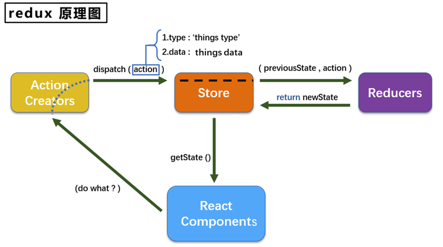
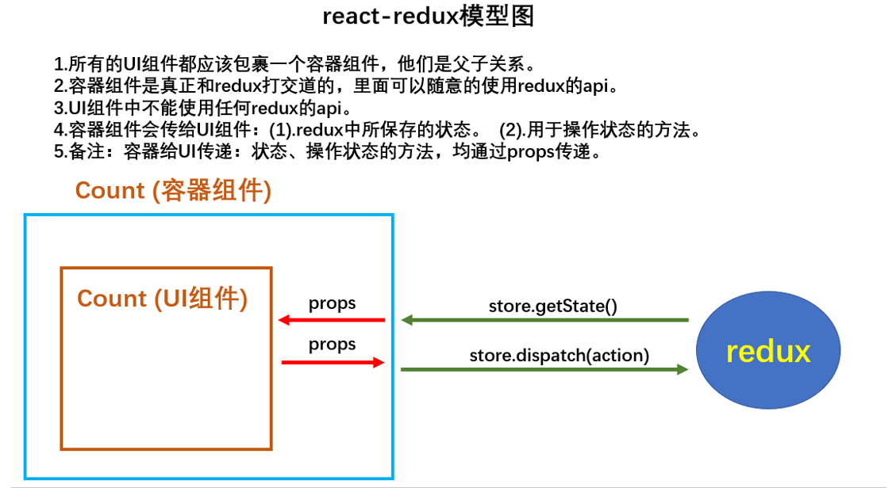

# Redux

## redux理解

### 学习文档

英文文档: https://redux.js.org/

中文文档: http://www.redux.org.cn/

Github: https://github.com/reactjs/redux

### redux是什么

redux是一个专门用于做**状态管理**的JS库(不是react插件库)。

它可以用在react, angular, vue等项目中, 但基本与react配合使用。

作用: 集中式管理react应用中多个组件**共享**的状态。

### 什么情况下需要使用redux

某个组件的状态，需要让其他组件可以随时拿到（共享）。

一个组件需要改变另一个组件的状态（通信）。

总体原则：能不用就不用, 如果不用比较吃力才考虑使用。

### 7.1.4. redux工作流程

                   


## redux的三个核心概念

### action

-  动作的对象
- 包含2个属性
  - l type：标识属性, 值为字符串, 唯一, 必要属性
  - l data：数据属性, 值类型任意, 可选属性
- 例子：{ type: 'ADD_STUDENT',data:{name: 'tom',age:18} }

### reducer

- 用于初始化状态、加工状态。
- 加工时，根据旧的state和action， 产生新的state的**纯函数**。

### store

- 将state、action、reducer联系在一起的对象
- 如何得到此对象?
  - import {createStore} from 'redux'
  - import reducer from './reducers'
  - const store = createStore(reducer)

- 此对象的功能?
  - getState(): 得到state
  - dispatch(action): 分发action, 触发reducer调用, 产生新的state
  - subscribe(listener): 注册监听, 当产生了新的state时, 自动调用


## 练习

### 简单版

(1).去除Count组件自身的状态，可以保留自己私有的state

(2).src下建立;

- -redux
  - -store.js
  - -count_reducer.js

(3).store.js:

- 1).引入redux中的createstore函数，创建一个store
- 2).createstore调用时要传入一个为其服务的reducer
- 3).记得暴露store对象

```js
// 引入createStore,专门用于创建最为核心的store对象
import {createStore} from 'redux';
//引入count组件服务的reducer
import countReducer from './count_reducer'
// 暴露store
export default createStore(countReducer)
```

(4).count_reducer.js:

- 1).reducer的本质是一个函数，接收: preState,action，返回加工后的状态
- 2).reducer有两个作用:初始化状态，加工状态
- 3 ).reducer被第一次调用时，是store自动触发的，
  - 传递的preState是undefined,
  - 传递的action是:{type : ' @@REDUX/INIT_a.2.b.4}

```js
/**
 * 该文件用于创建一个reducer,本质是一个函数
 * 参数为：preState前一个状态, action动作对象
 */
const initState = 0   // 初始化状态
export default function countReducer(preState=initState, action) {
  const {type, data} = action
  switch (type) {
    case 'increment':
      return preState + data
    case 'decrement':
      return preState - data
    default:
      return preState
  }
}
```

(5).在index.js中监测store中状态的改变，一旦发生改变重新渲染<App/>

备注: redux只负责管理状态，至于状态的改变驱动着页面的展示，要靠我们自己写。

```js
import React from "react";
import ReactDOM from "react-dom";
import "./index.css";
import App from "./App";
import reportWebVitals from "./reportWebVitals";
import store from './redux/store'

ReactDOM.render(
  <React.StrictMode>
    <App />
  </React.StrictMode>,
  document.getElementById("root")
);  

// 全局订阅redux，其实就是如果状态更新，就全部重新刷新页面
store.subscribe(() => {
  ReactDOM.render(
    <React.StrictMode>
      <App />
    </React.StrictMode>,
    document.getElementById("root")
  );  
})
reportWebVitals();

```

使用

```jsx
// 获取状态
const count = store.getState()
// 分发任务，修改状态
store.dispatch({type: 'increment', data:value*1})

```


### 完整版

新增文件:
1. count_action.js 专门用于创建action对象

```js
/**
 * 专门为count组件生成action
 */
import {INCREMENT, DECREMENT} from './constant'
export const createIncrementAction = data => ({
  type: INCREMENT,
  data
})

export const createDecrementAction = data => ({
  type: DECREMENT,
  data
})
```

1. constant.js放置容易写错的type值

```js
/**
 * 定义action对象中type类型的常量值
 */
export const INCREMENT = 'increment'
export const DECREMENT = 'decrement'
```

其余的地方就可以用这个代替

使用

```jsx
// 获取状态
const count = store.getState()
// 改变状态
store.dispatch(createIncrementAction(value*1))
```


### 异步action版

异步和同步是说action的类型是什么，同步是对象，异步是函数

(1).明确:延迟的动作不想交给组件自身，想交给action

(2) .何时需要异步action:想要对状态进行操作，但是具体的数据靠异步任务返回(非必须)。

(3).具体编码:

- `npm install redux-thunk`， 并配置在store中

```js
// 引入createStore,专门用于创建最为核心的store对象
import {createStore, applyMiddleware} from 'redux';
//引入count组件服务的reducer
import countReducer from './count_reducer'
// 引入redun-thunk,用来指出异步action,并且需要applyMiddleware支持
import thunk from 'redux-thunk'
// 暴露store
export default createStore(countReducer, applyMiddleware(thunk))
```

- 创建action的函数不再返回一般对象， 而是一个函数， 该函数中写异步任务。

```js
// 异步action返回值为函数,异步action中一般都会调用同步action
export const createIncrementAsyncAction = (data, time) => {
  // 这个函数本身就是store调用，所以可以直接传一个dispatch参数，不需要单独引入store了 
  return (dispatch) => {
    setTimeout(() => {
      dispatch(createIncrementAction(data))
    }, time);
  }
}
```

- 异步任务有结果后，分发一个同步的action去真正操作数据。

```jsx
store.dispatch(createIncrementAsyncAction(value*1, 500))
// store.dispatch({type: 'increment', data:value*1}) 可以换成上面那种写法了
```

备注:异步action不是必须要写的，完全可以自己等待异步任务的结果了再去分发同步action。


## react-redux

### 理解

- 一个react插件库
- **专门用来简化react应用中使用redux**

### react-Redux组件分类

#### UI组件

- 只负责 UI 的呈现，不带有任何业务逻辑
- 通过props接收数据(一般数据和函数)
- 不使用任何 Redux 的 API
- 一般保存在components文件夹下

#### 容器组件

- 负责管理数据和业务逻辑，不负责UI的呈现
- 使用 Redux 的 API
- 一般保存在containers文件夹下

### 模型图



