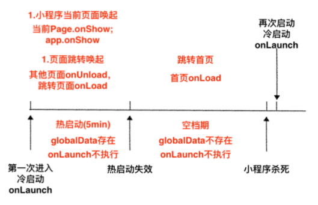
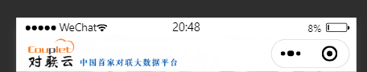
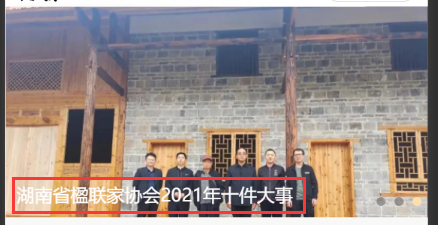

# 微信小程序

## 1、ios系统时间显示NAN

>原因如下：
>
>当进行网络请求的时候，后端返回日期格式为“2018-05-03”。iOS手机或者浏览器不支持这种类型的日期格式

解决：ios系统只支持解析以斜杠分隔的时间，所以需要用正则将时间格式转换一下

```js
// 在小程序的工具文件util.js中进行封装
function formatTime(date) {
    var time = date==null ? "" : Date.parse(date.replace(/-/g, '/')); // 时间戳
    var date = new Date(time);
    var year = date.getFullYear();
    var month = date.getMonth() + 1;
    var day = date.getDate();
    var hour = date.getHours();
    var minute = date.getMinutes();
    var second = date.getSeconds();
    return [year, month, day].map(formatNumber).join('/');
}
```


## 2、微信热启动/冷启动

### 热启动

热启动就是指关闭了小程序，或者按了home键，并且在一个时间范围内（一般为五分钟），再次打开小程序，就属于热启动。每次启动，app.js中onShow就会执行。

热启动的过程中（0-5min），小程序的数据（globalData）还是存在的。

但是热启动的方式有两种，一种是直接唤起，例如在最新使用的小程序中，点击刚才关闭的小程序，页面直接被唤起了，停留在你上一次使用的页面，包括滚动位置都是一样的，这种情况就会执行onShow，如果超过五分钟，就会重新加载，会加载到首页，执行onLoad方法。

还有一种是会跳转的，例如打开朋友分享的小程序，点到了另外的页面，然后关闭了，再次打开，会定位小程序的首页，之前打开的页面都会执行onUnload卸载掉，执行首页的onLoad方法。

热启动的过程中，onLuanch是不会执行的，所以onLuanch中最好只是设置一下GloablData。

### 冷启动

冷启动就是第一次进入小程序；或者时间很长，微信把小程序杀死了；或者小程序太占内存，被微信杀死了；或者手动杀死了微信进程，就会触发冷启动。每次触发冷启动，就会执行OnLuanch。

有一个问题，正常情况下，微信什么时候会杀死小程序进程？上面说一般为五分钟，但是并不代表，五分钟到了，就会杀死小程序，只是说五分钟到了，小程序的服务线程（小程序中有两个线程，视图线程，例如wxml，服务线程，例如js）被杀死，globalData没了。

现实情况是，微信可能很长一段时间都不会杀死小程序，也就是说，很长一段时间onLuanch都不会执行，因此会存在一段空档期（5-Xmin），在这段时间内，globalData没有了，也不会执行onLuanch。




### 如何安排？

globalData可以放在onLoad中执行

```js
onLoad(options) {
    if(!app.globalData.init){//防止重复初始化
        app.globalData.init=true;
        
        app.global.***=option.***;//接受参数
    }
}
```

某些对象需要在初始化时（app.js）挂载，可以放在onShow中执行

```js
onShow(){
    if(!this.***){//没有挂载
        this.***=****;
    }
}
```

一般登录逻辑可以放在onLuanch中执行

登陆一般涉及两个时效性，一个是setStorage，将数据放在本地存储中，时效一般比较长；第二个是we.login，他得到code，然后传给后端去换的openid等数据，session_key，session_key一般为三天，这两个时效性都比onluanch长，所以可以将登陆放在onLuanch中执行。

> [参考博客](http://www.qiutianaimeili.com/html/page/2021/04/20347wh9zpbtkre.html)


## 3、自定义导航栏

### 第一步、弃用默认的导航栏

json文件中设置

```json
"window": {
    "navigationStyle": "custom"
}
```

### 第二步、根据胶囊的位置获取导航栏的高度

#### 2.1 首先获取胶囊的信息

```js
const menuButtonInfo = wx.getMenuButtonBoundingClientRect();
```

| width | height | top        | right      | bottom     | left       |
| ----- | ------ | ---------- | ---------- | ---------- | ---------- |
| 宽度  | 高度   | 上边界坐标 | 右边界坐标 | 下边界坐标 | 左边界坐标 |



#### 2.2 获取系统信息

```js
const systemInfo = wx.getSystemInfoSync();
```

根据这个获取statusBarHeight(状态栏高度)

#### 2.3 计算高度

导航栏高度 = 状态栏到胶囊的间距（胶囊距上距离-状态栏高度） * 2 + 胶囊高度 + 状态栏高度

```js
App({
    onLaunch: function(options) {
        const that = this;
        // 获取系统信息
        const systemInfo = wx.getSystemInfoSync();
        // 胶囊按钮位置信息
        const menuButtonInfo = wx.getMenuButtonBoundingClientRect();
        // 导航栏高度 = 状态栏到胶囊的间距（胶囊距上距离-状态栏高度） * 2 + 胶囊高度 + 状态栏高度
        that.globalData.navBarHeight = (menuButtonInfo.top - systemInfo.statusBarHeight) * 2 + menuButtonInfo.height + systemInfo.statusBarHeight;
        that.globalData.menuRight = systemInfo.screenWidth - menuButtonInfo.right;
        that.globalData.menuBotton = menuButtonInfo.top - systemInfo.statusBarHeight;
        that.globalData.menuHeight = menuButtonInfo.height;
    },
    // 数据都是根据当前机型进行计算，这样的方式兼容大部分机器
    globalData: {
        navBarHeight: 0, // 导航栏高度
        menuRight: 0, // 胶囊距右方间距（方保持左、右间距一致）
        menuBotton: 0, // 胶囊距底部间距（保持底部间距一致）
        menuHeight: 0, // 胶囊高度（自定义内容可与胶囊高度保证一致）
    }
})
```

#### 2.4 自定义组件

```html
<!-- html -->
<!-- 自定义顶部栏 -->
<view class="nav_bar" style="height:{{navBarHeight}}px;">
	<!-- 导航栏背景图片 -->
	<image class="backgroundImg" style="margin-top: {{navStatusHeight}}px;" mode="widthFix" src="{{navBarImg}}"/>
</view>

<!-- 
	内容区域：
	自定义顶部栏用的fixed定位，会遮盖到下面内容，注意设置好间距
-->
<view class="content" style="margin-top:{{navBarHeight}}px;"></view>

```

```js
// js
const app = getApp()
Component({
	// 子组件传递参数
    properties: {
    },
    // 组件自己的数据
    data: {
        navBarHeight: '',
        navStatusHeight: '',
        navBarImg: "../../icons/navImage.png",
    },
    // 子组件加载
    attached: function() {
        this.setData({
            navBarHeight: app.globalData.navBarHeight,
            navStatusHeight: app.globalData.navStatusHeight
        })
    },
    methods: {

    },
    // 使用全局样式，否则无法使用图标或者图片
    options: {
        addGlobalClass: true
    }
})
```

```css
/* wxss */
.nav_bar {
  background-color: #fff;
  position: fixed;
  width: 100%;
  top: 0;
  left: 0;
  z-index: 99999;
}
.nav_bar .backgroundImg {
  position: fixed;
  height: 100%;
}

```

### 第四步、使用自定义导航栏组件

1、在json文件中引入组件

```json
"NavBar": "../../components/NavBar/NavBar",
```

2、在wxml中使用组件

```html
<!-- 自定义导航栏 -->
<NavBar></NavBar>
```


## 4、图片上叠加文字

使用relative和absolute定位

### 4.1 首先将图片和文字放在同一个父盒子下

```html
<navigator url="/pages/news_about/news_detail/index?newsId={{item.newsId}}" hover-class="none">
    <image mode="widthFix" src="{{item.newsImage}}"></image>
    <view class="news_info">
        {{item.newsTitle}}
    </view>
</navigator>
```

### 4.2 将父盒子设置为relative定位

```css
navigator{
    position: relative;
    height: 375rpx;
    width: 100%;
    padding: 0;
}
```

### 4.3 将文字设置为absolute定位，相对父盒子定位

```html
image{
    width: 100%;
    height: 375rpx;
}   
.news_info{
    position: absolute;
    left: 20rpx;
    bottom: 20rpx;
    width: 80%;
    color: #ffffff;
    // overflow: hidden;
    // white-space: nowrap;
    // text-overflow: ellipsis;
    display: -webkit-box;
    overflow: hidden;
    text-overflow: ellipsis;
    -webkit-box-orient: vertical;
    -webkit-line-clamp: 2;
} 
```

### 4.4 结果




## 5、设置轮播图指示点位置

```css
/*指示点位置*/
.wx-swiper-dots{
    position:relative;
    left: unset!important;
    right: -30rpx;
}
```

